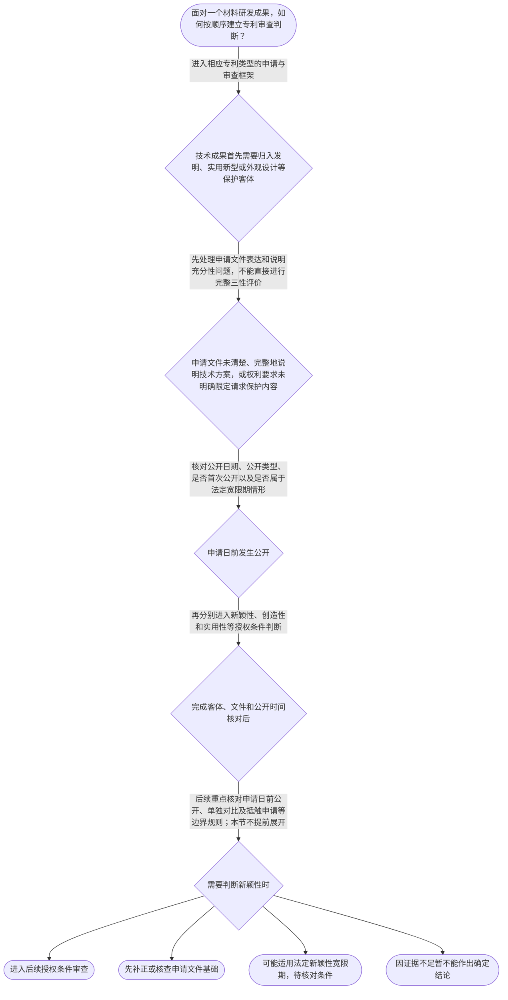

# 整合后的课程完整内容与习题

## 教学模块选择清单

- 当前教学节点：`patent-law-foundation`
- 板块预算：自适应 7/7，总计 9/9

| # | 模块 (block_type) | 类型 | 触发原因 (trigger) | 对应正文段 | 归属 |
|---:|---|:--:|---|---|:--:|
| 1 | `anchor_scenario` | 自适应 | perception=sensing(0.84) / P(L)=0.15<0.3 / affect=anxious / cold_start | 材料研发成果能否申请专利｜某材料研发团队开发出一种耐高温复合涂层，实验显示其耐热性能明显提升。团队准备申请专利，但研发… | [A] |
| 2 | `legal_anchor` | 必选 | mandatory | 专利制度的法条入口｜《专利法》第一条 | [A] |
| 3 | `worked_example` | 自适应 | cognition.apply=0.22<0.4 / cognition.analyze=0.18<0.3 / cold_start | 从材料研发事实走到制度判断｜某公司研发出一种由特定树脂、无机填料和纤维增强层组成的复合材料，并测得其耐热性能较高。公司拟… | [A] |
| 4 | `decision_flow` | 自适应 | input=visual(0.76) | 材料专利审查的基础判断流程｜面对一个材料研发成果，如何按顺序建立专利审查判断？ | [A] |
| 5 | `mnemonic` | 自适应 | understanding=sequential(0.72) | 基础审查四步表｜基础审查四步表：客—件—时—性；客看保护客体，件看申请文件，时看公开与申请日关系，性看新颖性… | [A] |
| 6 | `reflect_prompt` | 自适应 | processing=reflective(0.66) | 把研发经验转化为法律判断｜回想一个材料研发项目：如果研发记录中同时存在材料配方、制备工艺、性能数据和对外展示，你会如何… | [A] |
| 7 | `assessment` | 必选 | mandatory | 本节三类测评｜识别专利保护的三类主要客体。 | [A] |
| 8 | `knowledge_synthesis` | 必选 | mandatory | 专利制度基础知识网络｜保护客体：先判断成果属于发明、实用新型或外观设计中的哪一类。 | [A] |
| 9 | `summary_card` | 自适应 | len(knowledge_sub_nodes)=3>=3 | 专利制度基础速查卡｜先确认保护客体和申请文件，再按公开时间及授权条件逐层审查。 | [A] |

## 教学正文

## I — 法律问题

学习材料领域专利审查，首先要回答的不是“这个材料性能是否先进”，而是三个基础问题：第一，技术成果是否属于专利法保护的客体；第二，专利权制度究竟保护什么、在什么范围内保护；第三，申请进入审查后，哪些法律文件和审查阶段共同构成判断依据。新颖性、创造性属于后续授权条件判断，本节先建立制度地图，避免把技术效果、专利类型和授权条件混为一谈。

## R — 适用规则

1. **专利制度的目的**：专利法的立法目的包括“保护专利权人的合法权益，鼓励发明创造，推动发明创造的应用，提高创新能力，促进科学技术进步和经济社会发展”。〔RAG: 中华人民共和国专利法.txt — 第一条：保护专利权人的合法权益，鼓励发明创造，推动发明创造的应用，提高创新能力，促进科学技术进步和经济社会发展〕

2. **专利保护的客体**：本节教学上下文明确列出，专利法保护的三类主要客体为发明、实用新型和外观设计，依据指向《专利法》第二条。检索上下文未提供第二条原文，因此这里仅作制度分类说明，不对该条作超出已知材料的逐字引述。

3. **专利制度的三个基本边界**：专利权具有独占性、时间性和地域性。独占性表示权利人在法定保护范围内享有排他性权利；时间性表示权利并非永久存在；地域性表示权利原则上依各法域分别产生和行使。关于这三个特征的具体条文依据，检索上下文未提供直接原文，后续应结合专利权期限、权利保护范围及地域效力的专门节点核验。

4. **申请文件是审查的基础材料**：《专利法》第二十六条规定，申请发明或者实用新型专利，应当提交请求书、说明书及其摘要和权利要求书等文件；说明书应当对发明或者实用新型作出清楚、完整的说明，以所属技术领域的技术人员能够实现为准。〔RAG: 中华人民共和国专利法.txt — 第二十六条：应当提交请求书、说明书及其摘要和权利要求书等文件；说明书应当作出清楚、完整的说明〕

5. **三性是后续实质判断的主线**：检索上下文未提供《专利法》第二十二条原文，因此本节不展开该条的完整法条解释。学习顺序上，应把新颖性、创造性和实用性理解为后续判断专利能否授权的重要审查维度；其中，新颖性主要围绕公开时间和技术特征对应关系判断，创造性进一步考察相对于现有技术是否显而易见。具体条文表述和审查指南方法应在相应节点中核验。

6. **新颖性宽限期属于特定例外**：《专利法》第二十四条规定，申请专利的发明创造在申请日以前六个月内，在国家出现紧急状态或者非常情况时为公共利益目的首次公开、在中国政府主办或者承认的国际展览会上首次展出、在规定的学术会议或者技术会议上首次发表，或者他人未经申请人同意而泄露其内容的，不丧失新颖性。〔RAG: 中华人民共和国专利法.txt — 第二十四条：申请日以前六个月内的四类特定公开，不丧失新颖性〕这不是一般性的“公开后均有六个月保护”，而是法定情形下的例外。

## A — 规则适用

以材料领域为例，某研发团队制备出一种具有特定层状结构和耐热性能的复合材料。该成果首先要判断是否属于可申请的发明或实用新型客体，而不能仅因“性能好”就直接得出可以授权的结论。随后，申请人需要将技术方案准确写入说明书和权利要求书，并确保说明书达到清楚、完整、能够实现的程度。〔RAG: 中华人民共和国专利法.txt — 第二十六条：说明书应当清楚、完整，并达到所属技术领域技术人员能够实现的标准〕

在审查逻辑上，制度基础与新颖性、创造性的关系可以按以下顺序理解：

- **第一层：保护客体**。先确认申请内容属于发明、实用新型或外观设计中的哪一类；若对象本身不属于相应保护客体，不能直接进入通常的三性比较。
- **第二层：申请文件表达**。再看权利要求具体限定了哪些技术特征，说明书是否提供了相应的清楚、完整说明。材料领域尤其要注意组成、结构、配比、工艺参数和性能指标之间的对应关系。
- **第三层：授权条件**。在后续节点中，针对权利要求记载的技术方案审查新颖性、创造性和实用性。不能因为材料具有商业价值或实验效果，就跳过法律上的技术特征比较。
- **第四层：公开时间例外**。若申请日前发生展会展示、论文发表或内容泄露，不能笼统地认定必然丧失新颖性，也不能笼统地认定当然受到六个月保护；必须核对公开类型、首次公开性质、申请日与公开日的时间关系及法定程序要求。现阶段只掌握《专利法》第二十四条所列法定情形，抵触申请与现有技术的精细区分留待后续节点。

中国专利制度同时存在不同审查环节：实用新型和外观设计通常以初步审查为基础，发明专利则存在公开、实质审查等制度安排。关于具体程序、法定期限和审查步骤，检索上下文未提供完整直接依据，因此本节只建立“申请—审查—授权”的总体认识，不替代申请程序专门学习。

## C — 结论

专利法律制度基础可以归纳为一条主线：先确认保护客体，再以申请文件固定技术方案，最后按照相应审查制度判断授权条件。专利权不是对“技术想法”无条件永久占有，而是具有排他性、时间性和地域性的法定权利。新颖性和创造性判断必须建立在权利要求技术特征、现有技术及公开时间的准确识别之上；本节先建立这些前提，具体判断方法将在后续节点展开。

> 常见误区 / 易混淆点

- **把技术效果好等同于一定能授权**：技术效果只能作为技术评价因素，不能替代保护客体、申请文件和授权条件审查。
- **把专利法、实施细则和审查指南当成同一层级文件**：专利法是法律，实施细则是配套行政法规，审查指南是审查业务规范性文件；学习时应区分其依据层级和具体功能。
- **把新颖性、创造性提前混成一个问题**：新颖性重点是单一现有技术是否公开全部必要技术特征；创造性是在新颖性基础上进一步评价技术方案是否显而易见，不能用组合对比直接替代新颖性判断。
- **把宽限期理解为一般公开后的自动保护期**：《专利法》第二十四条只列明特定公开情形，且时间界限为申请日前六个月。〔RAG: 中华人民共和国专利法.txt — 第二十四条：四类特定公开及六个月时间界限〕

本节设有测评，请到【习题】区作答。

### 材料研发成果能否申请专利（anchor_scenario）

> 某材料研发团队开发出一种耐高温复合涂层，实验显示其耐热性能明显提升。团队准备申请专利，但研发人员提出了三个不同问题：这种成果属于发明还是其他保护客体？应当把哪些组成、结构和工艺特征写入申请文件？如果申请前曾在展会上展示，是否会影响后续新颖性判断？这些问题看似都围绕“技术先进不先进”，实际上分别对应保护客体、申请文件和授权条件。

**锚定**：用材料技术研发情境锚定保护客体、申请文件、专利权边界及后续新颖性创造性审查之间的层次关系。

**先想一想**：如果你是该团队的专利代理人，面对“性能好”这一事实，你会先确认保护客体、准备申请文件，还是直接判断新颖性？为什么？

### 专利制度的法条入口（legal_anchor）

- **《专利法》第一条**：专利法的基本目标是保护专利权、鼓励创新、促进技术应用和经济社会发展。
- **《专利法》第二条**：专利保护的主要客体分为发明、实用新型和外观设计。
- **《专利法》第二十六条**：申请文件至少要围绕请求书、说明书及其摘要、权利要求书等材料形成完整申请基础。
- **《专利法》第二十四条**：申请日前六个月内的部分法定特定公开情形，不丧失新颖性；这不是所有公开行为的一般免责。

**为何重要**：先建立法条入口，才能把材料技术事实准确放入保护客体、申请文件和授权条件的审查框架，而不是只凭技术效果作判断。

### 从材料研发事实走到制度判断（worked_example）

**案情/例题**：某公司研发出一种由特定树脂、无机填料和纤维增强层组成的复合材料，并测得其耐热性能较高。公司拟申请发明专利。申请前，研发人员曾在中国政府主办的国际展览会上首次展示该材料，展示时间距申请日四个月。需要演示如何按制度基础和已提供的宽限期规则分层判断。
**适用规则**：《专利法》第一条、第二条、第二十四条和第二十六条；其中第二条原文未出现在检索上下文，第二十四条和第二十六条依据检索文本核验。
**分步推演**：
1. 先看申请对象是一个材料技术方案，不能仅凭“耐热性能高”认定其必然获得专利权；应先进行发明、实用新型等保护客体分类。 → *第一步是确认保护客体，不是先评价商业价值。*
2. 再看申请文件是否能够清楚、完整地说明材料组成、结构、制备方式和技术效果，并由权利要求固定请求保护的技术方案。 → *第二步是检查申请文件是否构成可审查的技术方案表达。*
3. 展示发生在申请日前四个月，时间上落入第二十四条规定的六个月区间；但还必须核对其是否属于条文列举的中国政府主办或者承认的国际展览会首次展出等法定情形。 → *第三步是先核对公开类型，再核对六个月时间界限。*
4. 即使某次公开依法不导致新颖性丧失，也不等于自动满足创造性、实用性或其他申请要求；这些问题需要在后续节点分别判断。 → *第四步是区分宽限期效果与其他授权条件。*
**结论**：本例展示了从保护客体、申请文件到公开时间例外的分层判断链。依据现有材料，展览公开具有适用宽限期的可能，但最终结论还需核对法定展览类型、首次公开事实及程序要求。
**本题要点**：处理材料专利问题时，按“客体—文件—公开时间—具体授权条件”的顺序推进，不要从技术效果直接跳到授权结论。

### 材料专利审查的基础判断流程（decision_flow）

**决策问题**：面对一个材料研发成果，如何按顺序建立专利审查判断？



### 基础审查四步表（mnemonic）

**记忆锚**：基础审查四步表：客—件—时—性；客看保护客体，件看申请文件，时看公开与申请日关系，性看新颖性、创造性、实用性等授权条件。
**映射**：
- 客
- 件
- 时
- 性
**何时用**：遇到“某项材料技术能否获得专利”或审查意见分析题时，先按“客—件—时—性”逐项排查。

### 把研发经验转化为法律判断（reflect_prompt）

**反思问题**：回想一个材料研发项目：如果研发记录中同时存在材料配方、制备工艺、性能数据和对外展示，你会如何把这些信息分别放入专利审查基础框架？

**关注要点**：配方、结构和工艺可能构成需要在权利要求中明确限定的技术特征；性能数据不能单独替代对保护客体和申请文件的判断；对外展示必须记录日期、场合、是否首次公开以及是否可能属于法定宽限期情形

**连接**：连接到已有材料研发经验，并为后续的新颖性、创造性和权利要求拆解节点建立事实分类习惯。

### 专利制度基础知识网络（knowledge_synthesis）

**知识框架**：
- 保护客体：先判断成果属于发明、实用新型或外观设计中的哪一类。
- 制度边界：专利权具有独占性、时间性和地域性，权利不是无限期、无地域限制的技术所有权。
- 制度体系：专利法提供基本法律依据，专利法实施细则提供配套规则，专利审查指南服务于具体审查规范。
- 制度作用：通过授予一定期限和地域范围内的排他性权利，鼓励创新并以技术公开换取制度保护。
- 审查入口：申请文件固定技术方案，后续再围绕新颖性、创造性、实用性等授权条件展开判断。
**概念关系**：保护客体决定申请应进入哪类专利制度；申请文件决定待审查技术方案如何被表达。；公开时间和公开类型影响新颖性判断，但宽限期只是特定法定公开情形的例外。；新颖性和创造性都属于后续授权条件判断，本节制度基础为其提供前提，不提前替代专门节点。
**必记**：专利制度基础的判断顺序是先看保护客体，再看申请文件，随后进入授权条件审查。；专利权的独占性、时间性和地域性必须同时理解，不能把专利权当成永久、全球、无边界的权利。；新颖性、创造性和宽限期属于相互关联但不同的问题，不能用一个概念替代另一个概念。

### 专利制度基础速查卡（summary_card）

**要点卡**：
- **专利制度目的**：保护专利权、鼓励发明创造、促进技术应用和经济社会发展。
- **三类保护客体**：发明、实用新型、外观设计是制度分类的基础。
- **专利权三特征**：独占性、时间性、地域性共同限定专利权边界。
- **申请文件**：请求书、说明书及其摘要、权利要求书等共同构成申请基础。
- **宽限期**：申请日前六个月内的法定特定公开，依法可能不丧失新颖性，但不是一般公开免责。
**必背**：客—件—时—性：先看客体，再看文件，再核对时间，最后判断授权条件。；《专利法》第二十四条的六个月宽限期只针对法定特定公开情形。；技术效果好不等于当然具备专利授权条件。
**一句话总结**：先确认保护客体和申请文件，再按公开时间及授权条件逐层审查。

### 本节三类测评（assessment）

**三类覆盖**：backward_review、forward_probe、weakness_probe
**题目**：
- q-backward-1：识别专利保护的三类主要客体。
- q-forward-1：探测发明或实用新型申请所需的基本文件。
- q-weakness-1：辨析申请日前特定展览公开与新颖性宽限期的关系。


## 结构化数据

## expert

```json
"expert_a"
```

## style

```json
"conservative"
```

## knowledge_points

```json
[
  {
    "node_id": "patent-law-foundation",
    "kc_name": "专利制度的基本概念与特征：独占性、时间性、地域性"
  },
  {
    "node_id": "patent-law-foundation",
    "kc_name": "中国专利制度体系：专利法、专利法实施细则、专利审查指南"
  },
  {
    "node_id": "patent-law-foundation",
    "kc_name": "专利保护的三种客体：发明、实用新型、外观设计"
  },
  {
    "node_id": "patent-law-foundation",
    "kc_name": "专利制度的作用：激励发明创造、促进技术公开、推动技术应用和经济发展"
  },
  {
    "node_id": "patent-law-foundation",
    "kc_name": "中国专利制度发展历程与特点：早期公开延迟审查、初步审查制与实质审查制并存"
  }
]
```

## legal_basis

```json
[
  {
    "article": "《专利法》第一条",
    "source": "中华人民共和国专利法.txt"
  },
  {
    "article": "《专利法》第二条",
    "source": "本节教学上下文列明的法条依据，检索上下文未提供该条原文"
  },
  {
    "article": "《专利法》第二十二条",
    "source": "检索上下文未提供该条原文；本节仅作后续学习提示"
  },
  {
    "article": "《专利法》第二十四条",
    "source": "中华人民共和国专利法.txt"
  },
  {
    "article": "《专利法》第二十六条",
    "source": "中华人民共和国专利法.txt"
  }
]
```

## risks

```json
[
  {
    "risk": "检索上下文未提供《专利法》第二条、第二十二条及专利审查指南相关原文；关于三类客体和三性的具体法条表述应在后续核验，不能将本稿视为完整法条释义。",
    "related_node_id": "patent-law-foundation"
  },
  {
    "risk": "专利权独占性、时间性、地域性的具体法律边界未在检索材料中直接展开，本稿仅作制度概念说明。",
    "related_node_id": "patent-rights-nature"
  },
  {
    "risk": "新颖性、现有技术、抵触申请、宽限期和创造性的精细判断超出本节主教学节点，当前仅作顺序性导入。",
    "related_node_id": "novelty"
  },
  {
    "risk": "材料领域的组成、结构、比例、工艺参数和性能指标可能分别影响权利要求解释及后续三性判断，不能仅凭单一性能数据下结论。",
    "related_node_id": "patentability-substantive"
  }
]
```

## draft_stage

```json
"debate"
```

## irac

```json
{
  "issue": "材料领域技术成果如何进入专利制度，并为后续新颖性、创造性审查建立正确的法律和文件基础？",
  "rule": "专利法以保护专利权、鼓励发明创造和促进技术应用为目的；专利保护客体包括发明、实用新型和外观设计；申请发明或实用新型应提交请求书、说明书及其摘要和权利要求书等文件；申请日前六个月内的特定公开情形依法可能不丧失新颖性。",
  "application": "对材料技术方案，应先确认保护客体，再由权利要求和说明书确定待审查的技术特征，并依后续审查规则判断新颖性、创造性和实用性。发生申请日前公开时，还需核对是否属于法定宽限期情形，不能将一般公开、抵触申请和宽限期混为一谈。",
  "conclusion": "制度基础决定后续判断的入口和顺序：客体分类、申请文件、审查制度和授权条件必须分层处理；新颖性与创造性判断应以权利要求技术特征和可核验的公开依据为基础。"
}
```

## interactive_questions

```json
[
  {
    "qid": "q-backward-1",
    "category": "remember",
    "difficulty": "L1",
    "source_tag": "backward_review",
    "kc_node_id": "patent-law-foundation",
    "question": "下列哪一项最准确地概括了专利制度基础中的三类专利保护客体？",
    "answer": "B",
    "options": [
      "A. 技术秘密、商业秘密、技术诀窍",
      "B. 发明、实用新型、外观设计",
      "C. 产品、市场、企业名称",
      "D. 科学发现、智力活动规则、疾病诊疗方法"
    ]
  },
  {
    "qid": "q-forward-1",
    "category": "remember",
    "difficulty": "L1",
    "source_tag": "forward_probe",
    "kc_node_id": "patent-application-process",
    "question": "根据已提供的申请文件规则，申请发明或者实用新型专利通常应提交下列哪组文件？",
    "answer": "A",
    "options": [
      "A. 请求书、说明书及其摘要、权利要求书等",
      "B. 仅提交产品样品和销售合同",
      "C. 仅提交实验记录和论文",
      "D. 仅提交发明人身份证明和产品照片"
    ]
  },
  {
    "qid": "q-weakness-1",
    "category": "analyze",
    "difficulty": "L2",
    "source_tag": "weakness_probe",
    "kc_node_id": "patent-law-foundation",
    "question": "某材料企业在申请日前四个月，首次在中国政府主办的国际展览会上展示其新型复合材料。依据本节已提供的规则，最稳妥的判断是：",
    "answer": "C",
    "options": [
      "A. 只要发生过展示，就绝对丧失新颖性",
      "B. 所有申请日前公开都自动享有六个月宽限期",
      "C. 该情形可能属于法定不丧失新颖性的特定公开，但仍需核对法定条件和程序要求",
      "D. 该展示会直接导致申请获得创造性"
    ]
  }
]
```

## knowledge_synthesis

```json
{
  "node": "patent-law-foundation",
  "coverage": [
    {
      "node_id": "patent-law-foundation"
    },
    {
      "node_id": "patent-rights-nature"
    },
    {
      "node_id": "patent-law-framework"
    },
    {
      "node_id": "patent-system-overview"
    }
  ],
  "confusable_pairs": [
    {
      "pair": "专利保护客体与授权条件：前者回答“保护什么”，后者回答“是否满足授权门槛”。"
    },
    {
      "pair": "新颖性与创造性：新颖性重点关注单一现有技术是否公开必要技术特征，创造性进一步评价是否显而易见；本节仅作边界导入。"
    },
    {
      "pair": "一般公开与宽限期：宽限期只针对法定特定公开情形，不能理解为所有申请日前公开均有六个月缓冲。"
    }
  ]
}
```
