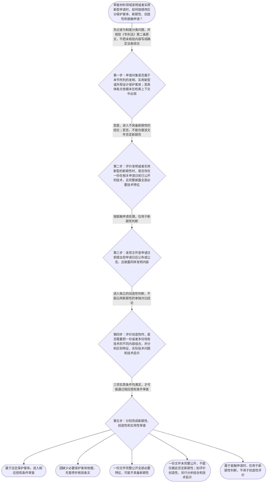

# 整合后的课程完整内容与习题

## 教学模块选择清单

- 当前教学节点：`patent-law-foundation`
- 板块预算：自适应 6/6，总计 9/9

| # | 模块 (block_type) | 类型 | 触发原因 (trigger) | 对应正文段 | 归属 |
|---:|---|:--:|---|---|:--:|
| 1 | `anchor_scenario` | 自适应 | perception=sensing(0.83) / cold_start | 材料研发团队的专利授权疑问｜某材料研发团队制备出一种耐高温复合涂层，技术方案包括特定树脂、无机填料及配比。团队准备申请发… | [A] |
| 2 | `legal_anchor` | 必选 | mandatory | 授权条件与申请文件的法条锚定｜《专利法》第二十二条 | [A] |
| 3 | `worked_example` | 自适应 | cognition.apply=0.26<0.4 / cognition.analyze=0.22<0.3 / cold_start | 复合涂层申请的两种比较方法｜甲公司申请一种耐高温复合涂层。权利要求记载树脂基体、氧化铝填料和特定质量配比。对比文件甲在申… | [A] |
| 4 | `decision_flow` | 自适应 | input=visual(0.75) | 专利授权实质条件判断流程｜审查材料领域发明或者实用新型申请时，如何按顺序区分保护客体、新颖性、创造性和抵触申请？ | [A] |
| 5 | `mnemonic` | 自适应 | understanding=sequential(0.72) | 四问对比记忆表｜四问对比表：客体问“保护什么”；新颖性问“单份是否全有”；创造性问“组合是否显而易见”；抵触… | [A] |
| 6 | `reflect_prompt` | 自适应 | processing=reflective(0.66) | 把研发时间线转成审查时间线｜在你熟悉的材料研发项目中，如果团队先发表论文、后参加展会、再提交专利申请，你会如何分别记录每… | [A] |
| 7 | `assessment` | 必选 | mandatory | 三类边界测评｜复习专利授权三项实质条件 | [A] |
| 8 | `knowledge_synthesis` | 必选 | mandatory | 专利法律制度基础知识网络｜专利制度基本特征：专利权具有独占性、时间性和地域性，具体制度边界需结合适用法律文本核验。 | [A] |
| 9 | `summary_card` | 自适应 | len(knowledge_sub_nodes)=3>=3 | 专利制度基础速查卡｜先确认保护客体，再按不同比较方法分别审查新颖性、创造性和实用性，并始终区分申请文件要求与授权… | [A] |

## 教学正文

## I — 法律问题

材料领域的专利申请进入审查时，首先要明确三个层次：申请对象属于哪类保护客体；发明或者实用新型是否满足新颖性、创造性和实用性；申请文件是否满足法定形式与内容要求。本节重点建立制度基础，并为后续学习新颖性和创造性判断固定比较对象与法律后果。

## R — 适用规则

### 1. 专利制度的基本特征

专利权的基本概念可以从三个维度理解：独占性，即权利人在权利范围内享有排他性法律地位；时间性，即权利受法定期限限制；地域性，即权利原则上依特定法域产生和发生效力。它们共同说明，专利权不是对技术的永久、全球性控制，而是以法定条件、期限和地域为边界的权利。

### 2. 中国专利制度的规范层次

本节知识点要求掌握中国专利制度由专利法、专利法实施细则和专利审查指南共同构成的规范体系：专利法提供基本法律规则，实施细则对申请和审查程序作进一步细化，审查指南用于说明审查实践中的判断方法。本次检索上下文没有提供实施细则和审查指南的直接原文，因此这里不扩展其具体条款。

### 3. 保护客体与授权实质条件

本节要求区分发明、实用新型和外观设计三类保护客体。关于《专利法》第二条的直接条文内容，本次检索上下文未提供直接依据，具体表述应在进一步检索后核验。

对于发明和实用新型，检索到的《专利法》第二十二条规定：“授予专利权的发明和实用新型，应当具备新颖性、创造性和实用性。”〔RAG: 中华人民共和国专利法.txt — 第二十二条：授予专利权的发明和实用新型，应当具备新颖性、创造性和实用性〕

同一条还规定，新颖性是指发明或者实用新型不属于现有技术，也不存在法律规定的相关在先申请文件；创造性要求发明相对于现有技术具有突出的实质性特点和显著的进步，实用新型具有实质性特点和进步；实用性要求能够制造或者使用并产生积极效果。〔RAG: 中华人民共和国专利法.txt — 第二十二条：新颖性、创造性、实用性及现有技术定义〕

现有技术是申请日前在国内外为公众所知的技术。〔RAG: 中华人民共和国专利法.txt — 第二十二条：本法所称现有技术，是指申请日以前在国内外为公众所知的技术〕

### 4. 新颖性、创造性与抵触申请的边界

新颖性判断的核心是单独对比：原则上要考察一份相关技术文件是否已经公开了被评价方案的全部必要技术特征。不能先把多份文件拼接起来，再以拼接结果直接否定新颖性。

创造性判断与新颖性不同。检索到的专题材料指出，判断创造性时可以将一份或者多份现有技术中的不同技术内容组合起来评价要求保护的发明。〔RAG: 专利法专题讲座.txt — 判断创造性时，将一份或者多份现有技术中的不同的技术内容组合在一起〕但组合并不等于自动缺乏创造性，仍需分析区别特征、实际解决的技术问题以及现有技术是否给出相应技术启示。

抵触申请是另一条边界。检索材料将其定义为：在本申请日前提出、在本申请日以后公布或者公告，并披露同样发明或者实用新型内容的相关专利申请文件或专利文件。〔RAG: 专利法律知识详细解读.txt — 抵触申请的定义：申请日以前提出申请，并且在申请日以后公布或者公告，构成抵触申请〕抵触申请能够否定新颖性，但不能用于创造性评价。〔RAG: 专利法专题讲座.txt — 只有现有技术才能用于评价创造性，申请在先公开在后的专利文件不能用于评价创造性〕

此外，检索材料中的“等同原则”属于侵权范围判断语境，不属于本节授权条件审查的比较规则，不能把它带入新颖性或创造性判断。

### 5. 公开例外与申请文件

《专利法》第二十四条规定，申请专利的发明创造在申请日前六个月内，在国家出现紧急状态或者非常情况时为公共利益目的首次公开、在中国政府主办或者承认的国际展览会上首次展出、在规定的学术会议或者技术会议上首次发表，或者被他人未经申请人同意泄露等法定情形下，不丧失新颖性。〔RAG: 中华人民共和国专利法.txt — 第二十四条：申请日前六个月内四类特定公开情形不丧失新颖性〕这是一项特定条件下的例外，不能理解为所有申请日前公开都当然受到六个月保护。

《专利法》第二十六条规定，申请发明或者实用新型专利，应当提交请求书、说明书及其摘要和权利要求书等文件；说明书应当清楚、完整地说明发明，使所属技术领域的技术人员能够实现。〔RAG: 中华人民共和国专利法.txt — 第二十六条：申请文件以及说明书清楚、完整、能够实现的要求〕申请文件要求与授权三性属于不同审查层次，不能相互替代。

## A — 规则适用

面对材料领域的申请，应先锁定权利要求和技术特征，再按时间线确认哪些内容已经公开。若一份文件在申请日前已向公众公开，并完整披露全部必要技术特征，可能直接影响新颖性。若该文件只披露部分特征，则不能仅据此否定新颖性；是否缺乏创造性，需要另行判断多份现有技术能否组合，以及是否存在技术启示。

若材料研发团队的技术会议展示落入第二十四条规定的法定公开情形，并且申请日在首次公开后六个月内，可能适用不丧失新颖性的例外。但仍须核对公开主体、首次公开性质、日期和申请时间，不能仅凭“参加过会议”四个字作结论。

如果竞争对手的申请是在本申请日前提出、在本申请日以后公开，并且披露同样的发明内容，它可能构成抵触申请。此时它可以用于新颖性判断，但不能与其他资料组合来评价创造性。

## C — 结论

本节点的判断主线是：先识别保护客体，再区分申请文件要求与授权实质条件；在授权实质条件中，新颖性采用单独对比，创造性允许在法定范围内进行组合评价，抵触申请仅用于新颖性判断。后续学习材料领域专利申请时，应始终记录申请日、公开日、公开内容和比较文件的法律身份。

> 常见误区 / 易混淆点
>
> - 把多份文件拼接后直接否定新颖性；
> - 把申请在先、公开在后的抵触申请当作创造性评价中的现有技术；
> - 把法定宽限期理解为所有公开都能自动获得六个月保护；
> - 把申请文件是否齐全与发明是否具备新颖性、创造性、实用性混为一谈；
> - 把侵权判断中的等同原则带入专利授权条件审查。

本节设有测评，请到【习题】区作答。

### 材料研发团队的专利授权疑问（anchor_scenario）

> 某材料研发团队制备出一种耐高温复合涂层，技术方案包括特定树脂、无机填料及配比。团队准备申请发明专利，但研发负责人已经在一次技术会议上展示了样品，并且竞争对手此前可能提交过内容相同的专利申请，只是该申请尚未公开。团队现在需要判断：这项技术属于什么保护客体，哪些公开或在先申请会影响授权，以及新颖性和创造性应当分别如何审查。

**锚定**：用材料技术申请场景同时锚定保护客体、专利授权三性、公开时间和抵触申请的基本边界。

**先想一想**：面对这组事实，你会先判断保护客体、公开时间，还是先比较技术方案？请说明你认为第一步应固定的判断对象。

### 授权条件与申请文件的法条锚定（legal_anchor）

- **《专利法》第二十二条**：第二十二条确立发明和实用新型获得授权的三项实质条件：新颖性、创造性和实用性；同时定义了现有技术。
- **《专利法》第二十四条**：第二十四条规定，申请日前六个月内发生的四类特定公开，在满足法定条件时不丧失新颖性。
- **《专利法》第二十六条**：第二十六条规定，申请发明或者实用新型应提交请求书、说明书及其摘要和权利要求书等文件，并要求说明书达到清楚、完整且能够实现的程度。
- **《专利法》第二条**：本节知识点要求掌握发明、实用新型和外观设计三类保护客体；但本次检索上下文未提供第二条的直接原文，具体条文表述应另行核验。

**为何重要**：第二十二条是理解新颖性和创造性判断的法条入口，第二十四条和现有技术边界有关，第二十六条帮助区分授权实体条件与申请文件要求。第二条的保护客体分类是制度基础，但当前证据不足时不能把未检索到的原文当作已核验依据。

### 复合涂层申请的两种比较方法（worked_example）

**案情/例题**：甲公司申请一种耐高温复合涂层。权利要求记载树脂基体、氧化铝填料和特定质量配比。对比文件甲在申请日前公开，披露了树脂基体和氧化铝填料，但没有披露该质量配比；对比文件乙在申请日前公开了相同质量配比，但属于另一种用途。问：应如何区分新颖性判断与创造性判断？
**适用规则**：《专利法》第二十二条关于新颖性、创造性和实用性的规定；检索到的专题材料关于新颖性单独对比、创造性组合评价以及抵触申请仅用于新颖性评价的说明。
**分步推演**：
1. 先确定被评价的权利要求及其全部技术特征，再确定比较目的。新颖性要回答的是一份现有技术是否已经直接、完整地公开该项技术方案，而不是若干文件拼接后能否得到。 → *先固定权利要求和比较目的，不能一开始混合文件。*
2. 文件甲没有披露特定质量配比，因此从当前给定事实看，不能仅凭文件甲完整公开该权利要求。文件乙虽披露配比，但还需判断其是否公开了权利要求要求的其他技术特征以及相关技术内容。 → *单独对比中，一份文件缺少必要特征时，不能直接否定新颖性。*
3. 如果转而评价创造性，可以在法定范围内考察一份或者多份现有技术的技术内容，并进一步分析区别特征、实际解决的技术问题以及是否存在技术启示。该分析不是新颖性判断的简单延长。 → *创造性允许组合评价，但须另行完成创造性推理链。*
4. 如果某份在先申请是在本申请日以前提出、在本申请日以后公布，并披露同样的发明内容，它属于抵触申请，只能依新颖性规则使用，不能作为创造性组合评价的依据。 → *抵触申请与现有技术在创造性评价中的作用不同。*
**结论**：若对比文件甲在申请日前已向公众公开，并完整披露了该复合涂层权利要求中的全部技术特征，则该权利要求的新颖性可能被否定。若甲只披露部分特征，不能仅据此直接否定新颖性；后续是否缺乏创造性，还必须按照创造性规则另行判断，不能把两种比较方法混用。
**本题要点**：判断时固定问三个问题：比较几份文件、比较什么目的、产生什么法律后果。

### 专利授权实质条件判断流程（decision_flow）

**决策问题**：审查材料领域发明或者实用新型申请时，如何按顺序区分保护客体、新颖性、创造性和抵触申请？



### 四问对比记忆表（mnemonic）

**记忆锚**：四问对比表：客体问“保护什么”；新颖性问“单份是否全有”；创造性问“组合是否显而易见”；抵触申请问“先申请后公开、仅否新颖性”。
**映射**：
- 保护什么
- 单份是否全有
- 组合是否显而易见
- 先申请后公开、仅否新颖性
**何时用**：处理材料专利审查题或阅读审查意见时，先逐项回答四问，再决定适用哪种比较方法。

### 把研发时间线转成审查时间线（reflect_prompt）

**反思问题**：在你熟悉的材料研发项目中，如果团队先发表论文、后参加展会、再提交专利申请，你会如何分别记录每个行为的日期、公开内容和可能的法律作用？

**关注要点**：不要只记录项目完成日期，要分别记录每次公开行为的时间和公开范围；区分一份文件是否完整披露全部技术特征与多份资料组合后是否能够得到方案；区分申请日前已公开的现有技术与申请日前提出但申请日后公开的抵触申请；不要把侵权判断中的等同原则混入授权条件审查

**连接**：连接到学习者已有的材料研发经验，并回到“研发事实、公开事实、法律比较对象”三者的区分。

### 专利法律制度基础知识网络（knowledge_synthesis）

**知识框架**：
- 专利制度基本特征：专利权具有独占性、时间性和地域性，具体制度边界需结合适用法律文本核验。
- 中国专利制度规范体系：专利法提供基本规则，专利法实施细则承担程序和细化规定，专利审查指南用于审查实践中的具体判断说明；本次检索未提供后两者的直接原文。
- 专利保护客体：本节要求掌握发明、实用新型和外观设计三类客体；《专利法》第二条原文未出现在本次检索上下文中，条文内容需另行核验。
- 专利制度作用：通过授予符合条件的专利权激励发明创造，并以公开技术换取一定期限和地域范围内的权利保护，从而促进技术应用和经济发展；本句为制度功能概括，当前检索未提供直接原文。
- 中国制度审查特点：本节知识点要求识别早期公开、延迟审查以及初步审查和实质审查并存等制度特点；本次检索上下文未提供相关历史和程序原文，不能据此作具体制度史断言。
- 授权实质条件总框架：《专利法》第二十二条将发明和实用新型的授权条件规定为新颖性、创造性和实用性。
**概念关系**：保护客体决定先看申请对象属于哪类专利；确认对象后，再进入相应授权条件审查。；新颖性关注一份相关技术是否已经公开全部必要特征，创造性则需要独立分析组合、区别特征、实际技术问题和技术启示。；抵触申请虽然与申请时间先后有关，但其法律作用限于新颖性评价，不能作为创造性组合评价依据。；第二十二条的实质条件与第二十六条的申请文件要求属于不同层次：前者回答是否满足授权实体门槛，后者回答申请文件是否达到法定提交和说明要求。
**必记**：发明和实用新型授权至少要同时满足新颖性、创造性和实用性。；新颖性与创造性不能混用比较方法：新颖性原则上作单独对比，创造性可以进行组合评价。；抵触申请仅用于新颖性判断，不用于创造性判断。；申请文件要求和专利授权实质条件是两个不同层次的问题。

### 专利制度基础速查卡（summary_card）

**要点卡**：
- **专利权基本特征**：理解独占性、时间性和地域性，明确专利权不是无期限、无地域限制的绝对权利。
- **中国专利制度体系**：专利法、实施细则和审查指南分别构成基本规则、程序细化和审查操作层次；具体文本需以核验材料为准。
- **三类保护客体**：本节要求区分发明、实用新型和外观设计，第二条原文需进一步核验。
- **授权三性**：发明和实用新型要同时满足新颖性、创造性和实用性。
- **比较方法边界**：新颖性重在单独对比，创造性可以组合评价，抵触申请仅用于新颖性。
**必背**：《专利法》第二十二条：发明和实用新型应具备新颖性、创造性和实用性。；新颖性与创造性的比较方法不同。；抵触申请不能用于评价创造性。；《专利法》第二十六条涉及发明和实用新型申请文件及说明书的清楚、完整、可实现要求。
**一句话总结**：先确认保护客体，再按不同比较方法分别审查新颖性、创造性和实用性，并始终区分申请文件要求与授权实体条件。

### 三类边界测评（assessment）

**三类覆盖**：backward_review、forward_probe、weakness_probe
**题目**：
- q_backward_01：复习专利授权三项实质条件
- q_forward_01：探测专利申请文件的基本构成
- q_weakness_01：区分新颖性单独对比、创造性组合评价和抵触申请边界


## 结构化数据

## expert

```json
"expert_a"
```

## style

```json
"conservative"
```

## knowledge_points

```json
[
  {
    "node_id": "patent-law-foundation",
    "kc_name": "专利制度的基本概念与特征：独占性、时间性、地域性（详见子节点 patent-rights-nature）"
  },
  {
    "node_id": "patent-law-foundation",
    "kc_name": "中国专利制度体系：专利法、专利法实施细则、专利审查指南（详见子节点 patent-law-framework）"
  },
  {
    "node_id": "patent-law-foundation",
    "kc_name": "专利保护的三种客体：发明、实用新型、外观设计（专利法第2条）"
  },
  {
    "node_id": "patent-law-foundation",
    "kc_name": "专利制度的作用：激励发明创造、促进技术公开、推动技术应用和经济发展（详见子节点 patent-system-overview）"
  },
  {
    "node_id": "patent-law-foundation",
    "kc_name": "中国专利制度发展历程与特点：早期公开延迟审查、初步审查制与实质审查制并存（详见子节点 patent-system-overview）"
  }
]
```

## legal_basis

```json
[
  {
    "article": "《专利法》第二十二条",
    "source": "中华人民共和国专利法.txt"
  },
  {
    "article": "《专利法》第二十四条",
    "source": "中华人民共和国专利法.txt"
  },
  {
    "article": "《专利法》第二十六条",
    "source": "中华人民共和国专利法.txt"
  },
  {
    "article": "《专利法》第二条：本节涉及发明、实用新型和外观设计三类保护客体，但本次检索上下文未提供该条直接原文，需进一步核验",
    "source": null
  }
]
```

## risks

```json
[
  {
    "risk": "本次检索上下文未提供《专利法》第二条、专利法实施细则、专利审查指南以及制度发展历程的直接原文，相关具体条文和历史表述不得视为已完成核验。",
    "related_node_id": "patent-law-foundation"
  },
  {
    "risk": "新颖性单独对比、创造性组合评价和抵触申请的法律作用不同，混用比较方法可能导致错误结论。",
    "related_node_id": "patent-law-foundation"
  },
  {
    "risk": "宽限期属于特定公开情形下的例外规则，不能概括为所有申请日前公开均自动享有六个月保护。",
    "related_node_id": "patent-law-foundation"
  },
  {
    "risk": "侵权范围判断中的等同原则不属于本节点授权条件审查规则，不应与新颖性或创造性判断混同。",
    "related_node_id": "patent-law-foundation"
  }
]
```

## draft_stage

```json
"debate"
```

## irac

```json
{
  "issue": "材料领域专利申请进入授权条件审查时，应如何定位专利制度基础，并区分新颖性、创造性、现有技术和抵触申请的判断边界？",
  "rule": "《专利法》第二十二条规定，授予发明和实用新型专利权应具备新颖性、创造性和实用性，并规定现有技术是申请日前在国内外为公众所知的技术。检索材料说明，新颖性采用单独对比，创造性可以组合一份或者多份现有技术；抵触申请仅用于新颖性评价。《专利法》第二十四条规定特定申请日前六个月公开在法定情形下不丧失新颖性。《专利法》第二十六条规定申请发明或者实用新型应提交相应申请文件。关于《专利法》第二条及制度发展历程，本次检索上下文未提供直接原文，具体表述需进一步核验。",
  "application": "针对材料领域申请，应先确定被评价权利要求及其全部技术特征，再确认比较文件的公开时间和内容。如果一份相关文件在申请日前已向公众公开并完整披露全部必要技术特征，可能据此否定新颖性；如果文件仅披露部分特征，不能直接得出该结论。创造性判断可以进一步考察一份或者多份现有技术，但必须独立分析区别特征、实际技术问题和技术启示。申请日前提出、申请日后公布或公告并披露同样发明内容的文件属于抵触申请时，其作用限于新颖性评价。",
  "conclusion": "本节点应建立的核心结论是：专利制度基础包括专利权的独占性、时间性和地域性、三类保护客体以及中国专利规范体系；发明和实用新型的授权实质条件包括新颖性、创造性和实用性。新颖性、创造性和抵触申请具有不同的比较对象和法律作用，不能混用。"
}
```

## interactive_questions

```json
[
  {
    "qid": "q_backward_01",
    "category": "remember",
    "difficulty": "L1",
    "source_tag": "backward_review",
    "kc_node_id": "patent-law-foundation",
    "question": "关于专利授权实质条件，下列哪项表述正确？",
    "answer": "B",
    "options": [
      "A.只要能够制造，就不需要满足其他授权条件",
      "B.发明和实用新型应当具备新颖性、创造性和实用性",
      "C.只有外观设计需要满足授权实质条件",
      "D.创造性满足即可推定新颖性和实用性满足"
    ]
  },
  {
    "qid": "q_forward_01",
    "category": "remember",
    "difficulty": "L1",
    "source_tag": "forward_probe",
    "kc_node_id": "patent-application-process",
    "question": "根据《专利法》第二十六条，申请发明或者实用新型专利通常应提交下列哪组文件？",
    "answer": "A",
    "options": [
      "A.请求书、说明书及其摘要、权利要求书等文件",
      "B.只有产品照片和销售合同",
      "C.只有发明人身份证明和样品",
      "D.只有技术会议签到表和实验记录"
    ]
  },
  {
    "qid": "q_weakness_01",
    "category": "analyze",
    "difficulty": "L3",
    "source_tag": "weakness_probe",
    "kc_node_id": "patent-law-foundation",
    "question": "关于新颖性、创造性与抵触申请的关系，下列哪项判断最准确？",
    "answer": "C",
    "options": [
      "A.新颖性和创造性都必须把多份对比文件组合后判断",
      "B.抵触申请既可以否定新颖性，也可以作为创造性组合评价的依据",
      "C.新颖性原则上进行单独对比，创造性可以评价现有技术组合，抵触申请仅用于新颖性判断",
      "D.只要一份文件披露部分技术特征，就必然否定权利要求的新颖性"
    ]
  }
]
```

## knowledge_synthesis

```json
{
  "node": "patent-law-foundation",
  "coverage": [
    {
      "node_id": "patent-law-foundation"
    }
  ],
  "confusable_pairs": []
}
```
