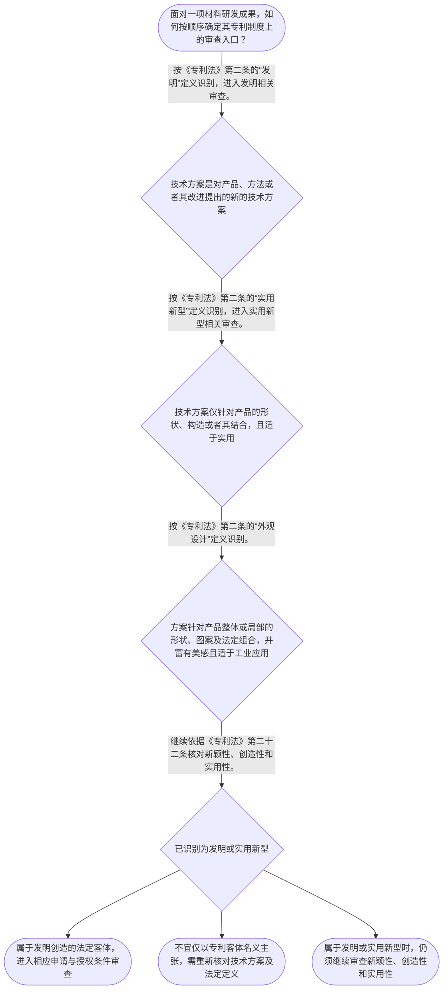

# 整合后的课程完整内容与习题

## 教学模块选择清单

- 当前教学节点：`patent-law-foundation`
- 板块预算：自适应 6/6，总计 9/9

| # | 模块 (block_type) | 类型 | 触发原因 (trigger) | 对应正文段 | 归属 |
|---:|---|:--:|---|---|:--:|
| 1 | `anchor_scenario` | 自适应 | perception=sensing(0.83) / cold_start | 材料研发成果的专利化起点｜某材料研发团队制得一种用于锂离子电池正极的掺杂材料，并拟将材料配方、制备方法和涂覆后电极结构… | [A] |
| 2 | `legal_anchor` | 必选 | mandatory | 专利制度基础的法条锚点｜《中华人民共和国专利法》第一条 | [A] |
| 3 | `worked_example` | 自适应 | cold_start(low_confidence) | 材料配方与工艺的客体识别｜某团队发现：在磷酸铁锂材料中加入特定元素并采用特定烧结工艺，可改善循环性能。团队拟同时主张“… | [A] |
| 4 | `decision_flow` | 自适应 | input=visual(0.76) | 材料技术成果的审查入口流程｜面对一项材料研发成果，如何按顺序确定其专利制度上的审查入口？ | [A] |
| 5 | `mnemonic` | 自适应 | understanding=sequential(0.72) | 专利制度基础四步核对表｜“客—权—制—审”四步核对表：先看客体，再看权利特征，再看制度依据，最后看审查条件。 | [A] |
| 6 | `reflect_prompt` | 自适应 | processing=reflective(0.66) | 将制度框架连接到材料研发经验｜回顾一项自己熟悉的材料研发成果：其中哪些技术内容可能需要按发明客体分析，哪些内容不能仅因“有… | [A] |
| 7 | `assessment` | 必选 | mandatory | 基础制度三类测评｜复习专利法第二条规定的三类发明创造。 | [A] |
| 8 | `knowledge_synthesis` | 必选 | mandatory | 专利法律制度基础框架｜专利权特征：专利权具有独占性、时间性和地域性；独占性并非绝对，法律另有规定时存在边界。 | [A] |
| 9 | `summary_card` | 自适应 | len(knowledge_sub_nodes)=3>=3 | 专利制度基础速查卡｜材料专利申请先定法定客体和权利边界，再按授权条件进入新颖性、创造性与实用性审查。 | [A] |

## 教学正文

## I — 法律问题

材料领域研发成果在讨论新颖性、创造性之前，首先要解决两个基础问题：该成果是否属于《中华人民共和国专利法》规定的发明创造，以及专利制度为何对该成果设置具有边界的专有保护。对材料配方、材料产品、制备方法和外观呈现，不能仅凭“技术先进”或“性能提升”直接得出可授权结论。

## R — 适用规则

《中华人民共和国专利法》第一条将保护专利权人合法权益、鼓励发明创造、推动发明创造应用、提高创新能力及促进科学技术进步和经济社会发展，规定为立法目的。〔RAG: 中华人民共和国专利法.txt — 第一条：为了保护专利权人的合法权益，鼓励发明创造，推动发明创造的应用，提高创新能力，促进科学技术进步和经济社会发展〕

《中华人民共和国专利法》第二条规定，本法所称发明创造包括发明、实用新型和外观设计。发明是对产品、方法或者其改进所提出的新的技术方案；实用新型是对产品的形状、构造或者其结合所提出的适于实用的新的技术方案；外观设计是对产品整体或者局部的形状、图案或其结合以及法定色彩组合所作出的富有美感并适于工业应用的新设计。〔RAG: 中华人民共和国专利法.txt — 第二条：本法所称的发明创造是指发明、实用新型和外观设计〕

《中华人民共和国专利法》第三条规定，国务院专利行政部门负责管理全国专利工作，统一受理和审查专利申请，并依法授予专利权。〔RAG: 中华人民共和国专利法.txt — 第三条：统一受理和审查专利申请，依法授予专利权〕

对发明和实用新型，《中华人民共和国专利法》第二十二条要求具备新颖性、创造性和实用性。新颖性以不属于现有技术为基本要求；现有技术是申请日以前在国内外为公众所知的技术。创造性要求发明相对现有技术具有突出的实质性特点和显著进步，实用新型具有实质性特点和进步。〔RAG: 中华人民共和国专利法.txt — 第二十二条：授予专利权的发明和实用新型，应当具备新颖性、创造性和实用性〕

专利权还具有排他性、时间性和地域性。排他性意味着未经许可实施通常受限制，但其表述以“除专利法另有规定的以外”为前提；时间性意味着法定保护期限届满后技术进入公有领域。〔RAG: 专利法律知识详细解读.txt — 专利权具有排他性、时间性和地域性的特征；除专利法另有规定的以外〕

中国专利制度体系包括专利法、专利法实施细则和专利审查指南：本节已检索到专利法对客体、制度目的、主管审查机关和发明实用新型三性的直接规定。关于实施细则与审查指南的具体条款及适用，应在后续相应节点依据补充检索材料核验。关于早期公开延迟审查、初步审查制与实质审查制并存，本次检索上下文未提供直接依据，故本节仅将其作为待后续规范材料核验的制度线索。

## A — 规则适用

对材料研发事实，应按“客体识别在前、授权条件审查在后”的顺序处理。

第一步，提取技术方案的对象。材料组成、材料产品及其改进，通常应先按“产品技术方案”核对发明定义；烧结、掺杂、涂覆等制备步骤，应先按“方法技术方案”核对发明定义。仅当方案针对产品形状、构造或者其结合且适于实用时，才按实用新型的法定定义分析。若主张的是产品整体或局部视觉设计，则应按外观设计的定义分析。

第二步，不把客体分类与授权结论混同。即使材料配方或制备工艺符合发明的定义，也只是进入发明相关审查的起点；其能否获得专利权，仍须进一步依第二十二条判断新颖性、创造性和实用性。后续学习新颖性时，应以申请日前是否已为公众所知为时间基准；后续学习创造性时，应在与现有技术比较的框架内判断技术方案是否具有法定程度的实质性特点和进步。

第三步，理解制度目的与权利边界的对应关系。专利制度通过授予具有独占性、时间性和地域性的权利，为符合条件的技术方案提供激励；同时，公开、期限届满及法定例外共同限制该权利的外延。因此，材料研发人员不能把“申请专利”理解为对技术的永久、无地域限制或无例外的控制。

本节设有测评，请到【习题】区作答。

## C — 结论

材料专利申请的基础判断不是直接回答“有没有创造性”，而是依次确认：技术方案是否属于发明、实用新型或外观设计等法定客体；若为发明或实用新型，是否再满足新颖性、创造性和实用性。专利制度旨在保护与激励发明创造及其应用，但授予的专利权具有独占、期限和地域边界。〔RAG: 中华人民共和国专利法.txt — 第一条、第二条、第二十二条；专利法律知识详细解读.txt — 排他性、时间性和地域性〕

> 常见误区 / 易混淆点
>
> 1. “材料性能改善”不等于已经具备创造性，更不等于当然可以授权；客体判断与三性判断必须分开。
> 2. “产品有实体形态”不等于必然是实用新型；应以第二条关于产品形状、构造或者其结合的定义判断。
> 3. “专利权具有独占性”不等于专利权人可在任何时间、任何地域、对任何行为绝对排除他人；应同时看到期限、地域及法律另有规定的边界。
> 4. 对公开、初步审查、实质审查等程序线索，不应在缺少相应法条或审查指南依据时擅自扩展为具体结论。

### 材料研发成果的专利化起点（anchor_scenario）

> 某材料研发团队制得一种用于锂离子电池正极的掺杂材料，并拟将材料配方、制备方法和涂覆后电极结构一并申请专利。团队成员认为“只要材料性能提升，就都能申请同一种专利”；另有人担心，申请后是否能在其他国家当然获得同样的排他保护。

在递交申请前，团队需要先分清：拟保护的技术方案属于哪一种专利客体，专利权为什么具有独占、期限和地域边界，以及后续审查中为何还要面对新颖性、创造性和实用性等授权条件。

**锚定**：该情境锚定专利客体、专利权特征、制度功能与授权条件在材料专利申请中的先后关系。

**先想一想**：面对同一项材料研发成果，为什么要先判断保护客体和制度边界，再讨论新颖性、创造性？

### 专利制度基础的法条锚点（legal_anchor）

- **《中华人民共和国专利法》第一条**：专利制度同时服务于保护专利权人权益、鼓励发明创造、推动应用和促进科技及经济社会发展。
- **《中华人民共和国专利法》第二条**：发明创造包括发明、实用新型和外观设计；三类客体的法定定义不同。
- **《中华人民共和国专利法》第三条**：国务院专利行政部门统一受理和审查专利申请，并依法授予专利权。
- **《中华人民共和国专利法》第二十二条**：发明和实用新型取得专利权须具备新颖性、创造性和实用性；现有技术以申请日前国内外为公众所知的技术为界。

**为何重要**：本节点先确定专利制度保护什么、由谁审查及其制度目的，才能为后续材料技术的新颖性与创造性判断建立正确入口。

### 材料配方与工艺的客体识别（worked_example）

**案情/例题**：某团队发现：在磷酸铁锂材料中加入特定元素并采用特定烧结工艺，可改善循环性能。团队拟同时主张“材料组成”和“制备方法”，并询问这是否属于专利制度可审查的技术成果、是否已经当然能够授权。
**适用规则**：《中华人民共和国专利法》第二条：发明是对产品、方法或者其改进所提出的新的技术方案；实用新型是对产品的形状、构造或者其结合所提出的适于实用的新的技术方案。
**分步推演**：
1. 先识别方案的技术内容。材料组成属于产品技术方案，烧结步骤属于方法技术方案；二者均可能落入《专利法》第二条所称发明的定义范围。 → *先按产品或方法识别发明客体。*
2. 再区分发明与实用新型的法定对象。题设的材料配方和制备工艺并非仅围绕产品形状、构造或者其结合，因此不能仅因其具有实物形态就当然按实用新型处理。 → *客体分类取决于法定定义，而不是研发成果是否“看得见”。*
3. 最后将客体判断与授权条件分开。《专利法》第二十二条要求发明和实用新型具备新颖性、创造性和实用性；客体符合第二条并不等于三性已经成立。 → *保护客体判断在前，三性判断随后进行。*
**结论**：该团队应先将材料配方及制备工艺作为可能的发明客体进行审查；仅凭“材料性能提升”不能当然得出已具备授权条件的结论，后续仍须依《专利法》第二十二条审查。
**本题要点**：材料专利分析先定技术方案及客体类型，再进入新颖性、创造性和实用性的实体审查。

### 材料技术成果的审查入口流程（decision_flow）

**决策问题**：面对一项材料研发成果，如何按顺序确定其专利制度上的审查入口？



### 专利制度基础四步核对表（mnemonic）

**记忆锚**：“客—权—制—审”四步核对表：先看客体，再看权利特征，再看制度依据，最后看审查条件。
**映射**：
- 客
- 权
- 制
- 审
**何时用**：阅读材料专利交底书、准备申请或分析授权风险时，按四步逐项核对，避免跳过客体判断而直接讨论三性。

### 将制度框架连接到材料研发经验（reflect_prompt）

**反思问题**：回顾一项自己熟悉的材料研发成果：其中哪些技术内容可能需要按发明客体分析，哪些内容不能仅因“有实物”就直接归入实用新型？

**关注要点**：方案是否属于产品、方法或其改进所提出的技术方案。；客体分类与新颖性、创造性、实用性判断是前后衔接但不能互相替代的两个层次。；专利权的独占性受法律规定、期限和地域边界限制。

**连接**：连接到学习者已有的材料研发经验：区分材料组成、制备方法、产品结构与外观呈现的技术事实。

### 专利法律制度基础框架（knowledge_synthesis）

**知识框架**：
- 专利权特征：专利权具有独占性、时间性和地域性；独占性并非绝对，法律另有规定时存在边界。
- 制度依据：专利法规定基本制度和授权条件；实施细则、审查指南共同构成中国专利制度体系中的具体适用层次。
- 保护客体：《专利法》第二条将发明创造分为发明、实用新型和外观设计，并分别给出定义。
- 制度作用：《专利法》第一条将保护权益、鼓励发明创造、推动应用、提高创新能力及促进发展列为立法目的。
- 制度运行特点：本节应识别申请公开、审查与授权的制度环节；关于早期公开延迟审查以及初步审查制与实质审查制并存，检索上下文未提供直接依据，后续应以相应法条或审查材料核验。
**概念关系**：先依《专利法》第二条识别保护客体，后对发明和实用新型依第二十二条审查新颖性、创造性和实用性。；专利制度目的解释为何以公开换取具有期限和地域边界的专利权。；专利法确立基本权利义务与授权标准，具体程序和审查操作需结合实施细则、审查指南进一步确认。
**必记**：发明、实用新型、外观设计是《专利法》第二条规定的三类发明创造。；发明和实用新型的授权条件包括新颖性、创造性和实用性。；现有技术是申请日以前在国内外为公众所知的技术；这是后续理解新颖性和创造性的时间基准。

### 专利制度基础速查卡（summary_card）

**要点卡**：
- **专利权特征**：专利权具有独占性、时间性和地域性，权利边界应以法律规定为准。
- **三类保护客体**：发明、实用新型、外观设计的法定定义均在《专利法》第二条。
- **制度目的**：专利制度以保护权益和激励、公开、应用发明创造来促进创新与发展。
- **授权条件入口**：发明和实用新型在客体识别后，还要经新颖性、创造性和实用性审查。
- **审查制度线索**：公开、审查和授权构成制度运行线索；具体审查程序须以补充规范材料核验。
**必背**：《专利法》第二条规定的发明创造包括发明、实用新型和外观设计。；《专利法》第二十二条规定发明和实用新型应具备新颖性、创造性和实用性。；现有技术以申请日以前在国内外为公众所知的技术为界。
**一句话总结**：材料专利申请先定法定客体和权利边界，再按授权条件进入新颖性、创造性与实用性审查。

### 基础制度三类测评（assessment）

**三类覆盖**：backward_review、forward_probe、weakness_probe
**题目**：
- q-foundation-review-l1：复习专利法第二条规定的三类发明创造。
- q-application-forward-l1：探测专利申请程序节点中的申请文件基础认识。
- q-foundation-weakness-l3：辨析保护客体判断与发明、实用新型三性审查的先后关系。


## 结构化数据

## expert

```json
"expert_a"
```

## style

```json
"conservative"
```

## knowledge_points

```json
[
  {
    "node_id": "patent-law-foundation",
    "kc_name": "专利制度的基本概念与特征：独占性、时间性、地域性"
  },
  {
    "node_id": "patent-law-foundation",
    "kc_name": "中国专利制度体系：专利法、专利法实施细则、专利审查指南"
  },
  {
    "node_id": "patent-law-foundation",
    "kc_name": "专利保护的三种客体：发明、实用新型、外观设计"
  },
  {
    "node_id": "patent-law-foundation",
    "kc_name": "专利制度的作用：激励发明创造、促进技术公开、推动技术应用和经济发展"
  },
  {
    "node_id": "patent-law-foundation",
    "kc_name": "中国专利制度发展历程与特点：早期公开延迟审查、初步审查制与实质审查制并存"
  }
]
```

## legal_basis

```json
[
  {
    "article": "《中华人民共和国专利法》第一条：为了保护专利权人的合法权益，鼓励发明创造，推动发明创造的应用，提高创新能力，促进科学技术进步和经济社会发展，制定本法。",
    "source": "中华人民共和国专利法.txt"
  },
  {
    "article": "《中华人民共和国专利法》第二条：本法所称的发明创造是指发明、实用新型和外观设计；并分别规定三类客体的定义。",
    "source": "中华人民共和国专利法.txt"
  },
  {
    "article": "《中华人民共和国专利法》第三条：国务院专利行政部门负责管理全国的专利工作；统一受理和审查专利申请，依法授予专利权。",
    "source": "中华人民共和国专利法.txt"
  },
  {
    "article": "《中华人民共和国专利法》第二十二条：发明和实用新型应具备新颖性、创造性和实用性；现有技术是申请日以前在国内外为公众所知的技术。",
    "source": "中华人民共和国专利法.txt"
  },
  {
    "article": "专利权具有排他性、时间性和地域性的特征；排他性受专利法另有规定的限制。",
    "source": "专利法律知识详细解读.txt"
  }
]
```

## risks

```json
[
  {
    "risk": "将材料技术成果属于法定保护客体，误认为当然具备新颖性、创造性和实用性。",
    "related_node_id": "patent-law-foundation"
  },
  {
    "risk": "将专利权的独占性理解为不受期限、地域或法律例外限制的绝对权利。",
    "related_node_id": "patent-law-foundation"
  },
  {
    "risk": "将发明、实用新型与外观设计按研发成果是否具有实物形态进行机械分类，忽略《专利法》第二条的具体定义。",
    "related_node_id": "patent-law-foundation"
  },
  {
    "risk": "对早期公开延迟审查、初步审查制与实质审查制并存作出超出本次检索上下文的具体法律结论。",
    "related_node_id": "patent-law-foundation"
  }
]
```

## draft_stage

```json
"debate"
```

## irac

```json
{
  "issue": "对一项材料配方、制备工艺或材料产品的研发成果，如何在进入新颖性和创造性判断前，确定其是否属于专利法上的保护客体、适用何种基础制度框架？",
  "rule": "《中华人民共和国专利法》第二条规定发明创造包括发明、实用新型和外观设计，并分别规定其定义；第三条规定国务院专利行政部门统一受理和审查专利申请，依法授予专利权；第二十二条规定发明和实用新型应具备新颖性、创造性和实用性。第一条规定本法的立法目的。",
  "application": "对于材料研发成果，应先将配方、结构、制备方法或外观等事实分别与《专利法》第二条的法定定义对照。若属于发明或实用新型，才继续依第二十二条核验新颖性、创造性和实用性；材料性能提升本身不能替代上述逐项判断。专利权即使获得授权，仍具有独占性、时间性和地域性边界。",
  "conclusion": "本节的正确起点是先识别法定保护客体及制度边界，再进入授权条件审查。材料领域的新颖性和创造性判断属于后续以第二十二条为核心的实体审查问题，不应与客体判断混同。"
}
```

## interactive_questions

```json
[
  {
    "qid": "q-foundation-review-l1",
    "category": "remember",
    "difficulty": "L1",
    "source_tag": "backward_review",
    "kc_node_id": "patent-law-foundation",
    "question": "根据《中华人民共和国专利法》第二条，下列哪一组属于本法所称的发明创造？",
    "answer": "A",
    "options": [
      "A. 发明、实用新型和外观设计",
      "B. 发明、著作权和商标",
      "C. 实用新型、商业秘密和集成电路布图设计",
      "D. 发明、植物新品种和地理标志"
    ]
  },
  {
    "qid": "q-application-forward-l1",
    "category": "understand",
    "difficulty": "L1",
    "source_tag": "forward_probe",
    "kc_node_id": "patent-application-process",
    "question": "就专利申请程序的基础认识而言，下列哪项最符合教学上下文所列申请文件的组成？",
    "answer": "A",
    "options": [
      "A. 请求书、说明书及其摘要、权利要求书等",
      "B. 仅提交产品样品即可",
      "C. 仅提交技术宣传册即可",
      "D. 仅提交营业执照即可"
    ]
  },
  {
    "qid": "q-foundation-weakness-l3",
    "category": "analyze",
    "difficulty": "L3",
    "source_tag": "weakness_probe",
    "kc_node_id": "patent-law-foundation",
    "question": "某团队提出一种电池材料配方及其烧结工艺，并主张循环性能提高。关于其审查顺序，下列说法正确的是？",
    "answer": "B",
    "options": [
      "A. 材料配方属于产品，因此当然具备新颖性、创造性和实用性",
      "B. 先依《专利法》第二条判断材料配方和工艺是否属于相应发明创造客体；对发明或实用新型，再依第二十二条审查新颖性、创造性和实用性",
      "C. 只要材料具有实物形态，就必须作为实用新型审查，不再判断是否为发明",
      "D. 只要研发成果能提升性能，即不必区分发明、实用新型和外观设计"
    ]
  }
]
```

## knowledge_synthesis

```json
{
  "node": "patent-law-foundation",
  "coverage": [
    {
      "node_id": "patent-law-foundation"
    }
  ],
  "confusable_pairs": [
    {
      "pair": "保护客体判断与授权三性判断：前者回答技术方案属于何种法定客体，后者回答发明或实用新型是否满足授权条件，二者不能互相替代。"
    },
    {
      "pair": "发明与实用新型：发明可针对产品、方法或其改进；实用新型限于产品的形状、构造或其结合。"
    },
    {
      "pair": "独占性与绝对禁止：专利权具有排他性，但“除专利法另有规定的以外”表明其存在法定边界。"
    }
  ]
}
```
