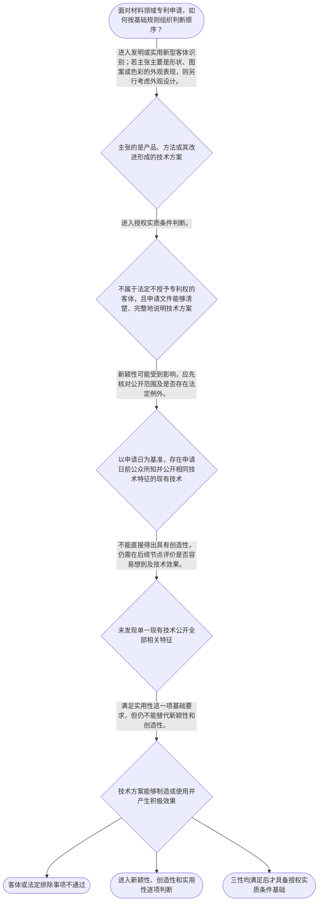

# 整合后的课程完整内容与习题

## 教学模块选择清单

- 当前教学节点：`patent-law-foundation`
- 板块预算：自适应 6/6，总计 9/9

| # | 模块 (block_type) | 类型 | 触发原因 (trigger) | 对应正文段 | 归属 |
|---:|---|:--:|---|---|:--:|
| 1 | `anchor_scenario` | 自适应 | perception=sensing(0.84) / cold_start | 材料研发项目的专利保护选择｜某材料企业研发出一种耐高温复合涂层：研发人员认为核心在于配方比例和制备工艺，产品经理则希望保… | [A] |
| 2 | `legal_anchor` | 必选 | mandatory | 专利客体与授权三性的法条锚定｜《专利法》第二条 | [A] |
| 3 | `worked_example` | 自适应 | cold_start(low_confidence) | 复合材料方案的基础判断链｜某公司研发一种隔热复合板材，权利要求拟保护其层状结构和制备工艺。申请日前已有公开文献记载相同… | [A] |
| 4 | `decision_flow` | 自适应 | input=visual(0.77) | 专利基础审查判断流程｜面对材料领域专利申请，如何按基础规则组织判断顺序？ | [A] |
| 5 | `mnemonic` | 自适应 | understanding=sequential(0.75) | 专利基础四问表｜基础判断四问表：一问“保什么”，二问“何时比”，三问“是否三性”，四问“能否实现”。 | [A] |
| 6 | `reflect_prompt` | 自适应 | processing=reflective(0.69) | 从研发事实迁移到专利判断｜回想一个材料研发项目：如果研发记录、样品展示和专利申请分别发生在不同日期，你会如何重新整理判… | [A] |
| 7 | `assessment` | 必选 | mandatory | 本节三类测评入口｜识别发明和实用新型授权所需的三性 | [A] |
| 8 | `knowledge_synthesis` | 必选 | mandatory | 专利法律制度基础知识网｜保护客体：发明、实用新型和外观设计分别对应不同的技术或外观保护对象。 | [A] |
| 9 | `summary_card` | 自适应 | len(knowledge_sub_nodes)=3>=3 | 专利法律制度基础速查卡｜先定保护客体，再以申请日识别现有技术，最后逐项核对新颖性、创造性和实用性。 | [A] |

## 教学正文

## I — 法律问题

本节点要解决的核心问题是：在中国专利制度下，哪些技术成果属于专利保护对象，授权审查主要看哪些实质条件，以及专利制度如何通过排他性保护与公开技术成果实现制度目标。对材料领域申请而言，应先识别技术方案属于哪一种专利客体，再区分新颖性、创造性和实用性，不能把“技术效果好”直接等同于“必然具有新颖性或创造性”。

## R — 适用规则

### 1. 专利保护客体

《专利法》第二条将发明创造分为发明、实用新型和外观设计：发明针对产品、方法或者其改进提出新的技术方案；实用新型针对产品的形状、构造或者其结合提出适于实用的新的技术方案；外观设计针对产品的整体或局部形状、图案及其结合，或者色彩与形状、图案的结合，提出富有美感并适于工业应用的新设计。〔RAG: 中华人民共和国专利法.txt — 第二条：发明创造包括发明、实用新型和外观设计〕

因此，材料配方、制备工艺、复合材料结构及其改进，通常首先需要从“产品技术方案”或“方法技术方案”的角度识别；若主张的是产品外观的形状、图案或色彩组合，则应转向外观设计客体分析。仅有抽象科学发现或不具有技术方案属性的内容，不能仅因具有科学价值而当然获得专利保护。专利法第二十五条列明了不授予专利权的若干客体，包括科学发现、智力活动的规则和方法等。〔RAG: 中华人民共和国专利法.txt — 第二十五条：列明不授予专利权的客体〕

### 2. 授权实质条件

发明和实用新型获得专利权，应当具备新颖性、创造性和实用性。新颖性关注申请日前是否已有相同技术成为现有技术，或是否存在同样发明创造的在先申请在申请日后公开；创造性关注相对于现有技术是否达到法定的实质性特点和进步标准；实用性关注技术方案能否制造或者使用并产生积极效果。〔RAG: 中华人民共和国专利法.txt — 第二十二条：授予发明和实用新型应具备新颖性、创造性和实用性，并分别规定三性的含义〕

现有技术是申请日前在国内外为公众所知的技术。〔RAG: 中华人民共和国专利法.txt — 第二十二条：现有技术是申请日前在国内外为公众所知的技术〕这意味着判断时必须把申请日作为时间基准，而不能只看技术成果完成日、内部立项日或申请人主观上首次想到的日期。

### 3. 制度体系与审查衔接

中国专利制度的规范层次至少包括专利法、专利法实施细则和专利审查指南。专利法提供基本制度与授权条件，实施细则补充程序和实施要求，审查指南进一步将法定标准转化为审查中的操作性判断规则。对申请文件而言，发明或者实用新型申请应提交请求书、说明书及其摘要、权利要求书等文件，说明书应当清楚、完整地说明发明，使所属技术领域的技术人员能够实现。〔RAG: 中华人民共和国专利法.txt — 第二十六条：申请文件构成及说明书清楚、完整、能够实现的要求〕

审查制度具有初步审查与实质审查并存的特点：不同专利类型及不同审查阶段承担的审查任务并不相同。学习时应把“客体识别—形式与文件要求—授权实质条件—后续程序救济”看作相互衔接而非彼此替代的环节。本节仅建立制度主干，不展开申请程序、复审或无效宣告的独立规则。

## A — 规则适用

以材料领域为例，某研发团队完成一种具有特殊层状结构和隔热效果的复合板材。第一步，应看其权利要求是在保护产品结构、材料组成，还是在保护制备方法；如果是结构或组成技术方案，通常应在发明或实用新型客体框架内继续判断，而不是直接按外观设计处理。第二步，应以申请日为时间基准，检索申请日前公众已知的相关技术；申请日后的公开不能简单倒推为申请日前现有技术。第三步，应分别检查三性：已有相同技术方案可能影响新颖性；即使没有单一文献完整公开全部特征，仍不能据此直接得出具有创造性的结论，还需在相应节点进一步分析技术启示、技术效果和本领域技术人员的判断；技术方案能够制造或使用并产生积极效果，才满足实用性要求。

若研发团队在申请日前公开了成果，还要进一步核对该公开是否属于法律规定的特定情形及期限。专利法第二十四条规定，申请日前六个月内在国家出现紧急状态或非常情况时为公共利益目的首次公开、在中国政府主办或承认的国际展览会上首次展出、在规定的学术或技术会议上首次发表，或者他人未经申请人同意泄露其内容的，在相应条件下不丧失新颖性。〔RAG: 中华人民共和国专利法.txt — 第二十四条：申请日前六个月内特定公开情形不丧失新颖性〕宽限期不是对所有公开行为的普遍豁免，也不等于创造性和实用性自动成立。

制度目标上，专利权的独占性为权利人提供一定期限和地域范围内的排他性保护；时间性意味着保护并非永久存在；地域性意味着保护效力原则上依附于相应国家或地区的法律和授权。作为交换，申请人通过公开技术方案换取法律保护，社会因此能够获得技术信息并在保护期限届满后利用相关技术。上述制度功能解释了为什么专利审查既重视授权条件，也重视公开与申请日等时间节点。

## C — 结论

本节点应形成四层判断主线：先识别保护客体，再确认规范体系和申请文件基础，随后以申请日为基准分别判断新颖性、创造性和实用性，最后把授权结论放回专利制度的独占、时间、地域与技术公开交换结构中。新颖性回答“是否已有相同技术进入现有技术范围”，创造性回答“相对于现有技术是否具有法定的实质性特点和进步”，实用性回答“是否能够制造或使用并产生积极效果”；三者不能相互替代。

> 常见误区 / 易混淆点
>
> 1. 把材料性能提升直接当成创造性结论；性能效果必须结合现有技术和具体技术方案分析。
> 2. 把新颖性与创造性混为一谈；新颖性通常先看相同技术方案是否被单一现有技术公开，创造性则需要进一步评价相对于现有技术是否容易想到。
> 3. 把申请日前的任何公开都视为当然适用宽限期；第二十四条只覆盖列明的特定情形，并有六个月等条件限制。
> 4. 把专利法、实施细则和审查指南当成同一层级文本；三者在规范功能和适用层次上不同。
>
> 本节设有测评，请到【习题】区作答。

### 材料研发项目的专利保护选择（anchor_scenario）

> 某材料企业研发出一种耐高温复合涂层：研发人员认为核心在于配方比例和制备工艺，产品经理则希望保护涂层形成后的外观效果。团队计划申请专利，但此前曾在技术交流会上展示过样品，并且尚未确定申请日。现在需要先解决三个冲突：该成果属于哪类保护客体，哪些授权条件必须满足，申请日前的公开是否会影响新颖性。

**锚定**：用材料配方、制备工艺、外观效果和申请日前公开这组事实，锚定保护客体、三性及申请日基准三个基础概念。

**先想一想**：面对同一个材料成果，你会先区分技术方案与外观表现，还是先判断技术效果是否突出？请先确定你的判断顺序。

### 专利客体与授权三性的法条锚定（legal_anchor）

- **《专利法》第二条**：第二条先划定三类保护客体：发明、实用新型和外观设计。
- **《专利法》第二十二条**：第二十二条规定发明和实用新型要同时满足新颖性、创造性和实用性，并以申请日前公众所知技术作为现有技术判断基础。
- **《专利法》第二十四条**：第二十四条只对列明的申请日前六个月内特定公开情形规定新颖性例外。
- **《专利法》第二十五条**：第二十五条列举科学发现、智力活动规则和方法等不授予专利权的客体。
- **《专利法》第二十六条**：第二十六条规定发明或者实用新型申请的主要文件，以及说明书清楚、完整并使技术人员能够实现的要求。

**为何重要**：这些条文分别回答“保护什么”“授权看什么”“公开何时可能例外”以及“申请文件如何支撑技术方案”。它们构成后续学习新颖性、创造性和申请程序的共同法条基础。

### 复合材料方案的基础判断链（worked_example）

**案情/例题**：某公司研发一种隔热复合板材，权利要求拟保护其层状结构和制备工艺。申请日前已有公开文献记载相同层状结构，但公司测试显示其隔热性能较好。需要演示如何进行基础授权条件判断。
**适用规则**：《专利法》第二条、第二十二条；涉及申请日前特定公开例外时参照《专利法》第二十四条。
**分步推演**：
1. 先看权利要求保护的是产品结构和制备方法，而不是单纯的科学发现或产品外观，因此应先在发明或实用新型技术方案框架内识别客体。 → *第一步：确定保护客体。*
2. 以申请日为时间基准，核对公开文献是否在申请日前已向公众公开，并比较其是否记载了该权利要求的全部技术特征。 → *第二步：确定现有技术及其公开范围。*
3. 如果一篇申请日前现有技术已经公开全部技术特征，新颖性会受到直接影响；即使测试显示性能较好，也不能仅凭效果差异跳过新颖性分析。 → *第三步：先判断新颖性，再区分技术效果与创造性。*
4. 在新颖性未被单一现有技术破坏的前提下，还需进一步评价相对于现有技术是否具有法定的实质性特点和进步；同时核对方案能否制造或使用并产生积极效果。 → *第四步：分别继续判断创造性与实用性。*
**结论**：材料方案的基础判断顺序是客体识别、申请日与现有技术核对、分别判断新颖性、创造性和实用性；性能提升不能自动替代其中任何一项判断。
**本题要点**：先确定保护对象，再以申请日切分现有技术，最后把新颖性、创造性和实用性逐项判断。

### 专利基础审查判断流程（decision_flow）

**决策问题**：面对材料领域专利申请，如何按基础规则组织判断顺序？



### 专利基础四问表（mnemonic）

**记忆锚**：基础判断四问表：一问“保什么”，二问“何时比”，三问“是否三性”，四问“能否实现”。
**映射**：
- 保什么
- 何时比
- 是否三性
- 能否实现
**何时用**：阅读材料领域申请或审查意见、需要快速搭建基础判断顺序时，按“保什么—何时比—是否三性—能否实现”逐项核对。

### 从研发事实迁移到专利判断（reflect_prompt）

**反思问题**：回想一个材料研发项目：如果研发记录、样品展示和专利申请分别发生在不同日期，你会如何重新整理判断顺序？

**关注要点**：保护对象是配方、结构、方法还是外观表现；申请日与公开日如何决定现有技术判断基准；技术效果、创造性和实用性分别承担什么判断功能；公开是否属于法定新颖性例外不能只凭主观印象确定

**连接**：连接到理工研发中的实验记录、技术公开管理和后续的新颖性、创造性判断节点。

### 专利法律制度基础知识网（knowledge_synthesis）

**知识框架**：
- 保护客体：发明、实用新型和外观设计分别对应不同的技术或外观保护对象。
- 专利制度特征：专利权具有独占性、时间性和地域性，保护不是永久且全球自动生效。
- 授权三性：发明和实用新型通常须同时满足新颖性、创造性和实用性。
- 制度规范体系：专利法规定基本原则和条件，实施细则补充实施要求，审查指南提供审查操作指引。
- 制度功能与审查制度：通过公开换取一定期限的排他保护，并以不同审查环节检验申请条件。
**概念关系**：保护客体识别决定适用哪一类专利规则；客体判断通过后才进入相应授权条件分析。；申请日连接保护客体审查与现有技术判断，是判断新颖性和后续创造性的时间基准。；新颖性解决是否已有相同技术公开，创造性进一步解决是否容易想到，实用性解决能否制造或使用并产生积极效果。；专利权的独占性与时间性、地域性共同构成以技术公开换取有限排他保护的制度结构。
**必记**：先识别保护客体，再判断是否落入法定排除范围。；新颖性、创造性和实用性是不同判断问题，三者不能相互替代。；现有技术原则上以申请日前在国内外为公众所知的技术为判断基础。；新颖性宽限期只适用于法条列明的特定公开情形，不能泛化为所有公开的免责。

### 专利法律制度基础速查卡（summary_card）

**要点卡**：
- **保护客体**：先区分发明、实用新型和外观设计，再排查法定不授予事项。
- **专利制度特征**：独占性提供排他保护，时间性限制保护期限，地域性限制法律效力范围。
- **授权三性**：新颖性看是否已有相同技术，创造性看是否容易想到，实用性看能否制造或使用并产生积极效果。
- **申请日与现有技术**：原则上以申请日前在国内外为公众所知的技术作为现有技术判断基础。
- **制度体系**：专利法立基本规则，实施细则补充实施要求，审查指南细化审查操作。
**必背**：《专利法》第二条规定发明、实用新型和外观设计三类发明创造。；《专利法》第二十二条规定发明和实用新型的三性及现有技术定义。；新颖性、创造性、实用性必须分开判断，不能以技术效果直接替代新颖性判断。；《专利法》第二十四条的新颖性例外有法定情形和期限条件。
**一句话总结**：先定保护客体，再以申请日识别现有技术，最后逐项核对新颖性、创造性和实用性。

### 本节三类测评入口（assessment）

**三类覆盖**：backward_review、forward_probe、weakness_probe
**题目**：
- q_backward_1：识别发明和实用新型授权所需的三性
- q_forward_1：探测发明或者实用新型申请文件的基本构成
- q_weakness_1：区分申请日前单一公开与技术效果对新颖性判断的影响


## 结构化数据

## expert

```json
"expert_a"
```

## style

```json
"conservative"
```

## knowledge_points

```json
[
  {
    "node_id": "patent-law-foundation",
    "kc_name": "专利制度的基本概念与特征：独占性、时间性、地域性"
  },
  {
    "node_id": "patent-law-foundation",
    "kc_name": "中国专利制度体系：专利法、专利法实施细则、专利审查指南"
  },
  {
    "node_id": "patent-law-foundation",
    "kc_name": "专利保护的三种客体及授权实质条件"
  },
  {
    "node_id": "patent-law-foundation",
    "kc_name": "专利制度的作用：激励创新、促进公开、推动应用与经济发展"
  },
  {
    "node_id": "patent-law-foundation",
    "kc_name": "中国专利制度发展历程与审查制度特点"
  }
]
```

## legal_basis

```json
[
  {
    "article": "《专利法》第二条",
    "source": "中华人民共和国专利法.txt"
  },
  {
    "article": "《专利法》第二十二条",
    "source": "中华人民共和国专利法.txt"
  },
  {
    "article": "《专利法》第二十四条",
    "source": "中华人民共和国专利法.txt"
  },
  {
    "article": "《专利法》第二十五条",
    "source": "中华人民共和国专利法.txt"
  },
  {
    "article": "《专利法》第二十六条",
    "source": "中华人民共和国专利法.txt"
  }
]
```

## risks

```json
[
  {
    "risk": "将新颖性判断中的相同技术方案标准与创造性判断中的显而易见性标准混同，导致把多篇现有技术的组合直接用于否定新颖性。",
    "related_node_id": "novelty"
  },
  {
    "risk": "将申请日前所有公开行为都误认为当然适用新颖性宽限期，忽略法定公开类型与期限条件。",
    "related_node_id": "grace-period"
  },
  {
    "risk": "把专利保护客体、授权实质条件和申请程序混为同一判断层次。",
    "related_node_id": "patentability-substantive"
  },
  {
    "risk": "把专利制度的时间性、地域性理解为权利可以永久且全球自动生效。",
    "related_node_id": "patent-rights-nature"
  },
  {
    "risk": "把本节对复审与无效的程序边界提示误读为完整程序教学；本节不展开程序救济规则。",
    "related_node_id": "patent-law-foundation"
  }
]
```

## draft_stage

```json
"debate"
```

## irac

```json
{
  "issue": "材料领域技术成果应归入哪类专利保护客体，且判断其能否获得授权时应如何区分新颖性、创造性和实用性。",
  "rule": "《专利法》第二条规定发明、实用新型和外观设计的客体范围；第二十二条规定发明和实用新型应具备新颖性、创造性和实用性，并以申请日前公众所知技术界定现有技术；第二十四条规定特定申请日前公开情形下的新颖性例外；第二十五条规定不授予专利权的部分客体；第二十六条规定主要申请文件及说明书的清楚、完整和可实现要求。",
  "application": "对材料配方、产品结构或制备工艺，应先判断其是否属于发明或实用新型技术方案；对外观形状、图案或色彩组合，才进入外观设计客体分析。随后以申请日为基准识别现有技术，分别判断是否有相同技术方案影响新颖性、相对于现有技术是否具有创造性，以及是否能够制造或使用并产生积极效果。申请日前公开只有在符合第二十四条列明情形及期限条件时，才可能适用新颖性例外。",
  "conclusion": "材料领域专利申请不能仅凭技术效果或研发完成事实获得授权，必须先通过客体识别，再分别满足新颖性、创造性和实用性，并结合申请日、现有技术和法定公开例外进行判断。"
}
```

## interactive_questions

```json
[
  {
    "qid": "q_backward_1",
    "category": "understand",
    "difficulty": "L1",
    "source_tag": "backward_review",
    "kc_node_id": "patent-law-foundation",
    "question": "关于中国专利授权实质条件，下列说法正确的是：",
    "answer": "B",
    "options": [
      "A. 只要技术能够制造，就必然可以获得专利权",
      "B. 发明和实用新型通常需要同时具备新颖性、创造性和实用性",
      "C. 只要申请文件提交完整，就不需要判断新颖性",
      "D. 创造性可以替代新颖性，二者只需满足其一"
    ]
  },
  {
    "qid": "q_forward_1",
    "category": "remember",
    "difficulty": "L1",
    "source_tag": "forward_probe",
    "kc_node_id": "patent-application-process",
    "question": "按照检索材料中《专利法》第二十六条的规定，发明或者实用新型专利申请应当提交的文件组合是：",
    "answer": "C",
    "options": [
      "A. 仅提交请求书和样品",
      "B. 仅提交说明书和实验数据",
      "C. 请求书、说明书及其摘要、权利要求书等文件",
      "D. 仅提交权利要求书和外观图片"
    ]
  },
  {
    "qid": "q_weakness_1",
    "category": "analyze",
    "difficulty": "L3",
    "source_tag": "weakness_probe",
    "kc_node_id": "patent-law-foundation",
    "question": "某材料方案在申请日前被一篇文献公开了全部技术特征，但申请人认为该方案性能提升明显，因此主张其仍然具有新颖性。依据本节规则，最准确的判断是：",
    "answer": "A",
    "options": [
      "A. 若该文献属于申请日前公众所知的现有技术，公开全部技术特征通常会直接影响新颖性，性能提升不能自动排除该影响",
      "B. 只要性能提升明显，就当然不属于现有技术",
      "C. 只有三篇以上文献共同公开全部特征时，才可能影响新颖性",
      "D. 新颖性只看技术效果，不看申请日前是否公开"
    ]
  }
]
```

## knowledge_synthesis

```json
{
  "node": "patent-law-foundation",
  "coverage": [
    {
      "node_id": "patent-rights-nature"
    },
    {
      "node_id": "patent-law-framework"
    },
    {
      "node_id": "patentability-substantive"
    },
    {
      "node_id": "patent-system-overview"
    }
  ],
  "confusable_pairs": null
}
```
