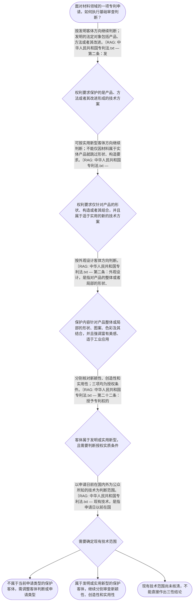

# 整合后的课程完整内容与习题

## 教学模块选择清单

- 当前教学节点：`patent-law-foundation`
- 板块预算：自适应 None/None，总计 None/None

| # | 模块 (block_type) | 类型 | 触发原因 (trigger) | 对应正文段 | 归属 |
|---:|---|:--:|---|---|:--:|
| 1 | `anchor_scenario` | 自适应 | perception=sensing(0.84) / cold_start | 材料研发项目的专利判断入口｜某材料研发团队开发了一种用于锂电池隔膜的复合材料，并准备申请专利。技术负责人提出三个问题：第… | [A] |
| 2 | `legal_anchor` | 必选 | mandatory | 保护客体与授权条件的法条锚定｜《专利法》第二条 | [A] |
| 3 | `worked_example` | 自适应 | cold_start(low_confidence) | 复合材料成果的基础审查链｜某公司研发出一种耐高温复合涂层，技术资料记载了涂层的组成和制备方法，但尚未确定申请类型。研发… | [A] |
| 4 | `decision_flow` | 自适应 | input=visual(0.78) | 材料专利基础审查决策流程｜面对材料领域的一项专利申请，如何执行基础审查判断？ | [A] |
| 5 | `mnemonic` | 自适应 | understanding=sequential(0.76) | 四栏基础判断表｜基础四栏核对表：先看“客体”，再看“三性”，再定“时间”，最后定“范围”。客体栏核对发明、实… | [A] |
| 6 | `reflect_prompt` | 自适应 | processing=reflective(0.70) | 从材料研发事实回到法律判断｜回想一个你熟悉的材料研发成果：如果要申请专利，你会把技术特征分别放入“保护客体”“三性”“申… | [A] |
| 7 | `assessment` | 必选 | mandatory | 本节三类测评｜核对专利制度三类保护客体及授权三性之间的基本关系 | [A] |
| 8 | `knowledge_synthesis` | 必选 | mandatory | 专利法律制度基础知识网络｜保护客体：先依据技术成果的内容判断其属于发明、实用新型或外观设计；材料领域尤其要区分材料本身… | [A] |
| 9 | `summary_card` | 自适应 | len(knowledge_sub_nodes)=3>=3 | 专利法律制度基础速查卡｜材料专利审查先定保护客体，再核对三性，并以申请日前国内外公众所知技术确定判断基础。 | [A] |

## 教学正文

## I — 法律问题

材料领域的研发成果准备申请专利时，首先要解决的不是“材料是否先进”，而是三个基础问题：其一，拟保护的内容属于发明、实用新型还是外观设计；其二，进入相应客体判断后，适用哪些授权条件；其三，后续新颖性、创造性判断所依据的现有技术如何确定。

本节只建立专利法律制度基础，不对某一具体材料申请作出新颖性或创造性结论。当前检索上下文未提供具体权利要求和对比文件，因此不能据此断言某项材料方案具备或不具备新颖性、创造性。

## R — 适用规则

### 1. 三类保护客体

《专利法》第二条规定，发明创造包括发明、实用新型和外观设计。发明是对产品、方法或者其改进提出的新的技术方案；实用新型是对产品的形状、构造或者其结合提出的适于实用的新的技术方案；外观设计是对产品的整体或者局部的形状、图案，或者其结合以及色彩与形状、图案的结合所作出的富有美感并适于工业应用的新设计。〔RAG: 中华人民共和国专利法.txt — 第二条：发明、实用新型和外观设计的定义〕

材料领域应特别区分：材料组成、材料配方、材料制备方法及其技术改进，通常应先从发明客体角度分析；实用新型的法定对象是产品的形状、构造或者其结合，不能仅因某种材料存在于实体产品中，就当然认定材料本身改进属于实用新型保护对象。〔RAG: 专利法律知识详细解读.txt — 既包含形状、构造特征又包含对材料本身提出改进的，不属于实用新型专利保护客体〕

### 2. 发明和实用新型的授权三性

《专利法》第二十二条规定，授予专利权的发明和实用新型应当具备新颖性、创造性和实用性。新颖性是指该发明或者实用新型不属于现有技术，也不存在法定的同样申请文件或公告文件情形；创造性要求发明相对于现有技术具有突出的实质性特点和显著的进步，实用新型要求具有实质性特点和进步；实用性是指能够制造或者使用，并且能够产生积极效果。〔RAG: 中华人民共和国专利法.txt — 第二十二条：发明和实用新型应当具备新颖性、创造性和实用性及其定义〕

三性是彼此区分的授权条件。材料配方“看起来新”，最多提示需要进行新颖性分析，不能替代创造性和实用性判断。

### 3. 现有技术的基础范围

《专利法》第二十二条规定，现有技术是申请日以前在国内外为公众所知的技术。〔RAG: 中华人民共和国专利法.txt — 本法所称现有技术，是指申请日以前在国内外为公众所知的技术〕因此，后续分析材料申请时，至少要固定两个坐标：时间上看申请日前，地域上看国内外；还要进一步核对公开内容是否真正涉及权利要求限定的技术方案。

### 4. 中国专利制度的规则层级与审查入口

中国专利制度的主要规范材料包括专利法、专利法实施细则和专利审查指南。当前检索材料说明，专利实质审查在新颖性和创造性审查之前，首先判断申请是否属于可以授权的对象和主题，并核对相关法定要求。〔RAG: 专利法专题讲座.txt — 专利实质审查过程中，在新颖性和创造性审查之前首先判断专利申请是否符合相关规定〕

专利制度的基本功能，是通过授予受法律保护的专有权，鼓励发明创造并促进技术公开、应用和经济发展。关于独占性的具体权利范围、时间性和地域性，以及早期公开延迟审查、初步审查与实质审查并存的制度发展细节，当前检索上下文未提供足够的具体法条或历史资料，本节不补写未经核验的具体期限或年份。

## A — 规则适用

对一项材料技术申请，可以按照以下顺序处理：

1. 先拆解权利要求的技术特征，确认拟保护的是材料组成、制备方法、产品形状构造，还是外观形状图案色彩。
2. 若是产品、方法或者其改进形成的技术方案，围绕发明客体进行判断；若主张实用新型，则必须进一步核对是否确实针对产品的形状、构造或者其结合；若主张外观设计，则核对产品外观及其美感、工业应用要求。
3. 客体判断通过后，对发明或实用新型分别核对新颖性、创造性和实用性，不把“新颖”作为三性合一的结论。
4. 开始新颖性和创造性分析前，建立申请日与公开事实时间轴，并从国内外资料中确定申请日前公众已经知晓的技术范围。
5. 如果某个结论缺少具体权利要求、公开日期或对比文件支持，应明确指出证据不足，而不是根据材料名称、性能提升或研发人员主观判断直接作出授权结论。

## C — 结论

材料领域专利审查的基础判断链是“先定保护客体，再核对授权三性，最后以申请日前国内外公众所知技术作为后续比较基础”。发明、实用新型和外观设计的保护对象不同；材料本身改进与产品形状、构造改进不可混同。新颖性和创造性是后续节点的重点，本节仅确定其法条入口与事实边界。

> 常见误区 / 易混淆点

- 把“材料是实体产品的一部分”误认为材料本身改进当然属于实用新型；关键仍是权利要求是否针对产品形状、构造或者其结合。
- 把“有新配方”直接等同于具备新颖性、创造性和实用性；三性必须分别判断。
- 只检索中国资料而忽略国外公开技术；现有技术的法定范围是申请日前在国内外为公众所知的技术。
- 在没有具体权利要求、申请日和对比文件时直接作出三性结论；这超出了当前证据支持范围。

本节设有测评，请到【习题】区作答。

### 材料研发项目的专利判断入口（anchor_scenario）

> 某材料研发团队开发了一种用于锂电池隔膜的复合材料，并准备申请专利。技术负责人提出三个问题：第一，这项成果究竟属于发明、实用新型还是外观设计的保护对象；第二，获得专利权是否只要技术方案新颖；第三，如果后来发现同类技术已经在国内外被公众知晓，申请是否仍有授权可能。代理人必须先区分保护客体，再核对专利授权的实质条件，不能仅凭“材料配方看起来新”作出结论。

**锚定**：用材料研发场景锚定保护客体、专利授权三性和现有技术之间的基本关系。

**先想一想**：面对一项新的材料配方或材料结构，你会先判断它属于哪类专利保护客体，还是先判断它是否具备新颖性？为什么？

### 保护客体与授权条件的法条锚定（legal_anchor）

- **《专利法》第二条**：第二条界定三类发明创造：发明是产品、方法或者其改进的新的技术方案；实用新型针对产品的形状、构造或者其结合；外观设计针对产品的形状、图案、色彩及其结合，并要求富有美感、适于工业应用。
- **《专利法》第二十二条**：第二十二条规定发明和实用新型授权应当具备新颖性、创造性和实用性，并分别说明三性的基本含义；现有技术是申请日前在国内外为公众所知的技术。
- **《专利法》第五条、第二十五条**：第五条、第二十五条规定部分违反法律、社会公德、妨害公共利益或属于法定排除范围的主题不能获得专利授权；当前检索材料未完整提供第二十五条具体排除事项。

**为何重要**：本节点的判断顺序必须从“是否属于可保护客体”开始，再核对授权条件。后续学习新颖性和创造性时，第二十二条提供总的法律入口，而第二条决定材料技术方案应以何种客体理解。

### 复合材料成果的基础审查链（worked_example）

**案情/例题**：某公司研发出一种耐高温复合涂层，技术资料记载了涂层的组成和制备方法，但尚未确定申请类型。研发人员认为“材料产品有新配方，所以直接申请实用新型即可”。需要演示：应如何确定判断入口，以及后续应核对哪些基本授权条件。
**适用规则**：适用《专利法》第二条和第二十二条。第二条先判断技术成果属于发明、实用新型或外观设计的保护对象；第二十二条再判断发明或实用新型是否具备新颖性、创造性和实用性。现有技术的判断基准是申请日前在国内外为公众所知的技术。〔RAG: 中华人民共和国专利法.txt — 第二条：发明创造是发明、实用新型和外观设计；第二十二条：发明和实用新型应当具备新颖性、创造性和实用性，现有技术是申请日以前在国内外为公众所知的技术〕
**分步推演**：
1. 先看拟保护的技术内容，而不是先看研发成果是否具有商业价值。若保护重点是材料组成、制备方法或对产品、方法的技术改进，应围绕其是否构成新的技术方案进行客体判断；第二条将发明定义为对产品、方法或者其改进提出的新的技术方案。〔RAG: 中华人民共和国专利法.txt — 第二条：发明，是指对产品、方法或者其改进所提出的新的技术方案〕 → *第一步是确定权利要求对应的保护客体和技术方案类型。*
2. 再区分实用新型的法定范围。实用新型针对产品的形状、构造或者其结合；检索材料还指出，单纯对材料本身提出的改进不属于实用新型保护客体。〔RAG: 中华人民共和国专利法.txt — 第二条：实用新型，是指对产品的形状、构造或者其结合所提出的适于实用的新的技术方案；专利法律知识详细解读.txt — 既包含形状、构造特征又包含对材料本身提出改进的，不属于实用新型保护客体〕 → *材料配方或材料本身的改进，不能仅因其属于产品材料就当然归入实用新型。*
3. 客体判断通过后，再进入授权条件判断。第二十二条要求发明和实用新型同时具备新颖性、创造性和实用性；其中新颖性、创造性和实用性是相互区分的审查问题，不能以其中一项替代其他项目。〔RAG: 中华人民共和国专利法.txt — 第二十二条：授予专利权的发明和实用新型，应当具备新颖性、创造性和实用性〕 → *第三步是分别核对三性，而不是把“新配方”直接等同于可以授权。*
4. 最后确定现有技术的时间和公开范围。第二十二条将现有技术界定为申请日前在国内外为公众所知的技术，因此材料领域检索不能只看国内专利文献，也不能忽略申请日前已经公开的技术资料。〔RAG: 中华人民共和国专利法.txt — 本法所称现有技术，是指申请日以前在国内外为公众所知的技术〕 → *第四步固定核对申请日、公开状态和地域范围。*
**结论**：该成果首先应按其权利要求所限定的技术方案判断保护客体；若其核心是材料组成、制备方法或材料改进形成的技术方案，通常应进入发明客体判断，但具体结论仍取决于权利要求的限定内容。进入授权条件判断后，不能只检查是否“新”，还必须分别核对新颖性、创造性和实用性。
**本题要点**：材料专利基础判断应固定采用“先客体、后三性，再核对申请日前国内外公开技术”的链条。

### 材料专利基础审查决策流程（decision_flow）

**决策问题**：面对材料领域的一项专利申请，如何执行基础审查判断？



### 四栏基础判断表（mnemonic）

**记忆锚**：基础四栏核对表：先看“客体”，再看“三性”，再定“时间”，最后定“范围”。客体栏核对发明、实用新型、外观设计；三性栏核对新颖性、创造性、实用性；时间栏锁定申请日前；范围栏锁定国内外公众所知技术。
**映射**：
- 客体
- 三性
- 时间
- 范围
**何时用**：审查材料配方、材料结构或制备方法的专利申请时，先逐栏填写四项，再进入新颖性和创造性等具体判断。

### 从材料研发事实回到法律判断（reflect_prompt）

**反思问题**：回想一个你熟悉的材料研发成果：如果要申请专利，你会把技术特征分别放入“保护客体”“三性”“申请日前公开情况”哪一栏？在作出结论前还缺少哪类事实？

**关注要点**：成果保护的是材料组成、制备方法、产品形状构造，还是外观形状图案色彩；新颖性、创造性和实用性是三个不同的授权条件，不能用“技术效果好”替代全部判断；申请日前是否已经在国内外为公众所知，以及公开内容是否覆盖拟保护的技术方案；当前材料只提供基础法条，未提供具体检索文献时，不应直接断言某项材料方案具备或不具备新颖性、创造性

**连接**：连接到学习者已有的材料研发经验，以及后续将学习的申请程序、新颖性和创造性判断。

### 专利法律制度基础知识网络（knowledge_synthesis）

**知识框架**：
- 保护客体：先依据技术成果的内容判断其属于发明、实用新型或外观设计；材料领域尤其要区分材料本身改进与产品形状、构造改进。
- 中国专利制度体系：专利法提供基本法律规则，专利法实施细则和专利审查指南用于补充程序与审查操作；本轮检索上下文未完整提供后两者的具体条文。
- 授权三性：发明和实用新型需要同时具备新颖性、创造性和实用性，三者是彼此区分的授权条件。
- 现有技术入口：现有技术以申请日前在国内外为公众所知的技术为范围，是后续新颖性和创造性判断的基础事实范围。
- 制度作用与发展特点：专利制度通过授予一定期限和地域范围内的专有权，交换发明创造的公开，并以初步审查、实质审查等机制实施授权审查；本轮检索上下文未提供具体期限、地域条文或完整历史资料。
**概念关系**：先判断保护客体，才能确定应适用发明、实用新型或外观设计的规则。；客体判断通过后，再进入新颖性、创造性和实用性的授权条件判断。；确定现有技术的申请日前时间界限和国内外公开范围，是开展新颖性、创造性判断的事实基础。；制度作用解释专利保护与技术公开之间的交换关系，审查制度则是授权条件落地的程序保障。
**必记**：《专利法》第二条区分发明、实用新型和外观设计三类保护客体。；《专利法》第二十二条要求发明和实用新型同时具备新颖性、创造性和实用性。；现有技术是申请日前在国内外为公众所知的技术；材料申请不能只检索国内资料。；材料本身的改进不能仅因其附着或存在于实体产品中就当然成为实用新型客体。

### 专利法律制度基础速查卡（summary_card）

**要点卡**：
- **三类保护客体**：发明看产品、方法或其改进；实用新型看产品形状、构造或其结合；外观设计看产品形状、图案、色彩及其结合。
- **授权三性**：发明和实用新型均须同时具备新颖性、创造性和实用性。
- **现有技术**：判断范围锁定申请日前在国内外为公众所知的技术。
- **材料申请入口**：材料组成或制备方法与产品形状、构造改进的客体判断不能混同。
- **证据边界**：没有具体检索文献时，只能说明法定判断框架，不能直接断言具体方案的三性结论。
**必背**：《专利法》第二条规定发明、实用新型和外观设计三类保护客体。；《专利法》第二十二条规定发明和实用新型应具备新颖性、创造性和实用性。；现有技术是申请日前在国内外为公众所知的技术。；材料本身改进不当然属于实用新型的形状、构造保护范围。
**一句话总结**：材料专利审查先定保护客体，再核对三性，并以申请日前国内外公众所知技术确定判断基础。

### 本节三类测评（assessment）

**三类覆盖**：backward_review、forward_probe、weakness_probe
**题目**：
- foundation-backward-1：核对专利制度三类保护客体及授权三性之间的基本关系
- application-forward-1：仅探测专利申请程序中申请文件这一下一节点主题
- foundation-weakness-1：区分材料本身改进、实用新型客体与发明客体的判断边界


## 结构化数据

## expert

```json
"expert_a"
```

## style

```json
"conservative"
```

## knowledge_points

```json
[
  {
    "node_id": "patent-law-foundation",
    "kc_name": "专利制度的基本概念与特征：独占性、时间性、地域性"
  },
  {
    "node_id": "patent-law-foundation",
    "kc_name": "中国专利制度体系：专利法、专利法实施细则、专利审查指南"
  },
  {
    "node_id": "patent-law-foundation",
    "kc_name": "专利保护的三种客体：发明、实用新型、外观设计"
  },
  {
    "node_id": "patent-law-foundation",
    "kc_name": "专利制度的作用：激励发明创造、促进技术公开、推动技术应用和经济发展"
  },
  {
    "node_id": "patent-law-foundation",
    "kc_name": "中国专利制度发展历程与特点：早期公开延迟审查、初步审查制与实质审查制并存"
  }
]
```

## legal_basis

```json
[
  {
    "article": "《专利法》第二条",
    "source": "中华人民共和国专利法.txt"
  },
  {
    "article": "《专利法》第二十二条",
    "source": "中华人民共和国专利法.txt"
  },
  {
    "article": "《专利法》第五条、第二十五条",
    "source": "专利法专题讲座.txt"
  }
]
```

## risks

```json
[
  {
    "risk": "当前检索上下文未提供专利权具体期限、地域效力和制度发展历程的完整法条或权威历史资料；相关内容只能作为概括性框架，不能补写未经检索核验的具体年份、期限或条款。",
    "related_node_id": "patent-law-foundation"
  },
  {
    "risk": "当前节点是专利法律制度基础，不能把新颖性、创造性、抵触申请、优先权或审查答复修改边界展开为新的主教学章节；本稿仅建立后续学习入口。",
    "related_node_id": "patent-law-foundation"
  },
  {
    "risk": "检索上下文提到专利法实施细则和专利审查指南，但未提供其完整具体条文；涉及二者的主张应在后续节点通过精确检索补充。",
    "related_node_id": "patent-law-framework"
  }
]
```

## draft_stage

```json
"debate"
```

## irac

```json
{
  "issue": "材料领域的技术成果申请专利时，如何确定其基本保护客体，并建立后续新颖性、创造性审查的法律判断入口？",
  "rule": "《专利法》第二条规定发明、实用新型和外观设计的保护对象；《专利法》第二十二条规定发明和实用新型应具备新颖性、创造性和实用性，并将现有技术界定为申请日前在国内外为公众所知的技术。对于不能获得授权的主题，检索材料指向《专利法》第五条、第二十五条，但未提供第二十五条完整条文。",
  "application": "对材料领域申请，先识别权利要求实际限定的是材料组成、制备方法、产品形状构造，还是外观形状图案色彩。材料组成或制备方法的改进应围绕发明客体判断；实用新型则要求产品的形状、构造或者其结合。客体判断通过后，依照第二十二条分别核对新颖性、创造性和实用性，并以申请日前在国内外为公众所知的技术确定现有技术范围。当前检索上下文没有提供具体材料申请的完整权利要求和对比文件，因此不能据此直接作出具体三性结论。",
  "conclusion": "专利法律制度基础的核心是先定保护客体，再核对授权三性，并固定申请日前、国内外公众所知的现有技术判断边界。材料本身改进与产品形状、构造改进不可混同。"
}
```

## interactive_questions

```json
[
  {
    "qid": "foundation-backward-1",
    "category": "remember",
    "difficulty": "L1",
    "source_tag": "backward_review",
    "kc_node_id": "patent-law-foundation",
    "question": "根据《专利法》第二条，下列关于专利保护客体的表述正确的是？",
    "answer": "B",
    "options": [
      "A. 专利保护客体只有发明和实用新型",
      "B. 发明、实用新型和外观设计是专利法规定的三类发明创造",
      "C. 新颖性、创造性和实用性属于三类保护客体",
      "D. 国内外公众所知技术属于外观设计保护客体"
    ]
  },
  {
    "qid": "application-forward-1",
    "category": "remember",
    "difficulty": "L1",
    "source_tag": "forward_probe",
    "kc_node_id": "patent-application-process",
    "question": "下列哪项属于下一节点“专利申请程序”中将学习的申请文件内容？",
    "answer": "C",
    "options": [
      "A. 只提交技术人员口头说明即可",
      "B. 只提交产品实物即可",
      "C. 包括请求书、说明书及其摘要、权利要求书等申请文件",
      "D. 只提交权利要求书，不需要其他文件"
    ]
  },
  {
    "qid": "foundation-weakness-1",
    "category": "analyze",
    "difficulty": "L3",
    "source_tag": "weakness_probe",
    "kc_node_id": "patent-law-foundation",
    "question": "某申请的核心是复合材料配方及其性能改进，没有限定产品的形状、构造。根据当前检索材料，哪项判断最稳妥？",
    "answer": "A",
    "options": [
      "A. 仅因材料本身得到改进，不能直接认定为实用新型的形状、构造保护客体",
      "B. 只要材料是实体产品的一部分，就当然属于实用新型保护客体",
      "C. 材料配方改进必然属于外观设计保护客体",
      "D. 只要具有新颖性，就不必再判断创造性和实用性"
    ]
  }
]
```

## knowledge_synthesis

```json
{
  "node": "patent-law-foundation",
  "coverage": [
    {
      "node_id": "patent-rights-nature"
    },
    {
      "node_id": "patent-law-framework"
    },
    {
      "node_id": "patent-law-foundation"
    },
    {
      "node_id": "patent-system-overview"
    }
  ],
  "confusable_pairs": []
}
```
