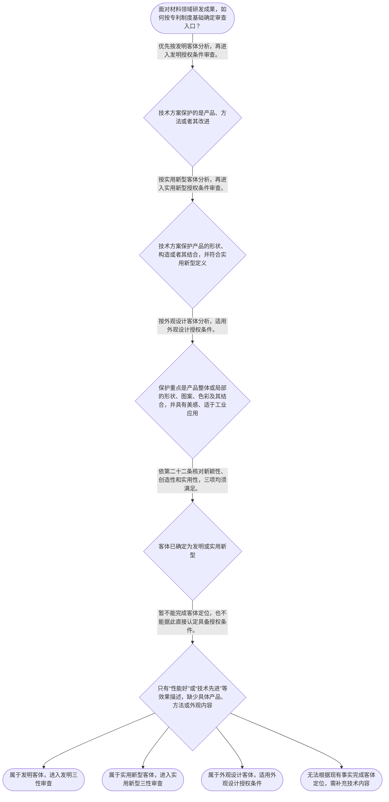

# 整合后的课程完整内容与习题

## 教学模块选择清单

- 当前教学节点：`patent-law-foundation`
- 板块预算：自适应 7/7，总计 9/9

| # | 模块 (block_type) | 类型 | 触发原因 (trigger) | 对应正文段 | 归属 |
|---:|---|:--:|---|---|:--:|
| 1 | `anchor_scenario` | 自适应 | perception=sensing(0.84) / cold_start | 材料研发成果进入专利制度的第一道判断｜某材料研发团队开发出一种用于电池隔膜的复合材料，方案包括聚合物基体、无机填料和特定界面处理层… | [A] |
| 2 | `legal_anchor` | 必选 | mandatory | 用第二条和第二十二条固定制度入口与授权门槛｜《专利法》第二条 | [A] |
| 3 | `worked_example` | 自适应 | cold_start(low_confidence) | 复合材料成果的制度定位示范｜甲公司研发一种用于电池隔膜的复合材料，方案包括聚合物基体、无机填料以及界面处理层，并主张该组… | [A] |
| 4 | `decision_flow` | 自适应 | input=visual(0.78) | 材料成果的专利制度基础判断流程｜面对材料领域研发成果，如何按专利制度基础确定审查入口？ | [A] |
| 5 | `mnemonic` | 自适应 | understanding=sequential(0.76) | 专利制度基础四栏定位表｜基础判断四栏表：客体—类型—门槛—依据。先填“保护什么”，再填“发明/实用新型/外观设计”，… | [A] |
| 6 | `reflect_prompt` | 自适应 | processing=reflective(0.70) | 把研发事实转换为专利法律分类｜回想一个你熟悉的材料研发成果：如果把它写成专利申请，你会如何区分其产品、制造方法、结构特征和… | [A] |
| 7 | `assessment` | 必选 | mandatory | 专利制度基础三类测评｜识别专利保护客体的三种基本类型。 | [A] |
| 8 | `knowledge_synthesis` | 必选 | mandatory | 专利法律制度基础知识框架｜专利客体与类型：发明、实用新型和外观设计分别对应不同的法定保护内容。 | [A] |
| 9 | `summary_card` | 自适应 | len(knowledge_sub_nodes)=3>=3 | 专利制度基础速查卡｜专利基础判断的主线是：先确定保护什么，再确定属于哪类专利，最后逐项核对相应授权条件。 | [A] |

## 教学正文

## I — 法律问题

本节的核心问题是：面对材料领域的研发成果，如何先确定其是否属于专利法保护的客体，再定位适用的专利类型与授权条件，并为后续的新颖性、创造性判断建立正确入口。

## R — 适用规则

### 1. 专利保护客体与类型

《专利法》第二条规定：“本法所称的发明创造是指发明、实用新型和外观设计。发明，是指对产品、方法或者其改进所提出的新的技术方案。实用新型，是指对产品的形状、构造或者其结合所提出的适于实用的新的技术方案。外观设计，是指对产品的整体或者局部的形状、图案或者其结合以及色彩与形状、图案的结合所作出的富有美感并适于工业应用的新设计。”〔RAG: 中华人民共和国专利法.txt — 第二条：发明创造包括发明、实用新型和外观设计；分别规定三类客体〕

因此，不能仅凭“材料成果”这一行业名称决定专利类型，而要观察权利要求实际保护的技术内容：产品、方法及其改进通常进入发明客体分析；产品的形状、构造或者其结合可能进入实用新型客体分析；产品整体或局部的外观形状、图案、色彩及其结合，则进入外观设计客体分析。

### 2. 发明和实用新型的三性门槛

《专利法》第二十二条规定，授予专利权的发明和实用新型应当具备新颖性、创造性和实用性；该条同时规定，现有技术是申请日以前在国内外为公众所知的技术。〔RAG: 中华人民共和国专利法.txt — 第二十二条：发明和实用新型应具备新颖性、创造性和实用性；现有技术是申请日以前在国内外为公众所知的技术〕

这三个条件是并列的授权门槛。材料方案即使能够制造、性能良好，也不能因此当然推出新颖性或创造性成立。实用性解决“能否制造或使用并产生积极效果”的问题；新颖性与创造性则需要依据相应的技术公开和比较方法分别判断。本节只固定三性的制度位置，具体的新颖性单独对比原则、抵触申请边界及创造性三步法将在对应后续节点展开。

### 3. 外观设计的基本门槛

《专利法》第二十三条规定，授予专利权的外观设计应当不属于现有设计，并且与现有设计或者现有设计特征的组合相比具有明显区别。该条还规定，现有设计是申请日以前在国内外为公众所知的设计。〔RAG: 中华人民共和国专利法.txt — 第二十三条：外观设计不得属于现有设计，并应与现有设计或其组合相比具有明显区别〕

因此，外观设计不能直接套用发明和实用新型的“三性”表述，而应先确认其外观设计客体，再适用相应的授权条件。

### 4. 制度框架与制度作用

中国专利制度的规范层次至少包括专利法、专利法实施细则和专利审查指南。专利法提供基本制度与授权条件，实施细则补充程序和具体操作规范，审查指南进一步提供审查判断中的操作性说明。本轮检索上下文未提供三者完整体系及制度发展历程的直接原文，因此关于早期公开、延迟审查、初步审查与实质审查并存等历史和程序性表述，仅作为后续学习定位，不在本节作超出检索依据的详细论证。

专利制度的基本作用可概括为：通过授予一定期限和地域范围内的排他性权利，激励发明创造，同时以公开技术换取法律保护，促进技术应用与经济发展。专利权的独占性、时间性和地域性是理解该制度的基本特征，但具体权利期限和地域效力应以相应法条及申请、授权事实为准。

## A — 规则适用

以材料领域的复合材料研发成果为例，第一步不是直接判断“是否有创造性”，而是识别申请所要保护的技术内容。若权利要求保护聚合物基体、无机填料及界面处理层形成的产品技术方案，通常应先按发明客体分析；若保护的是产品的形状、构造或者其结合，还需进一步核对实用新型客体条件；若保护重点是产品外观，则应转入外观设计客体与授权条件分析。

第二步是确认适用的授权门槛。发明或实用新型客体适格，并不等于已经满足授权条件，仍须分别核对新颖性、创造性和实用性。某项材料具有较好的制造效果，只能为实用性分析提供事实方向，不能替代对申请日前公开情况以及技术方案比较关系的判断。

第三步是固定判断顺序：先判断保护客体和专利类型，再确定适用的授权条件，最后根据具体事实和证据进入相应的实质判断。不能把“属于发明”误认为“具备创造性”，也不能把“能够制造”误认为“三性均已满足”。

本节设有测评，请到【习题】区作答。

> 常见误区 / 易混淆点
>
> 1. “材料领域”不是独立的专利类型；必须看实际保护的产品、方法、结构或外观内容。
> 2. 客体适格只是进入授权条件审查的前提，不等于已经获得授权。
> 3. 实用性、新颖性和创造性不能相互替代；后续学习中还要严格区分新颖性的单独对比与创造性的组合评价。
> 4. 现有技术、抵触申请和程序文件的作用并不相同，不能看到“申请日前”就不加区分地套用同一种判断方法。

## C — 结论

材料领域专利分析应遵循“先定客体，再定类型，后核授权条件”的基本路径。发明、实用新型和外观设计具有不同的法定定义与审查入口；发明和实用新型还必须同时满足新颖性、创造性和实用性。掌握这一制度基础，才能在后续节点中正确进入新颖性和创造性判断，而不发生概念或方法混用。

### 材料研发成果进入专利制度的第一道判断（anchor_scenario）

> 某材料研发团队开发出一种用于电池隔膜的复合材料，方案包括聚合物基体、无机填料和特定界面处理层，团队认为该组合改善了隔膜性能。负责人准备申请专利，但团队尚未区分产品方案、制造方法、结构特征与外观特征，也没有明确客体适格与授权条件之间的关系。代理人需要先定位：这项成果属于哪类保护客体，专利权具有什么基本特征，以及申请发明或实用新型时需要跨过哪些授权门槛。

**锚定**：用材料研发事实锚定保护客体、专利权基本特征、制度体系和授权条件之间的关系。

**先想一想**：面对这项复合材料成果，法律分析应先判断保护客体和专利类型，还是先判断新颖性与创造性？请先确定你的判断顺序。

### 用第二条和第二十二条固定制度入口与授权门槛（legal_anchor）

- **《专利法》第二条**：第二条先划定专利制度保护的对象：发明、实用新型和外观设计分别对应不同的技术或外观内容。
- **《专利法》第二十二条**：第二十二条规定，发明和实用新型要获得专利权，必须同时具备新颖性、创造性和实用性；现有技术是申请日前在国内外为公众所知的技术。
- **《专利法》第二十三条**：第二十三条规定，外观设计不得属于现有设计，并且应当与现有设计或者其组合相比具有明显区别。

**为何重要**：第二条解决“保护什么”的入口问题，第二十二条解决发明和实用新型“能否授权”的核心门槛，第二十三条固定外观设计的不同审查入口。后续学习新颖性和创造性时，必须先准确定位这些概念在制度体系中的位置。

### 复合材料成果的制度定位示范（worked_example）

**案情/例题**：甲公司研发一种用于电池隔膜的复合材料，方案包括聚合物基体、无机填料以及界面处理层，并主张该组合能够改善隔膜性能。问：在专利法律制度基础层面，应如何定位该成果，并确定后续审查入口？
**适用规则**：《专利法》第二条、第二十二条和第二十三条。第二条用于识别发明、实用新型和外观设计的保护客体；第二十二条用于判断发明和实用新型的三性；第二十三条用于判断外观设计的相应条件。
**分步推演**：
1. 先看成果是否属于第二条列举的发明创造类型。材料配方及其改进属于产品技术方案；如果权利要求保护制造该材料的方法，也应按方法技术方案分析。 → *第一步是识别保护客体，不能一开始就跳到创造性结论。*
2. 再区分专利类型。发明的定义覆盖产品、方法或者其改进提出的新的技术方案；实用新型限于产品的形状、构造或者其结合；外观设计关注产品的形状、图案、色彩及其结合。 → *材料配方或制造方法通常应先从发明客体分析，不能仅因产品具有结构就当然认定为实用新型。*
3. 确定属于发明或实用新型后，进入第二十二条的三性门槛。新颖性、创造性和实用性是并列授权条件，不能用“材料确实能够制成”替代新颖性或创造性判断。 → *客体适格不等于当然授权，还要逐项审查三性。*
4. 本例没有给出申请日前的具体公开资料，也没有给出完整可比技术特征，因此只能确定审查路径，不能凭材料名称或技术效果直接认定新颖性、创造性成立。 → *事实和证据不足时，应停留在可核验的制度定位。*
**结论**：该复合材料成果首先应按具体权利要求判断保护客体和专利类型；若属于发明或实用新型，还须分别审查新颖性、创造性和实用性。现有事实不足以直接作出三性成立与否的结论。
**本题要点**：材料专利分析应按“先定保护客体，再定位专利类型，最后进入授权条件”的顺序展开。

### 材料成果的专利制度基础判断流程（decision_flow）

**决策问题**：面对材料领域研发成果，如何按专利制度基础确定审查入口？



### 专利制度基础四栏定位表（mnemonic）

**记忆锚**：基础判断四栏表：客体—类型—门槛—依据。先填“保护什么”，再填“发明/实用新型/外观设计”，再填“适用哪组授权条件”，最后填“对应法条”。
**映射**：
- 客体
- 类型
- 门槛
- 依据
**何时用**：分析材料研发成果、阅读审查意见或准备学习新颖性与创造性时，先按四栏表定位问题，避免把客体分类、授权条件和具体判断方法混为一谈。

### 把研发事实转换为专利法律分类（reflect_prompt）

**反思问题**：回想一个你熟悉的材料研发成果：如果把它写成专利申请，你会如何区分其产品、制造方法、结构特征和外观特征，并分别确定后续审查入口？

**关注要点**：技术成果的核心保护内容究竟是产品、方法、结构还是外观特征；同一研发项目可能包含不同类型的技术内容，但不能因此跳过具体权利要求的客体分析；客体适格只是进入授权条件审查的前提，不等于已经满足新颖性、创造性和实用性

**连接**：连接到学习者已有的材料研发经验，并为后续新颖性、创造性判断建立“技术事实—法律客体—授权门槛”的转换习惯。

### 专利法律制度基础知识框架（knowledge_synthesis）

**知识框架**：
- 专利客体与类型：发明、实用新型和外观设计分别对应不同的法定保护内容。
- 专利权基本特征：专利权具有排他性，并受时间和地域范围限制，具体效力需结合授权与法律规定判断。
- 中国专利制度体系：专利法确立基本制度，专利法实施细则补充程序规范，专利审查指南提供审查操作说明。
- 三性授权门槛：发明和实用新型须同时具备新颖性、创造性和实用性。
- 制度作用与发展：专利制度通过保护与公开的交换激励创新、促进技术应用；制度发展形成不同审查程序并存的制度格局。
**概念关系**：客体分类决定专利类型，专利类型决定后续适用的授权条件。；制度体系提供规则层次：专利法规定基本门槛，实施细则和审查指南补充程序与操作。；三性制度定位是后续学习新颖性单独对比、抵触申请边界和创造性三步法的前置框架。
**必记**：先判断保护客体和专利类型，再确定适用的授权条件。；发明和实用新型的新颖性、创造性、实用性是并列条件，任何一项不足都不能当然授权。；能够制造或性能良好主要关联实用性，不能据此推出新颖性或创造性成立。；外观设计适用现有设计和明显区别等相应条件，不能机械套用发明和实用新型的三性表述。

### 专利制度基础速查卡（summary_card）

**要点卡**：
- **保护客体**：先看权利要求保护的是产品、方法、结构还是外观。
- **三种专利类型**：发明、实用新型、外观设计对应不同法定客体。
- **三性门槛**：发明和实用新型须同时满足新颖性、创造性和实用性。
- **制度体系**：专利法定基本规则，实施细则和审查指南补充程序与操作。
- **判断顺序**：先定客体，再定类型，后核授权条件。
**必背**：《专利法》第二条规定发明、实用新型和外观设计三类发明创造。；《专利法》第二十二条规定发明和实用新型应具备新颖性、创造性和实用性。；客体适格不等于满足授权条件；实用性不能替代新颖性和创造性。
**一句话总结**：专利基础判断的主线是：先确定保护什么，再确定属于哪类专利，最后逐项核对相应授权条件。

### 专利制度基础三类测评（assessment）

**三类覆盖**：backward_review、forward_probe、weakness_probe
**题目**：
- q-foundation-1：识别专利保护客体的三种基本类型。
- q-foundation-2：探测申请文件的基本组成，连接下一节点专利申请程序。
- q-foundation-3：区分实用性与新颖性、创造性，识别三性不可相互替代。


## 结构化数据

## expert

```json
"expert_a"
```

## style

```json
"conservative"
```

## knowledge_points

```json
[
  {
    "node_id": "patent-law-foundation",
    "kc_name": "专利制度的基本概念与特征：独占性、时间性、地域性"
  },
  {
    "node_id": "patent-law-foundation",
    "kc_name": "中国专利制度体系：专利法、专利法实施细则、专利审查指南"
  },
  {
    "node_id": "patent-law-foundation",
    "kc_name": "专利保护的三种客体：发明、实用新型、外观设计"
  },
  {
    "node_id": "patent-law-foundation",
    "kc_name": "专利制度的作用：激励发明创造、促进技术公开、推动技术应用和经济发展"
  },
  {
    "node_id": "patent-law-foundation",
    "kc_name": "中国专利制度发展历程与特点：早期公开延迟审查、初步审查制与实质审查制并存"
  }
]
```

## legal_basis

```json
[
  {
    "article": "《中华人民共和国专利法》第二条",
    "source": "中华人民共和国专利法.txt"
  },
  {
    "article": "《中华人民共和国专利法》第二十二条",
    "source": "中华人民共和国专利法.txt"
  },
  {
    "article": "《中华人民共和国专利法》第二十三条",
    "source": "中华人民共和国专利法.txt"
  }
]
```

## risks

```json
[
  {
    "risk": "将材料技术领域名称直接等同于专利类型，忽略权利要求实际保护的产品、方法、结构或外观内容。",
    "related_node_id": "patent-law-foundation"
  },
  {
    "risk": "把能够制造或性能良好直接等同于同时具备新颖性和创造性。",
    "related_node_id": "patentability-substantive"
  },
  {
    "risk": "将外观设计的授权条件与发明、实用新型的三性判断完全混用。",
    "related_node_id": "design-patentability"
  },
  {
    "risk": "将抵触申请直接当作创造性评价中的普通现有技术使用。",
    "related_node_id": "conflicting-application"
  },
  {
    "risk": "本轮检索上下文未提供专利制度发展历程及审查程序完整依据，相关历史细节不作扩展性断言。",
    "related_node_id": "patent-system-overview"
  }
]
```

## draft_stage

```json
"debate"
```

## irac

```json
{
  "issue": "材料领域研发成果应如何确定专利保护客体、专利类型及相应授权条件，并为后续新颖性和创造性判断建立正确入口？",
  "rule": "《专利法》第二条将发明创造分为发明、实用新型和外观设计，并分别规定其客体；第二十二条规定发明和实用新型应具备新颖性、创造性和实用性；第二十三条规定外观设计的相应授权条件。",
  "application": "对材料研发成果，应先根据权利要求实际保护的产品、方法、形状构造或外观确定客体和类型，再适用相应授权条件。材料能够制造或性能良好不能替代新颖性、创造性判断。",
  "conclusion": "材料专利分析应按“先定客体、再定类型、后核授权条件”的顺序进行；客体适格不等于当然满足授权条件。"
}
```

## interactive_questions

```json
[
  {
    "qid": "q-foundation-1",
    "category": "remember",
    "difficulty": "L1",
    "source_tag": "backward_review",
    "kc_node_id": "patent-law-foundation",
    "question": "根据《专利法》第二条，下列哪一项属于专利保护客体的完整分类？",
    "answer": "B",
    "options": [
      "A. 发明、商标、著作权",
      "B. 发明、实用新型、外观设计",
      "C. 产品、商标、商业秘密",
      "D. 方法、商标、外观设计"
    ]
  },
  {
    "qid": "q-foundation-2",
    "category": "understand",
    "difficulty": "L1",
    "source_tag": "forward_probe",
    "kc_node_id": "patent-application-process",
    "question": "关于专利申请程序，下列哪一项属于下一节点需要掌握的申请文件内容？",
    "answer": "C",
    "options": [
      "A. 侵权判决书和赔偿计算表",
      "B. 专利权评价报告和无效宣告决定",
      "C. 请求书、说明书及其摘要、权利要求书等",
      "D. 商业合同、采购发票和产品宣传册"
    ]
  },
  {
    "qid": "q-foundation-3",
    "category": "analyze",
    "difficulty": "L3",
    "source_tag": "weakness_probe",
    "kc_node_id": "patent-law-foundation",
    "question": "某材料配方在申请日前已被公众知悉，但申请人证明该配方能够稳定制造并产生积极效果。仅依据《专利法》第二十二条，下列判断最准确的是：",
    "answer": "C",
    "options": [
      "A. 只要能够制造并产生积极效果，就当然具备新颖性和创造性",
      "B. 只要属于材料产品，就不需要再判断授权条件",
      "C. 能够制造并产生积极效果主要对应实用性，仍不能据此推出新颖性和创造性成立",
      "D. 只要申请人有研发记录，就可以排除申请日前公开对新颖性的影响"
    ]
  }
]
```

## knowledge_synthesis

```json
{
  "node": "patent-law-foundation",
  "coverage": [
    {
      "node_id": "patent-rights-nature"
    },
    {
      "node_id": "patent-law-framework"
    },
    {
      "node_id": "patent-law-foundation"
    },
    {
      "node_id": "patent-system-overview"
    },
    {
      "node_id": "patent-system-overview"
    }
  ],
  "confusable_pairs": []
}
```
