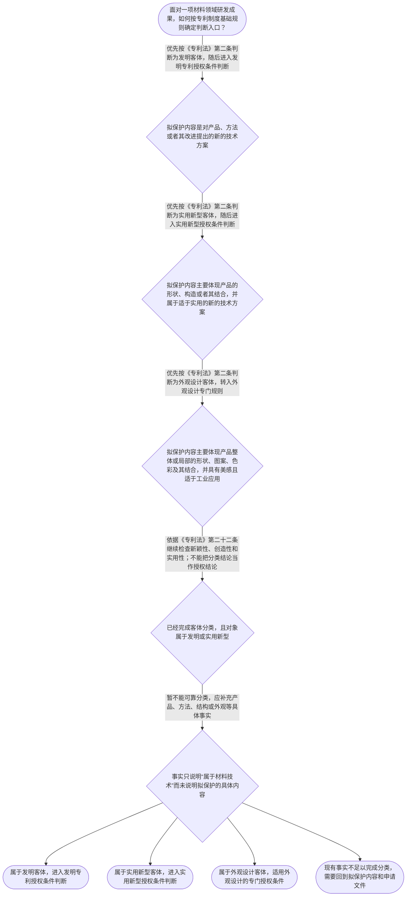

# 整合后的课程完整内容与习题

## 教学模块选择清单

- 当前教学节点：`patent-law-foundation`
- 板块预算：自适应 7/7，总计 9/9

| # | 模块 (block_type) | 类型 | 触发原因 (trigger) | 对应正文段 | 归属 |
|---:|---|:--:|---|---|:--:|
| 1 | `anchor_scenario` | 自适应 | perception=sensing(0.84) / cold_start | 从材料研发成果看专利制度｜某材料研发团队开发出一种耐高温复合涂层：配方由多种组分及比例构成，涂覆后还形成特定的层状结构… | [A] |
| 2 | `legal_anchor` | 必选 | mandatory | 法条锚定：客体、三性与审查机关｜《中华人民共和国专利法》第二条 | [A] |
| 3 | `worked_example` | 自适应 | cold_start(low_confidence) | 案例演示：同一材料成果的客体分类｜甲公司研发出一种用于电池隔膜的复合材料。研发成果包括：一种由组分甲、乙及特定比例构成的材料配… | [A] |
| 4 | `decision_flow` | 自适应 | input=visual(0.78) | 材料专利基础判断流程｜面对一项材料领域研发成果，如何按专利制度基础规则确定判断入口？ | [A] |
| 5 | `mnemonic` | 自适应 | understanding=sequential(0.76) | 专利制度基础四格表｜基础判断四格表：先“客体”，再“机关”，后“三性”，最后“边界”。客体看发明、实用新型、外观… | [A] |
| 6 | `reflect_prompt` | 自适应 | processing=reflective(0.70) | 把法律分类带回研发现场｜回想一项你熟悉的材料研发成果：其中哪些内容是配方或方法，哪些内容是产品结构，哪些内容只是外观… | [A] |
| 7 | `assessment` | 必选 | mandatory | 本节三类测评｜识别三类保护客体与发明、实用新型授权三性的关系 | [A] |
| 8 | `knowledge_synthesis` | 必选 | mandatory | 专利法律制度基础知识网络｜基本概念与特征：专利制度通过法律授予和保护专利权，使权利具有独占性；具体权利边界和期限、地域… | [A] |
| 9 | `summary_card` | 自适应 | len(knowledge_sub_nodes)=3>=3 | 专利制度基础速查卡｜先按拟保护内容确定专利客体，再依据对应规则判断是否满足授权条件。 | [A] |

## 教学正文

## I — 法律问题

材料领域的研发成果如何确定专利保护客体？确定客体后，是否就当然能够获得专利权？本节只建立专利法律制度的基础分类框架，并为后续新颖性、创造性判断建立入口。

## R — 适用规则

《专利法》第二条将发明创造分为发明、实用新型和外观设计。发明关注产品、方法或者其改进提出的新的技术方案；实用新型关注产品的形状、构造或者其结合；外观设计关注产品整体或局部的形状、图案、色彩及其结合，并要求具有美感、适于工业应用。〔RAG: 中华人民共和国专利法.txt — 第二条：发明、实用新型和外观设计的定义〕

《专利法》第二十二条规定，授予发明和实用新型专利权应当具备新颖性、创造性和实用性。新颖性判断涉及申请日以前是否已经成为现有技术，以及特定的在先申请文件规则；创造性判断关注相对于现有技术是否具有相应的实质性特点和进步；实用性关注能否制造或者使用并产生积极效果。〔RAG: 中华人民共和国专利法.txt — 第二十二条：三性、现有技术以及发明和实用新型的授权条件〕

《专利法》第三条规定，国务院专利行政部门负责管理全国专利工作，统一受理和审查专利申请，并依法授予专利权。〔RAG: 中华人民共和国专利法.txt — 第三条：国务院专利行政部门统一受理和审查专利申请〕

专利制度的规范学习应区分《专利法》、专利法实施细则和专利审查指南。本次检索上下文直接提供了《专利法》相关条文，但未提供实施细则和审查指南的具体原文，因此后两者在本节仅作为规范来源框架介绍。

专利制度通常被概括为通过授予一定范围的专利权保护发明创造，并以技术公开和技术应用促进创新与经济发展。但本次检索上下文未提供完整的立法宗旨条文，不能据此编造具体条号或扩大为未经核验的法条结论。关于早期公开、延迟审查以及初步审查与实质审查并存等制度发展特点，检索上下文也未提供完整直接依据，应留待后续程序节点核验。

## A — 规则适用

第一步，识别拟保护的具体内容。不能只因为成果属于材料领域，就直接确定专利类型；应观察申请人要保护的是配方、方法、产品结构，还是产品外观。

第二步，将事实与第二条的客体定义对应。配方或方法如果体现为产品、方法或其改进的技术方案，应围绕发明客体理解；产品的形状、构造或其结合，应核对实用新型客体；产品的形状、图案、色彩及其结合形成的外观表现，应核对外观设计客体。

第三步，分开客体分类和授权条件。即使成果可以归入发明或实用新型，也只说明找到了相应的法律审查入口，不能说明已经满足新颖性、创造性和实用性。后续判断新颖性时要围绕申请日前的现有技术及法定在先申请规则展开；创造性则是另一项需要独立分析的判断。

第四步，识别制度运行主体。申请的统一受理和审查属于国务院专利行政部门的职责范围，但审查机关的确定不等于具体申请已经符合授权条件。

以材料研发为例：同一项目可能同时产生材料配方、产品结构和产品外观三类不同法律问题。应先分别明确拟保护内容，再依据第二条进行客体分类，最后对属于发明或实用新型的对象进入第二十二条规定的三性判断。不能以商业价值、研发难度或技术所属行业直接替代法律要件分析。

> 常见误区 / 易混淆点
>
> 1. 把“材料技术”当作专利客体。技术领域只是事实背景，法律分类取决于拟保护的具体内容。
> 2. 把客体合格当作已经具备新颖性或创造性。客体分类是进入审查的第一步，三性是后续独立门槛。
> 3. 把新颖性和创造性混为一谈。第二十二条同时规定二者，但具体判断对象和论证方式不同，后续节点将分别展开。
> 4. 把制度背景概括当作法条结论。对于检索上下文未提供直接依据的制度史或程序细节，应先核验来源。

本节设有测评，请到【习题】区作答。

### 从材料研发成果看专利制度（anchor_scenario）

> 某材料研发团队开发出一种耐高温复合涂层：配方由多种组分及比例构成，涂覆后还形成特定的层状结构，最终产品的表面纹理和色彩也具有独特外观。团队准备申请专利，但成员对三个问题存在分歧：这些成果是否都属于同一种专利保护客体？申请后是否当然能够获得专利权？在审查中，审查员还会如何区分保护客体与新颖性、创造性等授权条件？

**锚定**：以材料研发中的配方、结构和外观事实，锚定专利保护客体、专利制度特征以及授权实质条件之间的区别。

**先想一想**：面对同一项材料研发成果中的配方、结构和外观，你会先判断其属于哪一种保护客体，还是先判断它是否具有新颖性和创造性？为什么？

### 法条锚定：客体、三性与审查机关（legal_anchor）

- **《中华人民共和国专利法》第二条**：第二条把发明创造分为发明、实用新型和外观设计，并分别说明三类客体的基本定义：发明侧重产品、方法或其改进提出的新的技术方案；实用新型侧重产品的形状、构造或其结合；外观设计侧重产品外观及其组合所形成的设计。
- **《中华人民共和国专利法》第二十二条**：第二十二条规定，发明和实用新型获得专利权应具备新颖性、创造性和实用性，并界定了现有技术以及三性的基本含义。
- **《中华人民共和国专利法》第三条**：第三条明确国务院专利行政部门负责管理全国专利工作，统一受理和审查专利申请并依法授予专利权。

**为何重要**：本节点首先要建立保护客体、授权条件和审查机关三条基础主线。后续学习新颖性、创造性和申请程序时，都要以这些法条中的分类与边界为起点。

### 案例演示：同一材料成果的客体分类（worked_example）

**案情/例题**：甲公司研发出一种用于电池隔膜的复合材料。研发成果包括：一种由组分甲、乙及特定比例构成的材料配方；一种具有特定层状排列的隔膜结构；以及该隔膜产品表面的新颖纹理。公司希望把三项成果都写入一份专利申请。问：在专利制度基础层面，应如何区分其保护客体和后续审查入口？
**适用规则**：适用《中华人民共和国专利法》第二条和第二十二条。第二条用于判断申请对象属于发明、实用新型还是外观设计；第二十二条用于判断发明和实用新型是否需要满足新颖性、创造性和实用性。
**分步推演**：
1. 先观察拟保护的技术内容，而不是只看研发所属行业。配方属于对产品或其改进提出的技术方案，层状排列体现产品结构，产品表面纹理属于外观表现。 → *第一步：按拟保护内容识别客体。*
2. 依据第二条，发明覆盖产品、方法或者其改进所提出的新的技术方案；实用新型集中于产品的形状、构造或者其结合；外观设计针对产品的形状、图案、色彩及其结合形成的设计。 → *第二步：将事实分别对应法定客体定义。*
3. 分类完成后，再看授权条件。第二十二条明确发明和实用新型应具备新颖性、创造性和实用性；客体分类本身并不等于三性已经满足。 → *第三步：把客体分类与三性审查分开。*
4. 对于同一研发项目中的不同成果，不能因为它们都服务于同一材料产品，就直接把配方、结构和外观混同为一个法律客体。具体能否合并申请以及申请文件组织方式属于申请程序和撰写问题，本节不展开。 → *第四步：保持法律分类边界。*
**结论**：该材料成果不能仅凭“属于材料技术”这一事实确定专利类型或当然获得授权。应先根据权利要求拟保护的技术内容进行客体分类，再分别进入相应的授权条件审查；其中发明和实用新型需要继续检验新颖性、创造性和实用性。
**本题要点**：处理材料专利基础问题时，先按保护内容分类，再进入授权条件判断，不能用技术领域替代法律客体分类。

### 材料专利基础判断流程（decision_flow）

**决策问题**：面对一项材料领域研发成果，如何按专利制度基础规则确定判断入口？



### 专利制度基础四格表（mnemonic）

**记忆锚**：基础判断四格表：先“客体”，再“机关”，后“三性”，最后“边界”。客体看发明、实用新型、外观设计；机关看国务院专利行政部门统一受理和审查；三性看新颖性、创造性、实用性；边界看客体分类不能替代授权结论。
**映射**：
- 客体
- 机关
- 三性
- 边界
**何时用**：遇到材料研发成果能否申请专利、应按哪类专利理解或进入哪种审查的问题时，按“客体—机关—三性—边界”四格表依次核对。

### 把法律分类带回研发现场（reflect_prompt）

**反思问题**：回想一项你熟悉的材料研发成果：其中哪些内容是配方或方法，哪些内容是产品结构，哪些内容只是外观表现？如果将其写入专利申请，你会先补充哪些技术事实？

**关注要点**：区分研发项目名称与拟保护的具体技术内容；观察配方、方法、产品结构和外观在法律分类上的不同指向；注意客体分类完成后仍需分别判断相应授权条件；不要把技术效果或市场价值直接等同于新颖性、创造性或实用性

**连接**：连接到已有的材料研发经验，以及后续将学习的新颖性、现有技术和创造性判断。

### 专利法律制度基础知识网络（knowledge_synthesis）

**知识框架**：
- 基本概念与特征：专利制度通过法律授予和保护专利权，使权利具有独占性；具体权利边界和期限、地域范围需结合相应法律规则判断，本节先掌握制度分类框架。
- 制度体系：中国专利制度的规范材料包括《专利法》、专利法实施细则和专利审查指南；本节以检索到的《专利法》条文作为基础锚点，实施细则和审查指南的具体条文需在相应申请程序或审查节点进一步核对。
- 三类保护客体：第二条将发明、实用新型和外观设计分别定义为不同保护对象，材料领域的配方、方法、产品结构和外观应按拟保护内容分类。
- 制度作用：专利制度以保护和规范发明创造为基础，并通过专利权制度促进技术公开、技术应用和经济发展；本次检索上下文未提供完整的立法宗旨原文，相关概括应作为制度功能理解，不替代具体法条。
- 制度发展与审查特点：本节材料提及中国专利法曾经历多次修改，但检索上下文未提供足以直接证明“早期公开、延迟审查、初步审查与实质审查并存”全部表述的完整依据；这些制度史和程序特点应在后续专门节点结合审查指南核验。
**概念关系**：先用制度体系确定规范来源，再用第二条完成保护客体分类。；客体分类决定后续进入哪一类专利审查入口，但不直接推出授权结论。；发明和实用新型完成客体识别后，还要依据第二十二条判断新颖性、创造性和实用性；新颖性与创造性的专门判断留待后续节点。；制度发展和审查程序属于理解制度运行的背景，不能替代当前节点的法条分类判断。
**必记**：《专利法》第二条规定的三类保护客体是发明、实用新型和外观设计。；发明和实用新型的授权实质条件包括新颖性、创造性和实用性，三者属于后续审查中的不同判断门槛。；材料技术领域不是专利客体分类本身，必须根据拟保护的具体内容进行分类。；检索上下文不足以支持的制度史细节必须标明证据边界，不能把未核验内容当作确定法条结论。

### 专利制度基础速查卡（summary_card）

**要点卡**：
- **三类保护客体**：发明、实用新型、外观设计是第二条规定的三类专利保护对象。
- **材料成果分类**：配方或方法通常应围绕技术方案理解，产品结构和外观表现分别核对对应客体定义，不能只按所属行业分类。
- **授权三性**：发明和实用新型需要满足新颖性、创造性和实用性，客体合格不等于当然授权。
- **制度规范来源**：专利法、实施细则和专利审查指南共同构成学习中国专利制度的重要规范材料。
**必背**：《专利法》第二条：发明、实用新型和外观设计的分类及基本定义。；《专利法》第二十二条：发明和实用新型应具备新颖性、创造性和实用性。；判断顺序：先识别拟保护客体，再进入相应授权条件判断。；检索不到直接依据的制度史和程序细节不得作为确定法律结论。
**一句话总结**：先按拟保护内容确定专利客体，再依据对应规则判断是否满足授权条件。

### 本节三类测评（assessment）

**三类覆盖**：backward_review、forward_probe、weakness_probe
**题目**：
- q_backward_1：识别三类保护客体与发明、实用新型授权三性的关系
- q_forward_1：探测专利申请文件基础知识
- q_weakness_1：分析材料研发成果中配方、结构和外观的客体区分


## 结构化数据

## expert

```json
"expert_a"
```

## style

```json
"conservative"
```

## knowledge_points

```json
[
  {
    "node_id": "patent-law-foundation",
    "kc_name": "专利制度的基本概念与特征：独占性、时间性、地域性（详见子节点 patent-rights-nature）"
  },
  {
    "node_id": "patent-law-foundation",
    "kc_name": "中国专利制度体系：专利法、专利法实施细则、专利审查指南（详见子节点 patent-law-framework）"
  },
  {
    "node_id": "patent-law-foundation",
    "kc_name": "专利保护的三种客体：发明、实用新型、外观设计（专利法第2条）"
  },
  {
    "node_id": "patent-law-foundation",
    "kc_name": "专利制度的作用：激励发明创造、促进技术公开、推动技术应用和经济发展（详见子节点 patent-system-overview）"
  },
  {
    "node_id": "patent-law-foundation",
    "kc_name": "中国专利制度发展历程与特点：早期公开延迟审查、初步审查制与实质审查制并存（详见子节点 patent-system-overview）"
  }
]
```

## legal_basis

```json
[
  {
    "article": "《中华人民共和国专利法》第二条",
    "source": "中华人民共和国专利法.txt"
  },
  {
    "article": "《中华人民共和国专利法》第三条",
    "source": "中华人民共和国专利法.txt"
  },
  {
    "article": "《中华人民共和国专利法》第二十二条",
    "source": "中华人民共和国专利法.txt"
  }
]
```

## risks

```json
[
  {
    "risk": "检索上下文未提供足以直接核验“早期公开、延迟审查、初步审查制与实质审查制并存”的完整制度史依据，本稿仅标明证据边界，不将其扩展为确定法律结论。",
    "related_node_id": "patent-system-overview"
  },
  {
    "risk": "独占性、时间性和地域性的具体法律效果涉及专利权取得、期限和地域规则，本节未检索到完整直接依据，后续应结合对应节点法条核验。",
    "related_node_id": "patent-rights-nature"
  },
  {
    "risk": "本节检索上下文未提供专利法实施细则和专利审查指南的具体条文，相关内容仅作为规范来源框架介绍，不替代具体条文引用。",
    "related_node_id": "patent-law-framework"
  }
]
```

## draft_stage

```json
"debate"
```

## irac

```json
{
  "issue": "材料领域的一项研发成果应如何确定其专利保护客体，并理解客体分类与新颖性、创造性等授权条件之间的关系？",
  "rule": "《专利法》第二条规定，发明是对产品、方法或者其改进提出的新的技术方案，实用新型是对产品的形状、构造或者其结合提出的适于实用的新的技术方案，外观设计是对产品的整体或局部形状、图案、色彩及其结合所作出的富有美感并适于工业应用的新设计。〔RAG: 中华人民共和国专利法.txt — 第二条：发明创造是指发明、实用新型和外观设计，并分别规定三类客体定义〕《专利法》第二十二条规定，授予发明和实用新型专利权应具备新颖性、创造性和实用性。〔RAG: 中华人民共和国专利法.txt — 第二十二条：发明和实用新型应当具备新颖性、创造性和实用性〕",
  "application": "面对材料领域成果，应先根据拟保护的具体内容区分配方或方法、产品结构以及产品外观等不同指向，再将其分别对应第二条规定的保护客体。完成客体分类后，对于发明和实用新型，还要依据第二十二条继续判断新颖性、创造性和实用性。技术属于材料领域、具有商业价值或来自同一研发项目，都不能直接替代上述法律判断。",
  "conclusion": "本节点的基础结论是：专利制度首先通过第二条划分发明、实用新型和外观设计三类保护客体；对发明和实用新型，再通过第二十二条设置新颖性、创造性和实用性门槛。客体分类与授权条件判断必须分开，后续新颖性和创造性的具体审查需在对应节点继续学习。"
}
```

## interactive_questions

```json
[
  {
    "qid": "q_backward_1",
    "category": "remember",
    "difficulty": "L1",
    "source_tag": "backward_review",
    "kc_node_id": "patent-law-foundation",
    "question": "关于我国专利制度保护客体和授权实质条件的表述，下列哪项正确？",
    "answer": "B",
    "options": [
      "A. 专利保护客体只有发明一种",
      "B. 发明、实用新型和外观设计是三类保护客体，发明和实用新型还需满足新颖性、创造性和实用性",
      "C. 只要属于材料技术就当然具有创造性",
      "D. 外观设计与发明、实用新型适用完全相同的授权条件"
    ]
  },
  {
    "qid": "q_forward_1",
    "category": "understand",
    "difficulty": "L1",
    "source_tag": "forward_probe",
    "kc_node_id": "patent-application-process",
    "question": "某公司准备申请一项材料配方相关专利。按照专利申请程序的基础要求，下列哪项属于发明专利申请通常应提交的文件？",
    "answer": "C",
    "options": [
      "A. 只提交产品照片即可完成发明专利申请",
      "B. 只提交合同和销售记录即可完成发明专利申请",
      "C. 请求书、说明书及其摘要、权利要求书属于发明专利申请文件的基础组成",
      "D. 只提交技术人员的口头说明即可完成发明专利申请"
    ]
  },
  {
    "qid": "q_weakness_1",
    "category": "analyze",
    "difficulty": "L3",
    "source_tag": "weakness_probe",
    "kc_node_id": "patent-law-foundation",
    "question": "某研发团队将一种材料的新配方、特定产品结构和产品外观分别作为申请对象。下列判断最准确的是？",
    "answer": "D",
    "options": [
      "A. 因为三项成果都服务于同一产品，所以法律上必然属于同一种专利客体",
      "B. 只要材料配方具有商业价值，就已经同时满足新颖性、创造性和实用性",
      "C. 产品外观只能按发明客体处理，不能成为外观设计保护对象",
      "D. 应根据拟保护的具体内容分别识别配方、产品结构和外观的法律指向，再分别进入相应授权条件判断"
    ]
  }
]
```

## knowledge_synthesis

```json
{
  "node": "patent-law-foundation",
  "coverage": [
    {
      "node_id": "patent-law-foundation"
    },
    {
      "node_id": "patent-rights-nature"
    },
    {
      "node_id": "patent-law-framework"
    },
    {
      "node_id": "patent-system-overview"
    }
  ],
  "confusable_pairs": []
}
```
