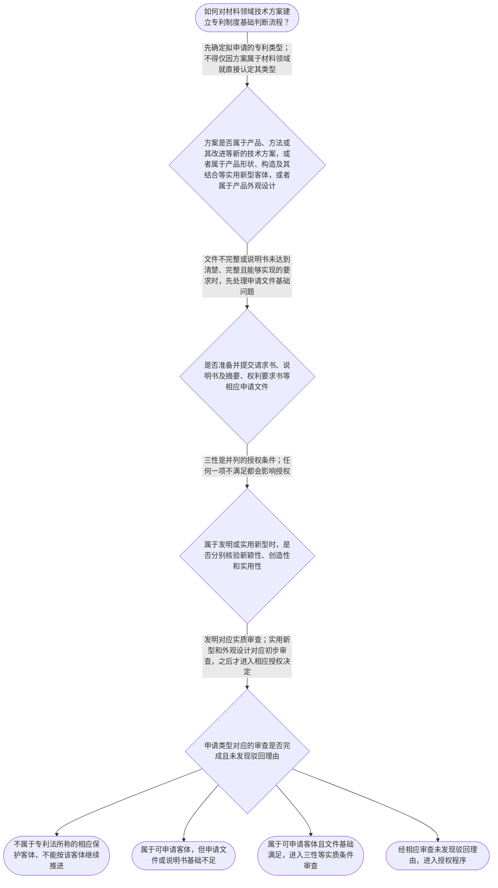

# 整合后的课程完整内容与习题

## 教学模块选择清单

- 当前教学节点：`patent-law-foundation`
- 板块预算：自适应 6/6，总计 9/9

| # | 模块 (block_type) | 类型 | 触发原因 (trigger) | 对应正文段 | 归属 |
|---:|---|:--:|---|---|:--:|
| 1 | `anchor_scenario` | 自适应 | perception=sensing(0.84) / cold_start | 材料技术方案进入专利制度的第一道判断｜某材料研发团队开发出一种用于锂电池正极的复合涂层，团队认为该技术属于发明并准备申请专利。项目… | [A] |
| 2 | `legal_anchor` | 必选 | mandatory | 专利制度基础的法条锚定｜《专利法》第二条 | [A] |
| 3 | `worked_example` | 自适应 | cold_start(low_confidence) | 材料发明从方案到授权的判断链｜某材料团队提出一种用于电池电极的涂层配方及其制备方法，准备以发明专利申请。现有材料仅说明配方… | [A] |
| 4 | `decision_flow` | 自适应 | input=visual(0.78) | 材料专利制度基础判断流程｜如何对材料领域技术方案建立专利制度基础判断流程？ | [A] |
| 5 | `mnemonic` | 自适应 | understanding=sequential(0.76) | 专利基础四问与三性对照表｜四问顺序表：先问“是什么客体”，再问“文件是否足够”，再问“是否过三性”，最后问“审查是否完… | [A] |
| 6 | `reflect_prompt` | 自适应 | processing=reflective(0.70) | 从材料研发经验反思专利制度边界｜在你熟悉的材料研发项目中，哪些信息属于技术方案本身，哪些信息只是实验记录或效果描述？把二者区… | [A] |
| 7 | `assessment` | 必选 | mandatory | 专利制度基础三类测评｜识别专利法规定的三种专利类型。 | [A] |
| 8 | `knowledge_synthesis` | 必选 | mandatory | 专利法律制度基础知识网络｜专利权基本特征：专利权具有排他性、时间性和地域性，排他性还受专利法规定的例外限制。 | [A] |
| 9 | `summary_card` | 自适应 | len(knowledge_sub_nodes)=3>=3 | 专利制度基础速查卡｜先确认保护客体和权利边界，再以申请文件为基础进入三性与相应审查路径。 | [A] |

## 教学正文

## I — 法律问题

材料领域技术方案进入专利申请与审查体系时，首先要回答四个基础问题：它属于哪一种专利保护客体；申请文件是否构成合格的法律表达；发明或实用新型是否需要接受新颖性、创造性和实用性审查；不同专利类型对应何种审查与授权路径。

## R — 适用规则

### 1. 专利保护客体

《专利法》第二条规定：“本法所称的发明创造是指发明、实用新型和外观设计。”发明是对产品、方法或者其改进所提出的新的技术方案；实用新型是对产品的形状、构造或者其结合所提出的适于实用的新的技术方案；外观设计则针对产品的整体或局部外观及其结合。〔RAG: 中华人民共和国专利法.txt — 第二条：本法所称的发明创造是指发明、实用新型和外观设计；发明是新的技术方案；实用新型针对产品的形状、构造或者其结合〕

材料领域不能当然对应某一种专利类型。材料配方、制备方法及其改进通常应先作为技术方案分析；若主张的是产品形状、构造及其结合，则需要进一步核对实用新型的客体边界；若主张的是产品外观，则进入外观设计客体分析。客体判断必须以权利要求和申请文件所表达的内容为基础。

### 2. 专利权的基本特征

检索材料指出，专利权具有排他性、时间性和地域性。排他性表现为除专利法另有规定外，未经专利权人许可不得实施其专利；同时，检索材料特别提示先用权等法定情形可能构成排他性的边界。〔RAG: 专利法律知识详细解读.txt — 专利权具有排他性、时间性和地域性；排他性是除专利法另有规定外未经许可不得实施；先用权属于例外〕

时间性意味着专利权有法定期限，期限届满后进入公有领域。现有检索文本记载，发明专利权期限为二十年，实用新型专利权期限为十年，外观设计专利权期限为十五年，均自申请日起计算。〔RAG: 中华人民共和国专利法.txt — 第四十二条：发明专利权的期限为二十年，实用新型为十年，外观设计为十五年，均自申请日起计算〕地域性意味着专利权的效力原则上依授予该权利的国家或地区确定，不能将一国授予的专利权直接视为全球权利。

### 3. 授权三性

《专利法》第二十二条规定，授予专利权的发明和实用新型应当具备新颖性、创造性和实用性。新颖性关注该发明或实用新型是否属于现有技术，以及是否存在同样的发明或实用新型在申请日前提出申请、并在申请日后公布的专利申请文件或公告的专利文件中有所记载；创造性要求发明相对于现有技术具有突出的实质性特点和显著的进步，实用新型具有实质性特点和进步；实用性要求能够制造或者使用并产生积极效果。〔RAG: 中华人民共和国专利法.txt — 第二十二条：发明和实用新型应具备新颖性、创造性和实用性；新颖性、创造性、实用性及现有技术的法定定义〕

现有技术是申请日前在国内外为公众所知的技术。〔RAG: 中华人民共和国专利法.txt — 第二十二条：现有技术是指申请日以前在国内外为公众所知的技术〕新颖性与创造性虽然都以技术比较为背景，但不能混为一谈：新颖性首先解决是否已有同样技术内容被公开或被在先申请文件记载；创造性进一步解决相对于现有技术是否显而易见。具体的单独对比、组合对比和创造性三步法属于后续子节点，本节只确立其制度位置，不提前作具体案件结论。

### 4. 申请文件和审查路径

申请发明或者实用新型专利，应提交请求书、说明书及其摘要和权利要求书等文件；说明书应作出清楚、完整的说明，以所属技术领域的技术人员能够实现为准。〔RAG: 中华人民共和国专利法.txt — 第二十六条：应提交请求书、说明书及其摘要和权利要求书等文件；说明书应清楚、完整到所属技术领域技术人员能够实现〕

发明申请经实质审查没有发现驳回理由的，作出授予发明专利权的决定；实用新型和外观设计申请经初步审查没有发现驳回理由的，作出相应授予决定。〔RAG: 中华人民共和国专利法.txt — 第三十九条：发明专利申请经实质审查没有发现驳回理由；第四十条：实用新型和外观设计专利申请经初步审查没有发现驳回理由〕因此，“能够提交申请”“通过某一程序审查”和“获得专利权”是三个不同层次，不能相互替代。

关于专利法、专利法实施细则和专利审查指南的完整层级关系，当前检索上下文仅直接提供了专利法文本，未提供实施细则和审查指南的具体原文。关于早期公开、延迟审查等制度发展历程，当前检索上下文也未提供直接依据，本节不对其具体历史过程作确定性展开。

## A — 规则适用

对材料领域方案，应按以下顺序分析：第一，识别其所要保护的是材料产品、制备方法、产品形状构造还是产品外观；第二，核对请求书、说明书、摘要和权利要求书等申请文件，并检查说明书的清楚、完整和可实施程度；第三，若属于发明或实用新型，分别核验新颖性、创造性和实用性，不能以材料性能优良或研发者主观认为先进替代法定判断；第四，依据专利类型区分发明的实质审查与实用新型、外观设计的初步审查。

在时间问题上，申请日是判断许多后续法律效果的重要基准。检索到的法条规定，国务院专利行政部门收到申请文件之日为申请日，邮寄申请以寄出的邮戳日为申请日。〔RAG: 中华人民共和国专利法.txt — 第二十八条：收到专利申请文件之日为申请日；邮寄的以寄出邮戳日为申请日〕优先权的具体期限和手续还应依据第二十九条、第三十条及后续程序材料核对，不能仅凭技术公开日期作结论。

## C — 结论

材料领域专利审查的基础不是先讨论技术是否“先进”，而是先确定保护客体和申请文件，再进入三性判断，并区分相应审查路径。新颖性是“是否已有相关技术基础”的问题，创造性是“相对于现有技术是否具有法定程度的非显而易见性”的问题；本节仅建立两者的边界，具体判断应在后续新颖性、现有技术和创造性三步法节点中展开。

> 常见误区 / 易混淆点

1. 把材料领域技术方案当然归为实用新型；实际上应先看其具体保护内容。
2. 把专利权的排他性理解为绝对排他；法定例外可能限制排他权范围。
3. 把申请日以后公开的材料、申请文件当然视为申请日前现有技术；时间顺序和法律类型必须分别核对。
4. 把新颖性和创造性当成同一个问题；前者重在同样技术内容与现有技术基础，后者重在相对于现有技术的显而易见性评价。
5. 把提交申请或通过初步审查等同于授权；不同专利类型和审查阶段的法律效果不同。

本节设有测评，请到【习题】区作答。

### 材料技术方案进入专利制度的第一道判断（anchor_scenario）

> 某材料研发团队开发出一种用于锂电池正极的复合涂层，团队认为该技术属于发明并准备申请专利。项目负责人同时需要向管理层解释：专利权并不是对技术永久、全球范围的无条件占有，而是受到保护期限、地域范围以及法定例外的限制。团队还发现，同一材料方案可能涉及发明、实用新型或外观设计的不同客体边界，因此必须先判断其法律性质，再讨论后续审查。

**锚定**：该情境锚定专利保护客体、专利权的独占性、时间性和地域性，以及三性审查所处的制度位置。

**先想一想**：面对一个新的材料技术方案，开始查新颖性和创造性之前，为什么应先确认它属于哪一种专利保护客体以及专利制度赋予权利的边界？

### 专利制度基础的法条锚定（legal_anchor）

- **《专利法》第二条**：专利法把发明创造分为发明、实用新型和外观设计；发明侧重产品、方法或其改进提出的新的技术方案，实用新型侧重产品的形状、构造或其结合，外观设计侧重产品的外观设计。
- **《专利法》第二十二条**：发明和实用新型获得专利权应具备新颖性、创造性和实用性；现有技术是申请日前在国内外为公众所知的技术。
- **《专利法》第二十六条**：申请发明或实用新型应提交请求书、说明书及摘要和权利要求书等文件，说明书须清楚、完整到所属技术领域技术人员能够实现的程度。
- **《专利法》第三十九条、第四十条、第四十二条**：发明申请经实质审查没有驳回理由后授予专利权；实用新型和外观设计申请经初步审查没有驳回理由后授予专利权；发明、实用新型和外观设计的保护期限分别为二十年、十年和十五年，均自申请日起计算。

**为何重要**：本节点是理解新颖性、创造性判断的制度基础。先明确保护客体、三性门槛、申请文件和审查类型，才能避免把不同客体、不同审查阶段或不同权利边界混为一谈。

### 材料发明从方案到授权的判断链（worked_example）

**案情/例题**：某材料团队提出一种用于电池电极的涂层配方及其制备方法，准备以发明专利申请。现有材料仅说明配方组成和制备步骤的名称，尚未核对说明书是否足以使本领域技术人员实现，也尚未进行现有技术检索。需要演示：从保护客体到授权条件，应按什么顺序审查。
**适用规则**：适用《专利法》第二条、第二十二条、第二十六条及第三十九条、第四十条。检索上下文未提供有关具体材料技术方案的完整审查案例，因此以下仅演示制度判断链，不替代针对具体申请文件的正式审查。
**分步推演**：
1. 先看方案的法律客体。配方属于产品技术方案，制备方法属于方法技术方案；二者均可能落入发明定义所称的产品、方法或者其改进提出的新的技术方案，但仅凭“材料领域”标签不能直接得出授权结论。 → *第一步：确认技术方案及其拟保护客体。*
2. 再核对申请文件是否具备法定基础。发明申请应提交请求书、说明书及摘要和权利要求书等文件，说明书还须达到所属技术领域技术人员能够实现的清楚、完整程度。 → *第二步：检查申请文件和说明书公开程度。*
3. 在实体条件上，发明和实用新型应具备新颖性、创造性和实用性；其中新颖性与现有技术相关，创造性要求相对于现有技术具有突出的实质性特点和显著的进步。具体判断还需以申请日和可核验的检索材料为基础。 → *第三步：分别核验三性，不能以技术先进的主观评价替代判断。*
4. 最后结合审查类型判断程序后果。发明申请经实质审查没有发现驳回理由，才作出授予发明专利权的决定；因此提交申请不等于已经获得专利权。 → *第四步：区分提出申请与经审查授权。*
**结论**：该材料方案首先应按其技术内容判断保护客体；若属于产品、方法或其改进提出的新的技术方案，可进入发明专利申请的后续判断。是否最终授权，还必须分别核验说明书公开充分、权利要求书依据、以及新颖性、创造性和实用性等条件。
**本题要点**：材料专利分析应遵循“先定客体、再核文件、后审三性、最后看程序后果”的线性判断链。

### 材料专利制度基础判断流程（decision_flow）

**决策问题**：如何对材料领域技术方案建立专利制度基础判断流程？



### 专利基础四问与三性对照表（mnemonic）

**记忆锚**：四问顺序表：先问“是什么客体”，再问“文件是否足够”，再问“是否过三性”，最后问“审查是否完成”。另用“三性对照”：新颖性看现有技术，创造性看相对现有技术的实质性特点和进步，实用性看能否制造或使用并产生积极效果。
**映射**：
- 是什么客体
- 文件是否足够
- 是否过三性
- 审查是否完成
- 三性对照
**何时用**：分析材料技术专利申请能否继续推进、解释审查意见或复盘授权条件时，按“四问顺序表”逐项核对。

### 从材料研发经验反思专利制度边界（reflect_prompt）

**反思问题**：在你熟悉的材料研发项目中，哪些信息属于技术方案本身，哪些信息只是实验记录或效果描述？把二者区分开，会如何影响后续专利申请文件和三性分析？

**关注要点**：保护客体是否能够由产品、方法或其改进等技术内容明确表达；说明书是否提供了足以使本领域技术人员实现的技术信息；技术效果的陈述不能自动替代新颖性、创造性和实用性判断；申请、审查和授权是不同阶段，不能把提交文件等同于获得专利权

**连接**：连接到学习者已有的材料研发经验，并回扣“技术方案—申请文件—授权条件—审查后果”的判断链。

### 专利法律制度基础知识网络（knowledge_synthesis）

**知识框架**：
- 专利权基本特征：专利权具有排他性、时间性和地域性，排他性还受专利法规定的例外限制。
- 中国专利制度体系：专利法、专利法实施细则和专利审查指南共同构成理解申请与审查规则的制度资料层次；本次检索未提供实施细则和审查指南的相关原文。
- 专利保护客体：专利法第二条规定发明、实用新型和外观设计三类客体，材料技术方案应先按其技术内容确认拟申请类型。
- 专利制度作用：通过授予一定范围和期限的权利换取技术公开，并服务于发明创造激励、技术应用和经济发展；其中具体政策性表述的直接检索依据未完整提供。
- 审查制度基础：发明申请采用实质审查路径，实用新型和外观设计申请采用初步审查路径；相关授权后果以检索到的专利法第三十九条、第四十条为依据。
**概念关系**：先区分保护客体，再判断适用的申请与审查规则。；申请文件的清楚、完整和权利要求书依据要求，是进入实质条件分析的文件基础。；发明和实用新型的三性是授权条件；其中新颖性和创造性均以现有技术等比较基础为重要判断背景，但具体判断方法属于后续子节点。；申请日既是权利期限计算的起点，也会影响后续审查中时间范围的确定；申请日和优先权的细节属于后续程序节点。
**必记**：专利制度基础判断顺序是先定保护客体，再核申请文件，随后分别审查授权条件，最后区分审查和授权后果。；我国专利法规定的三种专利类型是发明、实用新型和外观设计。；发明和实用新型获得专利权应具备新颖性、创造性和实用性；三性缺一不可。；专利权不是永久、全球且无例外的权利，必须同时注意排他性、时间性和地域性。

### 专利制度基础速查卡（summary_card）

**要点卡**：
- **专利保护客体**：发明、实用新型、外观设计是专利法规定的三类基本客体。
- **专利权边界**：专利权具有排他性、时间性和地域性，并受法定例外限制。
- **授权三性**：发明和实用新型的授权条件包括新颖性、创造性和实用性。
- **申请文件基础**：发明或实用新型申请通常应提交请求书、说明书及摘要、权利要求书等文件。
- **审查路径**：发明申请经实质审查，实用新型和外观设计申请经初步审查后作出相应授权决定。
**必背**：《专利法》第二条：发明、实用新型和外观设计三类保护客体。；《专利法》第二十二条：发明和实用新型应具备新颖性、创造性和实用性。；专利权的三个基本特征：排他性、时间性、地域性。；发明申请与实用新型、外观设计申请的审查路径不同。
**一句话总结**：先确认保护客体和权利边界，再以申请文件为基础进入三性与相应审查路径。

### 专利制度基础三类测评（assessment）

**三类覆盖**：backward_review、forward_probe、weakness_probe
**题目**：
- q-foundation-01：识别专利法规定的三种专利类型。
- q-process-01：根据邮寄和收件事实判断申请日。
- q-foundation-02：分析专利权排他性、时间性和地域性及其法定边界。


## 结构化数据

## expert

```json
"expert_a"
```

## style

```json
"conservative"
```

## knowledge_points

```json
[
  {
    "node_id": "patent-law-foundation",
    "kc_name": "专利制度的基本概念与特征：独占性、时间性、地域性"
  },
  {
    "node_id": "patent-law-foundation",
    "kc_name": "中国专利制度体系：专利法、专利法实施细则、专利审查指南"
  },
  {
    "node_id": "patent-law-foundation",
    "kc_name": "专利保护的三种客体：发明、实用新型、外观设计"
  },
  {
    "node_id": "patent-law-foundation",
    "kc_name": "专利制度的作用：激励发明创造、促进技术公开、推动技术应用和经济发展"
  },
  {
    "node_id": "patent-law-foundation",
    "kc_name": "中国专利制度发展历程与特点：早期公开延迟审查、初步审查制与实质审查制并存"
  }
]
```

## legal_basis

```json
[
  {
    "article": "《专利法》第二条",
    "source": "中华人民共和国专利法.txt"
  },
  {
    "article": "《专利法》第二十二条",
    "source": "中华人民共和国专利法.txt"
  },
  {
    "article": "《专利法》第二十六条",
    "source": "中华人民共和国专利法.txt"
  },
  {
    "article": "《专利法》第二十八条、第二十九条、第三十条",
    "source": "中华人民共和国专利法.txt"
  },
  {
    "article": "《专利法》第三十九条、第四十条、第四十二条",
    "source": "中华人民共和国专利法.txt"
  },
  {
    "article": "专利权排他性、时间性和地域性及先用权例外",
    "source": "专利法律知识详细解读.txt"
  },
  {
    "article": "专利制度发展历程中“早期公开延迟审查”的具体依据",
    "source": "检索上下文未提供直接依据"
  }
]
```

## risks

```json
[
  {
    "risk": "检索上下文未提供《专利法实施细则》和《专利审查指南》的相关原文；本稿仅确认其制度层次，不对未检索到的具体条文或审查细则作确定性表述。",
    "related_node_id": "patent-law-framework"
  },
  {
    "risk": "关于专利制度发展历程及早期公开、延迟审查的具体历史表述缺少直接检索依据，需补充权威材料后再作详细讲授。",
    "related_node_id": "patent-system-overview"
  },
  {
    "risk": "专利权排他性存在法定例外；不能将其概括为任何单位或个人在任何情况下均不得实施相关技术。",
    "related_node_id": "patent-rights-nature"
  },
  {
    "risk": "不能把提交专利申请、通过初步审查或具有技术先进性，直接等同于已经满足全部授权条件。",
    "related_node_id": "patent-law-foundation"
  }
]
```

## draft_stage

```json
"debate"
```

## irac

```json
{
  "issue": "材料领域技术方案进入中国专利制度时，如何确认其保护客体、基本申请文件、授权条件及相应审查路径？",
  "rule": "《专利法》第二条规定发明创造包括发明、实用新型和外观设计；第二十二条规定发明和实用新型应具备新颖性、创造性和实用性，并规定现有技术为申请日前在国内外为公众所知的技术；第二十六条规定发明或者实用新型申请应提交请求书、说明书及摘要和权利要求书等文件，说明书应清楚、完整到所属技术领域技术人员能够实现；第三十九条规定发明申请经实质审查没有发现驳回理由的作出授予决定，第四十条规定实用新型和外观设计申请经初步审查没有发现驳回理由的作出相应授予决定。",
  "application": "对材料领域方案，不能仅凭“材料”这一技术领域标签确定专利类型，应结合方案的产品、方法、形状构造或外观内容判断。确定客体后，再核对请求书、说明书、摘要和权利要求书等文件，以及说明书是否达到所属技术领域技术人员能够实现的清楚、完整程度。对于发明和实用新型，还需分别核验新颖性、创造性和实用性；检索上下文未提供足以对某一具体材料方案作出新颖性或创造性结论的完整对比文件，因此本稿不作具体授权判断。",
  "conclusion": "专利法律制度基础要求按“保护客体—申请文件—授权三性—审查路径”建立判断链。发明、实用新型和外观设计的客体及审查路径不同；发明和实用新型的三性是授权门槛，提交申请本身不等于获得专利权。"
}
```

## interactive_questions

```json
[
  {
    "qid": "q-foundation-01",
    "category": "remember",
    "difficulty": "L1",
    "source_tag": "backward_review",
    "kc_node_id": "patent-law-foundation",
    "question": "根据《专利法》第二条，下列哪组属于我国专利法规定的三种专利类型？",
    "answer": "A",
    "options": [
      "A. 发明、实用新型、外观设计",
      "B. 发明、商标、著作权",
      "C. 实用新型、商业秘密、外观设计",
      "D. 发明、集成电路布图设计、植物新品种"
    ]
  },
  {
    "qid": "q-process-01",
    "category": "apply",
    "difficulty": "L1",
    "source_tag": "forward_probe",
    "kc_node_id": "patent-application-process",
    "question": "甲公司于6月10日通过邮寄方式提交专利申请，邮戳日为6月8日，国务院专利行政部门于6月12日收到文件。依《专利法》第二十八条，申请日原则上是哪一天？",
    "answer": "B",
    "options": [
      "A. 6月12日，因为该日是国务院专利行政部门收到文件之日",
      "B. 6月8日，因为邮寄申请以寄出的邮戳日为申请日",
      "C. 6月10日，因为该日是申请人实际寄出文件的日期",
      "D. 6月1日，因为申请日统一按当月第一日计算"
    ]
  },
  {
    "qid": "q-foundation-02",
    "category": "analyze",
    "difficulty": "L3",
    "source_tag": "weakness_probe",
    "kc_node_id": "patent-law-foundation",
    "question": "关于专利权特征，下列说法最准确的是：",
    "answer": "C",
    "options": [
      "A. 专利权一经授予即永久有效且在所有国家自动有效",
      "B. 专利权的排他性意味着任何单位或个人在任何情况下都不得实施相关技术",
      "C. 专利权具有排他性、时间性和地域性，且排他性受专利法规定的例外限制",
      "D. 专利权只具有时间性，不具有地域性和排他性"
    ]
  }
]
```

## knowledge_synthesis

```json
{
  "node": "patent-law-foundation",
  "coverage": [
    {
      "node_id": "patent-rights-nature"
    },
    {
      "node_id": "patent-law-framework"
    },
    {
      "node_id": "patent-law-foundation"
    },
    {
      "node_id": "patent-system-overview"
    }
  ],
  "confusable_pairs": [
    {
      "pair": "申请日以前已经公开的技术与申请日以后才公开的申请文件，时间顺序不同，不能仅凭“后来公开”判断其当然属于申请日前现有技术。"
    },
    {
      "pair": "发明申请的实质审查与实用新型、外观设计申请的初步审查属于不同审查路径，不能混同。"
    },
    {
      "pair": "专利权的排他性不等于绝对禁止一切实施行为，还需注意专利法规定的例外。"
    }
  ]
}
```
