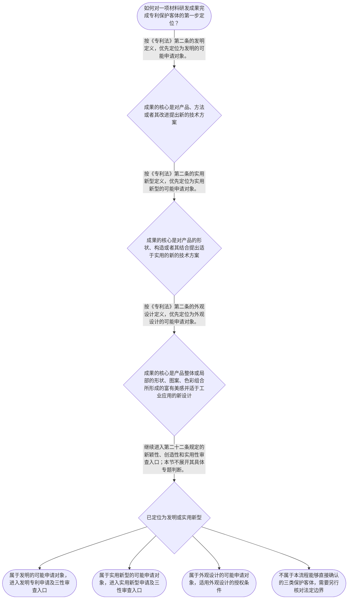

# 整合后的课程完整内容与习题

## 教学模块选择清单

- 当前教学节点：`patent-law-foundation`
- 板块预算：自适应 6/6，总计 9/9

| # | 模块 (block_type) | 类型 | 触发原因 (trigger) | 对应正文段 | 归属 |
|---:|---|:--:|---|---|:--:|
| 1 | `anchor_scenario` | 自适应 | perception=sensing(0.84) / cold_start | 材料研发成果进入专利制度的起点｜某材料研发团队开发了锂电池正极材料的低温烧结工艺：通过调整烧结温度和保温阶段，期望降低能耗并… | [A] |
| 2 | `legal_anchor` | 必选 | mandatory | 保护客体与授权条件的法条锚点｜《专利法》第二条 | [A] |
| 3 | `worked_example` | 自适应 | cold_start(low_confidence) | 低温烧结工艺的基础定位｜某团队提出一种正极材料低温烧结工艺：在既有烧结流程中增加分段保温控制，以降低能耗并维持材料容… | [A] |
| 4 | `decision_flow` | 自适应 | input=visual(0.79) | 材料成果的专利客体定位流程｜如何对一项材料研发成果完成专利保护客体的第一步定位？ | [A] |
| 5 | `mnemonic` | 自适应 | understanding=sequential(0.77) | 专利制度基础五栏表｜基础定位五栏表：权—法—客—用—程，即“权利特征、规范体系、三类客体、制度作用、程序特点”。 | [A] |
| 6 | `reflect_prompt` | 自适应 | processing=reflective(0.70) | 从材料研发经验回看制度定位｜复盘一项自己熟悉的材料研发成果时，哪些技术信息决定其更接近发明、实用新型或外观设计；客体定位… | [A] |
| 7 | `assessment` | 必选 | mandatory | 基础定位与申请文件测评｜复习三类法定专利保护客体。 | [A] |
| 8 | `knowledge_synthesis` | 必选 | mandatory | 专利法律制度基础框架｜专利权基本特征：独占性、时间性、地域性共同说明专利权是在法定范围、法定期限和法定地域内发生效… | [A] |
| 9 | `summary_card` | 自适应 | len(knowledge_sub_nodes)=3>=3 | 专利制度基础速查卡｜材料专利学习先做客体定位，再以法条为锚进入发明和实用新型的三性审查框架。 | [A] |

## 教学正文

## I — 法律问题

材料研发成果进入中国专利制度时，首先要解决两个基础层次的问题：其一，工艺、材料产品或产品视觉设计分别是否落入法定专利保护客体；其二，若属于发明或实用新型，后续实体授权审查在制度上以哪些条件为入口。本节只处理“专利法律制度基础”这一节点，不提前替代后续关于新颖性、创造性、抵触申请和创造性三步法的专题审查。

## R — 适用规则

《专利法》第二条规定，发明创造是指发明、实用新型和外观设计；发明是对产品、方法或者其改进提出的新的技术方案，实用新型是对产品形状、构造或者其结合提出的适于实用的新的技术方案，外观设计则是对产品整体或局部的形状、图案及相应色彩结合所作出的富有美感并适于工业应用的新设计。〔RAG: 中华人民共和国专利法.txt — 第二条：发明创造是指发明、实用新型和外观设计，并分别定义三类客体〕

对发明和实用新型，《专利法》第二十二条规定授权应具备新颖性、创造性和实用性；其中，现有技术是申请日以前在国内外为公众所知的技术。〔RAG: 中华人民共和国专利法.txt — 第二十二条：授予专利权的发明和实用新型，应当具备新颖性、创造性和实用性；现有技术是申请日以前在国内外为公众所知的技术〕

制度规范的学习框架以专利法为核心，并与专利法实施细则、专利审查指南相衔接。就申请程序的起点而言，实施细则第四十三条规定，行政部门收到法定申请文件后，应明确申请日、给予申请号并通知申请人。〔RAG: 中华人民共和国专利法实施细则.txt — 第四十三条：收到法定申请文件后，应当明确申请日、给予申请号，并通知申请人〕检索上下文未提供专利审查指南的直接原文，因此本节不对指南具体条款作展开。

专利权还具有独占性、时间性和地域性：应把它们理解为专利权在法定范围、期限和地域内发生效力的制度特征，而非任一技术方案天然享有的权利。专利制度通过以公开换取法定保护，发挥激励发明创造、促进技术公开、推动技术应用和经济发展的作用。本节同时建立程序地图：早期公开、延迟审查以及初步审查制与实质审查制并存，是理解制度运行的基础认识；其具体程序规则留待后续节点处理。

## A — 规则适用

以材料领域的低温烧结工艺为例：如果研发贡献在于改变烧结步骤、温度区间或保温控制，以解决材料制备中的技术问题，其核心是对方法或方法改进提出技术方案，应先按“发明”的法定定义定位。若贡献集中于电极片、模具或设备部件的形状、构造或其结合，则应审视其是否更接近实用新型。若贡献只是电池包装或产品局部的视觉形状、图案、色彩组合，则应按外观设计的定义审视。

完成客体定位后，不能直接得出授权结论。对被定位为发明或实用新型的材料技术方案，下一层才是第二十二条的三性：新颖性关心该方案是否不属于现有技术；创造性关心其相对于现有技术是否达到法定进步程度；实用性关心其是否能够制造或使用并产生积极效果。〔RAG: 中华人民共和国专利法.txt — 第二十二条：新颖性、创造性、实用性的定义及现有技术的含义〕

因此，学习顺序应保持清晰：先识别专利权和制度的基本特征，再判断成果属于三类保护客体中的哪一类；对于发明和实用新型，继而进入三性授权条件；申请文件、申请日及程序推进则属于与实体审查衔接的下一层程序问题。《专利法》第二十六条所列请求书、说明书及其摘要、权利要求书等文件，是发明或实用新型申请程序的基础文件要求。〔RAG: 中华人民共和国专利法.txt — 第二十六条：申请发明或者实用新型专利应当提交请求书、说明书及其摘要和权利要求书等文件〕

## C — 结论

本节点的稳定结论是：发明、实用新型、外观设计构成法定保护客体；材料研发成果必须先进行客体定位。发明和实用新型在客体定位后，还须通过新颖性、创造性和实用性这一实体授权条件入口。新颖性与创造性的具体判断规则是后续专题的学习重点，本节不以基础框架替代具体审查结论。

> 常见误区 / 易混淆点
>
> 1. “技术方案属于发明”不等于“必然授权”。客体定位与三性审查是前后衔接、但彼此独立的步骤。
> 2. 不能把实用新型理解为一切材料技术改进。实用新型的法定定义限于产品形状、构造或者其结合；方法改进通常应先从发明定义分析。〔RAG: 中华人民共和国专利法.txt — 第二条：实用新型是对产品的形状、构造或者其结合所提出的适于实用的新的技术方案〕
> 3. 本节提到新颖性、创造性仅为确立其法定位置；现有技术单独对比、抵触申请的作用以及创造性三步法，不应在没有后续规则学习的情况下混同或预断。

本节设有测评，请到【习题】区作答。

### 材料研发成果进入专利制度的起点（anchor_scenario）

> 某材料研发团队开发了锂电池正极材料的低温烧结工艺：通过调整烧结温度和保温阶段，期望降低能耗并保持容量。他们同时形成了工艺参数、粉体产品样品和包装标签设计，准备分别申请保护。团队最先遇到的不是“技术是否先进”，而是这些成果各自能否进入专利制度、应落入哪一种保护客体。

专利代理人在梳理资料时还提示：即使技术方案属于可申请的客体，后续仍要经过授权条件审查；其中发明和实用新型的三性是理解材料领域新颖性、创造性判断的制度入口。本节先建立这张制度地图，不提前替代后续的新颖性和创造性专题判断。

**锚定**：该情境锚定专利保护客体、授权条件入口与材料技术成果分类之间的基础关系。

**先想一想**：面对“工艺、材料产品、包装外观”三类成果时，首先应按什么标准区分其可能对应的专利保护客体？

### 保护客体与授权条件的法条锚点（legal_anchor）

- **《专利法》第二条**：专利法保护的发明创造包括发明、实用新型和外观设计；三类客体的技术或设计边界由该条分别界定。
- **《专利法》第二十二条**：发明和实用新型要获得专利权，应当具备新颖性、创造性和实用性；现有技术的时间界限是申请日以前为公众所知的技术。
- **《专利法实施细则》第四十三条**：行政部门在收到法定申请文件后，应明确申请日、给予申请号并通知申请人，显示申请程序与实体授权审查相衔接。

**为何重要**：第二条先回答材料成果属于何种受保护客体，第二十二条再设定发明和实用新型的实体授权门槛。后续学习新颖性、创造性时，必须始终回到这两个法条定位。

### 低温烧结工艺的基础定位（worked_example）

**案情/例题**：某团队提出一种正极材料低温烧结工艺：在既有烧结流程中增加分段保温控制，以降低能耗并维持材料容量。团队拟就该工艺提出专利申请。需要先判断该成果在专利制度中的客体定位，以及客体定位后还要经过哪些基础授权门槛。
**适用规则**：《专利法》第二条：发明是对产品、方法或者其改进所提出的新的技术方案；《专利法》第二十二条：发明和实用新型授权应具备新颖性、创造性和实用性。
**分步推演**：
1. 先识别方案解决的是材料制备过程中的技术问题，方案内容是烧结方法及其改进，而非仅对产品外观进行装饰。 → *事实属于技术方案识别层面。*
2. 《专利法》第二条将对产品、方法或者其改进所提出的新的技术方案界定为发明；该方案直接指向方法改进。 → *客体上可定位为发明申请对象。*
3. 客体定位不等于当然授权。第二十二条要求授予专利权的发明和实用新型具备新颖性、创造性和实用性。 → *进入三性实体审查入口。*
4. 本节点只建立三性的制度位置；现有技术单独对比、抵触申请以及创造性三步法属于后续专题的具体判断内容。 → *先分清制度入口与后续判断方法。*
**结论**：该低温烧结工艺改进在客体层面可定位为针对方法改进提出的技术方案，具有作为发明专利申请对象进行后续审查的基础；是否最终授权，还须另行审查第二十二条所列新颖性、创造性和实用性。
**本题要点**：材料技术方案应先完成“保护客体定位”，再进入“三性”实体授权审查，不能将两步混为一谈。

### 材料成果的专利客体定位流程（decision_flow）

**决策问题**：如何对一项材料研发成果完成专利保护客体的第一步定位？



### 专利制度基础五栏表（mnemonic）

**记忆锚**：基础定位五栏表：权—法—客—用—程，即“权利特征、规范体系、三类客体、制度作用、程序特点”。
**映射**：
- 权
- 法
- 客
- 用
- 程
**何时用**：看到材料研发成果、专利申请或授权条件时，先按五栏表确定其制度位置，再进入具体条文与后续专题判断。

### 从材料研发经验回看制度定位（reflect_prompt）

**反思问题**：复盘一项自己熟悉的材料研发成果时，哪些技术信息决定其更接近发明、实用新型或外观设计；客体定位之后，三性在制度上处于什么位置？

**关注要点**：区分技术方案的产品或方法内容与产品的视觉设计内容。；将独占性、时间性、地域性理解为专利权的制度特征，而非任意技术方案自动获得的属性。；将新颖性、创造性、实用性定位为发明和实用新型的实体授权条件入口。；认识到本节未对抵触申请、现有技术组合或创造性三步法作出具体结论，这些内容应在后续节点学习。

**连接**：连接学习者已有的材料研发经验：将工艺参数、产品结构和外观方案分别视为不同类型的研发输出，再以专利制度的客体分类和授权入口重新整理。

### 专利法律制度基础框架（knowledge_synthesis）

**知识框架**：
- 专利权基本特征：独占性、时间性、地域性共同说明专利权是在法定范围、法定期限和法定地域内发生效力的权利；本节不延伸其具体期限与地域规则。
- 中国专利制度规范体系：学习中以专利法、专利法实施细则和专利审查指南构成由基本规则到程序与审查操作的规范框架；检索上下文未提供专利审查指南的直接原文。
- 三类保护客体：《专利法》第二条规定发明创造包括发明、实用新型和外观设计，并分别以技术方案、产品形状构造和产品视觉设计界定其边界。
- 专利制度作用：制度通过激励发明创造、促进技术公开、推动技术应用和经济发展形成创新激励与信息公开的衔接机制。
- 制度程序特点：本节仅建立早期公开、延迟审查以及初步审查制与实质审查制并存的概念地图；具体程序条件由后续申请程序和审查节点处理。
- 三性入口：发明和实用新型在客体定位之后，应进入《专利法》第二十二条的新颖性、创造性和实用性审查框架。
**概念关系**：先区分专利制度中的权利特征与保护客体，再对具体成果完成客体定位。；发明或实用新型完成客体定位后，才进入第二十二条的三性实体授权条件；外观设计适用第二十三条规定的相应条件。；申请文件受理、申请日和后续审查属于申请程序节点；本节只建立其与实体授权审查的衔接认识。；新颖性和创造性的具体判断方法，包括现有技术、抵触申请与三步法，属于后续专题节点，不在本节下结论。
**必记**：《专利法》第二条的三类保护客体是发明、实用新型和外观设计。；发明和实用新型的授权条件包括新颖性、创造性和实用性。；客体定位、申请程序与实体授权条件是三个相互衔接但不可混同的层次。

### 专利制度基础速查卡（summary_card）

**要点卡**：
- **专利权特征**：独占性、时间性、地域性说明专利权并非无限制、无限期、全球当然有效。
- **规范体系**：专利法确立基本规则，实施细则与审查指南分别承接程序和审查操作层面的学习。
- **保护客体**：发明、实用新型、外观设计是《专利法》第二条规定的三类发明创造。
- **制度作用**：专利制度以权利激励为条件，促进技术公开、应用与经济发展。
- **审查结构**：先有申请受理与程序推进，再有相应实体授权审查；发明和实用新型的三性是实体审查入口。
**必背**：《专利法》第二条：发明创造包括发明、实用新型和外观设计。；《专利法》第二十二条：发明和实用新型应具备新颖性、创造性和实用性。；现有技术是申请日以前在国内外为公众所知的技术。
**一句话总结**：材料专利学习先做客体定位，再以法条为锚进入发明和实用新型的三性审查框架。

### 基础定位与申请文件测评（assessment）

**三类覆盖**：backward_review、forward_probe、weakness_probe
**题目**：
- q1：复习三类法定专利保护客体。
- q2：探测下一节点中的发明或实用新型申请文件基础。
- q3：辨析材料方法方案的客体定位与三性审查入口。


## 结构化数据

## expert

```json
"expert_a"
```

## style

```json
"conservative"
```

## knowledge_points

```json
[
  {
    "node_id": "patent-law-foundation",
    "kc_name": "专利制度的基本概念与特征：独占性、时间性、地域性"
  },
  {
    "node_id": "patent-law-foundation",
    "kc_name": "中国专利制度体系：专利法、专利法实施细则、专利审查指南"
  },
  {
    "node_id": "patent-law-foundation",
    "kc_name": "专利保护的三种客体：发明、实用新型、外观设计"
  },
  {
    "node_id": "patent-law-foundation",
    "kc_name": "专利制度的作用：激励发明创造、促进技术公开、推动技术应用和经济发展"
  },
  {
    "node_id": "patent-law-foundation",
    "kc_name": "中国专利制度发展历程与特点：早期公开延迟审查、初步审查制与实质审查制并存"
  }
]
```

## legal_basis

```json
[
  {
    "article": "《专利法》第二条：发明创造包括发明、实用新型和外观设计，并分别界定三类客体。",
    "source": "中华人民共和国专利法.txt"
  },
  {
    "article": "《专利法》第二十二条：发明和实用新型应具备新颖性、创造性和实用性，并规定现有技术的含义。",
    "source": "中华人民共和国专利法.txt"
  },
  {
    "article": "《专利法实施细则》第四十三条：收到法定申请文件后明确申请日、给予申请号并通知申请人。",
    "source": "中华人民共和国专利法实施细则.txt"
  },
  {
    "article": "《专利法》第二十六条：申请发明或者实用新型专利应提交请求书、说明书及其摘要和权利要求书等文件。",
    "source": "中华人民共和国专利法.txt"
  }
]
```

## risks

```json
[
  {
    "risk": "将“属于发明、实用新型或外观设计的保护客体”误认为“当然能够获得授权”，忽略后续实体授权条件。",
    "related_node_id": "patent-law-foundation"
  },
  {
    "risk": "将发明的“产品、方法或者其改进”与实用新型限于产品形状、构造或者其结合的法定边界混同。",
    "related_node_id": "patent-law-foundation"
  },
  {
    "risk": "将本节点的三性制度入口误当作已完成新颖性、创造性具体判断；抵触申请、现有技术单独对比和创造性三步法须在后续节点依其依据学习。",
    "related_node_id": "patent-law-foundation"
  },
  {
    "risk": "检索上下文未提供专利审查指南的直接原文，不能在本节对其具体条款或审查细节作无依据断言。",
    "related_node_id": "patent-law-framework"
  }
]
```

## draft_stage

```json
"debate"
```

## irac

```json
{
  "issue": "材料研发中的工艺、产品和外观成果如何在中国专利制度中完成基础定位，并与后续新颖性、创造性审查建立正确的层次关系？",
  "rule": "《专利法》第二条规定，发明创造包括发明、实用新型和外观设计，并分别界定其内涵。《专利法》第二十二条规定，授予专利权的发明和实用新型应当具备新颖性、创造性和实用性；现有技术是申请日以前在国内外为公众所知的技术。",
  "application": "对材料领域研发成果，应先依据技术事实判断其是否为产品、方法或其改进所提出的技术方案，或是否属于产品形状、构造，抑或产品整体、局部视觉设计。定位为发明或实用新型后，才进入第二十二条规定的三性审查入口；本节不将后续新颖性、创造性专题中的现有技术单独对比、抵触申请或三步法混入客体定位。",
  "conclusion": "材料专利审查学习的首要基础是区分三类保护客体、理解专利权制度特征和规范体系，并确认发明、实用新型须通过三性实体授权条件。新颖性和创造性的具体判断将在后续节点展开。"
}
```

## interactive_questions

```json
[
  {
    "qid": "q1",
    "category": "remember",
    "difficulty": "L1",
    "source_tag": "backward_review",
    "kc_node_id": "patent-law-foundation",
    "question": "根据《专利法》第二条，下列哪一组属于我国专利法所称的发明创造？",
    "answer": "B",
    "options": [
      "A. 发明、商标、著作权",
      "B. 发明、实用新型、外观设计",
      "C. 发明、植物新品种、集成电路布图设计",
      "D. 实用新型、商业秘密、外观设计"
    ]
  },
  {
    "qid": "q2",
    "category": "understand",
    "difficulty": "L1",
    "source_tag": "forward_probe",
    "kc_node_id": "patent-application-process",
    "question": "关于发明或者实用新型专利申请文件，下列说法正确的是？",
    "answer": "A",
    "options": [
      "A. 请求书、说明书及其摘要、权利要求书等文件",
      "B. 仅提交产品样品和销售合同",
      "C. 仅提交权利要求书和检索报告",
      "D. 仅提交请求书和产品照片"
    ]
  },
  {
    "qid": "q3",
    "category": "analyze",
    "difficulty": "L3",
    "source_tag": "weakness_probe",
    "kc_node_id": "patent-law-foundation",
    "question": "某团队提出一种锂电池电极涂布方法的改进方案。关于该方案的基础审查定位，下列说法最准确的是？",
    "answer": "C",
    "options": [
      "A. 只要方案涉及材料，即当然属于实用新型并当然获得专利权",
      "B. 只要方案写入说明书，即无需判断保护客体和实体授权条件",
      "C. 该方法改进可先按发明的技术方案进行客体定位，之后仍须进入新颖性、创造性和实用性审查",
      "D. 只要材料容量提高，即可直接认定其必然具有创造性"
    ]
  }
]
```

## knowledge_synthesis

```json
{
  "node": "patent-law-foundation",
  "coverage": [
    {
      "node_id": "patent-law-foundation"
    },
    {
      "node_id": "patent-law-foundation"
    },
    {
      "node_id": "patent-law-foundation"
    },
    {
      "node_id": "patent-law-foundation"
    },
    {
      "node_id": "patent-law-foundation"
    }
  ],
  "confusable_pairs": [
    {
      "pair": "保护客体定位与授权条件：前者回答技术成果属于何种法定客体，后者回答该客体是否满足授权门槛，二者不能相互替代。"
    },
    {
      "pair": "发明与实用新型：发明包括对产品、方法或者其改进提出的新的技术方案；实用新型限于对产品形状、构造或者其结合提出的适于实用的新的技术方案。"
    },
    {
      "pair": "本节点的三性入口与后续新颖性、创造性专题判断：本节点只确立法律位置，不提前适用现有技术、抵触申请或三步法。"
    }
  ]
}
```
