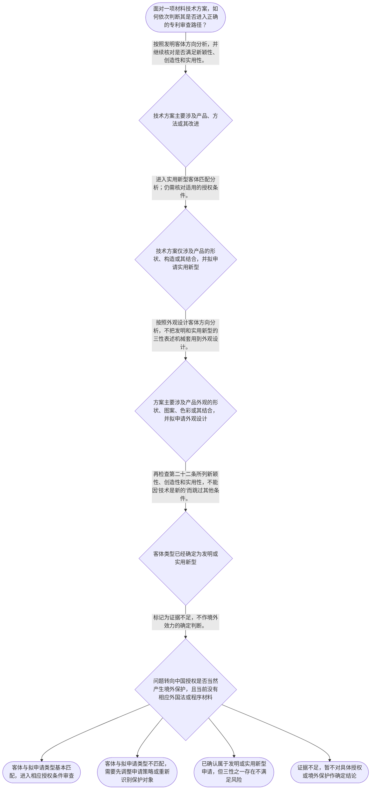

# 整合后的课程完整内容与习题

## 教学模块选择清单

- 当前教学节点：`patent-law-foundation`
- 板块预算：自适应 None/None，总计 None/None

| # | 模块 (block_type) | 类型 | 触发原因 (trigger) | 对应正文段 | 归属 |
|---:|---|:--:|---|---|:--:|
| 1 | `anchor_scenario` | 自适应 | perception=sensing(0.84) / cold_start | 材料研发项目中的专利基础判断｜某材料研发团队开发出一种耐高温复合涂层，并准备向中国国家知识产权局申请专利。团队成员提出了不… | [A] |
| 2 | `legal_anchor` | 必选 | mandatory | 基础法条锚定｜《专利法》第二条 | [A] |
| 3 | `worked_example` | 自适应 | cold_start(low_confidence) | 耐高温复合涂层的基础审查链｜甲公司研发一种用于钢材表面的耐高温复合涂层，方案核心是涂层材料的组成及其制备方法。甲公司拟申… | [A] |
| 4 | `decision_flow` | 自适应 | input=visual(0.79) | 材料技术方案的专利基础判断流程｜面对一项材料技术方案，如何依次判断其是否进入正确的专利审查路径？ | [A] |
| 5 | `mnemonic` | 自适应 | understanding=sequential(0.77) | 专利基础三层速记表｜专利基础三层表：第一层‘客体三分’——发明/实用新型/外观设计；第二层‘权利三特征’——独占… | [A] |
| 6 | `reflect_prompt` | 自适应 | processing=reflective(0.70) | 从研发成果回看专利基础判断｜回看你熟悉的一项材料研发成果：如果它同时包含材料组成、制备工艺和产品外观三个层面，你会依据哪… | [A] |
| 7 | `assessment` | 必选 | mandatory | 专利法律制度基础测评｜识别专利法规定的三类保护客体 | [A] |
| 8 | `knowledge_synthesis` | 必选 | mandatory | 专利法律制度基础知识网络｜专利制度基本概念与特征：专利制度通过授予特定权利并设置边界，形成独占性、时间性和地域性三个需… | [A] |
| 9 | `summary_card` | 自适应 | len(knowledge_sub_nodes)=3>=3 | 专利法律制度基础速查卡｜专利基础判断的核心是先识别客体和权利边界，再依据法条核对授权门槛。 | [A] |

## 教学正文

## I — 法律问题

材料领域的一项研发成果进入专利申请分析时，首先要解决的不是直接判断新颖性或创造性，而是确认：它属于哪一种专利保护客体，适用哪些制度规则，以及发明或实用新型是否需要经过哪些授权门槛。

## R — 适用规则

### 1. 保护客体

《专利法》第二条将发明创造分为发明、实用新型和外观设计。发明针对产品、方法或者其改进提出新的技术方案；实用新型针对产品的形状、构造或者其结合提出适于实用的新的技术方案；外观设计针对产品的形状、图案、色彩及其结合提出富有美感并适于工业应用的新设计。〔RAG: 中华人民共和国专利法.txt — 第二条：发明创造是指发明、实用新型和外观设计；发明针对产品、方法或者其改进，实用新型针对产品的形状、构造或者其结合，外观设计针对产品外观要素〕

因此，材料领域并不等于单一的专利类型。材料组成或制备方法通常应先从技术方案的内容出发识别；产品结构与产品外观也要分别分析，不能仅凭“材料”这一技术领域名称决定保护客体。

### 2. 授权实质条件

《专利法》第二十二条规定，授予发明和实用新型专利权，应当具备新颖性、创造性和实用性。该条还规定，新颖性是发明或者实用新型不属于现有技术，且不存在法条所述同样申请情形；创造性要求发明相对于现有技术具有突出的实质性特点和显著的进步，实用新型具有实质性特点和进步；实用性要求能够制造或者使用，并且能够产生积极效果。〔RAG: 中华人民共和国专利法.txt — 第二十二条：发明和实用新型应当具备新颖性、创造性和实用性；现有技术是申请日以前在国内外为公众所知的技术〕

这里必须区分三个层次：新颖性主要处理现有技术和同样申请的排除问题；创造性处理相对于现有技术是否具有法定程度的非显而易见贡献；实用性处理能否制造或使用并产生积极效果。本节只建立三性的法条入口，具体的新颖性单一文献判断、创造性判断步骤及材料领域案例，应在对应后续节点中展开。

### 3. 制度体系与主管机关

中国专利制度的基础规范包括专利法、专利法实施细则以及审查实践中使用的专利审查指南。本轮检索上下文直接提供了专利法和实施细则片段，但未提供《专利审查指南》的具体原文，因此不能在本节补写指南中的具体条款或审查细节。

《专利法》第三条规定，国务院专利行政部门负责管理全国的专利工作，统一受理和审查专利申请，并依法授予专利权。〔RAG: 中华人民共和国专利法.txt — 第三条：国务院专利行政部门负责管理全国的专利工作；统一受理和审查专利申请，依法授予专利权〕

制度作用方面，本节将其作为框架性理解：专利制度通过授予权利与公开技术的制度安排，服务于激励发明创造、促进技术公开、推动技术应用和经济发展。上述作用表述未在本轮检索上下文中提供直接原文依据，属于一般制度框架说明，不据此推导具体法律后果。

### 4. 证据边界

本轮检索上下文未提供足以核验专利权具体保护期限、完整制度发展历程或境外效力的直接材料。因此，对于“专利权究竟保护多久”“中国授权是否自动在其他国家有效”等问题，本节不作具体确定性结论；这些问题需要结合适用法律和进一步检索材料判断。

## A — 规则适用

对一项材料配方、材料制备工艺或涂层结构进行分析时，应按以下顺序推进：

1. 先提取技术事实，确认其是产品、方法或其改进，还是产品的形状、构造或外观设计要素。
2. 再确定可能对应的专利类型。不能因为技术方案被称为“新材料”，就跳过客体识别。
3. 如果进入发明或实用新型方向，再依第二十二条逐项核对新颖性、创造性和实用性。研发人员主观上首次提出某配方，不等于已经满足全部授权条件。
4. 对现有技术的时间问题，先记住第二十二条给出的基本入口：申请日以前在国内外为公众所知的技术属于现有技术。具体日期计算、宽限期、抵触申请和审查指南中的判断方法，应留待相应后续节点并以检索依据为准。
5. 将权利边界问题与授权条件问题分开。独占性、时间性、地域性属于理解专利权边界的基本维度，但不能代替对三性进行审查。

本节知识点还包括中国专利制度发展与审查结构。上下文提示早期公开、延迟审查以及初步审查制与实质审查制并存，但没有提供足以核验具体历史阶段和沿革的原文，所以这里只保留结构提示，不作具体历史断言。

## C — 结论

学习材料领域专利审查规则时，正确的基础入口是“先识别保护客体和专利类型，再核对法定授权条件”。对发明和实用新型，第二十二条的三性是必须同时面对的授权门槛；新颖性和创造性不能在尚未完成客体识别和法条定位时被孤立判断。对于本轮材料没有直接依据支持的具体期限、历史沿革和境外效力，应明确标记证据不足并继续检索。

> 常见误区 / 易混淆点
>
> - “技术方案是新的”不等于当然具备新颖性、创造性和实用性。
> - 新颖性、创造性和实用性是不同的授权条件，不能用其中一个概念替代另一个。
> - 材料领域不是一种独立的专利类型；材料组成、制备方法、产品结构和外观要素必须分别识别。
> - 专利法、实施细则和审查指南的规范层次不同；没有检索到具体原文时，不应自行补写条款或审查结论。

本节设有测评，请到【习题】区作答。

### 材料研发项目中的专利基础判断（anchor_scenario）

> 某材料研发团队开发出一种耐高温复合涂层，并准备向中国国家知识产权局申请专利。团队成员提出了不同意见：有人认为只要技术方案新就可以申请，有人认为还要区分发明、实用新型和外观设计；项目负责人还想知道，专利授权后保护范围是否会自动延伸到所有国家，以及专利权是否永久有效。此时，代理人需要先厘清保护客体、专利制度的基本特征和授权实质条件，而不能直接跳到新颖性或创造性判断。

**锚定**：用材料研发申请场景锚定专利保护客体、专利权基本特征、制度作用与三性授权门槛。

**先想一想**：在阅读具体法条前，面对这项材料技术方案，你认为应先确认保护的客体、权利的地域和时间范围，还是先判断新颖性与创造性？请先排出你的判断顺序。

### 基础法条锚定（legal_anchor）

- **《专利法》第二条**：法律上的发明创造包括发明、实用新型和外观设计；发明可以针对产品、方法或者其改进，实用新型针对产品的形状、构造或者其结合，外观设计针对产品的形状、图案、色彩及其结合。
- **《专利法》第二十二条**：发明和实用新型获得专利权须具备新颖性、创造性和实用性；现有技术是申请日前在国内外为公众所知的技术。
- **《专利法》第三条**：国务院专利行政部门负责管理全国专利工作，统一受理和审查专利申请并依法授予专利权。

**为何重要**：本节点是后续学习申请程序、新颖性和创造性判断的基础。先确定保护客体及主管机关，再理解三性这一授权门槛，才能避免把不同专利类型或不同审查问题混为一谈。

### 耐高温复合涂层的基础审查链（worked_example）

**案情/例题**：甲公司研发一种用于钢材表面的耐高温复合涂层，方案核心是涂层材料的组成及其制备方法。甲公司拟申请专利，并询问：第一，该方案应先从什么保护客体角度分析；第二，是否只要属于新的材料配方就当然能够获得专利权；第三，获得中国专利权后是否当然在其他国家受到保护？
**适用规则**：《专利法》第二条确定三类发明创造及其保护对象；《专利法》第二十二条规定发明和实用新型的三性要求以及现有技术的时间界限。依据本轮检索上下文，关于专利权地域性、时间性和独占性的具体条文依据未被直接提供。
**分步推演**：
1. 先识别技术方案的内容：案情同时包含材料组成和制备方法。根据第二条，发明是对产品、方法或者其改进提出的新的技术方案；实用新型限于产品的形状、构造或者其结合；外观设计针对产品的外观设计要素。因此，材料组成和制备方法不能仅因属于材料领域就直接归入外观设计或实用新型。 → *第一步：先按技术内容识别拟申请的专利客体和类型。*
2. 再检查授权门槛。第二十二条要求发明和实用新型具备新颖性、创造性和实用性；新颖性并非只看研发者主观上是否首次提出，还要判断是否属于现有技术以及是否存在法条规定的同样申请文件情形。 → *第二步：类型匹配后，再进入三性审查，而非把‘新的配方’等同于必然授权。*
3. 最后区分国内授权与其他国家或地区的保护问题。专利权的具体效力不能仅由中国授权事实推定到境外；境外保护需要依据相应国家或地区的法律和申请、授权程序判断。本轮检索上下文未提供地域性具体条文，故不进一步推定期限或境外效力。 → *第三步：把中国审查结论与境外保护效力分开。*
**结论**：该复合涂层首先应被分析为一项技术方案，并进一步核对其拟申请的专利类型是否与保护对象相匹配；即使类型匹配，发明或实用新型仍须分别满足第二十二条规定的三性要求。仅凭技术属于材料领域，不能直接得出可以授权的结论。关于专利权是否永久以及是否当然在境外有效，本轮材料不足以作出具体期限和境外效力结论。
**本题要点**：处理材料专利问题时，先识别客体和类型，再按法定授权条件审查，最后区分中国专利效力与境外保护；每一步都不能用技术领域名称代替法律判断。

### 材料技术方案的专利基础判断流程（decision_flow）

**决策问题**：面对一项材料技术方案，如何依次判断其是否进入正确的专利审查路径？



### 专利基础三层速记表（mnemonic）

**记忆锚**：专利基础三层表：第一层‘客体三分’——发明/实用新型/外观设计；第二层‘权利三特征’——独占性/时间性/地域性；第三层‘发明实用新型三性’——新颖性/创造性/实用性。复述顺序固定为‘先认对象，再看权利，后过三性’。
**映射**：
- 客体三分
- 权利三特征
- 发明实用新型三性
- 先认对象，再看权利，后过三性
**何时用**：遇到材料配方、制备方法或涂层结构的专利问题时，先按三层表复述，再进入新颖性和创造性等后续节点。

### 从研发成果回看专利基础判断（reflect_prompt）

**反思问题**：回看你熟悉的一项材料研发成果：如果它同时包含材料组成、制备工艺和产品外观三个层面，你会依据哪些事实分别识别可能的专利保护客体，并在哪一步保留证据边界？

**关注要点**：材料组成或制备方法是否属于产品、方法或者其改进的技术方案；产品形状、构造与产品外观之间的区分；不要把‘研发者认为新’直接等同于满足新颖性，也不要把中国授权直接等同于境外保护；遇到本轮材料没有提供的具体期限、程序或外国法规则时，明确标记需要进一步检索

**连接**：连接到已有的材料研发经验，并进一步连接本节的保护客体、专利制度特征和三性授权门槛。

### 专利法律制度基础知识网络（knowledge_synthesis）

**知识框架**：
- 专利制度基本概念与特征：专利制度通过授予特定权利并设置边界，形成独占性、时间性和地域性三个需要分别核对的基本维度；本轮检索上下文未提供三者的具体条文原文。
- 中国专利制度体系：中国专利法规定基本制度和授权条件，专利法实施细则补充程序和具体实施规则，专利审查指南用于审查实践中的具体判断；本轮检索上下文直接提供了专利法和实施细则片段，但未提供审查指南原文。
- 专利保护的三种客体：发明是产品、方法或者其改进的新的技术方案；实用新型是产品的形状、构造或者其结合的新的技术方案；外观设计是产品外观要素构成的富有美感并适于工业应用的新设计。
- 专利制度的作用：通过专利权与技术公开之间的制度安排，服务于激励发明创造、促进技术公开、推动技术应用和经济发展；本轮检索上下文未提供该作用表述的直接原文依据。
- 中国专利制度发展与审查特点：本节上下文提示早期公开、延迟审查以及初步审查与实质审查并存，但未提供足以核验具体历史阶段和制度沿革的原文，因此仅作为待核实的框架提示，不在本节作具体历史断言。
**概念关系**：先识别保护客体，再确定适用的专利类型和审查入口。；发明或实用新型完成客体识别后，进入第二十二条规定的新颖性、创造性和实用性门槛判断。；专利制度的权利边界与授权条件属于不同层次：独占性、时间性、地域性不能替代三性审查。；本节点是后续申请程序、新颖性和创造性判断的基础；后续节点将分别深入程序时序和实质条件。
**必记**：《专利法》第二条规定的三类发明创造是发明、实用新型和外观设计。；发明和实用新型应具备新颖性、创造性和实用性；现有技术原则上指申请日前在国内外为公众所知的技术。；判断材料技术方案时，不能仅因其属于新的配方或工艺就直接认定可以授权，必须先识别客体并核对法定条件。；本轮检索上下文不足以支持具体专利期限、完整历史沿革或境外效力结论，相关问题应继续检索后判断。

### 专利法律制度基础速查卡（summary_card）

**要点卡**：
- **专利保护客体**：先区分发明、实用新型和外观设计，再判断具体申请路径。
- **专利制度基本特征**：独占性、时间性、地域性是理解权利边界的三个维度；具体期限和效力须以适用法律为依据。
- **发明与实用新型三性**：新颖性、创造性、实用性是第二十二条规定的授权门槛。
- **专利制度体系**：专利法、实施细则和审查指南分别提供基础规范、实施规则和审查实践依据。
- **制度作用与审查结构**：制度以激励创新、公开技术和促进应用为导向，审查上形成初步审查与实质审查等不同环节；具体历史细节仍需核验。
**必背**：《专利法》第二条列明发明、实用新型和外观设计三类发明创造。；《专利法》第二十二条规定发明和实用新型应具备新颖性、创造性和实用性。；判断顺序：先认保护客体，再看适用类型，后核对法定授权条件。；现有技术原则上是申请日前在国内外为公众所知的技术。；没有直接检索依据时，不自行补写具体期限、历史沿革或境外效力结论。
**一句话总结**：专利基础判断的核心是先识别客体和权利边界，再依据法条核对授权门槛。

### 专利法律制度基础测评（assessment）

**三类覆盖**：backward_review、forward_probe、weakness_probe
**题目**：
- q1：识别专利法规定的三类保护客体
- q2：理解发明和实用新型的三性授权门槛
- q3：分析专利权地域性与中国授权效力边界


## 结构化数据

## expert

```json
"expert_a"
```

## style

```json
"conservative"
```

## knowledge_points

```json
[
  {
    "node_id": "patent-law-foundation",
    "kc_name": "专利制度的基本概念与特征：独占性、时间性、地域性"
  },
  {
    "node_id": "patent-law-foundation",
    "kc_name": "中国专利制度体系：专利法、专利法实施细则、专利审查指南"
  },
  {
    "node_id": "patent-law-foundation",
    "kc_name": "专利保护的三种客体：发明、实用新型、外观设计"
  },
  {
    "node_id": "patent-law-foundation",
    "kc_name": "专利制度的作用：激励发明创造、促进技术公开、推动技术应用和经济发展"
  },
  {
    "node_id": "patent-law-foundation",
    "kc_name": "中国专利制度发展历程与特点：早期公开延迟审查、初步审查制与实质审查制并存"
  }
]
```

## legal_basis

```json
[
  {
    "article": "《专利法》第二条",
    "source": "中华人民共和国专利法.txt：第二条规定发明、实用新型和外观设计的定义。"
  },
  {
    "article": "《专利法》第二十二条",
    "source": "中华人民共和国专利法.txt：第二十二条规定发明和实用新型的三性以及现有技术定义。"
  },
  {
    "article": "《专利法》第三条",
    "source": "中华人民共和国专利法.txt：第三条规定国务院专利行政部门负责全国专利工作并统一受理和审查专利申请。"
  }
]
```

## risks

```json
[
  {
    "risk": "本轮检索上下文未提供专利权独占性、时间性、地域性的直接法条原文，不能据此补写具体保护期限或境外效力规则。",
    "related_node_id": "patent-rights-nature"
  },
  {
    "risk": "本轮检索上下文未提供《专利审查指南》的具体原文，关于审查指南的详细规则应在后续检索后引用。",
    "related_node_id": "patent-law-framework"
  },
  {
    "risk": "本轮检索上下文未提供足以核验中国专利制度完整历史沿革的材料，早期公开、延迟审查及审查制度并存仅作为待核实框架，不作具体历史断言。",
    "related_node_id": "patent-system-overview"
  },
  {
    "risk": "容易将‘新的技术方案’误读为自动满足新颖性和创造性；第二十二条要求发明和实用新型同时具备新颖性、创造性和实用性。",
    "related_node_id": "patent-law-foundation"
  }
]
```

## draft_stage

```json
"debate"
```

## irac

```json
{
  "issue": "材料领域的一项研发成果在进入新颖性和创造性判断前，应如何识别其专利保护客体、适用制度框架及授权审查入口？",
  "rule": "《专利法》第二条规定，发明是对产品、方法或者其改进所提出的新的技术方案，实用新型是对产品的形状、构造或者其结合所提出的适于实用的新的技术方案，外观设计是对产品外观要素所作出的富有美感并适于工业应用的新设计。第二十二条规定，授予发明和实用新型专利权应当具备新颖性、创造性和实用性，并规定现有技术是申请日以前在国内外为公众所知的技术。第三条规定国务院专利行政部门负责管理全国专利工作，统一受理和审查专利申请并依法授予专利权。",
  "application": "对材料领域申请，先识别技术事实属于产品、方法或其改进，还是属于产品形状、构造或外观设计要素，再匹配发明、实用新型或外观设计的保护客体。对于发明和实用新型，不能把‘新的材料配方’直接等同于满足授权条件，还须依第二十二条核对新颖性、创造性和实用性。现有技术的法定时间界限是申请日前，且本轮检索上下文未提供足以支持具体专利期限、完整历史沿革或境外效力的直接材料，因此相关结论应保留证据边界。",
  "conclusion": "本节点应形成的基础判断是：先识别专利保护客体和适用类型，再核对发明或实用新型的三性授权门槛；专利制度的独占性、时间性和地域性属于权利边界问题，不能与三性判断混同。关于未被检索材料直接支持的具体期限、历史沿革和境外效力，不作确定性延伸。"
}
```

## interactive_questions

```json
[
  {
    "qid": "q1",
    "category": "remember",
    "difficulty": "L1",
    "source_tag": "backward_review",
    "kc_node_id": "patent-law-foundation",
    "question": "根据《专利法》第二条，下列哪一组完整列出了专利保护的三种客体？",
    "answer": "B",
    "options": [
      "A. 发明、专利权、商标",
      "B. 发明、实用新型、外观设计",
      "C. 发明、实用性、创造性",
      "D. 产品、方法、权利要求"
    ]
  },
  {
    "qid": "q2",
    "category": "understand",
    "difficulty": "L1",
    "source_tag": "weakness_probe",
    "kc_node_id": "patent-law-foundation",
    "question": "关于发明和实用新型的授权条件，下列哪项表述正确？",
    "answer": "C",
    "options": [
      "A. 只要技术方案由研发人员首次提出，就当然具备三性",
      "B. 只有外观设计需要满足法定授权条件",
      "C. 发明和实用新型应当具备新颖性、创造性和实用性",
      "D. 新颖性、创造性和实用性只适用于专利授权后的侵权判断"
    ]
  },
  {
    "qid": "q3",
    "category": "analyze",
    "difficulty": "L1",
    "source_tag": "forward_probe",
    "kc_node_id": "patent-application-process",
    "question": "甲公司在中国获得一项材料制备方法的发明专利。关于该专利权效力，下列哪项判断最准确？",
    "answer": "A",
    "options": [
      "A. 中国专利权的效力不能仅凭中国授权事实推定为当然延伸至其他国家或地区",
      "B. 在中国获得授权后，该专利自动在所有国家产生同等效力",
      "C. 只要技术方案属于材料领域，就自动获得全球专利保护",
      "D. 专利权的地域效力与申请和授权国家无关"
    ]
  }
]
```

## knowledge_synthesis

```json
{
  "node": "patent-law-foundation",
  "coverage": [
    {
      "node_id": "patent-rights-nature"
    },
    {
      "node_id": "patent-law-framework"
    },
    {
      "node_id": "patent-law-foundation"
    },
    {
      "node_id": "patent-system-overview"
    }
  ],
  "confusable_pairs": []
}
```
