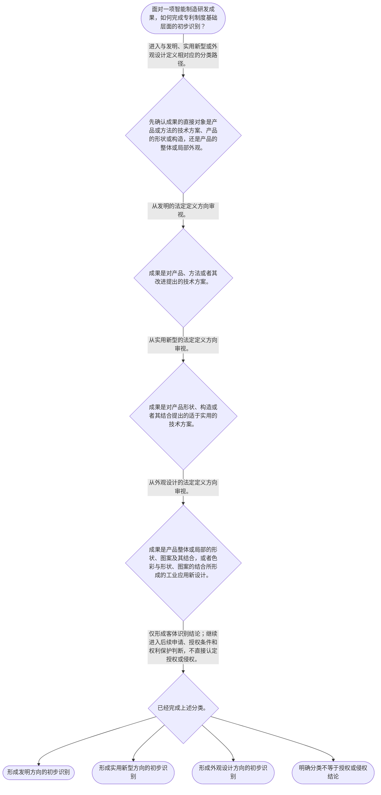

# 整合后的课程完整内容与习题

## 教学模块选择清单

- 当前教学节点：`patent-law-foundation`
- 板块预算：自适应 6/6，总计 9/9

| # | 模块 (block_type) | 类型 | 触发原因 (trigger) | 对应正文段 | 归属 |
|---:|---|:--:|---|---|:--:|
| 1 | `anchor_scenario` | 自适应 | perception=sensing(0.84) / cold_start | 智能工厂三项成果的专利入口｜某智能制造企业的研发组正在升级机器人视觉检测单元。工程师甲优化了机器人自动校准的步骤；工程师… | [A] |
| 2 | `legal_anchor` | 必选 | mandatory | 制度基础的法条锚点｜《专利法》第一条 | [A] |
| 3 | `worked_example` | 自适应 | cold_start(low_confidence) | 机器人视觉检测单元的分类演示｜某工厂研发机器人视觉检测单元，形成了自动校准步骤、相机安装支架的内部锁紧构造，以及检测柜门的… | [A] |
| 4 | `decision_flow` | 自适应 | input=visual(0.81) | 智能制造成果的基础识别流程｜面对一项智能制造研发成果，如何完成专利制度基础层面的初步识别？ | [A] |
| 5 | `mnemonic` | 自适应 | understanding=sequential(0.73) | 制度基础四层表｜四层核对表：目—规—类—界。先看制度目的，再找规范层次，再分三类客体，最后核对权利边界。 | [A] |
| 6 | `reflect_prompt` | 自适应 | processing=reflective(0.66) | 从研发经验回看分类边界｜回想你熟悉的一项智能制造研发成果：其中哪些部分是方法、哪些部分是产品构造、哪些部分只是产品外… | [A] |
| 7 | `assessment` | 必选 | mandatory | 基础识别测评｜复习三类法定发明创造的基本范围。 | [A] |
| 8 | `knowledge_synthesis` | 必选 | mandatory | 专利法律制度基础框架｜制度目的：专利法通过保护合法权益、鼓励创造和推动应用服务科技进步与经济社会发展。 | [A] |
| 9 | `summary_card` | 自适应 | len(knowledge_sub_nodes)=3>=3 | 制度基础速查卡｜先按法定定义分客体，再按后续规则审授权与保护；不要把第一步当成最终结论。 | [A] |

## 教学正文

## I — 法律问题

智能制造研发团队面对一个机器人产线改造方案时，首先要回答的并不是“技术是否先进”，而是：该成果属于哪一类可受专利法保护的发明创造；专利制度通过何种规则体系运行；以及专利权为何同时具有独占性、时间性与地域性。本节只建立制度基础，不对新颖性或侵权是否成立作实体判断；该两项将分别在后续节点展开。

## R — 适用规则

### 1. 制度目的与基本结构

《专利法》第一条将保护专利权人合法权益、鼓励发明创造、推动发明创造应用、提高创新能力以及促进科学技术进步和经济社会发展列为立法目的。〔RAG: 中华人民共和国专利法.txt — 第一条“保护专利权人的合法权益，鼓励发明创造，推动发明创造的应用”〕

中国专利制度的规范层次可按“法律—实施细则—审查指南”理解：专利法提供基本权利、条件和程序框架；实施细则根据专利法细化手续和程序；专利审查指南用于审查实践中的具体适用。检索材料直接提供了实施细则“根据《中华人民共和国专利法》制定”的依据，并规定专利法和细则中的手续应以书面形式或规定的其他形式办理。〔RAG: 中华人民共和国专利法实施细则.txt — 第一条“根据《中华人民共和国专利法》制定本细则”；第二条“各种手续，应当以书面形式或者国务院专利行政部门规定的其他形式办理”〕

### 2. 三类保护客体

《专利法》第二条规定，发明创造包括发明、实用新型和外观设计。发明是对产品、方法或者其改进提出的新的技术方案；实用新型是对产品形状、构造或者其结合提出的适于实用的新的技术方案；外观设计则是对产品整体或局部的形状、图案及其结合，或者色彩与形状、图案的结合所作出的富有美感并适于工业应用的新设计。〔RAG: 中华人民共和国专利法.txt — 第二条“发明创造是指发明、实用新型和外观设计”及三类定义〕

对智能制造技术作初步归类时，应先抓住技术方案的直接对象：例如，工业机器人视觉标定的方法步骤，通常应从“方法技术方案”方向理解；夹具、传感器支架等产品的形状或构造改进，通常应从实用新型的定义方向审视；设备外壳的整体或局部视觉设计，则应从外观设计的定义方向审视。这里是分类训练，不等于已经得出可授权结论。

### 3. 专利权的三项制度特征

专利权的独占性，是指专利权依法形成排他性利益；其具体效力边界和侵权判定须在后续“专利权保护”节点依据具体条文处理。时间性，是指专利权并非永久存在，而受法定期限约束。地域性，是指专利权的效力依各法域分别取得和行使，不能把一国授权当然等同于全球保护。这三项是理解专利布局、公开与技术转化的制度前提，本节不延伸讨论具体期限和跨境程序。

### 4. 制度功能与程序轮廓

专利制度不是只奖励技术秘密：申请文件公开使技术信息可被社会获得，授权后的权利安排则为研发投入和技术应用提供制度激励。该功能与《专利法》第一条所表达的“鼓励发明创造”“推动发明创造的应用”相衔接。〔RAG: 中华人民共和国专利法.txt — 第一条“鼓励发明创造，推动发明创造的应用”〕

制度发展材料显示，现行专利法文本经历1984年通过以及1992年、2000年、2008年和2020年修正。〔RAG: 中华人民共和国专利法.txt — 法律沿革列明1984年通过及四次修正〕 对“早期公开、延迟审查”以及“初步审查制与实质审查制并存”的具体程序条件，本检索上下文未提供直接条文依据；本节仅将其作为后续申请与审查节点的制度地图，不据此作程序期限或适用结论。

同时应把“保护客体”与“授权条件”严格分开：第二十二条规定，发明和实用新型获得授权还须具备新颖性、创造性和实用性。〔RAG: 中华人民共和国专利法.txt — 第二十二条“授予专利权的发明和实用新型，应当具备新颖性、创造性和实用性”〕 因而，某成果被初步归入发明、实用新型或外观设计，并不当然表示它必然获得授权。

## A — 规则适用

以智能工厂的“机器人视觉检测单元”为例：团队同时完成了检测节拍优化流程、相机安装支架和设备面板外观。第一步，不以“都用于制造业”为标准一概归类，而是逐项识别方案对象：流程关注方法，支架关注产品形状或构造，面板关注产品外观。第二步，分别将其与第二条的三类定义对应。第三步，形成分类后仍须进入相应申请、审查和授权条件的后续判断；尤其不能把“技术方案”这一初步分类误作“已经具备新颖性”或“已经能够主张侵权”。

这一顺序也解释了制度功能：研发团队通过申请披露技术内容并寻求法定保护，社会则可在公开信息基础上获取技术信息；权利是否最终成立以及能否排除他人实施，必须回到后续的授权和保护规则。

## C — 结论

专利法律制度基础的核心，是先建立四层判断顺序：先确认制度目的，再识别规范层次，再区分三类保护客体，最后理解专利权的独占性、时间性和地域性。对智能制造成果，先按“产品或方法技术方案、产品形状构造、产品外观”进行分类；分类不是授权，更不是侵权结论。

> 常见误区 / 易混淆点
>
> 1. 把“发明、实用新型、外观设计”理解为技术价值高低排序。三者是法定保护客体类型，判断关键是方案对象和法定定义。
> 2. 把专利权独占性理解为永久、全球自动排他。专利权还受时间性和地域性限制。
> 3. 把“属于可申请客体”直接等同于“具备新颖性”或“他人必然侵权”。授权条件与侵权判定属于后续不同判断层次。
> 4. 用户希望结合真实案例，但本次检索上下文未提供可核验的智能制造司法案例或行政决定；因此本节仅使用明确标注的教学情境，不将其称为真实案例。

本节设有测评，请到【习题】区作答。

### 智能工厂三项成果的专利入口（anchor_scenario）

> 某智能制造企业的研发组正在升级机器人视觉检测单元。工程师甲优化了机器人自动校准的步骤；工程师乙改造了相机支架内部的锁紧构造；设计师丙重新设计了检测柜门的局部图案。项目经理希望“把三项都申请专利”，并认为一旦申请，其他国家的竞争者就永远不能使用类似技术。

法务人员需要先制止这种混合判断：三项成果的对象并不相同，专利权也不是永久、全球自动生效的技术标签。必须先识别专利制度的目的、规范依据和三类保护客体，才能进入后续授权与保护分析。

**锚定**：该情境以同一智能制造项目锚定三类保护客体以及独占性、时间性、地域性的制度边界。

**先想一想**：面对同一项目中的“方法、构造、外观”三项成果，为什么不能用一个专利类别和一个结论一并处理？

### 制度基础的法条锚点（legal_anchor）

- **《专利法》第一条**：第一条说明专利制度既保护权利人，也鼓励创造、推动应用并服务科技和经济发展。
- **《专利法》第二条**：第二条把专利保护客体分为发明、实用新型和外观设计，并分别给出定义。
- **《专利法实施细则》第一条、第二条**：实施细则以专利法为依据，细化专利事务办理的程序性规则。
- **《专利法》第二十二条**：第二十二条提示：发明和实用新型即使属于可识别的技术方案，仍须满足新颖性、创造性和实用性等授权条件。

**为何重要**：本节点的全部基础判断必须先回到立法目的、客体定义和规范层次。第二十二条还划出边界：客体分类不能替代后续授权条件判断。

### 机器人视觉检测单元的分类演示（worked_example）

**案情/例题**：某工厂研发机器人视觉检测单元，形成了自动校准步骤、相机安装支架的内部锁紧构造，以及检测柜门的局部图案。待解决的问题是：三项成果在申请前应分别从哪一类专利客体方向审视，以及能否仅凭该分类断言已经取得专利保护。
**适用规则**：《专利法》第二条关于发明、实用新型和外观设计的定义；《专利法》第二十二条关于发明和实用新型授权条件的规定。
**分步推演**：
1. 先拆分成果，而不以“均服务于智能制造”作为分类标准。自动校准步骤的直接对象是操作流程；支架改进的直接对象是产品内部构造；柜门图案的直接对象是产品外观。 → *分类的起点是方案对象，而不是行业名称。*
2. 将自动校准步骤与“对方法或者其改进所提出的新的技术方案”相对应，将支架内部锁紧构造与“对产品的形状、构造或者其结合”相对应。 → *前两项分别从发明和实用新型方向审视。*
3. 将柜门局部图案与产品局部的形状、图案及其结合等外观设计定义相对照；其重点不是内部技术机理，而是产品外观设计。 → *该项从外观设计方向审视。*
4. 第二条解决的是客体识别，第二十二条另行规定发明和实用新型的授权条件；具体权利保护也须待后续节点处理。 → *分类结论不能替代授权或侵权结论。*
**结论**：自动校准步骤可从发明方向审视，支架内部锁紧构造可从实用新型方向审视，柜门局部图案可从外观设计方向审视；但三项分类均不当然等于已被授权或可直接主张侵权。
**本题要点**：对复合型智能制造项目，先逐项拆分技术成果，再依第二条分类，并将分类、授权和保护三个层次分开。

### 智能制造成果的基础识别流程（decision_flow）

**决策问题**：面对一项智能制造研发成果，如何完成专利制度基础层面的初步识别？



### 制度基础四层表（mnemonic）

**记忆锚**：四层核对表：目—规—类—界。先看制度目的，再找规范层次，再分三类客体，最后核对权利边界。
**映射**：
- 目
- 规
- 类
- 界
**何时用**：遇到研发成果、技术交底书或专利检索报告时，先用“目—规—类—界”核对，避免直接跳到授权或侵权结论。

### 从研发经验回看分类边界（reflect_prompt）

**反思问题**：回想你熟悉的一项智能制造研发成果：其中哪些部分是方法、哪些部分是产品构造、哪些部分只是产品外观？你在研发记录中是否把它们混写为一个“技术方案”？

**关注要点**：区分研发项目整体与可分别识别的技术成果。；区分方法技术方案、产品形状或构造、产品外观三个对象。；注意分类只是进入专利制度的第一步，不替代授权和侵权分析。

**连接**：连接到学习者已有的理工研发经验，以及本节“目—规—类—界”的四层核对表。

### 专利法律制度基础框架（knowledge_synthesis）

**知识框架**：
- 制度目的：专利法通过保护合法权益、鼓励创造和推动应用服务科技进步与经济社会发展。
- 规范体系：专利法提供基本制度框架，实施细则细化程序规则，审查指南服务具体审查适用。
- 保护客体：发明关注产品、方法或改进的技术方案；实用新型关注产品形状、构造或其结合；外观设计关注产品整体或局部外观设计。
- 权利特征：专利权具有独占性、时间性和地域性，不能被理解为永久或全球自动有效。
- 制度运行：申请、公开、审查和授权构成制度链条；早期公开与审查制度的具体条件留待后续程序节点依直接依据学习。
**概念关系**：先理解立法目的和规范层次，才能正确定位专利制度的功能与规则来源。；先按第二条识别客体，再进入申请、授权条件和专利权保护等后续判断。；独占性必须与时间性、地域性共同理解，三者共同限定专利权的制度边界。
**必记**：《专利法》第二条是识别发明、实用新型和外观设计的直接法条依据。；成果属于某类保护客体，不等于当然具备授权条件，更不等于当然构成或可主张侵权。；发明和实用新型的授权还须满足新颖性、创造性和实用性。

### 制度基础速查卡（summary_card）

**要点卡**：
- **制度目的**：保护合法权益、鼓励发明创造并推动技术应用，是专利制度的立法出发点。
- **规范体系**：专利法定基本框架，实施细则细化程序，审查指南服务具体审查适用。
- **三类客体**：发明看产品或方法技术方案，实用新型看产品形状或构造，外观设计看产品外观。
- **三项特征**：专利权具有独占性、时间性和地域性，不能被绝对化理解。
- **分类边界**：识别客体只是第一关，不替代新颖性等授权条件或后续侵权判断。
**必背**：《专利法》第二条：发明创造包括发明、实用新型和外观设计。；《专利法》第二十二条：发明和实用新型授权须具备新颖性、创造性和实用性。；客体分类、授权条件、侵权判定是三个不能混同的层次。
**一句话总结**：先按法定定义分客体，再按后续规则审授权与保护；不要把第一步当成最终结论。

### 基础识别测评（assessment）

**三类覆盖**：backward_review、forward_probe、weakness_probe
**题目**：
- q_foundation_review_01：复习三类法定发明创造的基本范围。
- q_protection_probe_01：探测客体分类与后续专利权保护判断的关系。
- q_foundation_weakness_01：综合辨析智能制造复合成果的分类与授权边界。


## 结构化数据

## expert

```json
"expert_a"
```

## style

```json
"conservative"
```

## knowledge_points

```json
[
  {
    "node_id": "patent-law-foundation",
    "kc_name": "专利制度的基本概念与特征：独占性、时间性、地域性"
  },
  {
    "node_id": "patent-law-foundation",
    "kc_name": "中国专利制度体系：专利法、专利法实施细则、专利审查指南"
  },
  {
    "node_id": "patent-law-foundation",
    "kc_name": "专利保护的三种客体：发明、实用新型、外观设计"
  },
  {
    "node_id": "patent-law-foundation",
    "kc_name": "专利制度的作用：激励发明创造、促进技术公开、推动技术应用和经济发展"
  },
  {
    "node_id": "patent-law-foundation",
    "kc_name": "中国专利制度发展历程与特点：早期公开延迟审查、初步审查制与实质审查制并存"
  }
]
```

## legal_basis

```json
[
  {
    "article": "《中华人民共和国专利法》第一条",
    "source": "中华人民共和国专利法.txt：第一条规定保护专利权人合法权益、鼓励发明创造、推动应用、提高创新能力并促进科技进步和经济社会发展。"
  },
  {
    "article": "《中华人民共和国专利法》第二条",
    "source": "中华人民共和国专利法.txt：第二条规定发明创造包括发明、实用新型和外观设计，并分别界定三类客体。"
  },
  {
    "article": "《中华人民共和国专利法实施细则》第一条、第二条",
    "source": "中华人民共和国专利法实施细则.txt：第一条规定细则根据专利法制定；第二条规定专利法和细则规定的手续应以书面或规定的其他形式办理。"
  },
  {
    "article": "《中华人民共和国专利法》第二十二条",
    "source": "中华人民共和国专利法.txt：第二十二条规定发明和实用新型授权须具备新颖性、创造性和实用性。"
  }
]
```

## risks

```json
[
  {
    "risk": "将三类专利客体的分类结论误认为授权结论，进而跳过新颖性、创造性和实用性审查。",
    "related_node_id": "patent-law-foundation"
  },
  {
    "risk": "将独占性绝对化，忽略专利权的时间性、地域性以及后续具体保护规则。",
    "related_node_id": "patent-law-foundation"
  },
  {
    "risk": "提前把本节的客体识别用于侵权定论；侵权保护范围和实施行为须在后续节点另行判断。",
    "related_node_id": "patent-rights-protection"
  }
]
```

## draft_stage

```json
"debate"
```

## irac

```json
{
  "issue": "智能制造研发成果进入专利制度时，如何识别其保护客体、理解制度规范层次和专利权基本特征，并避免把分类混同于授权或侵权结论。",
  "rule": "《专利法》第一条规定立法目的；第二条规定发明创造包括发明、实用新型和外观设计及其定义；《专利法实施细则》第一条、第二条规定细则依据专利法制定及程序形式要求；第二十二条规定发明和实用新型授权须具备新颖性、创造性和实用性。",
  "application": "对机器人视觉检测单元分别识别方法流程、产品构造和产品外观，并依第二条对应发明、实用新型和外观设计的定义；再将分类结论与后续授权条件、权利保护判断相分离。",
  "conclusion": "本节点应先完成制度目的、规范体系、三类客体及专利权三项特征的基础识别；成果分类本身不构成授权或侵权结论。"
}
```

## interactive_questions

```json
[
  {
    "qid": "q_foundation_review_01",
    "category": "remember",
    "difficulty": "L1",
    "source_tag": "backward_review",
    "kc_node_id": "patent-law-foundation",
    "question": "依据《专利法》第二条，下列关于三类发明创造的表述，正确的是哪一项？",
    "answer": "A",
    "options": [
      "A. 发明创造包括发明、实用新型和外观设计。",
      "B. 发明创造仅包括具有复杂技术原理的发明。",
      "C. 实用新型只能针对产品的方法改进。",
      "D. 外观设计只能针对产品的色彩，不能涉及形状或图案。"
    ]
  },
  {
    "qid": "q_protection_probe_01",
    "category": "understand",
    "difficulty": "L1",
    "source_tag": "forward_probe",
    "kc_node_id": "patent-rights-protection",
    "question": "下列对下一节点“专利权保护”学习任务的理解，正确的是哪一项？",
    "answer": "B",
    "options": [
      "A. 只要本节能区分三类客体，即可直接认定任何他人行为构成侵权。",
      "B. 本节的客体分类是基础；具体保护范围和是否侵权仍需在后续节点依据专门规则判断。",
      "C. 专利权保护只与外观设计有关，与发明和实用新型无关。",
      "D. 专利权保护问题不需要识别专利类型。"
    ]
  },
  {
    "qid": "q_foundation_weakness_01",
    "category": "analyze",
    "difficulty": "L3",
    "source_tag": "weakness_probe",
    "kc_node_id": "patent-law-foundation",
    "question": "某智能制造团队形成三项成果：机器人校准步骤、一种改变内部锁紧构造的夹具、以及设备外壳局部图案。下列分类与后续判断关系的表述，正确的是哪一项？",
    "answer": "C",
    "options": [
      "A. 三项成果均为发明，且分类完成即当然满足授权条件。",
      "B. 校准步骤只能作为外观设计保护；夹具和图案无需再看其他法律要求。",
      "C. 校准步骤可从发明中的方法技术方案方向审视，夹具可从实用新型的产品形状或构造方向审视，外壳图案可从外观设计方向审视；分类不等于已获授权。",
      "D. 只要成果用于智能工厂，就当然在全球范围内享有永久排他权。"
    ]
  }
]
```

## knowledge_synthesis

```json
{
  "node": "patent-law-foundation",
  "coverage": [
    {
      "node_id": "patent-law-foundation"
    },
    {
      "node_id": "patent-law-foundation"
    },
    {
      "node_id": "patent-law-foundation"
    },
    {
      "node_id": "patent-law-foundation"
    },
    {
      "node_id": "patent-law-foundation"
    }
  ],
  "confusable_pairs": [
    {
      "pair": "保护客体分类与授权条件：前者回答成果属于何种法定类型，后者回答是否满足授权门槛；二者不可互相替代。"
    },
    {
      "pair": "专利权独占性与永久、全球排他：独占性须同时受时间性和地域性限制。"
    },
    {
      "pair": "发明与实用新型：发明可涉及产品、方法或改进，实用新型限于产品形状、构造或其结合的技术方案。"
    }
  ]
}
```
