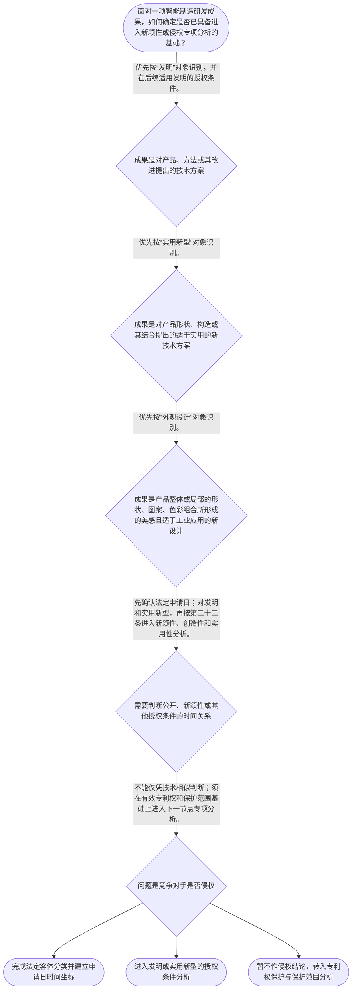

# 整合后的课程完整内容与习题

## 教学模块选择清单

- 当前教学节点：`patent-law-foundation`
- 板块预算：自适应 6/6，总计 9/9

| # | 模块 (block_type) | 类型 | 触发原因 (trigger) | 对应正文段 | 归属 |
|---:|---|:--:|---|---|:--:|
| 1 | `anchor_scenario` | 自适应 | perception=sensing(0.84) / cold_start | 智能产线项目的三类成果｜某智能制造团队为电池模组装配线开发了三项成果：根据视觉传感器数据自动修正焊接参数的控制流程、… | [A] |
| 2 | `legal_anchor` | 必选 | mandatory | 本节法条锚点｜《专利法》第二条 | [A] |
| 3 | `worked_example` | 自适应 | cold_start(low_confidence) | 智能制造成果的基础分类演示｜某企业同日形成三项成果：一是根据传感器数据调整焊接电流的控制方法；二是具有特殊导向槽与锁紧部… | [A] |
| 4 | `decision_flow` | 自适应 | input=visual(0.81) | 进入专项判断前的基础流程｜面对一项智能制造研发成果，如何确定是否已具备进入新颖性或侵权专项分析的基础？ | [A] |
| 5 | `mnemonic` | 自适应 | understanding=sequential(0.73) | 基础判断顺序表｜“客—日—权—侵”四步表：先看客体，再定申请日；先审授权前提，再谈侵权问题。 | [A] |
| 6 | `reflect_prompt` | 自适应 | processing=reflective(0.66) | 研发流程中的专利坐标反思｜回看你熟悉的一项智能制造研发成果：其中哪些部分属于方法、产品构造或产品外观；团队在何时可能发… | [A] |
| 7 | `assessment` | 必选 | mandatory | 基础制度测评｜识别实用新型的法定对象。 | [A] |
| 8 | `knowledge_synthesis` | 必选 | mandatory | 专利法律制度基础框架｜基本特征：专利权具有独占性、时间性和地域性；具体效力与期限须依后续专门规则判断。 | [A] |
| 9 | `summary_card` | 自适应 | len(knowledge_sub_nodes)=3>=3 | 专利基础速查卡｜先分客体、再定申请日、后审授权条件；有了有效权利才进入侵权分析。 | [A] |

## 教学正文

## I — 法律问题

智能制造企业面对一项机器人、产线控制或工业设备改进时，首先不是直接判断“是否侵权”或“是否有新颖性”，而是确定：该技术方案是否属于专利制度可保护的客体；专利权为何具有独占、时间和地域边界；以及申请、公开、审查与授权在制度中分别承担何种功能。

本节的结论先行：**专利制度是以公开换取法定、有限且具有地域边界的专有权的制度；发明、实用新型和外观设计是三类法定保护客体。**新颖性与侵权判定是后续节点的专项问题，本节只建立进入这些判断前必须使用的制度坐标。

## R — 适用规则

### 1. 三类法定保护客体

《专利法》第二条规定，本法所称发明创造包括发明、实用新型和外观设计。发明是对产品、方法或者其改进提出的新的技术方案；实用新型是对产品的形状、构造或者其结合提出的、适于实用的新的技术方案；外观设计则是对产品整体或者局部的形状、图案及其结合，或者色彩与形状、图案的结合所作出的富有美感并适于工业应用的新设计。〔RAG: 中华人民共和国专利法.txt — 第二条：发明创造是指发明、实用新型和外观设计〕

据此，智能制造场景应先按技术对象分类：例如，机械臂的控制方法可进入“发明”的分析；夹具的特殊结构通常应先检视“实用新型”；设备外壳或操作面板的视觉设计则应先检视“外观设计”。分类是后续确定授权条件、审查路径和保护范围依据的起点，而不是仅按产品名称作判断。

### 2. 专利制度的基本特征

专利权具有独占性、时间性和地域性。独占性意味着权利人在法律规定的范围内取得排他的实施利益；时间性意味着这种排他利益不是永久的；地域性意味着权利效力以授予该权利的法域为边界。对于具体权利的效力、期限、保护范围和侵权行为，须在后续“专利权保护”及侵权节点中依条文进一步判断，不能由本节的概念性描述直接推出具体侵权结论。

### 3. 制度体系与程序位置

中国专利制度的规范层次包括《专利法》、专利法实施细则和《专利审查指南》。本节检索上下文直接提供《专利法》条文；对实施细则和审查指南的具体条款、具体审查口径，检索上下文未提供直接依据，故本节不作条款化展开。国务院专利行政部门负责管理全国专利工作，统一受理和审查专利申请，并依法授予专利权。〔RAG: 中华人民共和国专利法.txt — 第三条：统一受理和审查专利申请，依法授予专利权〕

制度运行上，申请日是重要时间锚点：国务院专利行政部门收到申请文件之日为申请日。〔RAG: 中华人民共和国专利法.txt — 第二十八条：收到专利申请文件之日为申请日〕发明和实用新型的授权还须具备新颖性、创造性和实用性；其中，现有技术是申请日以前在国内外为公众所知的技术。〔RAG: 中华人民共和国专利法.txt — 第二十二条：授予专利权的发明和实用新型，应当具备新颖性、创造性和实用性〕因此，后续的新颖性学习会以“申请日—公开—技术内容”为主线；不能把“产品已经研发完成”误当作法律上的申请日。

本节点所列“早期公开延迟审查、初步审查制与实质审查制并存”是对制度流程特点的概括：公开、审查、授权是不同程序环节，不能因申请已经公开就推定已获授权。本轮检索上下文未提供这些程序特点的完整直接条文依据，故仅作为框架定位，不延伸到具体期限或程序效果。

### 4. 制度功能

专利制度通过设置申请、公开、审查和授权的法律框架，使技术方案在满足法定条件时获得保护，并使社会能够从公开的专利信息中获取技术信息。检索材料记载，专利法立法宗旨曾强调促进科学技术进步和创新。〔RAG: 专利法律知识详细解读.txt — 2000年修改明确专利立法促进科技进步与创新的宗旨〕就智能制造研发管理而言，这意味着研发团队应把技术分类、申请日留痕、公开风险识别与专利检索纳入开发流程。

## A — 规则适用

以一个示范性智能制造场景说明：某工厂研发团队完成三项成果——一套依据传感器数据动态调整焊接参数的控制流程、一种具有特定锁紧构造的快换夹具，以及一款具有独特面板图案的工业终端外壳。

第一步，按第二条的对象定义拆分，而不把三项成果笼统称为“一个机器人专利”。控制流程属于对方法提出的技术方案，应优先按发明路径分析；快换夹具的形状、构造属于实用新型的重点对象；终端外壳的视觉设计则应优先按外观设计路径分析。〔RAG: 中华人民共和国专利法.txt — 第二条分别界定发明、实用新型和外观设计〕

第二步，确定时间锚点。若团队在提交申请前向客户、展会或网络公开控制流程，后续新颖性分析将围绕申请日前是否已为公众所知展开；仅有内部研发记录并不等同于已向公众公开。申请文件被主管部门收到的日期是申请日。〔RAG: 中华人民共和国专利法.txt — 第二十八条：收到专利申请文件之日为申请日〕

第三步，区分授权问题与侵权问题。授权阶段先看申请客体和法定授权条件；针对发明或实用新型，第二十二条要求新颖性、创造性、实用性。〔RAG: 中华人民共和国专利法.txt — 第二十二条：应当具备新颖性、创造性和实用性〕侵权阶段则须在专利权已存在的前提下，另行确定保护范围、被诉行为及法定例外；本节不将“技术相似”直接等同于侵权。

## C — 结论

专利基础判断应按线性顺序进行：先识别成果属于发明、实用新型还是外观设计；再以申请日为时间坐标安排公开和申请；随后进入相应的授权审查标准；只有在存在有效专利权时，才进一步讨论保护范围与侵权。对智能制造项目而言，技术方案、结构方案和产品视觉设计可能分别对应不同客体，不能用同一套直觉替代法定分类。

> 常见误区 / 易混淆点
>
> 1. “专利申请公开”不等于“获得专利权”；公开与授权是不同程序环节。
> 2. “研发完成日期”不当然等于“申请日”；申请日原则上以主管部门收到申请文件之日为准。
> 3. “技术方案相似”不当然等于侵权；侵权须以后续节点中的有效权利、保护范围及实施行为为基础。
> 4. 新颖性、优先权和侵权抗辩均属后续专门判断，当前仅建立其共同前提：客体分类、申请日和程序位置。

本节设有测评，请到【习题】区作答。

### 智能产线项目的三类成果（anchor_scenario）

> 某智能制造团队为电池模组装配线开发了三项成果：根据视觉传感器数据自动修正焊接参数的控制流程、用于快速定位工件的锁紧夹具，以及带有独特图案与按键布局的操作终端外壳。项目负责人计划下周向客户演示，并询问“这些能否申请专利；若竞争对手做出相似设备，是否就能主张侵权”。

此时不能把整条产线视为一个笼统对象：流程、夹具和外壳的法律分类可能不同；演示、申请、公开、审查和授权也处于不同环节。

**锚定**：该情境锚定专利客体分类、申请日和授权与侵权相区分这三个基础坐标。

**先想一想**：在判断新颖性或侵权之前，为什么必须先把控制流程、夹具构造和终端外观分开识别？

### 本节法条锚点（legal_anchor）

- **《专利法》第二条**：专利法只将发明、实用新型和外观设计纳入“发明创造”，三者的对象定义不同。
- **《专利法》第三条**：国务院专利行政部门统一受理、审查专利申请并依法授予专利权。
- **《专利法》第二十二条**：发明和实用新型要获得专利权，必须具备新颖性、创造性和实用性。
- **《专利法》第二十八条**：申请日原则上是国务院专利行政部门收到申请文件的日期，是后续时间判断的重要基准。

**为何重要**：本节先用法条确定“什么可以按哪类专利分析”及“程序从何时起算”。后续新颖性和侵权判断都不能脱离这些前提。

### 智能制造成果的基础分类演示（worked_example）

**案情/例题**：某企业同日形成三项成果：一是根据传感器数据调整焊接电流的控制方法；二是具有特殊导向槽与锁紧部件的机器人末端夹具；三是工业控制屏的外壳图案。企业拟提交专利申请，并将申请受理日作为后续公开风险分析的时间点。应如何完成基础制度判断？
**适用规则**：《专利法》第二条规定发明、实用新型、外观设计的法定定义；第二十八条规定申请日原则上为国务院专利行政部门收到申请文件之日；第二十二条规定发明和实用新型的授权条件。
**分步推演**：
1. 控制方法属于对方法提出的技术方案，应首先纳入发明的对象定义，而非因其运行于设备中就当然变成实用新型。 → *先按技术内容识别为方法类成果。*
2. 夹具的导向槽、锁紧部件属于产品形状、构造或其结合，应首先按实用新型的对象定义审视。 → *产品构造与方法应分开分类。*
3. 控制屏外壳的图案与外观属于产品视觉设计，应首先按外观设计的对象定义审视。 → *外观设计不以技术控制方法为分析中心。*
4. 后续若分析公开是否影响发明或实用新型的新颖性，应以法定申请日为时间坐标，并依第二十二条继续审查新颖性、创造性和实用性。 → *分类之后再进入以申请日为轴的授权条件判断。*
**结论**：同一智能制造项目可同时包含发明、实用新型和外观设计候选成果；应分别分类，并以申请日为后续授权条件分析的法定时间锚点。
**本题要点**：先分类、再定申请日、后审授权条件，是避免把产品、程序和权利问题混为一谈的基础步骤。

### 进入专项判断前的基础流程（decision_flow）

**决策问题**：面对一项智能制造研发成果，如何确定是否已具备进入新颖性或侵权专项分析的基础？



### 基础判断顺序表（mnemonic）

**记忆锚**：“客—日—权—侵”四步表：先看客体，再定申请日；先审授权前提，再谈侵权问题。
**映射**：
- 客
- 日
- 权
- 侵
**何时用**：看到“能否申请”“公开是否有风险”或“是否侵权”时，先按四步表定位问题所处环节。

### 研发流程中的专利坐标反思（reflect_prompt）

**反思问题**：回看你熟悉的一项智能制造研发成果：其中哪些部分属于方法、产品构造或产品外观；团队在何时可能发生对外公开；又应把哪一天作为申请日的核验对象？

**关注要点**：不要把整机或整条产线当然视为一个专利客体。；区分内部完成、对外公开、提交申请、申请公开和授权这些不同时间点与程序环节。；将“可申请或可授权”的问题与“他人是否侵权”的问题分开记录。

**连接**：连接到学习者已有的研发项目管理经验，并为下一节点“专利权保护”的有效权利与保护范围问题建立前提。

### 专利法律制度基础框架（knowledge_synthesis）

**知识框架**：
- 基本特征：专利权具有独占性、时间性和地域性；具体效力与期限须依后续专门规则判断。
- 制度体系：以专利法为基本法律规范，并由实施细则和专利审查指南共同构成制度运行框架；本节对后两者不作无依据的条款化展开。
- 保护客体：发明、实用新型、外观设计是《专利法》第二条列举的三类发明创造，应按技术内容分别识别。
- 制度作用：通过申请、公开、审查和授权的制度安排，服务技术公开、技术应用和科技进步创新。
- 程序特点：公开、审查、授权属于不同环节；制度中存在初步审查与实质审查等不同审查机制，但本轮资料未提供完整具体程序依据。
**概念关系**：客体分类决定后续应适用的授权与保护规则。；申请日连接研发公开行为与新颖性等授权条件判断。；授权条件分析在前，专利权保护与侵权分析在有效权利基础上展开。
**必记**：发明、实用新型和外观设计的法定对象定义不同，智能制造项目中的方法、构造和外观应分别识别。；发明和实用新型的授权须具备新颖性、创造性和实用性；申请日是后续时间判断的重要基准。；申请公开或技术相似均不等于已经授权或当然构成侵权。

### 专利基础速查卡（summary_card）

**要点卡**：
- **三类客体**：发明看产品、方法或改进的技术方案；实用新型看产品形状、构造；外观设计看产品视觉设计。
- **三项特征**：独占性、时间性、地域性提示专利权不是无限、永久或全球自动有效的权利。
- **制度体系**：专利法提供基本规则，实施细则和审查指南承接具体制度运行与审查口径。
- **申请日**：申请日原则上以主管部门收到申请文件之日为准，是后续时间判断的重要锚点。
- **程序分层**：申请、公开、审查、授权和侵权是不同问题，不能相互替代。
**必背**：《专利法》第二条：发明创造包括发明、实用新型和外观设计。；《专利法》第二十二条：发明和实用新型授权应具备新颖性、创造性和实用性。；《专利法》第二十八条：申请日原则上为国务院专利行政部门收到申请文件之日。
**一句话总结**：先分客体、再定申请日、后审授权条件；有了有效权利才进入侵权分析。

### 基础制度测评（assessment）

**三类覆盖**：backward_review、forward_probe、weakness_probe
**题目**：
- q_foundation_review_l1：识别实用新型的法定对象。
- q_rights_protection_probe_l1：仅探测下一节点中发明和实用新型的保护范围依据。
- q_foundation_weakness_l3：综合区分客体分类、申请日、授权判断与侵权判断。


## 结构化数据

## expert

```json
"expert_a"
```

## style

```json
"conservative"
```

## knowledge_points

```json
[
  {
    "node_id": "patent-law-foundation",
    "kc_name": "专利制度的基本概念与特征：独占性、时间性、地域性"
  },
  {
    "node_id": "patent-law-foundation",
    "kc_name": "中国专利制度体系：专利法、专利法实施细则、专利审查指南"
  },
  {
    "node_id": "patent-law-foundation",
    "kc_name": "专利保护的三种客体：发明、实用新型、外观设计"
  },
  {
    "node_id": "patent-law-foundation",
    "kc_name": "专利制度的作用：激励发明创造、促进技术公开、推动技术应用和经济发展"
  },
  {
    "node_id": "patent-law-foundation",
    "kc_name": "中国专利制度发展特点：早期公开延迟审查、初步审查制与实质审查制并存"
  }
]
```

## legal_basis

```json
[
  {
    "article": "《中华人民共和国专利法》第二条",
    "source": "中华人民共和国专利法.txt：第二条"
  },
  {
    "article": "《中华人民共和国专利法》第三条",
    "source": "中华人民共和国专利法.txt：第三条"
  },
  {
    "article": "《中华人民共和国专利法》第二十二条",
    "source": "中华人民共和国专利法.txt：第二十二条"
  },
  {
    "article": "《中华人民共和国专利法》第二十八条、第二十九条",
    "source": "中华人民共和国专利法.txt：第二十八条、第二十九条"
  }
]
```

## risks

```json
[
  {
    "risk": "将专利申请的公开、审查或受理误认为已经授权，进而错误进入侵权判断。",
    "related_node_id": "patent-law-foundation"
  },
  {
    "risk": "将研发完成日、内部记录日或对外展示日当然视为申请日，忽略法定申请日的时间锚定作用。",
    "related_node_id": "patent-law-foundation"
  },
  {
    "risk": "把智能制造设备整体作为单一保护对象，遗漏方法、产品结构和外观设计可能分别适用不同客体规则。",
    "related_node_id": "patent-law-foundation"
  }
]
```

## draft_stage

```json
"debate"
```

## irac

```json
{
  "issue": "智能制造研发成果应如何在进入新颖性或侵权分析前，识别其专利客体、制度边界与程序位置？",
  "rule": "《专利法》第二条将发明创造区分为发明、实用新型和外观设计；第三条规定国务院专利行政部门统一受理、审查申请并依法授予专利权；第二十二条规定发明和实用新型授权须具备新颖性、创造性和实用性；第二十八条规定申请日原则上为收到申请文件之日。",
  "application": "对控制方法、夹具构造和终端外观分别依第二条分类；以收到申请文件之日作为后续公开和新颖性分析的时间坐标；将授权条件与有效专利权基础上的侵权判断分开处理。",
  "conclusion": "应先完成客体分类、申请日定位和程序环节识别，再分别进入新颖性或侵权的专项判断；申请公开、技术相似或研发完成本身均不足以直接得出授权或侵权结论。"
}
```

## interactive_questions

```json
[
  {
    "qid": "q_foundation_review_l1",
    "category": "understand",
    "difficulty": "L1",
    "source_tag": "backward_review",
    "kc_node_id": "patent-law-foundation",
    "question": "依据《专利法》第二条，下列哪一项最符合“实用新型”的法定对象？",
    "answer": "B",
    "options": [
      "A. 对焊接质量预测算法提出的改进方法",
      "B. 对快换夹具的锁紧构造提出的适于实用的新技术方案",
      "C. 对工业终端外壳图案提出的美感设计",
      "D. 对企业专利管理流程提出的改进建议"
    ]
  },
  {
    "qid": "q_rights_protection_probe_l1",
    "category": "remember",
    "difficulty": "L1",
    "source_tag": "forward_probe",
    "kc_node_id": "patent-rights-protection",
    "question": "仅作下一节点探测：发明或者实用新型专利权的保护范围，依法主要以什么为准？",
    "answer": "C",
    "options": [
      "A. 专利权人产品宣传册的全部描述",
      "B. 研发人员对技术效果的口头说明",
      "C. 权利要求的内容",
      "D. 被诉产品的市场售价"
    ]
  },
  {
    "qid": "q_foundation_weakness_l3",
    "category": "analyze",
    "difficulty": "L3",
    "source_tag": "weakness_probe",
    "kc_node_id": "patent-law-foundation",
    "question": "某企业完成机器人视觉检测方法、检测夹具结构和设备外壳图案三项成果。下列关于进入专利分析的步骤，哪一项最妥当？",
    "answer": "D",
    "options": [
      "A. 三项成果均属于同一产品，因此只需按实用新型判断，并以研发完成日作为申请日",
      "B. 先判断产品是否已经销售；只要尚未销售，即可直接认定三项成果均具备新颖性",
      "C. 先比较竞争对手产品是否相似；如相似，即可认定企业已经享有专利侵权请求权",
      "D. 分别识别方法、产品构造和产品外观可能对应的法定客体，以法定申请日作为后续公开与授权条件分析的时间坐标，并将授权判断与侵权判断区分处理"
    ]
  }
]
```

## knowledge_synthesis

```json
{
  "node": "patent-law-foundation",
  "coverage": [
    {
      "node_id": "patent-law-foundation"
    },
    {
      "node_id": "patent-law-foundation"
    },
    {
      "node_id": "patent-law-foundation"
    },
    {
      "node_id": "patent-law-foundation"
    },
    {
      "node_id": "patent-law-foundation"
    }
  ],
  "confusable_pairs": [
    {
      "pair": "专利申请公开与专利授权：公开不当然产生有效专利权。"
    },
    {
      "pair": "研发完成日与申请日：研发完成并不当然决定法定申请日。"
    },
    {
      "pair": "技术相似与专利侵权：相似仅可能触发后续比对，不能替代有效权利和保护范围判断。"
    }
  ]
}
```
