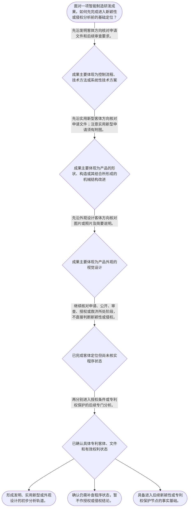

# 整合后的课程完整内容与习题

## 教学模块选择清单

- 当前教学节点：`patent-law-foundation`
- 板块预算：自适应 6/6，总计 9/9

| # | 模块 (block_type) | 类型 | 触发原因 (trigger) | 对应正文段 | 归属 |
|---:|---|:--:|---|---|:--:|
| 1 | `anchor_scenario` | 自适应 | perception=sensing(0.84) / cold_start | 智能产线项目的三类成果｜某智能制造企业的研发负责人准备发布一套协作机器人工作站。团队形成了三项成果：相机根据工件位置… | [A] |
| 2 | `legal_anchor` | 必选 | mandatory | 制度目的与程序法条锚定｜《中华人民共和国专利法》第一条 | [A] |
| 3 | `worked_example` | 自适应 | cold_start(low_confidence) | 机器人工作站成果的分层定位｜某企业研发协作机器人工作站：控制器执行基于视觉坐标的路径校正流程，夹具采用新的双锁紧结构，工… | [A] |
| 4 | `decision_flow` | 自适应 | input=visual(0.81) | 智能制造成果的专利制度定位流程｜面对一项智能制造研发成果，如何先完成进入新颖性或侵权分析前的基础定位？ | [A] |
| 5 | `mnemonic` | 自适应 | understanding=sequential(0.73) | 基础定位四步表｜“客—件—程—题”四步表：先看客体，再核文件，再明程序，最后定问题。 | [A] |
| 6 | `reflect_prompt` | 自适应 | processing=reflective(0.66) | 从研发交付物回看专利定位｜回想你接触过的一项自动化设备或产线改造项目：其中哪些交付物是控制方法、哪些是机械结构、哪些是… | [A] |
| 7 | `assessment` | 必选 | mandatory | 三类测评闭环｜复习三种专利保护客体的基础分类。 | [A] |
| 8 | `knowledge_synthesis` | 必选 | mandatory | 专利法律制度基础框架｜专利权的基本特征：独占性、时间性和地域性说明专利保护并非对技术的永久、全球性控制。 | [A] |
| 9 | `summary_card` | 自适应 | len(knowledge_sub_nodes)=3>=3 | 基础制度速查卡｜专利分析先建立客体与程序坐标，再进入新颖性或侵权的专门判断。 | [A] |

## 教学正文

## I — 法律问题

智能制造企业把机器人关节模组、产线检测装置或设备外观投入研发时，首先要解决的不是立即判断“是否侵权”或“是否具有新颖性”，而是：该技术成果能否进入中国专利制度的保护框架、应识别为哪一类专利客体，以及申请、审查、授权和保护分别由哪些规范衔接。

本节结论先行：**专利法律制度基础是后续新颖性判断和侵权判定的前置坐标系。**新颖性属于授权条件问题；侵权判定属于专利权保护问题。二者都必须以具体专利类型、申请文件和有效权利状态为起点，不能混为同一判断。

## R — 适用规则

### 1. 制度目的：保护与公开并行

《专利法》第一条将保护专利权人合法权益、鼓励发明创造、推动发明创造应用、提高创新能力以及促进科技进步和经济社会发展并列为立法目的。〔RAG: 中华人民共和国专利法.txt — 第一条“保护专利权人的合法权益，鼓励发明创造，推动发明创造的应用”〕

因此，专利制度不是单纯的“技术保密工具”：申请人通过公开技术内容换取法定、有限的专利权保护；社会则能够利用公开信息检索技术、避免重复研发，并在权利期限届满后自由利用相应技术。上述“公开—激励—应用”的关系，是理解新颖性检索与侵权检索为何都要先看公开文件的制度基础。

### 2. 三种保护客体：先辨对象，再谈后续判断

本节教学上下文列明，《专利法》第二条所涉三类专利保护客体为：**发明、实用新型、外观设计**。检索上下文未提供第二条原文，故本节仅据已提供的教学节点确认三分法，不补写该条未检索到的具体定义。

对智能制造成果，可作基础定位：

| 成果表现 | 基础分类方向 | 后续应进入的判断轨道 |
|---|---|---|
| 机器人控制方法、视觉检测方法、设备控制系统 | 发明 | 后续审查授权条件；授权后再看权利要求及实施行为 |
| 夹具、传动结构、机械部件的结构改进 | 实用新型 | 后续审查授权条件；授权后再看权利要求及实施行为 |
| 工业设备外壳、操作面板、机械臂的视觉设计 | 外观设计 | 后续审查授权条件；授权后以图片或照片所示设计作为基础 |

分类不是给技术贴一个营销标签，而是决定申请文件、审查路径和后续保护范围判断的起点。实施细则第四十三条对不同类别申请文件分别列举：发明或实用新型申请涉及请求书、说明书和权利要求书，实用新型还必须包括附图；外观设计申请涉及请求书、图片或照片和简要说明。〔RAG: 中华人民共和国专利法实施细则.txt — 第四十三条列举三类申请的文件并规定明确申请日、给予申请号〕

### 3. 规范体系与程序位置

中国专利制度的基础规范层次可按“法律—实施细则—审查指南”理解：

1. **专利法**规定基本制度、权利与义务及主要法律后果；
2. **专利法实施细则**细化申请、受理、程序和相关操作要求；
3. **专利审查指南**用于指导审查实践中的技术性、程序性判断。

就本节可核验的程序事实而言，国务院专利行政部门收到符合相应类别要求的申请文件后，应明确申请日、给予申请号并通知申请人。〔RAG: 中华人民共和国专利法实施细则.txt — 第四十三条“应当明确申请日、给予申请号，并通知申请人”〕

申请审查并非一次性终局判断。实施细则设有“专利申请的复审与专利权的无效宣告”专章；对驳回决定申请复审时，应提交复审请求书并说明理由，必要时附证据；申请文件修改仅限于消除驳回决定或复审通知书指出的缺陷。〔RAG: 中华人民共和国专利法实施细则.txt — 第六十五条、第六十六条〕这说明专利制度同时包含申请、审查、救济与权利稳定性机制。

### 4. 制度特点：公开与审查不是同一个概念

本节知识点要求掌握“早期公开、延迟审查、初步审查制与实质审查制并存”这一制度特点。理解时应保持两个区分：

- **公开**解决的是技术信息何时进入公众可得范围的问题；
- **审查**解决的是申请是否符合授权条件及程序要求的问题。

因此，看到一件智能制造专利申请已经公开，不能直接推导其必然授权；看到申请尚在审查，也不能直接推导其当然不具有任何法律意义。具体法律效果须回到后续对应节点的规则判断。

## A — 规则适用

以一项“协作机器人末端执行器”为例：研发团队同时形成了用于识别工件位置的控制方法、用于快速换装的机械锁紧结构，以及设备外壳的视觉造型。

第一步，按技术成果的表现形式拆分，而不把整台设备笼统称为“一项专利”：控制方法应沿发明客体方向梳理；机械锁紧结构应沿实用新型客体方向梳理；外壳视觉造型应沿外观设计客体方向梳理。

第二步，确定每一类成果的申请文件与程序入口。对于发明或实用新型，申请文件结构中包含说明书和权利要求书；对于外观设计，图片或照片及简要说明具有基础地位。〔RAG: 中华人民共和国专利法实施细则.txt — 第四十三条对不同类别申请文件的列举〕

第三步，把后续两个学习目标放回正确位置：对控制方法或锁紧结构是否“新”，将来要进入授权条件和在先公开信息的判断；竞争对手设备是否“侵权”，将来要在专利权已存在的前提下，围绕保护范围及被诉实施行为进行判断。此时尚不得用“技术相似”替代法定判断，也不得跳过专利类型和申请文件直接作结论。

## C — 结论

专利法律制度基础提供了后续分析的五个固定起点：**制度目的、三类客体、规范层次、申请审查程序、公开与审查的区分。**对智能制造项目，先把控制方法、机械结构和视觉设计分别定位，再进入新颖性或侵权的专门规则，能够显著降低把授权问题与保护问题混同的风险。

> 常见误区 / 易混淆点
>
> 1. 把“专利申请已公开”误认为“已经授权”。公开与审查、授权是不同程序事实。
> 2. 把“技术方案相似”直接等同于“侵权”。侵权判断须以有效专利权及其保护范围为前提，属于后续节点内容。
> 3. 把机器人设备作为整体只申请一种专利。方法、结构和视觉设计可能分别落入不同客体方向，应先拆分成果。
> 4. 把审查指南视为可脱离专利法和实施细则独立适用的规范。学习顺序应先抓法律制度与程序骨架，再理解审查实践规则。

本节设有测评，请到【习题】区作答。

### 智能产线项目的三类成果（anchor_scenario）

> 某智能制造企业的研发负责人准备发布一套协作机器人工作站。团队形成了三项成果：相机根据工件位置自动调整抓取路径的控制流程、可快速锁紧的末端夹具结构，以及具有独特线条和操作面板布局的设备外壳。负责人希望“申请一个专利”后再参加行业展会。

法务人员提示：三项成果的技术表现并不相同，可能进入不同的专利客体和申请文件轨道；而展会、申请、公开、审查、授权和日后竞争产品的实施，也不是同一个法律问题。

**锚定**：该情境锚定专利客体分类、程序阶段区分以及新颖性与侵权判断不能混同的基础框架。

**先想一想**：面对同一台智能制造设备，为什么不能仅凭“它是一套设备”就断定只需一种专利保护？

### 制度目的与程序法条锚定（legal_anchor）

- **《中华人民共和国专利法》第一条**：专利制度同时服务于保护权利、鼓励创造、促进应用和推动科技及经济发展。
- **《中华人民共和国专利法》第二条**：本节以发明、实用新型和外观设计作为识别专利保护客体的三分框架；第二条原文未在检索材料中提供。
- **《中华人民共和国专利法实施细则》第四十三条**：不同专利类型对应不同基本申请文件，受理后应明确申请日并给予申请号。
- **《中华人民共和国专利法实施细则》第六十五条、第六十六条**：申请被驳回后可依法请求复审；修改申请文件并非无限制，只能针对指出的缺陷。

**为何重要**：学习新颖性和侵权前，必须知道技术成果属于何种客体、处于何种程序状态。否则容易把申请公开、授权和侵权保护混为一谈。

### 机器人工作站成果的分层定位（worked_example）

**案情/例题**：某企业研发协作机器人工作站：控制器执行基于视觉坐标的路径校正流程，夹具采用新的双锁紧结构，工作站外壳采用特定的面板布局和曲面造型。企业拟提交专利申请。需要先完成何种基础制度分析，才能为后续的新颖性检索和侵权风险分析建立正确起点？
**适用规则**：《专利法》第一条；本节教学上下文列明的《专利法》第二条三类保护客体；《专利法实施细则》第四十三条关于不同类别申请文件的规定。
**分步推演**：
1. 先把成果按技术表现拆开：控制流程、机械结构和视觉造型解决的问题及呈现形式不同，不能因它们装配在同一工作站中而当然视为同一客体。 → *先拆分技术成果，而不是先给整机贴单一标签。*
2. 控制流程可沿发明客体方向梳理；夹具结构可沿实用新型客体方向梳理；外壳的视觉造型可沿外观设计客体方向梳理。本节不对个案最终可授权性作结论。 → *按三种客体建立分别分析的轨道。*
3. 不同类别申请对应不同基础文件：发明或实用新型申请涉及说明书和权利要求书，实用新型须有附图；外观设计申请涉及图片或照片及简要说明。 → *客体分类影响申请文件和后续保护基础。*
4. 完成客体和程序定位后，才可分别进入后续节点中的授权条件审查、新颖性分析或专利权保护分析；公开、审查和授权须逐一确认。 → *程序状态是后续法律判断的前置事实。*
**结论**：该项目应优先按控制方法、机械结构和外观造型分别建立专利客体与申请文件分析表；仅凭整机研发完成、对外展示或技术相似，均不能直接得出授权或侵权结论。
**本题要点**：先做“成果拆分—客体定位—文件与程序确认”，再进入新颖性或侵权的专门判断。

### 智能制造成果的专利制度定位流程（decision_flow）

**决策问题**：面对一项智能制造研发成果，如何先完成进入新颖性或侵权分析前的基础定位？



### 基础定位四步表（mnemonic）

**记忆锚**：“客—件—程—题”四步表：先看客体，再核文件，再明程序，最后定问题。
**映射**：
- 客
- 件
- 程
- 题
**何时用**：看到研发成果、专利申请号、公开文本或竞争产品时，先用四步表定位，再进入细化法律分析。

### 从研发交付物回看专利定位（reflect_prompt）

**反思问题**：回想你接触过的一项自动化设备或产线改造项目：其中哪些交付物是控制方法、哪些是机械结构、哪些是视觉外观？它们被对外披露时分别处于什么程序状态？

**关注要点**：不要把整机、软件流程和外壳设计当然视为同一专利客体。；把“已开发”“已展示”“已申请”“已公开”“已授权”分别记录，避免将不同事实状态合并。；区分你要解决的是取得专利权的授权条件问题，还是已有专利权后的保护问题。

**连接**：连接到学习者已有的理工研发经验：把专利分析视为对研发交付物、技术文档和项目时间线的规范化梳理。

### 专利法律制度基础框架（knowledge_synthesis）

**知识框架**：
- 专利权的基本特征：独占性、时间性和地域性说明专利保护并非对技术的永久、全球性控制。
- 规范体系：专利法确立基本制度，实施细则细化程序要求，审查指南服务于审查实践理解。
- 三种保护客体：发明、实用新型、外观设计构成技术成果进入专利制度的基础分类。
- 制度作用：保护、激励、公开与应用共同服务于创新和社会发展。
- 程序与审查特点：应区分申请、公开、审查、授权及复审等不同阶段；本节知识点要求掌握早期公开、延迟审查及初步审查与实质审查并存。
**概念关系**：制度目的解释为何专利保护与技术公开并存。；客体分类决定申请文件的基础结构，并影响后续审查与保护分析的起点。；程序状态是授权条件分析和专利权保护分析之间的重要分界事实。
**必记**：先辨专利客体和程序状态，后谈新颖性或侵权。；申请公开不等于专利授权；技术相似不等于侵权成立。；同一智能制造项目可以包含方法、结构和外观等不同成果，应分别建立分析轨道。

### 基础制度速查卡（summary_card）

**要点卡**：
- **制度目的**：专利制度同时保护合法权益、鼓励创造并推动技术应用。
- **三种客体**：发明、实用新型、外观设计是成果分类的第一步。
- **规范体系**：先看专利法的制度框架，再看实施细则的程序细化，并结合审查指南理解实践。
- **程序状态**：申请、公开、审查、授权和复审是不同事实状态，不能相互替代。
- **后续问题定位**：新颖性属于授权条件轨道，侵权属于专利权保护轨道。
**必背**：客—件—程—题：先看客体，再核文件，再明程序，最后定问题。；申请公开不等于授权；技术相似不等于侵权。；智能制造项目应分别识别方法、结构与外观成果。
**一句话总结**：专利分析先建立客体与程序坐标，再进入新颖性或侵权的专门判断。

### 三类测评闭环（assessment）

**三类覆盖**：backward_review、forward_probe、weakness_probe
**题目**：
- q1：复习三种专利保护客体的基础分类。
- q2：探测下一节点中专利权保护的前提认识。
- q3：在智能制造整机事实中分析成果拆分与客体定位。


## 结构化数据

## expert

```json
"expert_a"
```

## style

```json
"conservative"
```

## knowledge_points

```json
[
  {
    "node_id": "patent-law-foundation",
    "kc_name": "专利制度的基本概念与特征：独占性、时间性、地域性"
  },
  {
    "node_id": "patent-law-foundation",
    "kc_name": "中国专利制度体系：专利法、专利法实施细则、专利审查指南"
  },
  {
    "node_id": "patent-law-foundation",
    "kc_name": "专利保护的三种客体：发明、实用新型、外观设计"
  },
  {
    "node_id": "patent-law-foundation",
    "kc_name": "专利制度的作用：激励创造、技术公开、技术应用与经济发展"
  },
  {
    "node_id": "patent-law-foundation",
    "kc_name": "制度发展与审查特点：早期公开、延迟审查、初步审查与实质审查并存"
  }
]
```

## legal_basis

```json
[
  {
    "article": "《中华人民共和国专利法》第一条",
    "source": "中华人民共和国专利法.txt：第一条“为了保护专利权人的合法权益，鼓励发明创造，推动发明创造的应用，提高创新能力，促进科学技术进步和经济社会发展，制定本法。”"
  },
  {
    "article": "《中华人民共和国专利法》第二条",
    "source": "本节教学上下文：列明专利保护的三种客体为发明、实用新型、外观设计；检索上下文未提供该条原文。"
  },
  {
    "article": "《中华人民共和国专利法实施细则》第四十三条",
    "source": "中华人民共和国专利法实施细则.txt：收到发明、实用新型或外观设计申请文件后，应明确申请日、给予申请号并通知申请人。"
  },
  {
    "article": "《中华人民共和国专利法实施细则》第六十五条、第六十六条",
    "source": "中华人民共和国专利法实施细则.txt：第四章为“专利申请的复审与专利权的无效宣告”；复审请求及申请文件修改的规定。"
  }
]
```

## risks

```json
[
  {
    "risk": "将申请公开、审查合格和专利授权混为同一法律状态，会导致后续新颖性与侵权分析的起点错误。",
    "related_node_id": "patent-law-foundation"
  },
  {
    "risk": "将智能制造设备整体视为单一专利客体，忽略方法、结构和外观可分别进入不同保护轨道。",
    "related_node_id": "patent-law-foundation"
  },
  {
    "risk": "本节未讲授新颖性具体判断或侵权构成要件；不得据本节内容直接得出个案有效性或侵权结论。",
    "related_node_id": "patent-law-foundation"
  }
]
```

## draft_stage

```json
"debate"
```

## irac

```json
{
  "issue": "智能制造研发成果应如何在中国专利制度中完成基础定位，并如何区分后续的新颖性判断与侵权判定所处的法律阶段？",
  "rule": "《专利法》第一条规定制度目的；本节教学上下文列明《专利法》第二条的三类保护客体。实施细则第四十三条规定不同类别申请的基本文件及申请日、申请号处理；实施细则第六十五条、第六十六条规定复审及相应修改边界。",
  "application": "对机器人控制方法、机械锁紧结构和设备外观，应先按其技术表现分别定位为发明、实用新型或外观设计方向，并据此准备相应申请文件。此后，新颖性属于授权条件判断轨道，侵权属于有效专利权保护轨道；申请公开并不当然等于授权。",
  "conclusion": "应先以专利客体、规范层次和程序状态建立分析坐标，再分别学习新颖性和侵权的专门判断规则，不能以技术相似或申请公开直接替代法律结论。"
}
```

## interactive_questions

```json
[
  {
    "qid": "q1",
    "category": "remember",
    "difficulty": "L1",
    "source_tag": "backward_review",
    "kc_node_id": "patent-law-foundation",
    "question": "关于中国专利制度保护客体的基础分类，下列说法正确的是：",
    "answer": "A",
    "options": [
      "A. 本节列明的三类保护客体是发明、实用新型和外观设计。",
      "B. 专利制度只保护产品结构，不涉及方法。",
      "C. 外观设计与发明、实用新型都属于同一种申请文件结构。",
      "D. 智能制造设备只能整体对应一种专利客体。"
    ]
  },
  {
    "qid": "q2",
    "category": "understand",
    "difficulty": "L1",
    "source_tag": "forward_probe",
    "kc_node_id": "patent-rights-protection",
    "question": "仅作为下一节点的探测，关于专利权保护的基本前提，下列说法最恰当的是：",
    "answer": "B",
    "options": [
      "A. 技术方案一经研发完成，即当然取得专利权保护。",
      "B. 判断是否侵犯专利权，通常应先确认存在有效的专利权及其相应保护范围。",
      "C. 专利申请公开必然意味着任何实施行为均构成侵权。",
      "D. 只要产品技术相似，就无需核对权利要求即可认定侵权。"
    ]
  },
  {
    "qid": "q3",
    "category": "analyze",
    "difficulty": "L3",
    "source_tag": "weakness_probe",
    "kc_node_id": "patent-law-foundation",
    "question": "某企业将协作机器人项目中的视觉检测控制流程、快换夹具机械结构和设备外壳造型统称为“一项技术”。依本节制度基础，最稳妥的首要处理是：",
    "answer": "C",
    "options": [
      "A. 直接依据竞争产品是否相似判断是否侵权。",
      "B. 仅因项目已对外展示，即认定全部成果已授权。",
      "C. 先按方法、结构和视觉设计分别识别可能对应的专利客体，再进入各自申请与审查分析。",
      "D. 不区分成果表现形式，统一按外观设计准备申请文件。"
    ]
  }
]
```

## knowledge_synthesis

```json
{
  "node": "patent-law-foundation",
  "coverage": [
    {
      "node_id": "patent-law-foundation"
    }
  ],
  "confusable_pairs": [
    {
      "pair": "申请公开与授权：公开是程序中的信息可得状态，不当然表示已获得专利权。"
    },
    {
      "pair": "新颖性判断与侵权判定：前者属于授权条件轨道，后者以有效专利权及其保护范围为前提。"
    },
    {
      "pair": "整机项目与专利客体：同一设备中的方法、结构和外观可能分别进入不同的专利分析方向。"
    }
  ]
}
```
