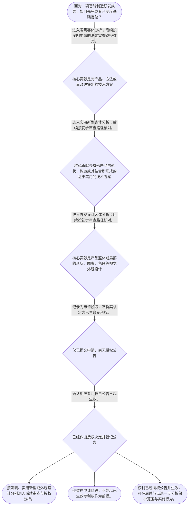

# 整合后的课程完整内容与习题

## 教学模块选择清单

- 当前教学节点：`patent-law-foundation`
- 板块预算：自适应 6/6，总计 9/9

| # | 模块 (block_type) | 类型 | 触发原因 (trigger) | 对应正文段 | 归属 |
|---:|---|:--:|---|---|:--:|
| 1 | `anchor_scenario` | 自适应 | perception=sensing(0.84) / cold_start | 智能产线的三份成果清单｜一家智能制造企业准备为新建的视觉检测产线布局专利。研发工程师拿出三份材料：一份是相机误差自动… | [A] |
| 2 | `legal_anchor` | 必选 | mandatory | 客体与授权生效的法条锚点｜《专利法》第二条 | [A] |
| 3 | `worked_example` | 自适应 | cold_start(low_confidence) | 视觉校准单元的客体分类演示｜某智能工厂的研发团队拟保护“视觉校准单元”的三项成果：甲为相机误差自动生成补偿参数的控制方法… | [A] |
| 4 | `decision_flow` | 自适应 | input=visual(0.81) | 智能制造成果的基础识别流程｜面对一项智能制造研发成果，如何先完成专利制度基础定位？ | [A] |
| 5 | `mnemonic` | 自适应 | understanding=sequential(0.73) | 三客体、三特征、两路径速记表｜分类顺序表：方—构—观；权利特征表：独—时—地；审查路径表：发实、用外初。 | [A] |
| 6 | `reflect_prompt` | 自适应 | processing=reflective(0.66) | 从研发交付物回看制度边界｜回看你熟悉的一项智能制造研发成果：其中哪些内容属于技术方案、产品构造或产品外观，哪些材料只能… | [A] |
| 7 | `assessment` | 必选 | mandatory | 基础定位测评｜复习三类专利客体中外观设计的法定对象。 | [A] |
| 8 | `knowledge_synthesis` | 必选 | mandatory | 专利法律制度基础框架｜专利权基本特征：专利权具有独占性、时间性、地域性；其效力须以依法授权为基础。 | [A] |
| 9 | `summary_card` | 自适应 | len(knowledge_sub_nodes)=3>=3 | 专利制度基础速查卡｜先分清保护什么，再分清怎样审查、何时生效，才有基础进入新颖性与侵权问题。 | [A] |

## 教学正文

## I — 法律问题

在智能制造研发中，一项成果究竟属于哪一种专利保护客体；专利制度为什么既赋予权利人排他性，又要求申请人公开技术；以及发明、实用新型、外观设计在审查与授权环节如何区分？本节先建立制度基础。新颖性判断与侵权判定均以前述基础为前提，但不在本节展开其具体判定规则。

## R — 适用规则

### 1. 三类保护客体

《专利法》所称“发明创造”包括发明、实用新型和外观设计。发明是对产品、方法或者其改进提出的新的技术方案；实用新型是对产品的形状、构造或者其结合提出的、适于实用的新的技术方案；外观设计则是对产品整体或者局部的形状、图案或者其结合，以及色彩与形状、图案结合所作出的、富有美感并适于工业应用的新设计。〔RAG: 中华人民共和国专利法.txt — 第二条：发明创造包括发明、实用新型和外观设计及三者定义〕

因此，分类时应先看成果的核心贡献：解决产品、方法或改进的技术方案，通常进入“发明”的分析；聚焦有形产品的形状、构造或其结合，才可能属于“实用新型”；聚焦产品视觉外观，才进入“外观设计”。同一智能设备可以包含不同层面的成果，但每一项申请仍须按其所主张的对象分别判断。

### 2. 制度体系与运行主体

中国专利制度以专利法为基础规范，专利法实施细则与专利审查指南分别承担程序细化和审查标准细化的功能。国务院专利行政部门负责管理全国专利工作，统一受理、审查专利申请并依法授予专利权；地方管理专利工作的部门负责本行政区域内的专利管理工作。〔RAG: 中华人民共和国专利法.txt — 第三条：国务院专利行政部门统一受理和审查专利申请，依法授予专利权〕

### 3. 专利制度的交换结构与三项特征

专利制度不是对所有技术信息当然给予永久控制，而是以公开申请文件所载技术为基础，通过法定审查和授权形成权利。其制度功能在于用可预期的权利激励研发投入，同时促使技术信息进入公开体系，以服务后续技术应用和经济发展。

专利权的典型特征可按“三限”理解：

- **独占性**：经依法授权后，权利人可在法定范围内排除他人未经许可的特定利用；其具体效力与侵权判断须在后续“专利权保护”节点按权利要求和法定行为类型分析。
- **时间性**：专利权并非永久存在。发明、实用新型、外观设计的期限分别为二十年、十年、十五年，均自申请日起计算。〔RAG: 中华人民共和国专利法.txt — 第四十二条：三类专利权期限及均自申请日起计算〕
- **地域性**：专利权依各法域的授权和法律规定发生效力；在中国取得的专利权不能当然替代其他国家或地区的专利权。

### 4. 公开、审查与授权的制度衔接

发明专利申请经实质审查，未发现驳回理由的，作出授予专利权决定并登记公告，专利权自公告之日起生效。〔RAG: 中华人民共和国专利法.txt — 第三十九条：发明专利经实质审查没有发现驳回理由即授权公告〕实用新型和外观设计申请经初步审查未发现驳回理由的，作出授权决定并登记公告，专利权同样自公告之日起生效。〔RAG: 中华人民共和国专利法.txt — 第四十条：实用新型和外观设计经初步审查没有发现驳回理由即授权公告〕

由此可见，发明与实用新型、外观设计在法定审查环节存在“实质审查”与“初步审查”的区分。关于中国专利制度发展历程中“早期公开、延迟审查”的具体沿革，本次检索上下文未提供直接史料依据；本节仅据现行法条确认公开、审查和授权之间的法定衔接，不对历史细节作扩展断言。

### 5. 与后续新颖性学习的连接

发明和实用新型获得授权须具备新颖性、创造性和实用性；其中现有技术是申请日以前在国内外为公众所知的技术。〔RAG: 中华人民共和国专利法.txt — 第二十二条：发明和实用新型应具备新颖性、创造性和实用性；现有技术的定义〕这说明后续学习新颖性时，必须先确定申请对象属于何种客体、申请处于何种制度程序，再进入申请日、公开和在先申请等时间判断。

## A — 规则适用

以一个用于数控产线的“视觉校准单元”为例：研发团队提出了三项成果。第一项是根据相机误差自动生成补偿参数的控制方法；它针对方法提出技术方案，应优先按发明客体理解。第二项是带有特定定位槽和可拆装支架的传感器外壳；若创新点在有形产品的形状、构造或其结合，可进入实用新型的分析。第三项是操作面板上形成的特定图案、轮廓与色彩组合；若其创新点在产品视觉外观，则应按外观设计分析。

分类的法律意义在于，不能仅因三个成果服务同一产线，就将它们混为同一类专利。分类会影响申请文件组织、审查路径以及后续保护范围的识别。研发管理上也应把“技术方案”“产品构造”“视觉设计”分别留存研发记录和申请材料。

对于该团队关心的“是否已受保护”，还须区分申请、审查、授权三个阶段：提交申请不等于已经取得专利权；法条明确规定三类专利权均自授权公告之日起生效。〔RAG: 中华人民共和国专利法.txt — 第三十九条、第四十条：专利权自公告之日起生效〕因此，日后进行侵权风险排查时，首先要核对目标权利是否已经授权并公告；本节只作制度定位，不据此直接作侵权结论。

## C — 结论

智能制造成果进入专利制度的第一步，不是直接讨论“新不新”或“侵不侵权”，而是先完成三项基础识别：确定保护客体，明确制度依据与主管机关，区分申请审查和授权生效阶段。发明、实用新型、外观设计的法定定义及审查路径不同；专利权具有独占性、时间性和地域性，且其效力以依法授权为前提。

> 常见误区 / 易混淆点
>
> 1. 把“提交了专利申请”误认为“已经拥有可主张的专利权”。申请、授权公告和权利生效不是同一时间点。
> 2. 把“带有软件或算法的设备”当然归入实用新型。应看主张的核心是方法或技术改进，还是产品形状、构造或其结合。
> 3. 把发明、实用新型和外观设计理解为仅名称不同。三者的保护客体和审查路径均有法定差异。
> 4. 将授权审查程序与新颖性、优先权、抵触申请的具体判断规则混为一谈。后者属于后续节点的专项问题。

本节设有测评，请到【习题】区作答。

### 智能产线的三份成果清单（anchor_scenario）

> 一家智能制造企业准备为新建的视觉检测产线布局专利。研发工程师拿出三份材料：一份是相机误差自动补偿的控制方法；一份是带有新型卡扣和定位槽的传感器夹具；一份是操作面板的局部图案、轮廓与色彩方案。团队认为它们都很“新”，希望一次性按同一种专利提交。

法务人员提示：三份成果服务于同一条产线，并不意味着保护客体相同；更不能把提交申请直接当作已经取得可排他的专利权。团队必须先完成客体分类和程序定位，才能为后续新颖性与侵权分析建立共同语言。

**锚定**：该情境锚定三类专利客体、专利权特征以及申请与授权生效相区分的基础框架。

**先想一想**：若只能先核对一个事实以决定三份材料的申请类型，你会核对成果解决的是技术方案、产品构造，还是产品视觉外观？

### 客体与授权生效的法条锚点（legal_anchor）

- **《专利法》第二条**：发明创造包括发明、实用新型和外观设计；三者分别对应技术方案、产品形状或构造的技术方案、产品外观的新设计。
- **《专利法》第三十九条**：发明专利经实质审查未发现驳回理由后授予专利权，权利自登记公告之日起生效。
- **《专利法》第四十条**：实用新型和外观设计经初步审查未发现驳回理由后授予专利权，权利同样自登记公告之日起生效。

**为何重要**：客体决定分析的入口，授权公告决定权利生效的法定节点。后续讨论新颖性或侵权前，必须先把这两个基础锚点固定。

### 视觉校准单元的客体分类演示（worked_example）

**案情/例题**：某智能工厂的研发团队拟保护“视觉校准单元”的三项成果：甲为相机误差自动生成补偿参数的控制方法；乙为具有定位槽与可拆装支架的传感器外壳；丙为操作面板局部的轮廓、图案和色彩组合。待判定的问题是：三项成果分别应从何种专利客体开始分析，以及是否能因提交申请而当然主张已生效专利权。
**适用规则**：《专利法》第二条关于发明、实用新型、外观设计的定义；第三十九条、第四十条关于授权公告及权利生效。
**分步推演**：
1. 甲的核心贡献是对控制方法提出技术方案，而发明的法定定义包含对方法或者其改进所提出的新的技术方案。 → *甲应优先按发明客体分析。*
2. 乙的核心贡献集中于有形产品外壳的定位槽和支架构造；实用新型的法定对象是产品的形状、构造或者其结合所提出的适于实用的新的技术方案。 → *乙可优先按实用新型客体分析。*
3. 丙的核心贡献是产品局部的轮廓、图案和色彩组合，属于产品视觉外观层面的设计。 → *丙应优先按外观设计客体分析。*
4. 三项申请即使已提交，也仍需经过相应法定审查；发明与实用新型、外观设计分别适用实质审查和初步审查的授权路径，且权利均自授权公告之日起生效。 → *提交申请不等于取得已生效专利权。*
**结论**：同一设备中的方法、构造和视觉外观可以分别进入发明、实用新型、外观设计的分析；应待相应授权公告后，才能确认专利权已生效。
**本题要点**：先按成果核心贡献分类，再核对审查路径和授权公告时点，是专利基础分析的固定顺序。

### 智能制造成果的基础识别流程（decision_flow）

**决策问题**：面对一项智能制造研发成果，如何先完成专利制度基础定位？



### 三客体、三特征、两路径速记表（mnemonic）

**记忆锚**：分类顺序表：方—构—观；权利特征表：独—时—地；审查路径表：发实、用外初。
**映射**：
- 方
- 构
- 观
- 独—时—地
- 发实、用外初
**何时用**：看到一项研发成果、申请状态或授权文件时，先用该表依次完成客体、权利特征和审查路径的基础核对。

### 从研发交付物回看制度边界（reflect_prompt）

**反思问题**：回看你熟悉的一项智能制造研发成果：其中哪些内容属于技术方案、产品构造或产品外观，哪些材料只能证明研发完成而不能证明专利权已经生效？

**关注要点**：成果的核心贡献是否对应《专利法》第二条中的一种法定客体。；研发记录、申请受理材料与授权公告文件分别证明什么，不能相互替代。；同一设备上的不同创新点是否需要分别组织专利布局。

**连接**：连接到学习者已有的理工研发经验，并为下一节点中专利权效力、保护范围和侵权分析建立事实分类基础。

### 专利法律制度基础框架（knowledge_synthesis）

**知识框架**：
- 专利权基本特征：专利权具有独占性、时间性、地域性；其效力须以依法授权为基础。
- 制度规范体系：专利法提供基本规则，实施细则细化程序，专利审查指南细化审查标准；国务院专利行政部门统一受理和审查申请。
- 三类保护客体：发明保护产品、方法或改进的技术方案；实用新型保护产品形状、构造或其结合的技术方案；外观设计保护产品视觉外观的新设计。
- 制度功能：通过授权激励研发，同时通过申请公开与制度化审查促进技术信息进入可利用的知识体系。
- 运行路径：发明经实质审查，实用新型和外观设计经初步审查；三类专利权均自授权公告日起生效。
**概念关系**：客体分类在前：先确定成果属于技术方案、产品构造还是产品外观。；程序定位随后：再依据不同客体识别实质审查或初步审查路径。；权利状态收口：只有授权公告后才进入已生效专利权的后续保护与侵权分析。；三性连接后续：发明和实用新型的授权条件包含新颖性、创造性和实用性，但本节只建立其制度位置。
**必记**：同一智能制造设备中的控制方法、产品构造和视觉外观，不能仅因服务同一产品而当然归为同一专利类型。；申请日、授权决定日与权利生效日应严格区分；就权利生效而言，法条规定的节点是授权公告。；后续新颖性判断以客体和程序定位为前提，但新颖性、优先权和抵触申请的具体规则须在后续节点专项分析。

### 专利制度基础速查卡（summary_card）

**要点卡**：
- **三类客体**：发明看技术方案，实用新型看产品形状或构造，外观设计看产品视觉外观。
- **制度体系**：专利法定基本规则，实施细则和审查指南细化程序与审查标准。
- **三项特征**：专利权具有独占性、时间性和地域性，不能理解为无限期或跨国当然有效。
- **审查路径**：发明经实质审查；实用新型和外观设计经初步审查。
- **生效时点**：三类专利权均自授权决定登记和公告之日起生效。
**必背**：《专利法》第二条关于发明、实用新型、外观设计的对象区分。；发明适用实质审查，实用新型和外观设计适用初步审查。；申请不等于授权；专利权自授权公告日起生效。
**一句话总结**：先分清保护什么，再分清怎样审查、何时生效，才有基础进入新颖性与侵权问题。

### 基础定位测评（assessment）

**三类覆盖**：backward_review、forward_probe、weakness_probe
**题目**：
- q_foundation_review_l1：复习三类专利客体中外观设计的法定对象。
- q_protection_probe_l1：仅探测下一节点中发明专利权的生效时点。
- q_foundation_weakness_l3：综合智能制造成果分类与审查路径的易混淆判断。


## 结构化数据

## expert

```json
"expert_a"
```

## style

```json
"conservative"
```

## knowledge_points

```json
[
  {
    "node_id": "patent-law-foundation",
    "kc_name": "专利制度的基本概念与特征：独占性、时间性、地域性"
  },
  {
    "node_id": "patent-law-foundation",
    "kc_name": "中国专利制度体系：专利法、专利法实施细则、专利审查指南"
  },
  {
    "node_id": "patent-law-foundation",
    "kc_name": "专利保护的三种客体：发明、实用新型、外观设计"
  },
  {
    "node_id": "patent-law-foundation",
    "kc_name": "专利制度的作用：激励创造、技术公开、技术应用与经济发展"
  },
  {
    "node_id": "patent-law-foundation",
    "kc_name": "制度运行特点：公开、审查与授权的衔接；初步审查和实质审查并存"
  }
]
```

## legal_basis

```json
[
  {
    "article": "《中华人民共和国专利法》第二条",
    "source": "中华人民共和国专利法.txt：第二条"
  },
  {
    "article": "《中华人民共和国专利法》第三条",
    "source": "中华人民共和国专利法.txt：第三条"
  },
  {
    "article": "《中华人民共和国专利法》第三十九条",
    "source": "中华人民共和国专利法.txt：第三十九条"
  },
  {
    "article": "《中华人民共和国专利法》第四十条",
    "source": "中华人民共和国专利法.txt：第四十条"
  },
  {
    "article": "《中华人民共和国专利法》第二十二条",
    "source": "中华人民共和国专利法.txt：第二十二条"
  }
]
```

## risks

```json
[
  {
    "risk": "将申请受理、授权决定和专利权生效混同，可能导致对技术合作或风险排查时点作出错误判断。",
    "related_node_id": "patent-law-foundation"
  },
  {
    "risk": "未按技术方案、产品构造和产品外观区分客体，可能造成申请类型与研发成果核心不匹配。",
    "related_node_id": "patent-law-foundation"
  },
  {
    "risk": "将新颖性、优先权或抵触申请的专项判断提前混入本节基础框架，可能模糊制度层级。",
    "related_node_id": "patent-law-foundation"
  }
]
```

## draft_stage

```json
"debate"
```

## irac

```json
{
  "issue": "智能制造研发成果应如何识别为发明、实用新型或外观设计，并如何理解中国专利制度中申请、审查、授权与权利生效的基础关系？",
  "rule": "《专利法》第二条界定三类发明创造及其对象；第三条规定全国专利工作的统一受理和审查主体；第三十九条、第四十条分别规定发明经实质审查以及实用新型、外观设计经初步审查后的授权公告与权利生效；第二十二条规定发明和实用新型的授权条件。",
  "application": "对智能制造视觉校准单元，应将控制方法、产品构造和产品视觉外观分别与第二条中的发明、实用新型、外观设计定义对照；再依据第三十九条和第四十条区分不同申请的审查路径，并确认权利均以授权公告为生效节点。",
  "conclusion": "应先完成客体分类和程序定位，再进入新颖性或侵权等后续专项分析；申请本身不等于已生效的专利权。"
}
```

## interactive_questions

```json
[
  {
    "qid": "q_foundation_review_l1",
    "category": "remember",
    "difficulty": "L1",
    "source_tag": "backward_review",
    "kc_node_id": "patent-law-foundation",
    "question": "根据《专利法》第二条，下列哪一项属于外观设计所保护的新设计？",
    "answer": "C",
    "options": [
      "A. 对机器人控制方法提出的新的技术方案",
      "B. 对传感器壳体内部连接结构提出的新的技术方案",
      "C. 对产品局部图案与形状结合所作出的富有美感并适于工业应用的新设计",
      "D. 对生产线排班规则提出的管理方案"
    ]
  },
  {
    "qid": "q_protection_probe_l1",
    "category": "understand",
    "difficulty": "L1",
    "source_tag": "forward_probe",
    "kc_node_id": "patent-rights-protection",
    "question": "仅作下一节点的基础探测：根据已检索到的现行法条，发明专利权在何时生效？",
    "answer": "B",
    "options": [
      "A. 专利申请文件提交之日",
      "B. 授予专利权决定登记和公告之日",
      "C. 完成实质审查申请之日",
      "D. 研发成果首次完成之日"
    ]
  },
  {
    "qid": "q_foundation_weakness_l3",
    "category": "analyze",
    "difficulty": "L3",
    "source_tag": "weakness_probe",
    "kc_node_id": "patent-law-foundation",
    "question": "某企业为同一智能制造设备形成三项成果：一项机器人路径优化方法、一项具有新型卡扣构造的夹具、一项具有独特图案和色彩组合的操作面板。关于申请类型与审查路径的判断，哪一项最符合本节规则？",
    "answer": "D",
    "options": [
      "A. 三项均只能申请发明专利，因为均服务于同一设备",
      "B. 路径优化方法和操作面板均属于实用新型，夹具属于外观设计",
      "C. 三项均经初步审查且未发现驳回理由后授权",
      "D. 路径优化方法可按发明分析，夹具可按实用新型分析，操作面板可按外观设计分析；发明与其余两类在法定审查路径上存在实质审查和初步审查的区分"
    ]
  }
]
```

## knowledge_synthesis

```json
{
  "node": "patent-law-foundation",
  "coverage": [
    {
      "node_id": "patent-law-foundation"
    },
    {
      "node_id": "patent-law-foundation"
    },
    {
      "node_id": "patent-law-foundation"
    },
    {
      "node_id": "patent-law-foundation"
    },
    {
      "node_id": "patent-law-foundation"
    }
  ],
  "confusable_pairs": [
    {
      "pair": "发明与实用新型：前者可涉及产品、方法或改进的技术方案；后者限于产品形状、构造或其结合的适于实用技术方案。"
    },
    {
      "pair": "实用新型与外观设计：前者保护技术性构造，后者保护产品视觉外观的新设计。"
    },
    {
      "pair": "提交申请与专利权生效：提交启动申请程序；授权决定登记和公告才是法定生效节点。"
    },
    {
      "pair": "实质审查与初步审查：现行法条对发明与实用新型、外观设计规定不同的授权审查路径。"
    }
  ]
}
```
