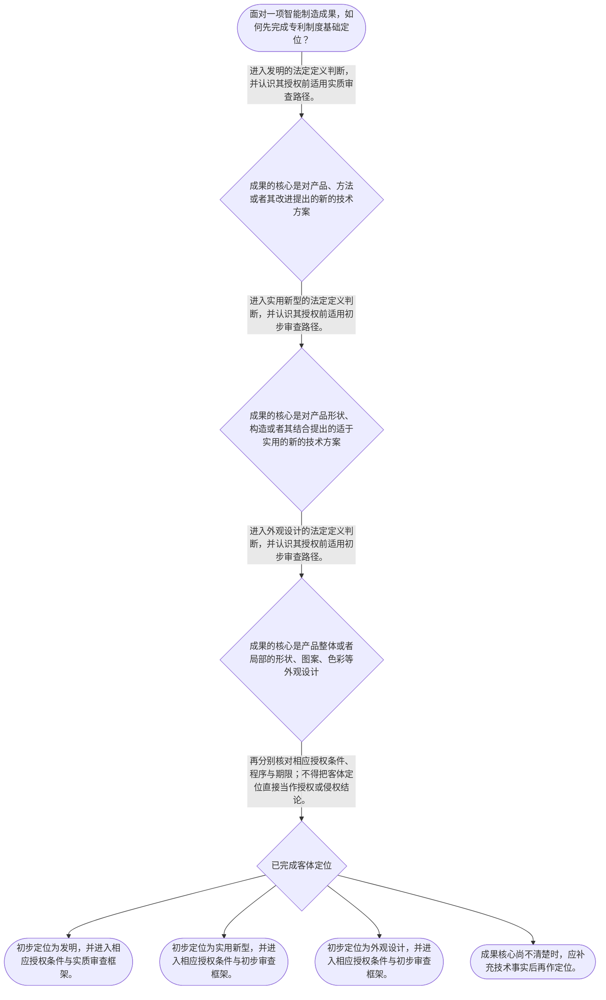

# 整合后的课程完整内容与习题

## 教学模块选择清单

- 当前教学节点：`patent-law-foundation`
- 板块预算：自适应 6/6，总计 9/9

| # | 模块 (block_type) | 类型 | 触发原因 (trigger) | 对应正文段 | 归属 |
|---:|---|:--:|---|---|:--:|
| 1 | `anchor_scenario` | 自适应 | perception=sensing(0.84) / cold_start | 智能制造成果的三种专利定位｜某智能制造企业的研发小组在一周内完成三项成果：工程师甲改进了协作机器人的振动补偿控制方法；工… | [A] |
| 2 | `legal_anchor` | 必选 | mandatory | 专利制度基础的法条锚点｜《专利法》第二条 | [A] |
| 3 | `worked_example` | 自适应 | cold_start(low_confidence) | 智能产线三项成果的制度定位演示｜某企业研发智能装配线时形成三项成果：其一，利用实时振动数据调整机械臂轨迹的方法；其二，具有双… | [A] |
| 4 | `decision_flow` | 自适应 | input=visual(0.81) | 专利制度基础定位流程｜面对一项智能制造成果，如何先完成专利制度基础定位？ | [A] |
| 5 | `mnemonic` | 自适应 | understanding=sequential(0.73) | 制度定位四步表｜“客—权—程—期”四步表：先看客体，再看权利特征，再分审查程序，最后核对期限。 | [A] |
| 6 | `reflect_prompt` | 自适应 | processing=reflective(0.66) | 从研发经验回看制度边界｜回顾你接触过的一项智能制造研发成果：其真正的创新核心是方法、产品结构还是产品外观？如果团队只… | [A] |
| 7 | `assessment` | 必选 | mandatory | 三类基础测评｜复习发明、实用新型和外观设计中实用新型的法定对象。 | [A] |
| 8 | `knowledge_synthesis` | 必选 | mandatory | 专利法律制度基础框架｜专利权基本特征：专利权是法定权利，具有独占性、时间性和地域性。 | [A] |
| 9 | `summary_card` | 自适应 | len(knowledge_sub_nodes)=3>=3 | 专利制度基础速查卡｜先按“客—权—程—期”完成制度定位，再进入新颖性和侵权等后续专题。 | [A] |

## 教学正文

## I — 法律问题

智能制造研发团队面对一项机器人关节模组、产线检测方法或设备外壳改进时，首先不是直接判断“是否侵权”或“是否具有新颖性”，而是应先定位：该成果属于何种专利保护客体、将处于何种制度与审查框架之中，以及专利权为何具有独占性、时间性和地域性。本节仅建立这一制度基础；新颖性的具体对比方法和侵权比对规则属于后续节点。

## R — 适用规则

1. 专利制度以法律授权形成法定权利。其基本特征是：权利具有独占性；保护并非永久，具有时间性；效力以法定地域为边界，具有地域性。关于具体权利效力和保护范围，本节不作展开。

2. 中国专利制度以《专利法》为基本法律规范，并由《专利法实施细则》和《专利审查指南》等共同构成适用体系。本次检索上下文未提供实施细则及审查指南的原文，因此本节仅说明其制度位置，不对其具体条款作延伸解释。

3. 《专利法》所称发明创造包括发明、实用新型和外观设计。发明是对产品、方法或者其改进提出的新的技术方案；实用新型是对产品形状、构造或者其结合提出的适于实用的新的技术方案；外观设计是对产品整体或者局部的形状、图案或者其结合，以及色彩与形状、图案的结合所作出的富有美感并适于工业应用的新设计。〔RAG: 中华人民共和国专利法.txt — 第二条：发明创造是指发明、实用新型和外观设计〕

4. 对发明和实用新型，法律规定授权条件包括新颖性、创造性和实用性；其中现有技术是申请日前在国内外为公众所知的技术。〔RAG: 中华人民共和国专利法.txt — 第二十二条：授予专利权的发明和实用新型，应当具备新颖性、创造性和实用性〕 这说明专利制度以技术公开为交换条件：申请人寻求法定保护，社会获得可利用的技术信息，从而服务技术应用和经济发展。后一层立法功能是本节的制度性理解，不替代具体授权要件审查。

5. 程序上，发明专利在实质审查后未发现驳回理由的，作出授权决定并登记公告；实用新型和外观设计经初步审查未发现驳回理由的，作出授权决定并登记公告。〔RAG: 中华人民共和国专利法.txt — 第三十九条：发明专利申请经实质审查没有发现驳回理由的；第四十条：实用新型和外观设计专利申请经初步审查没有发现驳回理由的〕 这体现了初步审查制与实质审查制并存。学习材料所概括的“早期公开、延迟审查”是理解中国发明专利程序结构的线索；本次检索未提供该线索对应的完整条文原文，不能据此补充具体期限或程序细节。

## A — 规则适用

以一个经匿名化处理的智能制造研发场景作制度演示：某团队形成三项成果——用于协作机器人的振动补偿控制方法、带有特殊安装结构的传感器支架、以及工控终端的面板外观。第一项若属于对方法或改进提出的技术方案，应从“发明”方向定位；第二项若核心在产品形状、构造或其结合，应从“实用新型”方向定位；第三项若核心在产品整体或局部的视觉设计，应从“外观设计”方向定位。该场景为教学化事实，并非检索上下文已核验的真实裁判案例。

定位客体后，研发团队还应将成果放入制度流程：发明专利与实用新型、外观设计的审查路径并不相同，不能因产品属于智能制造设备就当然推定其经过相同深度的审查。对发明和实用新型，后续还须接受新颖性、创造性、实用性等授权条件的检验；但本节不把“新颖性”误写为“由多篇文献拼接得出”的判断，也不把尚未学习的抵触申请、创造性组合评价或答复修改规则当作本节结论。

研发管理上，制度的独占性提示团队应识别可保护成果；时间性提示团队应重视申请与权利存续的时间安排；地域性提示团队不能将一国的授权当然等同于全球保护。发明、实用新型和外观设计的权利期限分别为二十年、十年和十五年，均自申请日起计算。〔RAG: 中华人民共和国专利法.txt — 第四十二条：发明二十年、实用新型十年、外观设计十五年，均自申请日起计算〕 该期限规则在本节用于说明“时间性”，具体权利保护与侵权救济留待下一节点探测和后续学习。

## C — 结论

专利法律制度基础的判断顺序是：先识别成果属于发明、实用新型还是外观设计；再理解专利权是法定、有限期且有地域边界的权利；随后根据相应程序认识发明与实用新型、外观设计的审查差异。只有先完成这一定位，后续讨论新颖性和侵权判定才不会把授权条件、权利范围和救济问题混为一谈。

> 常见误区 / 易混淆点
>
> - 误区一：把“技术含量高”直接等同于“应申请发明专利”。正确做法是先看成果是方法、产品的形状构造，还是产品外观，再按法定定义定位。
> - 误区二：把实用新型、外观设计的初步审查与发明的实质审查视为完全相同。法律文本明确区分两类授权前审查路径。
> - 误区三：把专利权理解成永久、全球自动生效的权利。专利权有期限，也受法定地域边界限制。
> - 误区四：在未进入新颖性、创造性和审查答复专题前，将抵触申请、文献组合或修改限制混作本节的客体识别规则。

本节设有测评，请到【习题】区作答。

### 智能制造成果的三种专利定位（anchor_scenario）

> 某智能制造企业的研发小组在一周内完成三项成果：工程师甲改进了协作机器人的振动补偿控制方法；工程师乙设计了带特殊卡扣结构的机器视觉传感器支架；设计师丙调整了工控终端面板的局部图案和色彩。团队准备参展并希望取得专利保护，却有人笼统地说“三项都申请发明专利”。

真正需要先解决的冲突并非技术是否先进，而是三项成果分别落在方法技术方案、产品形状构造技术方案还是产品外观设计之中；不同定位将连接不同的审查路径和权利期限。该情境为教学化场景，不是经检索核验的真实案例。

**锚定**：该情境锚定“先识别保护客体，再进入专利制度与审查路径”的基础判断顺序。

**先想一想**：面对同一设备上的控制方法、结构改进和面板外观，应当依据哪一种成果特征来区分专利类型？

### 专利制度基础的法条锚点（legal_anchor）

- **《专利法》第二条**：专利法定保护的发明创造只有发明、实用新型和外观设计，三者的对象定义不同。
- **《专利法》第二十二条**：发明和实用新型要满足新颖性、创造性和实用性，现有技术以申请日前公众已知的技术为时间边界。
- **《专利法》第三十九条、第四十条、第四十二条**：发明适用实质审查授权路径，实用新型和外观设计适用初步审查授权路径；三类权利期限也不同。

**为何重要**：法条锚点防止将技术成果、授权条件、审查程序和权利期限混为一谈。后续学习新颖性和侵权时，必须以此为制度起点。

### 智能产线三项成果的制度定位演示（worked_example）

**案情/例题**：某企业研发智能装配线时形成三项成果：其一，利用实时振动数据调整机械臂轨迹的方法；其二，具有双层定位槽和锁止件的夹具；其三，控制柜局部面板的图案与色彩方案。企业希望知道三项成果应如何在专利制度中进行初步定位，以及是否可以据此直接断言必然获得授权。
**适用规则**：《专利法》第二条关于发明、实用新型和外观设计的定义；《专利法》第二十二条关于发明和实用新型的授权条件。
**分步推演**：
1. 先看第一项成果的核心：它是利用数据调整机械臂轨迹的方法，属于对方法提出的技术方案这一类事实特征。 → *第一项应从发明的法定定义方向定位。*
2. 再看第二项成果的核心：夹具是有形产品，创新点在双层定位槽和锁止件的形状、构造及其结合。 → *第二项应从实用新型的法定定义方向定位。*
3. 第三项的核心在控制柜面板局部的图案与色彩，而非新的控制方法或产品构造。 → *第三项应从外观设计的法定定义方向定位。*
4. 客体定位不等于当然授权。发明和实用新型仍须满足第二十二条所规定的新颖性、创造性和实用性；外观设计另有法定授权条件。 → *先分类型，再进入相应授权条件与程序，不能以技术名称代替法律判断。*
**结论**：该企业的三项成果可分别初步定位为发明、实用新型和外观设计，但是否授权仍须进入各自法定条件与审查程序，不能仅凭成果属于智能制造领域即作肯定判断。
**本题要点**：训练“按成果核心特征定位保护客体，并将客体定位与授权结论分开”的能力。

### 专利制度基础定位流程（decision_flow）

**决策问题**：面对一项智能制造成果，如何先完成专利制度基础定位？



### 制度定位四步表（mnemonic）

**记忆锚**：“客—权—程—期”四步表：先看客体，再看权利特征，再分审查程序，最后核对期限。
**映射**：
- 客
- 权
- 程
- 期
**何时用**：看到智能制造研发成果、专利类型或权利期限时，先按“客—权—程—期”逐项定位，再进入后续专题。

### 从研发经验回看制度边界（reflect_prompt）

**反思问题**：回顾你接触过的一项智能制造研发成果：其真正的创新核心是方法、产品结构还是产品外观？如果团队只说“技术很新”，还缺少哪些法律定位信息？

**关注要点**：区分工程上的创新感受与专利法上的保护客体定义。；分别识别独占性、时间性和地域性对研发、公开与市场布局的影响。；注意客体定位、授权条件、审查程序和侵权比对是不同层次的问题。

**连接**：连接到学习者已有的理工研发经验，并为下一节点“专利权保护”的权利效力与期限探测作准备。

### 专利法律制度基础框架（knowledge_synthesis）

**知识框架**：
- 专利权基本特征：专利权是法定权利，具有独占性、时间性和地域性。
- 制度规范体系：以专利法为基础，并由实施细则、审查指南等共同构成适用体系；本节对后两者仅作制度定位。
- 保护客体：发明保护产品、方法或其改进的技术方案；实用新型保护产品形状、构造或其结合的技术方案；外观设计保护产品外观的新设计。
- 制度功能：以法定保护激励发明创造，并通过技术信息公开促进技术应用与经济发展。
- 程序结构：发明适用实质审查授权路径，实用新型和外观设计适用初步审查授权路径，体现并存的审查制度。
**概念关系**：保护客体决定后续应进入的相应授权条件和程序框架。；权利的独占性、时间性、地域性共同限定专利制度保护的边界。；制度功能解释专利保护与技术公开之间的关系，但不替代具体授权要件判断。
**必记**：专利类型应按成果的法律对象定位，不应按“技术含量高低”或行业名称定位。；专利权并非永久或全球自动有效，时间性和地域性是基础边界。；发明与实用新型、外观设计的授权前审查路径不同；客体定位不等于当然授权。

### 专利制度基础速查卡（summary_card）

**要点卡**：
- **独占性、时间性、地域性**：专利权是有排他效力、有限存续期且受法定地域边界约束的权利。
- **制度规范体系**：专利法居于基础位置，实施细则和审查指南等共同支撑制度适用。
- **三种保护客体**：方法或产品技术方案看发明，产品形状构造看实用新型，产品外观新设计看外观设计。
- **制度功能**：专利制度以法定保护激励创造，并以技术公开促进技术应用和经济发展。
- **审查路径**：发明经实质审查，实用新型和外观设计经初步审查后在法定条件下授权。
**必背**：《专利法》第二条规定的三类发明创造及其基本对象。；发明二十年、实用新型十年、外观设计十五年，均自申请日起计算。；客体定位、授权条件、审查程序和侵权判定是四个不能混同的层次。
**一句话总结**：先按“客—权—程—期”完成制度定位，再进入新颖性和侵权等后续专题。

### 三类基础测评（assessment）

**三类覆盖**：backward_review、forward_probe、weakness_probe
**题目**：
- q_foundation_review_l1：复习发明、实用新型和外观设计中实用新型的法定对象。
- q_rights_forward_l1：仅探测下一节点中的专利权期限基础规则。
- q_foundation_weakness_l3：辨析发明与外观设计在授权前审查路径上的差异。


## 结构化数据

## expert

```json
"expert_a"
```

## style

```json
"conservative"
```

## knowledge_points

```json
[
  {
    "node_id": "patent-law-foundation",
    "kc_name": "专利制度的基本概念与特征：独占性、时间性、地域性"
  },
  {
    "node_id": "patent-law-foundation",
    "kc_name": "中国专利制度体系：专利法、专利法实施细则、专利审查指南"
  },
  {
    "node_id": "patent-law-foundation",
    "kc_name": "专利保护的三种客体：发明、实用新型、外观设计"
  },
  {
    "node_id": "patent-law-foundation",
    "kc_name": "专利制度的作用：激励发明创造、促进技术公开、推动技术应用和经济发展"
  },
  {
    "node_id": "patent-law-foundation",
    "kc_name": "中国专利制度发展历程与特点：早期公开延迟审查、初步审查制与实质审查制并存"
  }
]
```

## legal_basis

```json
[
  {
    "article": "《中华人民共和国专利法》第二条",
    "source": "中华人民共和国专利法.txt：第二条"
  },
  {
    "article": "《中华人民共和国专利法》第二十二条",
    "source": "中华人民共和国专利法.txt：第二十二条"
  },
  {
    "article": "《中华人民共和国专利法》第三十三条",
    "source": "中华人民共和国专利法.txt：第三十三条"
  },
  {
    "article": "《中华人民共和国专利法》第三十九条、第四十条、第四十二条",
    "source": "中华人民共和国专利法.txt：第三十九条、第四十条、第四十二条"
  }
]
```

## risks

```json
[
  {
    "risk": "将智能制造技术方案的技术复杂程度误当作专利类型的唯一标准，忽略产品、方法、形状构造和外观之间的法定区分。",
    "related_node_id": "patent-law-foundation"
  },
  {
    "risk": "混同发明的实质审查与实用新型、外观设计的初步审查，进而对授权程序作出过度推断。",
    "related_node_id": "patent-law-foundation"
  },
  {
    "risk": "在基础节点提前混用新颖性、创造性、抵触申请和答复修改等后续专题规则，造成概念边界不清。",
    "related_node_id": "patent-law-foundation"
  }
]
```

## draft_stage

```json
"debate"
```

## irac

```json
{
  "issue": "智能制造成果进入专利体系前，应如何识别专利保护客体、理解专利权基本特征，并区分发明与实用新型、外观设计的制度与审查路径。",
  "rule": "《专利法》第二条将发明创造分为发明、实用新型和外观设计，并分别界定其对象；第二十二条规定发明和实用新型的授权条件；第三十九条、第四十条分别规定发明的实质审查授权路径以及实用新型、外观设计的初步审查授权路径；第四十二条规定三类专利权期限。",
  "application": "对机器人控制方法、传感器支架结构和工控终端面板外观，应分别按方法技术方案、产品形状构造技术方案和产品外观设计的法定定义初步定位；其后根据专利类型理解不同审查路径，并在时间性和地域性边界内安排保护策略。",
  "conclusion": "专利制度基础的核心是先做客体定位，再理解法定权利的独占性、时间性和地域性以及相应审查路径；新颖性具体判断和侵权比对应在后续专题中分别处理。"
}
```

## interactive_questions

```json
[
  {
    "qid": "q_foundation_review_l1",
    "category": "remember",
    "difficulty": "L1",
    "source_tag": "backward_review",
    "kc_node_id": "patent-law-foundation",
    "question": "依据《专利法》第二条，下列哪一项属于实用新型所保护的对象？",
    "answer": "B",
    "options": [
      "A. 对机器人控制方法提出的新的技术方案",
      "B. 对传感器支架的形状、构造或者其结合提出的适于实用的新的技术方案",
      "C. 对工控终端界面操作步骤提出的管理规则",
      "D. 对产品整体或局部外观作出的富有美感并适于工业应用的新设计"
    ]
  },
  {
    "qid": "q_rights_forward_l1",
    "category": "understand",
    "difficulty": "L1",
    "source_tag": "forward_probe",
    "kc_node_id": "patent-rights-protection",
    "question": "仅依据《专利法》第四十二条，下列关于中国专利权期限的表述，哪一项正确？",
    "answer": "C",
    "options": [
      "A. 发明、实用新型和外观设计的期限均为二十年",
      "B. 实用新型专利权期限为十五年，自授权公告日起计算",
      "C. 外观设计专利权期限为十五年，自申请日起计算",
      "D. 发明专利权期限为十年，自申请日起计算"
    ]
  },
  {
    "qid": "q_foundation_weakness_l3",
    "category": "analyze",
    "difficulty": "L3",
    "source_tag": "weakness_probe",
    "kc_node_id": "patent-law-foundation",
    "question": "某公司就同一智能制造设备分别提交一件发明专利申请和一件外观设计专利申请。下列对其授权前审查路径的判断，哪一项与检索到的《专利法》条文一致？",
    "answer": "A",
    "options": [
      "A. 发明专利经实质审查未发现驳回理由的，可以作出授权决定；外观设计经初步审查未发现驳回理由的，可以作出授权决定",
      "B. 发明和外观设计均须经完全相同的实质审查，才可作出授权决定",
      "C. 外观设计必须先经实质审查，发明只经初步审查",
      "D. 两类申请均无需审查，只要提交文件即当然取得专利权"
    ]
  }
]
```

## knowledge_synthesis

```json
{
  "node": "patent-law-foundation",
  "coverage": [
    {
      "node_id": "patent-law-foundation"
    },
    {
      "node_id": "patent-law-foundation"
    },
    {
      "node_id": "patent-law-foundation"
    },
    {
      "node_id": "patent-law-foundation"
    },
    {
      "node_id": "patent-law-foundation"
    }
  ],
  "confusable_pairs": [
    {
      "pair": "发明与实用新型：前者可涉及产品、方法或改进，后者限于产品形状、构造或其结合的适于实用的技术方案。"
    },
    {
      "pair": "实用新型与外观设计：前者保护技术方案中的产品形状构造，后者保护产品整体或局部的外观新设计。"
    },
    {
      "pair": "客体定位与授权结论：属于某类客体不等于当然满足该类专利的全部授权条件。"
    },
    {
      "pair": "实质审查与初步审查：发明适用前者，实用新型和外观设计适用后者，不能混同。"
    }
  ]
}
```
