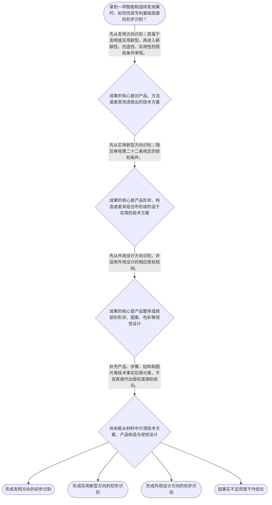

# 整合后的课程完整内容与习题

## 教学模块选择清单

- 当前教学节点：`patent-law-foundation`
- 板块预算：自适应 6/6，总计 9/9

| # | 模块 (block_type) | 类型 | 触发原因 (trigger) | 对应正文段 | 归属 |
|---:|---|:--:|---|---|:--:|
| 1 | `anchor_scenario` | 自适应 | perception=sensing(0.84) / cold_start | 智能产线升级中的三类成果｜某智能制造企业的研发负责人准备发布一套柔性装配单元：软件团队设计了根据视觉传感器数据实时修正… | [A] |
| 2 | `legal_anchor` | 必选 | mandatory | 客体与授权条件的法条锚点｜《专利法》第二条 | [A] |
| 3 | `worked_example` | 自适应 | cold_start(low_confidence) | 柔性装配单元的客体分类演示｜某企业拟就柔性装配单元提交三份材料：材料甲记载“采集工件位置数据、计算偏差、生成并下发机械臂… | [A] |
| 4 | `decision_flow` | 自适应 | input=visual(0.81) | 专利基础识别流程｜拿到一项智能制造研发成果时，如何完成专利基础层面的初步识别？ | [A] |
| 5 | `mnemonic` | 自适应 | understanding=sequential(0.73) | “客—权—审”三步记忆表｜三步记忆表：“客—权—审”。客：先辨保护客体；权：理解权利具有独占性、时间性、地域性边界；审… | [A] |
| 6 | `reflect_prompt` | 自适应 | processing=reflective(0.66) | 从研发成果回看保护对象｜回顾你接触过的一项智能制造研发成果：它的核心价值更体现为控制步骤、产品结构，还是产品外观？若… | [A] |
| 7 | `assessment` | 必选 | mandatory | 本节三类测评｜复习三类发明创造中发明的法定定义。 | [A] |
| 8 | `knowledge_synthesis` | 必选 | mandatory | 专利法律制度基础框架｜制度特征：独占性、时间性、地域性用于理解专利权存在法定边界，而非无限制控制。 | [A] |
| 9 | `summary_card` | 自适应 | len(knowledge_sub_nodes)=3>=3 | 专利基础速查卡｜专利分析先识别客体和制度边界，再进入授权条件与保护范围的具体判断。 | [A] |

## 教学正文

## I — 法律问题

在智能制造研发中，团队面对机器人、产线控制方法和设备外观时，首先应识别：拟保护对象属于何种专利客体，以及专利制度为何要求以公开技术为代价取得有期限、受地域限制的专利权。新颖性判断与侵权判定属于后续专题；本节只建立进入这两类判断前必须具备的制度和客体基础。

## R — 适用规则

《专利法》将“发明创造”界定为发明、实用新型和外观设计三类。发明是对产品、方法或者其改进提出的新的技术方案；实用新型是对产品的形状、构造或者其结合提出的适于实用的新的技术方案；外观设计是对产品整体或者局部的形状、图案或者其结合，以及色彩与形状、图案结合所作出的富有美感并适于工业应用的新设计。〔RAG: 中华人民共和国专利法.txt — 第二条：发明创造是指发明、实用新型和外观设计〕

制度层面可按“法律—实施细则—审查指南”的规范体系理解：法律提供基本制度与授权条件，实施细则和审查指南服务于程序和审查中的具体适用。本次检索上下文未提供实施细则和审查指南的原文，故本节不对其具体条款作出展开性结论。

对于发明和实用新型，授权条件包括新颖性、创造性和实用性；现有技术是申请日以前在国内外为公众所知的技术。〔RAG: 中华人民共和国专利法.txt — 第二十二条：授予专利权的发明和实用新型，应当具备新颖性、创造性和实用性；现有技术是申请日以前在国内外为公众所知的技术〕 这说明后续进行新颖性判断前，须先确认对象属于发明或实用新型，并固定申请日与技术公开状态。

专利制度通常用“独占性、时间性、地域性”概括其权利边界：专利权不是对抽象想法的永久、全球控制，而是在法定条件和范围内运行的权利。制度功能则可概括为：以可预期的权利激励研发，通过申请文件公开技术信息，并促进技术实施、转化和经济发展。关于中国制度的早期公开、延迟审查以及初步审查与实质审查的具体程序细节，检索上下文未提供直接原文依据；本节仅将其作为后续学习申请与审查程序时需要区分的流程标签，不据此推导具体期限或程序后果。

## A — 规则适用

以智能制造场景作分类：如果方案是“根据传感器数据调整焊接机器人路径的控制步骤”，其保护对象应先从“方法”方向审视，属于发明定义可能覆盖的对象；如果方案是“具有特定形状和构造配合的机器人末端夹具”，应先从产品形状、构造或其结合方向审视，属于实用新型定义可能覆盖的对象；如果方案仅主张工业平板终端的局部面板图案、形状及色彩组合，应先从产品外观方向审视，属于外观设计定义可能覆盖的对象。上述分类只解决“对象落入哪一类”的前置问题，不等于当然获得授权。

在研发管理上，分类之后再进入对应的审查路径：发明和实用新型需面对第二十二条规定的新颖性、创造性、实用性要求。新颖性不能与创造性混同：前者关注是否属于现有技术，后者关注相对现有技术的实质性特点和进步。抵触申请、现有技术及多文件组合的具体判断规则，属于后续新颖性、抵触申请和创造性专题，本节不提前作出细化判定。

## C — 结论

本节的工作结论是：智能制造创新先按“产品或方法技术方案—产品形状构造技术方案—产品外观新设计”完成三类客体识别；再理解专利制度以有限边界的权利激励研发并交换技术公开。完成该前置识别，才可在后续节点准确处理新颖性和侵权范围问题。

> 常见误区 / 易混淆点
>
> 误区一：把“软件、算法或数据”这一名称直接等同于某一专利类型。应回到拟保护方案究竟是产品、方法、产品形状构造，还是产品外观进行识别。
>
> 误区二：认为属于发明、实用新型或外观设计就必然授权。客体分类只是第一关；发明和实用新型仍须满足第二十二条的授权条件。〔RAG: 中华人民共和国专利法.txt — 第二十二条：应当具备新颖性、创造性和实用性〕
>
> 误区三：将新颖性与创造性当作同一问题，或将抵触申请直接当作创造性评价材料。该辨析留待后续专题按各自规则处理。

本节设有测评，请到【习题】区作答。

### 智能产线升级中的三类成果（anchor_scenario）

> 某智能制造企业的研发负责人准备发布一套柔性装配单元：软件团队设计了根据视觉传感器数据实时修正机械臂路径的控制步骤；结构团队改进了末端夹具的卡扣构造；工业设计团队则完成了控制台局部面板的图案和色彩方案。负责人希望“把三项都申请专利”，但尚未区分每项成果的保护对象。

此时最先要解决的不是新颖性是否被破坏，也不是竞争对手是否侵权，而是把每项成果放入正确的专利客体框架。对象分类错误，后续授权条件和保护范围的讨论就会失去准确起点。

**锚定**：该情境锚定发明、实用新型、外观设计三类客体的前置分类，以及专利分析应先分类后判断的顺序。

**先想一想**：面对同一条智能产线中的控制步骤、夹具构造和操作面板，你会依据哪些技术事实区分其可能对应的专利客体？

### 客体与授权条件的法条锚点（legal_anchor）

- **《专利法》第二条**：第二条先回答“保护什么”：发明覆盖产品、方法或其改进的技术方案，实用新型聚焦产品形状、构造或其结合，外观设计聚焦产品整体或局部的视觉设计。
- **《专利法》第二十二条**：第二十二条再回答“发明和实用新型能否授权”：须具备新颖性、创造性和实用性，并以申请日前公众所知技术界定现有技术。

**为何重要**：客体分类决定后续适用哪套规则；发明和实用新型的三性条件则是进入新颖性专题前必须知道的法定门槛。

### 柔性装配单元的客体分类演示（worked_example）

**案情/例题**：某企业拟就柔性装配单元提交三份材料：材料甲记载“采集工件位置数据、计算偏差、生成并下发机械臂修正路径”的步骤；材料乙记载“夹具本体、可移动卡爪及定位凸台之间的构造配合”；材料丙记载“控制终端局部面板的波纹图案、轮廓形状和蓝灰色组合”。需要先判断三份材料分别应从何种专利客体方向审视。
**适用规则**：《专利法》第二条：发明是对产品、方法或者其改进提出的新的技术方案；实用新型是对产品形状、构造或者其结合提出的适于实用的新的技术方案；外观设计是对产品整体或者局部的形状、图案或者其结合以及色彩与形状、图案结合所作出的富有美感并适于工业应用的新设计。
**分步推演**：
1. 材料甲的核心记载是数据采集、计算和下发修正路径的一系列控制步骤，判断重心在“方法技术方案”，而非产品外观或夹具构造。 → *材料甲先按发明的“方法”方向识别。*
2. 材料乙的核心记载是夹具这一产品中卡爪、定位凸台等部件的形状和构造配合，判断重心在产品形状、构造或其结合。 → *材料乙先按实用新型方向识别。*
3. 材料丙的核心记载是终端产品局部面板的图案、形状与色彩组合，判断重心在产品外观形成的视觉设计。 → *材料丙先按外观设计方向识别。*
4. 三份材料的分类只回答对象属性；对材料甲和乙，仍须另行审查第二十二条所规定的新颖性、创造性和实用性。 → *客体分类不等于当然授权。*
**结论**：材料甲、乙、丙分别应优先从发明、实用新型、外观设计方向审视；其中发明和实用新型还须满足法定授权条件。
**本题要点**：面对复合型智能制造成果，应先抓住保护对象的技术事实，再匹配法定定义，不能按项目名称直接定类。

### 专利基础识别流程（decision_flow）

**决策问题**：拿到一项智能制造研发成果时，如何完成专利基础层面的初步识别？



### “客—权—审”三步记忆表（mnemonic）

**记忆锚**：三步记忆表：“客—权—审”。客：先辨保护客体；权：理解权利具有独占性、时间性、地域性边界；审：发明和实用新型再审查新颖性、创造性、实用性。
**映射**：
- 客
- 权
- 审
**何时用**：看到智能制造研发成果、专利申请方案或后续新颖性与侵权问题时，先按“客—权—审”核对分析起点。

### 从研发成果回看保护对象（reflect_prompt）

**反思问题**：回顾你接触过的一项智能制造研发成果：它的核心价值更体现为控制步骤、产品结构，还是产品外观？若材料同时包含三者，哪些事实必须分别记录？

**关注要点**：不要用“算法”“设备”或“平台”等项目名称替代对保护对象的事实识别。；区分技术步骤、产品形状构造和产品视觉设计，避免把不同层面的成果混为同一客体。；分类完成后，发明和实用新型仍要另行面对新颖性、创造性、实用性。

**连接**：连接到学习者已有的研发经验：将研发文档中的流程、结构图和工业设计图分别对应到不同的专利分析对象。

### 专利法律制度基础框架（knowledge_synthesis）

**知识框架**：
- 制度特征：独占性、时间性、地域性用于理解专利权存在法定边界，而非无限制控制。
- 规范体系：以专利法为基本规范，并在实施细则和审查指南等层面落实程序与审查；本次检索未提供后二者原文。
- 保护客体：第二条将发明创造分为发明、实用新型、外观设计，三者应按技术事实分别识别。
- 制度作用：通过权利激励研发、通过申请文件促进技术公开，并服务技术实施与经济发展。
- 程序认识：早期公开、延迟审查、初步审查和实质审查是后续程序学习中需要区分的流程标签；具体规则须以对应规范原文核验。
**概念关系**：客体分类决定分析入口；确定属于发明或实用新型后，才适用第二十二条的三性条件。；制度功能解释为何存在技术公开与有限权利边界；该基础进一步支撑后续申请、授权和侵权保护学习。；新颖性、抵触申请、创造性及三步法属于后续递进节点，本节只建立其制度前提。
**必记**：分类在前：先确定成果是方法或产品技术方案、产品形状构造技术方案，还是产品外观新设计。；授权条件在后：发明和实用新型须具备新颖性、创造性和实用性。；新颖性与创造性不是同一判断：后续专题应分别适用各自规则。

### 专利基础速查卡（summary_card）

**要点卡**：
- **三类保护客体**：发明看产品、方法或改进的技术方案；实用新型看产品形状构造；外观设计看产品整体或局部视觉设计。
- **三性门槛**：发明和实用新型须同时满足新颖性、创造性和实用性。
- **权利边界**：独占性、时间性、地域性提示专利权受法定条件、期限和地域限制。
- **制度作用**：专利制度以权利激励研发，并通过公开促进技术传播和应用。
- **程序标签**：早期公开、延迟审查、初步审查和实质审查应在后续程序节点按具体规范学习。
**必背**：《专利法》第二条规定的发明、实用新型、外观设计三类客体及其区分重点。；《专利法》第二十二条规定：发明和实用新型应当具备新颖性、创造性和实用性。；先分类，再确定授权条件或后续保护规则。
**一句话总结**：专利分析先识别客体和制度边界，再进入授权条件与保护范围的具体判断。

### 本节三类测评（assessment）

**三类覆盖**：backward_review、forward_probe、weakness_probe
**题目**：
- q1：复习三类发明创造中发明的法定定义。
- q2：探测下一节点中保护范围的基础定位。
- q3：分析智能制造复合成果的三类客体分类。


## 结构化数据

## expert

```json
"expert_a"
```

## style

```json
"conservative"
```

## knowledge_points

```json
[
  {
    "node_id": "patent-law-foundation",
    "kc_name": "专利制度的基本概念与特征：独占性、时间性、地域性"
  },
  {
    "node_id": "patent-law-foundation",
    "kc_name": "中国专利制度体系：专利法、专利法实施细则、专利审查指南"
  },
  {
    "node_id": "patent-law-foundation",
    "kc_name": "专利保护的三种客体：发明、实用新型、外观设计"
  },
  {
    "node_id": "patent-law-foundation",
    "kc_name": "专利制度的作用：激励发明创造、促进技术公开、推动技术应用和经济发展"
  },
  {
    "node_id": "patent-law-foundation",
    "kc_name": "中国专利制度发展历程与特点：早期公开延迟审查、初步审查制与实质审查制并存"
  }
]
```

## legal_basis

```json
[
  {
    "article": "《中华人民共和国专利法》第二条",
    "source": "中华人民共和国专利法.txt：第二条"
  },
  {
    "article": "《中华人民共和国专利法》第二十二条",
    "source": "中华人民共和国专利法.txt：第二十二条"
  }
]
```

## risks

```json
[
  {
    "risk": "将专利客体分类误当成授权结论，忽略发明和实用新型还须满足新颖性、创造性和实用性。",
    "related_node_id": "patent-law-foundation"
  },
  {
    "risk": "在后续学习中混同新颖性与创造性，或将抵触申请当作创造性评价中的现有技术。",
    "related_node_id": "patent-law-foundation"
  },
  {
    "risk": "将独占性、时间性、地域性理解为不受授权状态、期限和地域边界约束的绝对权利。",
    "related_node_id": "patent-law-foundation"
  }
]
```

## draft_stage

```json
"debate"
```

## irac

```json
{
  "issue": "智能制造研发成果进入专利工作前，如何识别其专利客体并建立理解后续新颖性、侵权判定所需的制度基础。",
  "rule": "《专利法》第二条将发明创造分为发明、实用新型、外观设计，并分别规定其定义；第二十二条规定发明和实用新型须具备新颖性、创造性和实用性。",
  "application": "机器人控制步骤可从方法技术方案方向识别，具有形状构造的夹具可从实用新型方向识别，工业终端面板的视觉设计可从外观设计方向识别；完成分类后，发明和实用新型仍需进入第二十二条规定的授权条件审查。",
  "conclusion": "客体识别是专利分析的前置步骤，不替代授权条件或侵权比对；应先分类、再确定适用规则，并在后续专题分别学习新颖性与侵权判定。"
}
```

## interactive_questions

```json
[
  {
    "qid": "q1",
    "category": "remember",
    "difficulty": "L1",
    "source_tag": "backward_review",
    "kc_node_id": "patent-law-foundation",
    "question": "依据《专利法》第二条，下列关于三类发明创造的表述，正确的是哪一项？",
    "answer": "B",
    "options": [
      "A. 发明仅指产品的外观设计",
      "B. 发明可以是对产品、方法或者其改进提出的新的技术方案",
      "C. 实用新型仅指产品的色彩设计",
      "D. 外观设计仅指产品内部的机械构造"
    ]
  },
  {
    "qid": "q2",
    "category": "understand",
    "difficulty": "L1",
    "source_tag": "forward_probe",
    "kc_node_id": "patent-rights-protection",
    "question": "对下一节点的概念作初步探测：确定发明或者实用新型专利权保护范围时，首先应以哪一项内容为准？",
    "answer": "C",
    "options": [
      "A. 专利权人的市场宣传材料",
      "B. 产品的实际销售价格",
      "C. 权利要求的内容",
      "D. 研发人员的主观设想"
    ]
  },
  {
    "qid": "q3",
    "category": "analyze",
    "difficulty": "L3",
    "source_tag": "weakness_probe",
    "kc_node_id": "patent-law-foundation",
    "question": "某企业拟分别保护以下智能制造成果：①根据传感器反馈调整机器人路径的控制步骤；②具有特定形状和构造配合的夹具；③工业终端局部面板的图案、形状与色彩组合。下列分类最符合《专利法》第二条的是哪一项？",
    "answer": "A",
    "options": [
      "A. ①可从发明的方法技术方案方向识别，②可从实用新型方向识别，③可从外观设计方向识别",
      "B. ①、②、③均只能作为外观设计处理",
      "C. ①只能作为实用新型处理，②只能作为发明处理，③不属于发明创造",
      "D. 只要涉及智能制造，①、②、③均当然属于发明专利"
    ]
  }
]
```

## knowledge_synthesis

```json
{
  "node": "patent-law-foundation",
  "coverage": [
    {
      "node_id": "patent-law-foundation"
    }
  ],
  "confusable_pairs": [
    {
      "pair": "发明、实用新型与外观设计：应分别依据产品或方法技术方案、产品形状构造技术方案、产品视觉设计识别。"
    },
    {
      "pair": "客体分类与授权条件：前者确定分析入口，后者决定是否满足授权门槛，二者不可互相替代。"
    },
    {
      "pair": "新颖性与创造性：均属发明和实用新型的授权条件，但不是同一判断；具体边界留待后续节点。"
    }
  ]
}
```
