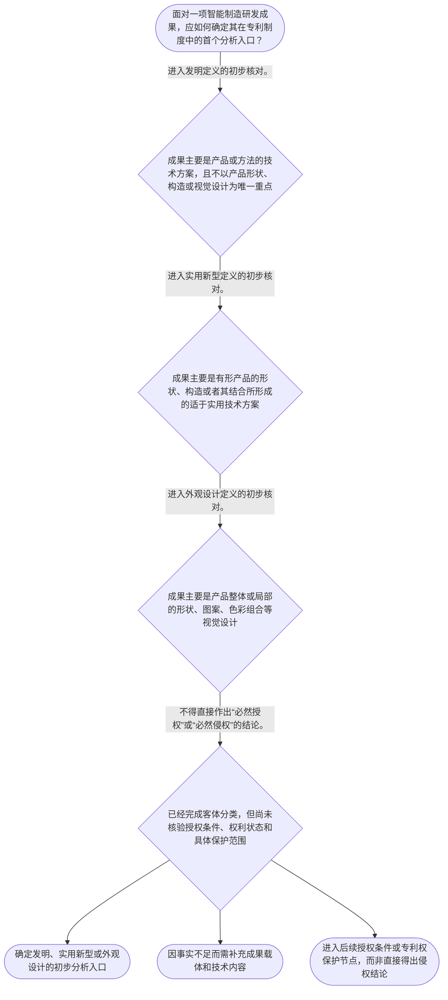

# 整合后的课程完整内容与习题

## 教学模块选择清单

- 当前教学节点：`patent-law-foundation`
- 板块预算：自适应 6/6，总计 9/9

| # | 模块 (block_type) | 类型 | 触发原因 (trigger) | 对应正文段 | 归属 |
|---:|---|:--:|---|---|:--:|
| 1 | `anchor_scenario` | 自适应 | perception=sensing(0.84) / cold_start | 智能产线研发包的专利分类起点｜某智能制造企业准备发布一套协作机器人柔性装配单元：研发人员改进了末端夹具的模块连接结构，开发… | [A] |
| 2 | `legal_anchor` | 必选 | mandatory | 法定专利客体与授权门槛｜《专利法》第二条 | [A] |
| 3 | `worked_example` | 自适应 | cold_start(low_confidence) | 柔性夹具、控制方法与终端外观的分类演示｜某制造企业形成三项成果：一是可快速更换的机器人夹具连接结构；二是依据压力和视觉数据调整夹持力… | [A] |
| 4 | `decision_flow` | 自适应 | input=visual(0.81) | 专利制度基础判断流程｜面对一项智能制造研发成果，应如何确定其在专利制度中的首个分析入口？ | [A] |
| 5 | `mnemonic` | 自适应 | understanding=sequential(0.73) | “客—权—界”制度检查表｜“客—权—界”三步检查表：客体先分类，权利看法定边界，问题分授权与保护。 | [A] |
| 6 | `reflect_prompt` | 自适应 | processing=reflective(0.66) | 从研发成果到法律问题的反思｜回看你熟悉的一项智能制造研发成果：它的核心价值是产品结构、控制方法还是产品视觉设计？你会如何… | [A] |
| 7 | `assessment` | 必选 | mandatory | 节点测评与下一节点探测｜复习专利法所称发明创造的三类法定客体。 | [A] |
| 8 | `knowledge_synthesis` | 必选 | mandatory | 专利法律制度基础框架｜法定客体：发明、实用新型和外观设计是专利法上发明创造的三种类别，必须先按成果载体分类。 | [A] |
| 9 | `summary_card` | 自适应 | len(knowledge_sub_nodes)=3>=3 | 制度基础速查卡｜智能制造专利分析的第一步不是判断像不像，而是先分清成果客体、权利边界和当前法律问题。 | [A] |

## 教学正文

## I — 法律问题

智能制造研发团队面对一个机器人关节模组、视觉检测设备或产线控制方法时，首先应当判断：该成果是否属于专利制度所保护的发明创造；其后才可能进入授权条件、新颖性和侵权风险等具体判断。当前节点只解决制度基础问题，不对某项具体技术作出新颖性或侵权结论。

## R — 适用规则

### 1. 专利制度的对象与三类客体

《专利法》所称“发明创造”包括发明、实用新型和外观设计。发明是对产品、方法或者其改进提出的新的技术方案；实用新型是对产品的形状、构造或者其结合提出的适于实用的新的技术方案；外观设计则是对产品整体或局部的形状、图案及其结合，或者色彩与形状、图案的结合所作出的富有美感并适于工业应用的新设计。〔RAG: 中华人民共和国专利法.txt — 第二条：发明创造是指发明、实用新型和外观设计；并分别规定三类定义〕

因此，智能制造成果应先按“保护什么”分类：例如，机器人控制参数的处理流程可能涉及方法技术方案；夹具、传感器安装结构等有形产品的形状或构造，可能涉及实用新型；设备控制面板或机器人外壳的视觉设计，则可能涉及外观设计。分类不是给成果贴商业标签，而是为了确定后续申请文件、审查规则和保护范围的分析入口。

### 2. 专利权的基本特征

专利制度具有三项基础特征：

- **独占性**：在法定保护范围和期限内，专利权人可以依法排除他人未经许可的实施行为。它不是对“技术思想”的无限垄断，而是以被依法授予且边界明确的专利权为前提。
- **时间性**：专利保护不是永久的。申请、授权、维持和届满构成其时间边界；具体期限和终止规则属于后续“专利权保护”节点。
- **地域性**：专利权依授予国或者地区的法律产生并在相应地域内发挥效力。研发团队在境外展会、跨境制造和出口部署中，应分别识别拟保护或拟实施的法域。

### 3. 制度规范的层级

中国专利制度的基础规范包括《专利法》、专利法实施细则和《专利审查指南》。可按功能作初步区分：法律规定基本权利义务和授权框架；实施细则细化程序性事项；审查指南为审查实践提供具体适用指引。当前检索上下文未提供实施细则和审查指南的原文，故本节不对其具体条款作延伸解释，也不以此替代法条依据。

### 4. 专利制度为何要求公开与审查

专利制度的制度设计并非单向保护申请人：申请人公开技术内容，社会能够获得可利用的技术信息；国家通过审查和授权，使符合条件的技术方案获得有限期间、有限地域内的专利保护。对发明和实用新型，法律要求具备新颖性、创造性和实用性；其中，新颖性要求不属于现有技术，并排除法定的在先申请情形。〔RAG: 中华人民共和国专利法.txt — 第二十二条：授予专利权的发明和实用新型应当具备新颖性、创造性和实用性〕

本节只把“三性”作为制度入口：它说明专利不是对所有研发成果当然授予。新颖性、抵触申请、创造性及权利要求结构的具体判断，须在后续对应节点结合申请日、证据和权利要求文本展开，不能仅凭“技术很先进”或“产品已经量产”直接判断。

### 5. 程序特点的定位

课程知识图所列“早期公开、延迟审查、初步审查制与实质审查制并存”，用于提示专利申请从提交、公开到审查和授权具有阶段性。它们的具体适用对象、时间节点和程序效果需要以实施细则、审查指南及对应程序节点材料核验。当前检索上下文未提供这些程序规则的直接原文，故不能据此推导任何个案的授权结果或权利状态。

## A — 规则适用

以一个制造现场常见的研发包为例：某企业形成了“用于协作机器人末端执行器的模块化夹具结构”“基于传感数据调整夹持力的控制方法”以及“控制终端的界面外观”。

第一步，分离成果载体：夹具的形状、构造及其结合，应优先按实用新型的定义核对；控制方法属于发明定义中“方法或者其改进”的分析入口；终端界面的视觉设计是否构成外观设计，还须核对其是否对应产品外观以及法定设计要件。〔RAG: 中华人民共和国专利法.txt — 第二条分别界定发明、实用新型和外观设计〕

第二步，分离制度问题：若团队担心竞争对手仿制，不能仅因“技术相似”就下侵权结论；侵权判定需要先有有效专利权，并以具体权利要求或外观设计图片、照片确定保护边界，该问题属于后续专利权保护节点。若团队担心申请能否授权，则应在分类之后进入授权条件审查；对于发明和实用新型，至少要面对新颖性、创造性和实用性的法定门槛。〔RAG: 中华人民共和国专利法.txt — 第二十二条：发明和实用新型应具备新颖性、创造性和实用性〕

第三步，按时间与地域管理研发行为：技术公开、申请、授权和实施发生在何时、何地，分别影响后续不同法律判断。基础阶段的正确做法是建立技术方案、公开记录、申请材料和目标市场的对应表，而不是把“申请了专利”“获得授权”“他人侵权”视为同一个命题。

## C — 结论

专利法律制度基础的核心是先建立分类和边界意识：专利客体分为发明、实用新型和外观设计；专利权具有独占性、时间性和地域性；制度通过技术公开、法定审查和有限保护来平衡激励与公共利用。智能制造技术的具体新颖性判断和侵权判定，必须建立在这一分类、时间和地域框架之上，不能提前混用审查标准与侵权标准。

> 常见误区 / 易混淆点
>
> 1. 将“研发投入大”或“设备复杂”直接等同于可获得专利权。是否授权仍取决于法定客体和授权条件。
> 2. 将发明、实用新型、外观设计混作同一种保护对象。三者的定义和保护对象不同，应先分类再分析。
> 3. 将“专利申请”“专利授权”和“专利侵权”混为一谈。它们分别对应申请程序、权利状态和实施行为比对。
> 4. 将后续的新颖性、创造性、抵触申请和权利要求解释规则提前套用于本节点。当前只建立制度入口；具体规则须以相应节点的法条和证据为准。

本节设有测评，请到【习题】区作答。

### 智能产线研发包的专利分类起点（anchor_scenario）

> 某智能制造企业准备发布一套协作机器人柔性装配单元：研发人员改进了末端夹具的模块连接结构，开发了依据视觉传感数据自动调节夹持力的控制流程，并重新设计了操作终端外壳。市场部门希望立即宣传“全套技术已受专利保护”，法务人员则提醒：三项成果的保护对象未必相同，申请、授权和侵权也不是同一个问题。团队需要先决定每项成果在专利制度中的分析入口。

**锚定**：该情境锚定“先识别专利客体、再区分授权与保护问题”的制度基础。

**先想一想**：面对同一套智能装备中的结构、控制流程和外观，你会先按什么标准把它们分开？

### 法定专利客体与授权门槛（legal_anchor）

- **《专利法》第二条**：专利法保护的发明创造分为发明、实用新型和外观设计，三类对象的定义与分析入口不同。
- **《专利法》第二十二条**：发明和实用新型并非当然授权，至少须具备新颖性、创造性和实用性。

**为何重要**：第二条解决“申请的是什么”，第二十二条提示“为什么还要接受授权条件审查”。二者共同防止把技术成果、专利申请和有效专利权混为一谈。

### 柔性夹具、控制方法与终端外观的分类演示（worked_example）

**案情/例题**：某制造企业形成三项成果：一是可快速更换的机器人夹具连接结构；二是依据压力和视觉数据调整夹持力的控制流程；三是终端产品外壳的图案与形状组合。企业希望知道应从何种专利客体分析，并询问是否可以据此立即断言竞争对手侵权。
**适用规则**：《专利法》第二条：发明包括产品、方法或者其改进的新的技术方案；实用新型针对产品形状、构造或者其结合；外观设计针对产品整体或局部的形状、图案等新设计。
**分步推演**：
1. 先观察夹具成果的技术载体。其重点是有形产品的模块连接结构，而不是单纯控制步骤或视觉效果。 → *夹具结构应优先从实用新型的定义入口分析。*
2. 再观察控制流程。其核心是处理传感数据并调节夹持力的步骤性技术方案，属于“方法或者其改进”的分析方向。 → *控制流程应优先从发明的定义入口分析。*
3. 最后观察终端外壳。其关注点是产品外观的形状、图案及其结合，而非内部控制逻辑。 → *外壳视觉方案应优先从外观设计的定义入口分析。*
4. 分类只确定制度入口，不等于已授权、更不等于已发生侵权；后续仍须分别审查授权条件、权利状态和保护范围。 → *分类、授权与侵权属于不同层次的问题。*
**结论**：该研发包可分别进入实用新型、发明和外观设计的分析入口；仅凭成果分类不能断言其已经获得专利权或他人构成侵权。
**本题要点**：先按法定定义分离技术成果，再将授权条件与侵权风险放入各自的后续分析步骤。

### 专利制度基础判断流程（decision_flow）

**决策问题**：面对一项智能制造研发成果，应如何确定其在专利制度中的首个分析入口？



### “客—权—界”制度检查表（mnemonic）

**记忆锚**：“客—权—界”三步检查表：客体先分类，权利看法定边界，问题分授权与保护。
**映射**：
- 客
- 权
- 界
**何时用**：看到“某技术能否申请”“是否已受保护”或“是否侵权”这类表述时，先按该表确定当前问题处于哪一层。

### 从研发成果到法律问题的反思（reflect_prompt）

**反思问题**：回看你熟悉的一项智能制造研发成果：它的核心价值是产品结构、控制方法还是产品视觉设计？你会如何避免把“能申请”“已授权”和“他人侵权”混作一个结论？

**关注要点**：成果的主要技术或设计载体是否清楚。；法定客体分类与后续授权条件是否被区分。；专利权的时间和地域边界是否已被纳入研发与市场部署考虑。

**连接**：连接到学习者已有的研发经验：将技术需求、设计文档、公开记录和目标市场分别整理，而不是只保留产品功能描述。

### 专利法律制度基础框架（knowledge_synthesis）

**知识框架**：
- 法定客体：发明、实用新型和外观设计是专利法上发明创造的三种类别，必须先按成果载体分类。
- 权利特征：专利权以独占性、时间性和地域性为基本边界，不是对技术思想的无限控制。
- 规范体系：专利法规定基础框架，实施细则和审查指南承担细化与适用指引功能；具体程序规则须另行核验。
- 制度功能：以技术公开与有限保护相结合，服务于激励发明创造、促进技术应用和经济发展。
- 程序定位：申请、公开、审查、授权具有阶段性；早期公开、延迟审查和不同审查机制的具体规则应在后续程序节点核验。
**概念关系**：法定客体分类是后续申请文件和审查路径的起点。；授权条件解决“能否取得权利”，专利权保护解决“有效权利的边界及其实施风险”，两者应依次但不得混同。；技术公开与有限保护共同解释专利制度的激励和扩散功能。
**必记**：先区分发明、实用新型、外观设计，再讨论申请和审查。；发明和实用新型授权须具备新颖性、创造性和实用性，但具体判断规则不应在基础节点中跳步适用。；分类、授权和侵权是三个不同层次的问题，不能相互替代。

### 制度基础速查卡（summary_card）

**要点卡**：
- **三类专利客体**：发明看产品、方法或改进的技术方案；实用新型看产品形状、构造；外观设计看产品视觉设计。
- **权利三特征**：独占性、时间性、地域性共同限定专利权的效力边界。
- **三性入口**：发明和实用新型须具备新颖性、创造性和实用性，具体判断留待后续节点。
- **制度功能**：通过公开技术内容与给予有限保护，兼顾创新激励和技术传播。
- **问题分层**：先分类，再审授权；确认有效权利和范围后，才进入侵权分析。
**必背**：《专利法》第二条中的发明、实用新型、外观设计三类客体及其基本区分。；专利权具有独占性、时间性和地域性。；授权判断不能替代侵权判断。
**一句话总结**：智能制造专利分析的第一步不是判断像不像，而是先分清成果客体、权利边界和当前法律问题。

### 节点测评与下一节点探测（assessment）

**三类覆盖**：backward_review、forward_probe、weakness_probe
**题目**：
- q-foundation-backward-01：复习专利法所称发明创造的三类法定客体。
- q-protection-forward-01：仅探测专利权保护分析的有效权利前提。
- q-foundation-weakness-01：综合辨析智能制造研发包的客体分类与问题分层。


## 结构化数据

## expert

```json
"expert_a"
```

## style

```json
"conservative"
```

## knowledge_points

```json
[
  {
    "node_id": "patent-law-foundation",
    "kc_name": "专利制度的基本概念与特征：独占性、时间性、地域性"
  },
  {
    "node_id": "patent-law-foundation",
    "kc_name": "中国专利制度体系：专利法、专利法实施细则、专利审查指南"
  },
  {
    "node_id": "patent-law-foundation",
    "kc_name": "专利保护的三种客体：发明、实用新型、外观设计"
  },
  {
    "node_id": "patent-law-foundation",
    "kc_name": "专利制度的作用：激励创造、技术公开、技术应用和经济发展"
  },
  {
    "node_id": "patent-law-foundation",
    "kc_name": "中国专利制度的程序特点：早期公开、延迟审查、初步审查与实质审查并存"
  }
]
```

## legal_basis

```json
[
  {
    "article": "《中华人民共和国专利法》第二条",
    "source": "中华人民共和国专利法.txt：第二条关于发明、实用新型和外观设计的定义"
  },
  {
    "article": "《中华人民共和国专利法》第二十二条",
    "source": "中华人民共和国专利法.txt：第二十二条关于发明和实用新型授权条件及现有技术的规定"
  }
]
```

## risks

```json
[
  {
    "risk": "把技术成果的商业价值或复杂程度误判为当然具备专利保护资格，忽略先按法定客体分类。",
    "related_node_id": "patent-law-foundation"
  },
  {
    "risk": "将专利授权条件与侵权判定混为同一问题，导致在未确定有效权利及保护范围前作出侵权结论。",
    "related_node_id": "patent-law-foundation"
  },
  {
    "risk": "将课程图中的程序特点当作可直接适用于个案的条文规则；当前检索材料未提供其具体程序依据。",
    "related_node_id": "patent-law-foundation"
  }
]
```

## draft_stage

```json
"debate"
```

## irac

```json
{
  "issue": "智能制造研发成果进入专利分析时，应如何识别其是否属于法定专利客体，并区分专利制度基础、授权条件与后续侵权判断的不同层次？",
  "rule": "《专利法》第二条将发明创造分为发明、实用新型和外观设计，并分别规定其定义；第二十二条规定发明和实用新型获得授权应具备新颖性、创造性和实用性。",
  "application": "对夹具结构、控制方法和设备外观等成果，应先依第二条按其技术或设计载体分类；分类后才进入相应申请、审查和保护范围分析。是否侵权还需以有效专利权及其具体保护范围为前提，不能由基础分类直接推出。",
  "conclusion": "专利制度基础的正确分析顺序是：先识别法定客体，再认识权利的独占性、时间性和地域性，最后将授权条件与后续侵权问题分别进入对应节点处理。"
}
```

## interactive_questions

```json
[
  {
    "qid": "q-foundation-backward-01",
    "category": "understand",
    "difficulty": "L1",
    "source_tag": "backward_review",
    "kc_node_id": "patent-law-foundation",
    "question": "关于《专利法》所称“发明创造”的类别，下列说法正确的是哪一项？",
    "answer": "A",
    "options": [
      "A. 发明创造包括发明、实用新型和外观设计。",
      "B. 发明创造仅包括具有机械结构的产品。",
      "C. 实用新型可以脱离产品形状和构造而仅保护抽象方法。",
      "D. 外观设计仅指产品的内部控制方法。"
    ]
  },
  {
    "qid": "q-protection-forward-01",
    "category": "remember",
    "difficulty": "L1",
    "source_tag": "forward_probe",
    "kc_node_id": "patent-rights-protection",
    "question": "仅作下一节点探测：在专利权保护分析中，判断某一行为是否可能构成侵权，首先不应缺少的前提是哪一项？",
    "answer": "B",
    "options": [
      "A. 被控产品销量很高。",
      "B. 存在依法取得且仍有效的相关专利权。",
      "C. 被控方曾参加过行业展会。",
      "D. 研发人员具有理工科背景。"
    ]
  },
  {
    "qid": "q-foundation-weakness-01",
    "category": "analyze",
    "difficulty": "L3",
    "source_tag": "weakness_probe",
    "kc_node_id": "patent-law-foundation",
    "question": "某企业同时形成一项夹具结构、一套根据传感器数据调节夹持力的控制流程和一款设备外壳视觉方案。关于本节制度基础的分析顺序，下列哪一项最恰当？",
    "answer": "C",
    "options": [
      "A. 先因产品已量产而直接认定三项成果均会获得专利权，再判断类型。",
      "B. 先比较竞争对手产品是否相似，直接作出侵权结论，无须区分成果类型。",
      "C. 先分别识别结构、方法和外观所对应的法定客体，再进入相应授权条件或保护问题的分析。",
      "D. 只要控制流程具有经济价值，就应当然按外观设计处理。"
    ]
  }
]
```

## knowledge_synthesis

```json
{
  "node": "patent-law-foundation",
  "coverage": [
    {
      "node_id": "patent-law-foundation"
    }
  ],
  "confusable_pairs": [
    {
      "pair": "发明、实用新型与外观设计：应以技术或设计成果的法定定义区分，不能仅按产品名称或商业用途分类。"
    },
    {
      "pair": "专利申请、专利授权与专利侵权：申请是程序起点，授权涉及法定条件，侵权以有效权利及其保护边界为前提。"
    },
    {
      "pair": "新颖性等授权条件与侵权判定：前者解决能否获得或维持权利，后者解决实施行为是否落入权利保护范围。"
    }
  ]
}
```
