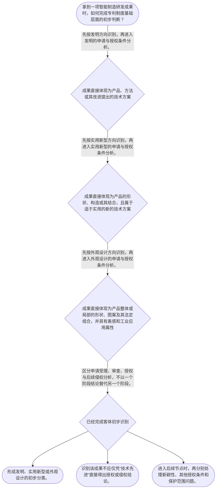

# 整合后的课程完整内容与习题

## 教学模块选择清单

- 当前教学节点：`patent-law-foundation`
- 板块预算：自适应 6/6，总计 9/9

| # | 模块 (block_type) | 类型 | 触发原因 (trigger) | 对应正文段 | 归属 |
|---:|---|:--:|---|---|:--:|
| 1 | `anchor_scenario` | 自适应 | perception=sensing(0.84) / cold_start | 智能产线项目的三类成果｜某智能制造企业的研发经理准备为一套协作机器人工作站申请保护。项目资料中同时出现三类内容：一套… | [A] |
| 2 | `legal_anchor` | 必选 | mandatory | 专利制度基础的法条锚点｜《专利法》第二条 | [A] |
| 3 | `worked_example` | 自适应 | cold_start(low_confidence) | 智能制造成果的客体分轨示范｜以下为教学化示例，并非检索到的真实裁判案例。某工厂开发柔性装配单元，拟保护：①依据工件偏差数… | [A] |
| 4 | `decision_flow` | 自适应 | input=visual(0.81) | 智能制造成果的专利基础判断流程｜拿到一项智能制造研发成果时，如何完成专利制度基础层面的初步判断？ | [A] |
| 5 | `mnemonic` | 自适应 | understanding=sequential(0.73) | 分类—阶段—条件记忆表｜三栏核对表：客体分“三类”／制度走“三阶段”／授权看“三性”。 | [A] |
| 6 | `reflect_prompt` | 自适应 | processing=reflective(0.66) | 从研发成果回看法律分类｜回想你熟悉的一项智能制造研发成果：其中哪些内容是控制方法、哪些是机械构造、哪些是产品视觉外观… | [A] |
| 7 | `assessment` | 必选 | mandatory | 本节三类测评｜复习发明创造三类法定客体。 | [A] |
| 8 | `knowledge_synthesis` | 必选 | mandatory | 专利法律制度基础框架｜基本特征：专利权具有独占性、时间性和地域性，后续权利保护分析必须在这些边界内展开。 | [A] |
| 9 | `summary_card` | 自适应 | len(knowledge_sub_nodes)=3>=3 | 专利制度基础速查卡｜智能制造专利分析先分客体、再定阶段、后审条件，切勿把申请、授权和侵权混为一谈。 | [A] |

## 教学正文

## I — 法律问题

智能制造研发团队面对一项技术成果时，首先不是立即讨论“是否侵权”或“是否具有新颖性”，而是应确定：该成果是否属于专利法上的保护客体；专利制度通过何种规范体系运行；以及专利权为何具有独占性、时间性和地域性。

本节结论先行：智能制造方案可能分别落入发明、实用新型或外观设计；三类客体的法定定义不同。新颖性判断和侵权判定属于后续节点，均以本节的客体识别、制度层级和权利边界意识为前提。

## R — 适用规则

### 1. 先识别专利保护客体

《专利法》所称“发明创造”包括发明、实用新型和外观设计。发明是对产品、方法或者其改进提出的新的技术方案；实用新型是对产品的形状、构造或者其结合提出的适于实用的新的技术方案；外观设计是对产品整体或者局部的形状、图案或者其结合，以及色彩与形状、图案结合所作出的、富有美感并适于工业应用的新设计。〔RAG: 中华人民共和国专利法.txt — 第二条：发明创造是指发明、实用新型和外观设计〕

因此，智能制造项目应按“技术方案的对象”分类：例如，机器人视觉定位的控制方法可先按发明方向审视；夹具的特定机械构造可先按实用新型方向审视；协作机器人操作面板的视觉外观可先按外观设计方向审视。上述仅为客体识别示例，并非对具体方案能否授权的结论。

### 2. 制度体系与规范层级

中国专利制度以《专利法》为基本法律依据；实施细则和专利审查指南承担程序及审查操作层面的具体化功能。国务院专利行政部门负责管理全国专利工作、统一受理和审查专利申请，并依法授予专利权。〔RAG: 中华人民共和国专利法.txt — 第三条：统一受理和审查专利申请，依法授予专利权〕

实务上，应按“法律规定权利与基本条件—实施细则细化程序—审查指南说明审查操作”的顺序查找规范。检索上下文未提供实施细则和审查指南的原文，故本节不对其具体条款作出展开性结论。

### 3. 专利制度的基本特征与作用

专利权的独占性、时间性和地域性，是理解后续保护与侵权问题的三个坐标：独占性提示未经许可实施可能进入权利冲突分析；时间性提示必须先核对权利是否仍在法定存续期内；地域性提示权利效力不能当然跨越不同法域。其具体保护范围、期限和侵权构成，留待后续“专利权保护”节点处理。

制度功能上，专利制度通过公开技术信息与依法授予专利权相衔接，使技术成果进入可检索、可利用的知识体系，并为技术应用提供法律激励。国务院专利行政部门统一受理、审查并依法授予专利权，体现了“申请—审查—授权”的制度入口。〔RAG: 中华人民共和国专利法.txt — 第三条：统一受理和审查专利申请，依法授予专利权〕

关于中国制度发展中的“早期公开延迟审查”以及“初步审查制与实质审查制并存”，本节仅将其作为制度发展脉络的识别标签：前者提示公开与审查并非同一时间动作，后者提示不同专利类型的审查路径可能不同。检索上下文未提供可直接核验的历史资料或细则、指南原文，不能据此推导具体期限、程序或法律效果。

### 4. 与后续新颖性判断的边界

发明和实用新型能否被授予专利权，后续还须满足新颖性、创造性和实用性。新颖性要求该发明或者实用新型不属于现有技术，并排除法定的在先申请情形；现有技术指申请日以前在国内外为公众所知的技术。〔RAG: 中华人民共和国专利法.txt — 第二十二条：授予专利权的发明和实用新型，应当具备新颖性、创造性和实用性〕

这里必须区分两个问题：本节回答“方案属于哪一类可受专利法调整的客体”；新颖性节点回答“该客体是否已被申请日前的公开或法定在先申请破坏”。客体属于发明，并不当然意味着具备新颖性。

## A — 规则适用

以一个智能制造项目的内部立项材料为例：团队拟保护的内容包括“通过传感器数据调节机械臂运动参数的控制步骤”“减速器内的连接结构”与“设备壳体正面的图案布局”。

第一步，逐项按第二条的对象识别。控制步骤属于方法技术方案，应先放入发明类别；减速器连接结构指向产品的形状、构造或其结合，应先放入实用新型类别；壳体正面的图案布局指向产品外观，应先放入外观设计类别。〔RAG: 中华人民共和国专利法.txt — 第二条分别界定发明、实用新型和外观设计〕

第二步，不能把“技术先进”替代为“法律上可授权”。对于前两项，仍要在后续节点按第二十二条审查新颖性、创造性与实用性；对外观设计，则适用其对应的现有设计、明显区别及权利冲突规则。〔RAG: 中华人民共和国专利法.txt — 第二十二条规定发明和实用新型的三性条件；第二十三条规定外观设计的授权条件〕

第三步，不能将专利申请受理误作专利权已经产生。法律规定由国务院专利行政部门统一受理、审查并依法授予专利权，故项目管理中应保留技术形成、申请提交和公开时间的证据链。〔RAG: 中华人民共和国专利法.txt — 第三条：统一受理和审查专利申请，依法授予专利权〕

## C — 结论

专利基础判断的固定顺序是：先分清方案属于发明、实用新型还是外观设计，再定位适用的规范层级，最后才进入授权条件、权利范围与侵权等后续分析。对智能制造研发而言，控制方法、机械构造和产品视觉外观可能需要分轨保护，不能因同属一个设备项目而混为同一专利客体。

> 常见误区 / 易混淆点
>
> 1. “发明、实用新型、外观设计”都是专利客体，但法律定义和后续审查标准并不相同。
> 2. “可以申请”不等于“必然授权”；尤其发明和实用新型仍须通过新颖性、创造性、实用性的检验。
> 3. “提交申请”不等于“已拥有可主张的专利权”；受理、审查与授权是不同制度环节。
> 4. 本节不将侵权判定与新颖性判定混用：侵权以有效专利权及其保护范围为起点，新颖性以申请日前的技术公开或法定在先申请为核心。

本节设有测评，请到【习题】区作答。

### 智能产线项目的三类成果（anchor_scenario）

> 某智能制造企业的研发经理准备为一套协作机器人工作站申请保护。项目资料中同时出现三类内容：一套根据视觉传感器数据动态调节抓取路径的控制步骤、一个用于固定工件的可拆卸夹具连接构造，以及机器人控制柜正面的图案与色彩布局。经理认为“都是我们研发的技术”，希望用同一种专利处理。

法务人员提示：同一项目中不同成果的法律对象可能不同；若一开始分类错误，后续的新颖性检索范围、申请文件组织和侵权比对对象都会偏离。团队需要先确定每项成果在专利制度中的位置。

**锚定**：该情境锚定“先识别保护客体，再进入授权条件和权利保护分析”的基础顺序。

**先想一想**：面对同一设备项目中的控制步骤、机械构造与外观布局，为什么不能仅因它们都具有商业价值就使用同一分类规则？

### 专利制度基础的法条锚点（legal_anchor）

- **《专利法》第二条**：发明创造分为发明、实用新型和外观设计，三类对象的法定定义不同。
- **《专利法》第三条**：国务院专利行政部门统一受理和审查专利申请，并依法授予专利权。
- **《专利法》第二十二条**：发明和实用新型取得授权还须具备新颖性、创造性和实用性。

**为何重要**：第二条解决“保护什么”，第三条定位“由谁依程序审查和授权”，第二十二条提示“客体识别后仍须经过实体条件审查”。这是进入新颖性和侵权学习前不可省略的法条基础。

### 智能制造成果的客体分轨示范（worked_example）

**案情/例题**：以下为教学化示例，并非检索到的真实裁判案例。某工厂开发柔性装配单元，拟保护：①依据工件偏差数据实时修正机械臂轨迹的步骤；②夹具上使定位销与锁紧件配合的特殊构造；③操作终端外壳正面的局部图案布局。待判定问题是：三项成果应如何完成专利客体的初步识别，以及为何不能直接以“技术先进”得出授权或侵权结论？
**适用规则**：《专利法》第二条关于发明、实用新型和外观设计的定义；《专利法》第三条关于受理、审查和授权；《专利法》第二十二条关于发明和实用新型的授权条件。
**分步推演**：
1. 先观察成果的直接对象。轨迹修正体现为对制造过程的控制步骤，属于对方法提出的技术方案，应先按发明方向识别。 → *方法技术方案先进入发明类别。*
2. 夹具的定位销与锁紧件配合，直接指向产品的形状、构造或其结合，适宜先按实用新型方向识别。 → *产品构造先进入实用新型类别。*
3. 终端外壳的局部图案布局指向产品外观，而非控制方法或内部构造，应先按外观设计方向识别。 → *视觉外观先进入外观设计类别。*
4. 完成客体识别后，控制步骤和夹具构造仍须另行审查新颖性、创造性和实用性；申请提交、审查和依法授权也并非同一时点。 → *可申请、可授权和可主张权利是不同层次的问题。*
**结论**：该项目应当按照发明、实用新型和外观设计分轨识别；不能仅依据“技术先进”或“已经提交申请”判断已经授权、具有新颖性或构成侵权。
**本题要点**：面对智能制造项目，先用第二条按对象分类，再用相应实体条件和权利规则继续分析。

### 智能制造成果的专利基础判断流程（decision_flow）

**决策问题**：拿到一项智能制造研发成果时，如何完成专利制度基础层面的初步判断？



### 分类—阶段—条件记忆表（mnemonic）

**记忆锚**：三栏核对表：客体分“三类”／制度走“三阶段”／授权看“三性”。
**映射**：
- 三类
- 三阶段
- 三性
**何时用**：看到研发成果、专利申请或“是否已受保护”的表述时，先依次核对客体、所处制度阶段和是否需要审查授权条件。

### 从研发成果回看法律分类（reflect_prompt）

**反思问题**：回想你熟悉的一项智能制造研发成果：其中哪些内容是控制方法、哪些是机械构造、哪些是产品视觉外观？若需要保护，为什么应先拆分而非笼统命名为“核心技术”？

**关注要点**：成果的直接对象是方法、产品构造还是产品外观。；“属于可识别的专利客体”与“已满足授权条件”是否被区分。；技术资料中能否分别固定形成时间、申请提交和公开时间，以支持后续法律判断。

**连接**：连接到学习者已有的研发经验，并为后续“专利权保护”和“新颖性”节点中的证据、时间点与权利范围分析建立入口。

### 专利法律制度基础框架（knowledge_synthesis）

**知识框架**：
- 基本特征：专利权具有独占性、时间性和地域性，后续权利保护分析必须在这些边界内展开。
- 制度体系：以专利法为基本法律依据，实施细则细化程序，审查指南说明审查操作；具体细则和指南内容须另行核验原文。
- 保护客体：第二条将发明创造分为发明、实用新型和外观设计，分类取决于成果的直接对象。
- 制度作用：通过申请、审查和依法授权，使技术公开与权利激励相衔接。
- 发展与审查特点：公开与审查可能处于不同程序阶段，初步审查和实质审查属于需进一步按具体规范核验的程序概念。
**概念关系**：客体识别是进入申请、审查和授权规则的前提。；发明和实用新型完成客体识别后，才进入第二十二条的新颖性、创造性、实用性分析。；取得并存续的专利权是后续专利权保护和侵权判定的前提之一；该部分不在本节展开。
**必记**：先识别客体，再讨论授权条件、保护范围或侵权。；发明和实用新型的授权条件包括新颖性、创造性和实用性；客体归类不等于满足三性。；申请受理、审查、授权和侵权判断属于不同法律阶段，不能相互替代。

### 专利制度基础速查卡（summary_card）

**要点卡**：
- **三项基本特征**：独占性、时间性、地域性共同提示权利行使存在边界。
- **三层规范定位**：专利法定基本规则，实施细则细化程序，审查指南说明审查操作。
- **三类保护客体**：发明看产品、方法或改进的技术方案；实用新型看产品构造；外观设计看产品外观。
- **三性入口**：发明和实用新型在客体识别后，仍须审查新颖性、创造性和实用性。
- **程序阶段区分**：受理、审查、授权和侵权分析不能互相替代。
**必背**：《专利法》第二条：发明创造包括发明、实用新型和外观设计。；《专利法》第二十二条：发明和实用新型须具备新颖性、创造性和实用性。；客体识别不等于授权成立，申请提交不等于已取得专利权。
**一句话总结**：智能制造专利分析先分客体、再定阶段、后审条件，切勿把申请、授权和侵权混为一谈。

### 本节三类测评（assessment）

**三类覆盖**：backward_review、forward_probe、weakness_probe
**题目**：
- q1_backward_foundation：复习发明创造三类法定客体。
- q2_forward_rights：仅探测下一节点中专利权保护与侵权分析的关系。
- q3_weakness_foundation：综合辨析智能制造成果分类与后续判断顺序。


## 结构化数据

## expert

```json
"expert_a"
```

## style

```json
"conservative"
```

## knowledge_points

```json
[
  {
    "node_id": "patent-law-foundation",
    "kc_name": "专利制度的基本概念与特征：独占性、时间性、地域性"
  },
  {
    "node_id": "patent-law-foundation",
    "kc_name": "中国专利制度体系：专利法、专利法实施细则、专利审查指南"
  },
  {
    "node_id": "patent-law-foundation",
    "kc_name": "专利保护的三种客体：发明、实用新型、外观设计"
  },
  {
    "node_id": "patent-law-foundation",
    "kc_name": "专利制度的作用：激励发明创造、促进技术公开、推动技术应用和经济发展"
  },
  {
    "node_id": "patent-law-foundation",
    "kc_name": "中国专利制度发展历程与特点：早期公开延迟审查、初步审查制与实质审查制并存"
  }
]
```

## legal_basis

```json
[
  {
    "article": "《中华人民共和国专利法》第二条",
    "source": "中华人民共和国专利法.txt：第二条"
  },
  {
    "article": "《中华人民共和国专利法》第三条",
    "source": "中华人民共和国专利法.txt：第三条"
  },
  {
    "article": "《中华人民共和国专利法》第二十二条",
    "source": "中华人民共和国专利法.txt：第二十二条"
  }
]
```

## risks

```json
[
  {
    "risk": "将控制方法、机械构造和产品视觉外观一概称为“技术专利”，忽略发明、实用新型与外观设计的法定对象差异。",
    "related_node_id": "patent-law-foundation"
  },
  {
    "risk": "将申请受理、专利授权、新颖性成立和侵权成立混为同一法律结论。",
    "related_node_id": "patent-law-foundation"
  },
  {
    "risk": "对制度发展中的公开、审查程序作出具体期限或法律效果判断时，未另行核验实施细则和审查指南原文。",
    "related_node_id": "patent-law-foundation"
  }
]
```

## draft_stage

```json
"debate"
```

## irac

```json
{
  "issue": "智能制造研发成果如何在专利制度基础框架中识别保护客体、规范层级和后续新颖性、侵权分析的起点。",
  "rule": "《专利法》第二条将发明创造分为发明、实用新型和外观设计并分别定义；第三条规定国务院专利行政部门统一受理、审查并依法授予专利权；第二十二条规定发明和实用新型授权须具备新颖性、创造性和实用性。",
  "application": "对控制步骤、机械构造和产品外观分别按第二条的对象要件归类；在完成归类后，才分别进入授权条件与权利保护分析。申请受理、审查、授权及侵权分析不得互相替代。",
  "conclusion": "本节点的核心是建立“客体识别—规范定位—后续实体与权利分析”的顺序。智能制造的同一项目可以包含多类专利客体，不能仅以技术先进或已提交申请作出授权、有效或侵权结论。"
}
```

## interactive_questions

```json
[
  {
    "qid": "q1_backward_foundation",
    "category": "understand",
    "difficulty": "L1",
    "source_tag": "backward_review",
    "kc_node_id": "patent-law-foundation",
    "question": "关于《专利法》第二条所称发明创造，下列说法正确的是哪一项？",
    "answer": "A",
    "options": [
      "A. 发明创造包括发明、实用新型和外观设计。",
      "B. 发明创造仅包括具有复杂算法的软件方法。",
      "C. 实用新型仅指产品的色彩设计。",
      "D. 外观设计仅指产品内部控制方法。"
    ]
  },
  {
    "qid": "q2_forward_rights",
    "category": "remember",
    "difficulty": "L1",
    "source_tag": "forward_probe",
    "kc_node_id": "patent-rights-protection",
    "question": "根据下一节点提供的《专利法》第十一条规则预览，发明和实用新型专利权被授予后，未经专利权人许可，为生产经营目的实施其专利的行为通常处于何种法律分析范围？",
    "answer": "B",
    "options": [
      "A. 必然属于专利申请受理程序。",
      "B. 需要进入专利权保护及是否侵权的分析。",
      "C. 自动证明该专利不具备新颖性。",
      "D. 当然属于外观设计授权审查。"
    ]
  },
  {
    "qid": "q3_weakness_foundation",
    "category": "analyze",
    "difficulty": "L3",
    "source_tag": "weakness_probe",
    "kc_node_id": "patent-law-foundation",
    "question": "某智能制造团队形成三项成果：机械臂控制步骤、夹具的特殊连接构造、设备面板的图案布局。下列分类与后续判断顺序最恰当的是哪一项？",
    "answer": "C",
    "options": [
      "A. 三项均只能作为实用新型；提交申请后即可直接判断他人侵权。",
      "B. 控制步骤和图案布局均为发明；连接构造不属于专利法调整对象。",
      "C. 控制步骤可先按发明识别，连接构造可先按实用新型识别，图案布局可先按外观设计识别；随后分别进入相应授权与权利分析。",
      "D. 只要团队认为技术先进，三项均当然具备新颖性并已获得专利权。"
    ]
  }
]
```

## knowledge_synthesis

```json
{
  "node": "patent-law-foundation",
  "coverage": [
    {
      "node_id": "patent-law-foundation"
    },
    {
      "node_id": "patent-law-foundation"
    },
    {
      "node_id": "patent-law-foundation"
    },
    {
      "node_id": "patent-law-foundation"
    },
    {
      "node_id": "patent-law-foundation"
    }
  ],
  "confusable_pairs": [
    {
      "pair": "专利保护客体识别与授权条件审查：前者回答方案属于何种法定对象，后者回答该对象是否满足进一步的授权门槛。"
    },
    {
      "pair": "专利申请受理与专利权授予：受理仅是程序入口，依法授予专利权须经过法定审查过程。"
    },
    {
      "pair": "新颖性判断与侵权判定：新颖性围绕申请日前技术状态及法定在先申请，侵权以有效专利权及其保护范围为分析起点。"
    }
  ]
}
```
