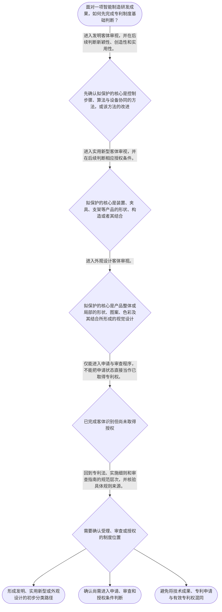

# 整合后的课程完整内容与习题

## 教学模块选择清单

- 当前教学节点：`patent-law-foundation`
- 板块预算：自适应 6/6，总计 9/9

| # | 模块 (block_type) | 类型 | 触发原因 (trigger) | 对应正文段 | 归属 |
|---:|---|:--:|---|---|:--:|
| 1 | `anchor_scenario` | 自适应 | perception=sensing(0.84) / cold_start | 智能产线的三项创新｜某智能制造企业准备发布一条电机装配产线。研发组提出三项成果：第一，利用相机识别装配偏差后自动… | [A] |
| 2 | `legal_anchor` | 必选 | mandatory | 制度基础的法条锚点｜《专利法》第二条 | [A] |
| 3 | `worked_example` | 自适应 | cold_start(low_confidence) | 机器视觉产线方案的分类演示｜某研发团队拟分别保护三项内容：通过视觉检测结果控制机器人补偿动作的方法、相机防振安装座的可调… | [A] |
| 4 | `decision_flow` | 自适应 | input=visual(0.81) | 智能制造成果的专利制度入口流程｜面对一项智能制造研发成果，如何先完成专利制度基础判断？ | [A] |
| 5 | `mnemonic` | 自适应 | understanding=sequential(0.73) | 客体与制度边界速记表｜三分两别表：方法看“发”，构造看“实”，外观看“设”；申请、授权两别，时间、地域两界。 | [A] |
| 6 | `reflect_prompt` | 自适应 | processing=reflective(0.66) | 从研发成果回看保护对象｜回顾你熟悉的一项智能制造研发成果：其中哪些内容是控制方法，哪些是产品构造，哪些只是产品视觉外… | [A] |
| 7 | `assessment` | 必选 | mandatory | 本节三类测评｜复习智能制造控制方法的专利客体分类。 | [A] |
| 8 | `knowledge_synthesis` | 必选 | mandatory | 专利法律制度基础框架｜基本属性：专利权具有独占性、时间性和地域性，不能理解为永久且全球有效的绝对权利。 | [A] |
| 9 | `summary_card` | 自适应 | len(knowledge_sub_nodes)=3>=3 | 专利制度基础速查卡｜专利基础判断先分对象、再分状态、后进实体审查：同一产线的不同创新点不能混为一种权利。 | [A] |

## 教学正文

## I — 法律问题

智能制造团队拟为机器视觉检测、机器人夹具或产线控制方案申请专利时，首先必须回答的不是“技术是否先进”，而是三个基础问题：该成果属于何种专利保护客体；专利制度为何赋予有限且有地域边界的权利；申请、审查和授权分别应在何种规范体系下理解。本节只建立制度基础，不对新颖性、创造性或侵权作完整实体判定。

## R — 适用规则

### 1. 专利保护的客体

《专利法》将“发明创造”界定为发明、实用新型和外观设计三类。发明是对产品、方法或者其改进提出的新的技术方案；实用新型是对产品形状、构造或者其结合提出的适于实用的新的技术方案；外观设计则是对产品整体或局部的形状、图案及其结合，或者色彩与形状、图案的结合所作出的富有美感并适于工业应用的新设计。〔RAG: 中华人民共和国专利法.txt — 第二条：发明创造是指发明、实用新型和外观设计〕

据此，智能制造中的“视觉缺陷识别方法、控制方法或其改进”应先按发明的产品、方法或改进型技术方案审视；“传感器安装支架、夹具的形状构造”应先按实用新型审视；“协作机器人外壳或控制面板的视觉外观”则可能进入外观设计审视。分类取决于申请人主张保护的对象和技术内容，不能仅按产品名称分类。

### 2. 专利权的基本属性

专利权具有独占性、时间性和地域性。独占性意味着授权后的实施控制具有排他性质；时间性意味着保护并非永久；地域性意味着权利效力须在授予该权利的法域内判断。上述三项是制度性特征；具体实施行为、期限和保护范围将在后续节点分别展开。本节不将“取得专利”误解为对任何国家、任何时间、任何技术方案的绝对控制。

### 3. 规范体系与机构分工

学习中国专利制度时，应按“专利法—专利法实施细则—专利审查指南”的层次定位规则：专利法提供基本制度和权利框架；实施细则承接程序性细节；审查指南用于审查规则的具体适用。本次检索上下文未提供实施细则和审查指南的原文，因此不对其具体条款作引述或扩张解释。

国务院专利行政部门负责管理全国专利工作，统一受理和审查专利申请并依法授予专利权；地方管理专利工作的部门负责本行政区域内的专利管理工作。〔RAG: 中华人民共和国专利法.txt — 第三条：统一受理和审查专利申请，依法授予专利权〕

### 4. 制度目的与程序位置

从制度功能看，专利制度通过以公开换取在法定条件和期间内的专有保护，连接激励发明创造、促进技术公开、推动技术应用和经济发展。该表述是本节点的制度性理解；检索上下文未提供《专利法》第一条原文，故不将其作为本节可核验的条文引述。

对于发明和实用新型，授权条件包括新颖性、创造性和实用性；现有技术是申请日前在国内外为公众所知的技术。〔RAG: 中华人民共和国专利法.txt — 第二十二条：授予专利权的发明和实用新型应当具备新颖性、创造性和实用性；现有技术是申请日以前在国内外为公众所知的技术〕 这说明本节的“客体分类”是进入后续授权条件判断的入口，不等同于已经满足授权条件。

中国专利制度中，申请公开与审查、授权并非同一时点；初步审查与实质审查也承担不同功能。关于“早期公开、延迟审查”以及不同专利类型审查程序的具体制度细节，本次检索上下文未提供直接依据，故仅作为后续程序学习的框架提示，不作具体期限或程序结论。

## A — 规则适用

以一条智能制造产线为例，应先把研发成果拆开：若团队主张的是“依据相机图像调整焊接参数的控制步骤”，对象是方法或其改进，优先落入发明的分析路径；若主张的是“用于固定相机的可调节支架结构”，对象是产品的形状、构造或结合，优先落入实用新型路径；若主张的是“示教器面板的局部图案与形状组合”，则优先落入外观设计路径。三个成果可以共同服务同一产线，却不因使用场景相同而成为同一种专利客体。

接着应区分“可作为申请对象”与“最终能够取得、维持并主张的专利权”。客体分类只回答申请保护的入口问题；发明和实用新型还要进入新颖性、创造性和实用性审查。后续进行侵权分析时，应先确认是否存在有效且在相关地域内有效的专利权，再讨论被控方案是否落入保护范围；不能把研发成果的技术先进性直接等同于侵权成立。

本节设有测评，请到【习题】区作答。

## C — 结论

专利制度基础的判断顺序是：先识别保护对象，再定位规范层级与主管机关，继而理解专利权的独占性、时间性和地域性，最后进入授权条件、权利范围与侵权等后续问题。对于智能制造方案，技术方案、产品构造和产品视觉外观必须分开分类、分开评价。

> 常见误区 / 易混淆点
>
> 1. 把“智能制造设备”整体称为一种专利客体。正确做法是按每项拟保护内容分别判断其是方法、产品构造还是视觉外观。
> 2. 把专利申请、公开、审查、授权混为同一个法律状态。它们属于不同程序环节，不能仅因已提交申请就当然认定已经取得排他权。
> 3. 把独占性理解为永久、全球有效的绝对垄断。专利权还受到期限和法域边界限制。
> 4. 把新颖性或侵权结论建立在“技术看起来不同或先进”的直觉上。后续必须分别依照授权条件和保护范围规则判断。

### 智能产线的三项创新（anchor_scenario）

> 某智能制造企业准备发布一条电机装配产线。研发组提出三项成果：第一，利用相机识别装配偏差后自动修正机器人轨迹的控制步骤；第二，用于固定相机的防振调节支架；第三，示教器面板上的局部图案与形状组合。负责人认为“都是产线创新，申请一个专利即可”，并计划在海外展会上先展示样机。法务人员需要先判断每项成果究竟要保护什么，以及申请、公开、审查和授权之间的关系。

**锚定**：该情境将同一智能制造项目拆分为方法、产品构造和产品视觉外观，锚定专利客体分类及制度流程边界。

**先想一想**：面对同一条产线中的三项成果，为什么不能仅凭“都很先进”就认定它们适用同一种专利保护？

### 制度基础的法条锚点（legal_anchor）

- **《专利法》第二条**：专利法上的发明创造分为发明、实用新型和外观设计；分类取决于要保护的内容。
- **《专利法》第三条**：国务院专利行政部门统一受理和审查专利申请，并依法授予专利权。
- **《专利法》第二十二条**：发明和实用新型即使属于可申请的客体，仍须满足新颖性、创造性和实用性。

**为何重要**：第二条解决“保护什么”，第三条提示“由谁受理和审查”，第二十二条说明“分类后仍要通过授权条件”。三者共同防止把技术成果、申请状态和授权专利权混为一谈。

### 机器视觉产线方案的分类演示（worked_example）

**案情/例题**：某研发团队拟分别保护三项内容：通过视觉检测结果控制机器人补偿动作的方法、相机防振安装座的可调节连接结构、以及设备外壳局部的图案和形状组合。待判定问题是：三项内容在申请前应分别进入何种专利客体的审视路径？
**适用规则**：《专利法》第二条：发明涉及产品、方法或者其改进的新的技术方案；实用新型涉及产品形状、构造或者其结合的适于实用的新的技术方案；外观设计涉及产品整体或局部的形状、图案及其结合等新设计。
**分步推演**：
1. 先抽取第一项的保护重点：其核心是“根据检测结果控制补偿动作的步骤”，而非某个支架或面板的外形。 → *控制步骤属于方法技术方案，应先按发明路径审视。*
2. 再抽取第二项的保护重点：其核心是安装座的可调节连接关系和防振结构，属于产品的形状、构造或者其结合。 → *安装座结构应先按实用新型路径审视。*
3. 最后抽取第三项的保护重点：其核心是设备外壳局部的视觉呈现，即图案与形状组合，而非内部控制功能。 → *外壳局部视觉设计应先按外观设计路径审视。*
4. 三项成果即使服务于同一产线，也要分别确定拟保护对象；分类完成后，发明和实用新型还须进入第二十二条规定的授权条件审查。 → *使用场景相同不改变客体分类，客体分类也不替代授权审查。*
**结论**：该项目至少包含可分别按发明、实用新型和外观设计审视的不同保护对象；应避免用一个笼统的“智能产线专利”概念替代具体客体判断。
**本题要点**：先写清每一项拟保护内容，再按“方法—构造—视觉外观”逐项分类，是专利分析的首个可执行步骤。

### 智能制造成果的专利制度入口流程（decision_flow）

**决策问题**：面对一项智能制造研发成果，如何先完成专利制度基础判断？



### 客体与制度边界速记表（mnemonic）

**记忆锚**：三分两别表：方法看“发”，构造看“实”，外观看“设”；申请、授权两别，时间、地域两界。
**映射**：
- 发
- 实
- 设
- 申请、授权两别
- 时间、地域两界
**何时用**：看到“某项智能制造创新能否申请”或“是否已经享有排他权”时，先用该表分清客体和权利状态。

### 从研发成果回看保护对象（reflect_prompt）

**反思问题**：回顾你熟悉的一项智能制造研发成果：其中哪些内容是控制方法，哪些是产品构造，哪些只是产品视觉外观？在提交申请前，哪些事实还必须另行核验？

**关注要点**：不要以产品名称替代拟保护内容的逐项拆分。；区分技术成果、申请文件、公开状态和授权专利权。；注意独占性并不消除时间性和地域性边界。；对于程序细节、期限和审查要求，应回到具体规范原文核验。

**连接**：连接到学习者已有的研发经验：将研发任务分解为控制逻辑、机械结构和工业设计，再对应不同法律分析入口。

### 专利法律制度基础框架（knowledge_synthesis）

**知识框架**：
- 基本属性：专利权具有独占性、时间性和地域性，不能理解为永久且全球有效的绝对权利。
- 规范体系：以专利法为基本制度框架，实施细则承接程序细节，审查指南用于具体审查适用；具体内容须核验原文。
- 保护客体：发明保护产品、方法或其改进的技术方案；实用新型保护产品形状、构造或其结合；外观设计保护产品视觉外观设计。
- 制度作用：以公开与保护的制度安排，服务激励创造、技术公开、技术应用与经济发展。
- 程序特点：申请、公开、审查和授权属于不同环节；关于公开、审查的具体制度细节应在后续程序节点依据原文学习。
**概念关系**：客体分类是后续申请文件、授权条件和保护范围分析的前提。；专利法提供基本规则，实施细则和审查指南承接程序与审查适用；具体结论应回到相应原文。；技术公开与有限期保护共同构成制度功能，但本节不替代后续新颖性、审查程序和侵权分析。
**必记**：同一智能制造项目可同时含发明、实用新型和外观设计客体，必须按拟保护内容分别分类。；发明和实用新型属于可申请客体后，仍须满足新颖性、创造性和实用性。；申请专利不等于已经取得专利权；权利状态必须结合授权及其时间、地域边界判断。

### 专利制度基础速查卡（summary_card）

**要点卡**：
- **三种保护客体**：方法或技术方案优先看发明，产品形状构造优先看实用新型，产品视觉外观优先看外观设计。
- **权利的三项属性**：专利权具有独占性，但同时受期限和地域限制。
- **规范体系**：专利法定基本制度，实施细则与审查指南承接具体程序和审查适用，结论须核验原文。
- **申请与授权**：申请、受理、审查和授权不是同一法律状态；提交申请不等于已取得专利权。
- **授权条件入口**：发明和实用新型在客体分类后，还须接受新颖性、创造性和实用性判断。
**必背**：《专利法》第二条的三类发明创造：发明、实用新型、外观设计。；发明和实用新型的授权条件包括新颖性、创造性和实用性。；先识别拟保护内容，再判断申请、授权和权利保护问题。
**一句话总结**：专利基础判断先分对象、再分状态、后进实体审查：同一产线的不同创新点不能混为一种权利。

### 本节三类测评（assessment）

**三类覆盖**：backward_review、forward_probe、weakness_probe
**题目**：
- q_foundation_review_l1：复习智能制造控制方法的专利客体分类。
- q_rights_forward_l1：探测下一节点中授权后专利权效力的基础认识。
- q_foundation_weakness_l3：综合区分同一产线中的方法、构造与视觉外观。


## 结构化数据

## expert

```json
"expert_a"
```

## style

```json
"conservative"
```

## knowledge_points

```json
[
  {
    "node_id": "patent-law-foundation",
    "kc_name": "专利制度的基本概念与特征：独占性、时间性、地域性"
  },
  {
    "node_id": "patent-law-foundation",
    "kc_name": "中国专利制度体系：专利法、专利法实施细则、专利审查指南"
  },
  {
    "node_id": "patent-law-foundation",
    "kc_name": "专利保护的三种客体：发明、实用新型、外观设计"
  },
  {
    "node_id": "patent-law-foundation",
    "kc_name": "专利制度的作用：激励创造、技术公开、技术应用与经济发展"
  },
  {
    "node_id": "patent-law-foundation",
    "kc_name": "中国专利制度的发展特点：早期公开、延迟审查、初步审查与实质审查并存"
  }
]
```

## legal_basis

```json
[
  {
    "article": "《中华人民共和国专利法》第二条",
    "source": "中华人民共和国专利法.txt：第二条"
  },
  {
    "article": "《中华人民共和国专利法》第三条",
    "source": "中华人民共和国专利法.txt：第三条"
  },
  {
    "article": "《中华人民共和国专利法》第二十二条",
    "source": "中华人民共和国专利法.txt：第二十二条"
  },
  {
    "article": "《中华人民共和国专利法》第十一条",
    "source": "教学上下文“专利权保护”知识点；检索上下文未提供该条原文"
  }
]
```

## risks

```json
[
  {
    "risk": "本次检索仅提供《专利法》第二条、第三条、第二十二条等原文，未提供实施细则、审查指南以及公开和审查程序具体条文；相关内容仅作框架提示，不应据此作期限或程序细节判断。",
    "related_node_id": "patent-law-foundation"
  },
  {
    "risk": "智能制造产品往往同时含控制方法、机械构造和视觉界面；若未先拆分拟保护对象，容易错误选择专利类型或混淆后续授权、侵权判断标准。",
    "related_node_id": "patent-law-foundation"
  },
  {
    "risk": "下一节点的专利权保护内容仅作L1探测，不能据探测结果认定已经掌握侵权、保护范围或救济规则。",
    "related_node_id": "patent-rights-protection"
  }
]
```

## draft_stage

```json
"debate"
```

## irac

```json
{
  "issue": "智能制造研发成果进入专利保护前，应如何识别专利客体、理解专利制度的基本属性和规范体系，并避免把申请、授权和侵权混为一谈？",
  "rule": "《专利法》第二条将发明创造分为发明、实用新型和外观设计，并分别界定其对象；第三条规定国务院专利行政部门统一受理、审查申请并依法授予专利权；第二十二条规定发明和实用新型授权须具备新颖性、创造性和实用性。",
  "application": "对机器视觉控制步骤、夹具结构和设备外观分别依第二条识别为方法技术方案、产品形状构造或产品视觉外观；分类后仍须进入相应申请、审查和授权环节。专利权不能因申请或技术先进而当然产生，也不能脱离时间和地域边界直接推定侵权。",
  "conclusion": "专利制度基础的核心是先分清保护对象，再分清规范、程序与权利状态；智能制造同一产品中的不同创新点可能对应不同专利客体，后续新颖性和侵权分析必须以此为前提。"
}
```

## interactive_questions

```json
[
  {
    "qid": "q_foundation_review_l1",
    "category": "understand",
    "difficulty": "L1",
    "source_tag": "backward_review",
    "kc_node_id": "patent-law-foundation",
    "question": "某企业拟保护一项“根据相机采集的焊缝图像自动调整焊接电流的步骤”。按照《专利法》第二条，该成果最应先按哪一类客体审视？",
    "answer": "A",
    "options": [
      "A. 发明，因为其属于对方法或者其改进提出的技术方案",
      "B. 实用新型，因为其用于工业生产",
      "C. 外观设计，因为其使用了工业相机",
      "D. 不属于任何发明创造，因为其含有软件步骤"
    ]
  },
  {
    "qid": "q_rights_forward_l1",
    "category": "remember",
    "difficulty": "L1",
    "source_tag": "forward_probe",
    "kc_node_id": "patent-rights-protection",
    "question": "仅作下一节点探测：关于发明和实用新型专利授权后的效力，下列说法正确的是哪一项？",
    "answer": "B",
    "options": [
      "A. 申请提交之日即当然禁止他人为生产经营目的实施",
      "B. 授权后，未经专利权人许可，不得为生产经营目的实施其专利",
      "C. 专利权一经授权即在全球范围当然有效",
      "D. 任何科研活动均当然构成专利侵权"
    ]
  },
  {
    "qid": "q_foundation_weakness_l3",
    "category": "analyze",
    "difficulty": "L3",
    "source_tag": "weakness_probe",
    "kc_node_id": "patent-law-foundation",
    "question": "甲公司为智能产线同时形成三项成果：一套根据传感器数据调节节拍的控制方法、一种防振安装座的结构、一套操作屏的局部图案。下列分类判断最准确的是哪一项？",
    "answer": "C",
    "options": [
      "A. 三项成果服务同一产线，只能作为一项发明申请",
      "B. 控制方法、安装座结构和操作屏图案均当然属于实用新型",
      "C. 控制方法可按发明路径审视，安装座结构可按实用新型路径审视，操作屏图案可按外观设计路径审视",
      "D. 只要包含数字控制技术，三项成果均不能受专利法保护"
    ]
  }
]
```

## knowledge_synthesis

```json
{
  "node": "patent-law-foundation",
  "coverage": [
    {
      "node_id": "patent-law-foundation"
    },
    {
      "node_id": "patent-law-foundation"
    },
    {
      "node_id": "patent-law-foundation"
    },
    {
      "node_id": "patent-law-foundation"
    },
    {
      "node_id": "patent-law-foundation"
    }
  ],
  "confusable_pairs": [
    {
      "pair": "专利申请与专利权：申请仅启动程序，不当然产生授权后的专有权。"
    },
    {
      "pair": "发明与实用新型：前者可保护产品、方法或改进的技术方案，后者限于产品形状、构造或其结合。"
    },
    {
      "pair": "同一智能制造产品与同一种专利客体：一个产品可含多个应分别分类的创新点。"
    }
  ]
}
```
