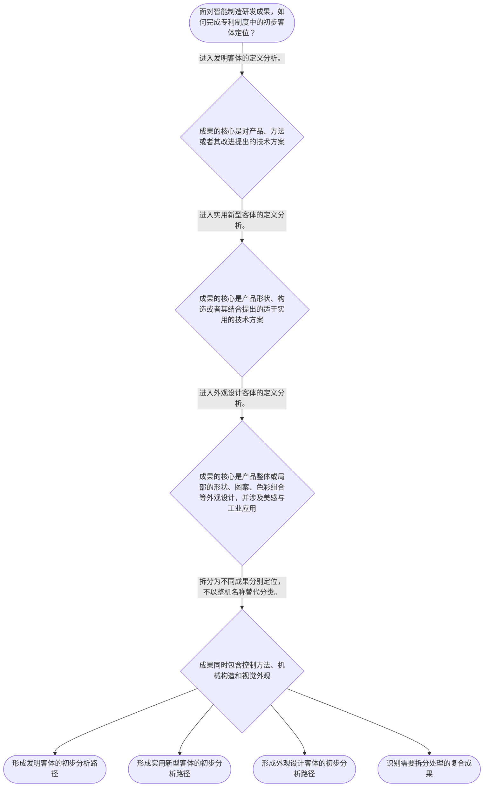

# 整合后的课程完整内容与习题

## 教学模块选择清单

- 当前教学节点：`patent-law-foundation`
- 板块预算：自适应 6/6，总计 9/9

| # | 模块 (block_type) | 类型 | 触发原因 (trigger) | 对应正文段 | 归属 |
|---:|---|:--:|---|---|:--:|
| 1 | `anchor_scenario` | 自适应 | perception=sensing(0.84) / cold_start | 智能工厂成果的第一道分类门｜一家智能制造企业准备发布协作机器人工作站。研发组交来三份材料：一份是根据视觉识别结果调整抓取… | [A] |
| 2 | `legal_anchor` | 必选 | mandatory | 法条锚定：三类发明创造与审查机关｜《专利法》第二条 | [A] |
| 3 | `worked_example` | 自适应 | cold_start(low_confidence) | 案例演示：协作机器人工作站的成果拆分｜某企业开发协作机器人工作站，形成以下成果：视觉系统根据工件位置自动生成抓取路线的控制流程；夹… | [A] |
| 4 | `decision_flow` | 自适应 | input=visual(0.81) | 可视化决策流程：先确定成果属于什么｜面对智能制造研发成果，如何完成专利制度中的初步客体定位？ | [A] |
| 5 | `mnemonic` | 自适应 | understanding=sequential(0.73) | 顺序记忆表：特征、规范、客体、功能、程序｜“特—规—客—功—程”五栏表：特征看独时地；规范看法细指；客体看发实外；功能看激励公开应用发… | [A] |
| 6 | `reflect_prompt` | 自适应 | processing=reflective(0.66) | 反思：把研发成果变成可分析的法律对象｜回顾你熟悉的一项智能制造研发成果：其中哪些内容是方法、哪些是产品构造、哪些仅涉及产品外观？在… | [A] |
| 7 | `assessment` | 必选 | mandatory | 三类测评闭环｜复习产品构造类成果的实用新型客体定位。 | [A] |
| 8 | `knowledge_synthesis` | 必选 | mandatory | 知识综合：专利法律制度的五层框架｜制度特征：独占性、时间性、地域性界定专利权的基本边界；具体权利效果须以后续权利保护规则为准。 | [A] |
| 9 | `summary_card` | 自适应 | len(knowledge_sub_nodes)=3>=3 | 速查卡：专利制度基础｜专利制度基础的核心顺序是：认清权利边界与规范体系，准确分类成果，再进入后续授权和保护判断。 | [A] |

## 教学正文

## I — 法律问题

智能制造研发团队面对一个技术成果时，首先不是直接判断“是否侵权”或“是否具有新颖性”，而是应先定位：该成果是否属于专利法上的发明创造、可能落入哪一类专利客体，以及后续应当依循何种规范和程序处理。本节仅建立这一制度入口；新颖性判断与侵权比对属于后续节点的具体问题。

## R — 适用规则

《专利法》第二条将“发明创造”界定为发明、实用新型和外观设计三类。发明是对产品、方法或者其改进提出的新的技术方案；实用新型是对产品形状、构造或者其结合提出的适于实用的新的技术方案；外观设计则是对产品整体或局部的形状、图案及其结合，或者色彩与形状、图案的结合所作出的富有美感并适于工业应用的新设计。〔RAG: 中华人民共和国专利法.txt — 第二条：发明创造是指发明、实用新型和外观设计〕

制度规范可按“法—细则—指南”理解：专利法提供基本权利义务与制度框架；实施细则细化程序；审查指南用于审查实践中的具体判断。国务院专利行政部门统一受理和审查专利申请，并依法授予专利权。〔RAG: 中华人民共和国专利法.txt — 第三条：统一受理和审查专利申请，依法授予专利权〕

专利制度具有三个基础边界：独占性意味着权利成立后具有排他实施的法律效力；时间性意味着保护并非永久；地域性意味着权利效力以授予国或地区的法域为界。上述特征是制度概念的归纳，本检索上下文未提供其逐项直接条文依据；本节不据此推导具体侵权结论。

专利制度以技术公开换取有限期间、有限地域内的专利保护，从而服务于激励发明创造、促进技术公开、推动技术应用和经济发展。关于“早期公开、延迟审查”以及初步审查制与实质审查制并存，本节仅作制度发展与程序地图定位；检索上下文未提供相应历史材料及程序细则原文，不能据此判断任何具体申请的审查状态。

## A — 规则适用

以智能工厂的协作机器人末端执行器为例，须先拆分成果，而不能把整套设备笼统称为“一项专利”。

第一步，识别技术方案的对象。若团队改进的是夹爪内部的传动结构、连接构造或其组合，重点应评估其是否符合实用新型所要求的“产品形状、构造或者其结合”。〔RAG: 中华人民共和国专利法.txt — 第二条：实用新型是指对产品的形状、构造或者其结合所提出的适于实用的新的技术方案〕

第二步，识别方法方案。若团队的贡献是机器人根据视觉检测结果动态调整抓取路径的控制流程，则对象可能是对“方法或者其改进”提出的技术方案，属于发明的制度分类范围。〔RAG: 中华人民共和国专利法.txt — 第二条：发明是指对产品、方法或者其改进所提出的新的技术方案〕

第三步，识别视觉设计。若团队仅改变了控制面板的图案、局部造型与色彩组合，并且该设计富有美感且适于工业应用，则应按外观设计的法定定义分析。〔RAG: 中华人民共和国专利法.txt — 第二条：外观设计包括产品整体或者局部的形状、图案及其结合等〕

第四步，进入正确的制度轨道。分类完成后，才可能进一步讨论申请、审查、授权条件、保护范围和侵权。不能以“设备投入生产”替代客体判断，也不能以“技术看起来新”直接代替后续的新颖性审查。

## C — 结论

本节点的稳定结论是：专利法律分析先做“制度定位”，再做“实体判断”。对智能制造成果，应先区分其是产品或方法技术方案、产品构造方案，还是产品外观设计；再依据专利法、实施细则和审查指南进入相应程序。新颖性与侵权判定均以前述定位为前提，但不在本节作出具体结论。

> 常见误区 / 易混淆点
>
> 1. 将“具有技术含量”直接等同于“必然可以获得发明专利”。法定客体分类与后续授权条件是不同层次的问题。
> 2. 将实用新型理解为任何“小改进”。其法定对象聚焦于产品的形状、构造或者其结合。
> 3. 将外观设计当作纯艺术作品保护。外观设计须针对产品外观，并满足富有美感、适于工业应用等法定表述。
> 4. 将初步审查与实质审查混为同一程序。二者的具体范围应在后续程序节点依据实施细则和审查指南分别学习。

本节设有测评，请到【习题】区作答。

### 智能工厂成果的第一道分类门（anchor_scenario）

> 一家智能制造企业准备发布协作机器人工作站。研发组交来三份材料：一份是根据视觉识别结果调整抓取路径的控制流程；一份是夹爪内部防松齿轮的连接构造；一份是操作终端的局部图案和色彩方案。市场部门急问：是否都能“申请专利”，法务部门则提醒，若不先分清成果种类，后续的新颖性检索、申请路径和侵权风险分析都会走错方向。

此时尚不能凭“技术先进”或“已经量产”下结论。首先必须看每项成果究竟属于产品或方法技术方案、产品构造方案，还是产品外观设计。

**锚定**：该情境锚定专利制度的入口问题：先识别法定保护客体，再进入后续授权和保护分析。

**先想一想**：面对同一套智能制造设备，为什么必须把控制流程、机械构造和视觉设计拆开分析？

### 法条锚定：三类发明创造与审查机关（legal_anchor）

- **《专利法》第二条**：专利法只把发明、实用新型和外观设计列为“发明创造”，且三类客体的对象和定义不同。
- **《专利法》第三条**：国务院专利行政部门统一受理、审查专利申请，并依法授予专利权。

**为何重要**：客体分类决定后续专利分析的起点；审查机关规则说明专利权须经法定申请与审查轨道形成，而非技术产生即自动取得。

### 案例演示：协作机器人工作站的成果拆分（worked_example）

**案情/例题**：某企业开发协作机器人工作站，形成以下成果：视觉系统根据工件位置自动生成抓取路线的控制流程；夹爪中防止振动松脱的齿轮连接构造；终端面板的局部几何图案与色彩组合。待判定问题是：三项成果应分别从哪类专利客体开始分析？
**适用规则**：《专利法》第二条：发明包括对产品、方法或者其改进提出的新的技术方案；实用新型聚焦产品形状、构造或者其结合；外观设计聚焦产品整体或局部外观设计。
**分步推演**：
1. 先将“控制流程”与有形机械部件分离。该流程描述的是基于视觉结果生成抓取路线的方法性技术方案。 → *控制流程应从发明客体的定义开始分析。*
2. 再看齿轮连接构造。其核心是产品内部部件之间的构造关系，而非单纯的操作方法或视觉效果。 → *连接构造应从实用新型客体的定义开始分析。*
3. 最后看终端面板的局部图案与色彩组合。该成果指向产品局部的视觉外观，并须结合美感和工业应用要求判断。 → *视觉设计应从外观设计客体的定义开始分析。*
4. 完成分类后，才可分别进入申请文件、审查条件和授权后保护范围等后续问题。 → *客体分类是后续新颖性与侵权分析的前置步骤。*
**结论**：该案例中，控制流程、连接构造和面板视觉设计应分别以发明、实用新型和外观设计的法定定义为分析起点；是否最终授权仍须进入后续法定条件审查。
**本题要点**：面对复合型智能制造产品，应按成果的技术内容拆分分类，而非按整机名称一次性定性。

### 可视化决策流程：先确定成果属于什么（decision_flow）

**决策问题**：面对智能制造研发成果，如何完成专利制度中的初步客体定位？



### 顺序记忆表：特征、规范、客体、功能、程序（mnemonic）

**记忆锚**：“特—规—客—功—程”五栏表：特征看独时地；规范看法细指；客体看发实外；功能看激励公开应用发展；程序看公开与审查轨道。
**映射**：
- 特
- 规
- 客
- 功
- 程
**何时用**：看到智能制造成果或专利实务问题时，先按五栏完成制度定位，再进入具体授权条件或侵权问题。

### 反思：把研发成果变成可分析的法律对象（reflect_prompt）

**反思问题**：回顾你熟悉的一项智能制造研发成果：其中哪些内容是方法、哪些是产品构造、哪些仅涉及产品外观？在尚未检索和申请前，哪些结论不能提前作出？

**关注要点**：成果的技术内容是否已被拆分，而非被整机名称掩盖。；客体分类与新颖性、创造性、实用性等后续授权条件是否被区分。；技术成果、专利申请与已经取得的专利权是否被区分。；初步审查和实质审查的具体法律效果是否需要等待后续节点的规范依据。

**连接**：连接你的理工研发经验：先定义工程对象和边界条件，再选择验证方法；专利分析同样先做对象定位。

### 知识综合：专利法律制度的五层框架（knowledge_synthesis）

**知识框架**：
- 制度特征：独占性、时间性、地域性界定专利权的基本边界；具体权利效果须以后续权利保护规则为准。
- 规范体系：专利法提供基本框架，实施细则细化程序，审查指南服务具体审查实践。
- 保护客体：发明、实用新型、外观设计是《专利法》第二条规定的三类发明创造。
- 制度功能：以技术公开和法定保护的制度安排，服务于激励创造、技术应用与经济发展。
- 程序地图：早期公开、延迟审查以及初步审查与实质审查的区分构成后续学习线索，本节不扩张解释其具体法律效果。
**概念关系**：客体分类是后续申请文件、审查路径以及新颖性判断的前提。；专利法提供基本规则，实施细则和审查指南使程序与审查判断具体化。；制度特征界定权利边界，制度功能解释为何以公开与保护相结合。
**必记**：先识别专利客体，再讨论授权条件、保护范围和侵权。；发明可以针对产品、方法或者其改进；实用新型聚焦产品形状、构造或者其结合；外观设计聚焦产品外观设计。；专利申请由国务院专利行政部门统一受理和审查，并依法授予专利权。

### 速查卡：专利制度基础（summary_card）

**要点卡**：
- **独占性、时间性、地域性**：三项特征共同界定专利权并非无限、永久或全球当然有效。
- **法—细则—指南**：专利法定框架，实施细则细化程序，审查指南辅助具体审查判断。
- **发明**：针对产品、方法或者其改进提出的新的技术方案。
- **实用新型**：针对产品形状、构造或者其结合提出的适于实用的新的技术方案。
- **外观设计**：针对产品整体或局部外观形成、富有美感并适于工业应用的新设计。
- **制度功能与程序地图**：制度旨在激励创造和促进应用；公开与审查的具体机制须在后续程序节点细化。
**必背**：《专利法》第二条规定的发明创造包括发明、实用新型和外观设计。；先分客体，后审条件；先定制度位置，后谈新颖性和侵权。；国务院专利行政部门统一受理和审查专利申请，并依法授予专利权。
**一句话总结**：专利制度基础的核心顺序是：认清权利边界与规范体系，准确分类成果，再进入后续授权和保护判断。

### 三类测评闭环（assessment）

**三类覆盖**：backward_review、forward_probe、weakness_probe
**题目**：
- q_foundation_review_01：复习产品构造类成果的实用新型客体定位。
- q_protection_probe_01：仅探测下一节点中授权后专利权保护的基本命题。
- q_foundation_weakness_01：综合区分方法、产品构造与产品外观三类成果。


## 结构化数据

## expert

```json
"expert_a"
```

## style

```json
"conservative"
```

## knowledge_points

```json
[
  {
    "node_id": "patent-law-foundation",
    "kc_name": "专利制度的基本特征：独占性、时间性与地域性"
  },
  {
    "node_id": "patent-law-foundation",
    "kc_name": "中国专利制度的规范体系：专利法、实施细则与审查指南"
  },
  {
    "node_id": "patent-law-foundation",
    "kc_name": "专利保护客体：发明、实用新型与外观设计"
  },
  {
    "node_id": "patent-law-foundation",
    "kc_name": "专利制度的功能及早期公开、延迟审查与审查制度并存的制度特点"
  }
]
```

## legal_basis

```json
[
  {
    "article": "《中华人民共和国专利法》第二条",
    "source": "中华人民共和国专利法.txt：第二条"
  },
  {
    "article": "《中华人民共和国专利法》第三条",
    "source": "中华人民共和国专利法.txt：第三条"
  },
  {
    "article": "《中华人民共和国专利法》第二十二条",
    "source": "中华人民共和国专利法.txt：第二十二条；仅作为后续新颖性学习的制度定位，不作为本节主教学内容"
  },
  {
    "article": "《中华人民共和国专利法》第十一条",
    "source": "检索上下文未提供该条原文；仅用于教学上下文指定的“专利权保护”向前探测，不展开讲授"
  }
]
```

## risks

```json
[
  {
    "risk": "把发明、实用新型、外观设计的客体分类，与新颖性、创造性、实用性的授权条件混作同一判断。",
    "related_node_id": "patent-law-foundation"
  },
  {
    "risk": "将“技术方案”或“投入使用”的事实，误当作已经取得专利权或当然具有排他效力。",
    "related_node_id": "patent-rights-nature"
  },
  {
    "risk": "对早期公开、延迟审查及初步审查、实质审查的具体法律效果作出超出本节检索依据的推断。",
    "related_node_id": "patent-system-overview"
  }
]
```

## draft_stage

```json
"debate"
```

## irac

```json
{
  "issue": "智能制造成果应如何在专利制度中完成初步定位，并为后续新颖性和侵权问题建立正确的分析起点？",
  "rule": "《专利法》第二条规定发明创造包括发明、实用新型和外观设计，并分别界定三类客体；第三条规定国务院专利行政部门统一受理和审查专利申请，依法授予专利权。",
  "application": "对机器人夹爪构造、机器人控制方法和控制面板视觉设计，应分别按第二条关于实用新型、发明和外观设计的定义识别对象；完成分类后，才进入相应申请、审查和后续权利分析。",
  "conclusion": "专利法律分析应先完成客体与制度定位，不得以笼统的技术先进性替代法定分类，也不得在本节点越过后续程序直接作出新颖性或侵权结论。"
}
```

## interactive_questions

```json
[
  {
    "qid": "q_foundation_review_01",
    "category": "understand",
    "difficulty": "L1",
    "source_tag": "backward_review",
    "kc_node_id": "patent-law-foundation",
    "question": "某企业研发了用于机器人夹爪的可更换齿轮组件，其主张的改进仅在于齿轮组件的连接构造。按照《专利法》第二条，该成果最应优先考虑归入哪类专利客体？",
    "answer": "B",
    "options": [
      "A. 外观设计，因为该组件安装在产品上",
      "B. 实用新型，因为其涉及产品的构造",
      "C. 发明，因为所有机器人技术都属于发明",
      "D. 不属于发明创造，因为齿轮组件可以制造"
    ]
  },
  {
    "qid": "q_protection_probe_01",
    "category": "remember",
    "difficulty": "L1",
    "source_tag": "forward_probe",
    "kc_node_id": "patent-rights-protection",
    "question": "以下哪一项最准确表述专利权保护节点中需要进一步学习的核心内容？",
    "answer": "C",
    "options": [
      "A. 只要提交专利申请，即当然可以排除他人实施",
      "B. 任何技术成果均享有永久且全球有效的专利权",
      "C. 发明和实用新型授权后，未经许可不得为生产经营目的实施其专利",
      "D. 外观设计的保护范围一律以文字权利要求为准"
    ]
  },
  {
    "qid": "q_foundation_weakness_01",
    "category": "analyze",
    "difficulty": "L3",
    "source_tag": "weakness_probe",
    "kc_node_id": "patent-law-foundation",
    "question": "某智能制造企业同时形成三项成果：甲为机器视觉定位的控制流程；乙为传送装置的防松连接构造；丙为工业平板终端局部图案与色彩设计。下列分类方案正确的是哪一项？",
    "answer": "A",
    "options": [
      "A. 甲可按发明的对象分析，乙可按实用新型的对象分析，丙可按外观设计的对象分析",
      "B. 甲、乙、丙均只能按发明的对象分析",
      "C. 甲、乙、丙均只能按实用新型的对象分析",
      "D. 甲、乙、丙均不属于专利法所称的发明创造"
    ]
  }
]
```

## knowledge_synthesis

```json
{
  "node": "patent-law-foundation",
  "coverage": [
    {
      "node_id": "patent-rights-nature"
    },
    {
      "node_id": "patent-law-framework"
    },
    {
      "node_id": "patent-law-foundation"
    },
    {
      "node_id": "patent-system-overview"
    }
  ],
  "confusable_pairs": [
    {
      "pair": "专利客体分类与授权条件：前者回答成果属于何种法定对象，后者回答该对象能否满足后续授权门槛，二者不得混同。"
    },
    {
      "pair": "技术成果与专利权：研发完成或投入使用不等于已经取得专利权，专利权须经法定申请、审查和授予。"
    },
    {
      "pair": "初步审查与实质审查：二者均属程序地图，但具体适用范围与法律效果须在后续节点依据实施细则和审查指南区分。"
    }
  ]
}
```
