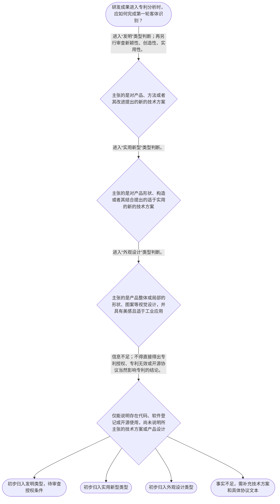

# 整合后的课程完整内容与习题

## 教学模块选择清单

- 当前教学节点：`patent-law-foundation`
- 板块预算：自适应 6/6，总计 9/9

| # | 模块 (block_type) | 类型 | 触发原因 (trigger) | 对应正文段 | 归属 |
|---:|---|:--:|---|---|:--:|
| 1 | `anchor_scenario` | 自适应 | perception=sensing(0.81) / P(L)=0.15<0.3 / cold_start | 从一个软件研发项目看三类权利问题｜甲公司研发了一套用于工业设备故障预警的软件：团队编写了源代码，训练了参数模型，并把部分通用工… | [A] |
| 2 | `legal_anchor` | 必选 | mandatory | 法条锚点：三类发明创造与授权门槛｜《中华人民共和国专利法》第二条 | [A] |
| 3 | `worked_example` | 自适应 | cold_start(low_confidence) | 演示：软件诊断方案的第一层分类｜乙团队开发了一个用于工厂泵机故障诊断的方案：采集振动数据，经一组处理步骤输出维修建议；团队同… | [A] |
| 4 | `decision_flow` | 自适应 | input=visual(0.78) | 专利基础分类决策流程｜研发成果进入专利分析时，应如何完成第一轮客体识别？ | [A] |
| 5 | `mnemonic` | 自适应 | understanding=sequential(0.73) | 分类记忆表：发、实、外；类、审、分｜分类记忆表：“发—产品/方法/改进的技术方案；实—产品形状构造；外—产品视觉设计”。判断顺序… | [A] |
| 6 | `predict_activate` | 自适应 | processing=active(0.62) | 先预测：代码是否等于专利客体｜某项目已完成源代码并登记软件著作权。请先预测：这一事实本身能否直接决定其取得发明专利？ | [A] |
| 7 | `assessment` | 必选 | mandatory | 基础分类与体系探测测评｜复习专利法所称发明创造的三类法定类型。 | [A] |
| 8 | `knowledge_synthesis` | 必选 | mandatory | 专利法律制度基础框架｜权利特征：专利制度具有独占性、时间性和地域性；具体范围与期限须依后续规则确认。 | [A] |
| 9 | `summary_card` | 自适应 | len(knowledge_sub_nodes)=3>=3 | 专利制度基础速查卡｜专利基础判断的顺序是：先依第二条识别客体，再审授权条件，最后把专利、软件著作权与开源许可分别… | [A] |

## 教学正文

## I — 法律问题

本节点先解决一个基础定位问题：研发成果进入专利制度时，首先应识别其是否属于法定的发明创造类型，并理解专利权为何具有独占性、时间性和地域性。对算法、开源代码和软件著作权的具体边界，本节只建立判断入口，不提前替代后续关于专利法律体系、专利客体和相关法律的专门判断。

## R — 适用规则

《专利法》所称发明创造包括发明、实用新型和外观设计。发明是对产品、方法或者其改进提出的新的技术方案；实用新型是对产品的形状、构造或者其结合提出的适于实用的新的技术方案；外观设计则是对产品整体或局部的形状、图案及其结合，或者色彩与形状、图案结合所作出的富有美感并适于工业应用的新设计。〔RAG: 中华人民共和国专利法.txt — 第二条：发明创造是指发明、实用新型和外观设计〕

可按以下五层建立制度框架：

1. **权利特征**：独占性表示权利经授权后具有排他实施的法律效果；时间性表示保护不是永久的；地域性表示保护效力受授予国或地区法律边界限制。本节不展开具体权利期限与侵权判断。
2. **规范体系**：专利法提供基本制度与实体规则，专利法实施细则承接程序性细化，专利审查指南用于审查标准的具体适用。三者不是可以互相替代的文件层级，而是“法律—细化规则—审查适用”的结构。
3. **三类保护客体**：区分发明、实用新型和外观设计时，先看方案针对的是产品或方法的技术方案、产品的形状构造，还是产品视觉设计。
4. **制度功能**：专利制度以公开换取在法定范围内的专有保护，旨在激励发明创造，并促进技术公开、应用和经济发展。
5. **程序轮廓**：中国制度存在申请公开与审查的阶段区分；初步审查制与实质审查制并存。其具体适用对象、程序条件和时间节点，须在后续程序节点依据相应规范进一步确认；本次检索上下文未提供这些细节的直接条文依据。

对于发明和实用新型，授权还须具备新颖性、创造性和实用性；其中，现有技术是申请日以前在国内外为公众所知的技术。〔RAG: 中华人民共和国专利法.txt — 第二十二条：授予专利权的发明和实用新型应当具备新颖性、创造性和实用性〕这一规则在本节仅用于说明“客体分类”不等于“当然能授权”。

## A — 规则适用

以一个软件研发成果为例，应当按顺序拆分，而不能把“有代码”“登记软著”“采用开源组件”直接等同于“有专利”或“不能申请专利”。

第一步，识别保护对象：若主张的是对产品、方法或其改进的技术方案，才可能进入《专利法》第二条中“发明”的类型判断；若主张的是产品的形状、构造或其结合，才转入实用新型的类型判断；若主张的是产品视觉外观，才转入外观设计判断。〔RAG: 中华人民共和国专利法.txt — 第二条对三类发明创造的定义〕

第二步，分开“类型”与“授权条件”：即使某方案可被描述为方法，也仍要接受新颖性、创造性、实用性等后续审查，不能仅凭其属于软件或算法相关研发便得出授权结论。〔RAG: 中华人民共和国专利法.txt — 第二十二条规定发明和实用新型的三项授权条件〕

第三步，分开不同法律问题：软件著作权通常围绕代码等作品表达，专利则围绕法定发明创造及其授权条件；开源协议则主要是使用、复制、修改、分发等许可条件问题。三者可能同时出现在同一项目中，但具体权利边界、算法专利性与开源协议中的专利条款，需要在后续“相关法律”“专利法律体系”和专利实质条件节点依据相应文本分别判断。本次检索上下文未提供软件著作权法或具体开源协议条款，不能据此断言某一开源协议必然授予、放弃或限制专利权。

## C — 结论

专利制度基础的首要结论是：先按《专利法》第二条识别发明、实用新型或外观设计，再判断相应授权条件；“软件”“算法”“源码公开”都不是脱离具体技术方案和法律文件即可作出结论的标签。专利、软件著作权和开源许可可以交叉出现，但分别回答不同问题，必须避免混为同一项权利。

> 常见误区 / 易混淆点
>
> - 把“登记了软件著作权”误认为“自动获得专利”：二者保护对象与取得条件不同。
> - 把“技术方案属于发明类型”误认为“必然授权”：发明和实用新型还须满足新颖性、创造性、实用性。〔RAG: 中华人民共和国专利法.txt — 第二十二条〕
> - 把“使用开源代码”直接推导为“不能申请专利”或“当然拥有专利许可”：必须逐份核对具体开源协议及项目事实；本节检索材料未提供此类协议条款。
> - 将现有技术、抵触申请和宽限期的具体判断提前混入本节：这些属于后续实体审查边界问题，应以申请日、公开事实和法定条件为中心另行分析。

本节设有测评，请到【习题】区作答。

### 从一个软件研发项目看三类权利问题（anchor_scenario）

> 甲公司研发了一套用于工业设备故障预警的软件：团队编写了源代码，训练了参数模型，并把部分通用工具组件放入开源仓库。公司准备为软件登记著作权，同时希望保护其诊断方法，还担心开源组件会影响未来融资和专利布局。研发负责人把“代码、算法、开源、专利”当作同一件事，要求法务给出一个结论。

此时不能直接回答“能不能申请”。应先把项目事实拆开：代码表达、可能的技术方法、产品外观，以及开源协议中的许可条件，分别属于不同的判断入口。

**锚定**：该情境锚定“专利客体识别”与“专利、软件著作权、开源许可不能混同”的基础边界。

**先想一想**：面对同一软件项目，哪些事实是在说明代码表达，哪些事实可能是在说明产品或方法的技术方案？

### 法条锚点：三类发明创造与授权门槛（legal_anchor）

- **《中华人民共和国专利法》第二条**：专利法把可讨论的发明创造分为发明、实用新型、外观设计；三类对象的定义不同，不能按“是否有软件代码”直接分类。
- **《中华人民共和国专利法》第二十二条**：发明和实用新型即使属于法定类型，仍须满足新颖性、创造性和实用性，类型判断不是授权结论。

**为何重要**：第二条是识别专利保护客体的起点，第二十二条说明客体归类后仍有授权门槛。二者共同防止把“可以讨论专利”误解为“当然获得专利”。

### 演示：软件诊断方案的第一层分类（worked_example）

**案情/例题**：乙团队开发了一个用于工厂泵机故障诊断的方案：采集振动数据，经一组处理步骤输出维修建议；团队同时保存了实现该方案的源代码。现阶段仅需判断：该项目能否直接仅因“有源代码”而被归为《专利法》第二条中的某一专利类型？
**适用规则**：《中华人民共和国专利法》第二条：发明是对产品、方法或者其改进所提出的新的技术方案；实用新型针对产品的形状、构造或者其结合；外观设计针对产品的视觉设计。
**分步推演**：
1. 先把“源代码”与“诊断处理步骤”分离。源代码是实现载体，不能单独替代对专利法保护客体的识别。 → *不能以是否存在代码直接定性专利类型。*
2. 诊断方案主张的若是对数据处理步骤及其技术效果的安排，应首先按照“方法或者其改进所提出的新的技术方案”的方向核查，而不是按照产品形状构造或视觉设计分类。 → *可能进入“发明”的类型判断入口。*
3. 即使暂按发明方向理解，仍不能跳过新颖性、创造性和实用性的后续要求；本例也未提供足以判断这些条件的事实。 → *客体初步归类不等于授权。*
**结论**：乙团队不能仅因拥有源代码而当然取得或当然不取得专利；应先围绕其主张的技术方案进行发明类型识别，再进入后续授权条件审查。
**本题要点**：面对软件项目，先分离代码载体与技术方案，再依第二条进行客体分类，最后才讨论授权条件。

### 专利基础分类决策流程（decision_flow）

**决策问题**：研发成果进入专利分析时，应如何完成第一轮客体识别？



### 分类记忆表：发、实、外；类、审、分（mnemonic）

**记忆锚**：分类记忆表：“发—产品/方法/改进的技术方案；实—产品形状构造；外—产品视觉设计”。判断顺序为“类、审、分”：先分类，再审授权条件，再分清专利、著作权和协议问题。
**映射**：
- 发
- 实
- 外
- 类
- 审
- 分
**何时用**：看到“算法、代码、软著、开源是否能申请专利”等混合表述时，先按“类、审、分”逐项拆开。

### 先预测：代码是否等于专利客体（predict_activate）

**预测/激活**：某项目已完成源代码并登记软件著作权。请先预测：这一事实本身能否直接决定其取得发明专利？

**激活旧知**：激活研发经验中对“技术实现”“代码表达”和“权利取得条件”并不相同的直觉。

**揭晓方向**：先不要看是否有代码；先看第二条要求识别的对象，再看是否还存在第二十二条规定的授权门槛。

### 专利法律制度基础框架（knowledge_synthesis）

**知识框架**：
- 权利特征：专利制度具有独占性、时间性和地域性；具体范围与期限须依后续规则确认。
- 规范体系：专利法规定基本制度，实施细则承接程序细化，审查指南提供审查适用标准。
- 三类客体：发明聚焦产品、方法或改进的技术方案；实用新型聚焦产品形状构造；外观设计聚焦产品视觉设计。
- 制度功能：通过公开与专有保护的制度安排，激励发明创造并促进技术应用。
- 程序轮廓：申请公开与审查存在阶段区分，初步审查制与实质审查制并存；具体规则留待后续节点。
**概念关系**：先识别制度目标与权利特征，再定位规范体系，继而按第二条分类具体成果。；客体分类在前，授权条件审查在后；跨制度问题须在确定专利客体后分别核对相关法律和协议。；程序阶段的理解服务于后续申请、公开和审查节点，不替代本节点的客体分类。
**必记**：《专利法》第二条规定的发明创造包括发明、实用新型和外观设计。；属于法定客体不等于当然授权；发明和实用新型还须具备新颖性、创造性和实用性。；软件著作权、专利与开源许可分别涉及不同保护对象或法律关系，不能仅凭“有代码”或“开源”作出专利结论。

### 专利制度基础速查卡（summary_card）

**要点卡**：
- **三类客体**：发明、实用新型、外观设计是《专利法》第二条规定的三类发明创造。
- **发明**：看产品、方法或者其改进所提出的新的技术方案。
- **实用新型**：看产品的形状、构造或者其结合所提出的适于实用的新的技术方案。
- **外观设计**：看产品整体或局部的视觉设计、美感和工业应用。
- **客体与授权**：先判是否属于法定客体；发明和实用新型还要过新颖性、创造性、实用性。
- **三类法律问题**：专利看技术方案及授权条件，软件著作权看作品表达，开源许可看具体协议条件。
**必背**：发明创造包括发明、实用新型和外观设计。；发明和实用新型的授权条件包括新颖性、创造性和实用性。；先分类，再审条件，再分清不同法律问题。
**一句话总结**：专利基础判断的顺序是：先依第二条识别客体，再审授权条件，最后把专利、软件著作权与开源许可分别处理。

### 基础分类与体系探测测评（assessment）

**三类覆盖**：backward_review、forward_probe、weakness_probe
**题目**：
- q_foundation_01：复习专利法所称发明创造的三类法定类型。
- q_framework_01：探测下一节点中专利规范体系的核心构成。
- q_foundation_weak_01：辨析软件源代码、技术方案与后续授权条件的关系。


## 结构化数据

## expert

```json
"expert_a"
```

## style

```json
"conservative"
```

## knowledge_points

```json
[
  {
    "node_id": "patent-law-foundation",
    "kc_name": "专利制度的基本概念与特征：独占性、时间性、地域性"
  },
  {
    "node_id": "patent-law-foundation",
    "kc_name": "中国专利制度体系：专利法、专利法实施细则、专利审查指南"
  },
  {
    "node_id": "patent-law-foundation",
    "kc_name": "专利保护的三种客体：发明、实用新型、外观设计"
  },
  {
    "node_id": "patent-law-foundation",
    "kc_name": "专利制度的作用：激励发明创造、促进技术公开、推动技术应用和经济发展"
  },
  {
    "node_id": "patent-law-foundation",
    "kc_name": "中国专利制度发展历程与特点：早期公开延迟审查、初步审查制与实质审查制并存"
  }
]
```

## legal_basis

```json
[
  {
    "article": "《中华人民共和国专利法》第二条",
    "source": "中华人民共和国专利法.txt：第二条"
  },
  {
    "article": "《中华人民共和国专利法》第二十二条",
    "source": "中华人民共和国专利法.txt：第二十二条"
  }
]
```

## risks

```json
[
  {
    "risk": "将《专利法》第二条规定的三类发明创造与后续授权条件混同，误以为属于某一类型即当然授权。",
    "related_node_id": "patent-law-foundation"
  },
  {
    "risk": "将软件著作权、专利权和开源协议的许可效果视为同一法律问题，未核对具体法律或协议文本。",
    "related_node_id": "patent-law-foundation"
  },
  {
    "risk": "在缺少直接检索依据时，过早对算法可专利性、开源协议专利许可或宽限期作确定性结论。",
    "related_node_id": "patent-law-foundation"
  }
]
```

## draft_stage

```json
"debate"
```

## irac

```json
{
  "issue": "研发成果，特别是软件或算法相关成果，进入专利制度时，应如何先识别专利保护客体，并与软件著作权、开源许可问题作基础区分？",
  "rule": "《专利法》第二条将发明创造分为发明、实用新型和外观设计，并分别界定其对象；第二十二条规定发明和实用新型的授权还须具备新颖性、创造性和实用性。",
  "application": "对软件项目不能仅依据“有代码”“已开源”或“已登记软著”判断专利结果，而应先识别其所主张的是产品、方法或改进的技术方案、产品形状构造，还是产品视觉设计；属于发明类型的方案还要进入后续三性判断。具体开源协议效果须以协议文本为依据。",
  "conclusion": "本节点的正确起点是“先分客体，再审条件，再分法律问题”。软件著作权、专利和开源许可可以并存，但不能相互替代或当然推导。"
}
```

## interactive_questions

```json
[
  {
    "qid": "q_foundation_01",
    "category": "remember",
    "difficulty": "L1",
    "source_tag": "backward_review",
    "kc_node_id": "patent-law-foundation",
    "question": "根据《专利法》第二条，下列关于专利法所称“发明创造”的表述，正确的是哪一项？",
    "answer": "A",
    "options": [
      "A. 发明创造包括发明、实用新型和外观设计",
      "B. 发明创造仅包括具有工业化生产价值的发明",
      "C. 发明创造包括软件著作权登记的全部作品",
      "D. 发明创造仅包括产品的外观设计"
    ]
  },
  {
    "qid": "q_framework_01",
    "category": "remember",
    "difficulty": "L1",
    "source_tag": "forward_probe",
    "kc_node_id": "patent-law-framework",
    "question": "下列哪一组最符合中国专利制度核心规范体系的基本构成？",
    "answer": "B",
    "options": [
      "A. 专利法、商标法、公司法",
      "B. 专利法、专利法实施细则、专利审查指南",
      "C. 著作权法、反不正当竞争法、民法典",
      "D. 刑法、行政诉讼法、专利代理条例"
    ]
  },
  {
    "qid": "q_foundation_weak_01",
    "category": "understand",
    "difficulty": "L2",
    "source_tag": "weakness_probe",
    "kc_node_id": "patent-law-foundation",
    "question": "某团队开发了用于设备故障诊断的软件，并已完成源代码。仅依据本节所学及《专利法》第二条，最稳妥的判断是哪一项？",
    "answer": "C",
    "options": [
      "A. 只要存在源代码，就当然取得发明专利权",
      "B. 只要软件可以运行，就当然属于实用新型",
      "C. 应先判断其是否构成对产品、方法或其改进提出的新的技术方案；即使属于发明类型，仍需进行后续授权条件判断",
      "D. 软件项目一旦使用开源组件，就当然不得申请任何专利"
    ]
  }
]
```

## knowledge_synthesis

```json
{
  "node": "patent-law-foundation",
  "coverage": [
    {
      "node_id": "patent-rights-nature"
    },
    {
      "node_id": "patent-law-framework"
    },
    {
      "node_id": "patent-law-foundation"
    },
    {
      "node_id": "patent-system-overview"
    }
  ],
  "confusable_pairs": [
    {
      "pair": "专利法定客体与专利授权条件：前者回答属于哪一类发明创造，后者回答能否获授权。"
    },
    {
      "pair": "软件著作权与发明专利：前者通常关注作品表达，后者须先识别法定技术方案及授权条件。"
    },
    {
      "pair": "开源协议许可与专利权：前者的具体法律效果必须依据相应协议条款，不能从“开源”标签直接推定。"
    }
  ]
}
```
