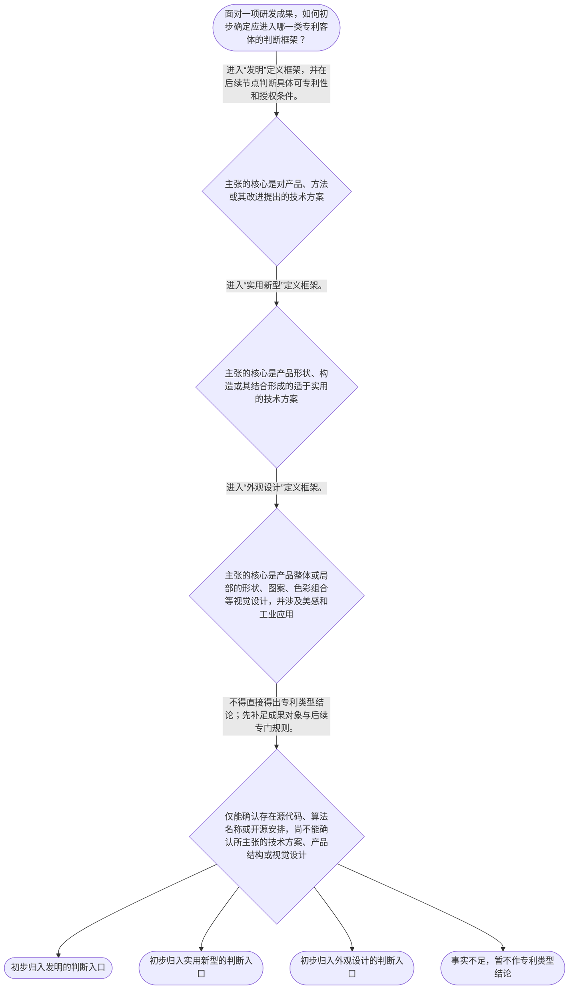

# 整合后的课程完整内容与习题

## 教学模块选择清单

- 当前教学节点：`patent-law-foundation`
- 板块预算：自适应 6/6，总计 9/9

| # | 模块 (block_type) | 类型 | 触发原因 (trigger) | 对应正文段 | 归属 |
|---:|---|:--:|---|---|:--:|
| 1 | `anchor_scenario` | 自适应 | perception=sensing(0.81) / cold_start | 从一套智能仓储方案看三类保护对象｜某研发团队完成智能仓储机器人项目：工程师设计了控制机器人避障与抓取的技术方法，机械人员改进了… | [A] |
| 2 | `legal_anchor` | 必选 | mandatory | 法条锚定：三类发明创造的法定定义｜《中华人民共和国专利法》第二条 | [A] |
| 3 | `worked_example` | 自适应 | cold_start(low_confidence) | 演示：将研发成果逐项放入法定分类框架｜某团队提出三项拟保护成果：第一，依据传感器数据调整仓储机器人抓取路径的控制方法；第二，一种通… | [A] |
| 4 | `decision_flow` | 自适应 | input=visual(0.78) | 保护对象的三步分类流程｜面对一项研发成果，如何初步确定应进入哪一类专利客体的判断框架？ | [A] |
| 5 | `mnemonic` | 自适应 | understanding=sequential(0.73) | 分类与特征记忆表｜“独时地—法细指—发实外”分类表：独时地记专利权特征；法细指记核心规范层次；发实外记三类发明… | [A] |
| 6 | `predict_activate` | 自适应 | processing=active(0.62) | 先预测：源代码是否决定专利类型｜一个项目既有源代码，又有机械结构改进和产品外观图案。你预测：仅凭“项目含有源代码”，能否直接… | [A] |
| 7 | `assessment` | 必选 | mandatory | 本节点三类测评｜复习《专利法》第二条中三类发明创造的基本定义。 | [A] |
| 8 | `knowledge_synthesis` | 必选 | mandatory | 专利法律制度基础框架｜专利权特征：以独占性、时间性、地域性说明专利权不是无限、全球当然有效的权利。 | [A] |
| 9 | `summary_card` | 自适应 | len(knowledge_sub_nodes)=3>=3 | 专利制度基础速查卡｜专利制度基础的核心不是先问“有没有代码”，而是先问“要保护的对象究竟是什么”。 | [A] |

## 教学正文

## I — 法律问题

本节点先解决一个基础定位问题：面对研发成果时，如何在中国专利制度的框架内，先识别专利权的基本特征，并区分发明、实用新型与外观设计三类保护客体。对“算法能否申请专利”“开源会不会影响专利”“软件著作权与专利如何并存”等后续问题，本节只建立判断入口，不在本节点作出具体可专利性或合同效力结论。

## R — 适用规则

1. **三类专利客体。**《专利法》所称发明创造包括发明、实用新型和外观设计；其中，发明是对产品、方法或者其改进提出的新的技术方案，实用新型是对产品形状、构造或者其结合提出的适于实用的新的技术方案，外观设计则是对产品整体或局部的形状、图案及其结合，或者色彩与形状、图案的结合所作出的富有美感并适于工业应用的新设计。〔RAG: 中华人民共和国专利法.txt — 第二条：发明创造是指发明、实用新型和外观设计〕

2. **专利权的三项制度特征。**专利权具有排他性、时间性和地域性：排他性指未经许可不得实施；时间性指保护期限届满后进入公有领域；地域性指权利效力以获得授权的法域为边界。〔RAG: 专利法律知识详细解读.txt — 专利权具有排他性、时间性和地域性的特征〕 本节不展开各类型具体期限；检索上下文未提供该项直接条文依据。

3. **规范体系与制度功能。**本节点按课程知识图将专利法、专利法实施细则、专利审查指南作为理解中国专利制度的核心规范层次：法律规定基本制度，实施细则细化程序性规则，审查指南服务于审查标准的具体适用。关于“激励创造、以公开换取有限期独占、促进技术应用和经济发展”的制度功能，以及早期公开、延迟审查、初步审查与实质审查并存的发展特点，检索上下文未提供直接原文依据；此处仅作为课程框架提示，具体规范依据须在后续“专利法律体系”和程序节点核验。

## A — 规则适用

设想研发团队完成一套智能仓储方案：其一是控制设备动作的技术方法；其二是新型夹具的结构；其三是设备外壳的视觉设计；其四是实现上述方案的源代码。应先按保护对象分类，而不能先以“软件”或“算法”作结论。

- 若主张的是解决技术问题的产品、方法或改进形成的技术方案，应首先进入“发明”的定义框架；控制方法可能属于这一入口，但是否能够取得授权，还须在后续节点审查可专利性及授权条件。
- 若主张的是产品的形状、构造或其结合所形成的适于实用的技术方案，应首先检视“实用新型”的定义要件。夹具的结构改进通常应从这一方向识别。
- 若主张的是产品整体或局部的视觉设计，应检视是否属于外观设计定义所要求的形状、图案、色彩组合、美感及工业应用范围。
- 源代码本身与技术方案、产品结构、产品视觉设计不是同一保护对象。“软件著作权与专利的边界”“开源协议对后续专利申请或实施的影响”涉及不同权利客体与许可安排，不能仅凭本节三类客体定义直接推导结论；检索上下文亦未提供开源协议或著作权规则的直接依据。

因此，基础判断顺序是：**先确认要保护的是技术方案、产品结构还是产品视觉设计；再识别相应专利类型；最后才进入授权条件、权利归属、公开风险和实施许可等后续问题。**

## C — 结论

专利制度不是对一切研发成果给予同一种保护。中国《专利法》第二条将专利客体区分为发明、实用新型和外观设计；专利权则具有排他性、时间性和地域性。对于算法、开源代码和软件作品，先完成“保护对象—专利类型—后续审查”的三步定位，才能避免把代码表达、技术方案与协议许可混为一谈。

> 常见误区 / 易混淆点
>
> - 误区一：把“有源代码”直接等同于“有发明专利”。源代码、技术方案与专利类型的对应关系不能仅凭名称判断。
> - 误区二：把实用新型理解为任何实用的软件功能。法条定义聚焦产品的形状、构造或者其结合。
> - 误区三：认为专利权一经取得即在全球永久有效。专利权具有地域性和时间性。
> - 误区四：将专利法、实施细则和审查指南视为完全同一层级的文件。它们在规范层级和功能上不同，具体关系留待下一节点核验。

本节设有测评，请到【习题】区作答。

### 从一套智能仓储方案看三类保护对象（anchor_scenario）

> 某研发团队完成智能仓储机器人项目：工程师设计了控制机器人避障与抓取的技术方法，机械人员改进了夹具内部卡扣结构，设计师绘制了机器人外壳局部图案，程序员还准备把部分源代码发布到开源社区。团队负责人问：“这些成果能否都用同一种专利保护？开源源代码会不会自动决定专利问题？”

这个情境中同时出现了技术方法、产品结构、视觉设计和源代码。当前最急迫的不是立即判断能否授权，而是先识别每项成果究竟属于何种保护对象。

**锚定**：该情境锚定“先分保护对象，再分专利类型”的基础分类规则，并提示代码、技术方案与许可安排不能混同。

**先想一想**：如果只能先做一个动作，你会先核对成果的技术内容，还是先看它是否写成了源代码？

### 法条锚定：三类发明创造的法定定义（legal_anchor）

- **《中华人民共和国专利法》第二条**：专利法将发明创造分为发明、实用新型、外观设计：发明看产品、方法或改进的技术方案；实用新型看产品形状、构造或其结合的技术方案；外观设计看产品视觉设计的美感与工业应用。

**为何重要**：面对算法、机械结构、产品界面或外壳设计时，第二条提供第一道分类门槛。未先分清客体，就不能准确讨论后续授权条件或保护边界。

### 演示：将研发成果逐项放入法定分类框架（worked_example）

**案情/例题**：某团队提出三项拟保护成果：第一，依据传感器数据调整仓储机器人抓取路径的控制方法；第二，一种通过卡扣与弹簧配合防止货箱滑脱的夹具结构；第三，机器人外壳局部的线条与色彩组合。应如何完成专利类型的初步分类？
**适用规则**：《中华人民共和国专利法》第二条：发明是对产品、方法或者其改进提出的新的技术方案；实用新型是对产品形状、构造或者其结合提出的适于实用的新的技术方案；外观设计是对产品整体或者局部的形状、图案及其结合以及色彩与形状、图案的结合所作出的富有美感并适于工业应用的新设计。
**分步推演**：
1. 先把三项成果按其被主张的内容拆开：第一项是控制方法，第二项是产品内部结构，第三项是产品局部视觉设计。分类依据是成果内容，而不是团队成员身份或是否包含代码。 → *先识别保护对象。*
2. 控制方法属于“方法”这一法定表述所指向的发明分类入口；是否最终满足其他授权条件，本例不作判断。 → *方法型技术方案先进入发明框架。*
3. 夹具的卡扣与弹簧配合体现产品结构改进，应先检视实用新型关于产品形状、构造或其结合的定义。 → *结构型产品方案先进入实用新型框架。*
4. 外壳局部线条与色彩组合的主张对象是视觉设计，应先检视外观设计关于产品整体或局部形状、图案、色彩组合、美感及工业应用的定义。 → *视觉设计先进入外观设计框架。*
**结论**：三项成果应分别从发明、实用新型、外观设计三个法定入口进行初步识别；初步分类不等于已经获得授权。
**本题要点**：训练“成果内容—法定定义—专利类型入口”的线性判断能力。

### 保护对象的三步分类流程（decision_flow）

**决策问题**：面对一项研发成果，如何初步确定应进入哪一类专利客体的判断框架？



### 分类与特征记忆表（mnemonic）

**记忆锚**：“独时地—法细指—发实外”分类表：独时地记专利权特征；法细指记核心规范层次；发实外记三类发明创造。
**映射**：
- 独
- 时
- 地
- 法细指
- 发
- 实
- 外
**何时用**：看到“这项研发成果该申请什么”或“专利权有什么边界”时，先按此表完成特征与客体的双重定位。

### 先预测：源代码是否决定专利类型（predict_activate）

**预测/激活**：一个项目既有源代码，又有机械结构改进和产品外观图案。你预测：仅凭“项目含有源代码”，能否直接确定三项成果都属于同一类专利？

**激活旧知**：激活已有的研发成果分类经验，以及“保护对象不同，判断入口可能不同”的基础认识。

**揭晓方向**：先忽略成果载体的名称，分别观察主张内容是方法技术方案、产品结构，还是产品视觉设计。

### 专利法律制度基础框架（knowledge_synthesis）

**知识框架**：
- 专利权特征：以独占性、时间性、地域性说明专利权不是无限、全球当然有效的权利。
- 核心规范体系：本课程以专利法、专利法实施细则、专利审查指南作为理解制度规则的基本层次；具体层级关系在下一节点展开。
- 三类保护客体：发明对应产品、方法或改进的技术方案；实用新型对应产品形状、构造或其结合的技术方案；外观设计对应产品整体或局部的视觉设计。
- 制度功能：以有限期权利与技术公开的制度安排，服务激励创造、技术传播和应用；具体规范依据需在后续材料中核验。
- 制度发展与审查特点：本节点仅建立早期公开、延迟审查、初步审查与实质审查并存的课程框架，具体程序规则留待后续节点学习。
**概念关系**：分类是后续可专利性判断的前提：先确定客体类型，再判断授权条件。；专利法提供基本制度，实施细则和审查指南承担后续细化与适用功能。；制度功能解释为何存在公开与审查安排，但不能替代具体法条作为个案结论依据。
**必记**：专利法第二条的首要作用是区分发明、实用新型和外观设计三类客体。；判断研发成果时，先看主张对象是技术方案、产品结构还是视觉设计，不能只根据“软件”“代码”或“算法”等标签下结论。；专利权具有排他性、时间性和地域性。

### 专利制度基础速查卡（summary_card）

**要点卡**：
- **三类客体**：发明、实用新型、外观设计是《专利法》第二条规定的三类发明创造。
- **发明**：先看是否为产品、方法或者其改进提出的新的技术方案。
- **实用新型**：先看是否为产品形状、构造或者其结合提出的适于实用的新的技术方案。
- **外观设计**：先看是否为产品整体或局部的视觉设计，并符合美感和工业应用的法定表述。
- **权利特征**：专利权具有排他性、时间性和地域性。
- **制度层次**：先以专利法定基本制度，再在实施细则和审查指南中学习具体适用。
**必背**：《专利法》第二条规定的三类发明创造：发明、实用新型、外观设计。；专利权具有排他性、时间性和地域性。；先分保护对象，再分专利类型，再讨论授权与实施问题。
**一句话总结**：专利制度基础的核心不是先问“有没有代码”，而是先问“要保护的对象究竟是什么”。

### 本节点三类测评（assessment）

**三类覆盖**：backward_review、forward_probe、weakness_probe
**题目**：
- q-foundation-review-01：复习《专利法》第二条中三类发明创造的基本定义。
- q-framework-forward-01：仅探测下一节点对核心专利规范体系的识别。
- q-foundation-weakness-01：综合研发事实区分发明、实用新型与外观设计的初步入口。


## 结构化数据

## expert

```json
"expert_a"
```

## style

```json
"conservative"
```

## knowledge_points

```json
[
  {
    "node_id": "patent-law-foundation",
    "kc_name": "专利制度的基本概念与特征：独占性、时间性、地域性"
  },
  {
    "node_id": "patent-law-foundation",
    "kc_name": "中国专利制度体系：专利法、专利法实施细则、专利审查指南"
  },
  {
    "node_id": "patent-law-foundation",
    "kc_name": "专利保护的三种客体：发明、实用新型、外观设计"
  },
  {
    "node_id": "patent-law-foundation",
    "kc_name": "专利制度的作用：激励发明创造、促进技术公开、推动技术应用和经济发展"
  },
  {
    "node_id": "patent-law-foundation",
    "kc_name": "中国专利制度发展历程与特点：早期公开延迟审查、初步审查制与实质审查制并存"
  }
]
```

## legal_basis

```json
[
  {
    "article": "《中华人民共和国专利法》第二条",
    "source": "中华人民共和国专利法.txt：第二条"
  },
  {
    "article": "专利权的排他性、时间性和地域性（学习材料说明）",
    "source": "专利法律知识详细解读.txt：专利权具有排他性、时间性和地域性的特征"
  }
]
```

## risks

```json
[
  {
    "risk": "将算法、源代码、技术方案和软件著作权视为同一保护客体，可能导致错误选择保护路径。",
    "related_node_id": "patent-law-foundation"
  },
  {
    "risk": "检索上下文未提供开源协议、著作权规则及算法可专利性判断的直接依据；本节不得据此作出具体法律结论。",
    "related_node_id": "patent-law-foundation"
  },
  {
    "risk": "关于制度发展历程、公开与审查程序的具体法律依据尚待后续节点补充核验。",
    "related_node_id": "patent-law-foundation"
  }
]
```

## draft_stage

```json
"debate"
```

## irac

```json
{
  "issue": "如何在专利制度基础层面识别专利权特征及发明、实用新型、外观设计三类客体，并为算法、开源和软件著作权问题建立正确的后续判断入口。",
  "rule": "《专利法》第二条规定发明创造包括发明、实用新型和外观设计，并分别界定三者的对象范围；学习材料说明专利权具有排他性、时间性和地域性。",
  "application": "对研发成果应先区分其主张的是技术方案、产品结构还是产品视觉设计，再对应发明、实用新型或外观设计的法定定义。算法、源代码、开源许可及软件著作权问题不能仅由三类专利客体定义直接决定。",
  "conclusion": "先完成保护对象与专利类型的分类，再进入可专利性、公开风险、权利归属和许可问题，是厘清软件研发成果知识产权边界的基础路径。"
}
```

## interactive_questions

```json
[
  {
    "qid": "q-foundation-review-01",
    "category": "understand",
    "difficulty": "L1",
    "source_tag": "backward_review",
    "kc_node_id": "patent-law-foundation",
    "question": "依据《专利法》第二条，下列关于三类发明创造的表述，正确的是哪一项？",
    "answer": "A",
    "options": [
      "A. 发明可以是对产品、方法或者其改进提出的新的技术方案。",
      "B. 实用新型可以是任何具有实用价值的软件功能。",
      "C. 外观设计仅指产品整体的形状，不包括局部设计。",
      "D. 外观设计不要求适于工业应用。"
    ]
  },
  {
    "qid": "q-framework-forward-01",
    "category": "remember",
    "difficulty": "L1",
    "source_tag": "forward_probe",
    "kc_node_id": "patent-law-framework",
    "question": "下列哪一组文件构成课程所述中国专利制度的核心规范体系？",
    "answer": "B",
    "options": [
      "A. 专利法、民法典、公司法。",
      "B. 专利法、专利法实施细则、专利审查指南。",
      "C. 著作权法、商标法、反不正当竞争法。",
      "D. 刑法、行政诉讼法、民事诉讼法。"
    ]
  },
  {
    "qid": "q-foundation-weakness-01",
    "category": "analyze",
    "difficulty": "L3",
    "source_tag": "weakness_probe",
    "kc_node_id": "patent-law-foundation",
    "question": "某团队拟分别保护一项仓储机器人控制方法、一种夹具内部卡扣结构和机器人外壳局部图案。下列分类路径最符合《专利法》第二条的是哪一项？",
    "answer": "C",
    "options": [
      "A. 控制方法、卡扣结构和外壳图案均只能按外观设计处理。",
      "B. 控制方法和外壳图案均应按实用新型处理，卡扣结构按发明处理。",
      "C. 控制方法先按发明的技术方案入口判断，卡扣结构先按实用新型入口判断，外壳局部图案先按外观设计入口判断。",
      "D. 只要团队同时提交源代码，三项成果均当然属于发明专利。"
    ]
  }
]
```

## knowledge_synthesis

```json
{
  "node": "patent-law-foundation",
  "coverage": [
    {
      "node_id": "patent-law-foundation"
    },
    {
      "node_id": "patent-law-foundation"
    },
    {
      "node_id": "patent-law-foundation"
    },
    {
      "node_id": "patent-law-foundation"
    },
    {
      "node_id": "patent-law-foundation"
    }
  ],
  "confusable_pairs": [
    {
      "pair": "源代码、算法名称与专利保护客体：不能仅凭存在代码或算法标签推定属于某一专利类型。"
    },
    {
      "pair": "发明与实用新型：前者可涉及产品、方法或改进的技术方案；后者聚焦产品形状、构造或其结合。"
    },
    {
      "pair": "技术方案与外观设计：前者关注技术内容，后者关注产品整体或局部的视觉设计。"
    }
  ]
}
```
