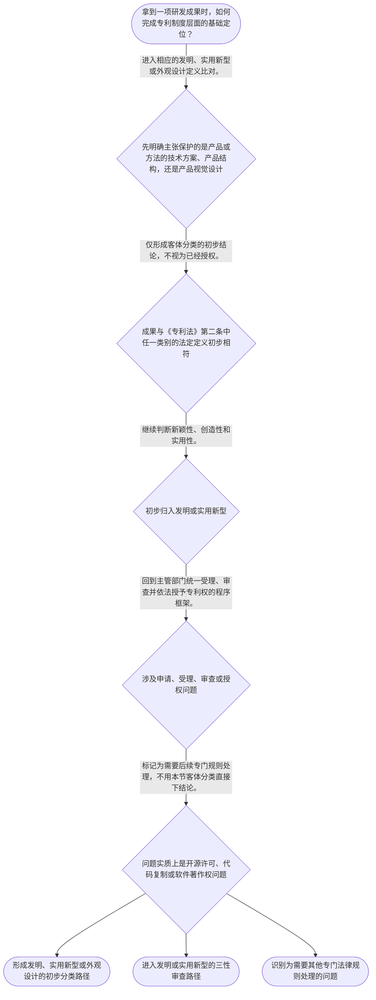

# 整合后的课程完整内容与习题

## 教学模块选择清单

- 当前教学节点：`patent-law-foundation`
- 板块预算：自适应 None/None，总计 None/None

| # | 模块 (block_type) | 类型 | 触发原因 (trigger) | 对应正文段 | 归属 |
|---:|---|:--:|---|---|:--:|
| 1 | `anchor_scenario` | 自适应 | perception=sensing(0.82) / cold_start | 从一个软件研发项目看专利制度入口｜某研发团队开发了工业设备预测维护系统：团队既写出了运行代码，也设计了传感器数据处理流程，并准… | [A] |
| 2 | `legal_anchor` | 必选 | mandatory | 专利制度基础的法条锚点｜《专利法》第二条 | [A] |
| 3 | `worked_example` | 自适应 | cold_start(low_confidence) | 研发成果的三层拆分演示｜某企业研发智能仓储设备：其一，设备外壳具有新的视觉图案；其二，货架搬运装置采用新的机械连接结… | [A] |
| 4 | `decision_flow` | 自适应 | input=visual(0.78) | 专利制度基础判断流程｜拿到一项研发成果时，如何完成专利制度层面的基础定位？ | [A] |
| 5 | `mnemonic` | 自适应 | understanding=sequential(0.74) | 分类、三性、程序三层记忆表｜“类—性—程”三层表：类＝三类客体；性＝发明和实用新型的三性；程＝受理、审查、授权的程序位置… | [A] |
| 6 | `predict_activate` | 自适应 | processing=active(0.63) | 先预测：分类是否等于授权｜某成果初步符合“对产品方法的改进提出技术方案”的描述时，你预测它是否已经可以被视为必然获得专… | [A] |
| 7 | `assessment` | 必选 | mandatory | 本节三类测评｜复习法定发明创造的三类客体。 | [A] |
| 8 | `knowledge_synthesis` | 必选 | mandatory | 专利法律制度基础框架｜专利权特征：独占性、时间性、地域性用于理解权利的法定边界；具体权利期限和地域规则须在后续规则… | [A] |
| 9 | `summary_card` | 自适应 | len(knowledge_sub_nodes)=3>=3 | 专利制度基础速查卡｜专利制度基础判断遵循“先分三类客体，再过授权条件，最后进入申请审查程序”的顺序。 | [A] |

## 教学正文

## I — 法律问题

面对软件、算法、开源代码、软件著作权等问题时，第一步不是直接判断“能否申请算法专利”，而是先建立专利制度的基础坐标：专利保护哪些类型的发明创造；专利制度由哪些规范和程序支撑；以及取得专利权后为何会呈现独占、时间和地域边界。本节仅建立该基础框架，不对算法方案是否属于可专利主题、开源协议的专利条款效果或软件著作权保护范围作具体结论；这些问题需要在后续相应节点中按其专门规则判断。

## R — 适用规则

《专利法》将“发明创造”限定为发明、实用新型和外观设计三类。发明是对产品、方法或者其改进提出的新的技术方案；实用新型是对产品的形状、构造或者其结合提出的适于实用的新的技术方案；外观设计则是对产品整体或局部的形状、图案及其结合，或者色彩与形状、图案结合所作出的、富有美感并适于工业应用的新设计。〔RAG: 中华人民共和国专利法.txt — 第二条：发明创造是指发明、实用新型和外观设计〕

国务院专利行政部门负责统一受理、审查专利申请并依法授予专利权。〔RAG: 中华人民共和国专利法.txt — 第三条：统一受理和审查专利申请，依法授予专利权〕因此，专利制度至少包含实体客体、申请审查和授权三个基本环节。

对发明、实用新型，授权还须具备新颖性、创造性和实用性；其中，现有技术是申请日以前在国内外为公众所知的技术。〔RAG: 中华人民共和国专利法.txt — 第二十二条：授予专利权的发明和实用新型，应当具备新颖性、创造性和实用性〕这说明“属于三类客体之一”并不等于当然获得授权。

规范层面，可先按“专利法—实施细则—审查指南”理解核心制度体系：法律确定基本权利义务和授权框架，实施细则与审查指南承接程序和审查操作。具体规范位阶、条文内容以及与著作权法等法律的关系，应在下一节点进一步核对，不能仅凭这一基础框架作结论。

制度功能上，专利以依法审查和授予权利为条件，将技术公开与权利保护结合：申请文件使技术方案进入制度化披露和审查轨道，获得权利后则在法定边界内形成排他性保护。独占性指权利具有排他效力；时间性指保护并非永久；地域性指权利效力受授予国或地区法律范围限制。本次检索资料未提供制度发展历程、各类申请具体审查阶段及期限的直接原文，故本节仅作概览，不对早期公开、初步审查和实质审查的具体程序规则作延伸说明。

## A — 规则适用

可按以下顺序处理一个研发成果的专利基础判断：

1. **先识别成果类型。** 若主张的是产品、方法或其改进形成的技术方案，应先检查其是否可能落入“发明”的定义；若主张的是有形产品的形状、构造或其结合，则观察是否可能落入实用新型；若关注产品视觉设计，则观察是否可能落入外观设计。分类是入口，不是授权结论。〔RAG: 中华人民共和国专利法.txt — 第二条分别界定发明、实用新型和外观设计〕
2. **再区分客体与授权条件。** 即便技术成果初步归入发明或实用新型，仍须经过新颖性、创造性、实用性的法定检验；不能把“有源代码”“已完成研发”或“已登记软件著作权”等事实直接等同于专利授权条件。后两个命题涉及其他法律制度，本节不作实体判断。
3. **最后定位程序和权利边界。** 专利申请由主管部门统一受理、审查并依法授予，故研发团队应把“技术分类”“申请与审查”“授权后的权利边界”分开记录和分析，避免把技术事实、登记事实和专利授权混为同一问题。〔RAG: 中华人民共和国专利法.txt — 第三条：统一受理和审查专利申请，依法授予专利权〕

## C — 结论

专利法律制度基础的核心结论是：专利法保护的发明创造有发明、实用新型、外观设计三类；分类只解决“进入哪一类制度入口”的问题，不替代授权条件审查。对于发明和实用新型，还必须满足新颖性、创造性和实用性。算法专利性、开源协议与专利之间的关系、软件著作权与专利的具体边界，都应在这一框架上进入后续专门规则分析，不能凭“软件”“开源”或“登记”标签直接下结论。

> 常见误区 / 易混淆点
>
> 1. **把专利类别当成授权结果。** 发明、实用新型、外观设计是法定客体分类；对发明和实用新型，仍要逐项满足第二十二条规定的条件。
> 2. **把技术公开与当然丧失或当然取得专利权混同。** 是否构成现有技术、是否存在法定例外及其程序后果，需要在新颖性节点按申请日和证据判断。
> 3. **把软件著作权、开源许可与专利权当作同一种权利。** 它们可能围绕同一软件项目出现，但法律对象、取得方式、权利内容和风险判断并不当然相同；本节不以未检索到的专门依据替代后续分析。

本节设有测评，请到【习题】区作答。

### 从一个软件研发项目看专利制度入口（anchor_scenario）

> 某研发团队开发了工业设备预测维护系统：团队既写出了运行代码，也设计了传感器数据处理流程，并准备把界面截图、源代码和技术文档分别用于不同的保护安排。负责人提出三个问题：这个成果是否可能进入专利制度、若进入应看哪一种专利客体、以及代码登记或开源发布是否当然等于获得或放弃专利权。

在作答前，团队不能把“软件”“算法”“代码”当作法律结论，而应先把成果拆为技术方案、产品结构和产品视觉设计等不同对象，再进入相应制度。

**锚定**：该情境锚定“先识别专利客体，再区分授权条件和其他知识产权制度”的基础框架。

**先想一想**：面对同一研发项目中的代码、技术流程和产品外观，为什么不能只用一种权利类型作判断？

### 专利制度基础的法条锚点（legal_anchor）

- **《专利法》第二条**：专利法中的发明创造只有发明、实用新型和外观设计三类；三类的保护对象并不相同。
- **《专利法》第三条**：专利申请由国务院专利行政部门统一受理、审查，并依法授予专利权。
- **《专利法》第二十二条**：发明和实用新型即使属于法定客体，仍须具备新颖性、创造性和实用性。

**为何重要**：第二条解决“保护什么”的入口问题，第三条说明申请审查的制度位置，第二十二条提示分类不等于授权。三者共同构成理解软件、算法等后续问题前必须具备的基础坐标。

### 研发成果的三层拆分演示（worked_example）

**案情/例题**：某企业研发智能仓储设备：其一，设备外壳具有新的视觉图案；其二，货架搬运装置采用新的机械连接结构；其三，控制系统采用新的设备调度方法。企业询问：在不预先判断最终授权结果的前提下，应如何进行专利制度的初步分类？
**适用规则**：《专利法》第二条关于发明、实用新型和外观设计的定义；《专利法》第二十二条关于发明和实用新型的授权条件。
**分步推演**：
1. 先将外壳视觉图案与产品整体或局部的形状、图案、色彩等视觉设计要素对应，而不是将其与机械结构或方法混为一类。 → *视觉设计部分进入外观设计的初步观察范围。*
2. 再看机械连接结构：它针对有形产品的形状、构造或者其结合提出技术方案，需与实用新型的法定定义比对。 → *产品结构部分进入实用新型的初步观察范围。*
3. 最后看设备调度方法：若其构成对方法或其改进提出的新的技术方案，应以发明的定义进行初步识别。 → *方法部分进入发明的初步观察范围。*
4. 完成分类后，不得直接写成“必然授权”；对可能属于发明或实用新型的部分，还须另行接受新颖性、创造性和实用性判断。 → *客体分类与授权条件审查必须分两步。*
**结论**：同一产品或项目可包含不同性质的成果，应按对象分别进行初步分类；第二条的分类是分析起点，第二十二条的授权条件是后续门槛。
**本题要点**：训练将复杂研发项目拆分为外观、产品结构与技术方法，并坚持“先分类、后审查”的判断顺序。

### 专利制度基础判断流程（decision_flow）

**决策问题**：拿到一项研发成果时，如何完成专利制度层面的基础定位？



### 分类、三性、程序三层记忆表（mnemonic）

**记忆锚**：“类—性—程”三层表：类＝三类客体；性＝发明和实用新型的三性；程＝受理、审查、授权的程序位置。
**映射**：
- 类
- 性
- 程
**何时用**：看到“一个研发成果能否申请专利”时，先按“类—性—程”依次核查，避免把分类、授权和程序混为一步。

### 先预测：分类是否等于授权（predict_activate）

**预测/激活**：某成果初步符合“对产品方法的改进提出技术方案”的描述时，你预测它是否已经可以被视为必然获得专利权？

**激活旧知**：激活“法律分类”和“授权门槛是不同层次”的已有逻辑经验。

**揭晓方向**：先区分第二条解决的客体问题，再观察第二十二条是否还设置了独立条件。

### 专利法律制度基础框架（knowledge_synthesis）

**知识框架**：
- 专利权特征：独占性、时间性、地域性用于理解权利的法定边界；具体权利期限和地域规则须在后续规则中核验。
- 规范体系：以专利法为基本法律框架，实施细则和审查指南承接具体程序与审查操作；详细内容属于下一节点重点。
- 保护客体：发明、实用新型、外观设计是《专利法》第二条规定的三类发明创造，三者保护对象不同。
- 制度功能：专利制度通过技术公开、申请审查与依法授予权利，服务发明创造的激励和技术应用。
- 程序概览：主管部门统一受理、审查并依法授予专利权；公开、初步审查和实质审查的具体规则应在后续程序学习中展开。
**概念关系**：客体分类是入口：先依据第二条识别成果可能属于哪一类。；授权条件是下一层：发明和实用新型分类后，再依第二十二条判断三性。；程序位置承接实体判断：专利申请经统一受理和审查后，才可能依法授予专利权。；制度功能解释制度设计：技术公开与权利保护共同构成专利制度的基本运行逻辑。
**必记**：发明、实用新型、外观设计是专利法规定的三类发明创造。；属于法定客体不等于当然授权；发明和实用新型还须具备新颖性、创造性和实用性。；处理软件、算法、开源和软件著作权问题时，先定位其法律对象，不能用单一标签替代专利判断。

### 专利制度基础速查卡（summary_card）

**要点卡**：
- **三类客体**：发明、实用新型、外观设计是《专利法》第二条规定的三类发明创造。
- **发明**：发明针对产品、方法或者其改进提出的新的技术方案。
- **实用新型**：实用新型针对产品形状、构造或者其结合提出适于实用的新的技术方案。
- **外观设计**：外观设计保护产品整体或局部的视觉设计，并要求富有美感且适于工业应用。
- **三性门槛**：发明和实用新型除属于法定客体外，还须具备新颖性、创造性和实用性。
- **程序位置**：专利申请由主管部门统一受理、审查，并依法授予专利权。
**必背**：发明创造包括发明、实用新型和外观设计。；发明和实用新型的授权条件是新颖性、创造性和实用性。；先分类，再审查，不把技术成果、代码登记或其他法律事实直接等同于专利授权。
**一句话总结**：专利制度基础判断遵循“先分三类客体，再过授权条件，最后进入申请审查程序”的顺序。

### 本节三类测评（assessment）

**三类覆盖**：backward_review、forward_probe、weakness_probe
**题目**：
- q1：复习法定发明创造的三类客体。
- q2：探测下一节点中专利法的规范体系位置。
- q3：辨析技术方案分类与发明、实用新型三性审查的顺序。


## 结构化数据

## expert

```json
"expert_a"
```

## style

```json
"conservative"
```

## knowledge_points

```json
[
  {
    "node_id": "patent-law-foundation",
    "kc_name": "专利制度的基本概念与独占性、时间性、地域性特征"
  },
  {
    "node_id": "patent-law-foundation",
    "kc_name": "专利法、专利法实施细则与专利审查指南的核心规范体系"
  },
  {
    "node_id": "patent-law-foundation",
    "kc_name": "发明、实用新型、外观设计三类专利保护客体"
  },
  {
    "node_id": "patent-law-foundation",
    "kc_name": "专利制度激励创造、技术公开与技术应用的作用"
  },
  {
    "node_id": "patent-law-foundation",
    "kc_name": "公开、初步审查与实质审查并存的制度概览"
  }
]
```

## legal_basis

```json
[
  {
    "article": "《中华人民共和国专利法》第二条",
    "source": "中华人民共和国专利法.txt：第二条"
  },
  {
    "article": "《中华人民共和国专利法》第三条",
    "source": "中华人民共和国专利法.txt：第三条"
  },
  {
    "article": "《中华人民共和国专利法》第二十二条",
    "source": "中华人民共和国专利法.txt：第二十二条"
  }
]
```

## risks

```json
[
  {
    "risk": "将发明、实用新型、外观设计的法定分类误认为授权已经确定，遗漏发明和实用新型的三性审查。",
    "related_node_id": "patent-law-foundation"
  },
  {
    "risk": "将软件著作权登记、开源发布或代码存在本身直接等同于专利权取得或专利许可结论，混淆不同制度。",
    "related_node_id": "patent-law-foundation"
  },
  {
    "risk": "对制度发展历程和具体审查程序作超出检索依据的细节推断。",
    "related_node_id": "patent-system-overview"
  }
]
```

## draft_stage

```json
"debate"
```

## irac

```json
{
  "issue": "研发成果进入专利制度时，应如何先识别专利保护客体、授权条件和制度边界，并避免与其他知识产权问题混同？",
  "rule": "《专利法》第二条将发明创造分为发明、实用新型和外观设计，并分别规定其定义；第三条规定主管部门统一受理、审查申请并依法授予专利权；第二十二条规定发明和实用新型须具备新颖性、创造性和实用性。",
  "application": "应先将成果依第二条作客体分类，再对发明或实用新型另行审查第二十二条的三性，并将分类、审查程序与授权后的权利边界分开处理。软件、算法、开源和软件著作权相关事实不能在缺少专门依据时替代上述判断。",
  "conclusion": "本节形成专利制度的基础入口：三类客体是分类起点，三性是发明和实用新型的授权门槛；后续再分别处理算法可专利性、开源协议和软件著作权边界。"
}
```

## interactive_questions

```json
[
  {
    "qid": "q1",
    "category": "understand",
    "difficulty": "L1",
    "source_tag": "backward_review",
    "kc_node_id": "patent-law-foundation",
    "question": "根据《专利法》第二条，下列哪一项属于法定的发明创造类型？",
    "answer": "B",
    "options": [
      "A. 商业秘密",
      "B. 实用新型",
      "C. 软件著作权",
      "D. 注册商标"
    ]
  },
  {
    "qid": "q2",
    "category": "remember",
    "difficulty": "L1",
    "source_tag": "forward_probe",
    "kc_node_id": "patent-law-framework",
    "question": "在中国专利制度的核心规范体系中，哪一项属于提供基本法律框架的规范？",
    "answer": "A",
    "options": [
      "A. 专利法",
      "B. 企业内部研发流程",
      "C. 软件项目说明文档",
      "D. 开源社区讨论记录"
    ]
  },
  {
    "qid": "q3",
    "category": "analyze",
    "difficulty": "L3",
    "source_tag": "weakness_probe",
    "kc_node_id": "patent-law-foundation",
    "question": "某团队完成了一项用于优化设备控制的技术方案，并主张其属于发明。仅依据本节规则，下列判断步骤中正确的是哪一项？",
    "answer": "C",
    "options": [
      "A. 只要团队拥有源代码，即可直接认定获得发明专利权",
      "B. 只要完成软件著作权登记，即无需再判断专利授权条件",
      "C. 先判断是否属于产品、方法或其改进提出的技术方案，再对其另行判断新颖性、创造性和实用性",
      "D. 只要方案具有美感，即应当按外观设计授予专利权"
    ]
  }
]
```

## knowledge_synthesis

```json
{
  "node": "patent-law-foundation",
  "coverage": [
    {
      "node_id": "patent-law-foundation"
    },
    {
      "node_id": "patent-rights-nature"
    },
    {
      "node_id": "patent-law-framework"
    },
    {
      "node_id": "patent-system-overview"
    }
  ],
  "confusable_pairs": [
    {
      "pair": "专利法第二条规定的客体分类，与发明和实用新型依第二十二条满足三性的授权判断，不是同一层次。"
    },
    {
      "pair": "专利制度基础框架，与算法可专利性、开源协议专利条款、软件著作权保护范围等专门问题，不应混同。"
    },
    {
      "pair": "技术成果的存在，与专利权经申请、审查并依法授予的法律状态，不应混同。"
    }
  ]
}
```
