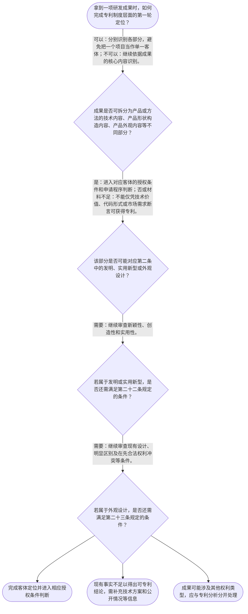

# 整合后的课程完整内容与习题

## 教学模块选择清单

- 当前教学节点：`patent-law-foundation`
- 板块预算：自适应 6/6，总计 9/9

| # | 模块 (block_type) | 类型 | 触发原因 (trigger) | 对应正文段 | 归属 |
|---:|---|:--:|---|---|:--:|
| 1 | `anchor_scenario` | 自适应 | perception=sensing(0.82) / cold_start | 从一项节能控制方案看专利制度入口｜某研发团队开发了一套用于工业设备的节能控制方案：工程师提出新的控制步骤，程序员将其写成源代码… | [A] |
| 2 | `legal_anchor` | 必选 | mandatory | 法条锚定：专利客体与授权门槛｜《中华人民共和国专利法》第二条 | [A] |
| 3 | `worked_example` | 自适应 | cold_start(low_confidence) | 演示：源代码实现的节能控制方法如何作基础定位｜某团队提出一套用于降低工业设备能耗的控制步骤，并将其实现为源代码；同时为配套设备设计了新的外… | [A] |
| 4 | `decision_flow` | 自适应 | input=visual(0.78) | 专利制度基础定位流程｜拿到一项研发成果时，如何完成专利制度层面的第一轮定位？ | [A] |
| 5 | `mnemonic` | 自适应 | understanding=sequential(0.74) | 顺序记忆表：客—边—规—审｜“客—边—规—审”四步表：客体定位／权利边界／规范定位／授权审查。 | [A] |
| 6 | `predict_activate` | 自适应 | processing=active(0.63) | 先作预测：研发完成是否等于取得专利｜某团队已经完成技术方案、写好代码并做出样机。你预测：这些事实是否足以直接推出“团队已经取得专… | [A] |
| 7 | `assessment` | 必选 | mandatory | 三类测评闭环｜复习专利法中发明创造的三类法定客体。 | [A] |
| 8 | `knowledge_synthesis` | 必选 | mandatory | 专利法律制度基础框架｜权利特征：专利制度以独占性、时间性和地域性界定权利边界，不能理解为永久、全球、自动取得的技术… | [A] |
| 9 | `summary_card` | 自适应 | len(knowledge_sub_nodes)=3>=3 | 基础定位速查卡｜专利制度基础的判断顺序是：先识别法定客体，再确认权利边界、规范位置和授权门槛。 | [A] |

## 教学正文

## I — 法律问题

本节先解决一个基础定位问题：面对一项研发成果，如何在进入算法专利性、开源协议或软件著作权等后续专题之前，先判断专利制度究竟保护什么、通过何种制度结构运行，以及专利权为何不是对技术的永久、全球性控制？

明确结论：专利制度以法定客体为起点，以依法授予的专利权为基础；研发成果是否最终能够获得专利，还须经过相应的申请和审查。算法能否获得专利、开源代码会带来哪些专利风险、软件著作权与专利如何区分，均须在这一基础框架上继续作具体判断，本节不作越界结论。

## R — 适用规则

### 1. 先确认专利法中的保护客体

《专利法》第二条规定，发明创造包括发明、实用新型和外观设计；其中，发明是对产品、方法或者其改进提出的新的技术方案，实用新型是对产品形状、构造或者其结合提出的适于实用的新的技术方案，外观设计则是对产品整体或者局部的形状、图案等作出的、富有美感并适于工业应用的新设计。〔RAG: 中华人民共和国专利法.txt — 第二条：发明创造是指发明、实用新型和外观设计〕

因此，第一步不是直接问“技术是否先进”，而是先把成果放入“发明、实用新型、外观设计”三个法定入口中的一个进行定位。对软件、算法等成果，不能仅因其以代码形式呈现，就直接得出专利结论；仍需在后续专题中围绕是否构成法定意义上的技术方案进一步分析。

### 2. 再理解专利权的三个制度边界

专利制度通常以独占性、时间性和地域性概括其基本特征：独占性意味着专利权具有排他属性；时间性意味着权利并非永久存在；地域性意味着权利效力以授予该权利的法域为边界。检索上下文未提供这些特征对应的直接条文原文，故本节仅将其作为制度框架定位，不据此延伸具体期限、地域效力或侵权判断。

### 3. 认识规范体系与程序分工

中国专利制度的核心规范体系可按层次理解为：专利法提供基本制度和实体规则，专利法实施细则补充程序性、操作性规定，专利审查指南服务于审查标准的具体适用。该体系的具体规范层级和细节将由下一节点展开。

在程序上，应区分申请、公开、审查和授权等环节。检索材料表明，专利申请公布或者公告前，相关工作人员及有关人员对申请内容负有保密责任。〔RAG: 中华人民共和国专利法.txt — 在专利申请公布或者公告前……对其内容负有保密责任〕

关于“早期公开、延迟审查”“初步审查制与实质审查制并存”的具体程序规则，检索上下文未提供直接依据；本节仅提示其属于专利制度程序结构的一部分，不以此替代后续程序节点的学习。

### 4. 专利制度的功能与授权门槛

专利制度的基本运行逻辑可概括为：申请人将技术方案纳入法定程序，国家专利行政部门统一受理、审查申请并依法授予专利权。〔RAG: 中华人民共和国专利法.txt — 第三条：统一受理和审查专利申请，依法授予专利权〕 这一机制将激励发明创造、技术公开、技术应用和经济发展联系起来：权利并非自动随研发行为产生，而是以公开和审查为制度条件。

对发明和实用新型，《专利法》第二十二条规定授权须具备新颖性、创造性和实用性；其中，实用性要求能够制造或者使用，并且能够产生积极效果。〔RAG: 中华人民共和国专利法.txt — 第二十二条：授予专利权的发明和实用新型，应当具备新颖性、创造性和实用性〕 外观设计则适用第二十三条所规定的现有设计、明显区别及不与他人在先合法权利冲突等条件。〔RAG: 中华人民共和国专利法.txt — 第二十三条：授予专利权的外观设计，应当不属于现有设计〕

## A — 规则适用

可按以下顺序处理一个研发成果的专利基础定位：

1. **识别成果形态。** 是产品或方法的技术方案、产品形状构造的技术方案，还是产品外观的新设计？这一步决定应当从第二条中的哪个客体入口开始。
2. **识别权利边界。** 即使成果处于专利制度的讨论范围，也不能把专利误解为永久、全球或当然取得的技术所有权；必须继续确认权利的法定取得与边界。
3. **识别制度文件和程序位置。** 基本权利义务看专利法，具体程序和审查适用需要进一步进入实施细则、审查指南及相应程序节点。
4. **识别后续实体门槛。** 对发明、实用新型，客体定位不等于可以授权，仍须进入新颖性、创造性、实用性判断；对外观设计，则进入第二十三条的相应条件判断。

例如，某研发团队完成了一种用于降低设备能耗的控制方法，并以源代码实现。仅凭“已经写成代码”这一事实，不能在本节直接断定其是否获得专利保护；应先问其主张的是何种成果，再问是否能形成第二条所称产品、方法或者其改进的技术方案，随后才进入第二十二条的授权条件审查。软件著作权对代码表达的保护，以及开源许可证对代码使用、分发和可能的专利安排，属于不同的法律问题，应在后续相关法律与合同规则节点分别处理。

## C — 结论

专利法律制度基础的核心是“四步定位”：先定法定客体，再认权利的独占性、时间性、地域性边界，再找适用规范与程序位置，最后进入不同客体的授权条件。对于算法、开源代码和软件成果，不能用“有代码”或“技术有价值”替代上述判断顺序。

本节设有测评，请到【习题】区作答。

> 常见误区 / 易混淆点
>
> 1. **把专利等同于自动产生的技术所有权。** 专利权须经法定申请、审查和授予；研发完成本身不等于已取得专利权。
> 2. **把三种客体混为一类。** 发明关注产品、方法或改进的技术方案；实用新型聚焦产品形状、构造或其结合；外观设计关注产品外观的新设计。
> 3. **把“属于专利客体”误作“必然授权”。** 对发明和实用新型，仍须满足新颖性、创造性、实用性；客体判断只是入口，不是终点。
> 4. **把软件著作权、开源许可证与专利权当成同一权利。** 三者可能围绕同一项目同时出现，但保护对象、取得方式和法律效果需分别判断。

### 从一项节能控制方案看专利制度入口（anchor_scenario）

> 某研发团队开发了一套用于工业设备的节能控制方案：工程师提出新的控制步骤，程序员将其写成源代码，产品经理还设计了设备面板的新外观。团队准备把部分代码放到开源平台，同时希望阻止竞争者复制其核心方案。

团队成员随即发生分歧：有人认为“代码写出来就有专利”，有人认为“开源就不能谈专利”，还有人认为只要把设备外形做得不同就能保护全部技术。此时真正需要先解决的，不是立即选用哪一种权利，而是识别不同成果在专利制度中的法定位置与边界。

**锚定**：该情境锚定专利保护客体、专利权边界和不同知识产权问题必须分层判断的基础框架。

**先想一想**：面对同一项目中的控制方法、源代码和设备外观，你会先按什么标准把它们分别放入不同的法律分析入口？

### 法条锚定：专利客体与授权门槛（legal_anchor）

- **《中华人民共和国专利法》第二条**：专利法中的发明创造分为发明、实用新型和外观设计，三者的对象和定义并不相同。
- **《中华人民共和国专利法》第二十二条、第二十三条**：发明、实用新型须具备新颖性、创造性和实用性；外观设计适用现有设计、明显区别及在先权利不冲突等条件。

**为何重要**：第二条解决“什么成果进入专利法分析”的入口问题，第二十二条、第二十三条说明进入入口后仍要通过相应授权门槛。二者共同防止把研发完成误认为当然获得专利权。

### 演示：源代码实现的节能控制方法如何作基础定位（worked_example）

**案情/例题**：某团队提出一套用于降低工业设备能耗的控制步骤，并将其实现为源代码；同时为配套设备设计了新的外壳外观。团队询问：能否仅因已有源代码而当然取得专利权？应当怎样开始分析？
**适用规则**：《中华人民共和国专利法》第二条规定发明、实用新型和外观设计的法定含义；第二十二条规定发明和实用新型的授权条件。
**分步推演**：
1. 先拆分成果：控制步骤、代码实现和设备外观并非当然属于同一法律客体。专利法第二条要求从发明、实用新型、外观设计的法定定义中寻找对应入口。 → *先分成果形态，不能以“项目整体”替代客体判断。*
2. 对控制步骤，应继续判断其是否能够作为对产品、方法或者其改进所提出的新的技术方案进入发明分析；源代码这一表现形式本身不等于已经满足该结论。 → *代码存在不等于当然具备专利客体资格。*
3. 即使控制步骤完成了发明客体定位，仍须依第二十二条审查新颖性、创造性和实用性，而非因其节能或已完成研发而自动授权。 → *客体定位之后，仍要通过授权条件。*
4. 对设备外壳，应另按外观设计的法定定义及第二十三条的条件分析，不能用控制方法的判断代替外观设计判断。 → *不同客体适用不同的后续条件。*
**结论**：不能仅因成果已写成源代码而当然取得专利权；应先分别定位控制方法和设备外观可能对应的法定客体，再适用各自的授权条件和程序。
**本题要点**：训练“先客体、后条件、再程序”的线性判断链，避免把技术价值或代码形式误当作专利权。

### 专利制度基础定位流程（decision_flow）

**决策问题**：拿到一项研发成果时，如何完成专利制度层面的第一轮定位？



### 顺序记忆表：客—边—规—审（mnemonic）

**记忆锚**：“客—边—规—审”四步表：客体定位／权利边界／规范定位／授权审查。
**映射**：
- 客
- 边
- 规
- 审
**何时用**：遇到“算法能否申请”“代码能否保护”“某技术是否已有专利”等问题时，先按四步表排除跳步结论。

### 先作预测：研发完成是否等于取得专利（predict_activate）

**预测/激活**：某团队已经完成技术方案、写好代码并做出样机。你预测：这些事实是否足以直接推出“团队已经取得专利权”？

**激活旧知**：激活研发成果、法定权利取得和专利授权条件之间不能混同的既有常识。

**揭晓方向**：先区分“成果是什么”与“权利是否依法授予”，再查看不同客体是否仍须通过相应的授权条件。

### 专利法律制度基础框架（knowledge_synthesis）

**知识框架**：
- 权利特征：专利制度以独占性、时间性和地域性界定权利边界，不能理解为永久、全球、自动取得的技术所有权。
- 规范体系：专利法提供基本制度，实施细则和审查指南分别承担进一步的程序与审查适用功能。
- 保护客体：第二条将发明创造分为发明、实用新型和外观设计，必须按成果类型进入不同分析路径。
- 制度功能：专利申请经受理、审查并依法授予，形成激励创造、技术公开与技术应用之间的制度联系。
- 程序结构：申请、公开、审查、授权构成基本程序链；公开与审查的具体制度细节留待后续节点。
**概念关系**：客体定位是授权条件判断的前提：先依据第二条分类，再分别进入第二十二条或第二十三条。；权利边界、规范体系和程序结构共同说明：专利权不是研发完成后自然产生的绝对权利。；算法、开源协议与软件著作权问题需要建立在本框架上，但属于后续专题的具体边界判断。
**必记**：专利基础分析先做客体定位，不能从代码、技术价值或市场价值直接跳到“有专利权”。；发明和实用新型即使属于可讨论的客体，仍须满足新颖性、创造性和实用性。；同一研发项目可能同时涉及技术方案、代码表达和产品外观，须分别定位，不能混为单一权利。

### 基础定位速查卡（summary_card）

**要点卡**：
- **法定客体**：《专利法》第二条的入口是发明、实用新型和外观设计。
- **三类权利边界**：独占性、时间性、地域性提醒你：专利不是永久、全球的自动技术所有权。
- **授权条件**：发明和实用新型在客体定位后，还须具备新颖性、创造性和实用性。
- **规范与程序**：专利法定基本制度，申请、公开、审查、授权构成理解制度运行的基本链条。
- **制度功能**：专利制度将激励创造、技术公开和技术应用纳入同一制度机制。
**必背**：发明创造包括发明、实用新型和外观设计。；发明和实用新型授权须具备新颖性、创造性和实用性。；分析研发成果时先定客体，再看条件和程序。
**一句话总结**：专利制度基础的判断顺序是：先识别法定客体，再确认权利边界、规范位置和授权门槛。

### 三类测评闭环（assessment）

**三类覆盖**：backward_review、forward_probe、weakness_probe
**题目**：
- q-foundation-review-1：复习专利法中发明创造的三类法定客体。
- q-framework-forward-1：仅探测下一节点的核心规范文件识别。
- q-foundation-weakness-1：辨析代码、技术方案与专利授权判断顺序。


## 结构化数据

## expert

```json
"expert_a"
```

## style

```json
"conservative"
```

## knowledge_points

```json
[
  {
    "node_id": "patent-law-foundation",
    "kc_name": "专利制度的基本特征：独占性、时间性与地域性"
  },
  {
    "node_id": "patent-law-foundation",
    "kc_name": "中国专利制度的核心规范体系"
  },
  {
    "node_id": "patent-law-foundation",
    "kc_name": "专利保护客体：发明、实用新型与外观设计"
  },
  {
    "node_id": "patent-law-foundation",
    "kc_name": "专利制度的功能：激励、公开与应用"
  },
  {
    "node_id": "patent-law-foundation",
    "kc_name": "中国专利制度的程序特点：公开、初步审查与实质审查"
  }
]
```

## legal_basis

```json
[
  {
    "article": "《中华人民共和国专利法》第二条",
    "source": "中华人民共和国专利法.txt：第二条"
  },
  {
    "article": "《中华人民共和国专利法》第二十二条、第二十三条",
    "source": "中华人民共和国专利法.txt：第二十二条、第二十三条"
  }
]
```

## risks

```json
[
  {
    "risk": "将代码表达、技术方案与专利权混为一谈，可能在算法、开源与软件著作权问题上跳过保护客体和授权条件判断。",
    "related_node_id": "patent-law-foundation"
  },
  {
    "risk": "将专利的独占性误解为永久且全球有效，忽略时间性和地域性边界。",
    "related_node_id": "patent-rights-nature"
  },
  {
    "risk": "将专利法、实施细则和审查指南的功能混同，导致无法定位应当查找的规范层级。",
    "related_node_id": "patent-law-framework"
  }
]
```

## draft_stage

```json
"debate"
```

## irac

```json
{
  "issue": "研发成果进入专利制度时，应如何从法定客体、权利边界、规范体系和授权门槛进行基础定位，避免将算法、代码、开源使用与专利权混同？",
  "rule": "《专利法》第二条将发明创造界定为发明、实用新型和外观设计，并分别规定其含义；第二十二条规定发明和实用新型须具备新颖性、创造性和实用性，第二十三条规定外观设计的相应授权条件。",
  "application": "应先将成果识别为可能的产品、方法技术方案、产品形状构造技术方案或外观设计，再区分专利权的制度边界和取得程序；完成客体定位后，才进入对应的授权条件判断。代码形式本身不能替代技术方案与授权条件的分析。",
  "conclusion": "专利分析的正确起点是法定客体与制度边界，而非研发成果是否以代码或算法形式呈现；算法专利性、开源协议影响及软件著作权边界须在此基础上于后续专题具体判断。"
}
```

## interactive_questions

```json
[
  {
    "qid": "q-foundation-review-1",
    "category": "understand",
    "difficulty": "L1",
    "source_tag": "backward_review",
    "kc_node_id": "patent-law-foundation",
    "question": "依据《专利法》第二条，下列对专利法所称“发明创造”的表述，正确的是哪一项？",
    "answer": "A",
    "options": [
      "A. 发明创造包括发明、实用新型和外观设计",
      "B. 发明创造仅包括具有市场价值的软件代码",
      "C. 发明创造仅包括能够批量生产的产品",
      "D. 发明创造包括一切尚未公开的创意"
    ]
  },
  {
    "qid": "q-framework-forward-1",
    "category": "remember",
    "difficulty": "L1",
    "source_tag": "forward_probe",
    "kc_node_id": "patent-law-framework",
    "question": "下列哪一组属于中国专利制度学习中需要区分的核心规范文件？",
    "answer": "B",
    "options": [
      "A. 专利法、刑法、民事诉讼法",
      "B. 专利法、专利法实施细则、专利审查指南",
      "C. 著作权法、商标法、反垄断法",
      "D. 公司法、合同法、消费者权益保护法"
    ]
  },
  {
    "qid": "q-foundation-weakness-1",
    "category": "analyze",
    "difficulty": "L3",
    "source_tag": "weakness_probe",
    "kc_node_id": "patent-law-foundation",
    "question": "某团队称其成果“具有独创代码、可在设备上运行并降低能耗”，并据此主张当然获得专利。按照本节的基础判断顺序，下列处理最恰当的是哪一项？",
    "answer": "C",
    "options": [
      "A. 因为代码具有独创性，所以当然取得发明专利权",
      "B. 因为能够降低能耗，所以无需判断法定保护客体即可授权",
      "C. 先判断成果能否对应法定专利客体，再对相应客体适用授权条件和法定程序",
      "D. 只要未向公众公开，就必然同时获得专利权和软件著作权"
    ]
  }
]
```

## knowledge_synthesis

```json
{
  "node": "patent-law-foundation",
  "coverage": [
    {
      "node_id": "patent-rights-nature"
    },
    {
      "node_id": "patent-law-framework"
    },
    {
      "node_id": "patent-law-foundation"
    },
    {
      "node_id": "patent-system-overview"
    }
  ],
  "confusable_pairs": [
    {
      "pair": "“研发成果已经完成”与“专利权已经依法取得”：前者不当然推出后者。"
    },
    {
      "pair": "发明、实用新型与外观设计：均属发明创造，但法定定义和后续授权条件不同。"
    },
    {
      "pair": "代码表达与技术方案：代码存在不当然等于已满足专利法上的发明客体或授权条件。"
    }
  ]
}
```
