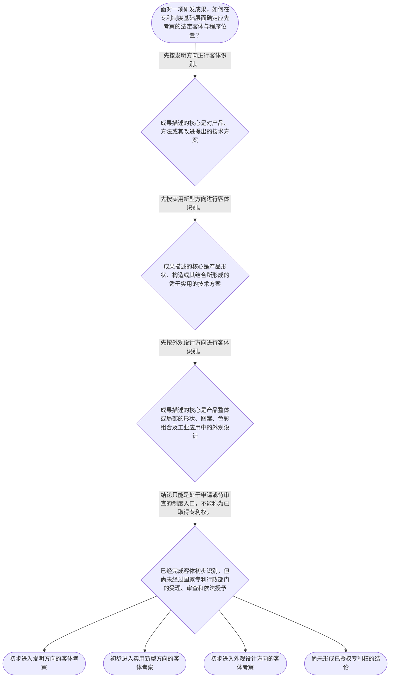

# 整合后的课程完整内容与习题

## 教学模块选择清单

- 当前教学节点：`patent-law-foundation`
- 板块预算：自适应 6/6，总计 9/9

| # | 模块 (block_type) | 类型 | 触发原因 (trigger) | 对应正文段 | 归属 |
|---:|---|:--:|---|---|:--:|
| 1 | `anchor_scenario` | 自适应 | perception=sensing(0.83) / cold_start | 从一项智能设备研发看三类专利客体｜启明团队开发一台仓储分拣设备：工程师改进了设备的路径控制方法，结构工程师设计了可快速拆装的传… | [A] |
| 2 | `legal_anchor` | 必选 | mandatory | 法条锚点：三类发明创造与专利行政管理｜《专利法》第二条 | [A] |
| 3 | `worked_example` | 自适应 | cold_start(low_confidence) | 演示：将一项设备成果拆分为不同保护客体｜甲公司研发智能巡检设备，形成三项成果：一是根据传感数据调整巡检路线的方法；二是设备底部可折叠… | [A] |
| 4 | `decision_flow` | 自适应 | input=visual(0.78) | 专利制度入口判断流程｜面对一项研发成果，如何在专利制度基础层面确定应先考察的法定客体与程序位置？ | [A] |
| 5 | `mnemonic` | 自适应 | understanding=sequential(0.75) | 分类记忆表：方—构—观｜三类客体分类表：方（产品、方法或改进的技术方案）／构（产品形状、构造或其结合的技术方案）／观… | [A] |
| 6 | `predict_activate` | 自适应 | processing=active(0.63) | 先预测：代码是否决定专利类别｜某团队把设备控制方法写成源代码，并将代码纳入仓库管理。仅凭“它已经写成代码”，能否确定其在专… | [A] |
| 7 | `assessment` | 必选 | mandatory | 本节测评：客体分类与制度入口｜复习发明创造的三类法定客体。 | [A] |
| 8 | `knowledge_synthesis` | 必选 | mandatory | 制度基础知识框架｜权利特征：以独占性、时间性、地域性理解专利权不是无限、无条件的技术控制。 | [A] |
| 9 | `summary_card` | 自适应 | len(knowledge_sub_nodes)=3>=3 | 专利制度基础速查卡｜专利制度基础的第一步，是按法定定义识别“方、构、观”，再把成果放回依法受理、审查和授权的程序… | [A] |

## 教学正文

## I — 法律问题

本节先解决一个制度入口问题：一项研发成果进入中国专利制度时，首先应识别其是否可能属于发明、实用新型或外观设计三类法定客体；随后才进入申请、审查和授权等后续环节。对算法能否申请专利、开源协议是否影响专利、软件著作权与专利如何分工的问题，本节只建立识别制度入口所必需的框架，不对其具体授权或权利冲突作实体判断。

## R — 适用规则

《专利法》将“发明创造”限定为发明、实用新型和外观设计三类。发明是对产品、方法或者其改进提出的新的技术方案；实用新型是对产品的形状、构造或者其结合提出的、适于实用的新的技术方案；外观设计则是对产品整体或者局部的形状、图案及其结合，或者色彩与形状、图案的结合所作出的富有美感并适于工业应用的新设计。〔RAG: 中华人民共和国专利法.txt — 第二条：发明创造是指发明、实用新型和外观设计，并分别规定三类定义〕

国务院专利行政部门负责管理全国专利工作，统一受理和审查专利申请，并依法授予专利权。〔RAG: 中华人民共和国专利法.txt — 第三条：统一受理和审查专利申请，依法授予专利权〕

制度上可先按“权利属性—规范层级—保护客体—程序阶段”四层阅读：

1. **权利属性**：专利权通常具有独占性、时间性和地域性。它不是对抽象思想当然产生的永久、全球控制；具体保护范围、期限和地域结论须以适用法律及授权文件为准。
2. **规范层级**：本节将专利法、专利法实施细则和专利审查指南作为理解中国专利制度的核心规范框架；其各自具体效力和适用关系属于下一节点“专利法律体系”的内容。
3. **保护客体**：先区分技术方案、产品结构与产品外观，分别对应可能的发明、实用新型和外观设计路径。
4. **程序阶段**：专利制度以申请、受理、审查和依法授予为基本程序线索。检索材料显示，中国专利制度发展中曾通过修法强化促进科技进步与创新的宗旨并完善救济设计。〔RAG: 专利法律知识详细解读.txt — 2000年修改将立法宗旨调整为促进科学技术进步和创新，并增加确权程序救济〕

本节点材料未提供“早期公开延迟审查”以及“初步审查制与实质审查制并存”的直接条文或完整制度依据。因此只能将其作为后续程序学习的框架提示，不能据此推出具体程序、期限或法律后果。

## A — 规则适用

面对一个软件研发项目，应按以下顺序定位，而不能直接以“代码”或“算法”一词下结论。

第一步，识别成果的表达层次：若主张的是产品、方法或其改进中的技术方案，应先观察其是否可能进入“发明”的法定定义；若主张的是产品的形状、构造或其结合，则观察是否可能进入“实用新型”的定义；若主张的是产品外观的形状、图案、色彩组合及工业应用，则观察是否可能进入“外观设计”的定义。〔RAG: 中华人民共和国专利法.txt — 第二条分别规定发明、实用新型和外观设计的对象〕

第二步，区分“客体入口”与“最终授权”。某项成果在表述上可能接近某类法定客体，并不等于已经取得专利权；仍须经过法定申请和审查程序。国务院专利行政部门统一受理、审查并依法授予专利权，说明研发人员自行贴上“专利”标签不产生授权效果。〔RAG: 中华人民共和国专利法.txt — 第三条：统一受理和审查专利申请，依法授予专利权〕

第三步，避免把不同保护工具混为一谈。软件著作权、开源协议的许可安排及算法相关专利申请，均可能与同一软件项目有关，但它们所处理的权利对象、取得条件和法律效果并不当然相同。本节不展开这些制度的具体边界；后续应分别在“专利法律体系”“专利授权实质条件”和相关法律节点中核对直接规范依据。

## C — 结论

本节的确定结论是：专利制度的法定保护客体为发明、实用新型和外观设计，分类必须以《专利法》第二条的定义为起点；专利权的获得还须经过国家专利行政部门统一受理、审查和依法授予的程序。〔RAG: 中华人民共和国专利法.txt — 第二条、第三条〕

对于算法、开源和软件著作权问题，现阶段应先完成“成果属于何种对象、是否在讨论专利制度入口”的定位；不要把“写成代码”“开源发布”或“取得软件著作权”直接等同于“当然可获专利”或“当然不能申请专利”。具体结论需要后续节点的直接规则支撑。

> 常见误区 / 易混淆点
>
> 1. 把“发明”理解为任何新想法。法定定义要求的是对产品、方法或其改进提出的新的技术方案。〔RAG: 中华人民共和国专利法.txt — 第二条：发明的定义〕
> 2. 把实用新型与外观设计混同。前者关注产品形状、构造或其结合的技术方案；后者关注产品外观及工业应用中的美感设计。〔RAG: 中华人民共和国专利法.txt — 第二条：实用新型与外观设计的定义〕
> 3. 把“可能属于保护客体”误认为“已经获得专利权”。受理、审查和授权是不同环节。〔RAG: 中华人民共和国专利法.txt — 第三条：统一受理和审查专利申请，依法授予专利权〕
>
> 本节设有测评，请到【习题】区作答。

### 从一项智能设备研发看三类专利客体（anchor_scenario）

> 启明团队开发一台仓储分拣设备：工程师改进了设备的路径控制方法，结构工程师设计了可快速拆装的传动连接构造，工业设计师则完成了面板的图案和色彩方案。团队同时把控制程序放入内部代码仓库，并计划以后采用开源组件。负责人问：这些成果能否都称为“专利”？

冲突在于，同一产品包含方法、结构和外观，但法律分类并不按“都与软件或设备有关”处理。团队必须先找准每项成果在专利制度中的入口，才能避免把技术方案、产品构造和产品外观混为一谈。

**锚定**：该情境锚定发明、实用新型、外观设计三类客体的分类，以及“客体入口不等于已经授权”的制度边界。

**先想一想**：面对同一设备中的控制方法、连接构造和面板设计，为什么不能只用“这是软件项目”作出统一分类？

### 法条锚点：三类发明创造与专利行政管理（legal_anchor）

- **《专利法》第二条**：专利法只把发明、实用新型和外观设计列为发明创造，并按技术方案、产品构造和产品外观分别定义。
- **《专利法》第三条**：专利申请不是自行声明即生效，而是由国务院专利行政部门统一受理、审查并依法授予专利权。

**为何重要**：第二条解决“先按哪一类专利客体识别”的入口问题，第三条解决“专利权如何进入法定受理与审查程序”的制度问题。两条共同防止将研发成果、专利申请和已授权专利混同。

### 演示：将一项设备成果拆分为不同保护客体（worked_example）

**案情/例题**：甲公司研发智能巡检设备，形成三项成果：一是根据传感数据调整巡检路线的方法；二是设备底部可折叠支架的连接构造；三是设备外壳局部的图案与色彩设计。现仅需判断：三项成果在《专利法》第二条下分别应优先向何种法定客体方向作初步识别？
**适用规则**：《专利法》第二条：发明是对产品、方法或者其改进提出的新的技术方案；实用新型是对产品的形状、构造或者其结合提出的适于实用的新的技术方案；外观设计是对产品整体或者局部的形状、图案及其结合，以及色彩与形状、图案的结合所作出的富有美感并适于工业应用的新设计。
**分步推演**：
1. 先将“根据传感数据调整巡检路线”识别为针对设备运行的方法成果，而不是先按代码载体分类。 → *方法型技术方案优先向发明方向识别。*
2. 再将“可折叠支架的连接构造”识别为产品的具体构造，而不是仅将其视为外观变化。 → *产品构造型技术方案优先向实用新型方向识别。*
3. 最后将“外壳局部的图案与色彩设计”识别为产品局部外观的视觉设计，并核对其是否属于形状、图案、色彩组合及工业应用的范围。 → *产品外观设计优先向外观设计方向识别。*
4. 上述识别只回答法定客体入口，尚未替代申请、审查和依法授予专利权的程序。 → *客体分类不等于授权结论。*
**结论**：该方法成果可优先按发明方向识别，支架连接构造可优先按实用新型方向识别，外壳图案与色彩设计可优先按外观设计方向识别；能否取得专利权仍须进入法定申请和审查程序。
**本题要点**：先按成果解决的对象与表现形式拆分分类，再区分“可能的保护客体”与“已经授权的专利权”。

### 专利制度入口判断流程（decision_flow）

**决策问题**：面对一项研发成果，如何在专利制度基础层面确定应先考察的法定客体与程序位置？



### 分类记忆表：方—构—观（mnemonic）

**记忆锚**：三类客体分类表：方（产品、方法或改进的技术方案）／构（产品形状、构造或其结合的技术方案）／观（产品整体或局部的外观设计）。
**映射**：
- 方
- 构
- 观
**何时用**：看到研发成果、算法方案、设备部件或产品界面外观的描述时，先用“方—构—观”分开客体，再讨论是否进入申请和审查。

### 先预测：代码是否决定专利类别（predict_activate）

**预测/激活**：某团队把设备控制方法写成源代码，并将代码纳入仓库管理。仅凭“它已经写成代码”，能否确定其在专利法上属于哪一类客体？请先作出预测。

**激活旧知**：激活“法律分类应观察成果所解决的对象和法定定义，而非仅观察其记录载体”的已有规则意识。

**揭晓方向**：先从第二条的三个关键词组依次核对：产品或方法的技术方案、产品形状或构造的技术方案、产品外观设计；再把“是否已经授权”单独放到第三条的程序层面。

### 制度基础知识框架（knowledge_synthesis）

**知识框架**：
- 权利特征：以独占性、时间性、地域性理解专利权不是无限、无条件的技术控制。
- 规范体系：以专利法为基础，并在后续学习中衔接专利法实施细则和专利审查指南的具体规范关系。
- 保护客体：发明看产品、方法或改进的技术方案；实用新型看产品形状、构造或其结合的技术方案；外观设计看产品整体或局部的外观设计。
- 制度作用：专利制度通过申请、公开、审查和授权等机制服务于发明创造激励、技术公开和技术应用；具体制度演变须以直接材料核验。
- 程序特点：本节只确认统一受理、审查和依法授予的基本入口；早期公开、延迟审查、初步审查与实质审查的具体规则留待直接依据充分时学习。
**概念关系**：先识别研发成果的对象和表现形式，再对应第二条的法定客体定义。；客体初步分类之后，才进入第三条所指向的受理、审查和授权程序。；软件著作权、开源协议与算法专利性的具体边界需要在后续法律体系和授权实质条件节点分别判断，不能由本节点替代。
**必记**：《专利法》第二条的三类法定客体是进行专利制度分类的第一道门槛。；“可能属于某类专利客体”与“已经被依法授予专利权”是两个不同结论。；遇到软件、算法、开源等交叉问题，先拆分成果对象，再进入相应实体规则和相关法律规范。

### 专利制度基础速查卡（summary_card）

**要点卡**：
- **三类保护客体**：发明、实用新型、外观设计是《专利法》第二条规定的三类发明创造。
- **发明**：看对产品、方法或者其改进提出的新的技术方案。
- **实用新型**：看产品形状、构造或者其结合所形成的适于实用的新的技术方案。
- **外观设计**：看产品整体或局部的形状、图案、色彩组合所形成的、富有美感并适于工业应用的新设计。
- **程序入口**：客体分类后仍须由国务院专利行政部门统一受理、审查并依法授予。
- **交叉问题边界**：算法、开源协议和软件著作权不能仅凭名称推出专利结论，应先拆分对象并转入后续直接规则。
**必背**：发明创造包括发明、实用新型和外观设计。；发明看技术方法或产品技术方案，实用新型看产品构造，外观设计看产品外观。；申请、审查和授权不可混同；自行声明不等于取得专利权。
**一句话总结**：专利制度基础的第一步，是按法定定义识别“方、构、观”，再把成果放回依法受理、审查和授权的程序轨道。

### 本节测评：客体分类与制度入口（assessment）

**三类覆盖**：backward_review、forward_probe、weakness_probe
**题目**：
- q1：复习发明创造的三类法定客体。
- q2：探测下一节点中的专利行政管理规范基础。
- q3：综合区分方法、产品构造、产品外观及授权程序。


## 结构化数据

## expert

```json
"expert_a"
```

## style

```json
"conservative"
```

## knowledge_points

```json
[
  {
    "node_id": "patent-law-foundation",
    "kc_name": "专利制度的基本概念与特征：独占性、时间性、地域性"
  },
  {
    "node_id": "patent-law-foundation",
    "kc_name": "中国专利制度体系：专利法、专利法实施细则、专利审查指南"
  },
  {
    "node_id": "patent-law-foundation",
    "kc_name": "专利保护的三种客体：发明、实用新型、外观设计"
  },
  {
    "node_id": "patent-law-foundation",
    "kc_name": "专利制度的作用：激励发明创造、促进技术公开、推动技术应用和经济发展"
  },
  {
    "node_id": "patent-law-foundation",
    "kc_name": "中国专利制度发展历程与特点：早期公开延迟审查、初步审查制与实质审查制并存"
  }
]
```

## legal_basis

```json
[
  {
    "article": "《中华人民共和国专利法》第二条",
    "source": "中华人民共和国专利法.txt：第二条关于发明、实用新型和外观设计的定义"
  },
  {
    "article": "《中华人民共和国专利法》第三条",
    "source": "中华人民共和国专利法.txt：第三条关于国务院专利行政部门统一受理和审查专利申请、依法授予专利权"
  },
  {
    "article": "中国专利法2000年修改的制度说明",
    "source": "专利法律知识详细解读.txt：2000年修改内容涉及专利立法宗旨、侵权方式及确权程序救济"
  }
]
```

## risks

```json
[
  {
    "risk": "将算法、源代码或开源发布这一事实直接等同于可专利性、专利授权或专利失效，跳过保护客体与程序阶段的区分。",
    "related_node_id": "patent-law-foundation"
  },
  {
    "risk": "将实用新型的产品形状、构造技术方案与外观设计的产品外观混同。",
    "related_node_id": "patent-law-foundation"
  },
  {
    "risk": "对早期公开、延迟审查、初步审查和实质审查的具体规则作出超出本节检索依据的断言。",
    "related_node_id": "patent-law-foundation"
  }
]
```

## draft_stage

```json
"debate"
```

## irac

```json
{
  "issue": "研发成果进入专利制度时，如何从专利制度基础层面识别法定保护客体、制度规范与申请审查入口，并避免与软件、开源等相邻问题混同。",
  "rule": "《专利法》第二条将发明创造限定为发明、实用新型和外观设计，并分别规定三类定义；第三条规定国务院专利行政部门统一受理和审查专利申请，依法授予专利权。",
  "application": "应先按成果所对应的技术方案、产品结构或产品外观进行法定客体初步分类，再将其与申请、审查、授权程序相衔接；算法、开源协议和软件著作权的具体边界不应在缺少后续直接规范依据时提前作结论。",
  "conclusion": "专利制度基础的核心入口是法定三类保护客体与依法受理、审查、授权的程序框架；仅凭代码、算法或开源等标签，不能直接得出专利权结论。"
}
```

## interactive_questions

```json
[
  {
    "qid": "q1",
    "category": "remember",
    "difficulty": "L1",
    "source_tag": "backward_review",
    "kc_node_id": "patent-law-foundation",
    "question": "根据《专利法》第二条，下列哪一组完整列出了“发明创造”的法定类型？",
    "answer": "A",
    "options": [
      "A. 发明、实用新型、外观设计",
      "B. 发明、软件著作权、商标",
      "C. 技术秘密、实用新型、商号",
      "D. 算法、源代码、产品包装"
    ]
  },
  {
    "qid": "q2",
    "category": "understand",
    "difficulty": "L1",
    "source_tag": "forward_probe",
    "kc_node_id": "patent-law-framework",
    "question": "根据本节所引《专利法》第三条，下列关于全国专利工作的表述，哪一项正确？",
    "answer": "B",
    "options": [
      "A. 省级管理部门统一受理全国专利申请并授予专利权",
      "B. 国务院专利行政部门统一受理和审查专利申请，并依法授予专利权",
      "C. 任何行业协会均可依法授予全国有效的专利权",
      "D. 申请人提交技术说明后即当然取得专利权"
    ]
  },
  {
    "qid": "q3",
    "category": "analyze",
    "difficulty": "L3",
    "source_tag": "weakness_probe",
    "kc_node_id": "patent-law-foundation",
    "question": "某团队拟保护三项成果：用于设备控制的技术方法、设备外壳内部的连接构造、设备面板的图案与色彩组合。仅按《专利法》第二条进行保护客体的初步分类，下列判断最恰当的是？",
    "answer": "C",
    "options": [
      "A. 三项成果都只能作为外观设计处理，因为均与设备有关",
      "B. 技术方法和面板图案均只能作为实用新型处理，连接构造不属于专利客体",
      "C. 技术方法可按发明方向考察，连接构造可按实用新型方向考察，面板图案与色彩组合可按外观设计方向考察；是否授权仍须进入后续程序",
      "D. 只要团队将成果写入源代码，三项成果当然取得发明专利权"
    ]
  }
]
```

## knowledge_synthesis

```json
{
  "node": "patent-law-foundation",
  "coverage": [
    {
      "node_id": "patent-law-foundation"
    }
  ],
  "confusable_pairs": [
    {
      "pair": "发明与实用新型：前者包括产品、方法或其改进的技术方案；后者限于产品形状、构造或其结合的适于实用的技术方案。"
    },
    {
      "pair": "实用新型与外观设计：前者强调产品构造中的技术方案，后者强调产品外观及工业应用中的美感设计。"
    },
    {
      "pair": "保护客体初步分类与专利权授予：前者是第二条的入口判断，后者仍须经过第三条所指的受理、审查和依法授予程序。"
    }
  ]
}
```
