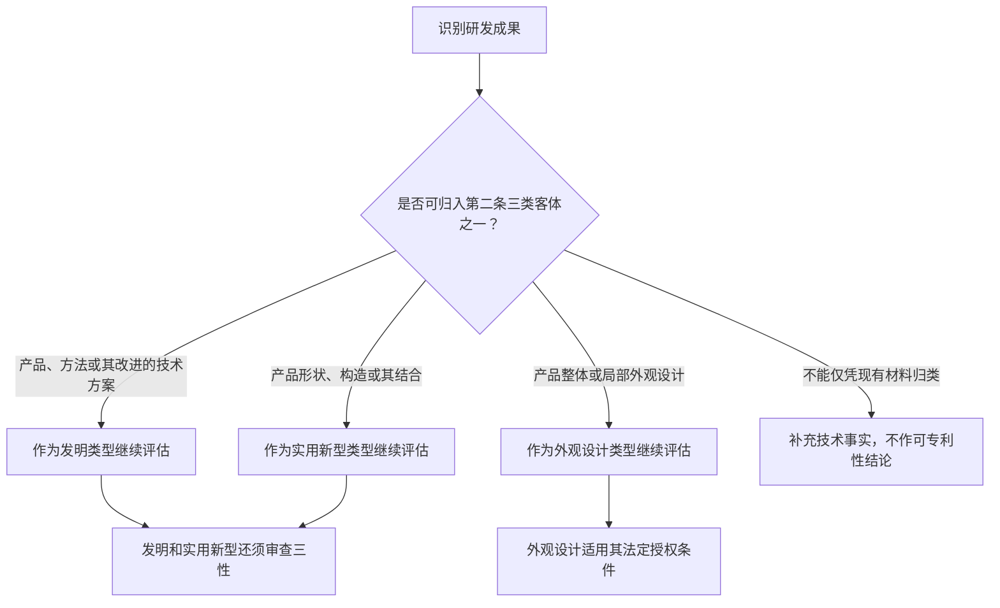
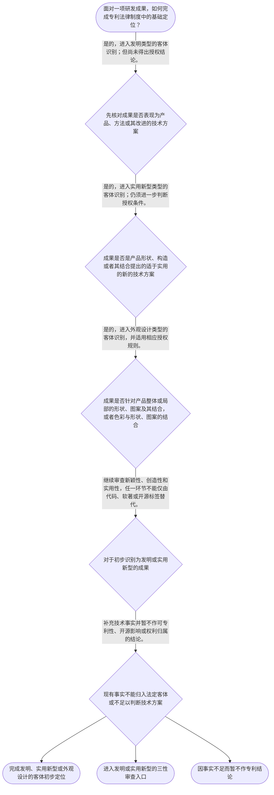

# 整合后的课程完整内容与习题

## 教学模块选择清单

- 当前教学节点：`patent-law-foundation`
- 板块预算：自适应 6/6，总计 9/9

| # | 模块 (block_type) | 类型 | 触发原因 (trigger) | 对应正文段 | 归属 |
|---:|---|:--:|---|---|:--:|
| 1 | `anchor_scenario` | 自适应 | perception=sensing(0.84) / cold_start | 从研发成果到专利制度入口｜某研发团队准备发布一套智能设备方案：其中包括一项降低设备能耗的数据处理方法、一个有特殊内部卡… | [A] |
| 2 | `legal_anchor` | 必选 | mandatory | 法条锚定：客体与三性｜《专利法》第二条 | [A] |
| 3 | `worked_example` | 自适应 | cold_start(low_confidence) | 演示：把一个研发包拆分为不同客体入口｜某公司研发包包含三项成果：第一，控制设备能耗的数据处理方法；第二，具有新型内部连接构造的散热… | [A] |
| 4 | `decision_flow` | 自适应 | input=visual(0.79) | 可视化决策流程：成果的专利基础定位｜面对一项研发成果，如何完成专利法律制度中的基础定位？ | [A] |
| 5 | `mnemonic` | 自适应 | understanding=sequential(0.76) | 顺序记忆表：客—权—审｜顺序记忆表：客—权—审。先看客体，再看权利边界，最后进入授权审查；对发明和实用新型补记“三性… | [A] |
| 6 | `predict_activate` | 自适应 | processing=active(0.64) | 先预测：一项成果为何不能只贴一个标签｜某项目同时包含数据处理方法、硬件内部结构和产品外壳图案；即使项目被称为“软件项目”，你预测三… | [A] |
| 7 | `assessment` | 必选 | mandatory | 三类测评｜复习三类发明创造中“发明”的法定定义。 | [A] |
| 8 | `knowledge_synthesis` | 必选 | mandatory | 本节点知识综合｜专利权特征：独占性、时间性、地域性共同限定权利的基本边界，不能把专利理解为无限或全球当然有效… | [A] |
| 9 | `summary_card` | 自适应 | len(knowledge_sub_nodes)=3>=3 | 专利法律制度基础速查卡｜专利基础判断的主线是：先识别客体，再把权利放入时间和地域边界，最后在适用时进入法定授权条件审… | [A] |

## 教学正文

## I — 法律问题

本节点先解决一个基础定位问题：面对一项研发成果，应先区分其是否属于专利法所称的三类发明创造，并理解专利权作为法律权利所具有的独占性、时间性和地域性。对于你关心的算法、开源协议与软件著作权，本节只建立判断入口：不能仅因成果表现为“代码”或“算法”就直接得出能否取得专利、是否受开源条款影响或应当选择何种保护的结论；这些边界需要在后续实体可专利性与相关法律节点中依规则分别判断。

## R — 适用规则

### 1. 先识别专利法保护的客体

《专利法》第二条将“发明创造”限定为发明、实用新型和外观设计三类。发明是对产品、方法或者其改进提出的新的技术方案；实用新型针对产品的形状、构造或者其结合提出适于实用的新的技术方案；外观设计针对产品整体或局部的形状、图案及其结合，或者色彩与形状、图案的结合，提出富有美感并适于工业应用的新设计。〔RAG: 中华人民共和国专利法.txt — 第二条：发明创造是指发明、实用新型和外观设计；分别界定三类客体〕

因此，基础分类应当按“技术方案属于产品、方法或改进”“产品形状或构造”“产品外观设计”三个入口进行。此处的分类只是识别可能适用的专利类型，尚不等于必然授权。

### 2. 再理解专利制度的权利边界

专利制度以公开换取在法定条件和法定期限内的权利保护：

- **独占性**：专利权具有排他性质，但具体排他范围不能脱离依法授予的权利内容。
- **时间性**：专利保护不是永久性的，权利只在法定期间内存在。
- **地域性**：专利权依授予国或地区的法律发生效力，不能当然跨越不同法域。

上述三项是理解“开源发布是否影响专利”“软件著作权与专利能否并存”等问题的前提，而不是对具体协议或具体软件的结论。

### 3. 把制度体系与审查阶段分开看

本课程框架将《专利法》、专利法实施细则和专利审查指南列为中国专利制度的核心规范层次：法律规定基本制度，实施细则承接程序和实施性规定，审查指南用于细化审查标准的适用。当前检索上下文未提供实施细则和审查指南的具体原文，故本节不对其具体条款作延伸解释。

制度运行中，“公开”与“审查”是两个不同维度。已检索的《专利法》第二十二条以申请日前国内外为公众所知的技术界定现有技术，并以新颖性、创造性、实用性规定发明和实用新型的授权条件。〔RAG: 中华人民共和国专利法.txt — 第二十二条：发明和实用新型应具备新颖性、创造性和实用性；现有技术为申请日前在国内外为公众所知的技术〕 这说明技术公开可能与后续授权判断有关；但“早期公开延迟审查、初步审查制与实质审查制并存”的具体程序规则，检索上下文未提供直接依据，本节仅将其作为制度发展与程序分工的学习线索，不据此作期限或程序效果判断。

### 4. 认识专利制度的功能

从制度结构看，申请人以公开技术信息进入审查和授权体系，社会公众能够获知技术信息；通过对符合条件的发明创造授予受限期限和地域的权利，制度旨在激励发明创造、促进技术公开、推动技术应用和经济发展。该功能表述用于理解制度设计，不替代每一件申请必须满足的法定授权条件。

## A — 规则适用

可以按下列线性步骤处理研发成果的基础定位：



例如，某研发团队形成三项成果：一种降低服务器能耗的数据处理方法、一种带有特殊内部结构的散热模块，以及一套产品界面视觉稿。第一项可能进入“方法技术方案”的发明类型入口；第二项可能进入“产品形状、构造”的实用新型入口；第三项是否属于外观设计，还须先确认其是否对应产品外观及其他法定条件。仅有源代码、算法名称、开源仓库地址或登记了软件著作权，均不足以在本节点直接代替上述客体识别与后续授权判断。

对发明和实用新型，分类之后还必须通过第二十二条的三性门槛：新颖性关注是否已落入现有技术或法定的在先申请情形；创造性关注相对于现有技术的实质性特点和进步；实用性关注能否制造或使用并产生积极效果。〔RAG: 中华人民共和国专利法.txt — 第二十二条：新颖性、创造性、实用性的定义及现有技术定义〕 这一步只说明“分类后仍需审查”，不在本基础节点展开三性的完整判断方法。

申请日对上述判断具有基础意义。已检索条文规定，国务院专利行政部门收到专利申请文件之日为申请日；对于符合条件的相同主题在先申请，发明或实用新型可在十二个月内、外观设计可在六个月内主张外国或本国优先权。〔RAG: 中华人民共和国专利法.txt — 第二十八条：收到申请文件之日为申请日；第二十九条：发明和实用新型十二个月、外观设计六个月的优先权期限〕 优先权的具体适用条件和法律效果留待后续专题处理。

## C — 结论

本节点的结论是：专利法律制度首先以发明、实用新型、外观设计识别保护客体；专利权须放在独占性、时间性、地域性的边界内理解；对发明和实用新型，客体识别后仍须满足新颖性、创造性、实用性。算法、开源协议与软件著作权问题不能用“有代码”或“已开源”一概而论，应先完成本节点的客体和制度定位，再进入后续节点作实体和相关法律分析。

> 常见误区 / 易混淆点
>
> 1. “属于发明”不等于“必然授权”。发明和实用新型仍要满足第二十二条的三性。
> 2. “软件著作权登记”与“取得专利权”不是同一法律判断；当前检索上下文未提供著作权法或开源协议原文，不能据此断言二者的具体效果。
> 3. “专利制度体系”与“某件申请的审查结论”不同：前者是规范和程序框架，后者取决于个案事实与适用规则。
> 4. 本节设有测评，请到【习题】区作答。

### 从研发成果到专利制度入口（anchor_scenario）

> 某研发团队准备发布一套智能设备方案：其中包括一项降低设备能耗的数据处理方法、一个有特殊内部卡扣结构的硬件模组，以及产品外壳上的图案设计。团队还计划把部分代码放入开源仓库，并已为软件界面办理软件著作权登记。负责人因此提出：这些成果是否都能申请专利，开源或软著是否会自动决定专利结果？

此时最需要避免的不是马上下结论，而是把不同对象和不同法律效果混在一起。应先识别每项成果在专利法中的可能客体，再判断其是否还要经过授权条件和程序规则的检验。

**锚定**：该情境锚定三类专利客体、专利权边界以及“代码、开源、软著不能替代专利判断”的基础区分。

**先想一想**：面对同一项目中的方法、硬件结构和外观图案，为什么不宜用一个统一的“能申请或不能申请”结论处理？

### 法条锚定：客体与三性（legal_anchor）

- **《专利法》第二条**：专利法保护的发明创造分为发明、实用新型和外观设计，三者的对象定义不同。
- **《专利法》第二十二条**：发明和实用新型除属于法定客体外，还必须同时具备新颖性、创造性和实用性。
- **《专利法》第二十九条**：同一主题的在先申请在符合条件时可主张优先权；发明和实用新型期限为十二个月，外观设计期限为六个月。

**为何重要**：第二条解决“先把成果放进哪一种专利客体”的问题，第二十二条说明“放进去后仍须通过授权条件”。第二十九条提示申请时间可能影响后续判断，但其具体适用留待专题学习。

### 演示：把一个研发包拆分为不同客体入口（worked_example）

**案情/例题**：某公司研发包包含三项成果：第一，控制设备能耗的数据处理方法；第二，具有新型内部连接构造的散热模块；第三，产品外壳的局部图案。公司拟统一以“软件成果”申请专利。应如何作基础分类，并在何处停止作出授权结论？
**适用规则**：《专利法》第二条；对可能属于发明或实用新型的成果，进一步适用《专利法》第二十二条。
**分步推演**：
1. 先将每一项成果的技术事实拆开，而不是以项目名称、是否含代码或是否已登记软件著作权作为分类依据。 → *分类对象是具体成果，不是项目标签。*
2. 数据处理方法如构成对方法或其改进提出的新的技术方案，可进入发明类型的识别入口；此处只作客体初筛。 → *方法技术方案可能对应发明。*
3. 散热模块的内部连接构造，如属于产品形状、构造或者其结合提出的适于实用的新的技术方案，可进入实用新型类型的识别入口；产品外壳图案则应按产品外观的法定定义另行核对。 → *结构与外观不能混作同一客体。*
4. 对经初筛可能属于发明或实用新型的部分，仍须按第二十二条审查新颖性、创造性和实用性；现有材料不足以直接断言是否授权。 → *客体识别不是授权结论。*
**结论**：该研发包不能统一按“软件成果”处理；应分别识别方法、产品构造和产品外观的可能客体，并对发明或实用新型继续进行三性判断。
**本题要点**：先分成果、后定客体、再审授权条件，是处理复合研发项目的基础判定链。

### 可视化决策流程：成果的专利基础定位（decision_flow）

**决策问题**：面对一项研发成果，如何完成专利法律制度中的基础定位？



### 顺序记忆表：客—权—审（mnemonic）

**记忆锚**：顺序记忆表：客—权—审。先看客体，再看权利边界，最后进入授权审查；对发明和实用新型补记“三性：新—创—实”。
**映射**：
- 客
- 权
- 审
- 新—创—实
**何时用**：看到“算法、代码、软著、开源能否申请专利”这类问题时，先按“客—权—审”排除跳步下结论。

### 先预测：一项成果为何不能只贴一个标签（predict_activate）

**预测/激活**：某项目同时包含数据处理方法、硬件内部结构和产品外壳图案；即使项目被称为“软件项目”，你预测三项成果会不会必然进入同一种专利类型？

**激活旧知**：研发成果可以由不同技术与设计要素构成，法律分类应以具体对象和法定定义为依据的已有理解。

**揭晓方向**：先把项目拆成具体成果，再对照“产品、方法或改进”“产品形状构造”“产品外观”三个法定入口。

### 本节点知识综合（knowledge_synthesis）

**知识框架**：
- 专利权特征：独占性、时间性、地域性共同限定权利的基本边界，不能把专利理解为无限或全球当然有效的权利。
- 规范体系定位：专利法、专利法实施细则和专利审查指南构成课程框架中的核心规范层次；当前材料未提供后两者具体原文。
- 保护客体：第二条将发明创造分为发明、实用新型和外观设计，分类应依据具体成果而非项目标签。
- 授权条件入口：发明和实用新型在客体识别后还应满足新颖性、创造性、实用性。
- 制度功能与程序线索：制度通过公开、审查与授权安排激励创新和促进技术应用；公开与审查是不同维度，具体程序细节须以后续材料为准。
**概念关系**：先识别具体研发成果，再对应第二条的客体定义；对于发明和实用新型，随后进入第二十二条的三性判断。；权利的独占性、时间性、地域性解释专利制度的边界；制度规范体系和个案审查结论属于不同层次。；申请日与优先权属于后续判断的时间基础，不能与成果客体分类或公开事实混同。
**必记**：第二条的客体分类是专利分析的入口，不是授权结论。；发明和实用新型须同时具备新颖性、创造性和实用性。；算法、代码、开源和软件著作权不能仅凭名称直接替代专利法上的客体与授权判断。

### 专利法律制度基础速查卡（summary_card）

**要点卡**：
- **三类客体**：发明、实用新型、外观设计是《专利法》第二条规定的三类发明创造。
- **发明入口**：产品、方法或者其改进所提出的新的技术方案，可能进入发明类型识别。
- **实用新型入口**：产品的形状、构造或者其结合所提出的适于实用的新的技术方案，可能进入实用新型类型识别。
- **三性门槛**：发明和实用新型在客体识别后，还必须具备新颖性、创造性、实用性。
- **权利边界**：独占性、时间性、地域性共同提醒：专利权不是无限、永久或全球当然有效。
- **制度与程序**：公开、审查、授权相互关联但并非同一概念；具体程序效果须依据相应规范判断。
**必背**：《专利法》第二条：发明创造包括发明、实用新型和外观设计。；《专利法》第二十二条：发明和实用新型应当具备新颖性、创造性和实用性。；先分具体成果、再定法定客体、后审授权条件。
**一句话总结**：专利基础判断的主线是：先识别客体，再把权利放入时间和地域边界，最后在适用时进入法定授权条件审查。

### 三类测评（assessment）

**三类覆盖**：backward_review、forward_probe、weakness_probe
**题目**：
- q1：复习三类发明创造中“发明”的法定定义。
- q2：在复合研发成果中按客体识别后进入三性审查的顺序。
- q3：探测下一节点对专利法律体系核心规范的识别。


## 结构化数据

## expert

```json
"expert_a"
```

## style

```json
"conservative"
```

## knowledge_points

```json
[
  {
    "node_id": "patent-law-foundation",
    "kc_name": "专利制度的基本概念与特征：独占性、时间性、地域性"
  },
  {
    "node_id": "patent-law-foundation",
    "kc_name": "中国专利制度体系：专利法、专利法实施细则、专利审查指南"
  },
  {
    "node_id": "patent-law-foundation",
    "kc_name": "专利保护的三种客体：发明、实用新型、外观设计"
  },
  {
    "node_id": "patent-law-foundation",
    "kc_name": "专利制度的作用：激励发明创造、促进技术公开、推动技术应用和经济发展"
  },
  {
    "node_id": "patent-law-foundation",
    "kc_name": "中国专利制度发展特点：早期公开延迟审查、初步审查制与实质审查制并存"
  }
]
```

## legal_basis

```json
[
  {
    "article": "《中华人民共和国专利法》第二条",
    "source": "中华人民共和国专利法.txt：第二条"
  },
  {
    "article": "《中华人民共和国专利法》第二十二条",
    "source": "中华人民共和国专利法.txt：第二十二条"
  },
  {
    "article": "《中华人民共和国专利法》第二十九条",
    "source": "中华人民共和国专利法.txt：第二十九条"
  }
]
```

## risks

```json
[
  {
    "risk": "将《专利法》第二条的三类客体识别误认为已经完成授权判断，忽略发明和实用新型还须满足第二十二条的三性。",
    "related_node_id": "patent-law-foundation"
  },
  {
    "risk": "把算法、源代码、软件著作权登记或开源发布直接等同于专利授权、专利无效或许可结论；当前节点和检索材料均不足以支持该类个案结论。",
    "related_node_id": "patent-law-foundation"
  },
  {
    "risk": "把公开、申请日、审查阶段混为同一概念，进而错误推断公开行为或程序阶段的法律后果。",
    "related_node_id": "patent-law-foundation"
  }
]
```

## draft_stage

```json
"debate"
```

## irac

```json
{
  "issue": "研发成果应如何在专利法律制度中完成基础定位，并如何避免将算法、代码、开源或软件著作权与专利客体、授权和权利边界混为一谈。",
  "rule": "《专利法》第二条规定发明创造包括发明、实用新型和外观设计，并分别界定其对象；第二十二条规定发明和实用新型须具备新颖性、创造性和实用性；第二十八条、第二十九条规定申请日及优先权的基本时间规则。",
  "application": "应先根据成果是产品、方法或改进的技术方案、产品形状构造，还是产品外观进行客体识别；如属于发明或实用新型，再进入三性判断。算法、代码、开源协议和软件著作权的具体法律效果不能仅凭名称或载体推断，且当前检索材料未提供相关协议或著作权规则原文。",
  "conclusion": "专利基础判断的正确顺序是先识别法定客体，再理解权利的独占性、时间性和地域性，并在适用时继续审查三性；不能以软件著作权或开源事实替代专利法上的个案判断。"
}
```

## interactive_questions

```json
[
  {
    "qid": "q1",
    "category": "understand",
    "difficulty": "L1",
    "source_tag": "backward_review",
    "kc_node_id": "patent-law-foundation",
    "question": "根据《专利法》第二条，下列对三类发明创造的表述，正确的是哪一项？",
    "answer": "B",
    "options": [
      "A. 发明仅指产品的外观设计",
      "B. 发明可以是对产品、方法或者其改进所提出的新的技术方案",
      "C. 实用新型仅指计算机程序的表达形式",
      "D. 外观设计是对抽象技术原理本身作出的新发现"
    ]
  },
  {
    "qid": "q2",
    "category": "analyze",
    "difficulty": "L3",
    "source_tag": "weakness_probe",
    "kc_node_id": "patent-law-foundation",
    "question": "某团队完成一项服务器散热模块，既有可制造的内部连接结构，也有独特的表面图案；团队同时提交了一份方法技术方案。下列基础判断顺序最恰当的是哪一项？",
    "answer": "C",
    "options": [
      "A. 只要登记软件著作权，三项成果均当然获得专利保护",
      "B. 先认定所有成果均为外观设计，再判断是否具有创造性",
      "C. 分别识别方法技术方案、产品形状构造和产品外观可能对应的专利客体；对发明和实用新型再审查三性",
      "D. 因成果尚未公开，故无需识别专利客体即可直接授予专利权"
    ]
  },
  {
    "qid": "q3",
    "category": "remember",
    "difficulty": "L1",
    "source_tag": "forward_probe",
    "kc_node_id": "patent-law-framework",
    "question": "下列哪一组属于本课程所述中国专利制度的核心规范体系？",
    "answer": "A",
    "options": [
      "A. 专利法、专利法实施细则、专利审查指南",
      "B. 刑法、刑事诉讼法、行政处罚法",
      "C. 商标法、反垄断法、公司法",
      "D. 民法典、劳动法、消费者权益保护法"
    ]
  }
]
```

## knowledge_synthesis

```json
{
  "node": "patent-law-foundation",
  "coverage": [
    {
      "node_id": "patent-law-foundation"
    },
    {
      "node_id": "patent-law-foundation"
    },
    {
      "node_id": "patent-law-foundation"
    },
    {
      "node_id": "patent-law-foundation"
    },
    {
      "node_id": "patent-law-foundation"
    }
  ],
  "confusable_pairs": [
    {
      "pair": "专利客体识别与专利授权：属于第二条三类客体不等于已经满足授权条件。"
    },
    {
      "pair": "发明、实用新型与外观设计：分别对应技术方案、产品形状构造、产品外观，不能以“软件项目”名称统一归类。"
    },
    {
      "pair": "专利权边界与软件著作权、开源协议：前者涉及专利制度中的权利特征；后两者的具体效果须依据相关法律和协议文本，不能直接替代专利判断。"
    },
    {
      "pair": "公开、申请日与审查：三者相关但不是同一概念，具体法律效果须依条文和个案事实确定。"
    }
  ]
}
```
