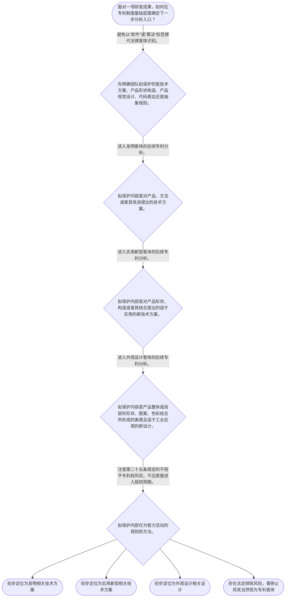

# 整合后的课程完整内容与习题

## 教学模块选择清单

- 当前教学节点：`patent-law-foundation`
- 板块预算：自适应 6/6，总计 9/9

| # | 模块 (block_type) | 类型 | 触发原因 (trigger) | 对应正文段 | 归属 |
|---:|---|:--:|---|---|:--:|
| 1 | `anchor_scenario` | 自适应 | perception=sensing(0.84) / cold_start | 从研发交付物看见专利客体问题｜某工业软件团队为工厂开发了能耗优化系统：传感器持续采集温度、压力和设备负载，程序根据数据计算… | [A] |
| 2 | `legal_anchor` | 必选 | mandatory | 专利制度基础的法条锚点｜《专利法》第一条 | [A] |
| 3 | `worked_example` | 自适应 | cold_start(low_confidence) | 能耗优化系统的客体识别演示｜某团队拟保护一项用于工业设备的能耗优化方案：系统接收多个传感器数据，经计算后生成控制指令并自… | [A] |
| 4 | `decision_flow` | 自适应 | input=visual(0.79) | 研发成果进入专利分析的定位流程｜面对一项研发成果，如何在专利制度基础层面确定下一步分析入口？ | [A] |
| 5 | `mnemonic` | 自适应 | understanding=sequential(0.76) | 专利基础四格定位表｜四格定位表：目—物—除—程。先看制度目的，再定三类客体，再查法定排除，最后进入法定程序。 | [A] |
| 6 | `predict_activate` | 自适应 | processing=active(0.64) | 先预测：代码是否等于专利｜研发团队已经完成源代码并在内部运行成功。你预测：仅凭这一事实，能否直接得出其已经拥有专利权？ | [A] |
| 7 | `assessment` | 必选 | mandatory | 基础框架测评｜复习专利法规定的三类发明创造。 | [A] |
| 8 | `knowledge_synthesis` | 必选 | mandatory | 专利法律制度基础框架｜权利特征：专利权的独占性、时间性与地域性共同限定其效力边界，不能理解为研发成果的天然全球权利… | [A] |
| 9 | `summary_card` | 自适应 | len(knowledge_sub_nodes)=3>=3 | 专利制度基础速查卡｜专利基础分析的起点不是“有没有代码”，而是“主张的内容是否属于法定技术客体并未落入排除范围”… | [A] |

## 教学正文

## I — 法律问题

本节先建立一个明确结论：**专利并不当然保护“软件”“算法”或“代码”这一名称所指的一切内容；首先必须识别技术成果属于哪一类法定专利客体，再区分其是否只是智力活动的规则和方法。**

围绕研发成果，需要依次回答五个基础问题：专利制度保护的对象是什么；权利为何具有独占性、时间性和地域性；中国制度由哪些规范构成；制度为何要求技术公开与权利保护并行；以及不同专利类型在申请与审查上为何存在分工。开源协议与软件著作权的具体边界，涉及其他知识产权法和合同安排，本节不作实体结论；本节只建立后续分析所必需的“专利客体—制度功能—规范层次”坐标。

## R — 适用规则

### 1. 专利制度的目的与交换结构

《专利法》第一条将保护专利权人合法权益、鼓励发明创造、推动发明创造应用、提高创新能力，以及促进科学技术进步和经济社会发展，列为立法目的。〔RAG: 中华人民共和国专利法.txt — 第一条“保护专利权人的合法权益，鼓励发明创造，推动发明创造的应用”〕

据此，专利制度可以理解为法定的技术公开与权利保护安排：申请人通过法定程序公开技术信息并申请权利；国家依法审查、授予符合条件的专利；专利权并非天然存在，也不能脱离法定边界主张。

### 2. 三类法定保护客体

《专利法》第二条规定，发明创造包括发明、实用新型和外观设计。发明是对产品、方法或者其改进提出的新的技术方案；实用新型是对产品形状、构造或者其结合提出的适于实用的新的技术方案；外观设计则是对产品整体或者局部的形状、图案或其结合，以及色彩与形状、图案结合所作出的、富有美感并适于工业应用的新设计。〔RAG: 中华人民共和国专利法.txt — 第二条“发明创造是指发明、实用新型和外观设计”及三类定义〕

因此，判断研发成果时不能只看其载体是硬件、软件还是文档，而要先看所主张的内容：是否是产品、方法或其改进的技术方案；是否仅涉及产品形状、构造；或者是否属于产品视觉设计。对于仅以抽象规则、计算步骤或组织方法为内容而未能落入技术方案的主张，尤其要注意《专利法》第二十五条关于“智力活动的规则和方法”不授予专利权的限制。〔RAG: 中华人民共和国专利法.txt — 第二十五条“智力活动的规则和方法”不授予专利权〕

### 3. 权利特征与规范层次

专利权的独占性，是指权利人可以在法律规定的范围内排除他人未经许可实施受保护的技术方案；时间性是指专利权受法定期限约束；地域性是指其效力以授予该权利的国家或地区为边界。这三项是制度特征，不意味着任何技术成果一经研发即自动获得排他权。

中国专利制度的核心规范层次可按“法律—实施规则—审查操作”理解：专利法提供基本制度和权利基础；专利法实施细则细化程序和技术性要求；专利审查指南用于审查实践中的具体判断。国务院专利行政部门统一受理、审查专利申请并依法授予专利权。〔RAG: 中华人民共和国专利法.txt — 第三条“统一受理和审查专利申请，依法授予专利权”〕

### 4. 制度发展与审查分工

检索材料显示，《专利法》于1984年通过，并经历多次修正。〔RAG: 中华人民共和国专利法.txt — “1984年3月12日…通过”及1992年、2000年、2008年、2020年修正记录〕 在申请程序中，实施细则第四十三条分别列举发明、实用新型与外观设计申请被明确申请日和给予申请号所需的基本文件，体现三类客体均有法定申请入口。〔RAG: 中华人民共和国专利法实施细则.txt — 第四十三条列举发明、实用新型与外观设计申请文件〕

本节所称“初步审查制与实质审查制并存”，是对中国专利审查分工的基础性概括；检索上下文未提供三类专利审查范围与启动条件的完整直接条文，不能据此进一步推出具体程序期限或每一类型的完整审查结论。

## A — 规则适用

以研发团队开发“工业设备能耗优化系统”为例，应按下列顺序定位：

1. **先剥离表现形式。** 源代码、说明文档和界面设计并不当然等于同一项专利客体；专利法第二条所问的是被主张的发明创造属于何种技术方案或设计。
2. **再识别技术内容。** 若团队主张的是利用传感器采集设备状态、根据计算结果调整设备运行参数以降低能耗的方法，应进一步围绕其是否构成“对产品、方法或者其改进所提出的新的技术方案”审查。〔RAG: 中华人民共和国专利法.txt — 第二条对发明的定义〕
3. **排除纯规则主张。** 若主张仅为抽象的排班、计分或商业组织规则，而没有可识别的技术方案内容，则要警惕落入“智力活动的规则和方法”不授予专利权的范围。〔RAG: 中华人民共和国专利法.txt — 第二十五条第二项〕
4. **最后确定制度路径。** 客体初步定位后，才进入申请、审查和权利取得的法定程序；受理、审查和授权由国务院专利行政部门依法进行。〔RAG: 中华人民共和国专利法.txt — 第三条〕

对用户关心的“算法专利性”，本节的可靠起点不是“算法能否专利”的二分回答，而是：算法被怎样写入请求保护的技术内容；它是否仍停留在智力活动规则层面；以及它是否能够被定位为法定技术方案。关于软件著作权保护的对象、开源协议的许可义务、开源披露对专利新颖性的具体影响，检索上下文未提供直接依据，应在后续相关法律、专利性与合同节点分别核验，不能以本节的基础规则替代结论。

## C — 结论

专利制度基础的判断顺序是：**先识别法定客体，再核对法定排除，再进入申请、审查和权利边界。** 发明、实用新型、外观设计是《专利法》第二条规定的三类发明创造；专利制度以鼓励创新、技术公开和推动应用为目的；其运行依赖专利法、实施细则和审查指南等规范层次。算法、开源协议和软件著作权的交叉问题，必须在这个基础框架上再作针对性分析。

> 常见误区 / 易混淆点
>
> 1. 把“写出了代码”直接等同于“取得了专利权”。代码载体、技术方案和依法授予的专利权是不同层次。
> 2. 把“算法”一概认定为可专利或不可专利。基础法条已明确排除智力活动的规则和方法；是否构成技术方案仍需结合具体主张核验。
> 3. 把专利法、实施细则和审查指南当作效力与功能完全相同的文件。学习时应先按法律、实施规则、审查操作三个层次定位。
> 4. 把专利权理解为无期限、全球当然有效的权利。独占性、时间性和地域性必须同时把握。

本节设有测评，请到【习题】区作答。

### 从研发交付物看见专利客体问题（anchor_scenario）

> 某工业软件团队为工厂开发了能耗优化系统：传感器持续采集温度、压力和设备负载，程序根据数据计算控制指令，再自动调节阀门和电机转速。团队既保存了源代码，也准备公开产品界面，并想把“优化算法”申请专利。

负责人提出三个看似相近的问题：源代码是否等于专利；算法是否一定不能申请；如果界面很美观，是否应当按外观设计处理。真正的冲突在于，同一项目有多种成果表现，但专利法要求先辨认被主张的法定客体。

**锚定**：该情境锚定“研发成果表现形式”与“专利法定客体”不能直接画等号的基础边界。

**先想一想**：在尚未讨论新颖性或开源许可前，你会先把该团队拟保护的内容归为技术方案、产品构造还是产品视觉设计？

### 专利制度基础的法条锚点（legal_anchor）

- **《专利法》第一条**：专利制度不仅保护权利人，也服务于鼓励创新、技术应用和科技进步。
- **《专利法》第二条**：专利法承认的发明创造只有发明、实用新型和外观设计，并对三者分别定义。
- **《专利法》第二十五条**：单纯属于智力活动规则和方法的内容，法律明确不授予专利权。
- **《专利法》第三条**：专利申请由国务院专利行政部门统一受理和审查，并依法授予专利权。

**为何重要**：这四条构成从“制度为什么存在”到“什么可成为客体”再到“由谁依法授予”的最小法条链。算法与软件相关问题必须先通过这一法条链定位。

### 能耗优化系统的客体识别演示（worked_example）

**案情/例题**：某团队拟保护一项用于工业设备的能耗优化方案：系统接收多个传感器数据，经计算后生成控制指令并自动调整电机转速。团队同时拥有程序源代码和产品界面。需要先在专利制度基础层面识别其应当被审查的对象，而不是直接断言“算法可以”或“不可以”申请专利。
**适用规则**：《专利法》第二条关于发明、实用新型、外观设计的定义；《专利法》第二十五条关于智力活动规则和方法不授予专利权的规定。
**分步推演**：
1. 先拆分成果：源代码、控制方法、设备结构和产品界面可能分别承载不同内容，不能以“软件项目”作为单一法律客体。 → *先分离成果表现与拟保护内容。*
2. 控制方法若被主张为对设备运行过程的技术改进，应先对照第二条中“对产品、方法或者其改进所提出的新的技术方案”的定义进行定位。 → *方法性主张先进入发明客体识别。*
3. 若主张只剩抽象的计算或组织规则而无可识别的技术方案内容，则须警惕第二十五条所列智力活动规则和方法的排除。 → *不能把纯规则直接包装为专利客体。*
4. 产品界面的美感或源代码的表达形式，并不当然改变控制方法的专利客体判断；应分别识别而非相互替代。 → *同一项目可有多个法律问题，但本节只完成专利客体定位。*
**结论**：该方案不能仅因含有算法或源代码而得到肯定或否定结论；正确起点是判断所主张内容能否定位为第二条规定的技术方案，并核查是否仅属第二十五条排除的智力活动规则和方法。
**本题要点**：面对软件研发成果，先做“主张内容—法定客体—排除事项”的三步定位。

### 研发成果进入专利分析的定位流程（decision_flow）

**决策问题**：面对一项研发成果，如何在专利制度基础层面确定下一步分析入口？



### 专利基础四格定位表（mnemonic）

**记忆锚**：四格定位表：目—物—除—程。先看制度目的，再定三类客体，再查法定排除，最后进入法定程序。
**映射**：
- 目
- 物
- 除
- 程
**何时用**：遇到“算法、代码、界面或产品结构能否申请专利”的问题时，按“目—物—除—程”逐格核对。

### 先预测：代码是否等于专利（predict_activate）

**预测/激活**：研发团队已经完成源代码并在内部运行成功。你预测：仅凭这一事实，能否直接得出其已经拥有专利权？

**激活旧知**：激活已有的知识产权常识：技术成果的存在、法律客体的识别和法定权利取得不是同一个层次。

**揭晓方向**：先区分“研发成果是什么”与“国家是否依法授予专利权”，再回到第二条和第三条。

### 专利法律制度基础框架（knowledge_synthesis）

**知识框架**：
- 权利特征：专利权的独占性、时间性与地域性共同限定其效力边界，不能理解为研发成果的天然全球权利。
- 规范体系：专利法提供基本制度，专利法实施细则细化程序要求，专利审查指南服务于审查操作。
- 保护客体：发明、实用新型和外观设计是第二条规定的三类发明创造，必须按主张内容而非项目名称分类。
- 制度功能：专利制度通过保护合法权益、鼓励创造和推动应用，服务于科技进步和经济社会发展。
- 制度发展与审查：专利法自1984年制定并多次修正；不同专利类型在申请和审查机制上存在制度分工。
**概念关系**：制度目的解释为什么要以公开与保护促进创新；法定客体决定什么内容可以进入专利分析；法定排除划出客体的边界；受理、审查和授权程序决定权利如何依法产生。；软件、算法、开源协议和软件著作权并非同一层次问题：本节点只完成专利制度与客体的基础定位，具体交叉规则需在后续节点另行核验。
**必记**：专利客体判断先看第二条的三类法定定义，不能以“代码”或“算法”标签直接替代。；智力活动的规则和方法属于第二十五条列明的不授予专利权事项，需与技术方案严格区分。；专利权须经法定程序取得，独占性、时间性和地域性必须同时理解。

### 专利制度基础速查卡（summary_card）

**要点卡**：
- **三类客体**：发明、实用新型、外观设计是《专利法》第二条规定的三类发明创造。
- **算法边界起点**：先判断主张是否为技术方案，再警惕是否仅属智力活动规则和方法。
- **权利特征**：专利权具有独占性、时间性和地域性，不是技术成果的当然无限权利。
- **规范层次**：专利法定基本制度，实施细则细化程序，审查指南服务审查操作。
- **制度功能**：保护与激励并行，推动技术应用并促进科技进步和经济社会发展。
**必背**：《专利法》第二条：发明创造包括发明、实用新型和外观设计。；《专利法》第二十五条：智力活动的规则和方法不授予专利权。；先定客体，再查排除，后走程序。
**一句话总结**：专利基础分析的起点不是“有没有代码”，而是“主张的内容是否属于法定技术客体并未落入排除范围”。

### 基础框架测评（assessment）

**三类覆盖**：backward_review、forward_probe、weakness_probe
**题目**：
- q_foundation_review_l1：复习专利法规定的三类发明创造。
- q_framework_probe_l1：仅探测下一节点的核心规范层次概念。
- q_foundation_weakness_l3：分析含算法的设备控制方案应如何进行客体定位。


## 结构化数据

## expert

```json
"expert_a"
```

## style

```json
"conservative"
```

## knowledge_points

```json
[
  {
    "node_id": "patent-law-foundation",
    "kc_name": "专利制度的基本特征：专利权具有依法取得的独占性、法定期限内的时间性和以授予国或地区为边界的地域性。"
  },
  {
    "node_id": "patent-law-foundation",
    "kc_name": "中国专利制度的核心规范层次：专利法、专利法实施细则与专利审查指南。"
  },
  {
    "node_id": "patent-law-foundation",
    "kc_name": "专利保护客体：发明、实用新型和外观设计，及其法定定义。"
  },
  {
    "node_id": "patent-law-foundation",
    "kc_name": "专利制度功能：保护合法权益、鼓励发明创造、推动应用并促进科技进步和经济社会发展。"
  },
  {
    "node_id": "patent-law-foundation",
    "kc_name": "中国专利制度发展与审查特点：专利法自1984年制定，发明、实用新型和外观设计在审查机制上存在初步审查与实质审查的制度分工。"
  }
]
```

## legal_basis

```json
[
  {
    "article": "《中华人民共和国专利法》第一条",
    "source": "中华人民共和国专利法.txt：第一条规定保护专利权人合法权益、鼓励发明创造、推动应用、提高创新能力并促进科学技术进步和经济社会发展。"
  },
  {
    "article": "《中华人民共和国专利法》第二条",
    "source": "中华人民共和国专利法.txt：第二条规定发明创造包括发明、实用新型和外观设计，并分别界定三类客体。"
  },
  {
    "article": "《中华人民共和国专利法》第二十五条",
    "source": "中华人民共和国专利法.txt：第二十五条规定智力活动的规则和方法等不授予专利权。"
  },
  {
    "article": "《中华人民共和国专利法》第三条",
    "source": "中华人民共和国专利法.txt：第三条规定国务院专利行政部门统一受理和审查专利申请，依法授予专利权。"
  },
  {
    "article": "《中华人民共和国专利法实施细则》第四十三条",
    "source": "中华人民共和国专利法实施细则.txt：第四十三条规定收到不同类别申请的法定文件后明确申请日、给予申请号并通知申请人。"
  }
]
```

## risks

```json
[
  {
    "risk": "将软件源代码、抽象算法规则与专利法第二条所称技术方案混为同一保护对象，可能导致错误判断专利客体。",
    "related_node_id": "patent-law-foundation"
  },
  {
    "risk": "将《专利法》第二十五条对智力活动规则和方法的排除，误解为所有涉及计算或软件的技术方案均不能申请专利。",
    "related_node_id": "patent-law-foundation"
  },
  {
    "risk": "在缺少著作权法、开源许可证文本及审查指南直接依据时，对软件著作权或开源协议的具体法律后果作出确定性结论。",
    "related_node_id": "patent-law-framework"
  }
]
```

## draft_stage

```json
"debate"
```

## irac

```json
{
  "issue": "研发成果中的算法、软件实现和产品设计，应如何在专利制度基础层面识别法定保护客体，并避免将专利、软件著作权和开源许可混同？",
  "rule": "《专利法》第一条规定专利制度的保护、激励与应用目的；第二条规定发明、实用新型和外观设计及其定义；第二十五条排除智力活动的规则和方法；第三条规定国务院专利行政部门统一受理、审查并依法授予专利权。",
  "application": "应先将研发成果按技术方案、产品形状构造或产品视觉设计进行客体定位；对仅为抽象规则的方法适用第二十五条排除规则的警示；经客体识别后，才进入依法申请、审查和授权的制度路径。开源协议与软件著作权的具体后果因检索依据不足，不在本节作实体推断。",
  "conclusion": "专利基础判断不能以“有代码”或“有算法”替代法定客体分析；应先依据第二条识别三类客体，并注意第二十五条的法定排除，再按照专利制度的规范层次处理后续问题。"
}
```

## interactive_questions

```json
[
  {
    "qid": "q_foundation_review_l1",
    "category": "understand",
    "difficulty": "L1",
    "source_tag": "backward_review",
    "kc_node_id": "patent-law-foundation",
    "question": "依据《专利法》第二条，下列哪一组完整列出专利法所称的“发明创造”三类客体？",
    "answer": "B",
    "options": [
      "A. 发明、商标、商业秘密",
      "B. 发明、实用新型、外观设计",
      "C. 源代码、算法、数据库",
      "D. 作品、表演、录音录像制品"
    ]
  },
  {
    "qid": "q_framework_probe_l1",
    "category": "remember",
    "difficulty": "L1",
    "source_tag": "forward_probe",
    "kc_node_id": "patent-law-framework",
    "question": "下列哪一项最准确地概括中国专利制度的核心规范层次？",
    "answer": "C",
    "options": [
      "A. 专利法、商标法、反不正当竞争法",
      "B. 专利法、民法典、刑法",
      "C. 专利法、专利法实施细则、专利审查指南",
      "D. 专利法、公司法、劳动法"
    ]
  },
  {
    "qid": "q_foundation_weakness_l3",
    "category": "analyze",
    "difficulty": "L3",
    "source_tag": "weakness_probe",
    "kc_node_id": "patent-law-foundation",
    "question": "某团队拟就“根据设备传感器数据计算并自动调整运行参数以降低能耗的方法”申请专利。仅依据本节基础规则，以下分析路径最恰当的是哪一项？",
    "answer": "D",
    "options": [
      "A. 只要使用了算法，就当然属于智力活动规则，不能申请专利",
      "B. 只要程序已经完成著作权登记，就当然属于发明专利",
      "C. 只要能节约成本，就当然可作为外观设计取得专利",
      "D. 先判断主张是否属于对产品、方法或其改进提出的技术方案，并注意不能仅停留于智力活动规则的方法层面"
    ]
  }
]
```

## knowledge_synthesis

```json
{
  "node": "patent-law-foundation",
  "coverage": [
    {
      "node_id": "patent-rights-nature"
    },
    {
      "node_id": "patent-law-framework"
    },
    {
      "node_id": "patent-law-foundation"
    },
    {
      "node_id": "patent-system-overview"
    }
  ],
  "confusable_pairs": [
    {
      "pair": "“含有算法的软件实现”与“智力活动的规则和方法”并非当然等同；应先识别被主张内容是否为技术方案。"
    },
    {
      "pair": "“源代码或界面存在”与“已取得专利权”并非同一事实；后者必须经过法定申请、审查和授权。"
    },
    {
      "pair": "专利法、专利法实施细则与专利审查指南共同构成核心规范层次，但各自承担的制度功能不同。"
    }
  ]
}
```
