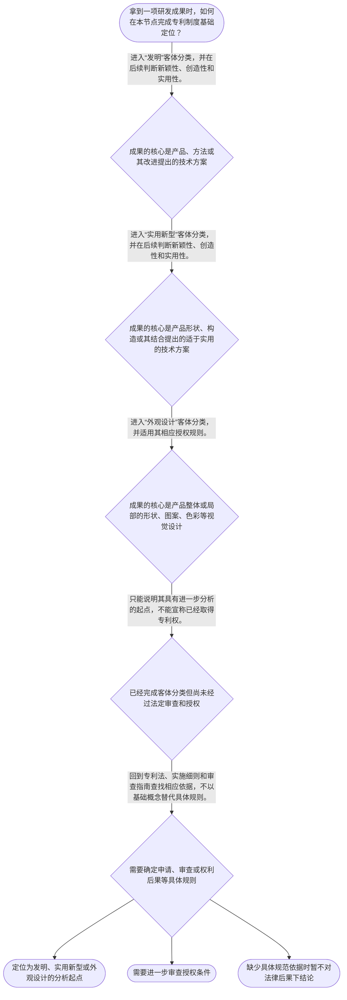

# 整合后的课程完整内容与习题

## 教学模块选择清单

- 当前教学节点：`patent-law-foundation`
- 板块预算：自适应 6/6，总计 9/9

| # | 模块 (block_type) | 类型 | 触发原因 (trigger) | 对应正文段 | 归属 |
|---:|---|:--:|---|---|:--:|
| 1 | `anchor_scenario` | 自适应 | perception=sensing(0.84) / cold_start | 从研发成果到专利制度的第一张地图｜某设备研发团队完成了一个降低工业泵能耗的控制方案：其中既有控制步骤，也有新设计的传感器外壳，… | [A] |
| 2 | `legal_anchor` | 必选 | mandatory | 法条锚点：客体与三性｜《专利法》第二条 | [A] |
| 3 | `worked_example` | 自适应 | cold_start(low_confidence) | 演示：同一项目中的三类专利对象｜甲公司开发智能阀门项目，形成三项成果：第一，依据传感数据自动调节阀门开度的技术步骤；第二，阀… | [A] |
| 4 | `decision_flow` | 自适应 | input=visual(0.79) | 专利制度基础判断流程｜拿到一项研发成果时，如何在本节点完成专利制度基础定位？ | [A] |
| 5 | `mnemonic` | 自适应 | understanding=sequential(0.76) | 分类与边界记忆表｜“三类—三界—三性”对照表：发、实、外；独、时、地；新、创、实。 | [A] |
| 6 | `predict_activate` | 自适应 | processing=active(0.64) | 先预测：分类之后还缺什么｜如果一个成果已经被准确归类为“发明”，你预测它是否已经足以得到专利权？ | [A] |
| 7 | `assessment` | 必选 | mandatory | 本节三类测评｜复习专利法所称发明创造的三类法定客体。 | [A] |
| 8 | `knowledge_synthesis` | 必选 | mandatory | 专利法律制度基础框架｜权利属性：专利权是依法获得的排他性权利，并具有独占性、时间性和地域性三重边界。 | [A] |
| 9 | `summary_card` | 自适应 | len(knowledge_sub_nodes)=3>=3 | 专利制度基础速查卡｜先分法定客体，再看权利边界与授权门槛，最后回到具体规范和程序。 | [A] |

## 教学正文

## I — 法律问题

本节只建立“专利法律制度基础”的判断坐标：一项研发成果进入专利制度时，先要辨认其是否属于法定的发明创造类型；再理解专利权为何具有独占性、时间性和地域性；最后把制度目的、规范层级与基本审查路径放进同一框架。

需要先稳定一个边界：算法专利性、开源协议中的专利许可以及软件著作权与专利的具体边界，均须在后续实体可专利性或相关法律节点中按具体事实判断；本节不据此对任何算法、代码或开源协议作出可专利性或侵权结论。

## R — 适用规则

### 1. 法定保护客体

《专利法》所称“发明创造”包括发明、实用新型和外观设计。发明是对产品、方法或者其改进提出的新的技术方案；实用新型是对产品的形状、构造或者其结合提出的适于实用的新的技术方案；外观设计则是对产品整体或局部的形状、图案及其结合，或者色彩与形状、图案结合所作出的、富有美感并适于工业应用的新设计。〔RAG: 中华人民共和国专利法.txt — 第二条：发明创造是指发明、实用新型和外观设计〕

因此，三类客体的区分轴是：发明覆盖产品、方法及改进的技术方案；实用新型聚焦产品的形状、构造或其结合；外观设计聚焦产品的视觉设计。这里是在做“属于哪一类法定客体”的初步分类，不等于已经获得专利权。

### 2. 专利制度的基本特征

专利权的独占性，指权利一经依法授予，权利人可在法定范围内排除他人未经许可实施；时间性，指这种排他效力不是永久存在，而受法定保护期限限制；地域性，指专利权依各国家或地区的法律取得并在相应地域内发生效力。这三项特征共同说明：专利不是对抽象思想的永久、全球占有，而是以法定程序换取有限范围、有限期限内的技术方案保护。

### 3. 授权门槛与制度目标

对发明和实用新型，法律要求具备新颖性、创造性和实用性：新颖性要求不属于现有技术，也不得落入法定的在先申请情形；创造性要求相对现有技术具有相应的实质性特点和进步；实用性要求能够制造或使用并产生积极效果。〔RAG: 中华人民共和国专利法.txt — 第二十二条：授予专利权的发明和实用新型，应当具备新颖性、创造性和实用性〕

制度结构上，申请人公开技术信息并接受审查，符合条件时取得有期限、有限地域的专利权；这使技术公开、创新激励和技术应用形成制度上的衔接。这里的“公开—审查—授权”是理解专利制度作用的主线，而非对任一具体技术是否授权的预断。

### 4. 规范体系与程序坐标

本节点将《专利法》、专利法实施细则和专利审查指南作为理解中国专利制度的核心规范坐标：法律规定基本制度，实施细则细化程序性规则，审查指南用于审查实践中的具体适用。关于三者的具体规范位阶及与其他知识产权法的关系，本节仅作定位，不展开为新的教学主题。

本节点还以“早期公开、初步审查制与实质审查制并存”作为程序地图。检索上下文未提供这一路径各环节的完整直接依据，故本节不延伸至具体期限、审查对象或程序后果。可核验的历史材料显示，2000年专利法修改曾明确强化促进科技进步与创新的立法宗旨，并增加有关确权救济的规定。〔RAG: 专利法律知识详细解读.txt — 2000年修改内容：明确专利立法促进科技进步与创新的宗旨，并增加确权救济规定〕

## A — 规则适用

面对一个研发成果，按以下线性顺序处理：

1. **先定对象。** 把成果拆成技术方案、产品构造或视觉设计，分别对应发明、实用新型、外观设计的法定定义；不能仅因成果以软件、文档或图纸形式呈现，就跳过这一分类。
2. **再定权利属性。** 即使成果属于法定客体，也只能期待经法定程序获得具有独占性、时间性和地域性的权利，而不能把专利理解为当然产生的永久全球权利。
3. **再定授权门槛。** 发明或实用新型还要经过新颖性、创造性、实用性的实体条件检验；“属于发明”与“符合授权条件”是两个连续但不同的判断层次。〔RAG: 中华人民共和国专利法.txt — 第二条对发明的定义；第二十二条规定发明和实用新型的三性条件〕
4. **最后定位规范与程序。** 需要查明申请、审查或权利后果时，应回到专利法、实施细则及审查指南的相应规则；不得仅凭制度概念直接推出某项具体法律后果。

对学习者关心的软件场景，本节的安全结论是：代码文本、技术方案、公开方式和合同许可可能分别触发不同法律问题，必须先完成上述“对象—权利属性—授权条件—规范依据”的分层，才可进入后续节点讨论。

## C — 结论

专利制度基础不是“任何创新都能专利化”，而是先由《专利法》第二条划定发明、实用新型和外观设计三类法定客体，再对发明和实用新型适用新颖性、创造性、实用性等授权条件。专利权具有独占性、时间性和地域性；制度以公开、审查和有限保护协调技术公开、创新激励与应用。

本节设有测评，请到【习题】区作答。

> 常见误区 / 易混淆点
>
> 1. **“属于发明”不等于“必然授权”。** 法定客体分类之后，发明和实用新型仍须满足第二十二条的三性要求。
> 2. **“专利保护技术”不等于“专利权无边界”。** 专利权具有期限与地域边界，且须依法授予。
> 3. **“软件有代码”不自动回答专利问题。** 软件著作权、技术方案的专利可能性和开源协议中的许可后果是不同层次的问题；应避免用一种制度的结论替代另一种制度的判断。
> 4. **程序地图不等于具体程序规则。** 本节仅识别早期公开、初步审查和实质审查的制度位置；具体条件与后果须查明相应规范依据。

### 从研发成果到专利制度的第一张地图（anchor_scenario）

> 某设备研发团队完成了一个降低工业泵能耗的控制方案：其中既有控制步骤，也有新设计的传感器外壳，还形成了软件源代码和产品界面图。团队准备向客户演示，并考虑采用开源组件。他们问：“这些内容是不是都能申请专利？一旦申请，是否能在任何国家永久禁止他人使用？”

此时不能直接回答“能”或“不能”。应先把同一项目中的技术方案、产品构造、视觉设计和代码文本分开，再确认专利权的边界及授权条件。

**锚定**：该情境锚定“客体分类、权利边界与授权门槛必须分层判断”的基础框架。

**先想一想**：面对同一研发项目中的控制方法、传感器外壳和源代码，你会先按什么标准把它们分开？

### 法条锚点：客体与三性（legal_anchor）

- **《专利法》第二条**：第二条先规定专利法保护的发明创造分为发明、实用新型和外观设计，并分别界定三者的对象范围。
- **《专利法》第二十二条**：第二十二条规定发明和实用新型获得专利权还须具备新颖性、创造性和实用性；客体分类不是授权结论。

**为何重要**：本节点最重要的分界是“先看属于何种法定客体，再看是否满足授权条件”。第二条与第二十二条分别回答这两个问题。

### 演示：同一项目中的三类专利对象（worked_example）

**案情/例题**：甲公司开发智能阀门项目，形成三项成果：第一，依据传感数据自动调节阀门开度的技术步骤；第二，阀门壳体内部一种新的卡扣构造；第三，阀门面板局部的图案与色彩设计。现仅根据《专利法》第二条，判断三项成果在客体分类上分别最接近哪一类发明创造；并说明该分类是否等于已经授权。
**适用规则**：《专利法》第二条：发明涉及产品、方法或者其改进的新的技术方案；实用新型涉及产品形状、构造或者其结合的适于实用的新的技术方案；外观设计涉及产品整体或局部的形状、图案及其结合，或者色彩与形状、图案结合的新设计。
**分步推演**：
1. 先识别自动调节阀门开度的技术步骤。其核心是对方法提出的技术方案，而非产品外观或产品构造本身。 → *该成果在客体分类上最接近发明。*
2. 再识别阀门壳体内部的卡扣构造。其核心是产品构造的技术安排，且指向适于实用的产品方案。 → *该成果在客体分类上最接近实用新型。*
3. 最后识别面板局部的图案与色彩设计。其核心是产品局部的视觉设计，而非解决技术问题的方法或构造。 → *该成果在客体分类上最接近外观设计。*
4. 上述三步只解决第二条的类型归属。发明和实用新型还须依第二十二条判断新颖性、创造性和实用性。 → *客体分类与授权条件是两道不同关口。*
**结论**：自动调节步骤、卡扣构造和面板视觉设计可分别作为发明、实用新型、外观设计的分类起点；但这种分类本身不等于任何一项已经获得专利权。
**本题要点**：面对复合研发成果，先按“方法或产品技术方案—产品构造—产品视觉设计”拆分，再进入对应的授权和程序判断。

### 专利制度基础判断流程（decision_flow）

**决策问题**：拿到一项研发成果时，如何在本节点完成专利制度基础定位？



### 分类与边界记忆表（mnemonic）

**记忆锚**：“三类—三界—三性”对照表：发、实、外；独、时、地；新、创、实。
**映射**：
- 发、实、外
- 独、时、地
- 新、创、实
**何时用**：看到“这个成果能否申请专利”时，先用“三类”分对象，再用“三界”校正权利边界，最后提示自己发明和实用新型还要过“三性”。

### 先预测：分类之后还缺什么（predict_activate）

**预测/激活**：如果一个成果已经被准确归类为“发明”，你预测它是否已经足以得到专利权？

**激活旧知**：激活“法律上的分类结论不等于权利当然产生”的基础法理。

**揭晓方向**：先区分第二条回答的对象问题，与第二十二条回答的授权条件问题；两条规则解决的不是同一层次。

### 专利法律制度基础框架（knowledge_synthesis）

**知识框架**：
- 权利属性：专利权是依法获得的排他性权利，并具有独占性、时间性和地域性三重边界。
- 规范坐标：专利法、专利法实施细则和专利审查指南构成本节用于定位制度规则的核心规范体系。
- 法定客体：第二条将发明创造分为发明、实用新型、外观设计，三者分别对应技术方案、产品构造和产品视觉设计。
- 制度作用：申请公开、依法审查与有限保护共同服务于技术公开、创新激励和技术应用。
- 程序地图：本节点以早期公开、初步审查与实质审查并存建立方向感；具体程序条件须在后续规范学习中核验。
**概念关系**：先按第二条完成客体分类，再进入授权条件与审查程序判断。；公开—审查—有限保护的制度链条，将技术公开与创新激励联系起来。；规范体系为具体申请、审查和权利后果提供依据；基础概念不能替代具体条款。
**必记**：第二条的客体分类不等于专利授权；发明和实用新型还须满足第二十二条的新颖性、创造性和实用性。；专利权不是永久全球权利，应同时记住独占性、时间性和地域性。；涉及算法、开源协议或软件著作权时，应先分清技术方案、代码作品和许可条款分别对应的法律问题。

### 专利制度基础速查卡（summary_card）

**要点卡**：
- **三类法定客体**：发明看产品、方法或改进的技术方案；实用新型看产品形状、构造；外观设计看产品视觉设计。
- **三项权利边界**：专利权具有独占性、时间性和地域性，不是永久全球权利。
- **三性门槛**：发明和实用新型在客体分类后，还须具备新颖性、创造性和实用性。
- **规范与程序坐标**：具体规则应回到专利法、实施细则和审查指南；程序上先建立公开与审查的地图。
- **制度作用**：专利制度以技术公开、审查和有限保护，协调创新激励与技术应用。
**必背**：《专利法》第二条：发明创造包括发明、实用新型和外观设计。；《专利法》第二十二条：发明和实用新型应具备新颖性、创造性和实用性。；客体分类、授权条件和具体程序后果必须分层判断。
**一句话总结**：先分法定客体，再看权利边界与授权门槛，最后回到具体规范和程序。

### 本节三类测评（assessment）

**三类覆盖**：backward_review、forward_probe、weakness_probe
**题目**：
- q_foundation_backward_l1：复习专利法所称发明创造的三类法定客体。
- q_framework_forward_l1：仅探测下一节点的核心专利规范体系。
- q_foundation_weakness_l3：辨析发明客体分类与发明专利授权三性的先后关系。


## 结构化数据

## expert

```json
"expert_a"
```

## style

```json
"conservative"
```

## knowledge_points

```json
[
  {
    "node_id": "patent-law-foundation",
    "kc_name": "专利制度的基本概念与特征：独占性、时间性、地域性"
  },
  {
    "node_id": "patent-law-foundation",
    "kc_name": "中国专利制度的核心规范体系：专利法、专利法实施细则、专利审查指南"
  },
  {
    "node_id": "patent-law-foundation",
    "kc_name": "专利保护的三种客体：发明、实用新型、外观设计"
  },
  {
    "node_id": "patent-law-foundation",
    "kc_name": "专利制度的作用：公开技术、激励创新与促进应用"
  },
  {
    "node_id": "patent-law-foundation",
    "kc_name": "中国专利制度的程序特点：早期公开、初步审查与实质审查并存"
  }
]
```

## legal_basis

```json
[
  {
    "article": "《中华人民共和国专利法》第二条",
    "source": "中华人民共和国专利法.txt：第二条"
  },
  {
    "article": "《中华人民共和国专利法》第二十二条",
    "source": "中华人民共和国专利法.txt：第二十二条"
  },
  {
    "article": "中国专利法第二次修改的立法说明",
    "source": "专利法律知识详细解读.txt：2000年修改内容"
  }
]
```

## risks

```json
[
  {
    "risk": "将《专利法》第二条的客体分类误认为发明或实用新型已经满足授权条件，遗漏第二十二条的三性审查。",
    "related_node_id": "patent-law-foundation"
  },
  {
    "risk": "将独占性误解为永久或全球有效，忽略专利权的时间性和地域性。",
    "related_node_id": "patent-law-foundation"
  },
  {
    "risk": "在未分析具体技术方案、公开行为与许可条款前，直接断言算法、开源代码或软件作品必然可以或不可以获得专利保护。",
    "related_node_id": "patent-law-foundation"
  }
]
```

## draft_stage

```json
"debate"
```

## irac

```json
{
  "issue": "研发成果进入中国专利制度时，如何依次识别法定保护客体、专利权基本属性、授权门槛及规范和程序坐标，并避免将软件、算法或开源问题与本节点基础概念混同？",
  "rule": "《专利法》第二条将发明创造界定为发明、实用新型和外观设计，并分别规定其定义；第二十二条要求发明和实用新型具备新颖性、创造性和实用性。专利制度基础还包括专利权的独占性、时间性、地域性及以专利法、实施细则、审查指南为核心的规范坐标。",
  "application": "应先依第二条将成果按技术方案、产品构造或视觉设计进行分类；继而认识依法授予的专利权存在期限和地域边界；属于发明或实用新型的，再按第二十二条接受三性判断。涉及算法、代码、开源协议或软件著作权的事实，不能在未进入对应实体或相关法律规则前直接得出结论。",
  "conclusion": "本节点的正确判断顺序是“客体分类—权利属性—授权条件—规范与程序定位”。第二条回答可保护客体的类型，第二十二条回答发明和实用新型能否通过三性门槛；两者不得混为一谈。"
}
```

## interactive_questions

```json
[
  {
    "qid": "q_foundation_backward_l1",
    "category": "remember",
    "difficulty": "L1",
    "source_tag": "backward_review",
    "kc_node_id": "patent-law-foundation",
    "question": "根据《专利法》第二条，下列哪一项准确列出我国专利法所称的发明创造类型？",
    "answer": "A",
    "options": [
      "A. 发明、实用新型和外观设计",
      "B. 算法、源代码和数据库",
      "C. 商标、作品和商业秘密",
      "D. 发明、商标和植物新品种"
    ]
  },
  {
    "qid": "q_framework_forward_l1",
    "category": "understand",
    "difficulty": "L1",
    "source_tag": "forward_probe",
    "kc_node_id": "patent-law-framework",
    "question": "下列哪一组属于理解中国专利制度时的核心规范体系？",
    "answer": "B",
    "options": [
      "A. 专利法、公司法、民事诉讼法",
      "B. 专利法、专利法实施细则、专利审查指南",
      "C. 著作权法、商标法、反不正当竞争法",
      "D. 刑法、行政诉讼法、仲裁法"
    ]
  },
  {
    "qid": "q_foundation_weakness_l3",
    "category": "analyze",
    "difficulty": "L3",
    "source_tag": "weakness_probe",
    "kc_node_id": "patent-law-foundation",
    "question": "某团队完成一项用于优化设备能耗的技术方案，并主张其属于“发明”。关于后续专利判断，下列说法正确的是？",
    "answer": "C",
    "options": [
      "A. 只要属于发明，就当然取得永久且全球有效的专利权",
      "B. 只要技术方案能够使用，就无需再判断其他授权条件",
      "C. 即使属于发明，仍应依法判断其是否具备新颖性、创造性和实用性",
      "D. 只要团队同时登记软件著作权，就必然满足专利授权条件"
    ]
  }
]
```

## knowledge_synthesis

```json
{
  "node": "patent-law-foundation",
  "coverage": [
    {
      "node_id": "patent-law-foundation"
    }
  ],
  "confusable_pairs": [
    {
      "pair": "发明创造的客体分类与专利授权条件：前者回答属于何种法定对象，后者回答是否可被授权。"
    },
    {
      "pair": "独占性与永久、全球保护：独占性不消除时间性和地域性边界。"
    },
    {
      "pair": "软件代码作品与技术方案：二者可能引出不同法律制度问题，不能在基础节点直接互相替代结论。"
    }
  ]
}
```
