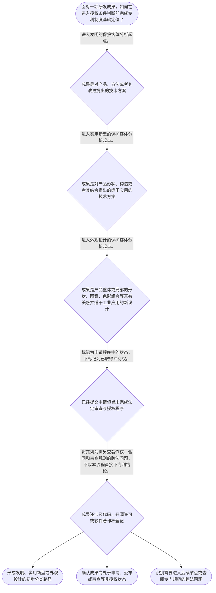

# 整合后的课程完整内容与习题

## 教学模块选择清单

- 当前教学节点：`patent-law-foundation`
- 板块预算：自适应 6/6，总计 9/9

| # | 模块 (block_type) | 类型 | 触发原因 (trigger) | 对应正文段 | 归属 |
|---:|---|:--:|---|---|:--:|
| 1 | `anchor_scenario` | 自适应 | perception=sensing(0.84) / cold_start | 从一台智能设备看专利制度入口｜某研发团队完成一台工业巡检设备：工程师改进了内部传感器与支架的连接构造，软件人员调整了设备的… | [A] |
| 2 | `legal_anchor` | 必选 | mandatory | 法条锚定：客体定义与程序环节｜《中华人民共和国专利法》第二条 | [A] |
| 3 | `worked_example` | 自适应 | cold_start(low_confidence) | 演示：同一产品中的不同成果如何分类｜乙团队研发一台实验室自动取样设备：改进点一是针头固定座与导向臂的连接构造；改进点二是设备外壳… | [A] |
| 4 | `decision_flow` | 自适应 | input=visual(0.79) | 专利制度基础判断流程｜面对一项研发成果，如何在进入授权条件判断前完成专利制度基础定位？ | [A] |
| 5 | `mnemonic` | 自适应 | understanding=sequential(0.76) | 分类与程序速记表｜“发—实—外；申—初—公—实—授”对照表：前半句先分保护客体，后半句再看程序位置。 | [A] |
| 6 | `predict_activate` | 自适应 | processing=active(0.64) | 先预测：提交申请后处于什么状态｜研发团队刚向国务院专利行政部门递交申请文件，但尚未收到授权公告。你预测：此时能否直接把自己称… | [A] |
| 7 | `assessment` | 必选 | mandatory | 本节测评｜复习专利法规定的发明创造类型。 | [A] |
| 8 | `knowledge_synthesis` | 必选 | mandatory | 专利法律制度基础框架｜制度属性：专利权应理解为依法授予的制度性权利，基础特征包括独占性、时间性和地域性；具体期限与… | [A] |
| 9 | `summary_card` | 自适应 | len(knowledge_sub_nodes)=3>=3 | 专利制度基础速查卡｜专利制度基础的判断顺序是：先分法定客体，再辨程序状态，跨法问题另查专门依据。 | [A] |

## 教学正文

## I — 法律问题

一项研发成果进入专利制度时，首先不是直接判断“技术是否先进”，而是依次厘清三个基础问题：它是否属于法定专利保护客体；专利权具有何种制度属性；以及申请、审查、公开和授权由何种规范及程序框架支撑。

对于你关心的算法、开源协议与软件著作权边界，本节仅建立判断入口：先区分成果的保护客体和制度功能。算法能否作为专利方案、开源协议会否影响申请或实施、软件著作权与专利如何并行保护，均需要进入后续“专利法律体系”和“专利授权实质条件”等节点，并结合未在本节检索材料中提供的审查指南、著作权法及具体协议文本判断；不能仅凭“代码已开源”或“已登记软著”得出专利结论。

## R — 适用规则

### 1. 专利保护客体：先辨认法定类型

《专利法》第二条规定，本法所称发明创造包括发明、实用新型和外观设计；其中，发明是对产品、方法或者其改进提出的新的技术方案，实用新型是对产品的形状、构造或者其结合提出的适于实用的新的技术方案，外观设计则是对产品整体或局部的形状、图案或其结合，以及色彩与形状、图案结合所作出的、富有美感并适于工业应用的新设计。〔RAG: 中华人民共和国专利法.txt — 第二条关于发明、实用新型和外观设计的定义〕

因此，基础分类应当按“方案所解决的对象与表达内容”进行：产品或方法的技术方案，进入发明的分析起点；产品形状、构造或其结合的技术方案，进入实用新型的分析起点；产品视觉外观的新设计，进入外观设计的分析起点。此处是分类入口，不等于已经取得授权；发明和实用新型还须满足法定授权条件。〔RAG: 中华人民共和国专利法.txt — 第二条定义；第二十二条规定发明和实用新型应具备新颖性、创造性和实用性〕

### 2. 制度属性：权利不是对技术的一般占有

专利制度的基础特征可概括为独占性、时间性与地域性：独占性是依法授予的专利权具有排他实施的法律效果；时间性是该权利并非永久存续；地域性是其效力以被授予并受该法域保护为边界。这是制度性框架，不应误读为研发者对所有相近技术、所有国家或无限期间当然享有控制力。关于不同类型专利的具体期限、跨境效力和权利内容，本次检索上下文未提供直接条文依据，本节不作展开。

### 3. 规范与程序：实体法、实施规则和审查实践共同运作

学习专利制度时，应区分规范层次：专利法提供基本权利、保护客体和授权条件；实施细则细化申请与审查程序；专利审查指南用于具体审查判断的操作化。关于审查程序，检索材料显示，国务院专利行政部门对申请初步审查后，除予以驳回外，应当将申请公布；同时，发明专利申请人在提出实质审查请求时以及收到进入实质审查阶段通知书后一定期限内，可以主动修改申请。〔RAG: 中华人民共和国专利法实施细则.txt — 第五十三条“初步审查后…将申请予以公布”；第五十七条“提出实质审查请求时…可以主动提出修改”〕

据此可作程序上的基础区分：初步审查、申请公布和实质审查是不同环节，不能把“已经公开”直接等同于“已经授权”，也不能把“提交申请”直接等同于“已经取得专利权”。中国制度发展历程及“早期公开、延迟审查”的完整历史沿革，检索上下文未提供直接材料；本节仅以现有条文确认上述程序环节的并存。

### 4. 制度功能：以公开换取依法授予的专利权

专利制度以法定程序受理、审查并依法授予专利权。国务院专利行政部门统一受理和审查专利申请，依法授予专利权。〔RAG: 中华人民共和国专利法.txt — 第三条“统一受理和审查专利申请，依法授予专利权”〕

从制度设计理解，其功能在于将技术方案纳入公开、审查和权利配置的秩序，进而服务发明创造激励、技术公开、技术应用及经济发展。后一功能性概括对应本节点学习目标；本次检索材料未提供该政策目标的直接条文表述，故不将其表述为具体法条的原文结论。

## A — 规则适用

可按下列线性步骤处理一项研发成果：

1. **先定对象**：识别成果是产品或方法的技术方案、产品的形状构造方案，还是产品的视觉外观设计；分别对应发明、实用新型或外观设计的法定定义。
2. **再定制度位置**：确认专利申请是请求国家依程序审查、依法授予权利，不是研发完成即自动产生的全面权利。
3. **再定程序状态**：区分提交、初步审查、公布、实质审查与授权；某一环节已经发生，不能替代其他环节。
4. **最后处理跨法问题**：如成果同时含代码、技术方案和开源条件，应分别识别著作权、专利及合同许可可能调整的对象与行为，再查阅相应规范。仅有软件著作权登记或仅使用开源代码，均不能在本节点内直接推出专利可授予性或侵权结论。

以一项智能设备研发为例：如果团队改进的是设备内部传感器的连接构造，首先应从实用新型的“产品形状、构造或者其结合”的定义出发；如果改进的是控制设备运行的方法性技术方案，则应从发明的“产品、方法或者其改进”的技术方案出发；如果改进仅集中于设备外壳的视觉造型，则应从外观设计的定义出发。分类完成后，仍须进入相应申请与审查程序；不能因产品中含有软件而跳过保护客体和程序判断。

## C — 结论

本节点的稳定结论是：专利制度先解决“法定保护什么”和“权利如何依法产生”，再处理具体技术是否满足授权条件。专利法第二条所列的发明、实用新型和外观设计，是保护客体分类的法定起点；初步审查、公布与实质审查属于应当区分的程序环节。算法专利性、开源协议影响及软著—专利边界，应在后续相应节点以具体技术事实和具体法律依据继续判断。

> 常见误区 / 易混淆点
>
> 1. 将“研发完成”或“申请已提交”误认为“已经获得专利权”。申请、公布、审查与授权是不同法律状态。
> 2. 将“发明、实用新型、外观设计”理解为按技术价值高低排序。三者首先是法定保护客体的分类，判断重点不同。
> 3. 将含有软件的产品当然归入某一专利类型，或以软件著作权登记替代专利审查。两类制度的对象、取得方式和判断规则并不相同；本节没有检索到可直接裁断软件与开源问题的专门依据。
>
> 本节设有测评，请到【习题】区作答。

### 从一台智能设备看专利制度入口（anchor_scenario）

> 某研发团队完成一台工业巡检设备：工程师改进了内部传感器与支架的连接构造，软件人员调整了设备的控制逻辑，设计师又重画了外壳的曲面与图案。团队计划提交专利申请，同时也准备把部分代码按开源协议发布，并已办理软件著作权登记。

负责人问：这些成果是否都能用同一种专利保护？提交申请是否意味着已经获得专利？代码开源和软件著作权登记会不会自动决定专利结果？在回答前，必须先看见“保护客体分类”“程序状态”和“跨法问题需分别判断”这三个冲突点。

**锚定**：该情境锚定专利保护客体的三分法、申请审查程序的阶段性，以及专利与软件、开源问题不能混同的基础边界。

**先想一想**：面对同一设备中的连接构造、控制逻辑和外壳设计，你会先按什么标准把它们分开？

### 法条锚定：客体定义与程序环节（legal_anchor）

- **《中华人民共和国专利法》第二条**：专利法将发明创造限定为发明、实用新型和外观设计，并以技术方案、产品构造和产品外观作为分类重心。
- **《中华人民共和国专利法实施细则》第五十三条**：发明或者实用新型申请经初步审查后，除被驳回外，应当被公布；公布不是授权。
- **《中华人民共和国专利法实施细则》第五十六条、第五十七条**：发明专利存在实质审查请求及进入实质审查阶段后的程序安排，申请人可在法定阶段主动修改。

**为何重要**：本节点先以第二条确定“专利法保护什么”，再以实施细则理解“申请为何不等于授权”。这是后续讨论授权条件和跨法边界的前提。

### 演示：同一产品中的不同成果如何分类（worked_example）

**案情/例题**：乙团队研发一台实验室自动取样设备：改进点一是针头固定座与导向臂的连接构造；改进点二是设备外壳的局部曲面和图案。团队尚未取得任何专利权。应如何先作专利制度基础分类，并如何理解当前程序状态？
**适用规则**：《中华人民共和国专利法》第二条；《中华人民共和国专利法实施细则》第五十三条、第五十七条。
**分步推演**：
1. 先将连接构造与外壳视觉设计分开，不因它们属于同一设备就强行归入同一保护客体。 → *分类对象是具体创新内容，而不是产品名称。*
2. 连接构造属于产品形状、构造或者其结合的技术方案时，可从实用新型的法定定义分析。 → *连接构造对应实用新型的分析入口。*
3. 外壳局部曲面和图案属于产品外观的新设计时，可从外观设计的法定定义分析。 → *视觉外观对应外观设计的分析入口。*
4. 即使已经提交申请，也仍须区分初步审查、公布、实质审查和最终授权；现有事实并未显示已获授权。 → *申请行为不等于专利权已经产生。*
**结论**：该设备的连接构造与外壳视觉设计应分别从实用新型和外观设计的定义起点分析；是否最终授权仍取决于后续法定程序和相应条件，不能因已研发或已申请而当然取得专利权。
**本题要点**：先拆分具体创新内容，再匹配法定客体，最后单独核对程序状态。

### 专利制度基础判断流程（decision_flow）

**决策问题**：面对一项研发成果，如何在进入授权条件判断前完成专利制度基础定位？



### 分类与程序速记表（mnemonic）

**记忆锚**：“发—实—外；申—初—公—实—授”对照表：前半句先分保护客体，后半句再看程序位置。
**映射**：
- 发
- 实
- 外
- 申—初—公—实—授
**何时用**：看到研发成果、专利申请状态或“是否已经有专利”的表述时，先按该表完成客体和程序的两次定位。

### 先预测：提交申请后处于什么状态（predict_activate）

**预测/激活**：研发团队刚向国务院专利行政部门递交申请文件，但尚未收到授权公告。你预测：此时能否直接把自己称为“已取得专利权”？

**激活旧知**：激活“权利须经依法受理、审查和授予”以及“程序环节必须区分”的既有框架。

**揭晓方向**：不要只看是否递交文件；依次辨认初步审查、公布、实质审查和授权是否已经发生。

### 专利法律制度基础框架（knowledge_synthesis）

**知识框架**：
- 制度属性：专利权应理解为依法授予的制度性权利，基础特征包括独占性、时间性和地域性；具体期限与地域规则需另查直接依据。
- 规范体系：专利法确立基本制度，实施细则细化程序，审查指南承担审查操作化功能。
- 保护客体：发明、实用新型、外观设计是《专利法》第二条规定的三类发明创造，分类依据是具体成果的内容。
- 制度功能：专利制度通过申请、审查和权利配置，服务技术公开、技术应用及创新激励的制度目标。
- 程序特点：初步审查、申请公布和实质审查是不同环节；应区分申请状态与授权状态。
**概念关系**：先按《专利法》第二条辨认成果类型，再进入各类型的申请、审查和授权程序。；程序状态判断先于“是否已经取得专利权”的结论。；专利基础分类是处理软件、开源和著作权跨法问题的入口，而不是对这些问题的最终答案。
**必记**：专利保护客体的法定起点是发明、实用新型和外观设计，不能按产品名称或技术价值直接分类。；提交申请、申请公布、实质审查和授权不是同一法律状态。；算法、开源协议和软件著作权问题不能只用本节点的客体分类直接裁断，必须补充专门法律依据与具体事实。

### 专利制度基础速查卡（summary_card）

**要点卡**：
- **三类保护客体**：《专利法》第二条的入口是发明、实用新型和外观设计。
- **发明**：对产品、方法或者其改进提出的新的技术方案。
- **实用新型**：对产品形状、构造或者其结合提出的适于实用的新的技术方案。
- **外观设计**：对产品整体或局部视觉外观作出的、富有美感并适于工业应用的新设计。
- **程序状态**：申请、初步审查、公布、实质审查和授权必须区分，申请不等于授权。
- **跨法边界**：软件著作权、开源协议与算法问题须按各自专门规则和事实继续判断。
**必背**：发明创造包括发明、实用新型和外观设计。；先定保护客体，再定程序状态，最后才进入具体授权与跨法问题。；申请公布不等于授权；提交申请不等于已取得专利权。
**一句话总结**：专利制度基础的判断顺序是：先分法定客体，再辨程序状态，跨法问题另查专门依据。

### 本节测评（assessment）

**三类覆盖**：backward_review、forward_probe、weakness_probe
**题目**：
- q1：复习专利法规定的发明创造类型。
- q2：探测下一节点对核心规范体系的识别。
- q3：综合区分同一产品中的实用新型与外观设计客体。


## 结构化数据

## expert

```json
"expert_a"
```

## style

```json
"conservative"
```

## knowledge_points

```json
[
  {
    "node_id": "patent-law-foundation",
    "kc_name": "专利制度的基本概念与特征：独占性、时间性、地域性"
  },
  {
    "node_id": "patent-law-foundation",
    "kc_name": "中国专利制度体系：专利法、专利法实施细则、专利审查指南"
  },
  {
    "node_id": "patent-law-foundation",
    "kc_name": "专利保护的三种客体：发明、实用新型、外观设计"
  },
  {
    "node_id": "patent-law-foundation",
    "kc_name": "专利制度的作用：激励创造、技术公开、技术应用与经济发展"
  },
  {
    "node_id": "patent-law-foundation",
    "kc_name": "中国专利制度的程序特点：初步审查、申请公布与实质审查环节"
  }
]
```

## legal_basis

```json
[
  {
    "article": "《中华人民共和国专利法》第二条",
    "source": "中华人民共和国专利法.txt：第二条"
  },
  {
    "article": "《中华人民共和国专利法实施细则》第五十三条",
    "source": "中华人民共和国专利法实施细则.txt：第五十三条"
  },
  {
    "article": "《中华人民共和国专利法实施细则》第五十六条、第五十七条",
    "source": "中华人民共和国专利法实施细则.txt：第五十六条、第五十七条"
  }
]
```

## risks

```json
[
  {
    "risk": "将专利申请、申请公布、实质审查和授权混为同一法律状态，可能导致对研发公开与权利状态的错误判断。",
    "related_node_id": "patent-law-foundation"
  },
  {
    "risk": "仅凭“含有算法、代码、开源组件或软件著作权登记”直接断言可申请或不可申请专利，缺少本节范围外的专门依据。",
    "related_node_id": "patent-law-foundation"
  },
  {
    "risk": "把发明、实用新型、外观设计当作技术优劣等级，而未按法定保护对象分类。",
    "related_node_id": "patent-law-foundation"
  }
]
```

## draft_stage

```json
"debate"
```

## irac

```json
{
  "issue": "研发成果进入专利制度时，如何识别法定保护客体、专利制度基础属性及其程序位置，并避免将算法、开源或软件著作权问题与本节点的基础分类混同。",
  "rule": "《专利法》第二条将发明创造界定为发明、实用新型和外观设计，并分别规定其定义；《专利法实施细则》第五十三条、第五十六条和第五十七条显示初步审查、申请公布、实质审查及修改等程序环节应予区分。",
  "application": "对具体成果先按产品或方法技术方案、产品形状构造方案、产品视觉外观设计作分类，再识别其处于提交、初步审查、公布、实质审查或授权的哪一程序状态。涉及代码、算法、开源许可或软著时，应另查专门规范和协议，不能以本节点基础规则直接替代判断。",
  "conclusion": "专利法律制度基础的核心是法定客体分类与依法申请、审查、授予的制度框架；算法专利性、开源协议和软件著作权与专利的边界应在后续节点基于更具体依据处理。"
}
```

## interactive_questions

```json
[
  {
    "qid": "q1",
    "category": "remember",
    "difficulty": "L1",
    "source_tag": "backward_review",
    "kc_node_id": "patent-law-foundation",
    "question": "依据《专利法》第二条，下列哪一项属于专利法所称的发明创造类型？",
    "answer": "B",
    "options": [
      "A. 商标",
      "B. 实用新型",
      "C. 商业秘密",
      "D. 软件著作权"
    ]
  },
  {
    "qid": "q2",
    "category": "understand",
    "difficulty": "L1",
    "source_tag": "forward_probe",
    "kc_node_id": "patent-law-framework",
    "question": "下列哪一组最符合中国专利制度的核心规范体系表述？",
    "answer": "A",
    "options": [
      "A. 专利法、专利法实施细则、专利审查指南",
      "B. 民法典、公司法、证券法",
      "C. 著作权法、商标法、广告法",
      "D. 刑法、刑事诉讼法、行政诉讼法"
    ]
  },
  {
    "qid": "q3",
    "category": "analyze",
    "difficulty": "L3",
    "source_tag": "weakness_probe",
    "kc_node_id": "patent-law-foundation",
    "question": "甲公司开发一款工业设备：其核心改进是设备内部两个部件的连接构造；同时为设备设计了更具视觉美感的外壳。仅依据《专利法》第二条的保护客体定义，下列判断最准确的是？",
    "answer": "C",
    "options": [
      "A. 因设备含有两个改进点，只能整体作为发明处理",
      "B. 内部连接构造和外壳视觉设计都只能作为外观设计处理",
      "C. 内部连接构造可从实用新型定义分析，外壳视觉设计可从外观设计定义分析",
      "D. 只要产品能够销售，两个改进当然均已取得专利权"
    ]
  }
]
```

## knowledge_synthesis

```json
{
  "node": "patent-law-foundation",
  "coverage": [
    {
      "node_id": "patent-law-foundation"
    },
    {
      "node_id": "patent-law-foundation"
    },
    {
      "node_id": "patent-law-foundation"
    },
    {
      "node_id": "patent-law-foundation"
    },
    {
      "node_id": "patent-law-foundation"
    }
  ],
  "confusable_pairs": [
    {
      "pair": "专利申请与专利授权：前者是程序启动或进行状态，后者是经法定程序依法授予权利的状态。"
    },
    {
      "pair": "发明与实用新型：前者覆盖产品、方法及其改进的技术方案，后者聚焦产品形状、构造或者其结合的适于实用技术方案。"
    },
    {
      "pair": "外观设计与实用新型：前者重在产品视觉外观的新设计，后者重在产品形状、构造的技术方案。"
    },
    {
      "pair": "专利基础分类与软件、开源、软著结论：前者只是进入分析的起点，后者需要专门规范和具体事实。"
    }
  ]
}
```
