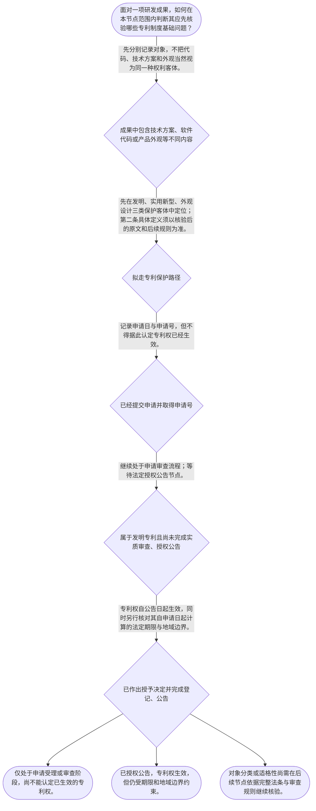

# 整合后的课程完整内容与习题

## 教学模块选择清单

- 当前教学节点：`patent-law-foundation`
- 板块预算：自适应 6/6，总计 9/9

| # | 模块 (block_type) | 类型 | 触发原因 (trigger) | 对应正文段 | 归属 |
|---:|---|:--:|---|---|:--:|
| 1 | `anchor_scenario` | 自适应 | perception=sensing(0.84) / cold_start | 从研发成果清单看专利制度入口｜某智能硬件团队完成了一套设备控制方案：工程师编写了控制代码，设备采用了新的结构部件，产品外壳… | [A] |
| 2 | `legal_anchor` | 必选 | mandatory | 制度目的、程序分流与期限的法条锚点｜《中华人民共和国专利法》第一条 | [A] |
| 3 | `worked_example` | 自适应 | cold_start(low_confidence) | 申请号不等于专利权：程序时间轴演示｜乙公司于某日向国务院专利行政部门提交发明专利申请文件，后收到申请号通知。项目负责人据此拟向竞… | [A] |
| 4 | `decision_flow` | 自适应 | input=visual(0.79) | 研发成果进入专利制度的基础判断流程｜面对一项研发成果，如何在本节点范围内判断其应先核验哪些专利制度基础问题？ | [A] |
| 5 | `mnemonic` | 自适应 | understanding=sequential(0.76) | 专利基础四格核对表｜四格核对表：客—制—程—界。先看保护客体，再看制度规范，再看程序状态，最后看权利边界。 | [A] |
| 6 | `predict_activate` | 自适应 | processing=active(0.64) | 先预测：申请号代表什么｜研发团队收到专利申请号通知后，准备对外宣称“已拥有专利权”。请先预测：这份通知最可能证明的是… | [A] |
| 7 | `assessment` | 必选 | mandatory | 基础框架、体系探测与程序辨析测评｜复习专利权生效节点与期限起算点的区分。 | [A] |
| 8 | `knowledge_synthesis` | 必选 | mandatory | 专利法律制度基础的结构图｜权利特征：专利权在制度上具有独占性、时间性、地域性；期限与地域边界共同限制权利的效力范围。 | [A] |
| 9 | `summary_card` | 自适应 | len(knowledge_sub_nodes)=3>=3 | 专利制度基础速查卡｜用“客—制—程—界”四格表，把研发成果放回专利制度的正确位置。 | [A] |

## 教学正文

## I — 法律问题

本节只建立“专利法律制度基础”的判断坐标：一项技术成果进入中国专利制度时，应先识别其是否属于专利制度所列的保护客体，再区分专利权的独占性、时间性和地域性，并理解申请、审查、授权公告之间的程序位置。算法能否取得专利、开源协议是否影响专利、以及软件著作权与专利如何边界划分，均须以后续“专利法律体系”“授权实质条件”等节点的具体规则作判断；本节不对这些后续争点作实体结论。

## R — 适用规则

1. **制度目的。**专利法的立法目的包括保护专利权人合法权益、鼓励发明创造、推动发明创造的应用、提高创新能力，并促进科学技术进步和经济社会发展。〔RAG: 中华人民共和国专利法.txt — 第一条“保护专利权人的合法权益，鼓励发明创造，推动发明创造的应用”〕因此，专利制度并非仅是“登记一个技术名称”，而是以公开技术信息与依法取得、行使权利相配合的制度安排。

2. **保护客体的入口。**当前知识点将《专利法》第二条标注为三种专利保护客体的依据，即发明、实用新型、外观设计。本轮检索未提供第二条原文，故本节仅确认这三类客体的分类位置，不补充其法定定义或将算法直接归入任何一类。对算法相关方案，不能只因“写成代码”或“使用算法”就得出可专利或不可专利的结论，须留待后续依据完整条文和审查规则判断。

3. **权利的三项基础特征。**
   - 独占性：专利权是依法取得的排他性权利；是否构成排他范围及其例外，需以具体权利内容和法律规定判断。
   - 时间性：权利并非永久存在。发明专利权期限为二十年，实用新型专利权期限为十年，外观设计专利权期限为十五年，均自申请日起计算。〔RAG: 中华人民共和国专利法.txt — 第四十二条“均自申请日起计算”〕
   - 地域性：中国专利制度中的授权、登记和行政程序在中国法秩序内运行；不能把在一国取得的权利当然等同于在其他国家或地区取得同一权利。本结论是地域性特征的制度性理解，具体跨境权利仍须依有关法域规则核验。

4. **规范层级与程序角色。**本节点以专利法为基本法律依据；实施细则进一步规定申请文件、申请日和受理等程序事项。例如，发明或实用新型申请通常须提交请求书、说明书和权利要求书，外观设计申请须提交请求书、图片或照片及简要说明；行政部门收到符合要求的文件后明确申请日并给予申请号。〔RAG: 中华人民共和国专利法实施细则.txt — 第四十三条“明确申请日、给予申请号”〕专利审查指南在该体系中用于具体审查操作，但其具体内容属于下一节点的学习范围。

5. **审查与生效的基本分流。**发明专利申请在实质审查后未发现驳回理由的，作出授予决定、登记和公告；发明专利权自公告日起生效。〔RAG: 中华人民共和国专利法.txt — 第三十九条“经实质审查没有发现驳回理由的……自公告之日起生效”〕实用新型和外观设计申请经初步审查未发现驳回理由的，作出授予决定、登记和公告，权利同样自公告日起生效。〔RAG: 中华人民共和国专利法.txt — 第四十条“经初步审查没有发现驳回理由的”〕这说明“申请日”“授权决定”“公告生效”是不同的法律时间点，不可混同。

6. **发展特点的制度呈现。**从现行程序结构可以看到，发明专利采取公开后进入实质审查的路径，而实用新型、外观设计以初步审查后授权为基本路径；这体现了初步审查与实质审查并存的制度特点。有关早期公开与延迟审查的精确程序规则，本轮检索上下文未提供直接条文，不在本节扩展具体期限或法律效果。

## A — 规则适用

以研发团队拟保护一项“智能设备控制方案”为例，应按下列顺序处理：

- **第一步：分清技术成果与权利类型。**先记录成果包含的技术方案、软件代码、产品外观及公开状态。软件代码可能涉及著作权保护，技术方案是否可能进入专利制度则要另行审查；同一商业项目可能存在多种法律关系，但不能因存在软件著作权就推定已获得专利权。
- **第二步：确认专利制度入口。**在专利路径内，先定位发明、实用新型、外观设计三类客体；对于算法相关内容，必须等待后续节点对法定客体、排除事项和审查标准的完整判断，不能以项目名称替代法律分类。
- **第三步：放入程序时间轴。**提交符合形式要求的文件后，行政部门明确申请日并给予申请号；该事实不等于专利权已经生效。〔RAG: 中华人民共和国专利法实施细则.txt — 第四十三条“明确申请日、给予申请号”〕发明与实用新型、外观设计的审查路径不同，但均以授权后的登记、公告为权利生效节点。〔RAG: 中华人民共和国专利法.txt — 第三十九条、第四十条“自公告之日起生效”〕
- **第四步：管理权利边界。**即使取得专利权，也应同时记住期限从申请日起计算，且权利具有地域边界。将代码开源、签署开源协议或登记软件著作权，分别可能涉及合同、著作权和专利风险；其对专利申请、专利实施或许可的具体影响，必须在后续节点结合协议文本、公开时间和具体权利状态处理。

## C — 结论

专利制度基础的核心不是直接回答“某算法一定能否申请专利”，而是建立四个先后顺序：先分辨保护客体，再识别制度目的与规范层级，再区分申请、审查、公告生效，最后把权利放回独占性、时间性、地域性的边界内。算法、开源协议与软件著作权问题应在此框架上继续核验，不能以“有代码”“已开源”或“已登记软著”单一事实替代专利法判断。

> 常见误区 / 易混淆点
>
> 1. 将“获得申请号”误认为“已经有专利权”。申请日由受理程序确定，专利权依法自授权公告日起生效。〔RAG: 中华人民共和国专利法实施细则.txt — 第四十三条；中华人民共和国专利法.txt — 第三十九条、第四十条〕
> 2. 将专利权期限起算点与权利生效日混同。期限依法自申请日起算，权利生效则以公告为节点。〔RAG: 中华人民共和国专利法.txt — 第四十二条；第三十九条、第四十条〕
> 3. 将软件著作权、开源许可和专利权当作同一种权利。它们可能围绕同一项目并存，但调整对象、取得方式和法律效果需要分别核验。
>
> 本节设有测评，请到【习题】区作答。

### 从研发成果清单看专利制度入口（anchor_scenario）

> 某智能硬件团队完成了一套设备控制方案：工程师编写了控制代码，设备采用了新的结构部件，产品外壳也做了独特视觉设计。团队计划将部分代码放到开源平台，同时考虑办理软件著作权登记和申请专利。负责人看到“申请号已生成”后，认为公司已经拥有可以排除竞争者使用的专利权。

团队面临的冲突并不只是“要不要申请”：代码、技术方案和外观可能对应不同保护路径；申请号、申请日和专利权生效也不是同一件事。必须先用专利制度基础框架为这些事实定位，才可能继续分析算法、开源与软件著作权的边界。

**锚定**：该情境锚定保护客体分类、专利权三项特征以及申请至公告生效的程序时间轴。

**先想一想**：面对同一研发项目中的代码、技术方案和产品外观，应先按什么标准把它们放入不同法律保护路径？

### 制度目的、程序分流与期限的法条锚点（legal_anchor）

- **《中华人民共和国专利法》第一条**：专利制度服务于保护合法权益、鼓励创造、推动应用和促进科技进步、经济社会发展。
- **《中华人民共和国专利法》第三十九条、第四十条**：发明经实质审查、实用新型和外观设计经初步审查后，在符合条件并授权公告时，专利权才生效。
- **《中华人民共和国专利法》第四十二条**：三类专利权都有法定期限，且期限从申请日起计算：发明二十年，实用新型十年，外观设计十五年。

**为何重要**：本节点要先分清制度目的、程序状态和权利期限，才能避免把申请受理或软件著作权误当成已经取得且永久有效的专利权。当前知识点所列《专利法》第二条原文未在本轮检索中提供，三类保护客体的具体定义应待原文核验后深化。

### 申请号不等于专利权：程序时间轴演示（worked_example）

**案情/例题**：乙公司于某日向国务院专利行政部门提交发明专利申请文件，后收到申请号通知。项目负责人据此拟向竞争对手发函，主张公司已经取得发明专利权。现需仅依据本节规则判断：申请号通知、审查通过、授权公告和权利生效之间应如何区分。
**适用规则**：《专利法实施细则》第四十三条；《专利法》第三十九条、第四十二条。
**分步推演**：
1. 先识别申请号通知的法律位置：行政部门收到符合要求的发明申请文件后，明确申请日、给予申请号并通知申请人。 → *取得申请号说明申请程序已有受理与编号节点。*
2. 再识别发明专利的授权条件所在程序：发明申请经实质审查没有发现驳回理由，行政部门才作出授予专利权的决定，并登记和公告。 → *发明专利不能跳过实质审查而仅凭申请号取得专利权。*
3. 最后区分生效点与期限起算点：发明专利权自公告之日起生效，但其法定期限自申请日起计算。 → *权利生效日和期限起算日可能不同，必须分别记录。*
**结论**：乙公司仅收到申请号通知时，不能据此认定已取得发明专利权；应待实质审查、授予决定、登记和公告后，专利权才自公告日起生效。
**本题要点**：处理专利状态时，按“申请受理—审查—授权公告—权利生效”逐节点核对，不能用一个时间点替代全部法律效果。

### 研发成果进入专利制度的基础判断流程（decision_flow）

**决策问题**：面对一项研发成果，如何在本节点范围内判断其应先核验哪些专利制度基础问题？



### 专利基础四格核对表（mnemonic）

**记忆锚**：四格核对表：客—制—程—界。先看保护客体，再看制度规范，再看程序状态，最后看权利边界。
**映射**：
- 客
- 制
- 程
- 界
**何时用**：遇到“软件代码、开源、专利申请号或授权状态”混在同一项目中的事实时，先按四格逐项拆分，再进入后续实体规则。

### 先预测：申请号代表什么（predict_activate）

**预测/激活**：研发团队收到专利申请号通知后，准备对外宣称“已拥有专利权”。请先预测：这份通知最可能证明的是申请程序中的哪一类事实。

**激活旧知**：激活对申请、审查、授权公告和权利生效四个程序节点不可混同的既有理解。

**揭晓方向**：先寻找实施细则中“明确申请日、给予申请号”的规定，再对照专利法中“自公告之日起生效”的规定。

### 专利法律制度基础的结构图（knowledge_synthesis）

**知识框架**：
- 权利特征：专利权在制度上具有独占性、时间性、地域性；期限与地域边界共同限制权利的效力范围。
- 保护客体：当前节点以《专利法》第二条标注发明、实用新型、外观设计三类客体；本轮未取得条文原文，暂不细化法定定义。
- 规范体系：专利法提供基本法律规则，实施细则承接申请受理等程序事项，专利审查指南的具体审查规则属于后续专利法律体系学习。
- 制度功能：立法目的在于保护合法权益、鼓励发明创造、推动应用，并促进科技进步和经济社会发展。
- 程序结构：发明专利经实质审查，实用新型和外观设计经初步审查；符合条件并授权公告后，专利权自公告日起生效。
- 制度发展特点：现行结构呈现初步审查与实质审查并存；早期公开与延迟审查的细节待后续依据直接条文学习。
**概念关系**：先按保护客体分类，再识别所适用的规范体系，随后沿申请—审查—授权公告的程序链确认权利状态。；权利生效看公告节点，权利期限看申请日；二者共同构成时间性边界。；算法、开源协议和软件著作权的具体问题，须先完成本节点的对象与程序定位，才能进入后续实体规则判断。
**必记**：申请日、申请号、授予决定和公告生效是不同程序节点；不得仅凭申请号认定已有专利权。；发明、实用新型、外观设计的权利期限分别为二十年、十年、十五年，均自申请日起计算。；软件著作权、开源协议与专利制度可能在同一项目中并存，但不能互相当然替代。

### 专利制度基础速查卡（summary_card）

**要点卡**：
- **制度目的**：保护合法权益、鼓励创造、推动应用并促进科技进步和经济社会发展。
- **三类保护客体**：当前节点定位为发明、实用新型、外观设计；具体定义应核验《专利法》第二条原文。
- **权利三特征**：独占性、时间性、地域性共同限定专利权的制度边界。
- **程序分流**：发明走实质审查；实用新型和外观设计以初步审查为基本路径。
- **生效与期限**：权利自授权公告日起生效，法定期限均自申请日起计算。
**必背**：申请号不等于专利权；专利权依法自授权公告日起生效。；发明二十年、实用新型十年、外观设计十五年，均自申请日起计算。；同一研发项目中的软件代码、技术方案、外观和开源安排必须分对象、分权利、分程序处理。
**一句话总结**：用“客—制—程—界”四格表，把研发成果放回专利制度的正确位置。

### 基础框架、体系探测与程序辨析测评（assessment）

**三类覆盖**：backward_review、forward_probe、weakness_probe
**题目**：
- q_foundation_review_01：复习专利权生效节点与期限起算点的区分。
- q_framework_probe_01：仅探测下一节点的核心规范体系识别。
- q_foundation_weakness_01：辨析申请号、实质审查、授权公告与权利生效的程序关系。


## 结构化数据

## expert

```json
"expert_a"
```

## style

```json
"conservative"
```

## knowledge_points

```json
[
  {
    "node_id": "patent-law-foundation",
    "kc_name": "专利制度的基本概念与特征：独占性、时间性、地域性"
  },
  {
    "node_id": "patent-law-foundation",
    "kc_name": "中国专利制度体系：专利法、专利法实施细则、专利审查指南"
  },
  {
    "node_id": "patent-law-foundation",
    "kc_name": "专利保护的三种客体：发明、实用新型、外观设计"
  },
  {
    "node_id": "patent-law-foundation",
    "kc_name": "专利制度的作用：激励发明创造、促进技术公开、推动技术应用和经济发展"
  },
  {
    "node_id": "patent-law-foundation",
    "kc_name": "中国专利制度的发展特点：早期公开延迟审查、初步审查与实质审查并存"
  }
]
```

## legal_basis

```json
[
  {
    "article": "《中华人民共和国专利法》第一条",
    "source": "中华人民共和国专利法.txt：第一条"
  },
  {
    "article": "《中华人民共和国专利法》第三十八条至第四十条",
    "source": "中华人民共和国专利法.txt：第三十八条至第四十条"
  },
  {
    "article": "《中华人民共和国专利法》第四十二条",
    "source": "中华人民共和国专利法.txt：第四十二条"
  },
  {
    "article": "《中华人民共和国专利法》第二条",
    "source": "本轮检索上下文未提供第二条原文；当前节点知识点清单标注其为三种保护客体的依据，具体法条定义应在后续核验原文后适用。"
  }
]
```

## risks

```json
[
  {
    "risk": "本轮检索上下文未提供《专利法》第二条原文，不能据此细化发明、实用新型、外观设计的法定定义或直接判断算法方案的专利性。",
    "related_node_id": "patent-law-foundation"
  },
  {
    "risk": "开源协议与软件著作权、专利权的具体边界涉及后续专利法律体系及具体协议、公开行为和权利状态，不应以本节基础框架替代个案法律意见。",
    "related_node_id": "patent-law-foundation"
  },
  {
    "risk": "将申请受理、申请日、授权决定与公告生效混同，可能导致对权利状态和期限的错误判断。",
    "related_node_id": "patent-law-foundation"
  }
]
```

## draft_stage

```json
"debate"
```

## irac

```json
{
  "issue": "如何在专利法律制度基础层面识别保护客体、权利特征、规范体系和审查生效节点，并为算法、开源协议与软件著作权的后续边界判断建立前提？",
  "rule": "《专利法》第一条规定制度目的；当前节点知识点以《专利法》第二条标注发明、实用新型、外观设计三类客体，但本轮未检索到该条原文；实施细则第四十三条规定申请日和申请号；《专利法》第三十九条、第四十条规定授权公告与权利生效，第四十二条规定三类专利权期限。",
  "application": "对研发项目应先区分技术方案、软件代码和外观等不同对象，再将专利申请放入受理、审查、授权公告的程序时间轴；不得把申请号等同于专利权，也不得把软著登记或开源行为当然等同于专利权状态。算法及开源协议的实体影响需在后续规则下结合具体事实判断。",
  "conclusion": "本节能够确定专利制度的分类、程序和权利边界框架；不足以在缺少第二条原文、审查规则及具体协议事实时，对算法专利性或开源协议的具体专利后果作结论。"
}
```

## interactive_questions

```json
[
  {
    "qid": "q_foundation_review_01",
    "category": "understand",
    "difficulty": "L1",
    "source_tag": "backward_review",
    "kc_node_id": "patent-law-foundation",
    "question": "依照本节所引《专利法》，下列关于专利权期限与生效时间的表述，哪一项正确？",
    "answer": "B",
    "options": [
      "A. 三类专利权均自提交申请文件之日起生效",
      "B. 三类专利权均自授权后的公告之日起生效；期限分别依法自申请日起计算",
      "C. 发明专利自初步审查通过之日起生效，其他两类自实质审查通过之日起生效",
      "D. 专利权期限均自公告之日起计算"
    ]
  },
  {
    "qid": "q_framework_probe_01",
    "category": "remember",
    "difficulty": "L1",
    "source_tag": "forward_probe",
    "kc_node_id": "patent-law-framework",
    "question": "下列哪一组最符合本节所述中国专利制度的核心规范体系？",
    "answer": "A",
    "options": [
      "A. 专利法、专利法实施细则、专利审查指南",
      "B. 著作权法、商标法、反不正当竞争法",
      "C. 民法典、刑法、行政处罚法",
      "D. 公司法、证券法、反垄断法"
    ]
  },
  {
    "qid": "q_foundation_weakness_01",
    "category": "analyze",
    "difficulty": "L3",
    "source_tag": "weakness_probe",
    "kc_node_id": "patent-law-foundation",
    "question": "甲公司已提交发明专利申请并取得申请号，尚未完成实质审查和授权公告。关于该项目当前状态，哪一项判断最严谨？",
    "answer": "C",
    "options": [
      "A. 已取得发明专利权，可立即按专利权主张排他权",
      "B. 因取得申请号，二十年保护期限尚未开始计算",
      "C. 已进入申请程序，但不能仅因取得申请号认定专利权已生效；发明专利须经实质审查未发现驳回理由并授权公告后生效",
      "D. 发明专利与实用新型、外观设计均只进行初步审查即可授权"
    ]
  }
]
```

## knowledge_synthesis

```json
{
  "node": "patent-law-foundation",
  "coverage": [
    {
      "node_id": "patent-law-foundation"
    },
    {
      "node_id": "patent-law-foundation"
    },
    {
      "node_id": "patent-law-foundation"
    },
    {
      "node_id": "patent-law-foundation"
    },
    {
      "node_id": "patent-law-foundation"
    }
  ],
  "confusable_pairs": [
    {
      "pair": "申请号与专利权生效：前者是申请程序节点，后者以授权公告为生效节点。"
    },
    {
      "pair": "权利生效日与期限起算日：生效看公告，期限依法自申请日起算。"
    },
    {
      "pair": "软件著作权、开源协议与专利权：可能围绕同一项目并存，但法律对象、取得方式和效果不能当然互换。"
    }
  ]
}
```
