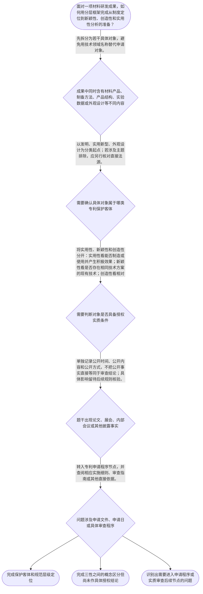

# 整合后的课程完整内容与习题

## 教学模块选择清单

- 当前教学节点：`patent-law-foundation`
- 板块预算：自适应 4/6，总计 8/9

| # | 模块 (block_type) | 类型 | 触发原因 (trigger) | 对应正文段 | 归属 |
|---:|---|:--:|---|---|:--:|
| 1 | `anchor_scenario` | 自适应 | perception=sensing(0.81) / P(L)=0.15<0.3 / cold_start | 耐高温复合材料的专利起点｜某材料研发团队制得一种耐高温复合材料：他们既设计了材料的层状结构，也形成了一套烧结制备工艺，… | [A+B融合] |
| 2 | `legal_anchor` | 必选 | mandatory | 保护客体与三性框架的法条锚点｜《中华人民共和国专利法》第二条 | [A+B融合] |
| 3 | `worked_example` | 自适应 | cold_start(low_confidence) | 将材料研发成果拆分为制度问题｜某团队形成三项成果：一种耐高温复合材料产品、一套制造该材料的烧结工艺，以及应用于成品表面的新… | [A+B融合] |
| 4 | `decision_flow` | 自适应 | input=visual(0.78) | 材料成果进入专利制度的判断流程｜面对一项材料研发成果，如何用分层框架完成从制度定位到新颖性、创造性和实用性分析的准备？ | [A+B融合] |
| 5 | `reflect_prompt` | 自适应 | processing=reflective(0.62) | 从研发记录回看制度位置｜回顾你熟悉的一项材料研发项目：其中哪些内容是产品，哪些是制备方法，哪些是结构或外观，哪些只是… | [A+B融合] |
| 6 | `assessment` | 必选 | mandatory | 基础制度定位测评｜识别专利制度的独占性、时间性和地域性。 | [A+B融合] |
| 7 | `knowledge_synthesis` | 必选 | mandatory | 专利法律制度基础框架｜制度特征：专利权具有独占性、时间性和地域性，三者共同界定权利的基本边界。 | [A+B融合] |
| 8 | `summary_card` | 自适应 | len(knowledge_sub_nodes)=3>=3 | 专利制度基础速查卡｜材料成果进入专利制度，先画制度地图、定位保护客体，再分别分析新颖性、创造性和实用性。 | [A+B融合] |

## 教学正文

## 一、先建立材料专利的制度地图

材料领域的专利分析，不能从“性能是否优异”直接跳到“能否授权”。一个材料研发项目可能同时包含材料产品、制备方法、产品结构、实验数据和外观设计，这些内容在法律分析中的位置并不相同。本节的任务是先建立专利法律制度基础，之后再进入新颖性、创造性和实用性的细化判断。

专利权的三个基本特征是独占性、时间性和地域性。独占性说明专利权具有排他保护效果；时间性说明保护不是永久存在；地域性说明权利效力原则上受特定法域限制。三者共同回答“专利权是什么性质的权利、保护边界在哪里”，但不直接回答某一项材料技术是否具备新颖性或创造性。

## 二、中国专利制度的规范体系

学习中国专利审查规则时，可以把规范体系理解为三个层次：专利法提供基本制度和主要法律规则；专利法实施细则对制度实施中的程序和操作作补充；专利审查指南为审查实践中的具体判断提供更细的适用口径。三者不是功能完全相同的文件，也不能用审查指南替代专利法的基本规定。

遇到材料专利问题时，先判断问题属于哪一层：如果是专利保护客体或基本授权条件，应先定位专利法；如果是申请手续、文件或程序细节，应进一步查实施细则；如果是新颖性、创造性等具体审查口径，应结合专利审查指南和相应法条核验。〔RAG：检索上下文（空）— 未提供可直接核验的法条、实施细则或审查指南原文；以上层次关系依据本轮教学上下文与专家草稿作教学框架整理〕

## 三、三类专利保护客体

本轮教学上下文明确列示，《中华人民共和国专利法》第二条涉及发明、实用新型和外观设计三类保护客体。〔RAG：检索上下文（空）— 未提供条文原文；本轮教学上下文列示《专利法》第二条及三类保护客体〕

在材料领域，不能因为项目名称是“材料技术”就直接决定专利类型。需要回到具体内容：材料本身或其制备方法，通常应从发明客体方向分析；如果申请内容集中于产品的形状、构造或其结合，应进一步考虑实用新型的客体边界；如果主张的是产品整体或局部的形状、图案、色彩等视觉设计，则应从外观设计方向识别。这里的“通常”只是学习上的起点，最终仍要以具体申请文件和法定条件为准。

还要区分“保护客体”和“专利授权条件”。某项内容属于可以进入专利分析的客体，只说明分析可以继续，并不自动说明它具备新颖性、创造性或实用性。相反，科学发现、抽象的智力活动规则等主题边界问题，也不能简单用“技术效果很好”来替代判断；具体排除范围应在后续节点依据直接法源核验。

## 四、专利制度的作用

专利制度通过法律保护与技术公开之间的安排，形成“激励发明创造—促进技术公开—推动技术应用和经济发展”的制度链条。申请人通过公开技术内容寻求法定保护，社会因此能够获得技术信息；审查制度则负责判断申请是否满足相应法律要求。

因此，研发事实、技术公开和法律授权是三个不同层次。实验数据可以说明性能，论文或展会可以构成信息披露事实，但二者都不能单独替代保护客体识别，也不能直接推出新颖性、创造性或授权结论。

## 五、中国专利制度的审查结构

中国专利制度具有早期公开、延迟审查，以及初步审查制与实质审查制并存等特点。这里要抓住两个区分：第一，公开是技术信息向社会呈现的制度或事实环节；第二，审查是依照法律规则对申请进行判断的活动。公开不等于授权，审查也不等于技术已经被社会公开。

后续学习新颖性和创造性时，可以先把它们放入“实质授权条件”这一大框架中理解：新颖性主要关注申请日前的现有技术中是否已经存在相同技术方案；创造性主要关注相对于现有技术是否属于本领域技术人员容易想到的方案。这里是学习上的概念区分，不把它表述为所有案件都必须遵循的唯一法定审查顺序。实用性则是另一项独立要求，不能因为方案具有新颖性或创造性，就当然推定其具备实用性。

## 六、材料成果的完整分析示范

某材料团队研发了一种耐高温复合材料，形成了材料产品、烧结制备工艺和成品表面纹样三项成果。团队认为实验性能优异，只要在论文或展会上公开，就能证明该技术“新”且可以获得专利。对此，应按以下链条分析：

第一步，拆分技术内容。材料产品、制备方法和产品外观不是同一个表达对象，不能仅用“复合材料项目”这一名称笼统处理。

第二步，定位保护客体。依据本轮教学上下文列示的《专利法》第二条，先从发明、实用新型、外观设计三类客体中分别寻找对应位置。此时只能确定分析入口，不能直接得出授权结论。

第三步，区分研发事实与法律判断。性能数据属于技术事实，论文或展会属于可能影响法律分析的公开事实；是否构成现有技术、是否存在法定例外以及如何评价，必须结合具体日期、公开内容和直接法源进一步核验。

第四步，进入三性框架。新颖性进行单独对比，重点看申请日前现有技术是否已经公开相同技术方案；创造性进一步判断相对于现有技术是否显而易见；实用性关注能否制造或者使用并产生积极效果。三者各自回答不同问题，不能相互替代。

结论是：该团队应先完成“拆分成果—定位客体—记录公开事实—分别核对三性”的基础整理。实验性能优异或已经公开，并不自动等于具备新颖性、创造性或已经获得专利权。

## 七、常见误区与记忆线索

误解一：“材料性能好，所以一定能申请并获得专利。”

正解推理：性能好只是技术事实；仍须先判断保护客体，再依具体规则核对实用性、新颖性和创造性。

区分判据：题干若只提供性能数据，不能直接推出授权结论；必须继续寻找客体、公开时间、现有技术和显而易见性等信息。

误解二：“只要是技术方案，就当然具备新颖性。”

正解推理：技术方案属性解决的是“是否进入专利性分析”的前置问题；新颖性还要进行申请日前现有技术的对比。

区分判据：看到“技术方案”先问对象是否适格；看到“新颖性”再问是否存在单独的相同现有技术。

误解三：“新颖性和创造性都是看技术先进不先进。”

正解推理：新颖性重在单独对比相同技术方案；创造性重在相对于现有技术是否显而易见。技术效果可以成为分析材料，但不能抹平两者的判断标准差异。

区分判据：题干出现“一份文献已经公开全部相同特征”，优先想到新颖性；题干出现“结合多份技术启示是否容易得到”，才进入创造性分析，但具体适用仍需依据后续节点规则。

记忆口诀是：“先看对象，再分环节；单独比新颖，进一步问创造；能做且有用，再看实用。”这只是帮助记忆的分析框架，不是替代法条的固定审查顺序。

本节设有测评，请到【习题】区作答。

### 耐高温复合材料的专利起点（anchor_scenario）

> 某材料研发团队制得一种耐高温复合材料：他们既设计了材料的层状结构，也形成了一套烧结制备工艺，并为终端部件设计了新的表面纹样。团队准备申报专利，却把“实验指标优异”“公开发表论文”“能否得到专利”当成同一个问题。专利工程师要求团队把材料产品、制备方法和产品外观分别列出，再区分哪些是研发事实、哪些是公开事实、哪些需要进入法律审查。

**锚定**：该情境锚定材料成果的客体分类、专利制度三性框架，以及研发事实、公开环节和法律审查结论之间的边界。

**先想一想**：面对同一项材料研发成果，为什么不能只凭“性能提升明显”就判断能够获得专利保护？你会先把成果拆成哪些内容？

### 保护客体与三性框架的法条锚点（legal_anchor）

- **《中华人民共和国专利法》第二条**：第二条是识别发明、实用新型和外观设计三类保护客体的基础入口。
- **《中华人民共和国专利法》第二十二条**：第二十二条在本节作为三性框架的定位依据：新颖性、创造性和实用性是需要分别分析的授权条件。
- **《中华人民共和国专利法》第二十五条**：第二十五条涉及部分不授予专利权主题的边界，不能把所有具有技术效果的内容都直接视为可授权对象。

**为何重要**：学习新颖性和创造性之前，必须先区分“保护什么对象”和“对象是否满足授权条件”。法条锚点能防止把技术价值、技术方案属性或公开事实直接替代法律判断。

### 将材料研发成果拆分为制度问题（worked_example）

**案情/例题**：某团队形成三项成果：一种耐高温复合材料产品、一套制造该材料的烧结工艺，以及应用于成品表面的新纹样。团队认为实验性能优异，因此三项成果都当然能够获得专利。问：在进入新颖性、创造性和实用性判断前，应如何完成基础梳理？
**适用规则**：《中华人民共和国专利法》第二条关于发明、实用新型、外观设计三类保护客体的框架；三性分别作为后续授权条件进行分析。检索上下文未提供相关条文全文，具体结论仍需结合后续权威法源核验。
**分步推演**：
1. 先按具体技术内容拆分，而不是按“耐高温复合材料项目”这一总名称处理：分别列出产品、制备方法和外观纹样。 → *第一步：拆分申请对象。*
2. 依据本轮教学上下文列示的《专利法》第二条，从发明、实用新型、外观设计三类客体中寻找对应的分析入口；产品或方法通常从发明方向观察，结构内容还要核对实用新型边界，视觉纹样则从外观设计方向观察。 → *第二步：定位保护客体。*
3. 把实验数据、内部展示、论文发表或展会展示分别作为技术事实或公开事实记录，不能因为存在性能数据就直接认定具备新颖性或创造性。 → *第三步：区分事实与法律结论。*
4. 对进入专利性分析的具体方案，后续分别判断实用性、新颖性和创造性：新颖性重点进行相同技术方案的单独对比，创造性重点判断相对于现有技术是否显而易见，实用性另行判断能否制造或者使用并产生积极效果。 → *第四步：分别核对三性。*
**结论**：该团队应先完成对象拆分和客体定位，再记录公开事实，最后分别进入三性分析。实验性能优异只能说明技术事实，不能单独推出新颖性、创造性或已经获得专利权。
**本题要点**：训练“拆分成果—定位客体—区分事实—分别核对三性”的完整判定链。

### 材料成果进入专利制度的判断流程（decision_flow）

**决策问题**：面对一项材料研发成果，如何用分层框架完成从制度定位到新颖性、创造性和实用性分析的准备？



### 从研发记录回看制度位置（reflect_prompt）

**反思问题**：回顾你熟悉的一项材料研发项目：其中哪些内容是产品，哪些是制备方法，哪些是结构或外观，哪些只是实验数据或公开记录？

**关注要点**：技术领域名称不等于法定专利保护客体。；实验效果、研发记录和公开事实应与客体分类、三性判断分开整理。；新颖性应与创造性区分：前者重在相同技术方案的单独对比，后者重在是否显而易见。；遇到具体法律结论时，应回到相应法条、实施细则或审查指南，而不是凭技术直觉判断。

**连接**：连接到已有材料研发经验，并为后续专利申请程序、现有技术、新颖性和创造性节点中的事实整理作准备。

### 专利法律制度基础框架（knowledge_synthesis）

**知识框架**：
- 制度特征：专利权具有独占性、时间性和地域性，三者共同界定权利的基本边界。
- 规范体系：专利法提供基本制度，专利法实施细则补充实施规则，专利审查指南服务于具体审查适用。
- 保护客体：以本轮教学上下文列示的《专利法》第二条为入口，识别发明、实用新型和外观设计三类客体。
- 制度作用：通过法律保护与技术公开的安排激励发明创造，并促进技术应用和经济发展。
- 审查结构：早期公开、延迟审查，以及初步审查制与实质审查制并存，是理解后续申请和审查规则的制度背景。
- 三性定位：新颖性、创造性和实用性是不同的分析问题；新颖性重在单独对比，创造性重在显而易见性，实用性关注可制造或可使用及积极效果。
**概念关系**：先认识专利权的制度边界，再定位规范层级和保护客体，最后进入公开、审查及三性分析。；保护客体识别是后续申请程序和实质授权条件学习的前提。；“对象是什么—适用哪类规范—处于哪个环节”是基础定位链；进入三性判断后，再区分“是否相同公开”和“是否显而易见”。
**必记**：专利制度的三个基本特征是独占性、时间性和地域性。；专利法、实施细则和审查指南具有不同的功能层次，不能互相替代。；材料技术领域不是法定客体分类；必须回到具体成果内容判断发明、实用新型或外观设计方向。；技术方案属性不等于当然具备新颖性；新颖性与创造性必须分别判断。；公开事实、技术性能和法律授权结论不能相互替代。

### 专利制度基础速查卡（summary_card）

**要点卡**：
- **权利特征**：专利权具有独占性、时间性和地域性，分别对应排他保护、期间限制和法域限制。
- **规范层级**：专利法定基本制度，实施细则补充实施规则，审查指南服务于具体审查适用。
- **保护客体**：专利保护客体包括发明、实用新型和外观设计；材料领域名称本身不能替代客体分类。
- **制度功能**：专利制度通过保护与公开的安排激励发明创造并促进技术应用和经济发展。
- **三性区分**：新颖性重在单独对比相同技术方案，创造性重在判断是否显而易见，实用性关注能否制造或使用并产生积极效果。
- **公开与审查**：公开是信息披露或制度环节，审查是依法作出的判断活动，两者不能混同。
**必背**：独占性、时间性、地域性是专利制度的三个基本特征。；发明、实用新型、外观设计是三类专利保护客体。；技术方案属性不等于当然具备新颖性或创造性。；新颖性看相同技术方案的单独对比，创造性看相对于现有技术是否显而易见。；分析材料专利时先拆分成果、定位客体，再分别核对具体法律条件。
**一句话总结**：材料成果进入专利制度，先画制度地图、定位保护客体，再分别分析新颖性、创造性和实用性。

### 基础制度定位测评（assessment）

**三类覆盖**：backward_review、forward_probe、weakness_probe
**题目**：
- q-foundation-review-01：识别专利制度的独占性、时间性和地域性。
- q-application-probe-01：仅探测下一节点中的专利申请文件识别。
- q-foundation-weakness-01：区分技术方案属性与新颖性、创造性结论。


## 结构化数据

## expert

```json
"A+B融合"
```

## style

```json
"fused"
```

## knowledge_points

```json
[
  {
    "node_id": "patent-law-foundation",
    "kc_name": "专利制度的基本概念与特征：独占性、时间性、地域性"
  },
  {
    "node_id": "patent-law-foundation",
    "kc_name": "中国专利制度体系：专利法、专利法实施细则、专利审查指南"
  },
  {
    "node_id": "patent-law-foundation",
    "kc_name": "专利保护的三种客体：发明、实用新型、外观设计"
  },
  {
    "node_id": "patent-law-foundation",
    "kc_name": "专利制度的作用：激励发明创造、促进技术公开、推动技术应用和经济发展"
  },
  {
    "node_id": "patent-law-foundation",
    "kc_name": "中国专利制度发展历程与特点：早期公开、延迟审查、初步审查制与实质审查制并存"
  }
]
```

## legal_basis

```json
[
  {
    "article": "《中华人民共和国专利法》第二条",
    "source": "本轮教学上下文明确列示该条涉及发明、实用新型、外观设计三类保护客体；检索上下文未提供条文原文。"
  },
  {
    "article": "《中华人民共和国专利法》第二十二条",
    "source": "专家 B 草稿列示该条涉及新颖性、创造性和实用性；检索上下文未提供条文原文，本节仅作三性框架定位，不展开未经核验的完整法条引文。"
  },
  {
    "article": "《中华人民共和国专利法》第二十五条",
    "source": "专家 B 草稿列示该条涉及不授予专利权的部分主题；检索上下文未提供条文原文，本节仅作后续边界辨析的学习提示。"
  }
]
```

## risks

```json
[
  {
    "risk": "检索上下文为空，除本轮教学上下文明确列示的《专利法》第二条及三类客体外，其他法条原文和审查指南未得到直接核验；涉及第二十二条、第二十四条、第二十五条的细化结论应在后续学习中补充权威依据。",
    "related_node_id": "patent-law-foundation"
  },
  {
    "risk": "把技术性能、商业价值或技术方案属性直接等同于新颖性、创造性或授权结论。",
    "related_node_id": "patent-law-foundation"
  },
  {
    "risk": "把新颖性与创造性混淆：前者强调单独对比相同技术方案，后者关注相对于现有技术是否显而易见。",
    "related_node_id": "patent-law-foundation"
  },
  {
    "risk": "把公开环节与审查环节混同，或把学习上的三性分析顺序误认为所有案件都适用的唯一法定顺序。",
    "related_node_id": "patent-law-foundation"
  }
]
```

## draft_stage

```json
"integration"
```

## irac

```json
{
  "issue": "材料领域研发成果进入专利制度时，如何先识别制度特征、规范层级和保护客体，并为后续新颖性、创造性与实用性判断建立正确入口？",
  "rule": "本轮教学上下文明确列示《中华人民共和国专利法》第二条涉及发明、实用新型和外观设计三类保护客体。专利制度还应从独占性、时间性、地域性、专利法与实施细则及审查指南的功能层次，以及公开与审查的环节区分来理解。新颖性、创造性和实用性属于需要分别判断的不同问题。",
  "application": "对于耐高温复合材料等研发成果，应先按产品、方法、结构和外观等具体内容拆分，再以三类法定客体定位分析入口；同时将实验性能、论文或展会公开等事实与法律审查结论分开记录。进入三性分析后，新颖性进行相同技术方案的单独对比，创造性判断相对于现有技术是否显而易见，实用性则另行核对能否制造或者使用并产生积极效果。",
  "conclusion": "本节的结论是先建立“制度边界—规范层级—客体分类—公开与审查环节—三性框架”的基础地图。技术价值、技术方案属性或公开事实均不能单独替代法定授权条件判断。"
}
```

## interactive_questions

```json
[
  {
    "qid": "q-foundation-review-01",
    "category": "understand",
    "difficulty": "L1",
    "source_tag": "backward_review",
    "kc_node_id": "patent-law-foundation",
    "question": "关于专利制度基本特征，下列哪一项属于专利权的基本制度特征？",
    "answer": "A",
    "options": [
      "A. 独占性、时间性、地域性",
      "B. 新颖性、创造性、实用性",
      "C. 公开性、商业性、永久性",
      "D. 先进性、盈利性、国际性"
    ]
  },
  {
    "qid": "q-application-probe-01",
    "category": "remember",
    "difficulty": "L1",
    "source_tag": "forward_probe",
    "kc_node_id": "patent-application-process",
    "question": "根据下一待学节点的提示，专利申请文件中被列示的一组材料是下列哪一项？",
    "answer": "B",
    "options": [
      "A. 判决书、营业执照、检索报告和销售合同",
      "B. 请求书、说明书及其摘要、权利要求书等",
      "C. 实验记录、市场预测、产品报价和会议纪要",
      "D. 审查意见通知书、无效决定和行政复议申请书"
    ]
  },
  {
    "qid": "q-foundation-weakness-01",
    "category": "apply",
    "difficulty": "L2",
    "source_tag": "weakness_probe",
    "kc_node_id": "patent-law-foundation",
    "question": "某团队称：“我们的新型材料性能很好，而且属于技术方案，所以当然具备新颖性和创造性。”下列判断最恰当的是哪一项？",
    "answer": "C",
    "options": [
      "A. 正确，技术性能优异就当然具备新颖性和创造性",
      "B. 正确，只要属于发明客体就无需再进行现有技术比较",
      "C. 不正确，技术方案属性只是分析入口，仍需分别判断新颖性和创造性",
      "D. 不正确，材料技术只能申请外观设计，不能申请发明专利"
    ]
  }
]
```

## knowledge_synthesis

```json
{
  "node": "patent-law-foundation",
  "coverage": [
    {
      "node_id": "patent-law-foundation"
    },
    {
      "node_id": "patent-law-foundation"
    },
    {
      "node_id": "patent-law-foundation"
    },
    {
      "node_id": "patent-law-foundation"
    },
    {
      "node_id": "patent-law-foundation"
    }
  ],
  "confusable_pairs": [
    {
      "pair": "专利制度特征与授权三性：独占性、时间性、地域性描述权利制度边界；新颖性、创造性、实用性属于授权条件，二者不能混同。"
    },
    {
      "pair": "材料技术领域与法定保护客体：材料是技术领域，发明、实用新型、外观设计是法律上的客体分类。"
    },
    {
      "pair": "技术方案属性与新颖性：属于技术方案只说明可以进入专利性分析，不等于申请日前不存在相同现有技术。"
    },
    {
      "pair": "新颖性与创造性：新颖性重点是单独对比相同技术方案，创造性重点是相对于现有技术是否显而易见。"
    },
    {
      "pair": "公开环节与审查环节：论文、展会或其他披露是公开事实，不能直接等同于授权、驳回或实质审查结论。"
    }
  ]
}
```
