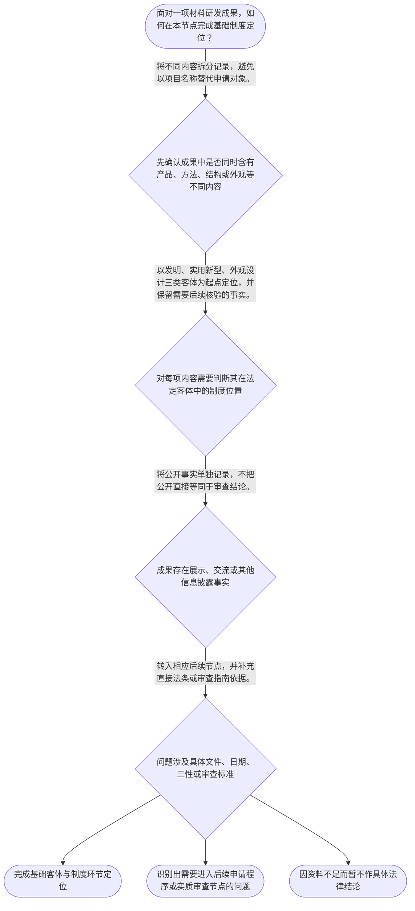

# 专家 A 教学草稿

> 专家：expert_a ｜ 风格：conservative

## 教学模块选择清单

- 当前教学节点：`patent-law-foundation`
- 板块预算：自适应 5/5，总计 8/8

| # | 模块 (block_type) | 类型 | 触发原因 (trigger) | 对应正文段 | 归属 |
|---:|---|:--:|---|---|:--:|
| 1 | `anchor_scenario` | 自适应 | perception=sensing(0.81) / P(L)=0.15<0.3 / cold_start | 耐高温复合材料的专利起点｜某材料研发团队制得一种耐高温复合材料：他们既设计了材料的层状结构，也形成了一套烧结制备工艺，… | [A] |
| 2 | `legal_anchor` | 必选 | mandatory | 保护客体的法条锚点｜《中华人民共和国专利法》第二条 | [A] |
| 3 | `worked_example` | 自适应 | cold_start(low_confidence) | 将材料研发成果拆分为制度问题｜某团队形成三项成果：一种复合材料产品、一套制造该材料的烧结工艺，以及应用于成品表面的新纹样。… | [A] |
| 4 | `decision_flow` | 自适应 | input=visual(0.78) | 材料成果进入专利制度的基础流程｜面对一项材料研发成果，如何在本节点完成基础制度定位？ | [A] |
| 5 | `reflect_prompt` | 自适应 | processing=reflective(0.62) | 从研发记录回看制度位置｜回顾你熟悉的一项材料研发项目：其中哪些内容是产品、哪些是制备方法、哪些可能只是外观或实验数据… | [A] |
| 6 | `assessment` | 必选 | mandatory | 基础制度定位测评｜复习专利法、实施细则与审查指南的功能层次。 | [A] |
| 7 | `knowledge_synthesis` | 必选 | mandatory | 专利法律制度基础框架｜制度特征：专利权具有独占性、时间性和地域性，三者共同界定权利的基本边界。 | [A] |
| 8 | `summary_card` | 自适应 | len(knowledge_sub_nodes)=3>=3 | 专利制度基础速查卡｜材料成果的专利分析先画制度地图，再进入具体授权条件。 | [A] |

## 教学正文

## I — 法律问题

在材料研发中，一个配方、制备方法、产品结构或外观，进入专利制度后首先要回答的不是“技术是否先进”，而是：它属于哪一种专利保护客体、适用哪一层规则，以及将来会进入何种审查路径。本节先建立专利法律制度的基础坐标；新颖性、创造性与实用性的具体判断留待后续节点展开。

## R — 适用规则

1. 专利制度具有独占性、时间性和地域性。独占性是指权利人依法取得的排他性权利；时间性是指保护并非永久；地域性是指权利效力受法域限制。本节只识别这三项制度特征，不处理具体保护期限与跨境程序。

2. 中国专利制度的规范体系可按功能理解为：专利法提供基本制度与主要规则，专利法实施细则补充程序和操作性规定，专利审查指南用于审查实践中的具体判断。三者不是并列替代关系，而是从基本规则到实施与审查适用的层次关系。

3. 《中华人民共和国专利法》第二条列示三类专利保护客体：发明、实用新型和外观设计。〔RAG: 检索上下文为空；本结论仅依据本轮教学上下文对《专利法》第二条及三类客体的明确列示〕材料领域中，技术方案可能表现为材料产品、制备方法、产品结构或产品外观；归类必须回到具体申请内容，不能仅因名称中含有“材料”而直接下结论。

4. 专利制度通过赋予符合条件的成果以法律保护，形成“激励发明创造—促进技术公开—推动技术应用和经济发展”的制度链条。申请人以公开技术内容为代价寻求法定保护，审查则承担筛选申请是否满足法定要求的功能。

5. 中国专利制度的审查结构包括早期公开、延迟审查，以及初步审查制与实质审查制并存等特点。这里的重点是区分：公开是信息向社会呈现的制度环节；审查是对申请是否符合法定要求的行政判断。两者不能混同。

## A — 规则适用

以研发团队完成一种耐高温复合材料为例。团队先不应直接问“性能提升是否足以授权”，而应按以下顺序整理：

第一，拆分申请对象。若主张的是材料本身、材料产品的结构，还是制备该材料的方法，可能对应不同的客体分析方向；若只是产品表面的视觉设计，则需要从外观设计方向观察。

第二，定位规范层级。判断三类客体这一基础分类时，先回到《专利法》第二条；遇到具体申请手续、审查要求或判断口径时，再分别寻找实施细则和审查指南的直接依据。检索上下文未提供这些规范的全文，因此本节不对其具体条款内容作超出已提供资料的断言。

第三，理解审查位置。公开、初步审查和实质审查属于制度流程中的不同环节。以后学习新颖性、创造性时，应把它们放在“申请的实质条件审查”这一位置理解，避免把材料研发中的实验成功、论文公开或市场价值直接等同于法律上的授权结论。

## C — 结论

材料技术进入专利制度，先建立五个基础判断：专利权有独占性、时间性和地域性；规则有法律、实施细则与审查指南的层次；法定客体包括发明、实用新型和外观设计；制度兼具激励、公开与应用功能；公开与审查是不同环节。掌握这张制度地图后，才能在后续节点准确处理新颖性、创造性等实质判断。

> 常见误区 / 易混淆点
>
> 1. 将“研发成果有技术价值”直接等同于“必然可获得专利权”。技术价值、客体归类和法定授权条件是不同问题。
> 2. 将公开与实质审查混为同一事项。公开是制度环节，实质审查是依法进行的判断活动。
> 3. 将三类专利客体视为可以仅按行业名称分类。材料、化工、机械等是技术领域；发明、实用新型、外观设计是法定保护客体分类。
>
> 本节设有测评，请到【习题】区作答。

### 耐高温复合材料的专利起点（anchor_scenario）

> 某材料研发团队制得一种耐高温复合材料：他们既设计了材料的层状结构，也形成了一套烧结制备工艺，并为终端部件设计了新的表面纹样。团队准备申报专利，却把“实验指标优异”“公开发表论文”“能否得到专利”当成同一个问题。

专利工程师先要求团队把材料产品、制备方法和产品外观分别列出，并标记哪些内容已经公开、哪些仍未公开。此时真正的冲突不是技术好不好，而是不同技术内容在专利制度中是否属于同一类对象、是否处于同一审查环节。

**锚定**：该情境锚定三类保护客体、规范层级以及公开与审查相区分的制度基础。

**先想一想**：面对同一项材料研发成果，为什么不能只凭“性能提升明显”就直接判断其能够获得专利保护？

### 保护客体的法条锚点（legal_anchor）

- **《中华人民共和国专利法》第二条**：先确认申请内容属于何种法定保护客体，再进入相应的申请和审查分析；材料领域名称本身不能替代客体分类。

**为何重要**：本节点的最低法条锚点是三类专利保护客体。后续讨论新颖性、创造性之前，必须先知道正在审查的申请对象及其制度位置。

### 将材料研发成果拆分为制度问题（worked_example）

**案情/例题**：某团队形成三项成果：一种复合材料产品、一套制造该材料的烧结工艺，以及应用于成品表面的新纹样。团队已在内部技术会议展示材料性能，但尚未判断不同成果在专利制度中的位置。应如何先作基础梳理？
**适用规则**：《中华人民共和国专利法》第二条是本轮教学上下文提供的三类保护客体依据；具体申请与审查规则需在后续节点补充直接法源。
**分步推演**：
1. 先按技术内容而非按“材料项目”这一总名称拆分：产品、方法和外观分别记录。 → *申请对象必须先拆分。*
2. 对拆分后的内容，以发明、实用新型、外观设计三类法定客体作为分类起点；不能仅因存在实验数据就跳过分类。 → *先定保护客体。*
3. 将内部展示与法定审查分开记录：展示属于事实事件，是否影响后续法律判断需要再依具体规则审查。 → *公开事实不等于授权结论。*
4. 将后续问题分别转入申请程序、实质条件和审查规则节点，避免在制度基础阶段作未获依据支持的具体结论。 → *按节点继续审查。*
**结论**：该团队应先完成对象拆分、客体定位和事实记录；仅据技术性能或内部展示，尚不能作出是否授权的结论。
**本题要点**：材料专利的起点是“拆分成果—定位客体—区分环节”，而不是直接评价技术先进性。

### 材料成果进入专利制度的基础流程（decision_flow）

**决策问题**：面对一项材料研发成果，如何在本节点完成基础制度定位？



### 从研发记录回看制度位置（reflect_prompt）

**反思问题**：回顾你熟悉的一项材料研发项目：其中哪些内容是产品、哪些是制备方法、哪些可能只是外观或实验数据？

**关注要点**：技术成果的不同表达不必然属于同一专利客体。；实验效果、研发记录和公开事实应与法律上的客体分类、程序环节分开整理。；需要具体法律结论时，应当回到相应法条或审查指南的直接依据。

**连接**：连接到已有的材料研发经验，并为后续“专利申请程序”节点中的申请文件整理作准备。

### 专利法律制度基础框架（knowledge_synthesis）

**知识框架**：
- 制度特征：专利权具有独占性、时间性和地域性，三者共同界定权利的基本边界。
- 规范体系：专利法、专利法实施细则和专利审查指南在基本制度、实施规则和审查适用上形成层次。
- 保护客体：依据本轮教学上下文列示的《专利法》第二条，专利保护客体包括发明、实用新型和外观设计。
- 制度功能：通过激励创造、技术公开与技术应用，连接研发活动和经济发展。
- 审查结构：公开与审查属于不同制度环节；早期公开、延迟审查、初步审查和实质审查共同构成理解后续规则的程序背景。
**概念关系**：先识别专利制度的权利边界，再识别法源层级和保护客体，最后把公开与审查放入不同环节理解。；保护客体定位是后续申请程序和实质授权条件学习的前提。
**必记**：材料技术领域不是法定专利客体分类；必须回到具体成果内容进行定位。；技术先进性、公开事实和是否授权不是同一问题，不能相互替代。；具体的新颖性、创造性和实用性结论必须在后续节点基于直接规范依据判断。

### 专利制度基础速查卡（summary_card）

**要点卡**：
- **权利特征**：独占性、时间性和地域性共同构成专利权的基本制度边界。
- **规范层级**：专利法定基本制度，实施细则补充实施规则，审查指南服务于具体审查适用。
- **保护客体**：本轮教学上下文列示《专利法》第二条的三类客体：发明、实用新型、外观设计。
- **制度功能**：专利制度以保护和公开的安排激励创造并促进技术应用。
- **公开与审查**：公开是制度环节，审查是依法作出的判断活动，两者不能混同。
**必背**：专利制度的三项基本特征：独占性、时间性、地域性。；三类专利保护客体：发明、实用新型、外观设计。；先定位客体和制度环节，再进入具体申请或实质条件判断。
**一句话总结**：材料成果的专利分析先画制度地图，再进入具体授权条件。

### 基础制度定位测评（assessment）

**三类覆盖**：backward_review、forward_probe、weakness_probe
**题目**：
- q-foundation-review-01：复习专利法、实施细则与审查指南的功能层次。
- q-application-probe-01：仅探测下一节点中申请文件的基础识别。
- q-foundation-weakness-01：辨析技术价值、公开环节与专利制度判断的边界。


## 结构化字段

## knowledge_points

```json
[
  {
    "node_id": "patent-law-foundation",
    "kc_name": "专利制度的基本概念与特征：独占性、时间性、地域性"
  },
  {
    "node_id": "patent-law-foundation",
    "kc_name": "中国专利制度体系：专利法、专利法实施细则、专利审查指南"
  },
  {
    "node_id": "patent-law-foundation",
    "kc_name": "专利保护的三种客体：发明、实用新型、外观设计"
  },
  {
    "node_id": "patent-law-foundation",
    "kc_name": "专利制度的作用：激励创造、技术公开、技术应用与经济发展"
  },
  {
    "node_id": "patent-law-foundation",
    "kc_name": "中国专利制度的审查结构：早期公开、延迟审查、初步审查与实质审查并存"
  }
]
```

## legal_basis

```json
[
  {
    "article": "《中华人民共和国专利法》第二条",
    "source": "本轮教学上下文明确列示“专利保护的三种客体：发明、实用新型、外观设计（专利法第2条）”；检索上下文未提供该条全文。"
  }
]
```

## risks

```json
[
  {
    "risk": "检索上下文为空，除教学上下文明确列示的《专利法》第二条及三类客体外，本稿不援引未提供全文的具体法条内容；后续涉及新颖性、创造性和实用性的结论应补充官方法条或审查指南原文。",
    "related_node_id": "patent-law-foundation"
  },
  {
    "risk": "将材料技术的实验效果、商业价值或研发难度直接替代专利客体分类和法定审查结论，可能导致判断顺序错误。",
    "related_node_id": "patent-law-foundation"
  }
]
```

## draft_stage

```json
"debate"
```

## irac

```json
{
  "issue": "材料领域研发成果拟申请专利时，如何先建立专利制度、法源层级、保护客体和审查结构的基础判断，而不把后续的新颖性、创造性判断提前混入？",
  "rule": "《中华人民共和国专利法》第二条在本轮教学上下文中被明确列为发明、实用新型和外观设计三类保护客体的依据。专利制度还应从独占性、时间性、地域性，以及专利法、实施细则、审查指南的规范层次和公开、审查的制度环节理解。",
  "application": "对于耐高温复合材料等研发成果，应先拆分其主张的是产品、方法、结构或外观，再以法定客体和规范层级定位问题；公开与审查分别识别，不以技术价值直接代替法律结论。",
  "conclusion": "本节应先完成专利制度基础地图和三类客体识别；新颖性、创造性及申请文件等具体规则须在后续节点基于相应直接依据继续审查。"
}
```

## interactive_questions

```json
[
  {
    "qid": "q-foundation-review-01",
    "category": "understand",
    "difficulty": "L1",
    "source_tag": "backward_review",
    "kc_node_id": "patent-law-foundation",
    "question": "关于中国专利制度中规范文件的功能层次，下列说法最符合本节框架的是哪一项？",
    "answer": "A",
    "options": [
      "A. 专利法提供基本制度，实施细则补充实施规则，审查指南服务于审查实践中的具体适用",
      "B. 专利法、实施细则和审查指南的法律效力与功能完全相同",
      "C. 审查指南可以替代专利法设定全部基本制度",
      "D. 只要阅读实施细则，就无须关注专利法和审查指南"
    ]
  },
  {
    "qid": "q-application-probe-01",
    "category": "remember",
    "difficulty": "L1",
    "source_tag": "forward_probe",
    "kc_node_id": "patent-application-process",
    "question": "根据教学上下文对下一节点的提示，专利申请文件中被列示的一组材料是下列哪一项？",
    "answer": "B",
    "options": [
      "A. 请求书、判决书、营业执照和检索报告",
      "B. 请求书、说明书及其摘要、权利要求书等",
      "C. 实验记录、市场预测、产品报价和销售合同",
      "D. 审查意见通知书、无效决定和行政复议申请书"
    ]
  },
  {
    "qid": "q-foundation-weakness-01",
    "category": "apply",
    "difficulty": "L2",
    "source_tag": "weakness_probe",
    "kc_node_id": "patent-law-foundation",
    "question": "某团队称其“新型材料的实验性能很好，因此只要公开后就必然取得专利权”。依本节基础框架，最恰当的判断是哪一项？",
    "answer": "C",
    "options": [
      "A. 正确，因为实验性能优异当然等于取得专利权",
      "B. 正确，因为公开和实质审查属于同一法律环节",
      "C. 不正确，仍应先识别保护客体和适用规则，并区分公开环节与法定审查判断",
      "D. 不正确，因为材料技术一律只能按外观设计申请"
    ]
  }
]
```

## knowledge_synthesis

```json
{
  "node": "patent-law-foundation",
  "coverage": [
    {
      "node_id": "patent-law-foundation"
    },
    {
      "node_id": "patent-law-foundation"
    },
    {
      "node_id": "patent-law-foundation"
    },
    {
      "node_id": "patent-law-foundation"
    },
    {
      "node_id": "patent-law-foundation"
    }
  ],
  "confusable_pairs": [
    {
      "pair": "材料技术领域与法定专利保护客体：前者说明技术所属领域，后者是发明、实用新型、外观设计的法律分类。"
    },
    {
      "pair": "公开环节与审查环节：公开不当然等同于授权、驳回或实质条件判断。"
    },
    {
      "pair": "技术性能优异与依法获得授权：前者是技术或事实评价，后者仍须经法定规则判断。"
    }
  ]
}
```
