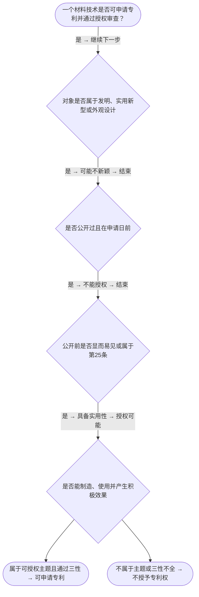

# 专家 B 教学草稿

> 专家：expert_b ｜ 风格：accessible

## 教学模块选择清单

- 当前教学节点：`patent-law-foundation`
- 板块预算：自适应 0/0，总计 8/8

| # | 模块 (block_type) | 类型 | 触发原因 (trigger) | 对应正文段 | 归属 |
|---:|---|:--:|---|---|:--:|
| 1 | `anchor_scenario` | 自适应 | perception=sensing(0.81) / P(L)=0.15<0.3 / cold_start | 场景导入｜某材料公司研发新型复合材料用于航空航天，内部会议展示后计划展出。担心展会公开是否破坏新颖性，… | [A] |
| 2 | `legal_anchor` | 必选 | mandatory | 法条锚定｜《专利法》第二条 | [A] |
| 3 | `worked_example` | 自适应 | cold_start(low_confidence) | 案例演示｜某公司2024年3月1日在国际会议展出新型复合材料，2024年9月1日提出专利申请。问：展出… | [A] |
| 4 | `decision_flow` | 自适应 | input=visual(0.78) | 三性审查决策流程｜一个材料技术是否可申请专利并通过授权审查？ | [A] |
| 5 | `reflect_prompt` | 自适应 | processing=reflective(0.62) | 反思与迁移｜如果客户同时做了展会展示和论文发表，你会怎么排时间表？ | [A] |
| 6 | `assessment` | 必选 | mandatory | 测评｜下列哪项正确描述三性？ | [A] |
| 7 | `knowledge_synthesis` | 必选 | mandatory | 知识综合｜保护客体：发明、实用新型、外观设计 | [A] |
| 8 | `summary_card` | 自适应 | len(knowledge_sub_nodes)=3>=3 | 速查卡｜先过保护客体之门，再过三性安检。 | [A] |

## 教学正文

## 1. 场景导入

假设你在材料公司担任研发工程师，最近团队开发了一种新型复合材料，专门用于航空航天结构部件。你在公司内部会议上展示了该材料的性能数据，并计划在下个月的国际材料展会上进行现场演示。但你担心如果在展会前申请专利，展会展示会不会被视为‘公开’，导致新颖性被破坏？同时你也知道专利授权不是只要‘新’就行，还需要‘创造’和‘实用’。这个情境把材料技术的具体研发流程、公开行为的风险和三性审查的抽象规则一次性串联起来，帮助你立刻看到专利法在实际申请中的应用场景。

## 2. 人话解释

专利授权的核心门槛就是三性审查：新颖性要求发明或实用新型在申请日之前没有被公开过（包括国内国外的任何公开）；创造性要求对本领域普通技术人员来说不是显而易见的；实用性要求能够制造、使用并能产生积极效果。简单说，新颖性像‘时间第一’检查（谁先谁后）；创造性像‘思维创新’检查（是不是人人都能想到）；实用性像‘落地验证’检查（能不能做成有用的事）。你先要判断这个材料是不是属于‘技术方案’，再看有没有公开，最后看是不是容易想到。

## 3. 法条回扣

《专利法》第二条规定，专利权是指对发明、实用新型和外观设计的合法权益。

《专利法》第二十二条规定，授予专利权应当具备新颖性、创造性和实用性。

《专利法》第二十五条规定，科学发现、智力活动、疾病的诊断和治疗方法等不授予专利权。

《专利审查指南》明确，发明专利的实质审查顺序是：先审查是否属于可授权主题，再审查三性。

## 4. 类比 / 口诀

用‘三步法’记忆：第一步问‘这是不是技术方案？’（像看能不能做成东西）；第二步问‘这是不是现有技术？’（像看有没有别人用过）；第三步问‘是不是显而易见？’（像看是不是人人都能想到）。类比边界：新颖性看单独事实，创造性允许组合看整体；实用性要看实际效果不能只看理论。口诀：‘新、创、实’三关卡，先过保护客体门，再过三性安检，错一步就不过。

## 5. 应试提示

题干关键词：申请日、公开日、现有技术、显而易见、技术方案。判断步骤：1. 看对象是否属于发明/实用新型；2. 看是否有公开行为；3. 看是否显而易见或属于第25条排除；常见陷阱是把科学发现或智力活动当成技术方案，或忽略宽限期。

## 6. 互动提问

你觉得下面哪个例子属于可授权主题？为什么？（材料技术研发场景）

### 场景导入（anchor_scenario）

> 某材料公司研发新型复合材料用于航空航天，内部会议展示后计划展出。担心展会公开是否破坏新颖性，同时需判断是否属于技术方案并通过三性审查。既有研发场景又有公开风险，帮你先看到问题。

**锚定**：用材料技术具体研发与公开行为，锚定保护客体与授权三性两个核心抽象知识点。

**先想一想**：如果你是专利代理人，看到‘展会展示’这个动作，第一反应是风险还是安全？为什么？

### 法条锚定（legal_anchor）

- **《专利法》第二条**：专利权针对发明、实用新型、外观设计。
- **《专利法》第二十二条**：授权需具备新颖性、创造性和实用性。
- **《专利法》第二十五条**：科学发现、智力活动等不授予专利权。

**为何重要**：三性是授权实质条件，必须先立住法条，才能在材料研发场景中判断是否可申请。

### 案例演示（worked_example）

**案情/例题**：某公司2024年3月1日在国际会议展出新型复合材料，2024年9月1日提出专利申请。问：展出是否破坏新颖性？同时判断是否属于可授权主题。
**适用规则**：《专利法》第二十二条、第二十四条
**分步推演**：
1. 展出日在申请日前，且属国际会议法定公开情形 → *落入公开行为范围*
2. 申请日距展出日约6个月，在宽限期内 → *不丧失新颖性*
3. 材料属于技术方案，具备新颖性 → *可继续审查创造性和实用性*
**结论**：展出不破坏新颖性，但仍需判断是否显而易见和实用。
**本题要点**：先判公开范围，再算日期和效果，宽限期仅豁免特定公开。

### 三性审查决策流程（decision_flow）

**决策问题**：一个材料技术是否可申请专利并通过授权审查？



### 反思与迁移（reflect_prompt）

**反思问题**：如果客户同时做了展会展示和论文发表，你会怎么排时间表？

**关注要点**：两个公开行为的日期各自如何算宽限期；论文发表是否也享宽限期；如何区分新颖性与创造性混淆

**连接**：连接到现有技术与公开行为类型

### 知识综合（knowledge_synthesis）

**知识框架**：
- 保护客体：发明、实用新型、外观设计
- 新颖性：申请日前无公开
- 创造性：对本领域普通技术人员非显而易见
- 实用性：能制造、使用并产生积极效果
**概念关系**：三性依次审查：先新颖性，再创造性，最后实用性；第25条排除主题先于三性判断
**必记**：三性缺一不可，任一不具备即不授权；新颖性看公开，创造性看显而易见

### 速查卡（summary_card）

**要点卡**：
- **保护客体**：能申请专利的‘东西’范围
- **三性**：新颖性/创造性/实用性三关
- **宽限期**：特定公开给 6 个月缓冲
**必背**：三性缺一不可；宽限期仅豁免特定公开且限 6 个月
**一句话总结**：先过保护客体之门，再过三性安检。

### 测评（assessment）

**三类覆盖**：backward_review、forward_probe、weakness_probe
**题目**：
- q1：下列哪项正确描述三性？
- q2：给出技术方案判断是否具备实用性
- q3：新颖性宽限期计算


## 结构化字段

## knowledge_points

```json
[
  {
    "node_id": "patent-law-foundation",
    "kc_name": "专利制度的基本概念与特征：独占性、时间性、地域性"
  },
  {
    "node_id": "patent-law-foundation",
    "kc_name": "中国专利制度体系：专利法、专利法实施细则、专利审查指南"
  },
  {
    "node_id": "patent-law-foundation",
    "kc_name": "专利保护的三种客体：发明、实用新型、外观设计（专利法第2条）"
  },
  {
    "node_id": "patent-law-foundation",
    "kc_name": "专利制度的作用：激励发明创造、促进技术公开、推动技术应用和经济发展"
  },
  {
    "node_id": "patent-law-foundation",
    "kc_name": "中国专利制度发展历程与特点：早期公开延迟审查、初步审查制与实质审查制并存"
  }
]
```

## legal_basis

```json
[
  {
    "article": "《专利法》第二条",
    "source": "《专利法》第二条"
  },
  {
    "article": "《专利法》第二十二条",
    "source": "《专利法》第二十二条"
  },
  {
    "article": "《专利法》第二十五条",
    "source": "《专利法》第二十五条"
  },
  {
    "article": "《专利审查指南》",
    "source": "《专利审查指南》"
  }
]
```

## risks

```json
[
  {
    "risk": "新颖性与创造性容易混淆，把第25条排除主题误判为技术方案",
    "related_node_id": "patent-law-foundation"
  },
  {
    "risk": "实用性与三性审查顺序容易错位",
    "related_node_id": "patent-law-foundation"
  }
]
```

## draft_stage

```json
"debate"
```

## interactive_questions

```json
[
  {
    "qid": "q1",
    "category": "remember",
    "difficulty": "L1",
    "source_tag": "backward_review",
    "kc_node_id": "patent-law-foundation",
    "question": "专利授权的三性包括什么？",
    "answer": "A",
    "options": [
      "A. 新颖性、创造性、实用性",
      "B. 独占性、时间性、地域性",
      "C. 保护客体、现有技术、显而易见",
      "D. 科学发现、智力活动、疾病诊断"
    ]
  },
  {
    "qid": "q2",
    "category": "understand",
    "difficulty": "L1",
    "source_tag": "backward_review",
    "kc_node_id": "patent-law-foundation",
    "question": "下列哪项属于《专利法》第二十五条排除的主题？",
    "answer": "B",
    "options": [
      "A. 一种新型复合材料的制造方法",
      "B. 疾病的诊断和治疗方法",
      "C. 一种新型材料的用途描述",
      "D. 一种材料的结构特征"
    ]
  },
  {
    "qid": "q3",
    "category": "apply",
    "difficulty": "L2",
    "source_tag": "weakness_probe",
    "kc_node_id": "patent-law-foundation",
    "question": "某公司2024年3月1日在国际会议上展示新型材料，2024年9月1日提出专利申请，展出是否破坏新颖性？",
    "answer": "C",
    "options": [
      "A. 一定破坏，因为是国际会议",
      "B. 不破坏，因为属于科学发现",
      "C. 不破坏，因为在6个月宽限期内",
      "D. 破坏，因为不是技术方案"
    ]
  }
]
```

## knowledge_synthesis

```json
{
  "node": "patent-law-foundation",
  "coverage": [
    {
      "node_id": "patent-law-foundation"
    }
  ],
  "confusable_pairs": [
    {
      "pair": "新颖性与创造性"
    },
    {
      "pair": "实用性与三性审查顺序"
    }
  ]
}
```
