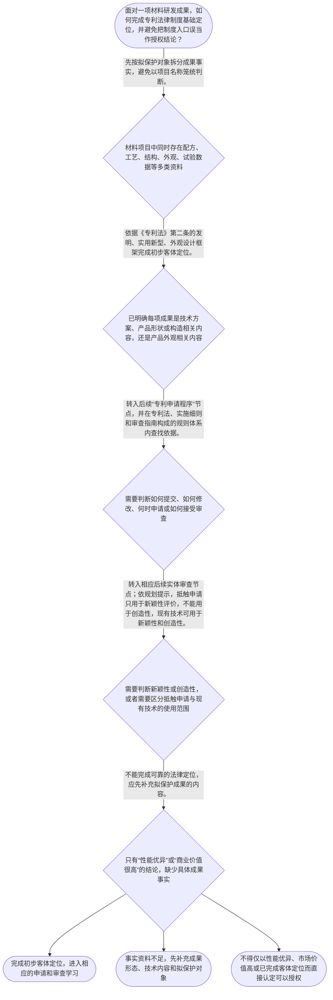

# 整合后的课程完整内容与习题

## 教学模块选择清单

- 当前教学节点：`patent-law-foundation`
- 板块预算：自适应 4/6，总计 8/9

| # | 模块 (block_type) | 类型 | 触发原因 (trigger) | 对应正文段 | 归属 |
|---:|---|:--:|---|---|:--:|
| 1 | `anchor_scenario` | 自适应 | perception=sensing(0.82) / cold_start | 从材料项目看专利制度的入口｜一家新材料企业研发出用于电池壳体的复合材料。项目资料中既有材料组成和制备工艺，也有壳体的结构… | [A+B融合] |
| 2 | `legal_anchor` | 必选 | mandatory | 法定保护客体：三种分类｜《专利法》第二条 | [A] |
| 3 | `worked_example` | 自适应 | cold_start(low_confidence) | 示例：把材料成果拆开再定位｜某团队开发了一种复合材料，形成四类资料：材料组成参数、制备该材料的方法、电池壳体的散热结构草… | [A+B融合] |
| 4 | `decision_flow` | 自适应 | input=visual(0.79) | 材料成果的制度定位流程｜面对一项材料研发成果，如何完成专利法律制度基础定位，并避免把制度入口误当作授权结论？ | [A+B融合] |
| 5 | `reflect_prompt` | 自适应 | processing=reflective(0.64) | 把制度分类接回研发资料｜回看一个真实或假设的材料项目：其中哪些资料是在说明技术方案，哪些资料是在说明结构或外观，哪些… | [B] |
| 6 | `assessment` | 必选 | mandatory | 本节三类测评｜复习《专利法》第二条所列三种专利保护客体。 | [A+B融合] |
| 7 | `knowledge_synthesis` | 必选 | mandatory | 专利法律制度基础框架｜专利权基本特征：独占性、时间性、地域性共同描述专利保护的基本边界；本节只建立概念框架，不延伸… | [A+B融合] |
| 8 | `summary_card` | 自适应 | len(knowledge_sub_nodes)=3>=3 | 制度基础速查卡｜材料专利学习的正确起点，是先把具体研发成果放入法定客体与规则体系，再进入程序和实体审查。 | [A+B融合] |

## 教学正文

# 材料领域专利申请：先建立制度地图

材料研发成果进入专利制度时，第一步不是判断“性能是不是足够好”，而是识别“要保护的究竟是什么”。一项材料项目可能同时出现材料组成、制备方法、产品结构、外观效果图和测试数据；这些内容不能因属于同一项目而自动成为同一个法律对象。[A+B融合]

以电池壳体复合材料项目为例：材料组成和制备方法、壳体的散热结构、壳体表面的装饰外观，以及证明性能的实验数据，承担的作用并不相同。正确的学习路径是：先拆分研发事实，再完成法定客体定位，随后确认应查找的规则来源，最后才进入申请程序和新颖性、创造性等实体审查。[A+B融合]

## 一、专利制度保护的法定客体

本节可直接核验的法条依据是《专利法》第二条。教学上下文明确列明，专利保护的三种客体为**发明、实用新型、外观设计**。[A]

这三种客体是专利制度的分类入口。面对材料项目时，应当先问：拟保护的是技术方案、产品的形状或构造，还是产品外观相关的设计内容？这一层只是在完成制度定位，不能用“性能优异”“销售前景好”或者“已经定位为某种客体”替代后续授权条件的判断。[A+B融合]

一个便于理解的类比是：专利制度像一张“有边界的入场券”。先确认成果能从哪一道法定入口进入，再谈后面的审查关卡。类比的边界在于：入场券并不保证一定通过全部审查，也不以产品是否畅销作为唯一标准。[B]

## 二、专利权的基本边界与规则体系

教学上下文将专利权的基本特征概括为**独占性、时间性、地域性**。这三个特征共同提醒我们：专利保护具有排他性，但不是无限期、无地域限制的权利。[A]

对材料企业而言，这意味着不能把在一个法域获得的保护简单理解为自动覆盖所有地区；也不能把专利理解为永久控制技术的工具。具体权利范围、期限计算和跨境保护安排，需要在有直接法律依据的后续学习中进一步确认，本节不扩展检索上下文未提供的条文细节。[A]

中国专利制度的规则体系，按教学上下文包括专利法、专利法实施细则和专利审查指南。可以先用“三层地图”记忆：专利法提供基本法律依据；实施细则和审查指南共同构成具体实施与审查所处的规则体系。处理具体申请或审查问题时，必须回到相应规范文本，不能以概括印象取代依据。[A+B融合]

## 三、制度为什么要求公开与分类

教学上下文列明，专利制度的作用包括激励发明创造、促进技术公开、推动技术应用和经济发展。对研发团队来说，这说明专利制度不是只看一项技术是否有商业价值，也通过规则安排使技术信息进入可被社会利用和再创新的知识体系。[A+B融合]

教学上下文还列明中国专利制度具有早期公开、延迟审查，以及初步审查制与实质审查制并存等特点。此处应先把它们理解为制度运行特征：公开、审查和授权属于需要区分的阶段性事项。关于不同类型申请适用何种具体程序、何时发生何种法律效果，应留待后续申请程序和实体审查节点依据直接材料学习。[A]

## 四、示例：从材料项目到制度定位

某团队开发复合材料，并形成材料组成参数、制备方法、电池壳体散热结构草图和表面装饰图案。团队主张“材料测试指标领先，所以全部资料都当然能申请并获授权”。

第一步，拆分事实。材料组成、制备方法、壳体结构和装饰外观应分别作为拟保护成果观察；测试数据则主要证明研发结果，不能代替对成果对象的识别。[A]

第二步，进行客体定位。依据《专利法》第二条所列的发明、实用新型、外观设计三种框架，分别判断每项拟保护成果应进入哪个分类方向。由于检索上下文没有提供该条原文以及具体客体适用细则，本节不对上述每项作最终的法律定性。[A]

第三步，进入后续规则。完成客体定位后，才需要在专利法、专利法实施细则和专利审查指南构成的体系内处理申请和审查问题。结论是：客体定位是制度入口，不是授权结论；材料效果出色也不等于已经通过实体审查。[A+B融合]

## 五、为新颖性与创造性学习预留正确接口

用户关心的新颖性和创造性，是材料专利审查中的后续重点。本节点先建立一个不可混淆的边界：新颖性、创造性并不因成果已经属于某种专利客体而当然成立；它们需要在对应后续节点中，基于具体对比对象、时间信息和审查规则分别判断。[A]

根据本节规划指导，抵触申请与现有技术的证据使用范围必须区分：**抵触申请只能用于新颖性评价，不能用于创造性；现有技术可用于新颖性和创造性。**这一点是本节的分类提示，不包含具体法条、时间条件、单独对比规则或创造性三步法细节；这些内容应在后续节点取得直接法条和审查材料后展开。[A]

因此，材料领域的基本判断顺序可以记为：**先拆成果，后定客体；先分规则来源，后做实体审查；新颖性与创造性分别判断，不混用对比对象。**[A+B融合]

## 六、易错点校正

常见误解一是：“性能优异，所以当然能获得专利。”正解是，性能数据不能替代法定客体识别，更不能替代后续的新颖性、创造性判断。区分判据是：先看拟保护对象究竟是什么，再看后续实体审查要求，而不是只看技术效果。[A]

常见误解二是：“已经属于发明、实用新型或外观设计，就等于会授权。”正解是，三种客体解决的是制度分类入口；授权条件属于后续审查层次。区分判据是：客体定位回答“按什么框架继续分析”，实体审查回答“是否满足相应授权要求”。[A]

常见误解三是：“抵触申请和现有技术都能用来论证创造性。”正解是，规划指导明确抵触申请只能用于新颖性评价，不能用于创造性；现有技术可用于新颖性和创造性。区分判据是：在进入对比分析前，先确认对比对象的法律性质和允许使用的评价项目。[A]

## 七、本节收束

本节的五个支点是：专利权的独占性、时间性、地域性；专利法、实施细则和审查指南构成的规则体系；发明、实用新型、外观设计三种保护客体；鼓励创造与促进公开应用的制度作用；以及早期公开、延迟审查、初步审查制与实质审查制并存的制度特点。[A+B融合]

请先牢牢记住：**材料成果要先分类，客体定位不等于授权；后续的新颖性与创造性要分别审查，对比对象也不能混用。**[A+B融合]

本节设有测评，请到【习题】区作答。

### 从材料项目看专利制度的入口（anchor_scenario）

> 一家新材料企业研发出用于电池壳体的复合材料。项目资料中既有材料组成和制备工艺，也有壳体的结构草图、外观效果图和实验性能数据。负责人认为“性能很好，申请专利就一定能保护”；市场人员又问“中国授权后能否自动管住海外竞争者”。

团队此刻面对的并不是一个笼统的“材料专利”问题：不同资料对应的成果形态可能不同，专利制度的保护边界也不是无限的。应先将研发事实拆开，识别专利制度保护的法定客体和权利边界，再进入申请程序以及新颖性、创造性等后续审查判断。

**锚定**：该场景把材料研发中的具体资料连接到三种专利客体、专利权边界和后续审查入口，帮助学习者先建立正确的判断顺序。

**先想一想**：面对同一材料项目中的配方、工艺、结构、外观和性能数据，为什么不能只凭“性能优异”直接得出能够获得专利授权的结论？

### 法定保护客体：三种分类（legal_anchor）

- **《专利法》第二条**：专利制度中的发明创造分为发明、实用新型和外观设计三种法定客体；判断材料成果前，必须先将其放入这一分类框架。

**为何重要**：客体识别是材料成果进入专利制度的第一道门槛。它只解决“成果应如何作制度定位”，并不当然证明已经满足后续的新颖性、创造性或其他授权条件。

### 示例：把材料成果拆开再定位（worked_example）

**案情/例题**：某团队开发了一种复合材料，形成四类资料：材料组成参数、制备该材料的方法、电池壳体的散热结构草图，以及壳体表面的装饰图案。团队想以“新材料性能优异”为由，用一个笼统结论说明全部成果当然可以获得专利。进入后续申请和审查前，应如何完成制度性定位？
**适用规则**：《专利法》第二条所列发明、实用新型、外观设计三种专利保护客体；教学上下文同时列明专利法、专利法实施细则和专利审查指南构成中国专利制度规则体系。
**分步推演**：
1. 先按成果内容拆分事实。材料组成、制备方法、产品结构和装饰外观的表现形式不同；实验性能数据则主要用于说明研发结果，不能替代对拟保护成果本身的识别。 → *先拆分成果，不能以“一个材料项目”代替法律分类。*
2. 再依据《专利法》第二条的三种客体框架进行初步定位：技术方案、产品形状或构造、产品外观所对应的法律评价方向并不相同。由于检索上下文未提供第二条原文和具体客体适用细则，本例不对每一项作最终的客体结论。 → *用三种法定客体框架定位，而非凭性能好坏归类。*
3. 定位完成后，才在专利法、专利法实施细则和专利审查指南构成的规则体系内继续处理申请与审查问题。客体定位与是否具备新颖性、创造性是不同层次的判断。 → *先定位，再进入程序和实体审查；定位不等于授权。*
**结论**：团队应先将复合材料组成、制备方法、壳体结构和装饰外观分别识别，并在发明、实用新型、外观设计的法定分类框架中作初步定位。完成定位不等于已经取得授权，也不能据此跳过后续的申请程序以及新颖性、创造性判断。
**本题要点**：材料领域专利分析应遵循“成果拆分—法定客体定位—规则来源确认—后续审查”的顺序。

### 材料成果的制度定位流程（decision_flow）

**决策问题**：面对一项材料研发成果，如何完成专利法律制度基础定位，并避免把制度入口误当作授权结论？



### 把制度分类接回研发资料（reflect_prompt）

**反思问题**：回看一个真实或假设的材料项目：其中哪些资料是在说明技术方案，哪些资料是在说明结构或外观，哪些资料只是证明性能或商业价值？你会按什么顺序把它们放入专利分析？

**关注要点**：技术效果、市场价值与法定保护客体不是同一概念。；将材料组成、制备方法、产品结构或构造、产品外观分别识别。；客体定位后仍需在后续节点处理申请程序及新颖性、创造性等实体审查问题。；涉及抵触申请、现有技术、新颖性单独对比和创造性三步法时，不以本节点的基础定位替代具体审查分析。

**连接**：连接到学习者已有的实验记录、配方文件、工艺记录、产品设计图和市场资料：这些材料先服务于成果拆分和客体定位；下一节点再学习如何将必要内容组织为申请文件。

### 专利法律制度基础框架（knowledge_synthesis）

**知识框架**：
- 专利权基本特征：独占性、时间性、地域性共同描述专利保护的基本边界；本节只建立概念框架，不延伸未获检索依据支持的侵权和期限细节。
- 中国专利制度体系：专利法、专利法实施细则和专利审查指南是教学上下文列明的规则体系；处理具体问题时应区分各自功能并回到相应依据。
- 专利保护客体：《专利法》第二条所列三种客体为发明、实用新型和外观设计，是材料成果法律分类的入口。
- 专利制度作用：教学上下文列明其功能为激励发明创造、促进技术公开、推动技术应用和经济发展。
- 制度发展与运行特点：教学上下文列明早期公开、延迟审查，以及初步审查制与实质审查制并存；本节不据此展开具体程序条件。
**概念关系**：先识别具体研发成果，再依据三种法定客体完成制度定位，随后才进入申请程序和实体审查。；权利特征说明保护边界，规范体系说明规则来源，法定客体提供分类入口，制度作用解释公开与激励的制度目标。；新颖性和创造性不能由客体定位替代；规划提示的抵触申请与现有技术边界，应在后续对应节点结合直接法条和审查材料具体学习。
**必记**：《专利法》第二条知识点所列三种专利保护客体为发明、实用新型和外观设计。；材料成果必须先拆分并进行客体定位；性能优异不等于当然获得专利授权。；专利权具有独占性、时间性、地域性，具体权利范围和程序问题仍须依据相应规范判断。；抵触申请只能用于新颖性评价，不能用于创造性；现有技术可用于新颖性和创造性。

### 制度基础速查卡（summary_card）

**要点卡**：
- **专利权三特征**：独占性、时间性、地域性共同限定专利保护的基本边界。
- **中国专利制度体系**：专利法、专利法实施细则和专利审查指南构成教学上下文列明的规则体系。
- **三种保护客体**：《专利法》第二条知识点列明发明、实用新型和外观设计。
- **专利制度作用**：制度通过激励发明创造、促进技术公开、推动技术应用和经济发展发挥功能。
- **制度运行特点**：教学上下文列明早期公开、延迟审查，以及初步审查制与实质审查制并存。
- **审查边界提示**：客体定位不等于新颖性或创造性；抵触申请不能用于创造性评价。
**必背**：发明、实用新型、外观设计是《专利法》第二条知识点列明的三种保护客体。；材料成果先拆分、再定位客体，不能以性能优异替代法律判断。；抵触申请只能用于新颖性评价，不能用于创造性；现有技术可用于新颖性和创造性。
**一句话总结**：材料专利学习的正确起点，是先把具体研发成果放入法定客体与规则体系，再进入程序和实体审查。

### 本节三类测评（assessment）

**三类覆盖**：backward_review、forward_probe、weakness_probe
**题目**：
- q-backward-1：复习《专利法》第二条所列三种专利保护客体。
- q-forward-1：以L1难度探测下一节点中的基本申请文件。
- q-weakness-1：辨析客体定位、授权条件以及抵触申请与现有技术的证据使用边界。


## 结构化数据

## expert

```json
"A+B融合"
```

## style

```json
"fused"
```

## knowledge_points

```json
[
  {
    "node_id": "patent-law-foundation",
    "kc_name": "专利制度的基本概念与特征：独占性、时间性、地域性"
  },
  {
    "node_id": "patent-law-foundation",
    "kc_name": "中国专利制度体系：专利法、专利法实施细则、专利审查指南"
  },
  {
    "node_id": "patent-law-foundation",
    "kc_name": "专利保护的三种客体：发明、实用新型、外观设计（专利法第2条）"
  },
  {
    "node_id": "patent-law-foundation",
    "kc_name": "专利制度的作用：激励发明创造、促进技术公开、推动技术应用和经济发展"
  },
  {
    "node_id": "patent-law-foundation",
    "kc_name": "中国专利制度发展历程与特点：早期公开延迟审查、初步审查制与实质审查制并存"
  }
]
```

## legal_basis

```json
[
  {
    "article": "《专利法》第二条：专利保护的三种客体为发明、实用新型、外观设计",
    "source": "教学上下文：当前节点知识点明确标注“专利保护的三种客体：发明、实用新型、外观设计（专利法第2条）”"
  },
  {
    "article": "中国专利制度体系包括专利法、专利法实施细则、专利审查指南",
    "source": "教学上下文：当前节点知识点"
  },
  {
    "article": "专利制度基本特征包括独占性、时间性、地域性；制度作用包括激励发明创造、促进技术公开、推动技术应用和经济发展",
    "source": "教学上下文：当前节点知识点"
  },
  {
    "article": "抵触申请只能用于新颖性评价，不能用于创造性；现有技术可用于新颖性和创造性",
    "source": "教学上下文：planner_guidance.confusion_guidance"
  }
]
```

## risks

```json
[
  {
    "risk": "检索上下文为空。除教学上下文明确给出的《专利法》第二条知识点、制度基础信息和规划指导中的证据使用边界外，不得编造新颖性、创造性、抵触申请或审查指南的具体法条、案例、时点条件和审查结论。",
    "related_node_id": "patent-law-foundation"
  },
  {
    "risk": "容易把材料性能、实验数据或商业价值直接等同于法定保护客体；应先拆分拟保护成果并完成法律分类。",
    "related_node_id": "patent-law-foundation"
  },
  {
    "risk": "容易把客体定位误作最终授权结论；后续仍须分别学习申请程序、新颖性、创造性及其他实体审查条件。",
    "related_node_id": "patent-law-foundation"
  },
  {
    "risk": "容易将抵触申请用于创造性判断。规划指导明确其只能用于新颖性评价；具体适用必须在后续节点依据直接法条和审查材料核对。",
    "related_node_id": "patent-law-foundation"
  },
  {
    "risk": "容易把早期公开、延迟审查以及初步审查制与实质审查制并存的制度特点，误解为具体案件已经授权或当然满足实体条件。",
    "related_node_id": "patent-law-foundation"
  }
]
```

## draft_stage

```json
"integration"
```

## irac

```json
{
  "issue": "材料研发成果进入中国专利制度时，应如何识别法定保护客体、专利权基本边界及后续规则来源，并避免将制度定位误作新颖性、创造性结论？",
  "rule": "教学上下文明确提供：《专利法》第二条知识点所列专利保护客体为发明、实用新型和外观设计；中国专利制度体系包括专利法、专利法实施细则和专利审查指南；专利权基本特征包括独占性、时间性、地域性。教学上下文还列明专利制度的作用以及早期公开、延迟审查、初步审查制与实质审查制并存等特点。规划指导明确抵触申请只能用于新颖性评价，不能用于创造性，现有技术可用于新颖性和创造性。检索上下文未提供上述规则的法条原文、审查指南原文或案例材料，除第二条知识点外不对具体条文内容作扩展断言。",
  "application": "面对材料研发项目，应先把材料组成、制备方法、产品结构、产品外观及性能资料拆开。随后依据《专利法》第二条所列的发明、实用新型、外观设计框架，完成对拟保护成果的初步制度定位。定位后，申请和审查问题再回到专利法、专利法实施细则和专利审查指南构成的规则体系处理。性能优异或商业价值高不足以替代客体定位。活动窗口特别提示：抵触申请只能用于新颖性评价，不能用于创造性；现有技术可用于新颖性和创造性，但具体时间条件、单独对比原则和创造性三步法须在后续节点结合直接依据学习。",
  "conclusion": "材料领域专利学习的制度起点，是识别法定保护客体、理解专利权的基本边界并确认规则来源。客体定位不等于最终授权；新颖性和创造性判断也不能由本节点的基础分类替代。"
}
```

## interactive_questions

```json
[
  {
    "qid": "q-backward-1",
    "category": "remember",
    "difficulty": "L1",
    "source_tag": "backward_review",
    "kc_node_id": "patent-law-foundation",
    "question": "根据本节所依据的《专利法》第二条知识点，下列哪一组属于专利保护的三种客体？",
    "answer": "A",
    "options": [
      "A. 发明、实用新型、外观设计",
      "B. 发明、商标、著作权",
      "C. 实用新型、商业秘密、外观设计",
      "D. 发明、植物新品种、集成电路布图设计"
    ]
  },
  {
    "qid": "q-forward-1",
    "category": "remember",
    "difficulty": "L1",
    "source_tag": "forward_probe",
    "kc_node_id": "patent-application-process",
    "question": "仅作下一节点探测：下列哪项属于专利申请文件？",
    "answer": "B",
    "options": [
      "A. 产品销售合同",
      "B. 请求书、说明书及其摘要、权利要求书等",
      "C. 企业财务报表和年度审计报告",
      "D. 产品广告和展会邀请函"
    ]
  },
  {
    "qid": "q-weakness-1",
    "category": "analyze",
    "difficulty": "L3",
    "source_tag": "weakness_probe",
    "kc_node_id": "patent-law-foundation",
    "question": "某材料团队已将一项成果初步定位为发明客体。关于后续判断，下列哪项最准确？",
    "answer": "C",
    "options": [
      "A. 一旦成果被定位为发明客体，即可直接认定具备新颖性和创造性",
      "B. 抵触申请和现有技术都可以自由组合用于创造性判断",
      "C. 客体定位只是制度入口；新颖性、创造性须在后续节点分别判断，且抵触申请只能用于新颖性评价，不能用于创造性",
      "D. 只要材料性能优异，即无需确认其所属法定保护客体"
    ]
  }
]
```

## knowledge_synthesis

```json
{
  "node": "patent-law-foundation",
  "coverage": [
    {
      "node_id": "patent-law-foundation"
    },
    {
      "node_id": "patent-law-foundation"
    },
    {
      "node_id": "patent-law-foundation"
    },
    {
      "node_id": "patent-law-foundation"
    },
    {
      "node_id": "patent-law-foundation"
    }
  ],
  "confusable_pairs": [
    {
      "pair": "技术效果与法定保护客体：材料性能优异不等于当然属于可获授权的专利成果；仍须先识别具体拟保护对象并进行法律分类。"
    },
    {
      "pair": "客体定位与授权判断：确定成果可进入某类客体框架，只是制度入口，不等于已具备新颖性、创造性或其他授权条件。"
    },
    {
      "pair": "抵触申请与现有技术：规划指导明确抵触申请只能用于新颖性评价、不能用于创造性；现有技术可用于新颖性和创造性。"
    },
    {
      "pair": "早期公开与授权：教学上下文列有早期公开、延迟审查的制度特点；公开与授权属于不同制度阶段，具体程序后果留待后续节点依据直接材料学习。"
    }
  ]
}
```
