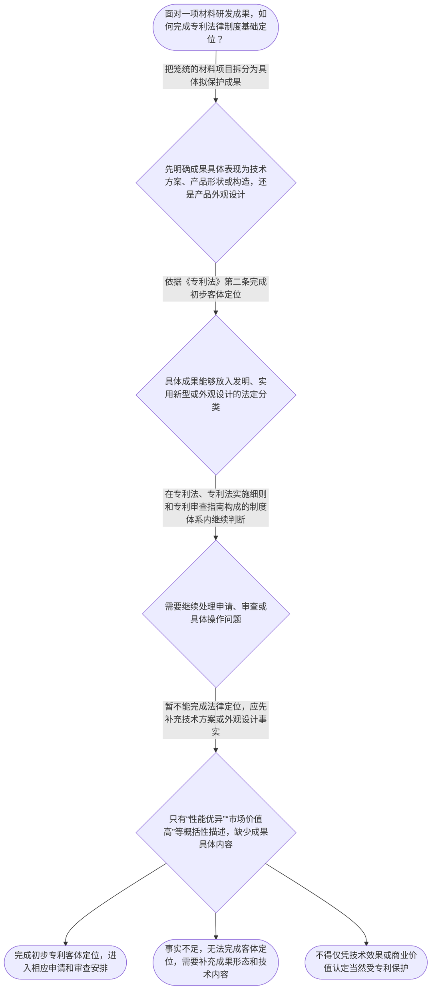

# 专家 A 教学草稿

> 专家：expert_a ｜ 风格：conservative

## 教学模块选择清单

- 当前教学节点：`patent-law-foundation`
- 板块预算：自适应 5/5，总计 8/8

| # | 模块 (block_type) | 类型 | 触发原因 (trigger) | 对应正文段 | 归属 |
|---:|---|:--:|---|---|:--:|
| 1 | `anchor_scenario` | 自适应 | perception=sensing(0.82) / cold_start | 材料研发成果进入专利制度｜某材料研发团队制备出一种用于锂离子电池正极的复合材料，并完成实验室性能测试。团队准备将材料配… | [A] |
| 2 | `legal_anchor` | 必选 | mandatory | 保护客体的法条锚定｜《专利法》第二条 | [A] |
| 3 | `worked_example` | 自适应 | cold_start(low_confidence) | 材料成果的客体定位示例｜某材料研发团队形成三项成果：一种复合材料配方、一种制备该材料的工艺，以及一种用于产品展示的包… | [A] |
| 4 | `decision_flow` | 自适应 | input=visual(0.79) | 材料成果制度定位流程｜面对一项材料研发成果，如何完成专利法律制度基础定位？ | [A] |
| 5 | `reflect_prompt` | 自适应 | processing=reflective(0.64) | 把制度分类连接到研发实践｜回顾一项材料研发成果：其中哪些内容是材料组成或制备方法等技术方案，哪些内容只是实验数据、产品… | [A] |
| 6 | `assessment` | 必选 | mandatory | 本节三类测评｜复习专利保护的三种法定客体 | [A] |
| 7 | `knowledge_synthesis` | 必选 | mandatory | 专利法律制度基础框架｜专利权基本特征：独占性、时间性和地域性共同界定专利保护的权利边界。 | [A] |
| 8 | `summary_card` | 自适应 | len(knowledge_sub_nodes)=3>=3 | 制度基础速查卡｜材料领域专利学习的制度起点，是准确定位法定保护客体并明确规则来源。 | [A] |

## 教学正文

## I — 法律问题

材料领域的专利学习不能从“技术效果好不好”直接跳到“能否授权”。第一步是明确研发成果的具体形态：是材料组成或制备方法等技术方案，还是产品外观设计；第二步是明确专利制度的规则来源和专利权的基本边界。

本节只处理专利法律制度基础。新颖性和创造性的具体判断，需要在后续节点中结合相应法条、审查规则和检索材料展开。由于本轮检索上下文为空，以下内容不扩展未获得直接依据的条款或案例。

## R — 适用规则

《专利法》第二条列明，专利保护的客体包括发明、实用新型和外观设计。〔RAG: 检索上下文为空；该表述依据教学上下文提供的《专利法》第二条知识点，未提供可直接引用的检索文件〕

中国专利制度体系包括专利法、专利法实施细则和专利审查指南。专利法提供基本法律依据，实施细则和审查指南属于具体实施与审查所处的规则体系。这里仅依据教学上下文作制度层级概括，检索上下文未提供相关文件原文。

专利制度的基本特征包括独占性、时间性和地域性。也就是说，专利保护具有排他性，但受法定期限和地域范围限制。该概括来自教学上下文；检索上下文未提供相应法条原文。

专利制度的作用包括激励发明创造、促进技术公开、推动技术应用和经济发展。教学上下文还列明中国专利制度具有早期公开、延迟审查，以及初步审查制与实质审查制并存等运行特点。上述内容是本节的制度背景，不替代具体审查规则。

## A — 规则适用

第一，拆分材料研发事实。一个“材料项目”可能同时包含材料配方、制备方法、产品结构、实验数据和产品外观。法律判断应针对具体成果，而不能以项目名称概括全部内容。

第二，进行客体定位。依据《专利法》第二条，把拟保护成果放入发明、实用新型或外观设计的法定分类。材料配方和制备工艺通常需要围绕技术方案进行识别；产品外观则需要单独观察其是否属于外观设计意义上的成果。对于具体成果是否满足某类客体的全部条件，本轮没有检索材料支持，不能作超出证据范围的确定结论。

第三，区分制度入口和授权结论。确定成果可以在某一法定客体框架内继续申请，只表示完成了初步制度定位，并不表示已经满足新颖性、创造性、实用性或其他授权条件。新颖性和创造性必须在相应后续节点中分别判断，不能用客体定位替代实体审查。

第四，确定规则来源。涉及申请和审查的具体问题，应继续在专利法、专利法实施细则和专利审查指南构成的制度体系内查找依据。当前检索上下文没有提供关于抵触申请、现有技术、单独对比或创造性三步法的直接材料，因此本节不对这些规则作具体法条断言。

## C — 结论

材料领域专利判断的制度起点，是先把研发成果拆分并依据《专利法》第二条完成法定客体定位，再根据专利法、专利法实施细则和专利审查指南处理后续申请与审查问题。专利权具有独占性、时间性和地域性；客体定位不等于最终授权。对于新颖性和创造性的具体判断，本轮检索上下文未提供直接依据，不能在本节虚构条款或案例。

> 常见误区 / 易混淆点
>
> 1. “性能优异”不等于“当然可以获得专利保护”；技术效果不能替代法定客体定位。
> 2. “属于发明或实用新型”不等于“已经具备新颖性和创造性”；客体判断与授权条件是不同层次的问题。
> 3. 专利权不是无期限、无地域限制的权利；独占性、时间性和地域性共同构成其基本边界。
> 4. 本节不提前讲授新颖性和创造性的具体对比规则，相关内容应以取得的法条和审查材料为依据。

本节设有测评，请到【习题】区作答。

### 材料研发成果进入专利制度（anchor_scenario）

> 某材料研发团队制备出一种用于锂离子电池正极的复合材料，并完成实验室性能测试。团队准备将材料配方、制备工艺和电池应用一并申请专利，但成员对这些成果是否属于同一保护客体、应依据哪些规范文件审查存在分歧。团队还计划在申请前发布测试结果，因此需要先准确理解专利制度保护什么、保护权有哪些边界，以及中国专利制度由哪些规则构成。

**锚定**：该情境用于锚定专利保护客体、专利权基本特征和中国专利制度规范体系三个基础概念。

**先想一想**：面对一项性能优异的新材料成果，为什么不能仅凭技术效果很好，就断定其当然能够获得专利保护？

### 保护客体的法条锚定（legal_anchor）

- **《专利法》第二条**：《专利法》第二条确立了发明、实用新型和外观设计三种专利保护客体；材料领域成果必须先在这一法定分类中定位。

**为何重要**：材料领域的技术价值不等于已经满足专利保护条件。准确识别法定保护客体，是继续学习申请程序、新颖性和创造性判断的制度入口。

### 材料成果的客体定位示例（worked_example）

**案情/例题**：某材料研发团队形成三项成果：一种复合材料配方、一种制备该材料的工艺，以及一种用于产品展示的包装图案。团队希望用“一件材料专利”概括全部成果。进入后续申请和审查前，首先应完成什么制度性判断？
**适用规则**：《专利法》第二条规定的三种专利保护客体；教学上下文同时列明中国专利制度体系包括专利法、专利法实施细则和专利审查指南。
**分步推演**：
1. 先按成果内容拆分事实。复合材料配方和制备工艺表现为技术方案，包装图案表现为产品外观相关成果，不能仅因它们属于同一研发项目就视为一个法律客体。 → *先拆分具体成果，不以项目名称代替法律分类。*
2. 依据《专利法》第二条，将具体成果放入发明、实用新型或外观设计的法定分类框架。技术方案与外观设计方案需要分别识别其保护对象。 → *法定客体分类是专利制度判断的第一步。*
3. 完成客体定位后，再依据专利法、专利法实施细则和专利审查指南处理申请和审查问题。现有教学上下文未提供该具体成果最终授权的直接依据。 → *客体定位不等于授权结论，后续程序和实体条件仍须分别判断。*
**结论**：该团队应先将复合材料配方、制备工艺和包装图案分别识别，再判断各自对应的法定保护客体。客体定位只是进入专利申请和审查的起点，不能据此直接得出已经具备新颖性、创造性或能够授权的结论。
**本题要点**：面对材料研发成果，应先拆分事实并完成法定客体定位，再进入申请程序和实体审查。

### 材料成果制度定位流程（decision_flow）

**决策问题**：面对一项材料研发成果，如何完成专利法律制度基础定位？



### 把制度分类连接到研发实践（reflect_prompt）

**反思问题**：回顾一项材料研发成果：其中哪些内容是材料组成或制备方法等技术方案，哪些内容只是实验数据、产品外观或商业表达？申请前应如何分别记录这些内容？

**关注要点**：不要将技术效果、市场价值和法定保护客体混为一谈；区分材料组成、制备方法、产品结构或构造与产品外观；先完成成果分类，再判断应适用的申请和审查规则

**连接**：连接到材料研发中的实验记录、工艺文件和产品设计资料，思考不同成果形态如何对应专利制度分类。

### 专利法律制度基础框架（knowledge_synthesis）

**知识框架**：
- 专利权基本特征：独占性、时间性和地域性共同界定专利保护的权利边界。
- 中国专利制度体系：专利法、专利法实施细则和专利审查指南共同构成教学上下文列明的规则体系。
- 专利保护客体：《专利法》第二条列明发明、实用新型和外观设计三种客体。
- 专利制度作用：通过激励发明创造、促进技术公开、推动技术应用和经济发展发挥制度功能。
- 制度发展与运行特点：教学上下文列明早期公开、延迟审查，以及初步审查制与实质审查制并存。
**概念关系**：先识别成果是否属于法定保护客体，再进入申请程序和实体审查。；专利权基本特征说明保护边界，规范体系说明规则来源，三种客体提供成果分类入口。；本节点建立制度基础；新颖性和创造性的具体判断属于后续节点，不能由本节点的客体定位替代。
**必记**：材料研发成果必须先完成法定保护客体定位，不能只凭技术效果判断。；《专利法》第二条列明发明、实用新型和外观设计三种专利保护客体。；专利权具有独占性、时间性和地域性，申请与审查还须依据相应制度规范继续判断。

### 制度基础速查卡（summary_card）

**要点卡**：
- **独占性、时间性、地域性**：专利保护具有排他效力、期限边界和地域边界。
- **中国专利制度体系**：专利法、专利法实施细则和专利审查指南共同构成重要规则来源。
- **三种保护客体**：《专利法》第二条列明发明、实用新型和外观设计。
- **专利制度作用**：专利制度通过激励创造、促进公开和推动应用服务经济发展。
- **制度运行特点**：教学上下文列明早期公开、延迟审查，以及初步审查制和实质审查制并存。
**必背**：《专利法》第二条列明发明、实用新型和外观设计三种保护客体；专利权具有独占性、时间性和地域性；材料成果应先完成客体定位，再进入申请程序和实体审查
**一句话总结**：材料领域专利学习的制度起点，是准确定位法定保护客体并明确规则来源。

### 本节三类测评（assessment）

**三类覆盖**：backward_review、forward_probe、weakness_probe
**题目**：
- q-backward-1：复习专利保护的三种法定客体
- q-forward-1：探测专利申请文件这一下一节点知识
- q-weakness-1：辨析制度规范体系与成果客体定位的关系


## 结构化字段

## knowledge_points

```json
[
  {
    "node_id": "patent-law-foundation",
    "kc_name": "专利制度的基本概念与特征：独占性、时间性、地域性"
  },
  {
    "node_id": "patent-law-foundation",
    "kc_name": "中国专利制度体系：专利法、专利法实施细则、专利审查指南"
  },
  {
    "node_id": "patent-law-foundation",
    "kc_name": "专利保护的三种客体：发明、实用新型、外观设计（专利法第2条）"
  },
  {
    "node_id": "patent-law-foundation",
    "kc_name": "专利制度的作用：激励发明创造、促进技术公开、推动技术应用和经济发展"
  },
  {
    "node_id": "patent-law-foundation",
    "kc_name": "中国专利制度发展历程与特点：早期公开延迟审查、初步审查制与实质审查制并存"
  }
]
```

## legal_basis

```json
[
  {
    "article": "《专利法》第二条：专利保护的三种客体为发明、实用新型、外观设计",
    "source": "教学上下文：当前节点知识点明确标注“专利保护的三种客体：发明、实用新型、外观设计（专利法第2条）”"
  }
]
```

## risks

```json
[
  {
    "risk": "检索上下文为空；除教学上下文明确提供的《专利法》第二条和制度基础信息外，不应编造新颖性、创造性相关条款、案例或审查指南原文。",
    "related_node_id": "patent-law-foundation"
  },
  {
    "risk": "容易把材料性能、实验数据或商业价值直接等同于法定保护客体，应先拆分成果事实并完成法律分类。",
    "related_node_id": "patent-law-foundation"
  },
  {
    "risk": "容易把客体定位误认为最终授权结论；后续仍须分别学习申请程序及实体审查条件。",
    "related_node_id": "patent-law-foundation"
  }
]
```

## draft_stage

```json
"debate"
```

## irac

```json
{
  "issue": "材料研发成果进入中国专利制度时，应如何识别其法定保护客体、专利权基本边界和后续适用的规则体系？",
  "rule": "教学上下文明确提供的直接法条依据是《专利法》第二条，其列明发明、实用新型和外观设计三种专利保护客体。教学上下文同时列明中国专利制度体系包括专利法、专利法实施细则和专利审查指南，并列明专利制度基本特征包括独占性、时间性和地域性。检索上下文未提供其他法条原文或案例依据。",
  "application": "面对材料领域成果，应先把材料配方、制备方法、产品结构或构造、产品外观等事实拆分，再依据《专利法》第二条将其放入发明、实用新型或外观设计的法定分类。完成客体定位后，申请和审查问题再依据专利法、专利法实施细则和专利审查指南继续处理。仅有“性能优异”或“商业价值高”的描述，不足以替代客体定位。",
  "conclusion": "材料领域专利学习的制度起点，是准确识别法定保护客体、理解专利权的基本边界并明确规则来源。检索上下文为空，现有依据不足以展开新颖性、创造性具体条文或审查标准；相关内容应留待对应后续节点并在取得检索依据后讲授。"
}
```

## interactive_questions

```json
[
  {
    "qid": "q-backward-1",
    "category": "remember",
    "difficulty": "L1",
    "source_tag": "backward_review",
    "kc_node_id": "patent-law-foundation",
    "question": "根据《专利法》第二条，下列哪一组属于专利保护的三种客体？",
    "answer": "A",
    "options": [
      "A. 发明、实用新型、外观设计",
      "B. 发明、商标、著作权",
      "C. 实用新型、商业秘密、外观设计",
      "D. 发明、植物新品种、集成电路布图设计"
    ]
  },
  {
    "qid": "q-forward-1",
    "category": "remember",
    "difficulty": "L1",
    "source_tag": "forward_probe",
    "kc_node_id": "patent-application-process",
    "question": "仅作下一节点探测：下列哪项属于专利申请文件？",
    "answer": "B",
    "options": [
      "A. 产品销售合同",
      "B. 请求书、说明书及其摘要、权利要求书等",
      "C. 企业财务报表和年度审计报告",
      "D. 产品广告和展会邀请函"
    ]
  },
  {
    "qid": "q-weakness-1",
    "category": "analyze",
    "difficulty": "L3",
    "source_tag": "weakness_probe",
    "kc_node_id": "patent-law-foundation",
    "question": "关于中国专利制度规范体系及材料研发成果的法律定位，下列哪项正确？",
    "answer": "C",
    "options": [
      "A. 专利审查指南可以替代专利法并创设新的专利保护客体",
      "B. 只要材料性能优异，就无需识别其是否属于法定保护客体",
      "C. 应先依据专利法识别成果的法定客体，再在专利法、实施细则和审查指南构成的制度体系内处理后续问题",
      "D. 专利权一经取得就当然在所有国家和地区永久有效"
    ]
  }
]
```

## knowledge_synthesis

```json
{
  "node": "patent-law-foundation",
  "coverage": [
    {
      "node_id": "patent-law-foundation"
    }
  ],
  "confusable_pairs": [
    {
      "pair": "技术效果与法定保护客体：材料性能优异不等于当然属于可获得专利保护的客体，仍须先完成法律分类。"
    },
    {
      "pair": "客体定位与授权判断：确定属于某类专利客体只是制度入口，不等于已经满足后续授权条件。"
    },
    {
      "pair": "专利法与专利审查指南：专利法是基本法律依据，专利审查指南属于审查规则体系，二者不能相互替代。"
    }
  ]
}
```
