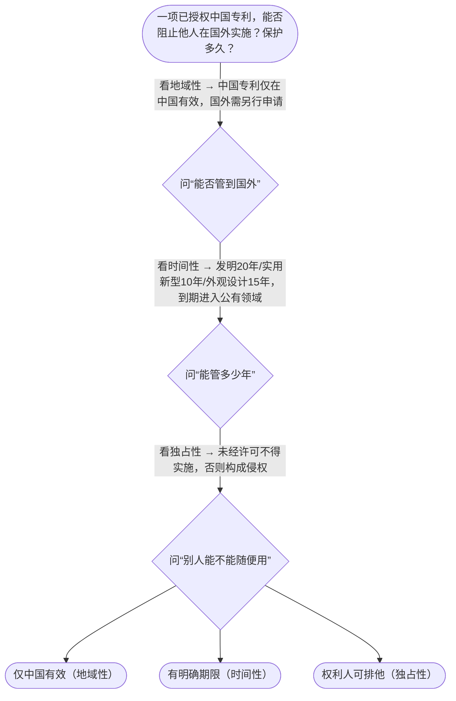

# 专家 B 教学草稿

> 专家：expert_b ｜ 风格：accessible

## 教学模块选择清单

- 当前教学节点：`patent-law-foundation`
- 板块预算：自适应 5/5，总计 8/8

| # | 模块 (block_type) | 类型 | 触发原因 (trigger) | 对应正文段 | 归属 |
|---:|---|:--:|---|---|:--:|
| 1 | `anchor_scenario` | 自适应 | perception=sensing(0.82) / cold_start | 材料研发场景导入｜你是新材料公司的研发负责人，团队刚做出一种高强度轻质合金，准备用于新能源汽车电池壳体。老板把… | [B] |
| 2 | `legal_anchor` | 必选 | mandatory | 法条锚定：第2条与制度体系｜《专利法》第二条（发明、实用新型、外观设计的定义） | [B] |
| 3 | `worked_example` | 自适应 | cold_start(low_confidence) | 案例演示：新合金该选哪种客体｜材料团队开发出新型高强轻质合金（成分+制备工艺均有改进），同时把合金压成具有独特散热筋的电池… | [B] |
| 4 | `decision_flow` | 自适应 | input=visual(0.79) | 决策流：识别专利三特征｜一项已授权中国专利，能否阻止他人在国外实施？保护多久？ | [B] |
| 5 | `reflect_prompt` | 自适应 | processing=reflective(0.64) | 反思：材料项目里的制度选择｜如果你们团队既想快速拿到证书做融资，又想保护核心配方，你会如何在发明与实用新型之间做取舍？ | [B] |
| 6 | `assessment` | 必选 | mandatory | 三类测评｜回忆专利法第2条对发明的定义 | [B] |
| 7 | `knowledge_synthesis` | 必选 | mandatory | 知识综合框架｜三特征：独占性（排他）、时间性（有期限）、地域性（有国界） | [B] |
| 8 | `summary_card` | 自适应 | len(knowledge_sub_nodes)=3>=3 | 速查卡｜先认清“独时地+三客体+三层体系”，材料专利才有正确起点。 | [B] |

## 教学正文

## 1. 场景导入

你是一家新材料公司的研发负责人。团队刚做出一种高强度轻质合金，想用来做新能源汽车电池壳体。老板问你：“我们要不要立刻申请专利？申请了能独占多少年？在中国批了，美国是不是自动保护？发明、实用新型还是外观设计选哪个？”现场还挂着一张未填完的思维导图：左边写着“技术秘密”，右边空白写着“专利”。你需要先搞清楚专利到底是什么、保护什么、能管多久管到哪里，才能决定下一步怎么走。

## 2. 人话解释

专利制度可以想象成国家给技术方案发的“有期限、有地盘的独占门票”。

- **独占性**：拿到专利后，别人未经许可不能用、不能卖、不能造，你有权说“停”。
- **时间性**：发明专利最长20年、实用新型10年、外观设计15年，到期就进公共领域，谁都能用。
- **地域性**：中国专利只在中国有效，想去美国保护必须再走美国程序。

中国专利制度像三层楼：
1. 《专利法》是宪法级规则；
2. 《专利法实施细则》把程序细节写清楚；
3. 《专利审查指南》是审查员和代理人每天翻的“操作手册”。

保护对象只有三类（专利法第2条）：
- **发明**：产品或方法的新技术方案（材料配方、制备工艺都属此类）；
- **实用新型**：产品形状/构造的小改进（适合“小改大用”的结构）；
- **外观设计**：好看又能工业量产的造型/图案。

制度存在的理由很实在：激励你公开技术换独占权，大家少重复踩坑，经济往前跑。中国特色是“早期公开、延迟审查”——发明申请先公开让社会知道，再慢慢做实质审查；实用新型和外观设计只做初步审查就能授权，两种机制并存。

## 3. 法条回扣

核心条文就是专利法第2条，它把“什么东西能叫发明创造”钉死了：发明是新的技术方案，实用新型是适于实用的形状构造方案，外观设计是富有美感且能工业应用的新设计。第1条则点明了制度目的——保护合法权益、鼓励创造、推动应用、促进经济社会发展。整个体系靠“法—细则—指南”三件套运转：法给原则，细则给程序，指南给审查标准。中国专利制度从1985年实施以来，一直坚持早期公开+延迟审查（发明）与初步审查制（实用新型/外观）并存，这是它最鲜明的操作特点。

## 4. 类比 / 口诀

把专利想成“限时、限地的独家摊位证”：
- 独占性 = 这个摊位只有你能摆；
- 时间性 = 租约到期必须撤；
- 地域性 = 证上写的是“中国市场”，出了国界无效。

口诀：**“独时地，三客体，法细则指南，早公迟审并存制。”**

类比边界：摊位证管的是“摆摊权”，不管你货物好不好卖（那是市场问题）；同样，专利管的是“禁止他人实施”，不管你技术最后赚不赚钱。

## 5. 应试提示

题干里出现“能否在国外自动生效”“保护期限是多久”“属于发明还是实用新型”时，立刻调动三特征+三客体。常见陷阱：
- 把“地域性”忘了，以为中国专利全球通吃；
- 把实用新型当成发明，搞错审查强度和期限；
- 把“早期公开”理解成“已经授权”。
判断步骤：先问客体对不对（第2条）→ 再问三特征是否满足 → 最后落到中国体系用哪本“书”（法/细则/指南）。

## 6. 互动提问

本节设有测评，请到【习题】区作答。

### 材料研发场景导入（anchor_scenario）

> 你是新材料公司的研发负责人，团队刚做出一种高强度轻质合金，准备用于新能源汽车电池壳体。老板把你叫进会议室，桌上摊着未完成的思维导图：左边写着“技术秘密保密”，右边空白写着“专利”。他连问三句：“立刻申请能不能独占？能独占多少年？中国批了美国是不是自动保护？我们该选发明、实用新型还是外观设计？”现场气氛紧张，你必须先弄清专利到底保护什么、管多久、管到哪里，才能给出靠谱建议。

**锚定**：用真实材料研发决策场景同时锚定三特征（独占/时间/地域）与三客体（发明/实用新型/外观设计）。

**先想一想**：如果你此刻只能先回答老板一个问题，你会先澄清“地域性”还是“该选哪种客体”？为什么？

### 法条锚定：第2条与制度体系（legal_anchor）

- **《专利法》第二条（发明、实用新型、外观设计的定义）**：第2条用三句话把能申请专利的“东西”钉死：发明=产品或方法的新技术方案；实用新型=形状构造的实用小方案；外观设计=好看又能工业用的造型。
- **《专利法》第一条（立法目的）**：第1条说明国家为什么给你独占权：为了鼓励你公开、推动应用、让科技和经济一起往前走。

**为何重要**：本节点所有后续判断（选客体、谈特征、谈体系）都必须回到这两条；材料领域申请时第一关就是客体对不对号。

### 案例演示：新合金该选哪种客体（worked_example）

**案情/例题**：材料团队开发出新型高强轻质合金（成分+制备工艺均有改进），同时把合金压成具有独特散热筋的电池壳体。问：分别可能落入哪类专利客体？为什么？
**适用规则**：《专利法》第二条
**分步推演**：
1. 合金成分与制备工艺属于对产品和方法提出的新的技术方案，直接对应发明定义。 → *成分+工艺 → 发明*
2. 壳体上的散热筋属于对产品形状、构造的改进，且适于实用，可考虑实用新型。 → *形状构造 → 实用新型*
3. 若壳体整体造型富有美感并适于工业应用，还可叠加外观设计；但纯技术方案优先走发明/实用新型。 → *美感造型 → 外观设计（可选叠加）*
**结论**：核心技术方案走发明；结构改进可并行实用新型；外观设计仅覆盖造型美感部分。
**本题要点**：材料领域先锁定“技术方案”还是“形状构造”还是“美感造型”，再对号入座第2条。

### 决策流：识别专利三特征（decision_flow）

**决策问题**：一项已授权中国专利，能否阻止他人在国外实施？保护多久？



### 反思：材料项目里的制度选择（reflect_prompt）

**反思问题**：如果你们团队既想快速拿到证书做融资，又想保护核心配方，你会如何在发明与实用新型之间做取舍？

**关注要点**：实用新型初步审查快但保护期限短、强度弱；发明实质审查慢但保护强、期限长；早期公开延迟审查对材料配方意味着什么

**连接**：连接到中国专利制度“初步审查制与实质审查制并存”的特点，以及三客体选择。

### 知识综合框架（knowledge_synthesis）

**知识框架**：
- 三特征：独占性（排他）、时间性（有期限）、地域性（有国界）
- 三客体：发明（技术方案）、实用新型（形状构造）、外观设计（美感设计）——专利法第2条
- 三层体系：专利法（原则）→实施细则（程序）→审查指南（操作）
- 制度作用：激励创造、促进公开、推动应用与经济发展
- 中国特点：早期公开延迟审查 + 初步审查制与实质审查制并存
**概念关系**：先确认客体（第2条）→ 再理解三特征 → 再放入中国“法-细则-指南”体系与审查模式
**必记**：专利不是全球通行证，地域性必须时刻提醒；材料配方/工艺优先对号发明；结构小改可走实用新型；早期公开≠已经授权

### 速查卡（summary_card）

**要点卡**：
- **三特征**：独占、限时、限地——专利的身份证
- **三客体**：发明管方案，实用新型管结构，外观管好看
- **制度体系**：法给原则，细则给程序，指南给审查员干活标准
- **中国特点**：早期公开延迟审查 + 初审与实审并存
**必背**：专利法第2条三类客体定义；独占性、时间性、地域性；发明20年/实用新型10年/外观设计15年
**一句话总结**：先认清“独时地+三客体+三层体系”，材料专利才有正确起点。

### 三类测评（assessment）

**三类覆盖**：backward_review、forward_probe、weakness_probe
**题目**：
- q1：回忆专利法第2条对发明的定义
- q2：探测专利申请基本文件构成
- q3：分析地域性在跨境实施中的后果


## 结构化字段

## knowledge_points

```json
[
  {
    "node_id": "patent-law-foundation",
    "kc_name": "专利制度的基本概念与特征：独占性、时间性、地域性"
  },
  {
    "node_id": "patent-law-foundation",
    "kc_name": "中国专利制度体系：专利法、专利法实施细则、专利审查指南"
  },
  {
    "node_id": "patent-law-foundation",
    "kc_name": "专利保护的三种客体：发明、实用新型、外观设计（专利法第2条）"
  },
  {
    "node_id": "patent-law-foundation",
    "kc_name": "专利制度的作用：激励发明创造、促进技术公开、推动技术应用和经济发展"
  },
  {
    "node_id": "patent-law-foundation",
    "kc_name": "中国专利制度发展历程与特点：早期公开延迟审查、初步审查制与实质审查制并存"
  }
]
```

## legal_basis

```json
[
  {
    "article": "《中华人民共和国专利法》第二条：本法所称的发明创造是指发明、实用新型和外观设计。发明，是指对产品、方法或者其改进所提出的新的技术方案。实用新型，是指对产品的形状、构造或者其结合所提出的适于实用的新的技术方案。外观设计，是指对产品的整体或者局部的形状、图案或者其结合以及色彩与形状、图案的结合所作出的富有美感并适于工业应用的新设计。",
    "source": "《中华人民共和国专利法》第二条"
  },
  {
    "article": "《中华人民共和国专利法》第一条：为了保护专利权人的合法权益，鼓励发明创造，推动发明创造的应用，提高创新能力，促进科学技术进步和经济社会发展，制定本法。",
    "source": "《中华人民共和国专利法》第一条"
  },
  {
    "article": "专利制度以专利法为核心，辅以专利法实施细则和专利审查指南，形成审查与保护的操作体系。",
    "source": "中国专利制度体系通说（专利法+实施细则+审查指南）"
  }
]
```

## risks

```json
[
  {
    "risk": "把专利的地域性误解为全球自动保护，导致材料企业只在中国申请却以为海外也安全。",
    "related_node_id": "patent-rights-nature"
  },
  {
    "risk": "混淆发明与实用新型的审查强度和保护期限，把本该走发明实质审查的材料配方误选实用新型。",
    "related_node_id": "patent-law-foundation"
  },
  {
    "risk": "把早期公开当成已经授权，误以为公开后就获得了完整排他权。",
    "related_node_id": "patent-system-overview"
  }
]
```

## draft_stage

```json
"debate"
```

## irac

```json
{
  "issue": "材料公司新合金能否以及如何作为专利客体获得保护？",
  "rule": "专利法第2条界定发明、实用新型、外观设计三类客体；专利制度具有独占性、时间性、地域性。",
  "application": "新合金属于对产品的新的技术方案，落入发明范畴；若仅改壳体造型则可考虑外观设计；独占权仅限中国且有期限。",
  "conclusion": "应优先按发明申请，同时认清三特征边界，再进入后续程序。"
}
```

## interactive_questions

```json
[
  {
    "qid": "q1",
    "category": "remember",
    "difficulty": "L1",
    "source_tag": "backward_review",
    "kc_node_id": "patent-law-foundation",
    "question": "根据专利法第2条，下列哪一项正确描述了发明？",
    "answer": "B",
    "options": [
      "A. 对产品的形状、构造提出的适于实用的新的技术方案",
      "B. 对产品、方法或者其改进所提出的新的技术方案",
      "C. 对产品的形状、图案作出的富有美感并适于工业应用的新设计",
      "D. 仅限于产品本身而不能覆盖方法的技术方案"
    ]
  },
  {
    "qid": "q2",
    "category": "understand",
    "difficulty": "L1",
    "source_tag": "forward_probe",
    "kc_node_id": "patent-application-process",
    "question": "关于专利申请文件，下列哪项属于提出发明专利申请时通常必须提交的基本文件之一？",
    "answer": "C",
    "options": [
      "A. 仅需提交请求书即可启动审查",
      "B. 只提交样品实物，无需文字说明书",
      "C. 请求书、说明书及其摘要、权利要求书等",
      "D. 必须先获得国外授权证明才能在中国提交"
    ]
  },
  {
    "qid": "q3",
    "category": "analyze",
    "difficulty": "L3",
    "source_tag": "weakness_probe",
    "kc_node_id": "patent-law-foundation",
    "question": "某材料企业仅在中国获得发明专利权后，发现竞争对手在美国大规模生产和销售相同产品。下列分析哪一项最准确？",
    "answer": "A",
    "options": [
      "A. 因专利具有地域性，中国专利不能直接阻止美国境内的实施行为",
      "B. 因专利具有独占性，中国专利自动覆盖全球市场",
      "C. 因专利具有时间性，只要未到期就能在任何国家主张权利",
      "D. 因中国实行早期公开延迟审查，公开后即获得域外效力"
    ]
  }
]
```

## knowledge_synthesis

```json
{
  "node": "patent-law-foundation",
  "coverage": [
    {
      "node_id": "patent-rights-nature"
    },
    {
      "node_id": "patent-law-framework"
    },
    {
      "node_id": "patent-law-foundation"
    },
    {
      "node_id": "patent-system-overview"
    }
  ],
  "confusable_pairs": [
    {
      "pair": "早期公开 vs 已经授权：公开只是让社会知晓，授权才产生完整排他权"
    },
    {
      "pair": "发明 vs 实用新型：前者含方法、实审、20年；后者仅产品形状构造、初审、10年"
    }
  ]
}
```
