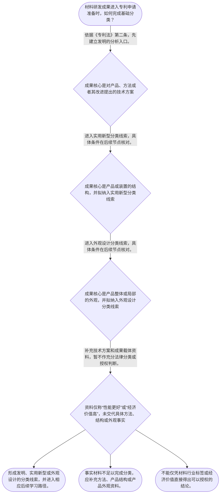

# 整合后的课程完整内容与习题

## 教学模块选择清单

- 当前教学节点：`patent-law-foundation`
- 板块预算：自适应 4/6，总计 8/9

| # | 模块 (block_type) | 类型 | 触发原因 (trigger) | 对应正文段 | 归属 |
|---:|---|:--:|---|---|:--:|
| 1 | `anchor_scenario` | 自适应 | perception=sensing(0.82) / cold_start | 材料研发项目的制度入口｜某材料研发团队开发出一种锂电池电极涂层。他们既改进了浆料配方和干燥工艺，又设计了一台连续涂布… | [A+B融合] |
| 2 | `legal_anchor` | 必选 | mandatory | 保护客体的法条锚点｜《中华人民共和国专利法》第二条 | [A] |
| 3 | `worked_example` | 自适应 | cold_start(low_confidence) | 从材料成果到保护客体｜某企业形成三项成果：一种改善电极附着力的涂层制备方法、一台具有新型结构的涂布装置，以及该装置… | [A+B融合] |
| 4 | `decision_flow` | 自适应 | input=visual(0.79) | 材料成果的分类流程｜材料研发成果进入专利申请准备时，如何完成基础分类？ | [A+B融合] |
| 5 | `reflect_prompt` | 自适应 | processing=reflective(0.64) | 从研发资料反思法律分类｜回顾一个熟悉的材料研发项目：其中哪些资料证明方法事实，哪些资料说明产品结构，哪些资料仅反映产… | [B] |
| 6 | `assessment` | 必选 | mandatory | 本节测评｜复习《专利法》第二条规定的三种保护客体。 | [A] |
| 7 | `knowledge_synthesis` | 必选 | mandatory | 专利法律制度基础框架｜专利制度基本特征：独占性、时间性和地域性共同限定专利权的制度属性。 | [A+B融合] |
| 8 | `summary_card` | 自适应 | len(knowledge_sub_nodes)=3>=3 | 专利制度基础速查卡｜材料专利学习先建立制度地图和客体分类，再进入申请程序以及新颖性、创造性的具体审查。 | [A+B融合] |

## 教学正文

## 一、先建立材料专利学习的制度入口

材料领域的研发成果进入专利申请前，第一步不是直接给技术贴上“有创新”或“能授权”的标签，而是建立专利制度地图，识别成果究竟属于哪一种法定保护客体。同一个材料研发项目，可能同时包含制备方法、材料产品、设备结构和产品外观；这些事实虽然来自同一项目，但不当然属于同一种专利保护客体。

专利权通常具有独占性、时间性和地域性。独占性说明权利人在法定范围内具有排他性；时间性说明保护不是永久的；地域性说明权利效力受特定法域限制。这个“保护网”的类比只用于帮助记忆三种制度属性，不能替代对具体权利范围、期限和地域效力的法律核验。

## 二、中国专利制度的规范体系与作用

中国专利制度的基础规范体系包括专利法、专利法实施细则和专利审查指南。专利法提供基本制度和法定分类，实施细则与审查指南在申请和审查实践中对具体问题进行细化。由于本次检索上下文为空，除教学上下文明确提供的内容外，本节不补充未经核验的具体条文原文、审查指南规则或案例。

专利制度的重要作用包括激励发明创造、促进技术公开、推动技术应用和经济发展。对材料研发者而言，专利制度把技术保护与技术公开联系起来，因此后续学习会进一步涉及申请程序、现有技术、新颖性和创造性。但制度功能只是后续学习的背景，本节不提前替代新颖性和创造性的具体判断规则。

教学上下文列明中国专利制度具有早期公开、延迟审查，以及初步审查制与实质审查制并存等特点。学习时要区分两个层次：初步审查、实质审查属于程序机制；新颖性、创造性等属于实体判断问题。程序处于某一阶段，并不等于具体授权条件当然已经满足。

## 三、专利保护的三种客体

《中华人民共和国专利法》第二条规定，本法所称发明创造包括发明、实用新型和外观设计；教学上下文同时载明，发明是指对产品、方法或者其改进所提出的新的技术方案。〔RAG: 检索上下文未提供直接依据；本句依据教学上下文所载《专利法》第2条〕

因此，材料研发成果应先从事实层面拆分：制备工艺、配方处理流程等属于方法事实，应先从发明的分析入口理解；材料产品或装置的结构属于产品结构事实，应进入实用新型的分类线索；产品整体或局部的视觉设计属于产品外观事实，应进入外观设计的分类线索。由于检索上下文未提供实用新型和外观设计的完整法条定义及审查细则，本节只建立分类入口，不对其具体条件作无依据扩展。

正确顺序是：先确认成果核心是方法、产品结构还是产品外观；再对应发明、实用新型或外观设计的分类线索；随后进入申请程序准备；最后在后续实体审查节点具体讨论新颖性、创造性等授权条件。研发记录如果只写“性能更好”或“经济价值高”，却没有说明具体方法、结构或外观事实，就不能完成充分的法律分类。

## 四、示范：如何把材料项目拆成法律对象

某企业形成三项成果：一种改善电极附着力的涂层制备方法、一台具有新型结构的涂布装置，以及该装置外壳的视觉设计。企业不能把三项成果简单统称为“新型材料装备方案”。

第一步，识别事实对象。涂层制备方法、涂布装置结构和设备外观分别承载不同的技术或设计事实。第二步，建立分类入口。制备方法依据《专利法》第二条关于方法或其改进的表述，先进入发明分析入口；装置结构和设备外观则分别进入实用新型、外观设计的分类线索。第三步，衔接后续流程。客体分类完成后，再按照申请程序准备文件，并在后续实体审查节点分析新颖性、创造性等条件。

这个示范只能说明“如何分类和安排学习顺序”，不能直接证明任何一项成果已经具备新颖性、创造性或其他授权条件。

## 五、常见误区与区分方法

**误解一：“材料研发项目”天然就是发明专利。**

正解推理：法律分类看具体成果事实，而不是看项目所属行业。应先判断成果核心是方法、产品结构还是产品外观，再建立相应分析入口。

区分判据：题干出现工艺步骤、配方处理流程时，先看方法事实；出现装置构造、连接关系或结构改进时，先看产品结构事实；出现形状、图案、色彩等视觉设计事实时，先看产品外观事实。

**误解二：完成客体分类，就等于已经通过新颖性和创造性审查。**

正解推理：客体分类只解决“应从哪一种专利制度入口分析”的问题；新颖性、创造性属于后续实体审查问题，必须在相应节点依据具体规则另行判断。

区分判据：如果问题问“属于哪种保护客体”，重点是成果事实和法定分类；如果问题问“是否新颖或具有创造性”，则已经进入后续实体判断，不能仅凭分类结论作答。

**误解三：初步审查和实质审查只是同一件事的不同叫法。**

正解推理：教学上下文将二者列为并存的审查机制，学习者应把程序阶段与实体授权条件分开理解。

区分判据：题干强调审查阶段、程序安排时，关注初步审查或实质审查的制度位置；题干要求判断具体授权条件时，不能以“已经进入某审查阶段”替代法律分析。

本节设有测评，请到【习题】区作答。

### 材料研发项目的制度入口（anchor_scenario）

> 某材料研发团队开发出一种锂电池电极涂层。他们既改进了浆料配方和干燥工艺，又设计了一台连续涂布装置，还为该设备外壳制作了新的视觉形态。负责人准备申请专利时，把“涂层技术”“设备结构”“产品外观”和“未来取得的专利权”统称为一项成果。代理人要求团队分别提供工艺记录、装置结构资料和外观设计资料，因为同一项目可能包含多个需要分别识别的法律对象。

**锚定**：该情境锚定研发项目名称与法律保护客体的区别，并引出制度分类先于后续审查的顺序。

**先想一想**：同一研发项目中的方法、装置结构和产品外观，为什么不能只用“这是一项材料技术”完成专利分类？

### 保护客体的法条锚点（legal_anchor）

- **《中华人民共和国专利法》第二条**：专利法上的发明创造包括发明、实用新型和外观设计；材料项目应依据具体方法、产品结构或产品外观事实确定分类入口。

**为何重要**：《专利法》第二条是本节识别三种专利保护客体的明确法条入口。只有先确定分析对象，才能在后续节点进入申请程序以及新颖性、创造性等实体审查。

### 从材料成果到保护客体（worked_example）

**案情/例题**：某企业形成三项成果：一种改善电极附着力的涂层制备方法、一台具有新型结构的涂布装置，以及该装置外壳的视觉设计。企业拟申请专利，但研发记录只把三项成果统称为“新型材料装备方案”。在提交申请前，应如何依专利制度基础框架整理这些成果？
**适用规则**：《中华人民共和国专利法》第二条；教学上下文所载规则为发明创造包括发明、实用新型和外观设计，且发明涉及对产品、方法或者其改进提出的新的技术方案。
**分步推演**：
1. 先把项目名称拆回法律相关事实：制备方法、装置结构和产品外观是不同的成果对象，不能因其来自同一项目而当然视为同一保护客体。 → *先识别具体申请对象。*
2. 涂层制备方法属于对方法或其改进提出技术方案的事实，应依据第二条先建立发明的分析入口。 → *方法先进入发明分析入口。*
3. 涂布装置的结构与外壳视觉设计分别对应产品或装置结构、产品外观两类事实，应分别置入实用新型和外观设计的分类线索；具体定义和条件留待后续节点核对。 → *结构与外观必须分别分类。*
4. 完成客体分类后，团队才可按后续申请程序准备文件，并在实体审查学习中另行判断新颖性、创造性等条件。 → *分类是程序与实体判断的前提。*
**结论**：该项目不能笼统作为一项“材料技术”处理：涂层制备方法先进入发明分析入口，涂布装置结构与设备外观分别进入实用新型、外观设计的分类线索。客体分类完成后，才进入申请程序和后续实体审查；本例不据此直接认定具备新颖性或创造性。
**本题要点**：训练先拆成果事实、再定保护客体、后进程序与实体审查的顺序。

### 材料成果的分类流程（decision_flow）

**决策问题**：材料研发成果进入专利申请准备时，如何完成基础分类？



### 从研发资料反思法律分类（reflect_prompt）

**反思问题**：回顾一个熟悉的材料研发项目：其中哪些资料证明方法事实，哪些资料说明产品结构，哪些资料仅反映产品外观？按此拆分后，申请准备的优先顺序会如何改变？

**关注要点**：研发成果名称不等于专利法上的保护客体。；同一项目可以包含多个需要分别识别的成果。；客体分类先于申请程序准备，也先于新颖性、创造性等后续实体问题的具体判断。

**连接**：连接到学习者已有的材料研发经验：实验方案、装置结构图、样机照片和工业设计图承载的事实并不相同。

### 专利法律制度基础框架（knowledge_synthesis）

**知识框架**：
- 专利制度基本特征：独占性、时间性和地域性共同限定专利权的制度属性。
- 中国专利制度体系：以专利法为基础，并由专利法实施细则和专利审查指南支撑申请与审查实践。
- 三种保护客体：《专利法》第二条规定发明、实用新型和外观设计是专利法上的基础分类。
- 制度作用：通过激励发明创造、促进技术公开，推动技术应用和经济发展。
- 审查机制概览：教学上下文列明早期公开、延迟审查，以及初步审查制与实质审查制并存。
**概念关系**：先识别保护客体，再进入申请程序准备。；后续实体审查节点具体处理新颖性、创造性等授权判断。；技术公开是专利制度功能的一部分，也是后续理解现有技术和新颖性问题的背景，但本节不展开具体判断标准。
**必记**：材料研发成果不能只按项目名称判断，必须按方法、产品结构或产品外观等事实进行法律分类。；《专利法》第二条是识别发明、实用新型和外观设计这一基础分类的法条入口。；保护客体分类不等于已经满足新颖性、创造性或其他授权条件。

### 专利制度基础速查卡（summary_card）

**要点卡**：
- **专利权特征**：独占性、时间性、地域性共同限定专利权的制度属性。
- **制度体系**：专利法、专利法实施细则和专利审查指南构成理解中国专利制度的基本规范层次。
- **三种保护客体**：发明、实用新型和外观设计是专利法上的基础分类。
- **制度功能**：专利制度以激励创造并促进技术公开、应用为重要功能。
- **审查机制**：应区分初步审查与实质审查，不能把程序阶段当作实体结论。
**必背**：《专利法》第二条规定的三种专利保护客体是发明、实用新型和外观设计。；先识别保护客体，再进入申请程序与实体审查的具体分析。；客体分类不是新颖性、创造性已经成立的证明。
**一句话总结**：材料专利学习先建立制度地图和客体分类，再进入申请程序以及新颖性、创造性的具体审查。

### 本节测评（assessment）

**三类覆盖**：backward_review、forward_probe、weakness_probe
**题目**：
- q_foundation_object：复习《专利法》第二条规定的三种保护客体。
- q_forward_documents：探测下一节点中的基本申请文件构成。
- q_foundation_classification：辨析材料项目客体分类与后续实体审查的关系。


## 结构化数据

## expert

```json
"A+B融合"
```

## style

```json
"fused"
```

## knowledge_points

```json
[
  {
    "node_id": "patent-law-foundation",
    "kc_name": "专利制度的基本概念与特征：独占性、时间性、地域性"
  },
  {
    "node_id": "patent-law-foundation",
    "kc_name": "中国专利制度体系：专利法、专利法实施细则、专利审查指南"
  },
  {
    "node_id": "patent-law-foundation",
    "kc_name": "专利保护的三种客体：发明、实用新型、外观设计（专利法第2条）"
  },
  {
    "node_id": "patent-law-foundation",
    "kc_name": "专利制度的作用：激励发明创造、促进技术公开、推动技术应用和经济发展"
  },
  {
    "node_id": "patent-law-foundation",
    "kc_name": "中国专利制度发展历程与特点：早期公开延迟审查、初步审查制与实质审查制并存"
  }
]
```

## legal_basis

```json
[
  {
    "article": "《中华人民共和国专利法》第二条",
    "source": "教学上下文所载《专利法》第2条：专利保护的三种客体为发明、实用新型、外观设计；其中发明涉及对产品、方法或者其改进提出的新的技术方案。"
  },
  {
    "article": "《中华人民共和国专利法》第二十六条第一款",
    "source": "教学上下文所载下一节点知识点：发明或者实用新型专利申请文件包括请求书、说明书及其摘要、权利要求书等。"
  }
]
```

## risks

```json
[
  {
    "risk": "检索上下文为空。除教学上下文明确提供的《专利法》第二条及申请程序提示外，本稿不对具体法条原文、审查指南细则、案例或新颖性、创造性判断标准作无依据扩展。",
    "related_node_id": "patent-law-foundation"
  },
  {
    "risk": "学习者可能把材料行业标签或项目名称直接等同于某一种专利保护客体。",
    "related_node_id": "patent-law-foundation"
  },
  {
    "risk": "学习者可能把保护客体分类与新颖性、创造性等后续实体审查结论混同。",
    "related_node_id": "patent-law-foundation"
  },
  {
    "risk": "学习者可能把初步审查、实质审查等程序机制误认为授权条件已经满足。",
    "related_node_id": "patent-law-foundation"
  }
]
```

## draft_stage

```json
"integration"
```

## irac

```json
{
  "issue": "材料研发成果在进入专利申请及后续实体审查前，如何理解中国专利制度基础框架并识别法定保护客体？",
  "rule": "教学上下文所载《中华人民共和国专利法》第二条规定，本法所称发明创造包括发明、实用新型和外观设计；其中发明是指对产品、方法或者其改进所提出的新的技术方案。教学上下文同时列明中国专利制度体系包括专利法、专利法实施细则和专利审查指南。",
  "application": "对材料研发项目，应先从事实层面区分制备方法、产品或装置结构、产品外观等成果，再依据《专利法》第二条建立相应分类入口。客体分类完成后，才进入申请程序以及新颖性、创造性等后续实体审查节点；检索上下文未提供后续实体判断的直接法条、审查指南原文或案例材料。",
  "conclusion": "材料领域专利学习的第一步是建立制度地图并准确识别保护客体，而不是提前对新颖性或创造性作出结论。"
}
```

## interactive_questions

```json
[
  {
    "qid": "q_foundation_object",
    "category": "remember",
    "difficulty": "L1",
    "source_tag": "backward_review",
    "kc_node_id": "patent-law-foundation",
    "question": "依据教学上下文所载《专利法》第二条，下列哪一组属于中国专利法规定的三种专利保护客体？",
    "answer": "A",
    "options": [
      "A. 发明、实用新型、外观设计",
      "B. 发明、商标、著作权",
      "C. 实用新型、商业秘密、集成电路布图设计",
      "D. 外观设计、地理标志、植物新品种"
    ]
  },
  {
    "qid": "q_forward_documents",
    "category": "understand",
    "difficulty": "L1",
    "source_tag": "forward_probe",
    "kc_node_id": "patent-application-process",
    "question": "关于发明或者实用新型专利申请文件，下列说法正确的是？",
    "answer": "A",
    "options": [
      "A. 发明或者实用新型申请通常包括请求书、说明书及其摘要、权利要求书等文件",
      "B. 申请人只需提交产品样品，无须提交书面技术文件",
      "C. 申请文件只包括权利要求书，不包括说明书",
      "D. 申请文件只能在授权后首次提交"
    ]
  },
  {
    "qid": "q_foundation_classification",
    "category": "analyze",
    "difficulty": "L3",
    "source_tag": "weakness_probe",
    "kc_node_id": "patent-law-foundation",
    "question": "某团队完成电极涂层制备方法、用于该方法的涂布装置及装置外观方案。就本节基础框架而言，下列判断最严谨的是？",
    "answer": "C",
    "options": [
      "A. 只要项目涉及材料，就当然只能作为发明专利申请，装置和外观无需分别分析",
      "B. 涂层制备方法、涂布装置和装置外观必然构成同一种保护客体，因为它们来自同一项目",
      "C. 应先分别识别方法、产品结构和产品外观等事实，再进入相应的保护客体及后续审查分析",
      "D. 只要研发成果具有经济价值，就可以跳过保护客体分类而直接认定具备新颖性和创造性"
    ]
  }
]
```

## knowledge_synthesis

```json
{
  "node": "patent-law-foundation",
  "coverage": [
    {
      "node_id": "patent-law-foundation"
    },
    {
      "node_id": "patent-law-foundation"
    },
    {
      "node_id": "patent-law-foundation"
    },
    {
      "node_id": "patent-law-foundation"
    },
    {
      "node_id": "patent-law-foundation"
    }
  ],
  "confusable_pairs": [
    {
      "pair": "研发项目名称与专利法保护客体：前者是项目或技术表达，后者必须依据方法、产品结构或产品外观等法律相关事实识别。"
    },
    {
      "pair": "制度基础分类与新颖性、创造性判断：前者确定分析入口，后者属于后续实体审查问题，不能混同。"
    },
    {
      "pair": "初步审查与实质审查：二者是不同审查机制，程序阶段不等于具体授权条件已经满足。"
    }
  ]
}
```
