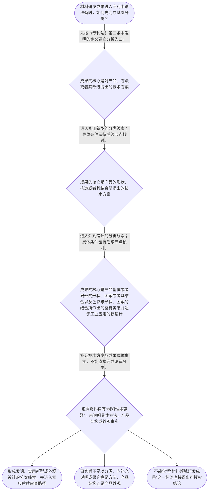

# 专家 A 教学草稿

> 专家：expert_a ｜ 风格：conservative

## 教学模块选择清单

- 当前教学节点：`patent-law-foundation`
- 板块预算：自适应 5/5，总计 8/8

| # | 模块 (block_type) | 类型 | 触发原因 (trigger) | 对应正文段 | 归属 |
|---:|---|:--:|---|---|:--:|
| 1 | `anchor_scenario` | 自适应 | perception=sensing(0.82) / cold_start | 材料研发项目的专利制度入口｜材料研发团队开发出一种锂电池电极涂层：通过调整浆料配方和干燥工艺，降低了极片开裂率。团队同时… | [A] |
| 2 | `legal_anchor` | 必选 | mandatory | 保护客体的法条锚点｜《中华人民共和国专利法》第二条 | [A] |
| 3 | `worked_example` | 自适应 | cold_start(low_confidence) | 从材料成果到保护客体｜某企业形成三项成果：一种改善电极附着力的涂层制备方法、一台具有新型结构的涂布装置、以及该装置… | [A] |
| 4 | `decision_flow` | 自适应 | input=visual(0.79) | 材料成果的分类流程｜材料研发成果进入专利申请准备时，如何先完成基础分类？ | [A] |
| 5 | `reflect_prompt` | 自适应 | processing=reflective(0.64) | 从研发资料反思法律分类｜回顾一个你熟悉的材料研发项目：其中哪些内容是方法事实、哪些是产品结构事实、哪些仅是外观事实？… | [A] |
| 6 | `assessment` | 必选 | mandatory | 本节测评｜复习三种专利保护客体。 | [A] |
| 7 | `knowledge_synthesis` | 必选 | mandatory | 专利法律制度基础框架｜专利制度基本特征：专利权具有独占性、时间性和地域性；其具体权利边界将在后续子节点展开。 | [A] |
| 8 | `summary_card` | 自适应 | len(knowledge_sub_nodes)=3>=3 | 专利制度基础速查卡｜材料专利学习先建立制度地图和客体分类，再进入申请程序以及新颖性、创造性的具体审查。 | [A] |

## 教学正文

## I — 法律问题

材料领域的研发成果进入专利申请前，应先解决两个基础问题：第一，中国专利制度以何种规范体系运行；第二，一项材料研发成果究竟应按发明、实用新型还是外观设计的法定分类进入后续程序。此时不能把“项目有技术价值”直接等同于“必然可以授权”。

本节先建立制度入口。新颖性和创造性的具体判断属于后续实体审查学习内容；检索上下文未提供可直接用于该两项判断的法条原文、审查指南原文或案例材料，因此本节不对其具体标准作无依据延伸。

## R — 适用规则

《中华人民共和国专利法》第二条规定，本法所称的发明创造包括发明、实用新型和外观设计；其中，发明是指对产品、方法或者其改进所提出的新的技术方案。〔RAG: 检索上下文未提供直接依据；本句依据教学上下文所载《专利法》第2条〕

据本节教学上下文，中国专利制度的基础规范层次包括专利法、专利法实施细则和专利审查指南。专利法提供基本制度和法定分类；实施细则与审查指南在后续申请、审查实践中承担具体化作用。该层次关系用于建立学习地图，不替代对具体条文和指南原文的逐项核验。

应依次掌握以下五个基础要点：

1. 专利权具有独占性、时间性和地域性。它们说明专利权不是对技术的无限、永久或全球当然控制；具体边界将在后续专利权性质节点展开。
2. 中国专利制度应放在专利法、专利法实施细则和专利审查指南的规范体系中理解。
3. 保护客体的基本分类是发明、实用新型和外观设计；材料项目中的方法、产品结构和产品外观不应混为一谈。
4. 专利制度的重要作用包括激励发明创造、促进技术公开、推动技术应用和经济发展。公开与保护的制度安排，是理解后续现有技术、新颖性问题的背景。
5. 教学上下文所列制度特点包括早期公开、延迟审查，以及初步审查制与实质审查制并存。它们提示学习者区分程序阶段与实体判断阶段。

## A — 规则适用

以锂电池电极涂层项目为例。团队可能同时形成涂层制备方法、涂布装置的结构改进和设备外壳设计。第一步不是笼统地问“这个材料项目能否拿到专利”，而是拆分法律上相关的成果事实。

对于制备方法，应先依据《专利法》第二条中发明涉及产品、方法或者其改进的表述，建立发明专利的分析入口。〔RAG: 检索上下文未提供直接依据；本句依据教学上下文所载《专利法》第2条〕对于涂布装置的结构和外壳的外观，应分别置入实用新型与外观设计的分类线索中，再在后续节点核对各自具体条件。

可按下列线性流程处理材料项目：先确认成果核心是方法、产品结构还是产品外观；再对应发明、实用新型或外观设计的法定分类；随后准备相应申请文件并进入程序；最后才在后续实体审查框架内讨论新颖性、创造性等授权条件。若研发记录只写“性能更好”，却没有说明具体方法、结构或外观事实，则分类资料尚不充分。

从制度功能看，研发团队应同时保留能够说明技术方案和成果形成过程的资料。这里的结论不是这些资料当然证明新颖性或创造性，而是它们有助于在后续申请和审查中明确对象、技术事实与制度路径。

## C — 结论

材料领域专利申请的基础不是先给技术贴上“创新”标签，而是先建立专利制度地图，并依法识别成果属于发明、实用新型还是外观设计。《专利法》第二条是该分类的明确法条入口。〔RAG: 检索上下文未提供直接依据；本句依据教学上下文所载《专利法》第2条〕

在完成客体分类后，学习路径才进入申请程序以及新颖性、创造性等实体审查问题。本节不提前替代这些后续判断。

> 常见误区 / 易混淆点
>
> - 将“材料研发项目”直接视为一个单一保护客体。正确做法是拆分方法、产品结构和产品外观等事实。
> - 将“可以作为某类专利对象分析”误认为“已经满足授权条件”。客体分类只是入口，不等于新颖性、创造性或其他条件已经成立。
> - 把初步审查、实质审查等程序机制与具体实体结论混同。程序阶段的存在不替代对法定授权条件的逐项审查。
>
> 本节设有测评，请到【习题】区作答。

### 材料研发项目的专利制度入口（anchor_scenario）

> 材料研发团队开发出一种锂电池电极涂层：通过调整浆料配方和干燥工艺，降低了极片开裂率。团队同时做出了用于连续涂布的装置，并为设备外壳设计了新的视觉形态。负责人准备申请专利，却把“技术方案”“设备外观”和“获得专利后的权利”混在一起讨论。

代理人首先不评价该涂层是否新颖或有创造性，而是要求团队分别列出方法、装置和外观的技术事实，并确认应先进入哪一种专利保护客体的法律框架。

**锚定**：该情境锚定专利保护客体、制度功能和审查入口之间的基础关系。

**先想一想**：面对同一研发项目中的方法、装置和外观，为什么不能只用“这是一项技术”来完成专利制度上的分类？

### 保护客体的法条锚点（legal_anchor）

- **《中华人民共和国专利法》第二条**：中国专利法将专利保护客体区分为发明、实用新型和外观设计；其中发明是对产品、方法或者其改进提出的新的技术方案。

**为何重要**：判断材料成果能否进入专利申请与审查程序，首先要识别其属于何种法定保护客体。新颖性和创造性的具体判断属于后续实体审查节点，本节只建立其制度入口。

### 从材料成果到保护客体（worked_example）

**案情/例题**：某企业形成三项成果：一种改善电极附着力的涂层制备方法、一台具有新型结构的涂布装置、以及该装置外壳的视觉设计。企业问：在提交申请前，应如何按专利制度基础框架整理成果？
**适用规则**：《中华人民共和国专利法》第二条；教学上下文未提供发明、实用新型与外观设计之外的具体审查细则原文。
**分步推演**：
1. 先把研发成果拆成方法、产品或装置结构、以及产品外观三个不同对象，避免以项目名称替代法律上的保护对象。 → *先识别申请对象。*
2. 对涂层制备方法，依据《专利法》第二条中“发明”包括对方法或其改进提出的新的技术方案，先进入发明专利的分析入口。 → *方法对应发明的制度入口。*
3. 对涂布装置和外壳外观，分别置入实用新型与外观设计的法定分类中；本节不以未提供的细则替代后续具体审查。 → *装置结构与产品外观应分别分类。*
4. 分类完成后，才可依申请程序准备文件，并在后续实体审查学习中分析新颖性、创造性等授权条件。 → *分类是后续程序与审查的前提。*
**结论**：该项目不能只按一个笼统的“材料技术”处理：涂层制备方法可先按发明的定义审视，涂布装置需在实用新型制度框架下进一步核对，设备外观则需在外观设计制度框架下进一步核对。是否授权仍须进入后续申请程序与实体审查。
**本题要点**：材料领域项目应先按法律保护对象拆分成果，再进入申请文件和实体审查的分析。

### 材料成果的分类流程（decision_flow）

**决策问题**：材料研发成果进入专利申请准备时，如何先完成基础分类？



### 从研发资料反思法律分类（reflect_prompt）

**反思问题**：回顾一个你熟悉的材料研发项目：其中哪些内容是方法事实、哪些是产品结构事实、哪些仅是外观事实？这种拆分会如何影响后续检索和申请准备？

**关注要点**：研发成果名称不等于专利法上的保护客体。；同一项目可以包含多个需要分别分析的成果。；客体分类先于对新颖性、创造性等后续实体问题的具体判断。

**连接**：连接到学习者已有的材料研发经验：实验方案、设备结构图和工业设计图通常承载不同类型的事实。

### 专利法律制度基础框架（knowledge_synthesis）

**知识框架**：
- 专利制度基本特征：专利权具有独占性、时间性和地域性；其具体权利边界将在后续子节点展开。
- 中国专利制度体系：以专利法为基础，并由专利法实施细则和专利审查指南共同支撑申请与审查实践。
- 三种保护客体：发明、实用新型、外观设计是《专利法》第二条规定的基本分类。
- 制度作用：通过激励发明创造与技术公开，服务技术应用和经济发展。
- 审查机制概览：教学上下文所列制度特点包括早期公开、延迟审查，以及初步审查制与实质审查制并存。
**概念关系**：先确定成果属于何种保护客体，才能在后续申请程序中准备相应材料。；申请程序解决如何提出申请；后续实体审查节点才具体处理新颖性、创造性等授权判断。；技术公开是专利制度功能的一部分，也会与后续现有技术和新颖性学习发生关联。
**必记**：材料研发成果不能仅按项目名称判断，必须按方法、产品结构或产品外观等事实进行法律分类。；《专利法》第二条是识别发明、实用新型和外观设计这一基础分类的法条入口。；本节只建立制度基础；新颖性与创造性的具体判断应在后续实体审查节点展开。

### 专利制度基础速查卡（summary_card）

**要点卡**：
- **专利权特征**：独占性、时间性、地域性共同限定专利权的制度属性。
- **制度体系**：专利法、专利法实施细则和专利审查指南构成理解中国专利制度的基本规范层次。
- **三种保护客体**：发明、实用新型和外观设计是专利法上的基础分类。
- **制度功能**：专利制度以激励创造和促进公开、应用为重要功能。
- **审查机制**：应区分初步审查与实质审查，并把具体授权条件留给后续节点。
**必背**：《专利法》第二条规定的三种专利保护客体是发明、实用新型和外观设计。；先识别保护客体，再进入申请程序与实体审查的具体分析。；新颖性和创造性的具体判断不应与本节的制度基础分类混同。
**一句话总结**：材料专利学习先建立制度地图和客体分类，再进入申请程序以及新颖性、创造性的具体审查。

### 本节测评（assessment）

**三类覆盖**：backward_review、forward_probe、weakness_probe
**题目**：
- q_foundation_object：复习三种专利保护客体。
- q_forward_documents：探测下一节点中的基本申请文件。
- q_foundation_system：辨析材料项目中客体分类与后续审查的关系。


## 结构化字段

## knowledge_points

```json
[
  {
    "node_id": "patent-law-foundation",
    "kc_name": "专利制度的基本概念与特征：独占性、时间性、地域性"
  },
  {
    "node_id": "patent-law-foundation",
    "kc_name": "中国专利制度体系：专利法、专利法实施细则、专利审查指南"
  },
  {
    "node_id": "patent-law-foundation",
    "kc_name": "专利保护的三种客体：发明、实用新型、外观设计"
  },
  {
    "node_id": "patent-law-foundation",
    "kc_name": "专利制度的作用：激励发明创造、促进技术公开、推动技术应用和经济发展"
  },
  {
    "node_id": "patent-law-foundation",
    "kc_name": "中国专利制度发展历程与特点：早期公开延迟审查、初步审查制与实质审查制并存"
  }
]
```

## legal_basis

```json
[
  {
    "article": "《中华人民共和国专利法》第二条",
    "source": "教学上下文所载《专利法》第2条：专利保护的三种客体为发明、实用新型、外观设计。"
  }
]
```

## risks

```json
[
  {
    "risk": "检索上下文为空。除教学上下文明确提供的《专利法》第二条及申请程序条号提示外，本稿不对具体法条原文、审查指南细则、案例或新颖性和创造性判断标准作无依据扩展。",
    "related_node_id": "patent-law-foundation"
  },
  {
    "risk": "易将材料研发项目整体直接等同于一种专利类型，忽略方法、产品结构和产品外观可能需要分别识别。",
    "related_node_id": "patent-law-foundation"
  },
  {
    "risk": "易将保护客体分类与后续新颖性、创造性等实体审查结论混同。",
    "related_node_id": "patent-law-foundation"
  }
]
```

## draft_stage

```json
"debate"
```

## irac

```json
{
  "issue": "材料研发成果在进入专利申请与后续实体审查前，应如何理解中国专利制度的基础框架并识别法定保护客体？",
  "rule": "《中华人民共和国专利法》第二条规定本法所称的发明创造包括发明、实用新型和外观设计，并对三者作出定义。教学上下文同时列明中国专利制度体系包括专利法、专利法实施细则和专利审查指南。",
  "application": "对材料研发项目，应先从事实层面区分方法、产品或装置结构、产品外观等成果，再依《专利法》第二条建立相应分类入口。申请程序、现有技术、新颖性和创造性的具体判断属于后续节点；检索上下文未提供可直接用于这些后续实体判断的法条或审查指南原文。",
  "conclusion": "本节的结论是：材料领域专利学习的第一步是建立专利制度地图并准确识别保护客体，而非提前对新颖性或创造性作出结论。"
}
```

## interactive_questions

```json
[
  {
    "qid": "q_foundation_object",
    "category": "remember",
    "difficulty": "L1",
    "source_tag": "backward_review",
    "kc_node_id": "patent-law-foundation",
    "question": "依据《专利法》第二条，下列哪一组属于中国专利法规定的三种专利保护客体？",
    "answer": "A",
    "options": [
      "A. 发明、实用新型、外观设计",
      "B. 发明、商标、著作权",
      "C. 实用新型、商业秘密、集成电路布图设计",
      "D. 外观设计、地理标志、植物新品种"
    ]
  },
  {
    "qid": "q_forward_documents",
    "category": "understand",
    "difficulty": "L1",
    "source_tag": "forward_probe",
    "kc_node_id": "patent-application-process",
    "question": "关于发明或者实用新型专利申请文件，下列说法正确的是？",
    "answer": "A",
    "options": [
      "A. 发明或者实用新型申请通常包括请求书、说明书及其摘要、权利要求书等文件",
      "B. 申请人只需提交产品样品，无须提交书面技术文件",
      "C. 申请文件只包括权利要求书，不包括说明书",
      "D. 申请文件的内容只能在授权后首次提交"
    ]
  },
  {
    "qid": "q_foundation_system",
    "category": "analyze",
    "difficulty": "L3",
    "source_tag": "weakness_probe",
    "kc_node_id": "patent-law-foundation",
    "question": "某研发团队完成了一种锂电池电极涂层制备方法、一种用于该方法的涂布装置，以及该装置的外观方案。就本节基础框架而言，下列判断最严谨的是？",
    "answer": "C",
    "options": [
      "A. 只要项目涉及材料，就当然只能作为发明专利申请，装置和外观无需分别分析",
      "B. 涂层制备方法、涂布装置和装置外观必然构成同一种保护客体，因为它们来自同一项目",
      "C. 应先分别识别方法、产品结构和产品外观等事实，再进入相应的保护客体及后续审查分析",
      "D. 只要研发成果具有经济价值，就可以跳过保护客体分类而直接认定具备新颖性和创造性"
    ]
  }
]
```

## knowledge_synthesis

```json
{
  "node": "patent-law-foundation",
  "coverage": [
    {
      "node_id": "patent-law-foundation"
    }
  ],
  "confusable_pairs": [
    {
      "pair": "研发项目名称与专利法保护客体：前者是管理或技术表达，后者必须依据方法、产品结构或产品外观等法律相关事实识别。"
    },
    {
      "pair": "制度基础分类与新颖性、创造性判断：前者确定分析入口，后者属于后续实体审查问题，不能混同。"
    }
  ]
}
```
