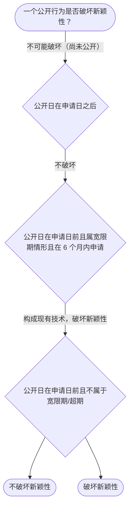

# 专家 B 教学草稿

> 专家：expert_b ｜ 风格：accessible

## 教学模块选择清单

- 当前教学节点：`patent-law-foundation`
- 板块预算：自适应 6/8，总计 8/12

| # | 模块 (block_type) | 类型 | 触发原因 (trigger) | 对应正文段 | 归属 |
|---:|---|:--:|---|---|:--:|
| 1 | `anchor_scenario` | 自适应 | perception=sensing(0.82) / cold_start | 场景导入｜假设你是一名材料科学领域的研发者，开发了一种新型碳基纳米材料。你希望通过专利制度保护你的发明… | [B] |
| 2 | `legal_anchor` | 必选 | mandatory | 法条锚定｜《专利法》第二条 | [B] |
| 3 | `worked_example` | 自适应 | cold_start(low_confidence) | 案例演示｜某材料公司2024年发表了一篇关于新型石墨烯的论文，2025年1月申请专利。问：论文发表是否… | [B] |
| 4 | `decision_flow` | 自适应 | input=visual(0.79) | 决策流程｜一个公开行为是否破坏新颖性？ | [B] |
| 5 | `reflect_prompt` | 自适应 | processing=reflective(0.64) | 反思提示｜如果客户同时做了展会展示和论文发表，你会怎么排时间表？ | [B] |
| 6 | `knowledge_synthesis` | 必选 | mandatory | 知识综合｜专利制度基本概念：独占性、时间性、地域性 | [B] |
| 7 | `summary_card` | 自适应 | len(knowledge_sub_nodes)=3>=3 | 速查卡｜先过保护客体之门，再过三性安检。 | [B] |
| 8 | `assessment` | 必选 | mandatory | 测评｜向后复习：专利保护的客体有哪些 | [B] |

## 教学正文

## 1. 场景导入

假设你是一名材料科学领域的研发者，开发了一种新型碳基纳米材料。你希望通过专利制度保护你的发明，但担心公开行为（如论文发表或会议展示）会影响后续申请。你需要先了解专利制度的基础知识，包括保护哪些客体以及如何判断新颖性和创造性。

## 2. 人话解释

专利制度是为鼓励发明创造而建立的法律框架。它有几个基本特征：独占性意味着发明人可以独占使用权，时间性指专利有一定期限保护，地域性指只在特定国家有效。中国专利制度包括专利法、专利法实施细则和专利审查指南。专利保护的对象包括发明、实用新型和外观设计三种。专利制度的作用在于激励发明创造、促进技术公开、推动技术应用和经济发展。中国专利制度的发展特点是采用早期公开、延迟审查的制度，结合初步审查和实质审查并存的方式。

## 3. 法条回扣

本节主要回扣《专利法》第二条关于保护客体，《专利法》第二十二条至第二十四条关于新颖性、创造性和实用性，以及中国专利制度的相关规定。

## 4. 类比 / 口诀

可以把专利制度比作一个保护网：独占性是网的孔眼只让你的发明进去，时间性是网有期限，地域性是网只罩在中国。口诀是'三客一体，激励创新，早期公开，初步实质并存'。类比适用于所有专利领域，但边界是具体技术事实不同可能影响判断。

## 5. 应试提示

题干关键词：专利客体、三性判断、审查制度。判断步骤：1. 识别保护对象 2. 检查是否公开 3. 判断是否显而易见 4. 看是否能用且有效。常见陷阱是混淆发明和实用新型，或忽略地域性。

## 6. 互动提问

在上述材料研发场景中，你会先关注专利保护哪些客体，还是先考虑新颖性风险？为什么？

### 场景导入（anchor_scenario）

> 假设你是一名材料科学领域的研发者，开发了一种新型碳基纳米材料。你希望通过专利制度保护你的发明，但担心公开行为（如论文发表或会议展示）会影响后续申请。你需要先了解专利制度的基础知识，包括保护哪些客体以及如何判断新颖性和创造性。

**锚定**：用材料研发的具体情境引入专利保护客体和三性判断的基础知识。

**先想一想**：在上述材料研发场景中，你会先关注专利保护哪些客体，还是先考虑新颖性风险？为什么？

### 法条锚定（legal_anchor）

- **《专利法》第二条**：专利保护的三种客体：发明、实用新型和外观设计。
- **《专利法》第二十二条**：新颖性是指在申请日之前没有相同或类似的发明在国内外出版物上公开。
- **《专利法》第二十三条**：创造性是指该发明或实用新型对本领域普通技术人员来说并非显而易见。
- **《专利法》第二十四条**：实用性是指该发明或实用新型能够制造或使用，并且能够产生积极效果。

**为何重要**：这些法条是专利授权的核心依据，理解它们是学习材料专利审查规则的基础。

### 案例演示（worked_example）

**案情/例题**：某材料公司2024年发表了一篇关于新型石墨烯的论文，2025年1月申请专利。问：论文发表是否影响新颖性？
**适用规则**：《专利法》第二十四条（不丧失新颖性宽限期 6 个月）
**分步推演**：
1. 论文发表属于公开行为，且属于科学论文发表情形 → *落入宽限期适用范围*
2. 申请日 2025-01 与发表日 2024 年相差不足 6 个月 → *在宽限期内*
3. 宽限期仅豁免该次公开，不改变三性实质审查 → *仍需过创造性/实用性*
**结论**：论文发表不破坏新颖性，但仅豁免该次公开，实体三性仍须满足。
**本题要点**：宽限期是时间豁免不是免死金牌，先判范围再算日期。

### 决策流程（decision_flow）

**决策问题**：一个公开行为是否破坏新颖性？



### 反思提示（reflect_prompt）

**反思问题**：如果客户同时做了展会展示和论文发表，你会怎么排时间表？

**关注要点**：两个公开行为的日期各自如何算宽限期；论文发表是否也享宽限期；材料专利的审查特点

**连接**：连接到现有技术与公开行为类型

### 知识综合（knowledge_synthesis）

**知识框架**：
- 专利制度基本概念：独占性、时间性、地域性
- 中国专利制度体系：专利法、细则、指南
- 专利保护客体：三种
- 专利作用：激励创新、促进技术发展
- 发展特点：早期公开、初步与实质审查并存
**概念关系**：三性依次审查：先新颖性，再创造性，最后实用性；保护客体是申请前提，三性是授权核心
**必记**：三性缺一不可才能授权；中国制度有早期公开特点；材料专利需满足实用性

### 速查卡（summary_card）

**要点卡**：
- **保护客体**：发明、实用新型、外观设计
- **三性**：新颖性/创造性/实用性
- **宽限期**：特定公开给 6 个月缓冲
- **制度特点**：早期公开、初步与实质审查并存
**必背**：三客一体，激励创新，早期公开，初步实质并存
**一句话总结**：先过保护客体之门，再过三性安检。

### 测评（assessment）

**三类覆盖**：backward_review、forward_probe、weakness_probe
**题目**：
- br-q1：向后复习：专利保护的客体有哪些
- br-q2：向后复习：中国专利制度体系包括什么
- fp-q1：向前探测：专利申请程序的初步概念
- wp-q1：薄弱点：新颖性宽限期计算
- wp-q2：薄弱点：新颖性与创造性的区别


## 结构化字段

## knowledge_points

```json
[
  {
    "node_id": "patent-law-foundation",
    "kc_name": "专利制度的基本概念与特征：独占性、时间性、地域性（详见子节点 patent-rights-nature）"
  },
  {
    "node_id": "patent-law-foundation",
    "kc_name": "中国专利制度体系：专利法、专利法实施细则、专利审查指南（详见子节点 patent-law-framework）"
  },
  {
    "node_id": "patent-law-foundation",
    "kc_name": "专利保护的三种客体：发明、实用新型、外观设计（专利法第2条）"
  },
  {
    "node_id": "patent-law-foundation",
    "kc_name": "专利制度的作用：激励发明创造、促进技术公开、推动技术应用和经济发展（详见子节点 patent-system-overview）"
  },
  {
    "node_id": "patent-law-foundation",
    "kc_name": "中国专利制度发展历程与特点：早期公开延迟审查、初步审查制与实质审查制并存（详见子节点 patent-system-overview）"
  }
]
```

## legal_basis

```json
[
  {
    "article": "《专利法》第二条",
    "source": "中国专利法"
  },
  {
    "article": "《专利法》第二十二条",
    "source": "中国专利法"
  },
  {
    "article": "《专利法》第二十三条",
    "source": "中国专利法"
  },
  {
    "article": "《专利法》第二十四条",
    "source": "中国专利法"
  }
]
```

## risks

```json
[
  {
    "risk": "混淆新颖性和创造性",
    "related_node_id": "patent-law-foundation"
  },
  {
    "risk": "忽视保护客体范围",
    "related_node_id": "patent-rights-nature"
  },
  {
    "risk": "不理解中国审查制度特点",
    "related_node_id": "patent-system-overview"
  }
]
```

## draft_stage

```json
"debate"
```

## interactive_questions

```json
[
  {
    "qid": "br-q1",
    "category": "remember",
    "difficulty": "L1",
    "source_tag": "backward_review",
    "kc_node_id": "patent-law-foundation",
    "question": "专利法保护的客体包括哪些？",
    "answer": "D",
    "options": [
      "A. 发明和实用新型",
      "B. 发明、实用新型和外观设计",
      "C. 只有外观设计",
      "D. 发明、实用新型和外观设计"
    ]
  },
  {
    "qid": "br-q2",
    "category": "remember",
    "difficulty": "L1",
    "source_tag": "backward_review",
    "kc_node_id": "patent-law-foundation",
    "question": "中国专利制度体系包括什么？",
    "answer": "B",
    "options": [
      "A. 只有专利法",
      "B. 专利法、专利法实施细则和专利审查指南",
      "C. 只有专利法实施细则",
      "D. 只有专利审查指南"
    ]
  },
  {
    "qid": "fp-q1",
    "category": "understand",
    "difficulty": "L1",
    "source_tag": "forward_probe",
    "kc_node_id": "patent-application-process",
    "question": "专利申请的申请日确定方式是什么？",
    "answer": "C",
    "options": [
      "A. 收到文件之日",
      "B. 邮寄邮戳日",
      "C. 以上都可",
      "D. 只有收到文件之日"
    ]
  },
  {
    "qid": "wp-q1",
    "category": "apply",
    "difficulty": "L2",
    "source_tag": "weakness_probe",
    "kc_node_id": "patent-law-foundation",
    "question": "如果一种材料在申请日前被公开，但属于政府国际展会，是否破坏新颖性？",
    "answer": "B",
    "options": [
      "A. 肯定破坏",
      "B. 不破坏，因为在宽限期",
      "C. 破坏，但可申请",
      "D. 不确定"
    ]
  },
  {
    "qid": "wp-q2",
    "category": "analyze",
    "difficulty": "L2",
    "source_tag": "weakness_probe",
    "kc_node_id": "patent-law-foundation",
    "question": "创造性是指对本领域普通技术人员来说非显而易见，这与新颖性的区别在于？",
    "answer": "A",
    "options": [
      "A. 新颖性看是否公开，创造性看是否显而易见",
      "B. 两者相同",
      "C. 创造性更严格",
      "D. 两者都是公开"
    ]
  }
]
```

## knowledge_synthesis

```json
{
  "node": "patent-law-foundation",
  "coverage": [
    {
      "node_id": "patent-rights-nature"
    },
    {
      "node_id": "patent-law-framework"
    },
    {
      "node_id": "patent-system-overview"
    }
  ],
  "confusable_pairs": [
    {
      "pair": "发明、实用新型与外观设计"
    },
    {
      "pair": "新颖性与创造性"
    }
  ]
}
```
