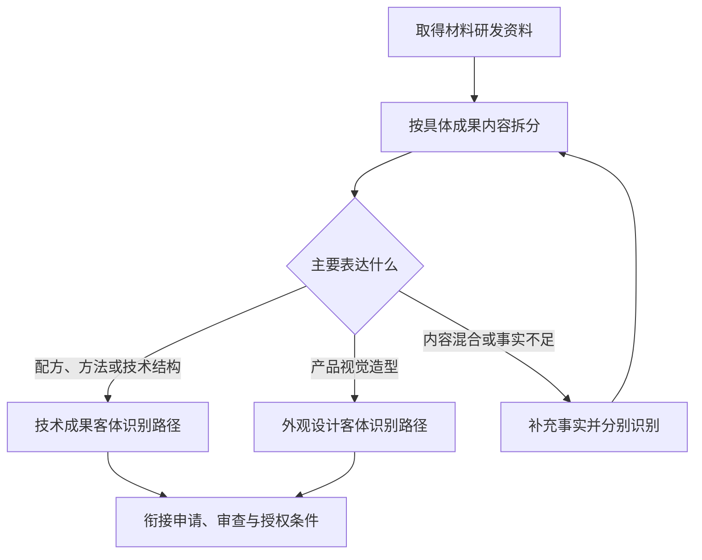
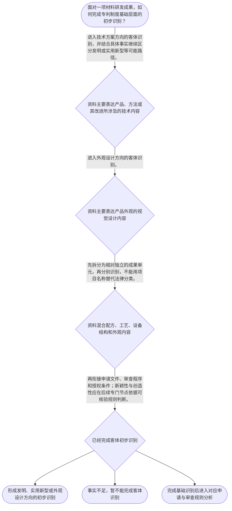

# 整合后的课程完整内容与习题

## 教学模块选择清单

- 当前教学节点：`patent-law-foundation`
- 板块预算：自适应 4/6，总计 8/9

| # | 模块 (block_type) | 类型 | 触发原因 (trigger) | 对应正文段 | 归属 |
|---:|---|:--:|---|---|:--:|
| 1 | `anchor_scenario` | 自适应 | perception=sensing(0.82) / cold_start | 材料研发成果的专利制度入口｜某材料研发团队开发出一套耐高温涂层方案：实验记录中有涂层配方和制备工艺，工程师还绘制了批量涂… | [A+B融合] |
| 2 | `legal_anchor` | 必选 | mandatory | 保护客体的法条锚点｜《中华人民共和国专利法》第二条 | [A] |
| 3 | `worked_example` | 自适应 | cold_start(low_confidence) | 材料成果的客体识别演示｜某团队形成三份研发资料：耐高温涂层配方及制备工艺、实现该工艺的涂布设备内部结构图、设备外壳的… | [A+B融合] |
| 4 | `decision_flow` | 自适应 | input=visual(0.79) | 材料成果进入专利制度的判断流程｜面对一项材料研发成果，如何完成专利制度基础层面的初步识别？ | [A+B融合] |
| 5 | `reflect_prompt` | 自适应 | processing=reflective(0.63) | 从研发资料回看制度分类｜回看一个材料研发项目：哪些资料主要说明技术方案，哪些资料主要呈现产品外观，哪些资料还需要补充… | [B] |
| 6 | `assessment` | 必选 | mandatory | 本节三类测评｜复习专利法第二条列举的三种专利保护客体。 | [A+B融合] |
| 7 | `knowledge_synthesis` | 必选 | mandatory | 专利法律制度基础框架｜专利制度基本特征：独占性、时间性和地域性用于说明专利权保护的权利边界。 | [A+B融合] |
| 8 | `summary_card` | 自适应 | len(knowledge_sub_nodes)=3>=3 | 专利制度基础速查卡｜先识别材料成果的保护客体和规则体系，再进入申请程序及新颖性、创造性等后续审查判断。 | [A+B融合] |

## 教学正文

# 专利法律制度基础：材料领域申请的制度入口

## I：先定位问题

材料研发团队常同时拥有配方、制备方法、设备结构图和产品外观图。申请专利前，第一步不是直接判断“技术是否先进”，而是先回答两个基础问题：研发资料分别表达什么成果内容？应从中国专利制度的哪一层规范和哪一种保护客体继续分析？

材料领域后续确实需要学习新颖性和创造性，但这两个问题不能由项目名称或“材料技术”这一行业标签直接回答。本节先建立制度地图和客体识别入口，具体的新颖性、创造性比较方法留待后续专门节点，并且应以届时可核验的法条、审查指南或其他检索材料为依据。

## R：基础规则

### 1. 专利权的基本特征

专利制度的基本概念可用三个边界理解：

- **独占性**：专利权在法定范围内为权利人提供排除他人相关利用的权利边界。
- **时间性**：专利保护不是永久存在，而是在法定期间内发生效力。
- **地域性**：专利权的效力受授予该权利的国家或地区法律边界限制，不因技术本身具有跨境用途就自动在全球生效。

这三个特征是理解材料技术为何需要针对目标法域进行申请、审查和保护的基础。它们说明“拥有技术成果”与“在特定法域取得专利保护”是两个不同层次的问题。

### 2. 中国专利制度的规范层次

学习中国专利申请和审查规则时，应先建立规范来源意识：专利法提供基本制度和法定要求，专利法实施细则补充制度实施层面的规则，专利审查指南帮助理解审查中的具体判断口径。三者共同构成理解中国专利制度的基本入口，但不能把不同层级的文件当成同一条规则，也不能在没有具体依据时自行补充条文内容。

### 3. 三种专利保护客体

教学上下文明确以《中华人民共和国专利法》第二条作为本节点依据，列明发明、实用新型和外观设计三种专利保护客体。〔RAG: 检索上下文未提供直接依据；教学上下文 — “专利保护的三种客体：发明、实用新型、外观设计（专利法第2条）”〕

对材料领域而言，分类标准是成果实际表达的内容，而不是项目名称、产品用途或研发部门：

- 配方、制备工艺或其他技术方案资料，首先进入技术成果的客体识别路径。
- 设备的内部结构资料，主要表达技术结构，也应按其具体技术内容识别。
- 设备或产品的视觉造型资料，主要表达外观设计内容，进入外观设计方向识别。
- 同一项目如果同时包含上述内容，应拆分为相对独立的成果单元分别分析。

“进入某一种客体识别路径”只是制度入口判断，不等于已经满足新颖性、创造性或其他授权条件。

### 4. 制度作用与审查背景

专利制度的作用包括激励发明创造、促进技术公开、推动技术应用和经济发展。〔RAG: 检索上下文未提供直接依据；教学上下文 — “专利制度的作用：激励发明创造、促进技术公开、推动技术应用和经济发展”〕

从制度学习角度看，专利保护与技术公开并不是互相孤立的两个概念：制度通过一定边界内的权利保护，促使技术成果进入公开和应用体系。教学上下文还指出，中国专利制度具有早期公开延迟审查、初步审查制与实质审查制并存的特点。〔RAG: 检索上下文未提供直接依据；教学上下文 — “早期公开延迟审查、初步审查制与实质审查制并存”〕这些内容是理解后续申请程序与实体审查节点的背景，不是本节对具体程序期限或审查条件的完整说明。

## A：把规则用于材料成果识别

可以按照以下顺序处理一项材料研发成果：

1. **拆分成果资料。** 将配方、方法、设备技术结构和产品外观等资料分开，避免用“某某材料项目”这一名称代替法律上的成果识别。
2. **识别主要表达内容。** 判断资料是在说明产品、方法或其改进所涉及的技术内容，还是主要呈现产品外观的视觉设计内容。
3. **放入三类客体框架。** 以发明、实用新型和外观设计作为初步识别框架；对于内容交叉或事实不足的资料，应保留进一步核验的空间。
4. **衔接后续规则。** 完成客体初步识别后，再进入申请文件、审查程序和授权条件的学习。新颖性与创造性的具体判断不能由客体分类直接推出。

可将主线记为：



## C：边界结论与常见误区

本节点需要带走五项基础认识：专利权具有独占性、时间性和地域性；中国专利制度的基本规范层次包括专利法、实施细则和审查指南；专利保护客体包括发明、实用新型和外观设计；专利制度具有激励创新、促进公开、推动技术应用和经济发展的作用；早期公开延迟审查以及初步审查与实质审查并存，是后续学习的制度背景。〔RAG: 检索上下文未提供直接依据；教学上下文 — 当前节点五项知识点〕

**误解一：“同一个材料项目只能申请一种专利。”**

正解推理：法律识别看成果内容，不看项目编号。一个项目可以同时形成配方、工艺、设备技术结构和产品外观等不同成果单元，应先拆分后分别识别。

区分判据：问自己“这份资料主要表达的是技术方案、设备技术结构，还是产品视觉外观”，而不是“它属于哪个研发项目”。

**误解二：“识别为发明或实用新型，就已经证明具备新颖性和创造性。”**

正解推理：客体识别只确定后续分析的制度入口；新颖性、创造性属于另一个层次的授权条件判断，不能从客体名称直接推导。

区分判据：如果问题问“属于哪类保护客体”，进行成果内容分类；如果问题问“是否满足新颖性或创造性”，必须转入对应节点，查明比较对象、时间基准和适用规则。

**误解三：“专利法、实施细则和审查指南可以任意互换。”**

正解推理：三者都是学习中国专利制度的重要规范来源，但承担的层次和功能不同。应先确认具体结论的规范出处，再引用相应文件。

区分判据：法定制度框架优先寻找专利法，实施层面的程序细节查看实施细则，审查判断口径还需核对审查指南及具体检索材料。

正式测评不在正文展开。本节设有测评，请到【习题】区作答。

### 材料研发成果的专利制度入口（anchor_scenario）

> 某材料研发团队开发出一套耐高温涂层方案：实验记录中有涂层配方和制备工艺，工程师还绘制了批量涂布设备的内部结构图，设计部门则提交了设备外壳的视觉造型图。团队准备在中国申请专利，却把三类资料统称为“材料专利”，并认为只要技术先进，就可以用同一种专利类型统一保护。代理人需要先解决成果属于何种保护客体、应从哪套规范寻找规则，再衔接申请与审查问题。

**锚定**：该情境把材料研发资料映射到保护客体、规范体系和后续审查入口，帮助建立制度主线。

**先想一想**：面对配方、制备工艺、设备技术结构和设备外观资料，应先依据什么标准进行区分？

### 保护客体的法条锚点（legal_anchor）

- **《中华人民共和国专利法》第二条**：本节依据教学上下文，将专利保护客体归纳为发明、实用新型和外观设计；材料研发成果应先按其具体内容识别可能对应的客体。

**为何重要**：材料领域同一项目可能同时包含配方、方法、设备结构和外观资料。先识别保护客体，才能正确进入后续申请、审查以及新颖性和创造性专门节点；客体识别本身不等于已经满足授权条件。

### 材料成果的客体识别演示（worked_example）

**案情/例题**：某团队形成三份研发资料：耐高温涂层配方及制备工艺、实现该工艺的涂布设备内部结构图、设备外壳的视觉造型图。团队拟以“一项材料专利”统一处理。应如何完成专利制度基础层面的客体识别？
**适用规则**：本节依据教学上下文明确列举的三种专利保护客体：发明、实用新型和外观设计。由于检索上下文未提供新颖性、创造性或其他具体审查规则，本例只演示客体识别，不对授权条件作出结论。
**分步推演**：
1. 先按照资料实际表达的成果内容拆分，而不是按照项目名称或所属部门归类。配方和制备工艺表达技术内容，设备内部结构图表达设备的技术结构，外壳造型图表达视觉外观。 → *第一步：按成果内容拆分资料。*
2. 将拆分后的成果分别放入教学上下文列明的三类客体框架中。配方、方法和设备技术结构应进入技术方案方向的识别；设备外壳造型应进入外观设计方向的识别。具体类型仍需结合完整事实和适用规则进一步核验。 → *第二步：以三类法定客体作初步归类。*
3. 客体识别只回答“应从哪类专利制度入口继续分析”，不能直接回答是否具备新颖性、创造性或其他授权条件。后续应分别衔接申请文件、审查程序和实体条件判断。 → *第三步：区分制度入口与授权结论。*
**结论**：耐高温涂层配方及制备工艺应先按技术成果方向识别；涂布设备内部结构属于技术结构资料，设备外壳造型属于外观资料，三者不能仅因服务于同一材料项目而统一归为一个保护客体。该结论只是制度入口判断，不代表任何一项已经具备新颖性或创造性。
**本题要点**：材料专利实务的第一步是把研发资料按具体成果内容拆开，再分别进入相应的客体识别和审查路径。

### 材料成果进入专利制度的判断流程（decision_flow）

**决策问题**：面对一项材料研发成果，如何完成专利制度基础层面的初步识别？



### 从研发资料回看制度分类（reflect_prompt）

**反思问题**：回看一个材料研发项目：哪些资料主要说明技术方案，哪些资料主要呈现产品外观，哪些资料还需要补充事实后才能完成客体识别？

**关注要点**：项目名称、商业用途或研发部门不能替代对成果具体内容的识别。；同一项目可能包含多个需要分别判断的成果单元。；客体识别是后续申请和审查分析的起点，不能直接推出新颖性或创造性结论。

**连接**：连接到学习者已有的实验记录、工艺路线、设备图纸和产品设计资料，并为后续学习申请程序及新颖性、创造性判断建立资料分类意识。

### 专利法律制度基础框架（knowledge_synthesis）

**知识框架**：
- 专利制度基本特征：独占性、时间性和地域性用于说明专利权保护的权利边界。
- 中国专利制度规范体系：专利法、专利法实施细则和专利审查指南构成理解制度与审查规则的基本层次。
- 三种专利保护客体：发明、实用新型和外观设计；材料研发成果应按具体内容而非项目名称进行初步识别。
- 专利制度作用：激励发明创造、促进技术公开、推动技术应用和经济发展，体现保护与公开之间的制度联系。
- 中国专利制度发展特点：教学上下文指出早期公开延迟审查，以及初步审查制与实质审查制并存；这些是后续程序学习的背景。
**概念关系**：先识别研发成果的具体内容和保护客体，再确定后续申请与审查规则的入口。；专利法提供基础制度框架，实施细则和审查指南帮助理解实施及审查口径；本节不补充检索上下文未提供的具体条文。；独占性、时间性和地域性共同说明专利保护并非无限、永久或在所有法域自动生效。；客体识别与授权条件判断属于不同层次；新颖性和创造性的具体比较方法应在后续对应节点学习。
**必记**：教学上下文明确列举的三种专利保护客体是发明、实用新型和外观设计。；材料研发项目可能包含多个成果单元，应按配方、方法、技术结构或外观等具体内容分别识别。；专利法、专利法实施细则和专利审查指南是理解中国专利制度规则的基本规范层次。；客体识别不能替代新颖性、创造性等后续授权条件判断。

### 专利制度基础速查卡（summary_card）

**要点卡**：
- **专利权三项基本特征**：独占性、时间性和地域性共同限定专利保护的权利边界。
- **中国专利制度规范体系**：专利法、专利法实施细则和专利审查指南构成理解制度规则的基本入口。
- **三种保护客体**：发明、实用新型和外观设计是教学上下文列明的三类专利保护客体。
- **材料成果识别**：配方、方法、设备技术结构和设备外观应按具体成果内容分别识别。
- **制度作用与审查背景**：专利制度连接发明激励、技术公开、技术应用和经济发展，早期公开延迟审查及两种审查机制并存属于后续学习背景。
**必背**：三种专利保护客体：发明、实用新型、外观设计。；专利权的三项基本特征：独占性、时间性、地域性。；材料项目按具体成果内容识别，不能仅按项目名称归类。；客体识别是申请与审查的制度入口，不等于已经满足新颖性或创造性条件。
**一句话总结**：先识别材料成果的保护客体和规则体系，再进入申请程序及新颖性、创造性等后续审查判断。

### 本节三类测评（assessment）

**三类覆盖**：backward_review、forward_probe、weakness_probe
**题目**：
- q-foundation-review-l1：复习专利法第二条列举的三种专利保护客体。
- q-application-probe-l1：探测下一节点中专利申请文件的基础构成。
- q-foundation-weakness-l3：辨析同一材料项目中不同成果内容的客体识别边界。


## 结构化数据

## expert

```json
"A+B融合"
```

## style

```json
"fused"
```

## knowledge_points

```json
[
  {
    "node_id": "patent-law-foundation",
    "kc_name": "专利制度的基本概念与特征：独占性、时间性、地域性"
  },
  {
    "node_id": "patent-law-foundation",
    "kc_name": "中国专利制度体系：专利法、专利法实施细则、专利审查指南"
  },
  {
    "node_id": "patent-law-foundation",
    "kc_name": "专利保护的三种客体：发明、实用新型、外观设计（专利法第2条）"
  },
  {
    "node_id": "patent-law-foundation",
    "kc_name": "专利制度的作用：激励发明创造、促进技术公开、推动技术应用和经济发展"
  },
  {
    "node_id": "patent-law-foundation",
    "kc_name": "中国专利制度发展历程与特点：早期公开延迟审查、初步审查制与实质审查制并存"
  }
]
```

## legal_basis

```json
[
  {
    "article": "《中华人民共和国专利法》第二条：专利保护客体包括发明、实用新型和外观设计",
    "source": "教学上下文：当前节点知识点明确标注“专利法第2条”；检索上下文未提供原文"
  }
]
```

## risks

```json
[
  {
    "risk": "检索上下文为空；除教学上下文明确提供的专利法第二条及制度性知识点外，未对其他条文、案例或具体审查标准作出法条性主张。",
    "related_node_id": "patent-law-foundation"
  },
  {
    "risk": "学习者重点关注新颖性，但当前唯一主教学节点是专利法律制度基础；本稿仅说明其与客体识别的边界，未编造具体新颖性判定规则。",
    "related_node_id": "novelty"
  },
  {
    "risk": "学习者重点关注创造性，但当前节点尚未进入创造性专门教学；本稿不以未经检索核验的表述替代创造性判断方法。",
    "related_node_id": "inventive-step"
  },
  {
    "risk": "早期公开延迟审查、初步审查制与实质审查制并存仅作为教学上下文提供的制度背景，不应据此推导未提供的具体程序条件。",
    "related_node_id": "patent-law-foundation"
  }
]
```

## draft_stage

```json
"integration"
```

## irac

```json
{
  "issue": "材料研发成果在进入中国专利申请和后续审查前，如何完成保护客体识别、规范体系定位，并正确理解其与新颖性和创造性判断的边界？",
  "rule": "教学上下文明确提供：专利制度具有独占性、时间性和地域性；中国专利制度体系包括专利法、专利法实施细则和专利审查指南；专利保护客体包括发明、实用新型和外观设计，并以《中华人民共和国专利法》第二条为标注依据。检索上下文未提供新颖性、创造性具体判定规则的直接依据，因此本节点不补充其具体法条或判定标准。",
  "application": "对材料研发成果，应先按配方、制备方法、设备技术结构和产品外观等具体内容拆分资料，再分别放入三种保护客体框架进行初步识别。完成客体识别后，才衔接申请文件、审查程序和授权条件分析；不能由客体分类直接推出新颖性或创造性结论。",
  "conclusion": "本节点应建立专利制度的基本地图：掌握独占性、时间性和地域性，理解专利法、实施细则和审查指南的规范层次，识别发明、实用新型和外观设计三类客体，并把制度作用及审查背景与后续学习连接起来。新颖性和创造性的具体判断方法留待对应节点依据直接材料学习。"
}
```

## interactive_questions

```json
[
  {
    "qid": "q-foundation-review-l1",
    "category": "remember",
    "difficulty": "L1",
    "source_tag": "backward_review",
    "kc_node_id": "patent-law-foundation",
    "question": "依据本节教学内容，专利保护客体包括哪一组？",
    "answer": "B",
    "options": [
      "A. 发现、技术秘密、商标",
      "B. 发明、实用新型、外观设计",
      "C. 发明、著作权、商业秘密",
      "D. 实用新型、集成电路布图设计、商标"
    ]
  },
  {
    "qid": "q-application-probe-l1",
    "category": "remember",
    "difficulty": "L1",
    "source_tag": "forward_probe",
    "kc_node_id": "patent-application-process",
    "question": "根据下一节点的教学上下文，专利申请文件通常包括下列哪一组内容？",
    "answer": "C",
    "options": [
      "A. 仅请求书和产品样品",
      "B. 仅说明书和检索报告",
      "C. 请求书、说明书及其摘要、权利要求书等",
      "D. 仅权利要求书和授权决定书"
    ]
  },
  {
    "qid": "q-foundation-weakness-l3",
    "category": "analyze",
    "difficulty": "L3",
    "source_tag": "weakness_probe",
    "kc_node_id": "patent-law-foundation",
    "question": "某材料项目同时形成涂层配方、涂布设备内部结构图和设备外壳造型图。下列说法正确的是哪一项？",
    "answer": "D",
    "options": [
      "A. 同一材料研发项目只能对应一种专利保护客体。",
      "B. 只要成果属于材料领域，就当然属于外观设计。",
      "C. 客体识别完成后，即可直接认定该成果具备新颖性和创造性。",
      "D. 对同时含配方、设备技术结构和设备外观资料的项目，应先按具体成果内容拆分，再分别进行客体初步识别。"
    ]
  }
]
```

## knowledge_synthesis

```json
{
  "node": "patent-law-foundation",
  "coverage": [
    {
      "node_id": "patent-law-foundation"
    },
    {
      "node_id": "patent-law-foundation"
    },
    {
      "node_id": "patent-law-foundation"
    },
    {
      "node_id": "patent-law-foundation"
    },
    {
      "node_id": "patent-law-foundation"
    }
  ],
  "confusable_pairs": [
    {
      "pair": "保护客体识别与授权条件判断：前者确定制度入口，后者才判断是否满足新颖性、创造性等实体条件。"
    },
    {
      "pair": "同一研发项目与同一保护客体：一个项目可以包含配方、方法、设备技术结构和外观等多个成果单元，不能按项目名称统一归类。"
    },
    {
      "pair": "专利法、实施细则与审查指南：三者均属于制度学习的规范入口，但具体规则层级和功能不能混同。"
    }
  ]
}
```
