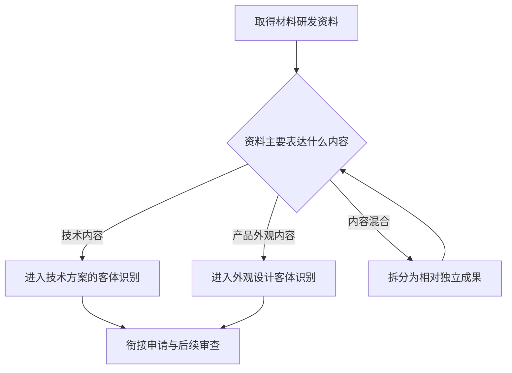

# 专家 A 修订稿

## teaching_content

## I — 法律问题

材料研发团队常同时拥有配方、制备方法、设备结构和产品外观资料。进入专利申请前，首要问题是：这些成果在中国专利制度中如何定位，适用规则应从何种规范体系查找，以及为何不能把“材料项目”直接等同于一种专利类型。

本节的明确结论是：先做保护客体识别和制度定位，再进入申请与实体审查。新颖性、创造性的具体判断不在本节预先作出结论，因为检索上下文未提供其直接规则依据。

## R — 适用规则

### 1. 专利权的制度性边界

本节点将专利制度概括为具有独占性、时间性和地域性的权利制度。独占性说明权利人可在法定范围内排除他人的相关利用；时间性说明保护具有期限；地域性说明权利效力受授予国或地区的法律边界限制。这是理解材料技术成果为何需要在目标法域依规则申请和审查的基础。

### 2. 规则来源的基本层次

中国专利制度的基础规范体系包括专利法、专利法实施细则和专利审查指南。学习审查问题时，应先确认结论属于哪一层规范：专利法提供基本制度与法定要求，实施细则补充程序和实施层面的规则，审查指南用于理解审查中的具体判断口径。本节仅建立层次意识，不在检索上下文为空的情况下补充未提供的具体条文内容。

### 3. 三种专利保护客体

《中华人民共和国专利法》第二条所涉专利保护客体包括发明、实用新型和外观设计。〔RAG: 检索上下文未提供直接依据；教学上下文 — “专利保护的三种客体：发明、实用新型、外观设计（专利法第2条）”〕

对材料领域而言，不能因为成果都服务于同一材料项目就直接归为一类。配方、制备方法、设备的技术结构和产品外观，所表达的成果内容并不相同，应先拆分资料，再按照法定客体框架作初步识别。

### 4. 制度功能与审查背景

专利制度的作用包括激励发明创造、促进技术公开、推动技术应用和经济发展。该功能解释了制度为何以公开技术信息为代价，给予具有边界的专利保护。教学上下文还指出中国制度具有早期公开延迟审查、初步审查制与实质审查制并存的特点；这些是理解后续申请与审查节点的背景，而不是本节对具体程序条件的完整说明。

## A — 规则适用

对一项材料研发成果，可按以下线性步骤处理：

1. **拆分成果单元。** 将配方、方法、设备技术结构、产品外观等资料分开；项目名称、产品名称或商业用途不能替代法律上的成果识别。
2. **识别资料表达的核心内容。** 资料若主要说明产品、方法或改进中的技术内容，进入技术方案的客体识别路径；资料若主要说明产品外观的视觉设计内容，则进入外观设计客体识别路径。
3. **以法定三类客体作初步归类。** 归类的依据是成果内容，而非研发部门、行业标签或同一项目编号。对于内容交叉的资料，应保留分别判断的可能。
4. **衔接后续制度问题。** 初步归类后，才继续查看对应申请文件、审查程序和授权条件。对材料配方或工艺是否具备新颖性、创造性，仍须在后续专门节点中依据现有技术材料和相应直接规则判断，不能由本节的客体识别直接推出。

用流程表示：



## C — 结论

本节点应建立五项基础认识：专利权具有独占性、时间性和地域性；应从专利法、实施细则和审查指南的层次寻找规则；《中华人民共和国专利法》第二条列举发明、实用新型和外观设计三类保护客体；专利制度兼具激励、公开和技术应用功能；后续程序学习需放在早期公开延迟审查以及初步审查与实质审查并存的制度背景中理解。〔RAG: 检索上下文未提供直接依据；教学上下文 — 当前节点五项知识点〕

对于材料领域申请，先按成果内容完成客体初步识别，是后续学习新颖性和创造性审查规则的前提，而不是对“三性”作出任何预断。

> 常见误区 / 易混淆点
>
> 1. **把同一研发项目等同于同一保护客体。** 同一项目可同时包含技术方案、设备技术结构和产品外观，应按资料的具体内容识别。
> 2. **把保护客体识别等同于授权结论。** 识别客体只确定制度入口，不能直接证明或否定后续授权条件。
> 3. **在没有直接依据时提前套用新颖性、创造性标准。** 本节不展开该两项具体审查规则；应在后续对应节点结合可核验材料学习。

正式题目的完整题干、选项与答案仅在本稿的互动题目字段中提供；正文不重复题目内容。本节设有测评，请到【习题】区作答。

## expert

```json
"expert_a"
```

## style

```json
"conservative"
```

## knowledge_points

```json
[
  {
    "node_id": "patent-law-foundation",
    "kc_name": "专利制度的基本概念与特征：独占性、时间性、地域性"
  },
  {
    "node_id": "patent-law-foundation",
    "kc_name": "中国专利制度体系：专利法、专利法实施细则、专利审查指南"
  },
  {
    "node_id": "patent-law-foundation",
    "kc_name": "专利保护的三种客体：发明、实用新型、外观设计"
  },
  {
    "node_id": "patent-law-foundation",
    "kc_name": "专利制度的作用：激励发明创造、促进技术公开、推动技术应用和经济发展"
  },
  {
    "node_id": "patent-law-foundation",
    "kc_name": "中国专利制度发展历程与特点：早期公开延迟审查、初步审查制与实质审查制并存"
  }
]
```

## legal_basis

```json
[
  {
    "article": "《中华人民共和国专利法》第二条：专利保护客体包括发明、实用新型和外观设计",
    "source": "教学上下文：当前节点知识点明确标注“专利法第2条”"
  }
]
```

## risks

```json
[
  {
    "risk": "检索上下文为空；除教学上下文明确提供的《中华人民共和国专利法》第二条及制度性知识点外，未对其他条文内容、具体审查标准或案例作出法条性主张。",
    "related_node_id": "patent-law-foundation"
  },
  {
    "risk": "学习者关注新颖性，但该内容不属于本节唯一主节点；检索上下文未提供直接依据，故未展开其具体判断规则。",
    "related_node_id": "novelty"
  },
  {
    "risk": "学习者关注创造性，但该内容不属于本节唯一主节点；检索上下文未提供直接依据，故未展开其具体判断规则。",
    "related_node_id": "inventive-step"
  }
]
```

## draft_stage

```json
"debate"
```

## irac

```json
{
  "issue": "材料研发成果在进入专利申请和后续审查前，如何依据中国专利制度的基础框架识别保护客体、规则来源与程序定位？",
  "rule": "教学上下文明确：专利制度具有独占性、时间性和地域性；中国专利制度体系包括专利法、专利法实施细则和专利审查指南；《中华人民共和国专利法》第二条列举发明、实用新型和外观设计三种专利保护客体。检索上下文未提供新颖性、创造性具体判定规则的直接依据。",
  "application": "对材料研发成果，应先把配方、制备方法、设备技术结构和设备外观等资料按具体内容拆分，再以三种法定保护客体为框架进行初步识别。客体识别完成后，才进入申请文件和审查程序等后续问题；本节不以基础分类替代新颖性、创造性等实体结论。",
  "conclusion": "材料领域专利申请的学习应先掌握专利制度的权利特征、规范体系、三种保护客体、制度功能和审查制度背景。对用户重点关注的新颖性和创造性，本节仅完成制度定位，不在缺乏直接检索依据的情况下展开具体判断规则。"
}
```

## interactive_questions

```json
[
  {
    "qid": "q-foundation-review-l1",
    "category": "remember",
    "difficulty": "L1",
    "source_tag": "backward_review",
    "kc_node_id": "patent-law-foundation",
    "question": "依据本节所用《中华人民共和国专利法》第二条，专利保护客体包括哪一组？",
    "answer": "B",
    "options": [
      "A. 发现、技术秘密、商标",
      "B. 发明、实用新型、外观设计",
      "C. 发明、著作权、商业秘密",
      "D. 实用新型、集成电路布图设计、商标"
    ]
  },
  {
    "qid": "q-application-probe-l1",
    "category": "remember",
    "difficulty": "L1",
    "source_tag": "forward_probe",
    "kc_node_id": "patent-application-process",
    "question": "根据下一节点的教学上下文，专利申请文件通常包括下列哪一组内容？",
    "answer": "C",
    "options": [
      "A. 仅请求书和产品样品",
      "B. 仅说明书和检索报告",
      "C. 请求书、说明书及其摘要、权利要求书等",
      "D. 仅权利要求书和授权决定书"
    ]
  },
  {
    "qid": "q-foundation-weakness-l3",
    "category": "analyze",
    "difficulty": "L3",
    "source_tag": "weakness_probe",
    "kc_node_id": "patent-law-foundation",
    "question": "某材料项目同时形成涂层配方、涂布设备内部结构图和设备外壳造型图。下列关于专利制度基础识别的说法，哪项正确？",
    "answer": "D",
    "options": [
      "A. 同一材料研发项目只能对应一种专利保护客体。",
      "B. 只要成果属于材料领域，就当然属于外观设计。",
      "C. 客体识别完成后，即可直接认定该成果具备新颖性和创造性。",
      "D. 对同时含配方、设备技术结构和设备外观资料的项目，应先按具体成果内容拆分，再分别进行客体初步识别。"
    ]
  }
]
```

## block_plan

```json
{
  "node": "patent-law-foundation",
  "learner_id": null,
  "blocks": [
    {
      "block_id": "anchor-foundation",
      "block_type": "anchor_scenario",
      "title": "材料研发成果的专利制度入口",
      "payload": {
        "scenario": "某材料研发团队开发了三项成果：一种耐高温涂层配方、一种用于批量制备该涂层的设备结构，以及该设备的外观方案。团队准备在中国申请专利，但成员把三项成果都称为“材料专利”，并认为只要技术先进就可以用同一种方式保护。\n\n代理人首先需要解决的不是新颖性或创造性结论，而是识别每项成果属于何种专利保护客体，以及后续审查制度将依据哪些规范文件展开。只有先建立这一制度地图，才能在后续材料技术检索中正确进入新颖性和创造性判断。",
        "why_anchor": "该情境锚定专利保护客体、制度规范层级和审查路径的基础框架。",
        "think_prompt": "面对配方、设备结构和设备外观三项成果，应先按什么标准区分其可能对应的专利类型？"
      },
      "chosen_by": "[A]",
      "trigger": "perception=sensing(0.82) / cold_start",
      "rationale": "以材料研发中的配方、结构与外观成果建立保护客体识别的具体入口。",
      "adapts_to": [
        "感知型学习偏好",
        "冷启动"
      ],
      "source": "教学上下文：专利法律制度基础"
    },
    {
      "block_id": "legal-foundation",
      "block_type": "legal_anchor",
      "title": "保护客体的法条锚点",
      "payload": {
        "articles": [
          {
            "article": "《中华人民共和国专利法》第二条",
            "source": "教学上下文：专利法律制度基础知识点"
          }
        ],
        "plain_summary": [
          "专利法将保护客体区分为发明、实用新型和外观设计；材料研发成果进入专利审查前，应先识别其技术内容或外观设计内容对应的客体。"
        ],
        "why_it_matters": "材料领域的配方、制备方法、设备结构和产品外观可能落入不同保护客体。正确识别客体是理解后续申请、审查及新颖性、创造性判断适用对象的前提。"
      },
      "chosen_by": "[A]",
      "trigger": "mandatory",
      "rationale": "以教学上下文明确提供的第二条作为本节点可核验的法条锚点。",
      "adapts_to": [
        "法条优先",
        "低置信度知识状态"
      ],
      "source": "教学上下文：专利法第2条"
    },
    {
      "block_id": "example-foundation",
      "block_type": "worked_example",
      "title": "材料成果的客体识别演示",
      "payload": {
        "problem": "某团队形成三份研发资料：耐高温涂层配方及制备工艺、实现该工艺的涂布设备内部结构图、设备外壳的视觉造型图。团队拟以“一项材料专利”统一处理。应如何先完成专利制度基础层面的客体识别？",
        "applicable_rule": "《中华人民共和国专利法》第二条；教学上下文明确列举发明、实用新型、外观设计三种专利保护客体。",
        "steps": [
          {
            "reasoning": "先将每份资料按其表达的成果内容拆分：配方和工艺指向技术方案，内部结构图指向产品的技术结构，外壳造型图指向产品外观。不能因成果均服务于材料生产而省略拆分。",
            "summary": "先按成果内容拆分，不按项目名称归类。"
          },
          {
            "reasoning": "教学上下文列明专利保护客体包括发明、实用新型和外观设计。对配方、方法及具有技术结构的设备，应从技术方案所对应的客体进行识别；对视觉造型资料，则从外观设计客体进行识别。",
            "summary": "以法定三类客体作为分类框架。"
          },
          {
            "reasoning": "客体识别仅解决“进入何种专利制度轨道”的初步问题，不能替代后续申请文件、审查程序及授权条件的判断。",
            "summary": "客体分类不等于已经获得授权。"
          }
        ],
        "conclusion": "耐高温涂层配方及其制备方法应优先从发明客体方向识别；设备的技术结构与设备的外观方案不能当然视为同一保护客体，需分别按照其技术内容或外观设计内容进一步判断。",
        "takeaway": "材料专利实务的第一步是把研发成果拆成可分别识别的保护客体，再进入后续审查判断。"
      },
      "chosen_by": "[A]",
      "trigger": "cold_start(low_confidence)",
      "rationale": "通过材料配方、设备结构和外观资料演示客体识别的完整推理链。",
      "adapts_to": [
        "冷启动",
        "应用层能力"
      ],
      "source": "教学上下文：专利法第2条及三种保护客体"
    },
    {
      "block_id": "flow-foundation",
      "block_type": "decision_flow",
      "title": "材料成果进入专利制度的判断流程",
      "payload": {
        "question": "面对一项材料研发成果，如何完成专利制度基础层面的初步识别？",
        "steps": [
          {
            "condition": "成果资料主要描述产品、方法或其改进所涉及的技术内容",
            "outcome": "进入技术方案的客体识别路径，并根据成果具体性质进一步区分。"
          },
          {
            "condition": "成果资料主要描述产品外观的视觉设计内容",
            "outcome": "进入外观设计客体识别路径。"
          },
          {
            "condition": "资料同时混合配方、结构、工艺或外观内容",
            "outcome": "先拆分为相对独立的成果单元，分别识别，避免以一个项目名称替代法律分类。"
          },
          {
            "condition": "已完成客体初步识别",
            "outcome": "再衔接申请文件、审查程序和后续授权条件的分析；本节不预先作出新颖性或创造性结论。"
          }
        ],
        "end_states": [
          "形成发明、实用新型或外观设计方向的初步识别",
          "材料尚不足以完成客体识别，需先补充技术或外观事实",
          "完成基础识别后进入对应的申请与审查阶段"
        ]
      },
      "chosen_by": "[A]",
      "trigger": "input=visual(0.79)",
      "rationale": "将保护客体识别、成果拆分和后续程序衔接转化为可视化步骤。",
      "adapts_to": [
        "视觉型输入偏好"
      ],
      "source": "教学上下文：专利法律制度基础"
    },
    {
      "block_id": "reflect-foundation",
      "block_type": "reflect_prompt",
      "title": "从研发资料回看制度分类",
      "payload": {
        "question": "回看一项你熟悉的材料研发项目：其中哪些资料是在说明技术方案，哪些资料是在呈现产品外观，哪些资料不足以单独完成专利客体识别？",
        "what_to_notice": [
          "项目名称或商业名称不能替代对成果内容的法律识别。",
          "同一研发项目可能包含多个应分别识别的成果单元。",
          "客体识别是后续申请、审查与授权条件分析的起点，而非授权结论。"
        ],
        "connect": "连接到学习者已有的材料研发经验：实验记录、工艺路线、设备图纸和产品设计资料通常具有不同的技术与法律表达功能。"
      },
      "chosen_by": "[A]",
      "trigger": "processing=reflective(0.63)",
      "rationale": "引导学习者把制度分类框架映射到已有研发资料。",
      "adapts_to": [
        "反思型加工偏好"
      ],
      "source": "教学上下文：专利法律制度基础"
    },
    {
      "block_id": "assessment-foundation",
      "block_type": "assessment",
      "title": "本节三类测评",
      "payload": {
        "coverage": {
          "backward_review": true,
          "forward_probe": true,
          "weakness_probe": true
        },
        "items": [
          {
            "qid": "q-foundation-review-l1",
            "summary": "复习专利法第二条列举的三类保护客体。"
          },
          {
            "qid": "q-application-probe-l1",
            "summary": "探测下一节点中申请文件的基础构成。"
          },
          {
            "qid": "q-foundation-weakness-l3",
            "summary": "辨析同一材料项目中技术内容与外观内容的分类边界。"
          }
        ],
        "body_guide": "本节设有测评，请到【习题】区作答。"
      },
      "chosen_by": "[A]",
      "trigger": "mandatory",
      "rationale": "严格覆盖向后复习、向前探测和本节点边界辨析；正式题目的完整题干、选项和答案仅保留在互动题目字段中。",
      "adapts_to": [
        "三类测评闭环"
      ],
      "source": "教学上下文：question_scope"
    },
    {
      "block_id": "synthesis-foundation",
      "block_type": "knowledge_synthesis",
      "title": "专利法律制度基础框架",
      "payload": {
        "framework": [
          "专利制度基本特征：专利权具有独占性、时间性和地域性；这三项特征用于理解权利保护的基本边界。",
          "中国专利制度规范体系：以专利法、专利法实施细则和专利审查指南构成理解规则来源的基本层次。",
          "三种保护客体：发明、实用新型和外观设计是教学上下文明确列举的法定分类，材料成果需先作客体识别。",
          "专利制度功能：制度通过激励发明创造、促进技术公开、推动技术应用和经济发展，连接研发投入与技术传播。",
          "审查制度特点：教学上下文指出早期公开延迟审查，以及初步审查制与实质审查制并存；二者是后续程序学习的制度背景。"
        ],
        "must_know": [
          "《中华人民共和国专利法》第二条所列三种保护客体为发明、实用新型和外观设计。",
          "材料研发项目不能因属于同一项目而当然只对应一种保护客体，应依据具体成果内容作初步识别。",
          "本节只建立制度基础；新颖性和创造性的具体判定规则须在后续对应节点基于直接依据学习。"
        ],
        "key_relations": [
          "先识别成果是否及如何落入三种保护客体，再衔接对应申请文件与审查程序。",
          "专利法、实施细则和审查指南共同构成理解审查规则的规范入口，但本节仅建立体系定位。",
          "独占性、时间性和地域性解释权利边界；制度功能解释为何以公开换取有限期间保护。"
        ]
      },
      "chosen_by": "[A]",
      "trigger": "mandatory",
      "rationale": "逐条覆盖当前节点注入的五项知识点，并明确与后续审查学习的关系。",
      "adapts_to": [
        "全局理解偏好",
        "视觉型输入偏好"
      ],
      "source": "教学上下文：当前节点知识点"
    },
    {
      "block_id": "summary-foundation",
      "block_type": "summary_card",
      "title": "专利制度基础速查卡",
      "payload": {
        "cards": [
          {
            "concept": "独占性、时间性、地域性",
            "one_liner": "专利权的基本特征说明其保护不是无限、永久或全球自动生效。"
          },
          {
            "concept": "规范体系",
            "one_liner": "专利法、专利法实施细则和专利审查指南共同构成理解中国专利审查规则的制度入口。"
          },
          {
            "concept": "三种保护客体",
            "one_liner": "发明、实用新型和外观设计是专利法第二条明确列举的三类客体。"
          },
          {
            "concept": "制度功能",
            "one_liner": "专利制度以有限保护与技术公开相结合，服务于激励创新和促进技术应用。"
          },
          {
            "concept": "审查制度背景",
            "one_liner": "早期公开延迟审查及初步审查与实质审查并存，是理解后续程序节点的背景。"
          }
        ],
        "must_recite": [
          "《中华人民共和国专利法》第二条列举的三种保护客体：发明、实用新型、外观设计。",
          "材料项目应按具体成果内容进行客体识别，不能仅按项目名称归类。",
          "本节建立制度地图，不替代后续关于新颖性和创造性的具体审查判断。"
        ],
        "one_line": "先识别保护客体和规则体系，再进入材料技术方案的申请、审查与授权条件分析。"
      },
      "chosen_by": "[A]",
      "trigger": "len(knowledge_sub_nodes)=3>=3",
      "rationale": "以五张速查卡收束本节点的全部注入知识点。",
      "adapts_to": [
        "知识点较多",
        "复盘记忆"
      ],
      "source": "教学上下文：当前节点知识点"
    }
  ],
  "order": [
    "anchor-foundation",
    "legal-foundation",
    "example-foundation",
    "flow-foundation",
    "reflect-foundation",
    "assessment-foundation",
    "synthesis-foundation",
    "summary-foundation"
  ],
  "budget": {
    "adaptive_used": 5,
    "adaptive_max": 5,
    "total": 8,
    "total_max": 8
  },
  "debate_resolved": false
}
```

## knowledge_synthesis

```json
{
  "node": "patent-law-foundation",
  "coverage": [
    {
      "node_id": "patent-law-foundation"
    },
    {
      "node_id": "patent-law-foundation"
    },
    {
      "node_id": "patent-law-foundation"
    },
    {
      "node_id": "patent-law-foundation"
    },
    {
      "node_id": "patent-law-foundation"
    }
  ],
  "confusable_pairs": [
    {
      "pair": "同一研发项目与同一专利保护客体：同一项目可包含配方、技术结构和外观资料，不能仅按项目名称归类。"
    },
    {
      "pair": "保护客体识别与授权条件判断：前者解决制度分类入口，后者涉及后续实体审查，不能相互替代。"
    },
    {
      "pair": "初步审查与实质审查：二者均为制度背景中的审查机制，具体适用范围和程序规则需在后续节点基于直接依据学习。"
    }
  ]
}
```
