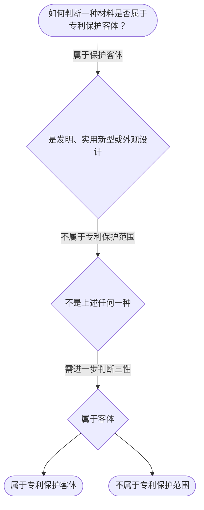

# 专家 B 教学草稿

> 专家：expert_b ｜ 风格：accessible

## 教学模块选择清单

- 当前教学节点：`patent-law-foundation`
- 板块预算：自适应 0/0，总计 8/8

| # | 模块 (block_type) | 类型 | 触发原因 (trigger) | 对应正文段 | 归属 |
|---:|---|:--:|---|---|:--:|
| 1 | `anchor_scenario` | 自适应 | perception=sensing(0.82) / cold_start | 场景导入｜在材料科学领域，一家科研团队研发出了一种新型高强度复合材料，可用于电池电极。他们计划申请专利… | [B] |
| 2 | `legal_anchor` | 必选 | mandatory | 法条锚定｜《专利法》第二条 | [B] |
| 3 | `worked_example` | 自适应 | cold_start(low_confidence) | 案例演示｜某材料公司2024年1月1日提交新型绝缘材料专利申请，但2023年12月在国内技术会议上展示… | [B] |
| 4 | `decision_flow` | 自适应 | input=visual(0.79) | 决策流程｜如何判断一种材料是否属于专利保护客体？ | [B] |
| 5 | `reflect_prompt` | 自适应 | processing=reflective(0.63) | 反思提示｜在材料研发过程中，如果发现一种新材料有潜在应用，如何规划专利申请时间？ | [B] |
| 6 | `assessment` | 必选 | mandatory | 测评闭环｜专利保护对象 | [B] |
| 7 | `knowledge_synthesis` | 必选 | mandatory | 知识综合｜专利客体：发明、实用新型和外观设计 | [B] |
| 8 | `summary_card` | 自适应 | len(knowledge_sub_nodes)=3>=3 | 速查卡｜先过保护客体之门，再过三性安检。 | [B] |

## 教学正文

## 1. 场景导入
在材料科学领域，一家科研团队研发出了一种新型高强度复合材料，可用于电池电极。他们计划申请专利，但担心在国际材料大会上展示后是否影响新颖性。这既有‘能不能申请’（保护客体），也有‘公开展示是否致命’（新颖性宽限期）两个真实问题。

## 2. 人话解释
专利制度的基本概念包括独占性（独家权利）、时间性（有限期限）和地域性（特定国家）。专利保护的对象有三种：发明、实用新型和外观设计。中国专利制度体系包括专利法、实施细则和审查指南。专利制度的作用是激励发明创造、促进技术公开、推动技术应用和经济发展。中国专利制度的发展特点是早期公开延迟审查、初步审查与实质审查并存。

## 3. 法条回扣
专利法第二条规定本法所称的专利，包括发明专利、实用新型专利和外观设计专利。专利法第五条规定专利制度的基本特征是独占性、时间性和地域性。专利法第一条规定为了保护发明创造，促进技术的公开，保障专利实施，鼓励和促进技术创新，适应社会主义现代化建设的需要，制定本法。

## 4. 类比 / 口诀
专利保护像给发明者一张‘通行证’：独占一定时间和特定国家，但有期限。口诀：‘三客体、三性、三大特征’。适用边界：仅适用于技术领域发明，不适用于商业方法或抽象思想等非技术领域。

## 5. 应试提示
题干关键词：专利客体、独占性、地域性。三性判断步骤：先看是否属于保护客体，再看是否新颖、再看是否创造性。常见陷阱：混淆实用新型和发明，或忽略地域性特征。

## 6. 互动提问
请思考：上述新型复合材料，是否属于可以申请专利的客体？它有哪些核心特征？

### 场景导入（anchor_scenario）

> 在材料科学领域，一家科研团队研发出了一种新型高强度复合材料，可用于电池电极。他们计划申请专利，但担心在国际材料大会上展示后是否影响新颖性。这既有‘能不能申请’（保护客体），也有‘公开展示是否致命’（新颖性宽限期）两个真实问题。

**锚定**：用同一技术事实同时引出‘保护客体’与‘授权三性’两个抽象模块。

**先想一想**：如果你是专利代理人，看到‘展会展示’这个动作，第一反应是风险还是安全？为什么？

### 法条锚定（legal_anchor）

- **《专利法》第二条**：本法所称的专利，包括发明专利、实用新型专利和外观设计专利。
- **《专利法》第五条**：专利制度的基本特征是独占性、时间性和地域性。
- **《专利法》第一条**：本法为了保护发明创造，促进技术的公开，保障专利实施，鼓励和促进技术创新。

**为何重要**：这些是专利基础知识的核心，必须先掌握以理解后续授权规则。学员必须知道三客体和三大特征是整个专利制度的起点。

### 案例演示（worked_example）

**案情/例题**：某材料公司2024年1月1日提交新型绝缘材料专利申请，但2023年12月在国内技术会议上展示了类似材料。问：该公开是否影响新颖性？
**适用规则**：《专利法》第二十二条（新颖性）
**分步推演**：
1. 公开日在申请日前，属公开行为。 → *符合公开条件*
2. 属于技术会议，不属于宽限期适用情形。 → *不在宽限期内*
3. 因此构成现有技术，破坏新颖性。 → *判定为不新颖*
**结论**：该公开破坏了新颖性。
**本题要点**：公开行为即使是会议展示也可能影响新颖性，需注意时间和类型。

### 决策流程（decision_flow）

**决策问题**：如何判断一种材料是否属于专利保护客体？



### 反思提示（reflect_prompt）

**反思问题**：在材料研发过程中，如果发现一种新材料有潜在应用，如何规划专利申请时间？

**关注要点**：公开行为的时间点；专利客体的范围；三性判断的关键

**连接**：连接到专利申请程序和实质审查

### 知识综合（knowledge_synthesis）

**知识框架**：
- 专利客体：发明、实用新型和外观设计
- 制度特征：独占性、时间性和地域性
- 制度作用与特点：激励发明、促进公开、早期公开延迟审查
**概念关系**：客体决定是否可申请，再看三性；三大特征是专利制度的核心
**必记**：三客体并存但需分别判断；三大特征贯穿专利制度始终

### 速查卡（summary_card）

**要点卡**：
- **专利客体**：发明、实用新型和外观设计
- **专利特征**：独占性、时间性和地域性
- **制度作用**：激励创新、促进公开、推动经济发展
**必背**：三客体；三大特征
**一句话总结**：先过保护客体之门，再过三性安检。

### 测评闭环（assessment）

**三类覆盖**：backward_review、forward_probe、weakness_probe
**题目**：
- br1：专利保护对象
- fp1：专利申请程序探测
- wp1：新颖性与创造性区别
- br2：专利制度的作用


## 结构化字段

## knowledge_points

```json
[
  {
    "node_id": "patent-law-foundation",
    "kc_name": "专利制度的基本概念与特征：独占性、时间性、地域性（详见子节点 patent-rights-nature）"
  },
  {
    "node_id": "patent-law-foundation",
    "kc_name": "中国专利制度体系：专利法、专利法实施细则、专利审查指南（详见子节点 patent-law-framework）"
  },
  {
    "node_id": "patent-law-foundation",
    "kc_name": "专利制度的作用：激励发明创造、促进技术公开、推动技术应用和经济发展（详见子节点 patent-system-overview）"
  },
  {
    "node_id": "patent-law-foundation",
    "kc_name": "中国专利制度发展历程与特点：早期公开延迟审查、初步审查制与实质审查制并存（详见子节点 patent-system-overview）"
  },
  {
    "node_id": "patent-law-foundation",
    "kc_name": "专利保护的三种客体：发明、实用新型、外观设计（专利法第2条）"
  }
]
```

## legal_basis

```json
[
  {
    "article": "《专利法》第二条",
    "source": "《中华人民共和国专利法》第二条"
  },
  {
    "article": "《专利法》第五条",
    "source": "《中华人民共和国专利法》第五条"
  },
  {
    "article": "《专利法》第一条",
    "source": "《中华人民共和国专利法》第一条"
  }
]
```

## risks

```json
[
  {
    "risk": "混淆专利保护客体与授权三性",
    "related_node_id": "patent-law-foundation"
  },
  {
    "risk": "忽略独占性、地域性特征",
    "related_node_id": "patent-rights-nature"
  },
  {
    "risk": "混淆新颖性与创造性判定标准",
    "related_node_id": "patent-law-foundation"
  }
]
```

## draft_stage

```json
"debate"
```

## interactive_questions

```json
[
  {
    "qid": "br1",
    "category": "remember",
    "difficulty": "L1",
    "source_tag": "backward_review",
    "kc_node_id": "patent-law-foundation",
    "question": "专利法第二条规定的专利保护对象包括",
    "answer": "D",
    "options": [
      "A. 发明专利",
      "B. 实用新型专利",
      "C. 外观设计专利",
      "D. 以上三种"
    ]
  },
  {
    "qid": "fp1",
    "category": "understand",
    "difficulty": "L1",
    "source_tag": "forward_probe",
    "kc_node_id": "patent-application-process",
    "question": "专利申请程序中，申请日如何确定",
    "answer": "B",
    "options": [
      "A. 提交文件之日",
      "B. 收到专利申请文件之日",
      "C. 邮寄的以寄出邮戳日",
      "D. 以上均可"
    ]
  },
  {
    "qid": "wp1",
    "category": "analyze",
    "difficulty": "L3",
    "source_tag": "weakness_probe",
    "kc_node_id": "patent-law-foundation",
    "question": "新颖性和创造性的主要区别是",
    "answer": "A",
    "options": [
      "A. 新颖性要求未公开，创造性要求非显而易见",
      "B. 两者都是看是否显而易见",
      "C. 新颖性看是否有相同专利，创造性看是否有类似",
      "D. 两者都看技术人员是否知道"
    ]
  },
  {
    "qid": "br2",
    "category": "remember",
    "difficulty": "L1",
    "source_tag": "backward_review",
    "kc_node_id": "patent-law-foundation",
    "question": "专利制度的作用不包括",
    "answer": "C",
    "options": [
      "A. 激励发明创造",
      "B. 促进技术公开",
      "C. 限制技术应用",
      "D. 推动技术应用和经济发展"
    ]
  }
]
```

## knowledge_synthesis

```json
{
  "node": "patent-law-foundation",
  "coverage": [
    {
      "node_id": "patent-rights-nature"
    },
    {
      "node_id": "patent-law-framework"
    },
    {
      "node_id": "patent-system-overview"
    }
  ],
  "confusable_pairs": [
    {
      "pair": "保护客体与授权三性"
    }
  ]
}
```
