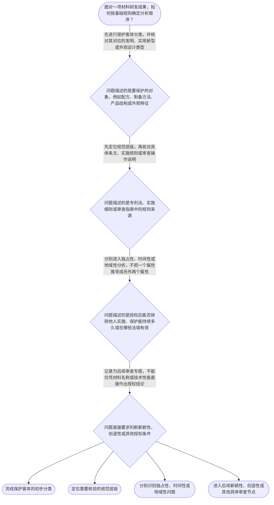

# 整合后的课程完整内容与习题

## 教学模块选择清单

- 当前教学节点：`patent-law-foundation`
- 板块预算：自适应 4/6，总计 8/9

| # | 模块 (block_type) | 类型 | 触发原因 (trigger) | 对应正文段 | 归属 |
|---:|---|:--:|---|---|:--:|
| 1 | `anchor_scenario` | 自适应 | perception=sensing(0.82) / cold_start | 从材料成果看专利权边界｜某材料研发团队制备出一种耐高温复合涂层，并同时形成了新的配方、制备工艺和特殊表面纹理。团队负… | [A+B融合] |
| 2 | `legal_anchor` | 必选 | mandatory | 专利客体的法条锚定｜《中华人民共和国专利法》第二条：本法所称的发明创造是指发明、实用新型和外观设计。发明，是指对… | [A+B融合] |
| 3 | `worked_example` | 自适应 | cold_start(low_confidence) | 材料成果的基础分类与权利边界｜某材料企业研发出一种具有新配方、特定制备工艺和特殊表面纹理的复合板材，并准备在中国提交专利申… | [A+B融合] |
| 4 | `decision_flow` | 自适应 | input=visual(0.79) | 专利基础问题判断流程｜面对一项材料研发成果，如何按基础规则确定分析顺序？ | [A+B融合] |
| 5 | `reflect_prompt` | 自适应 | processing=reflective(0.63) | 把研发事实转成法律问题｜在你熟悉的材料研发项目中，配方、工艺参数、产品结构、表面纹理和市场推广分别描述了哪些不同层面… | [A+B融合] |
| 6 | `assessment` | 必选 | mandatory | 基础概念三类测评｜识别发明、实用新型和外观设计三类专利保护客体 | [A+B融合] |
| 7 | `knowledge_synthesis` | 必选 | mandatory | 专利法律制度基础知识网｜专利制度基本概念与特征：独占性回答能否在法定范围内排除他人，时间性回答权利持续多久，地域性回… | [A+B融合] |
| 8 | `summary_card` | 自适应 | len(knowledge_sub_nodes)=3>=3 | 基础概念速查卡｜先分清保护什么，再分清权利在哪些法域、持续多久，最后进入具体审查规则。 | [A+B融合] |

## 教学正文

# 专利法律制度基础

## 一、先建立总框架

材料领域专利问题应按四层顺序理解：第一，确认要保护的对象；第二，确定适用的专利制度和规范层级；第三，理解专利权的基本属性及制度目的；第四，再进入具体申请、授权和审查规则。新颖性和创造性属于后续实体审查专题，本节先建立能够支撑后续判断的基础框架。

## 二、专利保护的对象

《中华人民共和国专利法》第二条明确规定：“本法所称的发明创造是指发明、实用新型和外观设计。发明，是指对产品、方法或者其改进所提出的新的技术方案。实用新型，是指对产品的形状、构造或者其结合所提出的适于实用的新的技术方案。外观设计，是指对产品的整体或者局部的形状、图案或者其结合以及色彩与形状、图案的结合所作出的富有美感并适于工业应用的新设计。”〔RAG: 中国人大网法律法规数据库 — 《中华人民共和国专利法》第二条：本法所称的发明创造是指发明、实用新型和外观设计；发明是新的技术方案；实用新型是产品的形状、构造或者其结合的新的技术方案；外观设计是产品整体或者局部的形状、图案或者其结合以及色彩与形状、图案的结合所作出的新设计〕

在材料领域，配方、材料组成、制备方法和产品结构，通常首先表现为技术方案问题；产品的整体或局部形状、图案、色彩及其结合，则需要从外观设计的角度另行分析。这里的“通常”只是识别方向，不是仅凭技术名称就能作出的最终分类。最终仍应结合申请文件所主张的具体内容以及现行法律、实施细则和审查指南判断。

要特别区分“保护客体”和“授权结论”。一项材料成果属于可能受专利制度保护的客体，并不等于它已经满足新颖性、创造性、实用性等全部授权条件，也不等于已经获得专利权。

## 三、专利权的三个基本属性

专利权的独占性、时间性和地域性分别回答三个不同问题。

独占性回答“权利人能否在法定范围内排除他人实施”。它说明专利权具有排他效力，但排他范围仍受权利要求、法律规定和授权内容限制。

时间性回答“权利能够持续多久”。专利权不是当然永久存在的权利，具体存续期间应根据专利类型和适用法律核验，不能因为技术性能突出就推导出永久保护。

地域性回答“权利在哪些法域发生效力”。在一个国家或地区获得的专利授权，原则上不能直接推出其他国家或地区自动承担相同的排他保护义务。地域性也不应被误解为技术只能在授权地使用，而是说明专利权的法律效力受相应法域和授权范围约束。

这三个属性彼此并列：独占性不是地域性，地域性也不是时间性。分析材料领域专利问题时，应分别回答“能否排除他人”“持续多久”和“在哪些法域有效”。

## 四、中国专利制度的规范体系

理解中国专利申请和审查规则时，应按规范层次查找依据：专利法提供基本制度和法律规则，专利法实施细则对实施层面的事项作进一步规定，专利审查指南则提供审查实践中的操作性说明。本轮检索上下文未提供这些文件的完整原文，因此除已明确引用的《专利法》第二条外，具体条文、期限和审查步骤不能作为已经核验的结论补写。

对材料研发人员而言，遇到具体问题时，应先定位问题属于客体、权利属性、申请程序还是授权审查，再到相应规范层次核对。不能仅凭行业惯例或技术人员的经验代替法律文本判断。

## 五、专利制度的作用与中国制度特点

专利制度通过在法定范围和期限内授予排他性权利，激励发明创造；同时以技术公开换取法律保护，促进技术应用和经济发展。制度目的有助于理解“为什么要公开技术”和“为什么保护不是无限的”，但制度目的不能直接替代对具体申请的法律审查。

用户提供的教学上下文将中国专利制度的发展特点概括为早期公开、延迟审查，以及初步审查制与实质审查制并存。〔检索上下文未提供直接依据：本轮未提供相关制度原文，以上特点依据用户提供的教学上下文，具体制度细节须核验现行规范〕这些是制度运行方式的概括，不应直接当作某一具体申请已经通过审查的结论。后续学习申请程序、新颖性和创造性时，还需分别掌握其适用对象、时间轴和证据范围。

## 六、进入后续审查专题的正确顺序

面对一项材料研发成果，先识别保护客体；再确认应当查阅的规范层级；然后区分专利权的独占性、时间性和地域性；最后才进入申请程序及新颖性、创造性等具体审查问题。

新颖性和创造性不能混为一谈：它们都是后续授权审查中的不同判断问题，具体判断标准、现有技术范围和对比方法应在相应后续节点中依据经核验的法条和审查指南学习。本节不提前作出具体新颖性或创造性结论。

本节设有测评，请到【习题】区作答。

### 从材料成果看专利权边界（anchor_scenario）

> 某材料研发团队制备出一种耐高温复合涂层，并同时形成了新的配方、制备工艺和特殊表面纹理。团队负责人认为，既然材料性能突出，就可以把全部成果归入同一种专利，而且一旦在中国获得授权，就能在任何国家永久排除他人实施。专利代理人指出，这里至少混合了保护客体、专利权属性和授权审查三个不同问题，需要先拆开判断。

**锚定**：用材料研发事实锚定保护客体分类、独占性、时间性、地域性与后续授权审查之间的边界。

**先想一想**：面对这项复合涂层成果，分析时应先识别保护对象，还是先判断能否全球永久受到保护？请先确定你的判断顺序。

### 专利客体的法条锚定（legal_anchor）

- **《中华人民共和国专利法》第二条：本法所称的发明创造是指发明、实用新型和外观设计。发明，是指对产品、方法或者其改进所提出的新的技术方案。实用新型，是指对产品的形状、构造或者其结合所提出的适于实用的新的技术方案。外观设计，是指对产品的整体或者局部的形状、图案或者其结合以及色彩与形状、图案的结合所作出的富有美感并适于工业应用的新设计。**：这一条先划定专利保护的三类客体：发明和实用新型都围绕技术方案，但关注内容不同；外观设计则关注产品整体或局部的形状、图案、色彩及其结合所形成的新设计。

**为何重要**：保护客体是进入申请和审查分析的起点。先确定保护的是技术方案还是外观特征，才能避免把材料领域名称、技术性能和专利类型混为一谈，并为后续新颖性、创造性学习建立对象基础。

### 材料成果的基础分类与权利边界（worked_example）

**案情/例题**：某材料企业研发出一种具有新配方、特定制备工艺和特殊表面纹理的复合板材，并准备在中国提交专利申请。研发人员提出三种看法：第一，所有材料成果都属于同一种专利；第二，在中国获得授权后自然可以阻止所有国家的相关制造行为；第三，授权后权利可以无限期持续。现需按照本节专利制度基础框架，区分这些看法分别涉及什么问题。
**适用规则**：《中华人民共和国专利法》第二条规定发明、实用新型和外观设计三类专利保护客体，并分别规定其基本对象；本节点同时学习专利权的独占性、时间性和地域性。本轮检索上下文未提供完整法条原文，因此不对具体授权期限、地域范围和审查程序作未经核验的条文断言。
**分步推演**：
1. 先识别申请拟保护的对象。新配方和制备工艺首先属于技术方案方向，复合板材的结构也需结合具体内容判断；特殊表面纹理可能涉及外观特征。仅凭“材料成果”这一名称不能完成专利客体分类。 → *第一步是区分保护对象，不能把所有成果归入同一种专利类型。*
2. 再把权利属性拆开。独占性涉及在法定范围内排除他人实施，地域性涉及授权国家或地区的法域边界，时间性涉及权利存续并非当然永久。三者回答不同问题。 → *第二步是分别分析独占性、地域性和时间性。*
3. 最后区分技术事实与法律结论。材料性能突出可以是技术事实，但不能单独证明已经满足全部授权条件；获得一国授权也不能自动推出其他国家的排他保护。 → *第三步是把技术效果、授权结论和权利边界分开。*
**结论**：该成果应先按拟保护内容进行客体分类，再分别检查独占性、时间性和地域性，最后依据相应规范进入申请和授权审查。三种看法分别混淆了专利客体分类、地域性以及时间性。
**本题要点**：处理材料领域专利问题时，先分清保护什么，再分清权利在哪些法域、持续多久，最后才判断具体授权条件。

### 专利基础问题判断流程（decision_flow）

**决策问题**：面对一项材料研发成果，如何按基础规则确定分析顺序？



### 把研发事实转成法律问题（reflect_prompt）

**反思问题**：在你熟悉的材料研发项目中，配方、工艺参数、产品结构、表面纹理和市场推广分别描述了哪些不同层面的信息？如果把这些信息混在一起，后续专利分析最可能在哪一步失真？

**关注要点**：保护客体分类不是对技术价值高低的评价；独占性、时间性和地域性分别回答能否排除他人、持续多久和在哪些法域有效；技术效果或制度目的不能替代具体授权条件的法律判断；涉及新颖性和创造性时还要进入后续节点核对时间轴与证据范围

**连接**：连接到材料研发中对配方、工艺、结构和外观的区分，以及研发成果从技术事实转化为申请对象的工作经验。

### 专利法律制度基础知识网（knowledge_synthesis）

**知识框架**：
- 专利制度基本概念与特征：独占性回答能否在法定范围内排除他人，时间性回答权利持续多久，地域性回答在哪些法域发生效力。
- 中国专利制度体系：专利法提供基本法律规则，专利法实施细则规定实施层面事项，专利审查指南提供审查实践中的操作性说明；具体内容须核验现行文本。
- 专利保护客体：依据《专利法》第二条，发明、实用新型和外观设计构成三类专利保护客体；材料领域分类仍需结合具体拟保护内容和现行规范判断。
- 专利制度作用：通过一定范围和期限的排他性安排激励发明创造，并以技术公开促进技术应用和经济发展。
- 中国专利制度发展特点：用户提供的教学上下文列示早期公开、延迟审查以及初步审查制与实质审查制并存；具体制度细节须以现行规范核验。
**概念关系**：先识别拟保护对象，再定位适用的专利类型和规范层级。；完成客体和制度基础识别后，再分别分析专利权的独占性、时间性和地域性。；理解制度作用有助于把握公开与保护的制度逻辑，但不能替代具体法律审查。；基础概念稳定后，再进入申请程序、新颖性、创造性及其证据和时间轴问题。
**必记**：保护客体分类、专利权基本属性和具体授权条件属于不同分析层次。；独占性、时间性和地域性必须分别判断，独占性不等于全球有效，也不等于永久持续。；专利法、专利法实施细则和专利审查指南处于不同规范层次，具体问题应定位后查找依据。；材料性能突出或制度目的合理，均不能单独推出已经满足新颖性、创造性等后续授权条件。

### 基础概念速查卡（summary_card）

**要点卡**：
- **保护客体**：先看拟保护的是技术方案还是外观特征，再核对发明、实用新型或外观设计类型。
- **专利权三种基本属性**：独占性回答能否排除他人，时间性回答持续多久，地域性回答在哪些法域有效。
- **中国专利制度体系**：专利法、实施细则和审查指南处于不同规范层次，共同支撑申请与审查规则的理解。
- **专利制度作用**：以一定范围和期限的排他性权利促进发明创造、技术公开、技术应用和经济发展。
- **后续审查入口**：新颖性和创造性是后续具体审查专题，不能由技术名称或技术性能直接推出结论。
**必背**：三类保护客体是发明、实用新型和外观设计。；独占性、时间性和地域性必须分别判断。；先识别保护对象，再定位规范层级，最后进入具体申请和授权审查。；《专利法》第二条的具体条文应以中国人大网法律法规数据库现行文本为准。
**一句话总结**：先分清保护什么，再分清权利在哪些法域、持续多久，最后进入具体审查规则。

### 基础概念三类测评（assessment）

**三类覆盖**：backward_review、forward_probe、weakness_probe
**题目**：
- q1：识别发明、实用新型和外观设计三类专利保护客体
- q2：探测专利申请日的基本确定规则
- q3：综合辨析保护客体、专利权属性与后续授权审查的先后关系


## 结构化数据

## expert

```json
"A+B融合"
```

## style

```json
"fused"
```

## knowledge_points

```json
[
  {
    "node_id": "patent-law-foundation",
    "kc_name": "专利制度的基本概念与特征：独占性、时间性、地域性"
  },
  {
    "node_id": "patent-law-foundation",
    "kc_name": "中国专利制度体系：专利法、专利法实施细则、专利审查指南"
  },
  {
    "node_id": "patent-law-foundation",
    "kc_name": "专利保护的三种客体：发明、实用新型、外观设计（专利法第2条）"
  },
  {
    "node_id": "patent-law-foundation",
    "kc_name": "专利制度的作用：激励发明创造、促进技术公开、推动技术应用和经济发展"
  },
  {
    "node_id": "patent-law-foundation",
    "kc_name": "中国专利制度发展历程与特点：早期公开延迟审查、初步审查制与实质审查制并存"
  }
]
```

## legal_basis

```json
[
  {
    "article": "《中华人民共和国专利法》第二条：本法所称的发明创造是指发明、实用新型和外观设计。发明，是指对产品、方法或者其改进所提出的新的技术方案。实用新型，是指对产品的形状、构造或者其结合所提出的适于实用的新的技术方案。外观设计，是指对产品的整体或者局部的形状、图案或者其结合以及色彩与形状、图案的结合所作出的富有美感并适于工业应用的新设计。",
    "source": "中国人大网法律法规数据库：《中华人民共和国专利法》（2020年修正），https://flk.npc.gov.cn/"
  },
  {
    "article": "《中华人民共和国专利法》第二十二条",
    "source": "本轮检索上下文未提供该条原文，具体措辞须核验现行文本"
  },
  {
    "article": "《中华人民共和国专利法》第二十三条",
    "source": "本轮检索上下文未提供该条原文，具体措辞须核验现行文本"
  },
  {
    "article": "《中华人民共和国专利法》第二十四条",
    "source": "本轮检索上下文未提供该条原文，具体措辞须核验现行文本"
  }
]
```

## risks

```json
[
  {
    "risk": "将专利权的独占性误解为全球有效或永久有效，混淆权利属性与保护范围。",
    "related_node_id": "patent-rights-nature"
  },
  {
    "risk": "仅依据“材料成果”或技术性能判断专利类型，未区分发明、实用新型和外观设计的保护对象。",
    "related_node_id": "patent-law-foundation"
  },
  {
    "risk": "混淆专利法、专利法实施细则和专利审查指南的规范层次，把未经核验的期限或审查步骤当作确定结论。",
    "related_node_id": "patent-law-framework"
  },
  {
    "risk": "把专利制度的作用或发展特点直接当作具体申请已经满足授权条件的依据。",
    "related_node_id": "patent-system-overview"
  }
]
```

## draft_stage

```json
"integration"
```

## irac

```json
{
  "issue": "材料领域研发成果进入专利制度分析时，应如何识别保护客体、理解专利权基本属性，并定位中国专利制度的规范依据？",
  "rule": "《中华人民共和国专利法》第二条规定，发明创造包括发明、实用新型和外观设计，并分别界定了三类客体的基本含义。中国专利制度还应结合专利法、专利法实施细则和专利审查指南理解；本轮检索上下文未提供其他相关法条原文，具体措辞、期限和审查细节须核验现行文本。",
  "application": "对材料研发成果，应先区分配方、组成、制备方法和产品结构等技术方案与形状、图案、色彩等外观特征，再结合申请文件和现行规范判断可能的保护客体。随后分别分析独占性、时间性和地域性，不能把技术性能、制度目的或一国授权直接等同于全球、永久或当然授权。具体新颖性、创造性及申请程序问题属于后续节点，应分别核对适用对象、时间轴和证据范围。",
  "conclusion": "本节点的稳定分析顺序是先识别保护客体，再定位规范层级并区分专利权的三个基本属性，最后进入具体申请和授权审查；《专利法》第二条为三类专利保护客体提供了法条锚点。"
}
```

## interactive_questions

```json
[
  {
    "qid": "q1",
    "category": "remember",
    "difficulty": "L1",
    "source_tag": "backward_review",
    "kc_node_id": "patent-law-foundation",
    "question": "下列哪一组完整列出了本节所依据《专利法》第二条规定的三类专利保护客体？",
    "answer": "A",
    "options": [
      "A. 发明、实用新型、外观设计",
      "B. 技术秘密、商标、外观设计",
      "C. 发明、技术秘密、集成电路布图设计",
      "D. 实用新型、商标、植物新品种"
    ]
  },
  {
    "qid": "q2",
    "category": "remember",
    "difficulty": "L1",
    "source_tag": "forward_probe",
    "kc_node_id": "patent-application-process",
    "question": "根据教学上下文对下一节点的探测，专利申请日通常如何确定？",
    "answer": "B",
    "options": [
      "A. 以审查员首次审查的日期确定",
      "B. 以收到专利申请文件之日确定，邮寄的以寄出邮戳日确定",
      "C. 以申请人完成发明之日确定",
      "D. 以专利授权公告之日确定"
    ]
  },
  {
    "qid": "q3",
    "category": "analyze",
    "difficulty": "L3",
    "source_tag": "weakness_probe",
    "kc_node_id": "patent-law-foundation",
    "question": "某公司研发出一种新配方，并在中国取得相关专利授权。下列分析最符合本节基础框架的是哪一项？",
    "answer": "D",
    "options": [
      "A. 因为材料性能突出，该专利在所有国家自动有效且永久持续",
      "B. 因为属于材料领域，所以无需区分发明、实用新型和外观设计",
      "C. 只要属于专利保护客体，就当然满足后续全部授权条件",
      "D. 应先识别其保护客体，再分别分析独占性、时间性和地域性，之后依据相应规范进入具体审查"
    ]
  }
]
```

## knowledge_synthesis

```json
{
  "node": "patent-law-foundation",
  "coverage": [
    {
      "node_id": "patent-rights-nature"
    },
    {
      "node_id": "patent-law-framework"
    },
    {
      "node_id": "patent-law-foundation"
    },
    {
      "node_id": "patent-system-overview"
    }
  ],
  "confusable_pairs": [
    {
      "pair": "保护客体分类与授权条件：前者确定拟保护对象，后者判断是否满足具体授权要求，不能相互替代。"
    },
    {
      "pair": "独占性、时间性与地域性：分别回答能否排除他人、持续多久和在哪些法域有效，不能把一项属性推导为另一项。"
    },
    {
      "pair": "制度作用与具体审查结论：制度目的解释保护和公开的逻辑，但不能替代对具体申请的法律审查。"
    }
  ]
}
```

## exercises

```json
[
  {
    "question": "下列哪一组完整列出了本节所依据《专利法》第二条规定的三类专利保护客体？",
    "answer": "A",
    "options": [
      "A. 发明、实用新型、外观设计",
      "B. 技术秘密、商标、外观设计",
      "C. 发明、技术秘密、集成电路布图设计",
      "D. 实用新型、商标、植物新品种"
    ]
  },
  {
    "question": "根据教学上下文对下一节点的探测，专利申请日通常如何确定？",
    "answer": "B",
    "options": [
      "A. 以审查员首次审查的日期确定",
      "B. 以收到专利申请文件之日确定，邮寄的以寄出邮戳日确定",
      "C. 以申请人完成发明之日确定",
      "D. 以专利授权公告之日确定"
    ]
  },
  {
    "question": "某公司研发出一种新配方，并在中国取得相关专利授权。下列分析最符合本节基础框架的是哪一项？",
    "answer": "D",
    "options": [
      "A. 因为材料性能突出，该专利在所有国家自动有效且永久持续",
      "B. 因为属于材料领域，所以无需区分发明、实用新型和外观设计",
      "C. 只要属于专利保护客体，就当然满足后续全部授权条件",
      "D. 应先识别其保护客体，再分别分析独占性、时间性和地域性，之后依据相应规范进入具体审查"
    ]
  }
]
```
