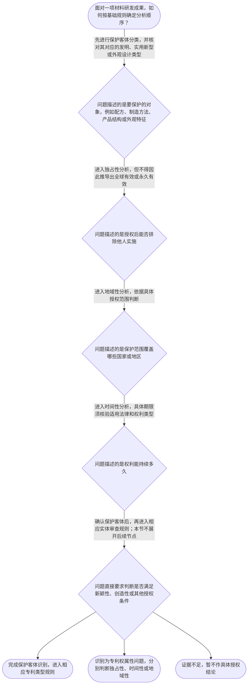

# 专家 A 教学草稿

> 专家：expert_a ｜ 风格：conservative

## 教学模块选择清单

- 当前教学节点：`patent-law-foundation`
- 板块预算：自适应 5/5，总计 7/7

| # | 模块 (block_type) | 类型 | 触发原因 (trigger) | 对应正文段 | 归属 |
|---:|---|:--:|---|---|:--:|
| 1 | `anchor_scenario` | 自适应 | perception=sensing(0.82) / cold_start | 从材料成果看专利权边界｜某材料研发团队制备出一种耐高温复合涂层。团队负责人认为，只要材料性能突出，就可以在任何国家取… | [A] |
| 2 | `legal_anchor` | 必选 | mandatory | 专利客体的法条锚定｜《中华人民共和国专利法》第二条 | [A] |
| 3 | `worked_example` | 自适应 | cold_start(low_confidence) | 材料成果的基础分类与权利边界｜某材料企业研发出一种具有新配方和特殊表面纹理的复合板材，并准备在中国提交专利申请。研发人员提… | [A] |
| 4 | `decision_flow` | 自适应 | input=visual(0.79) | 专利基础问题判断流程｜面对一项材料研发成果，如何按基础规则确定分析顺序？ | [A] |
| 5 | `reflect_prompt` | 自适应 | processing=reflective(0.63) | 把研发事实转成法律问题｜在你熟悉的材料研发项目中，哪些信息是在描述技术方案，哪些信息是在描述产品外观或权利边界？如果… | [A] |
| 6 | `assessment` | 必选 | mandatory | 基础概念三类测评｜复习专利权地域性的基本含义 | [A] |
| 7 | `knowledge_synthesis` | 必选 | mandatory | 专利法律制度基础知识网｜专利制度基本概念与特征：专利权通常体现独占性、时间性和地域性，三个属性分别回答能否排除他人、… | [A] |
| 8 | `summary_card` | 自适应 | len(knowledge_sub_nodes)=3>=3 | 基础概念速查卡｜先分清保护什么，再分清权利在哪些范围、持续多久，最后进入具体审查规则。 | [A] |

## 教学正文

## I — 法律问题

材料领域的一项研发成果进入专利制度分析时，首先要回答两个基础问题：第一，申请人试图保护的对象属于哪一种专利客体；第二，专利权取得后，其排他效力受到哪些基本边界限制。本节先建立制度基础，不提前展开新颖性、创造性或申请程序的具体判断。

## R — 适用规则

用户提供的教学上下文明确列示，《中华人民共和国专利法》第二条涉及发明、实用新型和外观设计三类专利保护客体。由于本轮检索上下文未提供该条法条原文，具体文字表述和适用边界应以核验后的现行法文本为准。

专利制度的基本特征可拆分为三个并列维度：独占性，说明专利权人在法定范围内具有排除他人实施的权能；时间性，说明权利存续并非当然永久；地域性，说明保护效力原则上与授权国家或地区的法域范围相联系。上述三项是制度基础中的分析框架，不应相互替代。

中国专利制度的规范材料包括专利法、专利法实施细则和专利审查指南。它们分别提供法律原则、实施规则和审查操作层面的依据。本轮检索上下文为空，因此不能把未检索到的具体条文号、期限或审查步骤写成已核验结论。

## A — 规则适用

对材料领域成果，不能仅凭“材料”这一技术领域完成专利分类。配方、制造方法和产品结构通常首先表现为技术方案问题；产品的形状、图案或色彩等外观特征则属于另一种分析方向。最终分类仍需结合申请文件和现行规范核验。

完成客体识别后，再分别询问三个问题：权利是否在法定范围内具有排他效力，这是独占性问题；权利可以存续多久，这是时间性问题；权利在哪些国家或地区发生效力，这是地域性问题。即使某项材料技术具有良好性能，也只能说明其技术事实，不能直接推出已经获得专利授权，更不能推出全球有效或永久持续。

专利制度的作用在于通过一定范围和期限的权利安排激励发明创造，同时以技术公开促进技术应用和经济发展。制度作用解释了专利制度为什么存在，但不能替代对具体申请客体和授权条件的法律审查。

## C — 结论

材料研发成果的基础分析顺序是：先识别保护客体，再分别判断独占性、时间性和地域性，最后依据经核验的现行规范进入具体申请和授权审查。三性判断、新颖性中的单独对比以及创造性的判断方法属于后续节点，本节仅建立进入这些节点所需的制度基础。

> 常见误区 / 易混淆点
>
> - 技术性能优良不等于专利当然授权。
> - 专利权具有独占性不等于全球有效，也不等于永久持续。
> - “材料领域成果”不是专利类型；必须先识别具体保护对象。
> - 本轮检索上下文为空，具体法条原文、期限和程序细节均须进一步核验。

本节设有测评，请到【习题】区作答。

### 从材料成果看专利权边界（anchor_scenario）

> 某材料研发团队制备出一种耐高温复合涂层。团队负责人认为，只要材料性能突出，就可以在任何国家取得同样的专利保护，并且一旦授权就能永久排除他人使用。代理人检查后发现，团队实际上需要先区分保护客体、专利权的地域范围和存续时间，再判断后续申请是否满足实体条件。双方因此发生争议：技术成果本身、专利权的边界以及授权条件，究竟是不是同一个问题？

**锚定**：用材料研发事实锚定保护客体、独占性、时间性和地域性之间的边界。

**先想一想**：面对这项复合涂层成果，你会先判断它属于哪类专利保护客体，还是先判断它能否永久、全球受到保护？请说明你的判断顺序。

### 专利客体的法条锚定（legal_anchor）

- **《中华人民共和国专利法》第二条**：本条用于区分发明、实用新型和外观设计三类专利保护客体；具体法条原文和适用边界应以现行法文本为准。

**为何重要**：先确定申请对象属于哪一种专利客体，才能继续讨论相应的申请与审查规则。本轮检索上下文未提供直接法条原文，因此涉及具体条文措辞的结论必须在正式使用前核验。

### 材料成果的基础分类与权利边界（worked_example）

**案情/例题**：某材料企业研发出一种具有新配方和特殊表面纹理的复合板材，并准备在中国提交专利申请。研发人员提出三种看法：第一，技术成果都属于同一种专利；第二，在中国获得授权后自然可以阻止所有国家的相关制造行为；第三，授权后权利可以无限期持续。现需按照专利制度基础，对这些看法进行分类判断。
**适用规则**：本例围绕用户提供上下文中的《专利法》第二条及专利制度基本特征展开。由于本轮检索上下文未提供完整法条原文，关于具体授权期限、地域范围和审查程序的细节不作未经核验的条文断言。
**分步推演**：
1. 先看申请所要保护的对象是技术方案还是产品外观特征。配方和制造方法属于技术方案方向，特殊表面纹理则可能涉及外观特征；仅凭“材料成果”这一名称不能完成客体分类。 → *第一步是识别保护客体，不能把所有成果归入同一专利类型。*
2. 再分别检查专利权的制度属性。独占性说明权利人在法定范围内可以排除他人实施，地域性说明保护范围受授权国家或地区边界限制，时间性说明权利并非当然永久存在。 → *独占、地域和时间是三个相互独立的权利属性。*
3. 最后区分技术事实与授权结论。材料性能优良只能作为技术事实，不能单独推出已经满足专利授权实体条件；后续仍需依适用规则审查。 → *技术效果不等于专利当然获得授权。*
**结论**：该材料成果首先需要进行专利保护客体分类；即使进入专利制度保护范围，专利权的独占性、时间性和地域性仍应分别判断，不能把技术性能直接等同于权利边界或授权结论。
**本题要点**：处理材料领域专利问题时，先分类保护客体，再分开检查权利属性，最后进入授权条件审查。

### 专利基础问题判断流程（decision_flow）

**决策问题**：面对一项材料研发成果，如何按基础规则确定分析顺序？



### 把研发事实转成法律问题（reflect_prompt）

**反思问题**：在你熟悉的材料研发项目中，哪些信息是在描述技术方案，哪些信息是在描述产品外观或权利边界？如果把它们混在一起，后续专利分析最可能在哪一步失真？

**关注要点**：保护客体是对申请对象的分类，不是对技术价值高低的评价；独占性、时间性和地域性分别回答不同问题；技术成果具有实用价值，不等于已经满足全部授权条件

**连接**：连接到研发工作中对材料配方、工艺参数、产品结构和外观效果的区分。

### 专利法律制度基础知识网（knowledge_synthesis）

**知识框架**：
- 专利制度基本概念与特征：专利权通常体现独占性、时间性和地域性，三个属性分别回答能否排除他人、持续多久以及在哪些法域有效。
- 中国专利制度体系：中国专利法、专利法实施细则和专利审查指南共同构成理解申请与审查规则的制度材料层次；本轮未提供其完整原文。
- 专利保护客体：用户上下文明确列示《专利法》第二条涉及发明、实用新型和外观设计三类客体，具体分类仍应结合权利要求和现行法文本核验。
- 专利制度作用：通过授予一定范围的权利并促成技术公开，兼顾激励发明创造、促进技术应用和经济发展。
- 中国制度发展特点：用户上下文列示早期公开、延迟审查，以及初步审查制与实质审查制并存；具体制度细节应以现行法律法规和审查指南为准。
**概念关系**：先识别保护客体，再确定适用的专利类型和审查路径。；独占性、时间性和地域性是并列的权利属性，不能相互替代。；制度作用解释为什么要保护并公开技术，制度体系则说明应到哪些规范层次寻找具体规则。；基础制度概念稳定后，才进入专利申请程序以及新颖性、创造性等后续节点。
**必记**：专利客体分类与专利权属性是两个不同层次的问题。；专利权的独占性不等于全球有效，也不等于永久持续。；发明、实用新型和外观设计是用户上下文明确列示的三类专利保护客体；具体法条原文需进一步核验。；本轮检索上下文为空，任何未由用户上下文明确提供的具体条文、期限或审查细节都不能直接当作已核验结论。

### 基础概念速查卡（summary_card）

**要点卡**：
- **专利保护客体**：先判断申请保护的是发明、实用新型还是外观设计。
- **专利权三种基本属性**：独占性回答能否排除他人，时间性回答持续多久，地域性回答在哪些法域有效。
- **中国专利制度体系**：专利法、实施细则和审查指南处于不同规范层次，共同支撑申请与审查。
- **专利制度作用**：以一定期限和范围的权利交换技术公开，服务于创新和应用。
- **证据边界**：没有检索到法条原文时，必须标明待核验，不能补写未经证实的条文细节。
**必背**：保护客体分类不等于授权结论。；独占性、时间性、地域性必须分别判断。；发明、实用新型、外观设计是本节明确列示的三类专利保护客体。；本轮检索上下文为空，具体法条原文和期限须以核验后的现行文本为准。
**一句话总结**：先分清保护什么，再分清权利在哪些范围、持续多久，最后进入具体审查规则。

### 基础概念三类测评（assessment）

**三类覆盖**：backward_review、forward_probe、weakness_probe
**题目**：
- q1：复习专利权地域性的基本含义
- q2：探测专利申请文件的基本构成
- q3：辨析专利客体分类与专利权时间、地域属性


## 结构化字段

## knowledge_points

```json
[
  {
    "node_id": "patent-law-foundation",
    "kc_name": "专利制度的基本概念与特征：独占性、时间性、地域性"
  },
  {
    "node_id": "patent-law-foundation",
    "kc_name": "中国专利制度体系：专利法、专利法实施细则、专利审查指南"
  },
  {
    "node_id": "patent-law-foundation",
    "kc_name": "专利保护的三种客体：发明、实用新型、外观设计"
  },
  {
    "node_id": "patent-law-foundation",
    "kc_name": "专利制度的作用：激励发明创造、促进技术公开、推动技术应用和经济发展"
  },
  {
    "node_id": "patent-law-foundation",
    "kc_name": "中国专利制度发展历程与特点：早期公开延迟审查、初步审查制与实质审查制并存"
  }
]
```

## legal_basis

```json
[
  {
    "article": "《中华人民共和国专利法》第二条",
    "source": "用户提供的教学上下文明确列示该条涉及发明、实用新型和外观设计三类专利保护客体；本轮检索上下文未提供原文，需核验现行文本"
  }
]
```

## risks

```json
[
  {
    "risk": "将专利权的独占性误解为全球有效或永久有效，混淆权利属性与保护范围。",
    "related_node_id": "patent-rights-nature"
  },
  {
    "risk": "仅依据“材料成果”或技术性能判断专利类型，未区分发明、实用新型和外观设计的保护对象。",
    "related_node_id": "patent-law-foundation"
  },
  {
    "risk": "本轮检索上下文为空，若直接补充具体条文、期限或审查细节，存在法条版本和内容未经核验的风险。",
    "related_node_id": "patent-law-framework"
  }
]
```

## draft_stage

```json
"debate"
```

## irac

```json
{
  "issue": "材料领域的一项研发成果进入专利制度分析时，应如何确定保护客体，并理解专利权的基本边界？",
  "rule": "用户提供的教学上下文明确列示《中华人民共和国专利法》第二条涉及发明、实用新型和外观设计三类专利保护客体；同时列示专利制度基本特征包括独占性、时间性和地域性。具体法条原文未在本轮检索上下文中提供，相关措辞和适用细节须核验现行法文本。",
  "application": "本节仅处理专利制度基础。对材料研发成果，应先区分配方、工艺、结构等技术方案与外观特征，再判断其可能对应的专利保护客体；随后分别分析独占性、时间性和地域性。技术性能优良只能说明研发事实，不能单独推出专利当然授权、全球有效或永久持续。由于检索上下文为空，未对具体审查期限、程序细节和三性判断标准作超出用户上下文的条文断言。",
  "conclusion": "专利制度基础分析的正确顺序是先识别保护客体，再区分专利权的独占性、时间性和地域性，最后依据经核验的现行规范进入具体申请和授权审查。"
}
```

## interactive_questions

```json
[
  {
    "qid": "q1",
    "category": "remember",
    "difficulty": "L1",
    "source_tag": "backward_review",
    "kc_node_id": "patent-law-foundation",
    "question": "关于专利权地域性的下列说法，哪一项正确？",
    "answer": "B",
    "options": [
      "A. 在任何国家自动产生同样的专利权",
      "B. 通常以授权国家或地区的法域范围为边界",
      "C. 一经授权就在全球永久有效",
      "D. 只要技术先进就不受地域限制"
    ]
  },
  {
    "qid": "q2",
    "category": "remember",
    "difficulty": "L1",
    "source_tag": "forward_probe",
    "kc_node_id": "patent-application-process",
    "question": "下列哪一项属于专利申请文件的基本构成描述？",
    "answer": "C",
    "options": [
      "A. 仅提交产品宣传册即可",
      "B. 仅提交实验原始记录即可",
      "C. 通常包括请求书、说明书及其摘要、权利要求书等文件",
      "D. 只需提交发明人的口头说明"
    ]
  },
  {
    "qid": "q3",
    "category": "analyze",
    "difficulty": "L3",
    "source_tag": "weakness_probe",
    "kc_node_id": "patent-law-foundation",
    "question": "甲公司在中国获得一项材料领域发明专利授权。下列判断中，最符合专利制度基础特征的是哪一项？",
    "answer": "D",
    "options": [
      "A. 技术性能优良，所以专利权必然全球有效且永久持续",
      "B. 只要属于材料领域，就不需要区分发明、实用新型和外观设计",
      "C. 获得一国专利授权后，其他国家自动承担相同的排他保护义务",
      "D. 应先识别保护客体，再分别判断专利权的独占性、时间性和地域性"
    ]
  }
]
```

## knowledge_synthesis

```json
{
  "node": "patent-law-foundation",
  "coverage": [
    {
      "node_id": "patent-rights-nature"
    },
    {
      "node_id": "patent-law-framework"
    },
    {
      "node_id": "patent-law-foundation"
    },
    {
      "node_id": "patent-system-overview"
    }
  ],
  "confusable_pairs": []
}
```

## exercises

```json
[
  {
    "question": null,
    "answer": null,
    "options": null
  }
]
```
