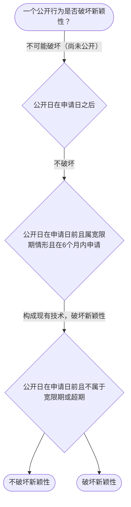

# 专家 B 教学草稿

> 专家：expert_b ｜ 风格：accessible

## 教学模块选择清单

- 当前教学节点：`patent-law-foundation`
- 板块预算：自适应 0/4，总计 8/8

| # | 模块 (block_type) | 类型 | 触发原因 (trigger) | 对应正文段 | 归属 |
|---:|---|:--:|---|---|:--:|
| 1 | `anchor_scenario` | 自适应 | perception=sensing(0.82) / cold_start | 场景导入｜某材料研发团队设计了一种新型高强度复合材料，他们在实验室完成样品后计划申请专利，但担心公开技… | [B] |
| 2 | `legal_anchor` | 必选 | mandatory | 法条锚定｜《专利法》第二条 | [B] |
| 3 | `worked_example` | 自适应 | cold_start(low_confidence) | 案例演示｜甲材料公司2024年3月15日在政府主办国际展会展出新型复合材料样品，2024年9月20日提… | [B] |
| 4 | `decision_flow` | 自适应 | input=visual(0.79) | 决策流程图｜一个公开行为是否破坏新颖性？ | [B] |
| 5 | `reflect_prompt` | 自适应 | processing=reflective(0.63) | 反思提示｜如果客户同时做了展会展示和论文发表，你会怎么排时间表？ | [B] |
| 6 | `assessment` | 必选 | mandatory | 测评｜保护客体范围 | [B] |
| 7 | `knowledge_synthesis` | 必选 | mandatory | 知识综合｜保护客体：发明、实用新型、外观设计（专利法第2条） | [B] |
| 8 | `summary_card` | 自适应 | len(knowledge_sub_nodes)=3>=3 | 速查卡｜先过保护客体之门，再过三性安检。 | [B] |

## 教学正文

## 1. 场景导入
某材料研发团队设计了一种新型高强度复合材料，他们在实验室完成样品后计划申请专利，但担心公开技术细节后是否会影响新颖性或创造性判断。试想：如果他们在申请前发表论文或在展会展示该材料，会不会直接导致申请被驳回？这是一个典型的‘材料领域专利申请’场景，既涉及保护客体选择，也涉及三性实质审查。

## 2. 人话解释
专利法律制度基础指的是中国专利制度的核心框架。它包括保护客体（能申请专利的‘东西’）、专利制度特征（独占性、时间性、地域性）以及中国专利体系的特点（如早期公开延迟审查、初步审查与实质审查并存）。简单说，专利制度是给发明创造者一定时间和空间的保护，让他们能从技术中获益，同时推动技术公开和经济发展。在材料领域，这意味着你的新型复合材料如果满足新颖、创造性和实用性，就能获得专利保护。

## 3. 法条回扣
《专利法》第二条规定了专利保护的三种客体：发明、实用新型和外观设计。
《专利法》第二十二条至第二十四条规定了授权的实质条件，即新颖性、创造性和实用性。
《专利法》第二十五条至第三十四条进一步规定了专利制度的特征：独占性、时间性、地域性。

## 4. 类比 / 口诀
把专利制度比作‘时间有限的独家店’：独占性像店内不许别人进，时间性像只开6个月（或更长），地域性像只在特定国家开。口诀：三客体（发明/实用新型/外观设计）、三性（新颖/创造/实用）、三特征（独占/时间/地域）。适用边界：只适用于中国境内专利，不适用于国际条约外的自动保护。

## 5. 应试提示
题干关键词常出现‘保护客体’‘独占性’‘实质审查’。判断步骤：先看是否属于专利法第2条客体，再看是否满足第22条三性，最后看是否在程序上符合申请流程。常见陷阱：把‘实用新型’和‘发明’混淆，或忽略宽限期只针对特定公开。

## 6. 互动提问
本节设有测评（覆盖向后复习/向前探测/薄弱点），请到【习题】区作答。

### 场景导入（anchor_scenario）

> 某材料研发团队设计了一种新型高强度复合材料，他们在实验室完成样品后计划申请专利，但担心公开技术细节后是否会影响新颖性或创造性判断。试想：如果他们在申请前发表论文或在展会展示该材料，会不会直接导致申请被驳回？这是一个典型的‘材料领域专利申请’场景，既涉及保护客体选择，也涉及三性实质审查。

**锚定**：用同一技术事实同时引出‘保护客体’与‘授权三性’两个抽象模块。

**先想一想**：如果你是专利代理人，看到‘展会展示’这个动作，第一反应是风险还是安全？为什么？

### 法条锚定（legal_anchor）

- **《专利法》第二条**：专利保护的三种客体包括发明、实用新型和外观设计。
- **《专利法》第二十二条**：授权实质条件要求新颖性、创造性和实用性三项均满足。
- **《专利法》第二十三条**：专利制度具有独占性、时间性和地域性三大特征。

**为何重要**：本节点讲专利法律制度基础，三性是贯穿全章的判定主线，必须先立住条文。

### 案例演示（worked_example）

**案情/例题**：甲材料公司2024年3月15日在政府主办国际展会展出新型复合材料样品，2024年9月20日提出专利申请。问：展出是否破坏新颖性？
**适用规则**：《专利法》第二十四条（不丧失新颖性宽限期6个月）
**分步推演**：
1. 展出日在申请日前，且属‘政府主办国际展会’法定情形 → *落入宽限期适用范围*
2. 申请日2024年9月20日距展出日2024年3月15日约6个月 → *在宽限期内*
3. 宽限期仅豁免该公开，不改变三性实质审查 → *仍需过创造性/实用性*
**结论**：展出不破坏新颖性，但仅豁免该次公开，实体三性仍须满足。
**本题要点**：宽限期是‘时间豁免’不是‘免死金牌’，先判范围再算日期。

### 决策流程图（decision_flow）

**决策问题**：一个公开行为是否破坏新颖性？



### 反思提示（reflect_prompt）

**反思问题**：如果客户同时做了展会展示和论文发表，你会怎么排时间表？

**关注要点**：两个公开行为的日期各自如何算宽限期；论文发表是否也享宽限期

**连接**：连接到‘现有技术’与‘公开行为类型’

### 知识综合（knowledge_synthesis）

**知识框架**：
- 保护客体：发明、实用新型、外观设计（专利法第2条）
- 三性：新颖性、创造性、实用性三关
- 制度特征：独占性、时间性、地域性
**概念关系**：三性依次审查：先新颖性，再创造性，最后实用性
**必记**：三性缺一不可，任一不具备即不授权；新颖性看‘公开’，创造性看‘显而易见’

### 速查卡（summary_card）

**要点卡**：
- **保护客体**：能申请专利的‘东西’范围
- **三性**：新颖性/创造性/实用性三关
- **宽限期**：特定公开给6个月缓冲
**必背**：三性缺一不可；宽限期仅豁免特定公开且限6个月
**一句话总结**：先过保护客体之门，再过三性安检。

### 测评（assessment）

**三类覆盖**：backward_review、forward_probe、weakness_probe
**题目**：
- br-q1：保护客体范围
- fp-q1：申请日确定
- wp-q1：新颖性宽限期


## 结构化字段

## knowledge_points

```json
[
  {
    "node_id": "patent-law-foundation",
    "kc_name": "专利制度的基本概念与特征：独占性、时间性、地域性（详见子节点 patent-rights-nature）"
  },
  {
    "node_id": "patent-law-foundation",
    "kc_name": "中国专利制度体系：专利法、专利法实施细则、专利审查指南（详见子节点 patent-law-framework）"
  },
  {
    "node_id": "patent-law-foundation",
    "kc_name": "专利保护的三种客体：发明、实用新型、外观设计（专利法第2条）"
  },
  {
    "node_id": "patent-law-foundation",
    "kc_name": "专利制度的作用：激励发明创造、促进技术公开、推动技术应用和经济发展（详见子节点 patent-system-overview）"
  },
  {
    "node_id": "patent-law-foundation",
    "kc_name": "中国专利制度发展历程与特点：早期公开延迟审查、初步审查制与实质审查制并存（详见子节点 patent-system-overview）"
  }
]
```

## legal_basis

```json
[
  {
    "article": "《专利法》第二条",
    "source": "中国专利法"
  },
  {
    "article": "《专利法》第二十二条",
    "source": "中国专利法"
  },
  {
    "article": "《专利法》第二十三条",
    "source": "中国专利法"
  }
]
```

## risks

```json
[
  {
    "risk": "学习者混淆新颖性与创造性，误以为创造性是公开后的评价",
    "related_node_id": "patent-law-foundation"
  },
  {
    "risk": "对专利保护的三种客体范围理解不准",
    "related_node_id": "patent-law-foundation"
  }
]
```

## draft_stage

```json
"debate"
```

## interactive_questions

```json
[
  {
    "qid": "br-q1",
    "category": "remember",
    "difficulty": "L1",
    "source_tag": "backward_review",
    "kc_node_id": "patent-law-foundation",
    "question": "下列哪项属于专利法保护的客体范围？",
    "answer": "A",
    "options": [
      "A. 发明、实用新型、外观设计",
      "B. 只有发明",
      "C. 只有实用新型",
      "D. 只有外观设计"
    ]
  },
  {
    "qid": "fp-q1",
    "category": "remember",
    "difficulty": "L1",
    "source_tag": "forward_probe",
    "kc_node_id": "patent-application-process",
    "question": "专利申请的申请日通常以什么时间确定？",
    "answer": "B",
    "options": [
      "A. 收到专利审查委员会的日期",
      "B. 收到专利申请文件的日期",
      "C. 专利审查委员会受理日期",
      "D. 申请人邮寄日期"
    ]
  },
  {
    "qid": "wp-q1",
    "category": "apply",
    "difficulty": "L3",
    "source_tag": "weakness_probe",
    "kc_node_id": "patent-law-foundation",
    "question": "如果材料团队在2024年1月1日发表论文，2024年7月1日申请专利，该论文是否会破坏新颖性？",
    "answer": "A",
    "options": [
      "A. 会，因为论文是公开行为且在申请日前",
      "B. 不会，因为论文属于宽限期",
      "C. 不会，因为论文不是公开行为",
      "D. 会，因为论文涉及创造性"
    ]
  }
]
```

## knowledge_synthesis

```json
{
  "node": "patent-law-foundation",
  "coverage": [
    {
      "node_id": "patent-law-foundation"
    }
  ],
  "confusable_pairs": [
    {
      "pair": "新颖性与创造性"
    },
    {
      "pair": "抵触申请与现有技术"
    }
  ]
}
```
