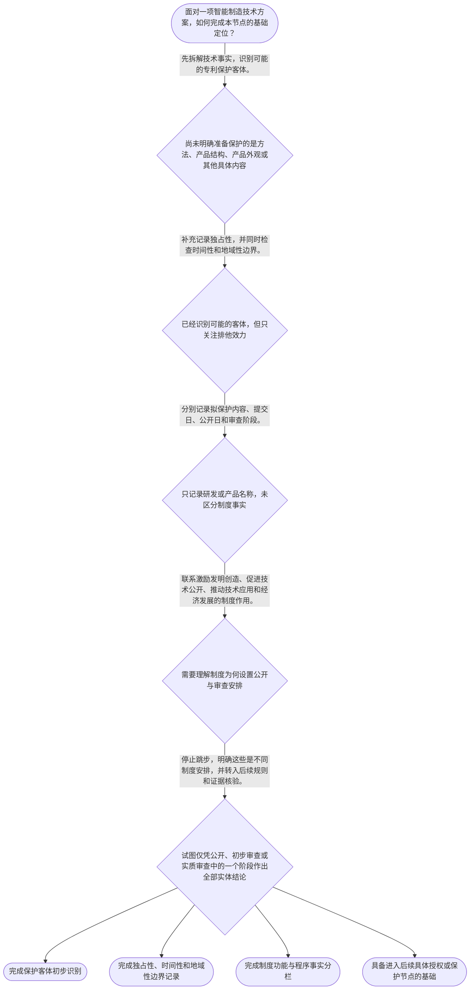

# 整合后的课程完整内容与习题

## 教学模块选择清单

- 当前教学节点：`patent-law-foundation`
- 板块预算：自适应 5/6，总计 9/9

| # | 模块 (block_type) | 类型 | 触发原因 (trigger) | 对应正文段 | 归属 |
|---:|---|:--:|---|---|:--:|
| 1 | `anchor_scenario` | 自适应 | perception=sensing(0.86) / P(L)=0.15<0.3 / cold_start | 从机器人视觉检测看专利制度基础｜某智能制造企业研发了一套机器人视觉检测单元：相机采集流水线上零件图像，控制器根据缺陷特征调整… | [A+B融合] |
| 2 | `legal_anchor` | 必选 | mandatory | 法条锚定：保护客体与制度入口｜《专利法》第二条 | [A+B融合] |
| 3 | `worked_example` | 自适应 | cognition.apply=0.34<0.4 / cognition.analyze=0.28<0.3 / cold_start | 机器人视觉检测方案的三步基础分析｜某智能制造企业开发机器人视觉检测单元，方案包括相机采集零件图像、控制器处理缺陷信息和机械臂执… | [A+B融合] |
| 4 | `decision_flow` | 自适应 | input=visual(0.82) | 专利制度基础决策流｜面对一项智能制造技术方案，如何完成本节点的基础定位？ | [A+B融合] |
| 5 | `mnemonic` | 自适应 | remember=0.72>=0.6 & apply<0.4 / understanding=sequential(0.70) | 专利基础四格检查表｜四格检查表：客体看“三类”，权利看“三性”，功能看“公开促创新”，程序看“公开、初审、实审”… | [A+B融合] |
| 6 | `reflect_prompt` | 自适应 | processing=reflective(0.67) | 把基础框架带回研发现场｜回想一个你接触过的智能制造技术改进：如果向专利代理人介绍它，你会如何分别说明技术内容、可能的… | [A+B融合] |
| 7 | `assessment` | 必选 | mandatory | 本节三类测评｜识别发明、实用新型和外观设计三类专利保护客体。 | [A+B融合] |
| 8 | `knowledge_synthesis` | 必选 | mandatory | 专利制度基础知识网络｜专利保护客体：发明、实用新型和外观设计，判断重点是实际拟保护的内容而非技术名称。 | [A+B融合] |
| 9 | `summary_card` | 自适应 | len(knowledge_sub_nodes)=3>=3 | 专利制度基础速查卡｜先识别保护客体，再理解专利权三性、制度作用和公开审查制度特点。 | [A+B融合] |

## 教学正文

## I — 法律问题

本节的任务是建立专利法律制度基础，而不是直接对某一项智能制造技术作出新颖性或侵权结论。学习主线是“保护什么—权利有什么边界—制度为什么存在—制度如何运行”。新颖性、创造性和侵权判定将在后续节点分别展开；本节只建立理解这些问题所需的制度坐标。

## R — 适用规则

### 1. 专利保护的三类客体

〔RAG: 题设教学上下文 — 专利保护的三种客体：发明、实用新型、外观设计（专利法第2条）〕《专利法》第二条所对应的基本保护客体包括发明、实用新型和外观设计。

识别客体时不能只看技术名称或产品名称，而要看实际拟保护的内容：发明通常围绕产品、方法或者其改进形成技术方案；实用新型侧重产品的形状、构造或者其结合；外观设计侧重产品的外观设计。上述概括用于本节点的基础识别，具体案件仍应核对现行法条和审查指南。

在智能制造场景中，同一设备可能同时包含不同层次的创新内容。例如，控制方法可能体现为发明，机械结构改进可能涉及实用新型，设备外形的视觉设计可能涉及外观设计。客体识别回答的是“准备保护哪一类对象”，不等同于已经证明该对象满足全部授权条件。

### 2. 专利权的三种基本特征

专利权的独占性、时间性和地域性必须结合起来理解。独占性表示在授权范围内，权利人享有排他的法律利益；时间性表示这种权利受到法定期限限制；地域性表示权利效力原则上受授予该权利的法域限制。三者共同说明：专利权不是无期限、无边界、在全世界自动有效的绝对权利。

### 3. 中国专利制度的规范体系

中国专利制度的学习和适用，至少要把专利法、专利法实施细则和专利审查指南放在同一框架中核对。专利法提供基本制度和权利义务框架，实施细则对相关程序和制度事项作进一步规定，审查指南则提供审查实践中的具体理解和操作指引。三者不能被割裂，也不能把其中一份材料的概括直接替代完整法律核验。

### 4. 专利制度的作用

专利制度通过在一定范围和期限内给予专有权，与技术公开形成制度联系。其作用包括激励发明创造、促进技术公开、推动技术应用和经济发展。企业因此需要同时考虑技术方案的保护价值、公开安排和后续应用，而不能只把专利理解为阻止竞争者使用的工具。

### 5. 制度发展与审查运行特点

当前节点需要掌握的制度特点包括早期公开、延迟审查，以及初步审查制与实质审查制并存。它们分别涉及申请信息何时向公众公开、审查请求或审查程序如何推进，以及不同类型申请所经历的审查环节。公开、初步审查和实质审查是不同维度的制度安排，某一程序阶段不当然等于已经对全部实体问题作出最终结论。

## A — 规则适用

以智能制造企业的机器人视觉检测单元为例：相机采集流水线零件图像，控制器处理缺陷信息，机械臂据此调整抓取路径。第一步，应从实际拟保护内容出发识别客体，而不是因为名称中出现“机器人”或“软件”就直接下结论。

第二步，应记录专利权的三种基本边界：即使企业拟申请的是技术方案，未来可能形成的专利权也必须放在独占性、时间性和地域性框架中理解。申请行为本身也不能被直接理解为已经取得完整的排他权。

第三步，应把制度功能和程序事实分开记录。企业可以把研发方案、拟保护内容、预计公开安排和审查阶段分别列出。提交日、公开日和审查阶段属于不同事实，不能在没有依据时相互替代。当前节点只训练这种基础整理方法，不提前对后续的新颖性、创造性或侵权问题作实体结论。

## C — 结论

专利法律制度基础可以固定为“四格框架”：第一格是客体，判断拟保护的是发明、实用新型还是外观设计；第二格是三性，分别记录独占性、时间性和地域性；第三格是制度功能，理解激励创新、促进公开、推动应用和经济发展的联系；第四格是程序特点，区分早期公开、延迟审查、初步审查和实质审查。

本轮检索上下文未提供除题设明确给出的《专利法》第二条以外的直接法条原文或可核验的真实裁判案例。因此，智能制造情境仅作为教学演示，不宣称为真实判例；涉及具体案件时，应进一步核验最新法律文本、审查指南、申请文件、公开记录和其他证据。新颖性、创造性、现有技术、抵触申请及侵权判定留待后续节点学习。

本节设有测评，请到【习题】区作答。

### 从机器人视觉检测看专利制度基础（anchor_scenario）

> 某智能制造企业研发了一套机器人视觉检测单元：相机采集流水线上零件图像，控制器根据缺陷特征调整机械臂抓取路径。研发负责人准备申请中国发明专利，却担心技术展示、权利边界和审查流程彼此混在一起，无法判断应先整理哪些事实。团队需要先弄清楚这项技术准备保护什么、未来权利受哪些边界限制，以及公开和审查在制度中分别承担什么作用。

**锚定**：用智能制造研发场景锚定保护客体、专利权三种基本特征、制度功能和公开审查特点四组基础知识。

**先想一想**：如果你是这家企业的专利顾问，面对这套设备，你会先确认拟保护的具体内容，还是先讨论它是否已经获得排他权？为什么？

### 法条锚定：保护客体与制度入口（legal_anchor）

- **《专利法》第二条**：我国专利制度的基本保护客体包括发明、实用新型和外观设计；判断具体技术属于哪一类，要看实际拟保护的内容。

**为何重要**：先确定专利制度保护的对象，再理解专利权的独占性、时间性和地域性，才能为后续学习授权条件、新颖性和侵权判定建立正确入口。

### 机器人视觉检测方案的三步基础分析（worked_example）

**案情/例题**：某智能制造企业开发机器人视觉检测单元，方案包括相机采集零件图像、控制器处理缺陷信息和机械臂执行分拣。企业准备申请中国专利。请演示在专利法律制度基础节点中，应如何整理这项方案，而不是直接得出完整授权结论。
**适用规则**：《专利法》第二条所对应的三类专利保护客体，以及本节点关于专利权独占性、时间性、地域性、制度功能和公开审查特点的基础规则。具体授权实质条件属于后续节点。
**分步推演**：
1. 先拆分技术事实和拟保护内容：相机采集、控制器处理和机械臂执行共同构成具体技术方案。不能因为名称中有“机器人”或涉及软件，就跳过客体识别。 → *第一步：从实际技术内容识别拟保护客体。*
2. 再根据拟保护内容初步区分可能的类型：方法或整体技术方案可能需要按发明方向进一步核验，产品结构改进可能涉及实用新型，产品外观设计则属于另一种识别方向。这里只作基础分类，不替代正式审查。 → *第二步：区分技术方案、产品结构和产品外观，避免按名称分类。*
3. 接着记录权利边界：未来形成的专利权即使具有排他效力，也必须结合其授权范围、法域和法定期限理解，不能直接当作全球、永久的权利。 → *第三步：同时检查独占性、时间性和地域性。*
4. 最后将制度事实分栏记录：研发内容、提交日、公开日和审查阶段分别记录。公开、初步审查和实质审查是不同制度安排，不能把某一程序阶段直接等同于全部实体结论。 → *第四步：把制度功能和程序事实分开核验。*
**结论**：本例完成的是专利制度基础整理：先识别拟保护客体，再记录专利权三种边界，并区分制度功能与程序事实。是否具备新颖性、创造性或是否构成侵权，应留待相应后续节点并结合具体证据判断。
**本题要点**：面对智能制造方案，先用“客体—三性—制度功能—程序事实”四步链条定位问题，再进入具体法律判断。

### 专利制度基础决策流（decision_flow）

**决策问题**：面对一项智能制造技术方案，如何完成本节点的基础定位？



### 专利基础四格检查表（mnemonic）

**记忆锚**：四格检查表：客体看“三类”，权利看“三性”，功能看“公开促创新”，程序看“公开、初审、实审”。分析任何智能制造研发方案时按四格依次填写。
**映射**：
- 三类
- 三性
- 公开促创新
- 公开、初审、实审
**何时用**：阅读智能制造研发记录、准备专利申请讨论或复习本节点时使用；先填四格，再进入后续具体授权条件分析。

### 把基础框架带回研发现场（reflect_prompt）

**反思问题**：回想一个你接触过的智能制造技术改进：如果向专利代理人介绍它，你会如何分别说明技术内容、可能的保护客体、专利权的三种边界，以及公开安排和制度目的？

**关注要点**：技术方案本身是否与产品名称一致；拟保护的是技术方案、产品形状构造还是产品外观；独占性是否同时受到时间性和地域性限制；提交日、公开日和审查阶段是否被分别记录；技术公开如何与激励创新和推动应用联系起来

**连接**：连接到学习者已有的智能制造研发经验，并为后续新颖性、创造性和专利权保护节点建立稳定的基础分类。

### 专利制度基础知识网络（knowledge_synthesis）

**知识框架**：
- 专利保护客体：发明、实用新型和外观设计，判断重点是实际拟保护的内容而非技术名称。
- 专利权基本特征：独占性体现排他效力，时间性和地域性共同限定该效力的边界。
- 中国专利制度体系：专利法、专利法实施细则和专利审查指南构成需要结合核对的规范材料体系。
- 专利制度作用：通过技术公开与一定范围、期限内的权利安排，激励发明创造、促进技术公开、推动技术应用和经济发展。
- 制度发展与运行特点：早期公开、延迟审查，以及初步审查制和实质审查制并存；程序安排与实体结论应分别理解。
**概念关系**：先根据实际拟保护内容识别客体，再进入相应授权和保护规则。；独占性不是孤立概念，时间性和地域性共同限定权利边界。；技术公开连接专利制度的激励创新、信息传播和技术应用功能。；提交日、公开日和审查阶段分别记录，为后续新颖性、创造性和权利保护分析提供事实基础。
**必记**：专利保护客体包括发明、实用新型和外观设计。；专利权的独占性必须结合时间性和地域性理解。；专利法、专利法实施细则和专利审查指南需要放在同一制度框架中核对。；公开、初步审查和实质审查是不同制度安排，不能仅凭一个程序阶段推出全部法律结论。

### 专利制度基础速查卡（summary_card）

**要点卡**：
- **三类保护客体**：先看实际拟保护内容，区分发明、实用新型和外观设计。
- **专利权三种特征**：独占性体现排他效力，时间性和地域性限定权利边界。
- **规范体系**：专利法、专利法实施细则和专利审查指南需要结合核对。
- **制度作用**：专利制度通过技术公开促进发明创造、技术应用和经济发展。
- **程序特点**：早期公开、延迟审查，以及初步审查制与实质审查制并存。
**必背**：专利保护客体包括发明、实用新型和外观设计。；专利权具有独占性、时间性和地域性。；提交日、公开日和审查阶段属于需要分别记录的制度事实。；本节点的基础顺序是“客体—三性—制度功能—程序特点”。
**一句话总结**：先识别保护客体，再理解专利权三性、制度作用和公开审查制度特点。

### 本节三类测评（assessment）

**三类覆盖**：backward_review、forward_probe、weakness_probe
**题目**：
- q-backward-1：识别发明、实用新型和外观设计三类专利保护客体。
- q-forward-1：初步理解专利权效力需要结合授权范围、法域和期限。
- q-weakness-1：区分拟保护内容、提交日、公开日和审查阶段等制度事实。


## 结构化数据

## expert

```json
"A+B融合"
```

## style

```json
"fused"
```

## knowledge_points

```json
[
  {
    "node_id": "patent-law-foundation",
    "kc_name": "专利制度的基本概念与特征：独占性、时间性、地域性"
  },
  {
    "node_id": "patent-law-foundation",
    "kc_name": "中国专利制度体系：专利法、专利法实施细则、专利审查指南"
  },
  {
    "node_id": "patent-law-foundation",
    "kc_name": "专利保护的三种客体：发明、实用新型、外观设计"
  },
  {
    "node_id": "patent-law-foundation",
    "kc_name": "专利制度的作用：激励发明创造、促进技术公开、推动技术应用和经济发展"
  },
  {
    "node_id": "patent-law-foundation",
    "kc_name": "中国专利制度发展历程与特点：早期公开延迟审查、初步审查制与实质审查制并存"
  }
]
```

## legal_basis

```json
[
  {
    "article": "《专利法》第二条",
    "source": "题设教学上下文明确提供：专利保护的三种客体为发明、实用新型、外观设计。"
  },
  {
    "article": "专利权的独占性、时间性和地域性",
    "source": "题设教学上下文将其列为当前节点知识点，但未提供具体条文原文。"
  },
  {
    "article": "中国专利法、专利法实施细则和专利审查指南构成制度学习与适用框架",
    "source": "题设教学上下文明确列出该制度体系，但未提供具体法规或指南原文。"
  },
  {
    "article": "早期公开、延迟审查，以及初步审查制与实质审查制并存的制度特点",
    "source": "题设教学上下文将其列为当前节点知识点，但未提供具体历史或审查指南原文。"
  }
]
```

## risks

```json
[
  {
    "risk": "本轮检索上下文未提供专利权三种特征、制度体系和发展历程的直接法条或官方材料原文；相关内容仅依据题设当前节点知识点建立基础框架，正式适用前需核验最新法律和官方审查材料。",
    "related_node_id": "patent-law-foundation"
  },
  {
    "risk": "发明、实用新型和外观设计的基础识别不能替代具体授权条件审查；技术名称、产品名称与拟保护客体可能并不一致。",
    "related_node_id": "patent-law-foundation"
  },
  {
    "risk": "早期公开、延迟审查、初步审查和实质审查属于不同制度安排，不能仅凭某一程序阶段推断全部实体法律结论。",
    "related_node_id": "patent-law-foundation"
  },
  {
    "risk": "本节未提供可核验的真实智能制造裁判案例；教学场景不得被表述为真实判例或个案法律意见。",
    "related_node_id": "patent-law-foundation"
  }
]
```

## draft_stage

```json
"integration"
```

## irac

```json
{
  "issue": "面对智能制造技术方案，如何在专利法律制度基础节点中识别保护客体、理解专利权基本边界，并正确定位制度功能和程序运行特点？",
  "rule": "题设明确提供《专利法》第二条所对应的三类专利保护客体为发明、实用新型和外观设计。当前节点还要求掌握专利权的独占性、时间性和地域性，中国专利法、专利法实施细则和专利审查指南构成的制度体系，专利制度的作用，以及早期公开、延迟审查和初步审查制与实质审查制并存的制度特点。本轮检索上下文未提供其他直接法条原文，不能补造未核验条号。",
  "application": "在机器人视觉检测单元案例中，先依据相机、控制器、机械臂及其拟保护内容识别可能的客体类型，再分别记录专利权的独占性、时间性和地域性，最后区分提交日、公开日和审查阶段等制度事实。当前阶段不据此替代后续节点的新颖性、创造性或侵权判定。",
  "conclusion": "本节点的基础结论是：专利制度分析应先识别保护客体，再理解专利权三种基本特征，并联系制度功能及公开审查制度的运行特点。智能制造教学场景用于训练框架迁移，不构成对真实案件的确定法律结论。"
}
```

## interactive_questions

```json
[
  {
    "qid": "q-backward-1",
    "category": "remember",
    "difficulty": "L1",
    "source_tag": "backward_review",
    "kc_node_id": "patent-law-foundation",
    "question": "根据本节所学内容，下列哪一项完整列出了我国专利保护的三类基本客体？",
    "answer": "B",
    "options": [
      "A. 技术秘密、商业秘密和产品外观",
      "B. 发明、实用新型和外观设计",
      "C. 发明、著作和商标",
      "D. 设备、厂房和生产流程"
    ]
  },
  {
    "qid": "q-forward-1",
    "category": "understand",
    "difficulty": "L1",
    "source_tag": "forward_probe",
    "kc_node_id": "patent-rights-protection",
    "question": "关于中国专利权的基本边界，下列哪一项理解正确？",
    "answer": "C",
    "options": [
      "A. 中国专利授权后自动在全世界有效且永久有效",
      "B. 只要提交专利申请，就立即取得完整排他权",
      "C. 专利权的效力需要结合授权范围、法域和法定期限理解",
      "D. 专利权只保护研发人员的想法，不涉及技术方案"
    ]
  },
  {
    "qid": "q-weakness-1",
    "category": "analyze",
    "difficulty": "L2",
    "source_tag": "weakness_probe",
    "kc_node_id": "patent-law-foundation",
    "question": "某智能制造企业准备申请专利，已有研发记录、专利申请文件和公开资料。为避免混淆制度事实，当前基础阶段最适当的做法是什么？",
    "answer": "B",
    "options": [
      "A. 将申请文件的提交日一律视为向公众公开的日期",
      "B. 分别记录拟保护内容、提交日、公开日和审查阶段，再按相应规则核验其法律作用",
      "C. 只看技术名称即可确定保护客体和全部授权结论",
      "D. 只要进入初步审查，就可以认定全部实体条件已经满足"
    ]
  }
]
```

## knowledge_synthesis

```json
{
  "node": "patent-law-foundation",
  "coverage": [
    {
      "node_id": "patent-rights-nature"
    },
    {
      "node_id": "patent-law-framework"
    },
    {
      "node_id": "patent-law-foundation"
    },
    {
      "node_id": "patent-system-overview"
    }
  ],
  "confusable_pairs": [
    {
      "pair": "专利保护客体与专利权保护范围：前者回答专利制度保护哪类对象，后者回答授权后具体权利覆盖什么内容；本节只完成前者的基础识别。"
    },
    {
      "pair": "独占性与时间性、地域性：独占性体现排他效力，时间性和地域性共同限定这种效力的边界。"
    },
    {
      "pair": "提交日与公开日：提交申请不等于已经向公众公开，两个日期应分别记录并依据后续规则核验其作用。"
    },
    {
      "pair": "公开制度与审查制度：公开、初步审查和实质审查是不同制度安排，不能仅凭某一程序阶段推断全部法律结论。"
    }
  ]
}
```
