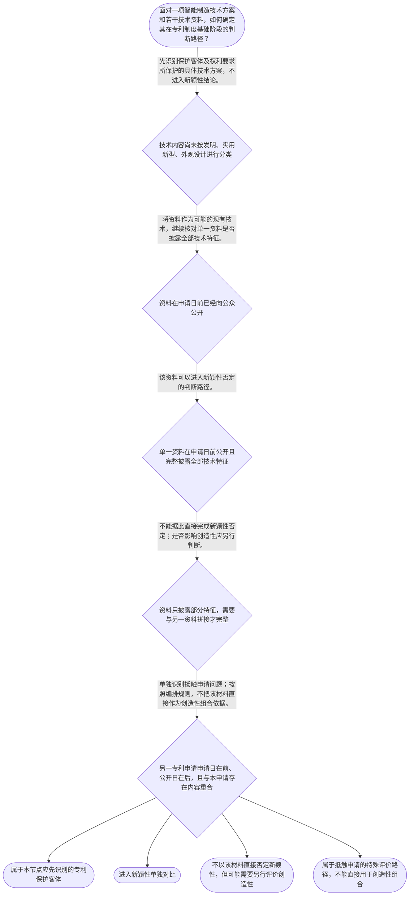

# 专家 A 教学草稿

> 专家：expert_a ｜ 风格：conservative

## 教学模块选择清单

- 当前教学节点：`patent-law-foundation`
- 板块预算：自适应 6/6，总计 9/9

| # | 模块 (block_type) | 类型 | 触发原因 (trigger) | 对应正文段 | 归属 |
|---:|---|:--:|---|---|:--:|
| 1 | `anchor_scenario` | 自适应 | perception=sensing(0.86) / P(L)=0.15<0.3 / cold_start | 从机器人视觉检测看专利制度边界｜某智能制造企业研发了一套机器人视觉检测单元：相机采集流水线上零件图像，控制器根据缺陷特征调整… | [A] |
| 2 | `legal_anchor` | 必选 | mandatory | 法条锚定：保护客体与授权判断入口｜《专利法》第二条 | [A] |
| 3 | `worked_example` | 自适应 | cognition.apply=0.34<0.4 / cognition.analyze=0.28<0.3 / cold_start | 机器人视觉检测方案的四步判定｜某企业为自动化装配线开发机器人视觉检测单元。权利要求拟包含：相机采集零件图像、控制器提取缺陷… | [A] |
| 4 | `decision_flow` | 自适应 | input=visual(0.82) | 客体、时间与对比方法决策流｜面对一项智能制造技术方案和若干技术资料，如何确定其在专利制度基础阶段的判断路径？ | [A] |
| 5 | `mnemonic` | 自适应 | remember=0.72>=0.6 & apply<0.4 / understanding=sequential(0.70) | 专利基础四格检查表｜专利基础四格检查表：客体先分“三类”；时间分“前公开/后公开”；对比看“单一/组合”；用途分… | [A] |
| 6 | `reflect_prompt` | 自适应 | processing=reflective(0.67) | 把四格检查表带回研发现场｜回想一个你接触过的智能制造技术改进：如果需要向专利代理人说明其授权风险，你会如何分别整理技术… | [A] |
| 7 | `assessment` | 必选 | mandatory | 本节三类测评｜识别我国专利法规定的三类专利保护客体。 | [A] |
| 8 | `knowledge_synthesis` | 必选 | mandatory | 专利制度基础知识网络｜专利制度基本特征：专利权具有独占性、时间性和地域性，权利边界不能脱离授权范围、期限和法域理解… | [A] |
| 9 | `summary_card` | 自适应 | len(knowledge_sub_nodes)=3>=3 | 专利制度基础速查卡｜先识别客体，再按时间和资料披露范围分流，最后严格区分新颖性与创造性的评价用途。 | [A] |

## 教学正文

## I — 法律问题

本节主问题不是直接判断某一项智能制造技术是否侵权，而是建立进入专利分析的基础框架：先识别专利保护客体，再理解专利权的基本边界，并把技术资料按时间、披露范围和评价用途分开处理。对后续的新颖性和侵权判定而言，最容易发生的错误是把“申请日前公开”“申请日前提交但申请日后公开”“单独对比”“组合对比”混为一谈。

## R — 适用规则

### 1. 保护客体

题设教学上下文明确提供，《专利法》第二条对应的基本保护客体包括发明、实用新型和外观设计。〔RAG: 题设教学上下文 — 专利保护的三种客体：发明、实用新型、外观设计（专利法第2条）〕

发明通常围绕产品、方法或者其改进形成技术方案；实用新型侧重产品的形状、构造或者其结合；外观设计侧重产品的整体或局部外观。由于本轮检索上下文未提供上述内容的完整法条原文，后两句只能作为基础识别框架，具体案件应核验最新法条和审查指南。

### 2. 专利权的基本特征

专利权的独占性、时间性和地域性应当同时理解。独占性说明授权范围内的权利具有排他效力；时间性说明权利受到法定期限限制；地域性说明中国专利权的效力原则上以中国法域为边界。检索上下文未提供这些表述的直接法条原文，因此本节不补造具体条号。

### 3. 资料与评价用途

分析一份技术资料时，至少记录四项内容：资料是什么、何时向公众公开、披露了哪些技术特征、准备用于哪一种法律评价。

申请日前已经向公众公开的资料，可能进入现有技术分析。判断新颖性时，核心是单独考察一份资料是否完整披露权利要求的全部技术特征；不能因为几份资料拼接后能够覆盖全部特征，就直接得出缺乏新颖性的结论。

申请日前提交、申请日后公开的在先申请具有不同的时间结构。按照本节规划规则，应将其与普通申请日前公开的现有技术分开识别；抵触申请不能直接用于创造性评价。创造性与新颖性也不能混为一谈：前者关注技术方案相对于现有技术是否显而易见，后者首先关注单一公开资料是否完整呈现技术方案。上述具体规则的法条和审查指南原文未在本轮检索上下文中提供，正式意见需补充检索核验。

### 4. 制度功能与审查位置

专利制度同时具有激励发明创造、促进技术公开、推动技术应用和经济发展的功能。制度基础学习还需要区分初步审查、实质审查和公开等程序概念；程序阶段不同，不等于技术方案当然具备实体授权条件。

## A — 规则适用

以机器人视觉检测单元为例，第一步不是看到“机器人”或“软件”就下结论，而是拆解其技术内容：相机采集图像、控制器提取缺陷特征、根据特征生成抓取路径、机械臂执行分拣。随后分别记录论文和另一件专利申请的提交日、公开日以及披露内容。

如果申请日前公开的论文只披露相机采集、缺陷识别和机械臂分拣，没有披露根据缺陷特征生成抓取路径这一技术特征，那么它虽然与申请方案高度相关，但不能仅凭这份论文完成对全部技术特征的单独对比。若必须把论文与另一份资料拼接，所得结论就不能直接作为新颖性判断结论。

另一件专利申请如果在本申请日前提交、在本申请日后公开，则不能简单按“申请日前已经公开”处理。应先保留其申请日与公开日的差异，再按照抵触申请的特殊评价路径分析；不能把它与论文拼接后直接作创造性评价。

## C — 结论

专利制度基础阶段应固定遵循“客体—时间—单一文件—评价用途”的顺序。发明、实用新型和外观设计是首先要识别的三类保护客体；专利权的独占性必须结合时间性和地域性理解；申请日前公开的资料、申请日前提交但申请日后公开的抵触申请，以及新颖性和创造性的评价方法，均应分别处理。

本轮检索上下文为空，除题设明确提供的《专利法》第二条外，未提供新颖性、创造性、现有技术和抵触申请的直接法条原文。因此，本稿建立的是可整合的基础判断框架，不替代对最新法律文本、审查指南和具体案件证据的核验。

> 常见误区 / 易混淆点
>
> 1. 把“申请日前提交”直接等同于“申请日前公开”。提交日和公开日必须分开记录。
> 2. 把多份资料拼接后完整覆盖技术特征，就直接否定新颖性。新颖性判断首先要求单独对比。
> 3. 把抵触申请直接当作创造性评价材料。其时间结构和评价用途需要单独处理。
> 4. 把专利授权理解为全球、永久的垄断权。专利权还受地域和期限限制。

本节设有测评，请到【习题】区作答。

### 从机器人视觉检测看专利制度边界（anchor_scenario）

> 某智能制造企业研发了一套机器人视觉检测单元：相机采集流水线上零件图像，控制器根据缺陷特征调整机械臂抓取路径。研发团队准备申请中国发明专利，但检索时发现，申请日前已有一篇公开论文披露了相机采集和缺陷识别，另有一件申请日前提交、申请日后公开的专利申请披露了完整的控制流程。团队需要先理解专利制度的保护对象和制度边界，再判断这些材料分别可能影响什么授权评价。

**锚定**：用智能制造技术方案同时锚定保护客体、专利权边界以及新颖性与创造性的基本区分。

**先想一想**：面对同一项智能制造技术，你会先区分它属于哪一种专利保护客体，还是先比较公开文件的时间和内容？请注意这两个问题的判断用途并不相同。

### 法条锚定：保护客体与授权判断入口（legal_anchor）

- **《专利法》第二条**：我国专利法把专利保护客体分为发明、实用新型和外观设计；智能制造中的控制方法、装置结构和产品外观，必须先判断其法律客体类型。
- **专利授权实质条件、新颖性、创造性与现有技术的具体条文**：授权实质条件需要分别处理保护客体、公开时间、单一文件是否完整披露以及是否显而易见等问题；本节仅建立判断框架，具体条文适用应以最新法条和审查指南核验。

**为何重要**：专利制度基础决定后续学习的入口：先知道保护什么、权利具有什么边界，再理解新颖性和侵权判定。由于本轮没有检索上下文，除题设明确给出的《专利法》第二条外，不将未核验的条号或案例结论写成确定法条。

### 机器人视觉检测方案的四步判定（worked_example）

**案情/例题**：某企业为自动化装配线开发机器人视觉检测单元。权利要求拟包含：相机采集零件图像、控制器提取缺陷特征、根据缺陷特征生成抓取路径、机械臂执行分拣。申请日前，一篇公开论文披露了相机采集、缺陷识别和机械臂分拣，但没有披露根据缺陷特征生成抓取路径；另一件专利申请在申请日前提交、申请日后公开，公开文本完整披露了上述四项技术特征。需要演示这些材料应如何进入专利制度基础阶段的判断。
**适用规则**：本例依据题设明确提供的《专利法》第二条，以及编排层提供的新颖性、创造性、现有技术和抵触申请区分规则。具体法条原文和条号未在检索上下文中提供，正式法律意见应进一步核验。
**分步推演**：
1. 先看技术内容而不是先看名称。该方案涉及对机器人控制流程的技术改进，至少需要区分方法性技术方案与装置、外观等其他客体；不能因为使用了软件或机器人名称，就直接认定其保护类型。 → *第一步：确定法律保护客体及其对应的权利要求表达。*
2. 再建立时间轴。公开论文在申请日前已经向公众提供技术内容，因此具有进入现有技术评价的时间条件；另一件申请虽在申请日前提交，但在申请日后公开，时间结构不同。 → *第二步：分别记录申请日、提交日、公开日，不混用时间节点。*
3. 评价新颖性时，原则上要问一份材料是否直接、明确地披露了权利要求的全部技术特征。论文缺少生成抓取路径这一特征，因此不能仅凭其披露了大部分内容就认定完整破坏新颖性。 → *第三步：单独对比并核对全部技术特征。*
4. 创造性与新颖性的评价对象不同。把论文与其他材料拼接起来，可能是创造性分析中需要进一步论证的问题，但不能用拼接结果替代新颖性的单一文件对比；申请日前提交、申请日后公开的材料还必须按照抵触申请的特殊用途单独处理。 → *第四步：分开处理新颖性、创造性和抵触申请。*
**结论**：该技术首先应按其技术内容判断保护客体；申请日前已公开的单一文件若完整披露全部技术特征，进入新颖性评价。申请日前提交、申请日后公开且内容相同的在先申请，属于需要单独识别的抵触申请材料，其评价用途限于新颖性，不应直接并入创造性组合评价。
**本题要点**：处理专利问题时固定使用“客体—时间—单一文件—评价用途”四步链条，避免把公开时间和对比方法混在一起。

### 客体、时间与对比方法决策流（decision_flow）

**决策问题**：面对一项智能制造技术方案和若干技术资料，如何确定其在专利制度基础阶段的判断路径？



### 专利基础四格检查表（mnemonic）

**记忆锚**：专利基础四格检查表：客体先分“三类”；时间分“前公开/后公开”；对比看“单一/组合”；用途分“新颖性/创造性”。每次分析案件按四格依次打勾。
**映射**：
- 三类
- 前后
- 单双
- 用途
**何时用**：阅读专利申请、公开文件或智能制造研发记录，准备判断授权风险时使用；先填四格，再写结论。

### 把四格检查表带回研发现场（reflect_prompt）

**反思问题**：回想一个你接触过的智能制造技术改进：如果需要向专利代理人说明其授权风险，你会如何分别整理技术客体、首次公开时间、已有资料的披露范围和评价用途？

**关注要点**：技术方案本身与其产品名称是否一致；研发记录、展会、论文、产品销售等行为的日期是否分别记录；每份资料是完整披露还是只披露部分技术特征；同一份资料用于新颖性判断还是创造性判断，不能仅因技术相关就混用

**连接**：连接到学习者已有的智能制造研发经验，以及后续的新颖性、创造性和专利权保护节点。

### 专利制度基础知识网络（knowledge_synthesis）

**知识框架**：
- 专利制度基本特征：专利权具有独占性、时间性和地域性，权利边界不能脱离授权范围、期限和法域理解。
- 中国专利制度体系：专利法、专利法实施细则和专利审查指南共同构成学习和实务中需要核对的规范材料体系。
- 三类专利保护客体：发明、实用新型和外观设计是专利法规定的基本客体分类，智能制造技术应先按保护内容识别类型。
- 专利制度作用：通过授予一定期限和地域范围内的专有权，换取技术公开，并促进技术应用和经济发展。
- 制度运行与审查特点：不同类型专利存在不同审查环节，理解初步审查、实质审查以及公开制度，有助于区分授权程序问题和授权实质条件问题。
**概念关系**：先识别保护客体，再确定适用的制度规则和审查路径。；专利权的独占性必须结合时间性、地域性理解，三者共同限定权利边界。；技术公开连接专利制度的激励与信息传播功能，同时也是后续新颖性判断的重要事实入口。；新颖性关注单一公开资料与技术特征的关系，创造性关注显而易见性；二者必须分开评价。
**必记**：我国专利保护客体包括发明、实用新型和外观设计。；专利权不是无期限、无地域限制的权利，分析时必须同时看独占性、时间性和地域性。；分析专利授权风险应分开记录技术客体、公开时间、资料披露范围和评价用途。；检索上下文未提供新颖性、创造性和抵触申请的具体法条原文，正式法律意见不得仅凭本节框架代替条文核验。

### 专利制度基础速查卡（summary_card）

**要点卡**：
- **三类保护客体**：先判断技术内容属于发明、实用新型还是外观设计。
- **专利权三种特征**：独占性说明排他效力，时间性和地域性限定其边界。
- **规范体系**：专利法、实施细则和审查指南是学习和实务核验的主要规范材料。
- **授权风险四格**：依次核对客体、时间、单一或组合对比、评价用途。
- **新颖性与创造性**：新颖性与创造性不是同一判断；抵触申请不能直接作为创造性评价依据。
**必背**：专利保护客体包括发明、实用新型和外观设计。；专利权具有独占性、时间性和地域性。；分析资料时先看申请日前是否公开，再区分单一对比与组合对比。；新颖性和创造性分开评价，抵触申请不能直接用于创造性评价。
**一句话总结**：先识别客体，再按时间和资料披露范围分流，最后严格区分新颖性与创造性的评价用途。

### 本节三类测评（assessment）

**三类覆盖**：backward_review、forward_probe、weakness_probe
**题目**：
- q-backward-1：识别我国专利法规定的三类专利保护客体。
- q-forward-1：初步理解专利权效力与保护边界，为下一节点探测。
- q-weakness-1：区分现有技术、抵触申请以及单独对比和组合对比的评价用途。


## 结构化字段

## knowledge_points

```json
[
  {
    "node_id": "patent-law-foundation",
    "kc_name": "专利制度的基本概念与特征：独占性、时间性、地域性"
  },
  {
    "node_id": "patent-law-foundation",
    "kc_name": "中国专利制度体系：专利法、专利法实施细则、专利审查指南"
  },
  {
    "node_id": "patent-law-foundation",
    "kc_name": "专利保护的三种客体：发明、实用新型、外观设计"
  },
  {
    "node_id": "patent-law-foundation",
    "kc_name": "专利制度的作用：激励发明创造、促进技术公开、推动技术应用和经济发展"
  },
  {
    "node_id": "patent-law-foundation",
    "kc_name": "中国专利制度发展历程与特点：早期公开延迟审查、初步审查制与实质审查制并存"
  }
]
```

## legal_basis

```json
[
  {
    "article": "《专利法》第二条",
    "source": "题设教学上下文明确提供该条与发明、实用新型、外观设计三类保护客体的对应关系。"
  },
  {
    "article": "专利权独占性、时间性和地域性",
    "source": null
  },
  {
    "article": "中国专利法、专利法实施细则和专利审查指南构成制度学习与适用框架",
    "source": null
  },
  {
    "article": "申请日前公开的现有技术、抵触申请、新颖性与创造性的区分规则",
    "source": null
  }
]
```

## risks

```json
[
  {
    "risk": "本轮检索上下文为空，现有技术的法定定义、公开方式和时间界限未提供原文；本稿仅使用规划指令中的区分框架，正式适用前需核验最新法律和审查指南。",
    "related_node_id": "prior-art-definition"
  },
  {
    "risk": "抵触申请的具体构成要件和法律依据未在检索上下文中提供，不能仅凭本稿替代个案法律意见。",
    "related_node_id": "conflicting-application"
  },
  {
    "risk": "本稿使用单独对比与全部技术特征的教学框架，但未提供具体审查指南原文；复杂案件还需结合权利要求解释和证据审查。",
    "related_node_id": "novelty"
  },
  {
    "risk": "本稿只作新颖性与创造性的边界说明，未展开创造性判断步骤，也不据此宣称已掌握创造性节点。",
    "related_node_id": "inventive-step"
  }
]
```

## draft_stage

```json
"debate"
```

## irac

```json
{
  "issue": "智能制造技术方案进入专利分析时，应如何确定其保护客体，并区分公开资料对新颖性、创造性和抵触申请问题的不同作用？",
  "rule": "题设明确提供《专利法》第二条所指的三类专利保护客体为发明、实用新型和外观设计。编排层同时要求区分：申请日前公开的现有技术、申请日前提交但申请日后公开的抵触申请、单独对比与组合对比，以及新颖性和创造性的不同评价用途。具体新颖性、创造性和抵触申请条文原文未出现在本轮检索上下文中，不能补造未核验条号。",
  "application": "在智能制造案例中，应先判断机器人视觉检测方案的保护客体，再分别记录论文和另一专利申请的提交、公开及本申请日期。论文若只披露部分技术特征，不能以单独对比方式直接得出完整缺乏新颖性的结论。另一申请具有申请在先、公开在后的时间结构，应单独分析其抵触申请问题，不能把它与论文拼接后直接作创造性评价。",
  "conclusion": "本节点的基础结论是：专利分析必须先识别保护客体，再按时间轴和资料披露范围选择评价路径；新颖性与创造性不可混同，抵触申请也不能直接作为创造性评价依据。由于本轮检索上下文为空，除题设明确给出的《专利法》第二条外，具体条文适用仍须核验最新法条和审查指南。"
}
```

## interactive_questions

```json
[
  {
    "qid": "q-backward-1",
    "category": "remember",
    "difficulty": "L1",
    "source_tag": "backward_review",
    "kc_node_id": "patent-law-foundation",
    "question": "根据本节所给规则，下列哪一项属于我国专利法规定的专利保护客体？",
    "answer": "B",
    "options": [
      "A. 任何尚未生产的设备都自动属于发明",
      "B. 对产品、方法或者其改进所提出的新的技术方案属于发明",
      "C. 只有产品外观可以作为专利保护客体",
      "D. 只有已经销售的产品才可以申请专利"
    ]
  },
  {
    "qid": "q-forward-1",
    "category": "understand",
    "difficulty": "L1",
    "source_tag": "forward_probe",
    "kc_node_id": "patent-rights-protection",
    "question": "某智能制造企业获得一项中国发明专利后，关于该专利权的理解，下列哪一项正确？",
    "answer": "C",
    "options": [
      "A. 中国专利一经授权就在全世界自动有效",
      "B. 专利权一经授权就没有期限限制",
      "C. 专利权的效力需要结合授权范围、法域和法定期限理解",
      "D. 专利权只保护研发人员的个人想法，不保护技术方案"
    ]
  },
  {
    "qid": "q-weakness-1",
    "category": "analyze",
    "difficulty": "L3",
    "source_tag": "weakness_probe",
    "kc_node_id": "patent-law-foundation",
    "question": "甲公司申请日前未公开一项机器人视觉检测方案。乙公司在甲公司申请日前提交了内容相同的专利申请，但乙公司的申请文件在甲公司申请日之后才公开。关于该材料的法律评价，下列哪一项最准确？",
    "answer": "D",
    "options": [
      "A. 只要乙公司的申请先提交，就当然属于申请日前已经公开的现有技术",
      "B. 论文披露了大部分特征，因此可以直接认定完整破坏新颖性",
      "C. 将论文与乙公司的申请拼接后完整披露特征，可以直接否定新颖性",
      "D. 论文与乙公司申请的时间和评价用途应分别分析；不能把申请日后公开的在先申请直接作为创造性组合依据"
    ]
  }
]
```

## knowledge_synthesis

```json
{
  "node": "patent-law-foundation",
  "coverage": [
    {
      "node_id": "patent-rights-nature"
    },
    {
      "node_id": "patent-law-framework"
    },
    {
      "node_id": "patent-law-foundation"
    },
    {
      "node_id": "patent-system-overview"
    }
  ],
  "confusable_pairs": [
    {
      "pair": "申请日前公开的现有技术与申请日前提交、申请日后公开的抵触申请：前者强调公众在申请日前可获得，后者强调在先申请与后公开的时间结构。"
    },
    {
      "pair": "新颖性与创造性：前者原则上进行单一资料的全部特征对比，后者评价技术方案是否显而易见，不能用组合对比直接替代新颖性判断。"
    },
    {
      "pair": "专利制度的保护客体与专利权保护范围：前者回答什么可以申请，后者回答授权后具体权利覆盖什么。"
    }
  ]
}
```

## exercises

```json
[
  {
    "question": null,
    "answer": null,
    "options": null
  }
]
```
