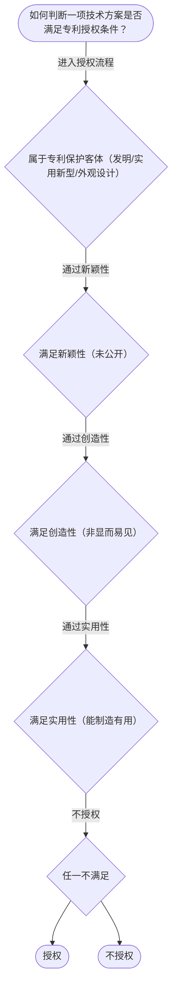

# 专家 B 教学草稿

> 专家：expert_b ｜ 风格：accessible

## 教学模块选择清单

- 当前教学节点：`patent-law-foundation`
- 板块预算：自适应 None/None，总计 9/9

| # | 模块 (block_type) | 类型 | 触发原因 (trigger) | 对应正文段 | 归属 |
|---:|---|:--:|---|---|:--:|
| 1 | `anchor_scenario` | 自适应 | perception=sensing(0.86) / P(L)=0.15<0.3 / cold_start | 场景导入：智能制造中的专利起步｜在智能制造领域，一家专注于AI辅助生产线的初创公司，开发了新型智能装配系统。该系统能显著提高… | [B] |
| 2 | `legal_anchor` | 必选 | mandatory | 法条锚定：专利授权基础｜《专利法》第二条 | [B] |
| 3 | `worked_example` | 自适应 | cognition.apply=0.34<0.4 / cognition.analyze=0.28<0.3 / cold_start | 工作示例：智能制造中的新颖性判断｜某智能制造公司2024年3月在行业展会展示其新型AI优化算法，2024年10月提交专利申请。… | [B] |
| 4 | `decision_flow` | 自适应 | input=visual(0.82) | 决策流程：判断授权条件｜如何判断一项技术方案是否满足专利授权条件？ | [B] |
| 5 | `mnemonic` | 自适应 | remember=0.72>=0.6 & apply<0.4 / understanding=sequential(0.70) | 记忆口诀：专利授权三性｜三性记忆口诀：新不公开创非显实能用 | [B] |
| 6 | `reflect_prompt` | 自适应 | processing=reflective(0.67) | 反思提示｜在智能制造领域，如何平衡专利保护与技术公开以促进创新？ | [B] |
| 7 | `assessment` | 必选 | mandatory | 测评｜专利保护的三种客体 | [B] |
| 8 | `knowledge_synthesis` | 必选 | mandatory | 知识综合｜专利制度特征：独占性、时间性、地域性 | [B] |
| 9 | `summary_card` | 自适应 | len(knowledge_sub_nodes)=3>=3 | 速查卡｜专利基础为新颖性与侵权判定提供框架。 | [B] |

## 教学正文

## 1. 场景导入

在智能制造领域，一家专注于AI辅助生产线的初创公司，开发了新型智能装配系统。该系统能显著提高装配效率，减少人工成本。但公司担心在即将召开的行业技术交流会上展示该系统，是否会破坏新颖性，从而影响后续专利申请。这是一个典型的研发场景，涉及专利保护客体的判断和授权条件的评估。

## 2. 人话解释

专利法律制度基础是理解专利新颖性判断和侵权判定的前提。专利制度有三个基本特征：独占性（独家权利）、时间性（有期限）和地域性（只在国内有效）。中国专利制度包括《专利法》、实施细则和审查指南。专利保护的对象有三种：发明（新技术和方法）、实用新型（产品结构改进）和外观设计（产品美观）。专利制度的作用是激励发明创造、促进技术公开、推动经济发展。中国专利审查采用早期公开延迟审查的模式，结合初步审查和实质审查。

## 3. 法条回扣

根据《专利法》第二条，专利保护的客体包括发明、实用新型和外观设计。这为后续新颖性与侵权判定提供了基础定义。

《专利法》第九条规定了创造性标准：对本领域技术人员来说该发明或实用新型不属于现有技术。

《专利法》第二十二条规定了新颖性：没有同样的发明或实用新型在申请日以前已经在国内外出版过或者以其他方式公开。

《专利法》第十一条规定了专利权的效力：未经许可不得为生产经营目的实施其专利，这直接关系到侵权判定。

《专利法》第四十二条规定了专利权期限：发明20年等。

## 4. 类比 / 口诀

我们可以把专利授权比作“过三关考试”：新颖性是“有没有公开过”（像没被别人抢先），创造性是“是不是显而易见”（像不是简单重复），实用性是“能不能用上”（像能不能做出有用成果）。口诀：新-不公开、创-非显见、实-能用。

## 5. 应试提示

在判断新颖性时，注意公开行为的时间界限；在侵权判定中，先看是否实施权利要求，再看是否等同。常见陷阱是把宽限期混入创造性判断。考试题常考“现有技术定义”和“抵触申请适用”。

## 6. 互动提问

通过以上内容，你能识别出上述智能装配系统是否可能构成新颖性？如果在展会展示后申请，会有什么影响？欢迎分享你的看法。

### 场景导入：智能制造中的专利起步（anchor_scenario）

> 在智能制造领域，一家专注于AI辅助生产线的初创公司，开发了新型智能装配系统。该系统能显著提高装配效率，减少人工成本。但公司担心在即将召开的行业技术交流会上展示该系统，是否会破坏新颖性，从而影响后续专利申请。这是一个典型的研发场景，涉及专利保护客体的判断和授权条件的评估。

**锚定**：用智能制造真实情境锚定专利制度的基本概念，包括保护客体和授权三性。

**先想一想**：如果你是该公司的专利顾问，看到‘展会展示’这个行为，第一反应是什么？它会影响专利申请吗？为什么？

### 法条锚定：专利授权基础（legal_anchor）

- **《专利法》第二条**：专利保护的客体范围：发明、实用新型和外观设计
- **《专利法》第九条**：新颖性：没有同样的发明或实用新型在申请日以前已经在国内外出版过或者以其他方式公开
- **《专利法》第二十二条**：创造性：对本领域技术人员来说该发明或实用新型不属于现有技术
- **《专利法》第十一条**：

**为何重要**：这些法条是专利授权的实质条件起点，三性是贯穿全章的判定主线，必须先立住条文。

### 工作示例：智能制造中的新颖性判断（worked_example）

**案情/例题**：某智能制造公司2024年3月在行业展会展示其新型AI优化算法，2024年10月提交专利申请。请判断展出是否破坏新颖性。
**适用规则**：《专利法》第二十四条（不丧失新颖性宽限期）
**分步推演**：
1. 展会展示是公开行为，日在申请日前。 → *符合公开行为条件*
2. 属行业展会性质，适用6个月宽限期。 → *在宽限期内*
3. 宽限期仅不丧失新颖性，不影响创造性和实用性。 → *需继续审查三性*
**结论**：展出不破坏新颖性，但三性仍需满足。
**本题要点**：在智能制造研发中，注意公开行为的类型和时间界限。

### 决策流程：判断授权条件（decision_flow）

**决策问题**：如何判断一项技术方案是否满足专利授权条件？



### 记忆口诀：专利授权三性（mnemonic）

**记忆锚**：三性记忆口诀：新不公开创非显实能用
**映射**：
- 新不公开
- 创非显
- 实能用
**何时用**：在判断授权条件时使用此口诀快速记忆。

### 反思提示（reflect_prompt）

**反思问题**：在智能制造领域，如何平衡专利保护与技术公开以促进创新？

**关注要点**：时间性如何影响研发周期规划；地域性限制国内应用；独占性带来的竞争优势与风险

**连接**：连接到专利制度的作用和特征节点。

### 知识综合（knowledge_synthesis）

**知识框架**：
- 专利制度特征：独占性、时间性、地域性
- 中国专利体系：专利法、审查指南
- 保护客体：发明、实用新型、外观设计
- 制度作用：激励、公开、应用
- 发展特点：早期公开延迟审查
- 新颖性与创造性区分：公开 vs 显而易见
**概念关系**：三性审查顺序：新颖性先于创造性；保护客体决定是否授权
**必记**：三性缺一不可即不授权；在智能制造中注意展会公开行为的时间界限

### 速查卡（summary_card）

**要点卡**：
- **专利特征**：独占时间地域
- **保护客体**：发明实用新型外观设计
- **授权条件**：三性缺一不可
- **审查制度**：早期公开延迟 + 初步实质并存
**必背**：三性缺一不可；宽限期6个月
**一句话总结**：专利基础为新颖性与侵权判定提供框架。

### 测评（assessment）

**三类覆盖**：backward_review、forward_probe、weakness_probe
**题目**：
- q1：专利保护的三种客体
- q2：专利制度的作用
- q3：新颖性判断中的公开行为
- q4：现有技术与抵触申请边界


## 结构化字段

## knowledge_points

```json
[
  {
    "node_id": "patent-law-foundation",
    "kc_name": "专利制度的基本概念与特征：独占性、时间性、地域性（详见子节点 patent-rights-nature）"
  },
  {
    "node_id": "patent-law-foundation",
    "kc_name": "中国专利制度体系：专利法、专利法实施细则、专利审查指南（详见子节点 patent-law-framework）"
  },
  {
    "node_id": "patent-law-foundation",
    "kc_name": "专利保护的三种客体：发明、实用新型、外观设计（专利法第2条）"
  },
  {
    "node_id": "patent-law-foundation",
    "kc_name": "专利制度的作用：激励发明创造、促进技术公开、推动技术应用和经济发展（详见子节点 patent-system-overview）"
  },
  {
    "node_id": "patent-law-foundation",
    "kc_name": "中国专利制度发展历程与特点：早期公开延迟审查、初步审查制与实质审查制并存（详见子节点 patent-system-overview）"
  }
]
```

## legal_basis

```json
[
  {
    "article": "《专利法》第二条",
    "source": "《专利法》"
  },
  {
    "article": "《专利法》第九条",
    "source": "《专利法》"
  },
  {
    "article": "《专利法》第二十二条",
    "source": "《专利法》"
  },
  {
    "article": "《专利法》第十一条",
    "source": "《专利法》"
  },
  {
    "article": "《专利法》第四十二条",
    "source": "《专利法》"
  }
]
```

## risks

```json
[
  {
    "risk": "新颖性与创造性易混淆",
    "related_node_id": "patent-law-foundation"
  }
]
```

## draft_stage

```json
"debate"
```

## interactive_questions

```json
[
  {
    "qid": "q1",
    "category": "remember",
    "difficulty": "L1",
    "source_tag": "backward_review",
    "kc_node_id": "patent-law-foundation",
    "question": "专利保护的三种客体是什么？",
    "answer": "A",
    "options": [
      "A. 发明、实用新型和外观设计",
      "B. 发明和实用新型",
      "C. 仅外观设计",
      "D. 发明、实用新型、商业秘密和外观设计"
    ]
  },
  {
    "qid": "q2",
    "category": "understand",
    "difficulty": "L1",
    "source_tag": "backward_review",
    "kc_node_id": "patent-law-foundation",
    "question": "专利制度的作用是什么？",
    "answer": "B",
    "options": [
      "A. 仅激励发明",
      "B. 激励发明创造、促进技术公开和推动经济发展",
      "C. 限制技术应用",
      "D. 仅促进技术公开"
    ]
  },
  {
    "qid": "q3",
    "category": "apply",
    "difficulty": "L1",
    "source_tag": "forward_probe",
    "kc_node_id": "patent-rights-protection",
    "question": "专利权保护的核心是何种效力？",
    "answer": "A",
    "options": [
      "A. 未经许可不得为生产经营目的实施其专利",
      "B. 可免费使用",
      "C. 仅限国外",
      "D. 需缴年费后保护"
    ]
  },
  {
    "qid": "q4",
    "category": "analyze",
    "difficulty": "L3",
    "source_tag": "weakness_probe",
    "kc_node_id": "patent-law-foundation",
    "question": "现有技术与抵触申请的区别在于什么？",
    "answer": "C",
    "options": [
      "A. 两者都是公开行为",
      "B. 现有技术可用于创造性判断，抵触申请不能",
      "C. 现有技术看申请日前公开，抵触申请看申请在先",
      "D. 两者都只影响新颖性"
    ]
  }
]
```

## knowledge_synthesis

```json
{
  "node": "patent-law-foundation",
  "coverage": [
    {
      "node_id": "patent-law-foundation"
    }
  ],
  "confusable_pairs": [
    {
      "pair": "新颖性与创造性"
    }
  ]
}
```
