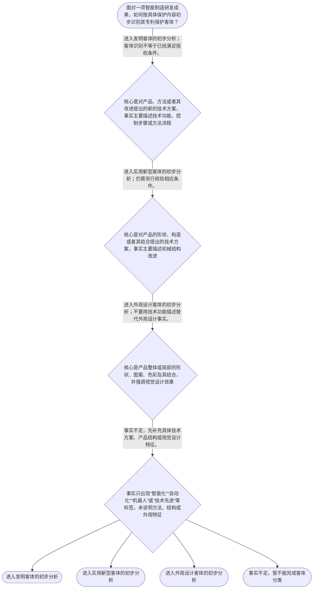

# 整合后的课程完整内容与习题

## 教学模块选择清单

- 当前教学节点：`patent-law-foundation`
- 板块预算：自适应 5/6，总计 9/9

| # | 模块 (block_type) | 类型 | 触发原因 (trigger) | 对应正文段 | 归属 |
|---:|---|:--:|---|---|:--:|
| 1 | `anchor_scenario` | 自适应 | perception=sensing(0.86) / cold_start | 智能制造研发项目中的专利边界｜某智能制造企业正在研发汽车焊接产线的机器人工作站。机械臂负责定位，视觉传感器识别工件位置，控… | [A+B融合] |
| 2 | `legal_anchor` | 必选 | mandatory | 法条与制度锚定｜《中华人民共和国专利法》第二条 | [A+B融合] |
| 3 | `worked_example` | 自适应 | cognition.apply=0.39<0.4 / cognition.analyze=0.29<0.3 / cold_start | 智能仓储系统的客体拆分｜某公司开发智能仓储搬运系统，包括根据传感器数据规划搬运路径的控制方法、改进叉车升降机构的机械… | [A+B融合] |
| 4 | `decision_flow` | 自适应 | input=visual(0.82) | 专利客体识别流程｜面对一项智能制造研发成果，如何按具体保护内容初步识别其专利保护客体？ | [A+B融合] |
| 5 | `common_pitfall` | 自适应 | weak_points(专利法律制度基础) | 不要把技术先进性当作专利资格｜“只要技术属于智能制造、技术含量高，申请一项专利就能自动覆盖整套设备，而且获得专利后可以全球… | [A+B融合] |
| 6 | `reflect_prompt` | 自适应 | processing=reflective(0.67) | 把客体分类带回研发现场｜回想一个你熟悉的智能制造研发成果：如果把它拆成控制方法、产品结构和视觉外观三类事实，你会分别… | [A+B融合] |
| 7 | `assessment` | 必选 | mandatory | 本节三类测评｜识别专利权独占性、时间性和地域性三项基本属性 | [A+B融合] |
| 8 | `knowledge_synthesis` | 必选 | mandatory | 专利法律制度基础知识网｜专利制度的基本概念与特征：专利权具有独占性，但受法定时间和授权地域限制，不能理解为永久、全球… | [A+B融合] |
| 9 | `summary_card` | 自适应 | len(knowledge_sub_nodes)=3>=3 | 专利制度基础速查卡｜先按具体事实识别专利客体，再在专利法制度框架内理解权利的时间、地域和排他边界。 | [A+B融合] |

## 教学正文

## I — 本节要解决的问题

本节主节点是“专利法律制度基础”，目标不是立即判断某项智能制造技术是否具有新颖性，也不是直接作出侵权成立结论，而是建立后续学习的总框架：先识别保护对象，再理解专利权的基本边界，最后知道中国专利制度由哪些规范层次共同支撑。

某智能制造企业研发汽车焊接产线机器人工作站，成果包括视觉传感器识别工件位置、控制器自动调整焊接路径、机器人关节模组结构改进，以及设备外壳的图案和色彩设计。面对同一套设备，不能只依据“机器人”或“智能制造”这一行业名称判断专利类型，而要拆分具体拟保护内容。

## R — 规则框架

### 1. 专利权的三项基本属性

专利权具有独占性、时间性和地域性。

独占性，是指权利人在法定保护范围内享有排他性权利，其他人不能当然实施落入保护范围的行为。时间性，是指这种排他保护不是永久存在，而受法定存续期间和权利状态限制。地域性，是指专利权原则上依申请和授权的法域产生效力，不能因为在中国取得专利，就当然获得全球范围保护。

可以把专利权理解为一张“有期限、标明适用地域和具体边界的独占通行证”。这个类比只用于理解制度边界，不能替代对具体权利要求、有效期限和法域规则的法律核验。

### 2. 中国专利制度的规范体系

中国专利制度不是只看一部法律文本，而是由不同层次的规范共同构成：专利法提供基本制度和权利边界，专利法实施细则支撑申请、审查和程序运行，专利审查指南用于具体审查标准和操作理解。审查指南具有重要实务参考价值，但不能脱离专利法，也不能简单替代法律条文。

在后续学习中，遇到一个专利问题，应当先找相应的法律条文，再结合实施细则和审查指南理解程序或审查操作，不能把指南中的说明直接当成独立的授权要件。

### 3. 专利保护的三类客体

用户提供的本节教学上下文明确指出，《专利法》第二条将专利保护客体区分为发明、实用新型和外观设计。〔RAG: 用户提供的本节教学上下文 — 专利保护的三种客体：发明、实用新型、外观设计（专利法第2条）〕

- 发明：重点看对产品、方法或者其改进提出的新的技术方案。智能制造中的控制方法、数据处理方法或工艺改进，通常应先进入发明客体的分析框架。
- 实用新型：重点看产品的形状、构造或者其结合提出的新的技术方案。机器人关节模组、夹具、传动机构等机械结构改进，通常应先进入实用新型客体的分析框架。
- 外观设计：重点看产品整体或局部的形状、图案、色彩及其结合所形成的设计。机器人外壳的视觉设计，应根据其外观事实进入外观设计客体的分析框架。

这里的“进入分析框架”只是客体分类，不等于已经满足全部授权条件，也不等于已经确定专利保护范围。保护范围仍要结合权利要求或外观设计内容具体判断。

### 4. 专利制度的作用

本节教学上下文将专利制度的作用概括为激励发明创造、促进技术公开、推动技术应用和经济发展。其基本逻辑可以概括为“在一定边界内提供排他保护，同时通过申请文件等制度安排促进技术信息公开”。

因此，专利制度既不是单纯奖励技术先进，也不是限制一切技术使用。制度目标只能帮助理解整体功能，不能替代新颖性、创造性、实用性等具体法律判断。

### 5. 中国制度发展与审查特点

本节教学上下文指出，中国专利制度具有早期公开、延迟审查，以及初步审查制与实质审查制并存等特点。〔RAG: 用户提供的本节教学上下文 — 中国专利制度发展历程与特点：早期公开延迟审查、初步审查制与实质审查制并存〕

这组概念首先用于建立申请和审查流程的整体时间轴：申请、公开、审查并不是同一个动作，部分程序会先进行形式或初步层面的审查，部分申请还会进入实质审查。具体公开时间、审查请求期限、不同类型专利的程序差异及其法律后果，应在后续节点结合现行正式规范核验。本节不据此推导具体期限。

## A — 智能制造场景中的适用

以智能仓储搬运系统为例，研发成果同时包含路径规划控制方法、叉车升降机构结构和机器人外壳图案色彩。正确的第一步不是问“它是不是智能制造专利”，而是把事实拆成方法、产品结构和视觉设计三层。

路径规划控制方法应进入发明客体的初步分析；升降机构的机械结构改进应进入实用新型客体的初步分析；外壳图案和色彩组合应进入外观设计客体的初步分析。同一设备包含多类技术或设计事实，并不意味着一项专利自动覆盖整套设备，也不意味着技术先进就当然能够获得专利授权。

如果研发团队计划在智能制造展会上展示关节模组，还应把展示时间、展示内容、申请安排和目标保护地域分别记录下来。这些事实将为后续学习申请程序、新颖性和权利范围提供基础，但本节不直接判断该展示是否影响新颖性。

本节设有测评，请到【习题】区作答。

## C — 本节结论

学习专利法的第一步，是回答三个问题：第一，具体想保护的对象是什么；第二，专利权的独占性受到哪些时间和地域边界限制；第三，应当在专利法、实施细则和审查指南构成的制度框架中寻找规则。

面对智能制造成果，应将控制方法、产品结构和视觉设计分别识别为可能对应的发明、实用新型和外观设计客体。客体分类是进入后续授权和保护范围分析的入口，不是授权结论。专利制度的三项基本属性是独占性、时间性和地域性；其制度作用包括激励发明创造、促进技术公开、推动技术应用和经济发展。

### 智能制造研发项目中的专利边界（anchor_scenario）

> 某智能制造企业正在研发汽车焊接产线的机器人工作站。机械臂负责定位，视觉传感器识别工件位置，控制器据此调整焊接路径；团队还改进了关节模组的内部结构，并设计了设备外壳的图案和色彩。项目负责人希望用一项“智能制造专利”全部覆盖这些成果，但专利代理人提醒：方法、产品结构和视觉设计可能对应不同的保护客体，专利权也不会当然永久、全球有效。

**锚定**：用同一智能制造研发情境锚定三类专利客体、独占性与时间性地域性，以及中国专利制度的规范层次。

**先想一想**：面对这套研发成果，你会先按行业名称判断专利类型，还是先拆分具体保护内容并确认权利的时间、地域边界？

### 法条与制度锚定（legal_anchor）

- **《中华人民共和国专利法》第二条**：第二条把专利保护客体区分为发明、实用新型和外观设计：发明侧重产品、方法或者其改进形成的技术方案；实用新型侧重产品的形状、构造或者其结合；外观设计侧重产品整体或局部的形状、图案、色彩及其结合所形成的设计。具体法条文字和现行版本仍应以正式法律数据库核验。
- **中国专利制度规范体系：专利法、专利法实施细则、专利审查指南**：专利法提供基础制度和权利边界，专利法实施细则支撑制度运行，专利审查指南提供审查操作层面的理解；指南不能替代法律条文。

**为何重要**：先分清保护客体和规范层次，才能在后续学习新颖性、创造性、权利要求解释及侵权判定时找到正确的法律入口。

### 智能仓储系统的客体拆分（worked_example）

**案情/例题**：某公司开发智能仓储搬运系统，包括根据传感器数据规划搬运路径的控制方法、改进叉车升降机构的机械结构，以及搬运机器人外壳的特定图案和色彩组合。公司希望用一个“智能仓储专利”同时覆盖三者。依据本节范围，应如何先拆分并识别保护客体？
**适用规则**：《中华人民共和国专利法》第二条关于发明、实用新型和外观设计的区分；专利权独占性、时间性、地域性及制度发展特点依据用户提供的本节教学上下文。检索上下文未提供直接法条原文或真实案件材料。
**分步推演**：
1. 先从事实中分离控制步骤、机械结构和视觉外观，不依据“智能”“自动化”或产品名称直接分类。 → *第一步：按具体保护内容拆分事实。*
2. 路径规划属于方法层面的技术方案，进入发明客体的初步分析；叉车升降机构属于产品形状、构造或其结合，进入实用新型客体的初步分析。 → *第二步：分别识别方法技术方案和产品结构。*
3. 外壳的图案、色彩及其结合属于视觉设计事实，进入外观设计客体的初步分析；不能因其服务于机器人就改按机械结构分类。 → *第三步：单独识别外观设计事实。*
4. 分类完成后，还要分别核验申请文件、授权条件和保护范围；同一设备包含多类事实，不代表一项权利自动覆盖全部内容。 → *第四步：把客体分类与后续授权、保护范围判断分开。*
**结论**：该研发项目不应笼统称为一种“智能制造专利”。路径控制方法应进入发明客体的初步分析，夹具机械结构改进应进入实用新型客体的初步分析，外壳图案色彩应进入外观设计客体的初步分析。客体分类并不等于已经满足授权条件，也不等于已经确定专利保护范围。
**本题要点**：先按具体事实识别客体，再进入相应制度和审查框架；同一智能制造设备可以包含多类专利事实。

### 专利客体识别流程（decision_flow）

**决策问题**：面对一项智能制造研发成果，如何按具体保护内容初步识别其专利保护客体？



### 不要把技术先进性当作专利资格（common_pitfall）

**常见误解**：“只要技术属于智能制造、技术含量高，申请一项专利就能自动覆盖整套设备，而且获得专利后可以全球永久排除他人使用。”

**为什么错**：行业先进性不是专利客体分类标准，整套设备中的方法、结构和外观可能对应不同客体。专利权的独占性必须与时间性、地域性一起理解，客体分类也不等于已经满足授权条件或确定保护范围。

**区分判据**：看到“智能制造”“人工智能”或“机器人”等行业标签时，先问“请求保护的具体内容是什么”：方法或技术方案、产品结构，还是视觉外观；再问专利权是否受期限和授权地域限制。口诀是“先进不是客体，内容决定类别；独占有边界，时间地域不能忘”。

**关联节点**：patent-law-foundation

### 把客体分类带回研发现场（reflect_prompt）

**反思问题**：回想一个你熟悉的智能制造研发成果：如果把它拆成控制方法、产品结构和视觉外观三类事实，你会分别记录哪些内容，才能为后续专利分析做好准备？

**关注要点**：区分技术功能、实现步骤、产品结构和视觉外观，不用产品名称代替保护对象；同时记录研发成果拟保护的具体内容及其可能对应的专利客体；记录公开时间和实施地域，作为后续学习申请、审查和权利边界时的事实基础

**连接**：连接到学习者已有的智能制造研发经验，以及本节的保护客体分类、独占性、时间性、地域性和中国专利制度规范体系。

### 专利法律制度基础知识网（knowledge_synthesis）

**知识框架**：
- 专利制度的基本概念与特征：专利权具有独占性，但受法定时间和授权地域限制，不能理解为永久、全球的绝对控制权。
- 中国专利制度体系：以专利法为基础，由专利法实施细则支持制度运行，并结合专利审查指南理解审查操作；指南不能替代法律条文。
- 专利保护的三种客体：发明、实用新型和外观设计分别对应不同保护对象，同一智能制造设备可以包含多类事实。
- 专利制度的作用：通过一定边界内的排他性保护激励发明创造，并通过技术公开促进技术应用和经济发展；制度目标不能替代具体授权要件。
- 中国专利制度发展历程与特点：本节教学上下文指出早期公开、延迟审查，以及初步审查制与实质审查制并存；具体历史和程序细节应核验现行规范。
**概念关系**：先按具体保护内容识别客体，再进入专利法、实施细则和审查指南构成的制度框架。；独占性必须与时间性、地域性同时理解，三者共同限定专利权边界。；制度作用解释公开与保护之间的基本安排，但不能替代后续的新颖性、创造性和实用性等授权条件判断。
**必记**：专利制度的三项基本属性是独占性、时间性和地域性。；专利法第二条所列三类保护客体是发明、实用新型和外观设计。；行业名称不是专利客体类别，必须依据请求保护的具体内容分类。；中国制度框架包括专利法、专利法实施细则和专利审查指南；本轮检索上下文未提供其他直接法条原文或真实智能制造案例。

### 专利制度基础速查卡（summary_card）

**要点卡**：
- **三项基本属性**：专利权具有独占性，但同时受时间性和地域性限制。
- **三类保护客体**：发明、实用新型、外观设计分别对应不同保护对象。
- **客体识别顺序**：先看具体保护内容，再判断属于方法技术方案、产品结构还是外观设计。
- **制度体系**：专利法、实施细则和专利审查指南共同构成理解中国专利制度的重要规范框架。
- **制度发展特点**：本节上下文指出中国制度具有早期公开、延迟审查以及初步审查制与实质审查制并存的特点。
**必背**：独占性、时间性、地域性；发明、实用新型、外观设计；行业名称不等于专利客体，具体保护内容才是分类依据；专利法、专利法实施细则和专利审查指南构成重要制度规范框架；本轮检索上下文未提供可核验的真实智能制造裁判案例
**一句话总结**：先按具体事实识别专利客体，再在专利法制度框架内理解权利的时间、地域和排他边界。

### 本节三类测评（assessment）

**三类覆盖**：backward_review、forward_probe、weakness_probe
**题目**：
- q_foundation_01：识别专利权独占性、时间性和地域性三项基本属性
- q_foundation_02：识别发明、实用新型和外观设计三类保护客体
- q_foundation_03：识别专利法、实施细则和审查指南构成的制度体系
- q_foundation_04：在智能制造事实中按具体内容区分三类保护客体
- q_substantive_01：仅探测发明和实用新型授权实质条件中的三性概念


## 结构化数据

## expert

```json
"A+B融合"
```

## style

```json
"fused"
```

## knowledge_points

```json
[
  {
    "node_id": "patent-law-foundation",
    "kc_name": "专利制度的基本概念与特征：独占性、时间性、地域性"
  },
  {
    "node_id": "patent-law-foundation",
    "kc_name": "中国专利制度体系：专利法、专利法实施细则、专利审查指南"
  },
  {
    "node_id": "patent-law-foundation",
    "kc_name": "专利保护的三种客体：发明、实用新型、外观设计（专利法第二条）"
  },
  {
    "node_id": "patent-law-foundation",
    "kc_name": "专利制度的作用：激励发明创造、促进技术公开、推动技术应用和经济发展"
  },
  {
    "node_id": "patent-law-foundation",
    "kc_name": "中国专利制度发展历程与特点：早期公开延迟审查、初步审查制与实质审查制并存"
  }
]
```

## legal_basis

```json
[
  {
    "article": "《中华人民共和国专利法》第二条",
    "source": "用户提供的本节教学上下文"
  },
  {
    "article": "中国专利制度规范体系：专利法、专利法实施细则、专利审查指南",
    "source": "用户提供的本节教学上下文"
  },
  {
    "article": "《中华人民共和国专利法》第二十二条",
    "source": "用户提供的路径规划指令及专家草稿，仅用于下一节点基础探测"
  }
]
```

## risks

```json
[
  {
    "risk": "检索上下文为空，具体条文版本、历史沿革细节和真实智能制造裁判案例无法在本轮独立核验；本稿未将教学假设包装为真实案件。",
    "related_node_id": "patent-law-foundation"
  },
  {
    "risk": "可能把行业名称、技术先进性或产品名称误当作专利客体分类依据；应回到具体拟保护内容。",
    "related_node_id": "patent-law-foundation"
  },
  {
    "risk": "可能把专利权独占性误解为永久、全球且覆盖整套设备；应同时检查时间性、地域性和具体保护范围。",
    "related_node_id": "patent-rights-nature"
  },
  {
    "risk": "可能把制度目标、审查指南或客体分类直接当作完整授权结论；授权条件和程序后果需在相应后续节点依据正式规范判断。",
    "related_node_id": "patent-law-framework"
  }
]
```

## draft_stage

```json
"integration"
```

## irac

```json
{
  "issue": "在智能制造研发成果中，如何识别专利保护客体、理解专利权的基本边界，并建立中国专利制度的规范框架？",
  "rule": "根据用户提供的本节教学上下文，《专利法》第二条将专利保护客体区分为发明、实用新型和外观设计；本节上下文同时明确专利权具有独占性、时间性和地域性，中国专利制度以专利法、专利法实施细则和专利审查指南为规范框架，并具有早期公开、延迟审查以及初步审查制与实质审查制并存的特点。",
  "application": "智能制造系统中的路径规划和控制步骤属于方法或技术方案事实，应先进入发明客体分析；机械升降机构属于产品结构事实，应先进入实用新型客体分析；外壳图案和色彩属于视觉设计事实，应先进入外观设计客体分析。行业名称和技术先进性不能替代客体识别，也不能直接推出授权或侵权结论。",
  "conclusion": "本节点的基础结论是：先依据具体保护内容识别发明、实用新型或外观设计客体，再在专利法、实施细则和审查指南构成的制度框架内理解申请、审查与保护；专利权的独占性始终受时间性和地域性限制。"
}
```

## interactive_questions

```json
[
  {
    "qid": "q_foundation_01",
    "category": "remember",
    "difficulty": "L1",
    "source_tag": "backward_review",
    "kc_node_id": "patent-law-foundation",
    "question": "下列哪一组最准确地概括专利权的基本属性？",
    "answer": "B",
    "options": [
      "A.独占性、永久性、全球性",
      "B.独占性、时间性、地域性",
      "C.公开性、无偿性、永久性",
      "D.地域性、任意性、无期限性"
    ]
  },
  {
    "qid": "q_foundation_02",
    "category": "remember",
    "difficulty": "L1",
    "source_tag": "backward_review",
    "kc_node_id": "patent-law-foundation",
    "question": "下列哪一项完整列出了专利法所称的三类专利保护客体？",
    "answer": "D",
    "options": [
      "A.发明和实用新型",
      "B.实用新型和外观设计",
      "C.发明和外观设计",
      "D.发明、实用新型和外观设计"
    ]
  },
  {
    "qid": "q_foundation_03",
    "category": "remember",
    "difficulty": "L1",
    "source_tag": "backward_review",
    "kc_node_id": "patent-law-foundation",
    "question": "下列哪一项最准确地描述中国专利制度的基本规范体系？",
    "answer": "C",
    "options": [
      "A.仅由企业内部技术规范构成",
      "B.仅由专利审查指南构成",
      "C.以专利法为基础，并结合专利法实施细则和专利审查指南理解制度运行",
      "D.仅由国际展会规则构成"
    ]
  },
  {
    "qid": "q_foundation_04",
    "category": "apply",
    "difficulty": "L3",
    "source_tag": "weakness_probe",
    "kc_node_id": "patent-law-foundation",
    "question": "某智能制造企业的研发成果同时包括机器人路径控制方法、夹具的机械结构改进和设备外壳的图案色彩设计。下列判断哪一项最准确？",
    "answer": "D",
    "options": [
      "A.整套成果只能归入外观设计客体",
      "B.所有自动控制内容都只能归入实用新型客体",
      "C.产品名称是判断专利客体的唯一依据",
      "D.应根据具体保护内容分别识别：控制方法可能涉及发明，机械结构可能涉及实用新型，外观图案和色彩可能涉及外观设计"
    ]
  },
  {
    "qid": "q_substantive_01",
    "category": "remember",
    "difficulty": "L1",
    "source_tag": "forward_probe",
    "kc_node_id": "patentability-substantive",
    "question": "关于发明和实用新型的授权实质条件，下列哪一项正确？本题仅用于下一节点的基础探测。",
    "answer": "B",
    "options": [
      "A.只需具备新颖性",
      "B.通常需要具备新颖性、创造性和实用性",
      "C.只需具备创造性",
      "D.只需具备美感和工业应用性"
    ]
  }
]
```

## knowledge_synthesis

```json
{
  "node": "patent-law-foundation",
  "coverage": [
    {
      "node_id": "patent-rights-nature"
    },
    {
      "node_id": "patent-law-framework"
    },
    {
      "node_id": "patent-system-overview"
    },
    {
      "node_id": "patent-law-foundation"
    }
  ],
  "confusable_pairs": [
    {
      "pair": "专利保护客体与授权条件：客体分类只是进入分析的第一步，不等于已经满足授权条件。"
    },
    {
      "pair": "独占性与时间性、地域性：独占性并非永久或全球有效，必须同时受期限和授权地域限制。"
    },
    {
      "pair": "产品名称与具体保护内容：智能制造、机器人等行业名称不能替代对方法、结构和外观事实的拆分。"
    }
  ]
}
```
