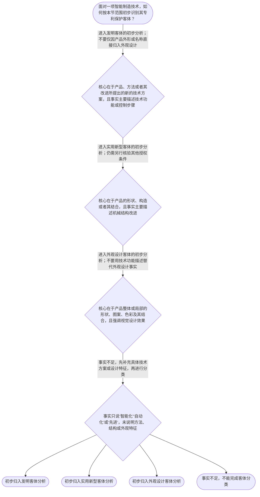

# 专家 A 教学草稿

> 专家：expert_a ｜ 风格：conservative

## 教学模块选择清单

- 当前教学节点：`patent-law-foundation`
- 板块预算：自适应 None/None，总计 9/9

| # | 模块 (block_type) | 类型 | 触发原因 (trigger) | 对应正文段 | 归属 |
|---:|---|:--:|---|---|:--:|
| 1 | `anchor_scenario` | 自适应 | perception=sensing(0.86) / cold_start | 智能制造研发项目中的专利边界｜某智能制造企业研发一套用于汽车焊接产线的机器人工作站：机械臂负责定位，视觉传感器识别工件位置… | [A] |
| 2 | `legal_anchor` | 必选 | mandatory | 法条与制度锚定｜《中华人民共和国专利法》第二条 | [A] |
| 3 | `worked_example` | 自适应 | cognition.apply=0.39<0.4 / cognition.analyze=0.29<0.3 / cold_start | 智能仓储系统的客体拆分｜某公司开发智能仓储搬运系统，包括：一套根据传感器数据规划搬运路径的控制方法；一种改进叉车升降… | [A] |
| 4 | `decision_flow` | 自适应 | input=visual(0.82) | 专利客体识别流程｜面对一项智能制造技术，如何按本节范围初步识别其专利保护客体？ | [A] |
| 5 | `common_pitfall` | 自适应 | weak_points(专利法律制度基础) | 不要把技术先进性当作专利资格｜只要技术属于智能制造、具有较高技术含量，就可以直接申请一项专利，并且专利权会自动覆盖整套设备… | [A] |
| 6 | `reflect_prompt` | 自适应 | processing=reflective(0.67) | 把客体分类带回研发现场｜回想一个你熟悉的智能制造研发成果：它最核心的可保护内容是控制方法、设备结构，还是外观设计？如… | [A] |
| 7 | `assessment` | 必选 | mandatory | 本节三类测评｜识别专利制度三项基本属性的正确表述 | [A] |
| 8 | `knowledge_synthesis` | 必选 | mandatory | 专利法律制度基础知识网｜专利制度基本属性：专利权具有独占性、时间性和地域性，权利不是无期限、无地域限制的绝对控制权。 | [A] |
| 9 | `summary_card` | 自适应 | len(knowledge_sub_nodes)=3>=3 | 专利制度基础速查卡｜先按具体事实识别专利客体，再在专利法制度框架内理解权利的时间、地域和排他边界。 | [A] |

## 教学正文

## I — 法律问题

本节只处理专利法律制度基础：面对智能制造研发成果，如何识别法律保护的对象、理解专利权的基本边界，并建立后续学习新颖性判断和侵权判定所需的制度框架。本节不直接判断某项技术是否具有新颖性，也不对具体侵权责任作结论。

## R — 适用规则

### 1. 专利权的基本属性

专利权的独占性，意味着权利人在法定范围内享有排他性权利；但独占性不能脱离时间性和地域性理解。时间性意味着权利受法定存续期间限制，地域性意味着权利原则上依具体法域产生和行使。检索上下文未提供上述属性的直接法条原文，因此本稿将其作为本节教学上下文明确给出的基础框架，具体期限和例外应核验现行正式文本。

### 2. 中国专利制度的规范层次

本节将中国专利制度理解为一个规范体系：专利法提供基本制度和权利边界，专利法实施细则支持制度运行，专利审查指南用于具体审查标准和操作理解。三者在教学上应当区分层次，不能把指南中的操作性说明简单替代法律条文。检索上下文未提供这些文件的原文，具体条款、版本和适用范围应在正式法律数据库中核验。

### 3. 三类专利保护客体

用户提供的教学上下文明确列出《专利法》第二条：发明是对产品、方法或者其改进所提出的新的技术方案；实用新型针对产品的形状、构造或者其结合提出的实用技术方案；外观设计针对产品的整体或局部形状、图案、色彩及其结合提出的富有美感并适于工业应用的新设计。〔依据：用户提供的本节教学上下文，检索上下文未提供直接原文〕

因此，判断智能制造成果的客体时，应当看请求保护的具体内容，而不是只看“机器人”“智能工厂”或“自动化设备”等行业名称：

- 如果重点是控制步骤、数据处理方法或其技术改进，初步进入发明客体分析；
- 如果重点是设备的形状、构造或结构结合，初步进入实用新型客体分析；
- 如果重点是产品整体或局部的形状、图案、色彩及其结合，初步进入外观设计客体分析。

客体分类只是第一道门槛，不等于已经具备全部授权条件，也不等于已经确定专利保护范围。

### 4. 专利制度的基本作用

本节教学上下文将专利制度的作用概括为激励发明创造、促进技术公开、推动技术应用和经济发展。其核心制度逻辑可以表述为：法律在一定边界内提供排他性保护，同时要求技术信息通过申请文件等制度渠道公开，从而在创新激励与技术传播之间建立制度安排。该作用说明不替代具体法条要件，检索上下文也未提供相关原文，故不进一步扩展法条结论。

### 5. 中国制度发展与审查特点

本节教学上下文指出，中国专利制度具有早期公开、延迟审查，以及初步审查制与实质审查制并存等特点。这些是理解申请和审查流程的入口性框架，不应在本节直接推导具体申请日、公开日、审查请求期限或程序后果。相关历史和现行程序细节需结合正式规范文本核验。

## A — 规则适用

以智能仓储搬运系统为例，若研发成果包含路径规划控制方法、叉车升降机构和机器人外壳图案色彩，应先把事实拆成方法、产品结构和外观设计三个层次。路径规划的事实不能因为依附于机器人设备，就自动变成外观设计；外壳图案色彩也不能因为服务于自动化设备，就当然按照机械结构处理。

进一步地，不能因为成果属于智能制造或具有技术先进性，就直接得出“必然能获得专利”或“专利自动覆盖整套设备”的结论。正确顺序是：先识别具体保护客体，再进入相应的申请与审查框架，最后依具体权利要求或设计内容判断保护边界。由于检索上下文为空，本节不虚构真实裁判案例；上述智能制造情境是教学用假设场景。

本节设有测评，请到【习题】区作答。

## C — 结论

学习专利法的第一步不是先判断技术是否先进，而是先回答三个问题：保护的具体对象是什么，专利权具有什么基本边界，中国专利制度由哪些规范层次共同支撑。对智能制造成果，应分别识别发明、实用新型和外观设计客体；专利权的独占性必须与时间性、地域性同时理解。完成这一基础框架后，才能进入后续的新颖性、创造性、权利要求解释和侵权判定学习。

> 常见误区 / 易混淆点
>
> > “智能制造”是行业标签，不是独立的专利客体类别。
> >
> > 技术先进不等于当然授权；客体分类也不等于已经确定保护范围。
> >
> > 检索上下文未提供直接真实案例材料，不能把假设场景包装成真实裁判案例。

### 智能制造研发项目中的专利边界（anchor_scenario）

> 某智能制造企业研发一套用于汽车焊接产线的机器人工作站：机械臂负责定位，视觉传感器识别工件位置，控制器根据识别结果自动调整焊接路径。研发团队计划申请专利，但成员提出了不同问题：这套技术属于哪一种专利保护客体？授权后权利是否可以永久、全球范围内排他？如果竞争企业在中国制造并销售相同设备，是否当然受到该专利约束？这些问题表面上都谈技术，实质上分别涉及保护客体、专利权边界和专利制度的基本属性。

**锚定**：用智能制造研发事实锚定保护客体、独占性、时间性、地域性以及专利制度体系四个基础概念。

**先想一想**：面对这套智能制造系统，你会先判断‘技术是否先进’，还是先判断‘法律保护的对象、时间和地域边界’？请先说明你的判断顺序。

### 法条与制度锚定（legal_anchor）

- **《中华人民共和国专利法》第二条**：第二条区分了三类专利保护客体：发明是对产品、方法或者其改进提出的新的技术方案；实用新型针对产品的形状、构造或者其结合提出的实用技术方案；外观设计针对产品的整体或局部形状、图案、色彩及其结合提出的富有美感并适于工业应用的新设计。
- **《中华人民共和国专利法》及其实施细则、专利审查指南构成的中国专利制度规范体系**：中国专利制度不是只看一部法律文本，而是以专利法为基础，由实施细则和专利审查指南共同支持申请、审查和保护规则的理解与执行。具体条文内容和现行版本仍应以正式法律数据库核验。

**为何重要**：本节点是后续学习新颖性、创造性、申请程序和侵权判定的总入口。先分清保护客体和制度边界，才能避免把技术先进性、专利授权条件和侵权责任混为一谈。

### 智能仓储系统的客体拆分（worked_example）

**案情/例题**：某公司开发智能仓储搬运系统，包括：一套根据传感器数据规划搬运路径的控制方法；一种改进叉车升降机构的机械结构；以及搬运机器人外壳的特定图案和色彩组合。公司希望用一个‘智能仓储专利’同时覆盖三者。请依据本节已提供的保护客体分类，分析应先如何拆分问题。
**适用规则**：以用户提供的《专利法》第二条关于发明、实用新型和外观设计的区分为基础；关于专利权的期限、地域效力和具体侵权判断，检索上下文未提供直接依据，本例不作具体法条结论。
**分步推演**：
1. 先识别拟保护的技术或设计对象，而不是先根据‘智能’或‘自动化’等名称作结论。路径规划属于方法层面的技术方案，升降机构属于产品结构层面的技术方案，外壳图案和色彩组合属于产品外观层面的设计特征。 → *第一步：按实际保护对象拆分技术事实。*
2. 将路径规划方法与升降机构结构分别放入发明和实用新型的初步分析框架，将外观图案和色彩组合放入外观设计的初步分析框架。这里只是客体分类，不等于已经满足授权条件。 → *第二步：分别对应三类保护客体。*
3. 客体分类完成后，再分别核验每一类的申请要求、审查标准和保护范围；不能因为同一产品属于智能制造设备，就推定其中所有技术和外观只能提交一件或必然获得授权。 → *第三步：把客体分类与后续授权审查区分开。*
**结论**：这是一项教学用假设案例，不是真实裁判案例。根据已提供的第二条信息，控制算法及其改进若以方法技术方案提出，具有作为发明专利客体进行进一步审查的方向；机器人底座的结构改进可能对应实用新型方向；设备外壳的形状、图案和色彩设计可能对应外观设计方向。最终能否授权，仍需分别核验其他法定条件和申请文件。
**本题要点**：先识别保护客体，再进入授权条件和保护范围判断；‘同一设备’不等于‘同一种专利客体’。

### 专利客体识别流程（decision_flow）

**决策问题**：面对一项智能制造技术，如何按本节范围初步识别其专利保护客体？



### 不要把技术先进性当作专利资格（common_pitfall）

**常见误解**：只要技术属于智能制造、具有较高技术含量，就可以直接申请一项专利，并且专利权会自动覆盖整套设备及其所有使用方式。

**为什么错**：专利法首先要求识别具体保护客体，发明、实用新型和外观设计的对象不同。客体分类也不等于已经满足授权条件，更不等于权利范围自动覆盖整套设备；后续还需依据相应规则审查和解释。

**区分判据**：看到‘智能制造’‘人工智能’‘机器人’等行业标签时，先问‘被请求保护的具体对象是什么’：方法或技术方案、产品结构，还是外观视觉特征；行业名称本身不是专利客体类别。

**关联节点**：patent-law-foundation

### 把客体分类带回研发现场（reflect_prompt）

**反思问题**：回想一个你熟悉的智能制造研发成果：它最核心的可保护内容是控制方法、设备结构，还是外观设计？如果成果同时包含多类内容，你会如何分别记录事实？

**关注要点**：区分技术功能、实现步骤、产品结构和视觉外观四类事实；不要用产品名称或行业标签代替具体保护对象；记录事实时同时保留研发时间、公开状态和实施地域，供后续规则判断使用

**连接**：连接到学习者已有的智能制造研发经验，以及本节的‘保护客体分类’和‘专利制度边界’。

### 专利法律制度基础知识网（knowledge_synthesis）

**知识框架**：
- 专利制度基本属性：专利权具有独占性、时间性和地域性，权利不是无期限、无地域限制的绝对控制权。
- 中国专利制度体系：以专利法为基础，并结合专利法实施细则和专利审查指南理解申请、审查与保护规则；具体适用应核验现行正式文本。
- 专利保护客体：发明、实用新型和外观设计是三类不同客体，智能制造产品可能同时包含多类事实，但应分别识别。
- 专利制度作用：通过授予一定边界内的排他性权利换取技术公开，目标包括激励发明创造、促进技术公开、推动技术应用和经济发展。
- 制度发展与审查特点：用户提供的教学上下文指出，中国制度具有早期公开、延迟审查，以及初步审查制与实质审查制并存等特点；具体制度细节需结合现行规范核验。
**概念关系**：先识别保护客体，再确定适用的申请与审查框架。；专利权的独占性必须与时间性、地域性同时理解，不能把独占性理解为永久且全球有效。；制度作用解释了‘公开换保护’的基本逻辑，但制度目标不能替代具体法条要件。
**必记**：专利制度的三项基本属性是独占性、时间性和地域性。；专利法第二条所列三类保护客体是发明、实用新型和外观设计。；同一智能制造设备可以包含不同类型的技术事实，客体分类必须针对具体保护内容，而不是针对行业名称。；检索上下文为空；除本轮输入明确提供的依据外，具体条文版本、历史沿革细节和真实案例结论应在正式法律数据库中进一步核验。

### 专利制度基础速查卡（summary_card）

**要点卡**：
- **三项基本属性**：专利权具有独占性，但同时受时间性和地域性限制。
- **三类保护客体**：发明、实用新型、外观设计分别对应不同的保护对象。
- **客体识别顺序**：先看具体保护内容，再判断属于方法技术方案、产品结构还是外观设计。
- **制度体系**：专利法、实施细则和专利审查指南共同构成理解中国专利制度的重要规范框架。
**必背**：独占性、时间性、地域性；发明、实用新型、外观设计；行业名称不等于专利客体，具体保护内容才是分类依据；检索上下文未提供直接真实案例材料，真实案例引用须另行核验
**一句话总结**：先按具体事实识别专利客体，再在专利法制度框架内理解权利的时间、地域和排他边界。

### 本节三类测评（assessment）

**三类覆盖**：backward_review、forward_probe、weakness_probe
**题目**：
- q_foundation_01：识别专利制度三项基本属性的正确表述
- q_substantive_01：仅探测专利授权实质条件中的基本概念
- q_foundation_02：在智能制造事实中区分发明、实用新型和外观设计客体


## 结构化字段

## knowledge_points

```json
[
  {
    "node_id": "patent-law-foundation",
    "kc_name": "专利制度的基本概念与特征：独占性、时间性、地域性"
  },
  {
    "node_id": "patent-law-foundation",
    "kc_name": "中国专利制度体系：专利法、专利法实施细则、专利审查指南"
  },
  {
    "node_id": "patent-law-foundation",
    "kc_name": "专利保护的三种客体：发明、实用新型、外观设计"
  },
  {
    "node_id": "patent-law-foundation",
    "kc_name": "专利制度的作用：激励发明创造、促进技术公开、推动技术应用和经济发展"
  },
  {
    "node_id": "patent-law-foundation",
    "kc_name": "中国专利制度发展历程与特点：早期公开延迟审查、初步审查制与实质审查制并存"
  }
]
```

## legal_basis

```json
[
  {
    "article": "《中华人民共和国专利法》第二条",
    "source": "用户提供的本节教学上下文"
  },
  {
    "article": "中国专利制度规范体系：专利法、专利法实施细则、专利审查指南",
    "source": "用户提供的本节教学上下文"
  }
]
```

## risks

```json
[
  {
    "risk": "检索上下文为空，无法对具体条文版本、历史沿革细节或真实智能制造裁判案例进行独立核验；本稿仅使用用户输入明确提供的依据，并已对证据边界作出说明。",
    "related_node_id": "patent-law-foundation"
  },
  {
    "risk": "独占性、时间性和地域性属于本节提供的基础概括，具体权利期限、地域效力和例外规则不在本节展开，后续应以现行法条核验。",
    "related_node_id": "patent-rights-nature"
  },
  {
    "risk": "不能将专利审查指南或制度目标表述直接当作独立授权要件；具体审查结论仍需回到相应法条及正式规范文本。",
    "related_node_id": "patent-law-framework"
  }
]
```

## draft_stage

```json
"debate"
```

## irac

```json
{
  "issue": "在智能制造研发成果中，如何识别专利法律制度的基本边界、保护客体和权利属性，为后续新颖性及侵权判定建立共同框架？",
  "rule": "用户提供的《专利法》第二条将专利保护客体区分为发明、实用新型和外观设计。用户提供的本节上下文同时明确：专利制度具有独占性、时间性和地域性，中国制度以专利法、专利法实施细则和专利审查指南为重要规范框架。检索上下文为空，未提供其他法条原文或真实案例依据。",
  "application": "将智能制造场景拆解可见：路径规划属于方法层面的技术事实，机械升降机构属于产品结构层面的技术事实，外壳图案和色彩属于视觉设计事实。因此，不能以‘智能仓储设备’这一产品名称作单一归类，也不能仅因技术先进就推定已经取得或必然取得专利权。关于具体授权、权利期限、侵权成立及真实案例结论，检索上下文未提供直接依据，本稿不作超出本节点的判断。",
  "conclusion": "本节点的基础结论是：先按具体保护内容区分发明、实用新型和外观设计，再在专利法、实施细则和审查指南构成的制度框架内理解申请、审查和保护；专利权的独占性始终受时间性和地域性限制。"
}
```

## interactive_questions

```json
[
  {
    "qid": "q_foundation_01",
    "category": "remember",
    "difficulty": "L1",
    "source_tag": "backward_review",
    "kc_node_id": "patent-law-foundation",
    "question": "下列哪一组最准确地概括专利权的基本属性？",
    "answer": "B",
    "options": [
      "A.独占性、永久性、全球性",
      "B.独占性、时间性、地域性",
      "C.公开性、无偿性、永久性",
      "D.地域性、任意性、无期限性"
    ]
  },
  {
    "qid": "q_substantive_01",
    "category": "remember",
    "difficulty": "L1",
    "source_tag": "forward_probe",
    "kc_node_id": "patentability-substantive",
    "question": "下列关于专利授权实质条件的表述，哪一项正确？本题仅作下一节点的基础探测。",
    "answer": "C",
    "options": [
      "A.只要技术已经实施，就必然具备全部授权条件",
      "B.只有外观设计需要满足授权条件，发明不需要",
      "C.新颖性、创造性和实用性是发明和实用新型授权实质条件中的基本概念",
      "D.授权实质条件只由申请文件页数决定"
    ]
  },
  {
    "qid": "q_foundation_02",
    "category": "analyze",
    "difficulty": "L3",
    "source_tag": "weakness_probe",
    "kc_node_id": "patent-law-foundation",
    "question": "某智能仓储设备同时包含路径规划控制方法、叉车升降机构结构和机器人外壳图案色彩。根据本节关于保护客体的规则，哪项判断最准确？",
    "answer": "D",
    "options": [
      "A.整套智能仓储设备只能归入外观设计客体",
      "B.所有自动控制内容都只能归入实用新型客体",
      "C.产品名称是判断专利客体的唯一依据",
      "D.应根据具体保护内容分别识别：控制方法可能涉及发明，机械结构可能涉及实用新型，外观图案和色彩可能涉及外观设计"
    ]
  }
]
```

## knowledge_synthesis

```json
{
  "node": "patent-law-foundation",
  "coverage": [
    {
      "node_id": "patent-rights-nature"
    },
    {
      "node_id": "patent-law-framework"
    },
    {
      "node_id": "patent-law-foundation"
    },
    {
      "node_id": "patent-system-overview"
    }
  ],
  "confusable_pairs": []
}
```
